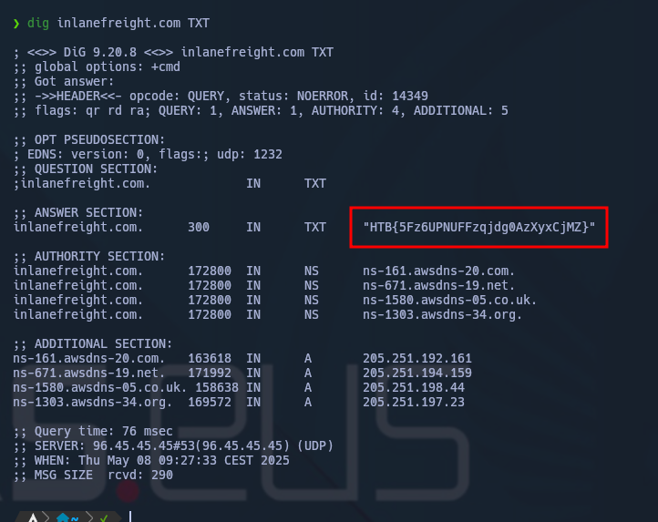
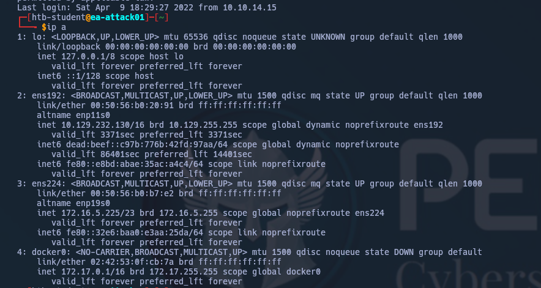
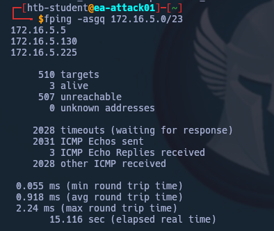
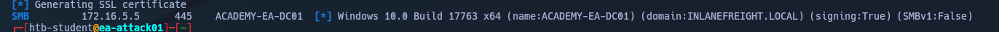
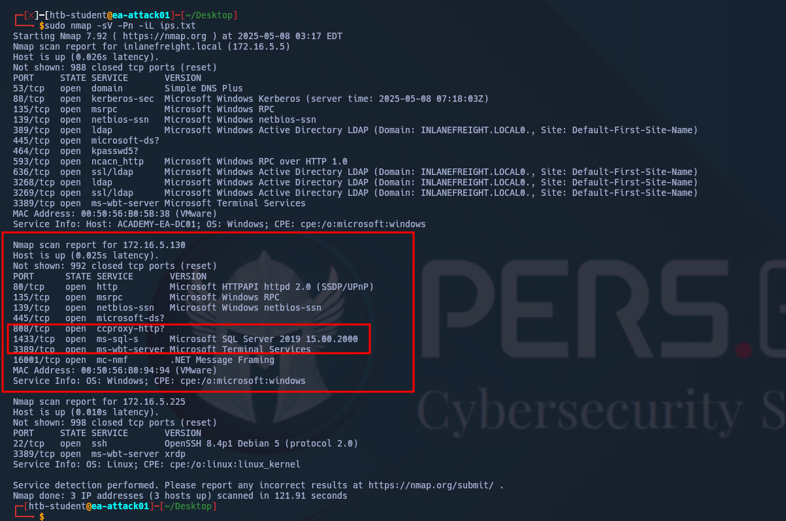

#### Puntos clave de datos

|**Punto de datos**|**Descripción**|
|---|---|
|`AD Users`|Estamos tratando de enumerar cuentas de usuario válidas que podemos apuntar para la pulverización de contraseñas.|
|`AD Joined Computers`|Los ordenadores clave incluyen Controladores de dominio, servidores de archivos, servidores SQL, servidores web, servidores de correo de intercambio, servidores de bases de datos, etc.|
|`Key Services`|Kerberos, NetBIOS, LDAP, DNS|
|`Vulnerable Hosts and Services`|Cualquier cosa que pueda ser una victoria rápida. (también conocido como un anfitrión fácil de explotar y ganar un punto de apoyo)|

---

#### While looking at inlanefreights public records; A flag can be seen. Find the flag and submit it. ( format == HTB{******} )




---
#### From your scans, what is the "commonName" of host 172.16.5.5 ?

Primero nos conectamos por SSH a la máquina Parrot remota con las credenciales que nos facilita HTB y vemos las interfaces locales:



Haciendo uso de **fping** listamos IPs en uso en el rango de la interfaz **ens224**:



Dado que nos interesa saber los commonName de las máquinas activas, utilizamos crackmapexec/netexec para descubrirlos:



Por lo tanto la respuesta es:  ```ACADEMY-EA-DC01.INLANEFREIGHT.LOCAL```

#### What host is running "Microsoft SQL Server 2019 15.00.2000.00"? (IP address, not Resolved name)

Haciendo uso de la enumeración con **fping** anterior, creamos un txt con las IP activas, e iniciamos un escaneo de nmap para descubrir servicios:



En base a los resultados recibidos, la respuesta es: ```172.16.5.130```