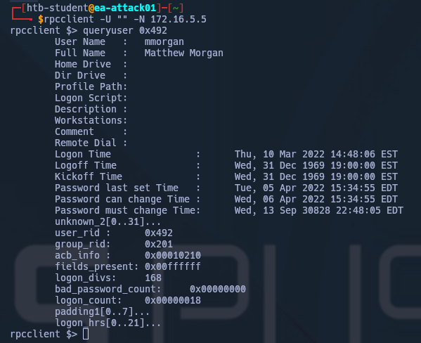
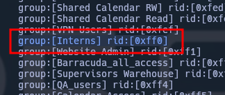
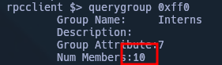
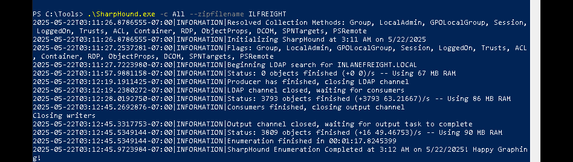
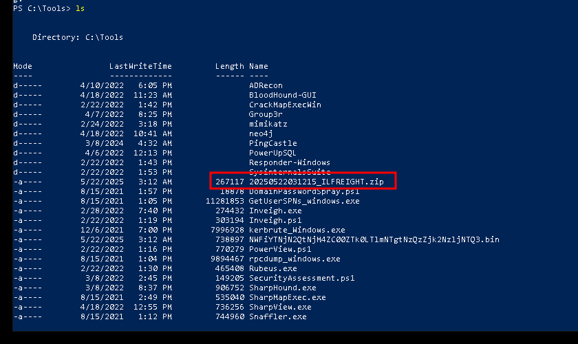
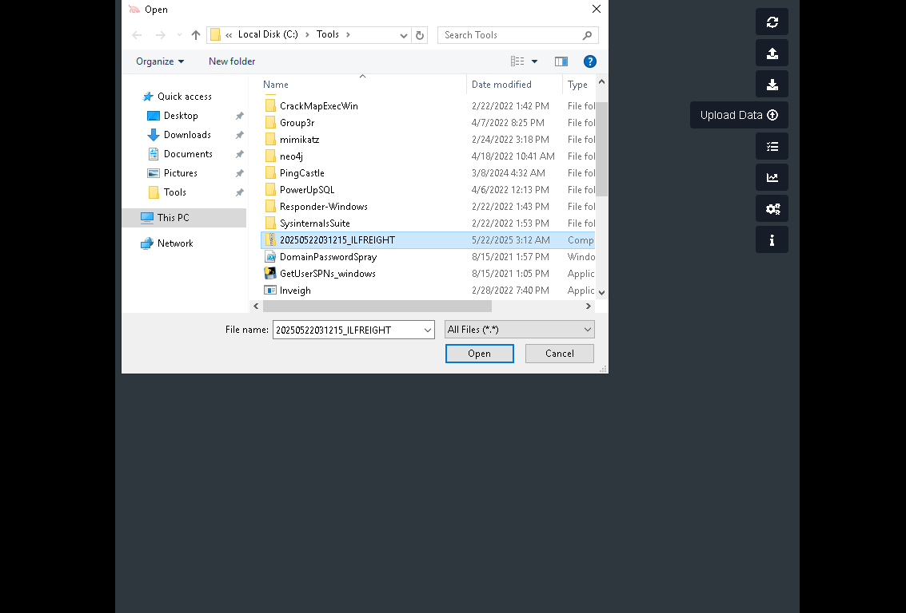
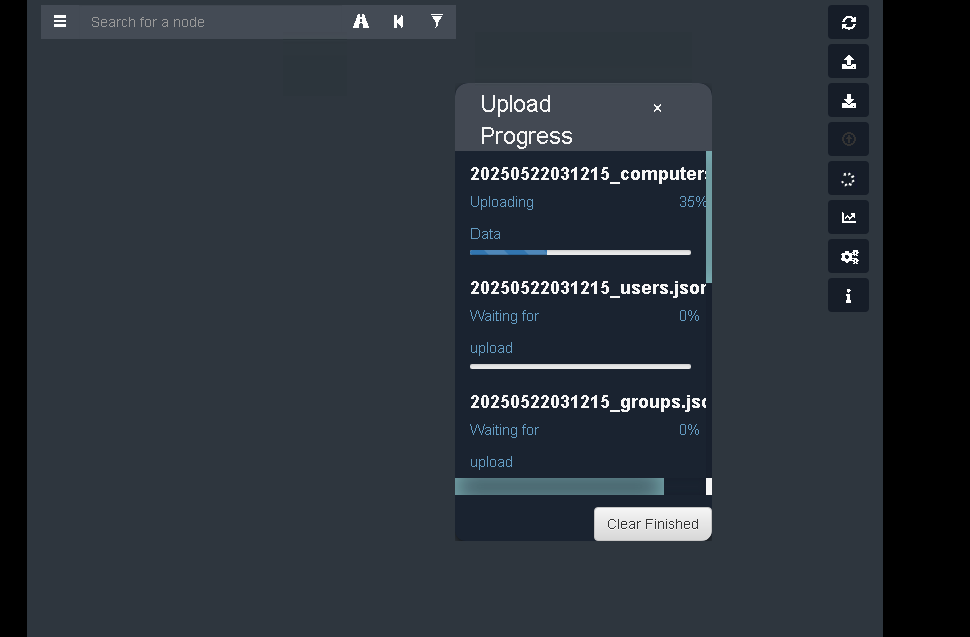
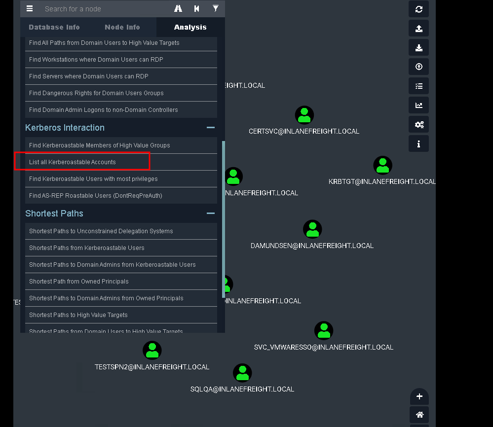
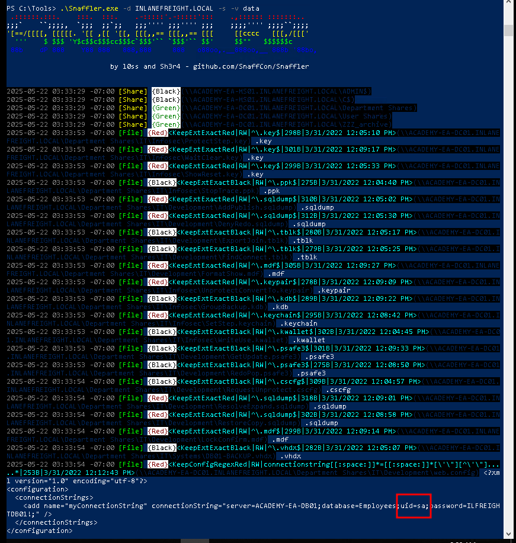
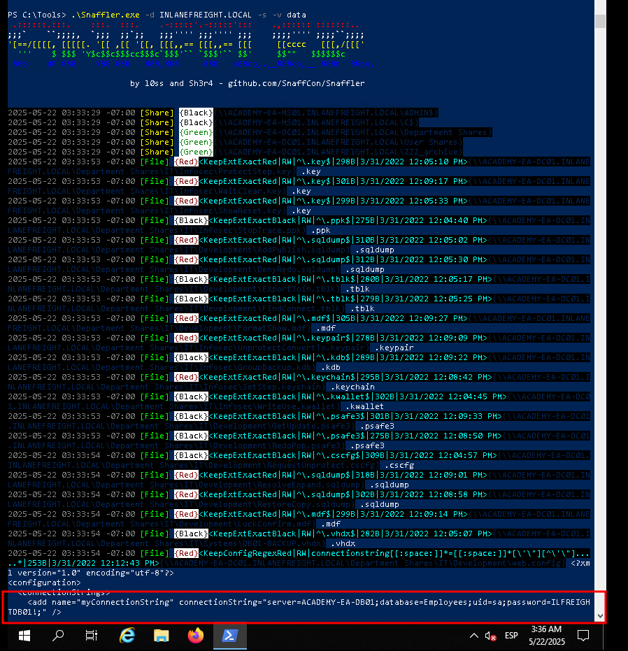

# Desde Linux


## Netexec

Netexec (nxc) es un potente conjunto de herramientas para ayudar a evaluar entornos AD. Utiliza paquetes de los kits de herramientas de Impacket y PowerSploit para realizar sus funciones.

#### menú de ayuda

```bash
nxc -h
usage: nxc [-h] [--version] [-t THREADS] [--timeout TIMEOUT] [--jitter INTERVAL] [--verbose] [--debug] [--no-progress] [--log LOG] [-6]
           [--dns-server DNS_SERVER] [--dns-tcp] [--dns-timeout DNS_TIMEOUT]
           {ftp,ldap,mssql,nfs,rdp,smb,ssh,vnc,winrm,wmi} ...

     .   .
    .|   |.     _   _          _     _____
    ||   ||    | \ | |   ___  | |_  | ____| __  __   ___    ___
    \\( )//    |  \| |  / _ \ | __| |  _|   \ \/ /  / _ \  / __|
    .=[ ]=.    | |\  | |  __/ | |_  | |___   >  <  |  __/ | (__
   / /˙-˙\ \   |_| \_|  \___|  \__| |_____| /_/\_\  \___|  \___|
   ˙ \   / ˙
     ˙   ˙

    The network execution tool
    Maintained as an open source project by @NeffIsBack, @MJHallenbeck, @_zblurx
    
    For documentation and usage examples, visit: https://www.netexec.wiki/

    Version : 1.3.0
    Codename: NeedForSpeed
    Commit  : aa832c5f
    

options:
  -h, --help            show this help message and exit

Generic:
  Generic options for nxc across protocols

  --version             Display nxc version
  -t, --threads THREADS
                        set how many concurrent threads to use
  --timeout TIMEOUT     max timeout in seconds of each thread
  --jitter INTERVAL     sets a random delay between each authentication

Output:
  Options to set verbosity levels and control output

  --verbose             enable verbose output
  --debug               enable debug level information
  --no-progress         do not displaying progress bar during scan
  --log LOG             export result into a custom file

DNS:
  -6                    Enable force IPv6
  --dns-server DNS_SERVER
                        Specify DNS server (default: Use hosts file & System DNS)
  --dns-tcp             Use TCP instead of UDP for DNS queries
  --dns-timeout DNS_TIMEOUT
                        DNS query timeout in seconds

Available Protocols:
  {ftp,ldap,mssql,nfs,rdp,smb,ssh,vnc,winrm,wmi}
    ftp                 own stuff using FTP
    ldap                own stuff using LDAP
    mssql               own stuff using MSSQL
    nfs                 own stuff using NFS
    rdp                 own stuff using RDP
    smb                 own stuff using SMB
    ssh                 own stuff using SSH
    vnc                 own stuff using VNC
    winrm               own stuff using WINRM
    wmi                 own stuff using WMI
```

nxc ofrece un menú de ayuda para cada protocolo (es decir, `nxc winrm -h`, etc.). Asegúrate de revisar todo el menú de ayuda y todas las opciones posibles. Por ahora, las banderas que nos interesan son:

- -u Username `The user whose credentials we will use to authenticate`
- -pa contraseña `User's password`
- Objetivo (IP o FQDN) `Target host to enumerate`(en nuestro caso, el controlador de dominio)
- -usuarios `Specifies to enumerate Domain Users`
- -grupos `Specifies to enumerate domain groups`
- --usuarios-acosados `Attempts to enumerate what users are logged on to a target, if any`

Comenzaremos usando el protocolo SMB para enumerar usuarios y grupos. Apuntaremos al Controlador de Dominio (cuya dirección descubrimos anteriormente) porque contiene todos los datos en la base de datos de dominios que nos interesan.

#### enumerar usuarios

Empezamos señalando a nxc en el Controlador de Dominio y usando las credenciales para el `forend`usuario para recuperar una lista de todos los usuarios de dominio. Observe cuando nos proporciona la información del usuario, incluye puntos de datos como el atributo [badPwdCount](https://docs.microsoft.com/en-us/windows/win32/adschema/a-badpwdcount). Esto es útil cuando se realizan acciones como la pulverización de contraseñas dirigidas. Podríamos construir una lista de usuarios objetivo que filtre a cualquier usuario con su `badPwdCount`atributo por encima de 0 para tener mucho cuidado de no bloquear ninguna cuenta.

```shell
nxc smb 172.16.5.5 -u forend -p Klmcargo2 --users
```

También podemos obtener una lista completa de grupos de dominio. Deberíamos guardar toda nuestra salida a los archivos para acceder fácilmente a ella de nuevo más adelante para reportar o usar con otras herramientas.

```shell
nxc smb 172.16.5.5 -u forend -p Klmcargo2 --groups
```

También podemos usar nxc para atacar a otros huéspedes. Echemos un vistazo a lo que parece ser un servidor de archivos para ver en qué usuarios están conectados actualmente.

```shell
nxc smb 172.16.5.130 -u forend -p Klmcargo2 --loggedon-users
```

Podemos usar el `--shares`Banda para enumerar las acciones disponibles en el host remoto y el nivel de acceso que nuestra cuenta de usuario tiene que compartir (ERE o acceso WRITE). Vamos a ejecutar esto contra el INLANEFREIGHT.LOCAL Domain Controller.

```shell
nxc smb 172.16.5.5 -u forend -p Klmcargo2 --shares
```

A continuación, podemos cavar en las acciones y arañar cada directorio en busca de archivos. El módulo `spider_plus`excavará a través de cada directorio legible en el host y lista todos los archivos legibles.

```shell
nxc smb 172.16.5.5 -u forend -p Klmcargo2 -M spider_plus --share 'Department Shares'
```

---

## SMBMap

SMBMap es ideal por enumerar acciones de pymes de un anfitrión de ataque de Linux. Se puede utilizar para reunir una lista de acciones, permisos y contenidos de acciones si es accesible. Una vez obtenido el acceso, se puede utilizar para descargar y cargar archivos y ejecutar comandos remotos.

Al igual que CME, podemos utilizar SMBMap y un conjunto de credenciales de usuario de dominio para comprobar si hay acciones accesibles en sistemas remotos. Al igual que con otras herramientas, podemos escribir el comando `smbmap``-h`para ver el menú de uso de la herramienta. Además de las acciones de cotización, podemos utilizar SMBMap para enumerar directorios recursivamente, enumerar el contenido de un directorio, contenido de archivos de búsqueda y más. Esto puede ser especialmente útil cuando se saquean acciones para obtener información útil.

#### comprobar acceso

```shell
smbmap -u forend -p Klmcargo2 -d INLANEFREIGHT.LOCAL -H 172.16.5.5
```


#### Lista recursiva de todos los directorios

```shell
smbmap -u forend -p Klmcargo2 -d INLANEFREIGHT.LOCAL -H 172.16.5.5 -R 'Department Shares' --dir-only
```

---

## rpcclient

[rpcclient](https://www.samba.org/samba/docs/current/man-html/rpcclient.1.html) es una útil herramienta creada para su uso con el protocolo Samba y para proporcionar funcionalidad adicional a través de MS-RPC. Puede enumerar, añadir, cambiar e incluso eliminar objetos de EA. Es altamente versátil; sólo tenemos que encontrar el comando correcto para emitir lo que queremos lograr. La página del hombre para rpcclient es muy útil para esto; sólo escriba `man rpcclient`en la cáscara de su anfitrión de ataque y revisar las opciones disponibles. Vamos a cubrir algunas funciones rpcclient que pueden ser útiles durante una prueba de penetración.

Debido a las sesiones SMB NULL (cubiertas en las secciones de pulverización de contraseñas) en algunos de nuestros anfitriones, podemos realizar una enumeración autenticada o no autentticada usando rpcclient en el dominio INLANEFREIGHT.LOCAL. Un ejemplo de uso de rpcclient desde un punto de vista no autententitico (si esta configuración existe en nuestro dominio objetivo) sería:

```bash
rpcclient -U "" -N 172.16.5.5
```

Lo anterior nos proporcionará una conexión encuadernada, y debemos ser recibidos con un nuevo impulso para empezar a liberar el poder de rpcclient.

#### enumeración rpcclient

Mientras observa a los usuarios en rpcclient, puede notar un campo llamado `rid:`al lado de cada usuario. Un [Identificador relativo (RID)](https://docs.microsoft.com/en-us/windows/security/identity-protection/access-control/security-identifiers) es un identificador único (representado en formato hexadecimal) utilizado por Windows para rastrear e identificar objetos. Para explicar cómo esto encaja, veamos los ejemplos a continuación:

- El dominio [SID](https://docs.microsoft.com/en-us/windows/security/identity-protection/access-control/security-identifiers) para el dominio INLANEFREIGHT.LOCAL es: `S-1-5-21-3842939050-3880317879-2865463114`.
- Cuando se crea un objeto dentro de un dominio, el número anterior (SID) se combinará con un RID para hacer un valor único utilizado para representar el objeto.
- Así que el usuario de dominio `htb-student`con un RID:[0x457] Hex 0x457 sería = decimal `1111`, tendrá un usuario completo de SID de: `S-1-5-21-3842939050-3880317879-2865463114-1111`.
- Esto es único en el `htb-student`objeto en el dominio INLANEFREIGHT.LOCAL y nunca verá este valor emparejado ligado a otro objeto en este dominio o en cualquier otro.

Sin embargo, hay cuentas que usted notará que tienen el mismo RID independientemente de lo que el anfitrión está en. Cuentas como el Administrador integrado para un dominio tendrán un Júmeno [administrador] RID:[0x1f4], que, cuando se convierte a un valor decimal, es igual `500`. La cuenta de Administrador incorporada siempre tendrá el valor RID `Hex 0x1f4`- o 500. Siempre será así. Dado que este valor es exclusivo de un objeto, podemos utilizarlo para enumerar más información sobre él desde el dominio. Vamos a intentarlo de nuevo con rpcclient. Vamos a cavar un poco apuntando a la `htb-student`usuario.

#### Enumeración del usuario de RPCClient por RID

```shell
rpcclient $> queryuser 0x457
```

Si quisiéramos enumerar a todos los usuarios para reunir los RIDs para algo más que uno, usaríamos el `enumdomusers`comando.

```shell
rpcclient $> enumdomusers
```

---

#### What AD User has a RID equal to Decimal 1170?

Primero necesitamos convertir el 1170 decimal a hexadecimal con prefijo '0x' para buscar al usuario usando RPC:


Nos conectamos por RPC y enumeramos al usuario 0x492:



Respuesta: `mmorgan`
#### What is the membercount: of the "Interns" group?

Primero enumeramos los grupos para encontrar el necesario:

```rpc
enumdomgroups
```



Enumeramos los atributos del grupo:



Respuesta `10`

---

# Desde Windows

## TTPs

La primera herramienta que exploraremos es el [módulo ActiveDirectory PowerShell](https://docs.microsoft.com/en-us/powershell/module/activedirectory/?view=windowsserver2022-ps). Cuando se aterriza en un host de Windows en el dominio, especialmente uno utiliza un administrador, existe la posibilidad de que encuentre herramientas y scripts valiosos en el host.

---

## ActiveDirectory del módulo PowerShell

El módulo ActiveDirectory PowerShell es un grupo de PowerShell cmdlets para administrar un entorno de Active Directory desde la línea de comandos. Consta de 147 centenos diferentes en el momento de escribir. No podemos cubrirlos todos aquí, pero veremos algunos que son particularmente útiles para enumerar entornos AD. Siéntase libre de explorar otras líneas cmdlets incluidas en el módulo en el laboratorio construido para esta sección, y ver qué interesantes combinaciones y salidas puede crear.

Antes de poder utilizar el módulo, tenemos que asegurarnos de que se importa primero. El [Get-Module](https://docs.microsoft.com/en-us/powershell/module/microsoft.powershell.core/get-module?view=powershell-7.2) cmdlet, que forma parte del [módulo Microsoft.PowerShell.Core](https://docs.microsoft.com/en-us/powershell/module/microsoft.powershell.core/?view=powershell-7.2), listará todos los módulos disponibles, su versión y posibles comandos para su uso. Esta es una gran manera de ver si se instalan algo como Git o los scripts de administrador personalizados. Si el módulo no está cargado, ejecute `Import-Module ActiveDirectory`para cargarlo para su uso.

#### Descubrir los módulos

```powershell
Get-Module
```

#### Cargar módulo ActiveDirectory

```powershell
Import-Module ActiveDirectory
```

#### Obtener información del dominio

```powershell
Get-ADDomain
```


Esto imprimirá información útil como el dominio SID, nivel funcional de dominio, dominios y más. A continuación, usaremos la [Get-ADUser](https://docs.microsoft.com/en-us/powershell/module/activedirectory/get-aduser?view=windowsserver2022-ps) cmdlet. Estaremos filtrando cuentas con la `ServicePrincipalName`propiedad poblada. Esto nos conseguirá una lista de cuentas que pueden ser susceptibles a un ataque Kerberoasting, que cubriremos en profundidad después de la siguiente sección.

#### Get-ADUser

```PowerShell
Get-ADUser -Filter {ServicePrincipalName -ne "$null"} -Properties ServicePrincipalName
```

Otra comprobación interesante que podemos ejecutar utilizando el módulo ActiveDirectory, sería verificar las relaciones de confianza de dominio utilizando el [Get-ADTrust](https://docs.microsoft.com/en-us/powershell/module/activedirectory/get-adtrust?view=windowsserver2022-ps) cmdlet

#### Trust Relationships

```PowerShell
Get-ADTrust -Filter *
```

#### Enumeración de Grupos

```PowerShell
Get-ADGroup -Filter * | select name
```

```powershell
Get-ADGroup -Identity "Backup Operators"
```

```powershell
Get-ADGroupMember -Identity "Backup Operators"
```

---

## PowerView

[PowerView](https://github.com/PowerShellMafia/PowerSploit/tree/master/Recon) es una herramienta escrita en PowerShell para ayudarnos a adquirir conciencia situacional dentro de un entorno AD. Al igual que BloodHound, proporciona una manera de identificar dónde los usuarios están conectados a una red, enumerar información de dominios como usuarios, computadoras, grupos, ACLS, fideicomisos, cazar acciones de archivos y contraseñas, realizar Kerberoasting y más. Es una herramienta altamente versátil que puede proporcionarnos una gran visión de la postura de seguridad del dominio de nuestro cliente. Requiere más trabajo manual para determinar las configuraciones erróneas y las relaciones dentro del dominio que BloodHound pero, cuando se usa bien, puede ayudarnos a identificar sus sutiles configuraciones desconfiguraciones.

|**Comando**|**Descripción**|
|---|---|
|`Export-PowerViewCSV`|Añadir resultados a un archivo CSV|
|`ConvertTo-SID`|Convertir un nombre de Usuario o grupo en su valor SID|
|`Get-DomainSPNTicket`|Pide el billete de Kerberos para una cuenta Especificada Nombre Principal de Servicio (SPN)|
|**Funciones de dominio/LDAP:**||
|`Get-Domain`|Devolverá el objeto AD para el dominio actual (o especificado)|
|`Get-DomainController`|Devuelva una lista de los Controladores de Dominio para el dominio especificado|
|`Get-DomainUser`|Devolverá a todos los usuarios o objetos de usuario específicos en AD|
|`Get-DomainComputer`|Devolverá todos los ordenadores o objetos informáticos específicos en AD|
|`Get-DomainGroup`|Devolverá todos los grupos o objetos de grupo específicos en AD|
|`Get-DomainOU`|Búsqueda de objetos OU específicos en AD|
|`Find-InterestingDomainAcl`|Encuentra objetos ACLs en el dominio con derechos de modificación establecidos a objetos no construidos en objetos|
|`Get-DomainGroupMember`|Devolverá a los miembros de un grupo de dominio específico|
|`Get-DomainFileServer`|Devuelve una lista de servidores que probablemente funcionen como servidores de archivos|
|`Get-DomainDFSShare`|Devuelve una lista de todos los sistemas de archivos distribuidos para el dominio actual (o especificado)|
|**Funciones GPO:**||
|`Get-DomainGPO`|Devolverá todas las GPO o objetos GPO específicos en AD|
|`Get-DomainPolicy`|Devuelve la política de dominio por defecto o la política de controlador de dominios para el dominio actual|
|**Funciones de enumeración de computadoras:**||
|`Get-NetLocalGroup`|Enumera grupos locales en la máquina local o remota|
|`Get-NetLocalGroupMember`|Enumera a los miembros de un grupo local específico|
|`Get-NetShare`|Devuelve las acciones abiertas en la máquina local (o remota)|
|`Get-NetSession`|Devolverá la información de la sesión para la máquina local (o remota)|
|`Test-AdminAccess`|Pruebas si el usuario actual tiene acceso administrativo a la máquina local (o remota)|
|**Hilados 'Meta'-Functions:**||
|`Find-DomainUserLocation`|Encuentra máquinas donde usuarios específicos se registran en|
|`Find-DomainShare`|Encuentra acciones accesibles en máquinas de dominio|
|`Find-InterestingDomainShareFile`|Búsquedas de archivos que coincidan con criterios específicos en las acciones legibles en el dominio|
|`Find-LocalAdminAccess`|Encuentra máquinas en el dominio local donde el usuario actual tenga acceso de administrador local|
|**Funciones de Domain Trust:**||
|`Get-DomainTrust`|Devuelve los fideicomisos de dominio para el dominio actual o un dominio especificado|
|`Get-ForestTrust`|Devuelve todos los fideicomisos forestales para el bosque actual o un bosque específico|
|`Get-DomainForeignUser`|Enumera a los usuarios que se encuentran en grupos fuera del dominio del usuario|
|`Get-DomainForeignGroupMember`|Enumera grupos con usuarios fuera del dominio del grupo y devuelve a cada miembro extranjero|
|`Get-DomainTrustMapping`|Enumeré todos los fideicomisos para el dominio actual y cualquier otro visto.|

Esta tabla no está globalmente compartiendo lo que PowerView ofrece, pero incluye muchas de las funciones que usaremos repetidamente. Para obtener más información sobre PowerView, echa un vistazo al [módulo Active Directory PowerView](https://academy.hackthebox.com/course/preview/active-directory-powerview). A continuación experimentaremos con algunos de ellos.

---

## Snaffler

[Snaffler](https://github.com/SnaffCon/Snaffler) es una herramienta que puede ayudarnos a adquirir credenciales u otros datos sensibles en un entorno de Active Directory. Snaffler trabaja obteniendo una lista de anfitriones dentro del dominio y luego enumerando esos anfitriones para acciones y directorios legibles. Una vez hecho esto, iteraate a través de cualquier directorio legible por nuestro usuario y busca archivos que podrían servir para mejorar nuestra posición dentro de la evaluación. Snaffler requiere que se ejecute desde un host unido a dominio o en un contexto de dominio-usuario.

```bash
Snaffler.exe -s -d inlanefreight.local -o snaffler.log -v data
```

El `-s` le dice que imprima los resultados a la consola para nosotros, el `-d` especifica el dominio para buscar dentro, y el `-o`le dice a Snaffler que escriba resultados a un archivo de registro. El `-v` opción es el nivel de verbosidad. Típicamente `data` es mejor, ya que sólo muestra resultados en la pantalla, por lo que es más fácil empezar a mirar a través de las carreras de herramientas. Snaffler puede producir una cantidad considerable de datos, por lo que normalmente deberíamos salir a archivar y dejar que se ejecuten y luego volver a ellos más adelante. También puede ser útil proporcionar a los clientes la producción de crudo Snaffler como datos complementarios durante una prueba de penetración, ya que puede ayudarles a cero en las acciones de alto valor que deben ser bloqueadas primero.

---

#### Using Bloodhound, determine how many Kerberoastable accounts exist within the INLANEFREIGHT domain. (Submit the number as the answer)











Respuesta: `13`


#### What PowerView function allows us to test if a user has administrative access to a local or remote host?

Respuesta: `Test-AdminAccess`

####  Run Snaffler and hunt for a readable web config file. What is the name of the user in the connection string within the file? 



Respuesta: `sa`

#### What is the password for the database user?



Respuesta: `ILFREIGHTDB01!`

