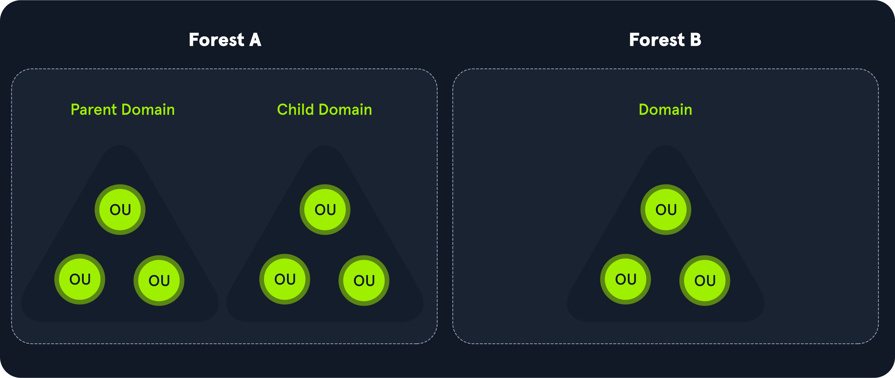

 Active Directory(AD) es un servicio de directorio para entornos de red de Windows. Se trata de una estructura jerárquica distribuida que permite la gestión centralizada de los recursos de una organización, que incluye usuarios, equipos, grupos, dispositivos de red y acciones de archivos, políticas de grupo, servidores y estaciones de trabajo, y confianza de AD proporciona funciones de autenticación y autorización dentro de un entorno de dominio de Windows. 
 
 Fue lanzado por primera vez con Windows Server 2000; ha sido objeto de un ataque creciente en los últimos años. Diseñado para ser compatible con recto, y muchas características no son "seguras por defecto", y se puede configurar mal fácilmente.

Esto se puede aprovechar para moverse lateral y verticalmente dentro de una red y obtener acceso no autorizado. AD es esencialmente una gran base de datos accesible a todos los usuarios dentro del dominio, independientemente de su nivel de privilegio. Una cuenta básica de usuario AD sin privilegios añadidos puede ser utilizada para enumerar la mayoría de los objetos contenidos dentro de AD, incluyendo pero no limitado a:

    Equipos de dominio
    Usuarios de dominio
    Información del Grupo de Dominio
    Política de dominio predeterminado
    Niveles funcionales de dominio
    Política de contraseña
    Objetos de política de grupo (GPO)
    Delegación de Kerberos
     Confianzas de dominio
    Listas de control de acceso (ACLs)

Estos datos pintarán una imagen clara de la postura general de seguridad de un entorno de Directorio Activo. Se puede utilizar para identificar rápidamente las configuraciones erróneas, políticas excesivamente permisivas y otras formas de escalar privilegios dentro de un entorno AD. Muchos ataques existen que simplemente aprovechan las configuraciones erróneas de AD, malas prácticas o mala administración, como:

    Kerberoasting / ASREPRoasting
    NTLM Relaying
    Envenenamiento por tráfico de la red
    Frasocia de contraseña
    Abuso de delegación Kerberos
    Abuso de fiacio de dominio
    Robo enredencial
    Control de objetos

## Estructura de directorio activo

Active Directory se organiza en una estructura jerárquica de árboles, con un bosque en la parte superior que contiene uno o más dominios, que pueden contener subdominios anidados. Un bosque es el **límite** de **seguridad** dentro del cual todos los objetos están bajo control administrativo. Un bosque puede contener múltiples dominios, y un dominio puede contener más niños o subdominios. Un dominio es una estructura dentro de la cual se pueden acceder a objetos contenidos (usuarios, ordenadores y grupos). Los objetos son la unidad de datos más básica en AD.

Contiene muchos incorporados `Organizational Units`(`OU`s), tales como los controladores de dominio, los usuarios, y las computadoras y nuevas `OU`s se puede crear según sea necesario. `OU`pueden contener objetos y sub-OUs, permitiendo la asignación de diferentes políticas de grupo.

