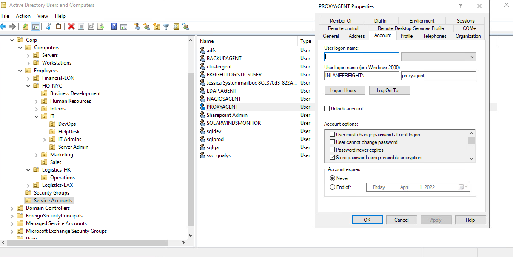

DCSync es una técnica para robar la base de datos de contraseñas de Active Directory mediante el uso de la `Directory Replication Service Remote Protocol`, que es utilizado por los controladores de dominio para replicar datos de dominio. Esto permite a un atacante imitar a un controlador de dominio para recuperar los hashela de contraseña de usuario NTLM.

El quid del ataque está solicitando un controlador de dominio para replicar contraseñas a través de la `DS-Replication-Get-Changes-All` a la derecha extendida. Se trata de un control de acceso extendido justo dentro de AD, que permite la replicación de datos secretos.

Para realizar este ataque, debe tener el control de una cuenta que tiene los derechos para realizar la replicación de dominio (un usuario con los cambios de directorios replicantes y cambios de directorio replicantes Todos los permisos establecidos). Domain/Enterprise Admins y los administradores de dominios predeterminados tienen este derecho por defecto.

Si tuviéramos ciertos derechos sobre el usuario (como [WriteDacl](https://bloodhound.readthedocs.io/en/latest/data-analysis/edges.html#writedacl)), también podríamos añadir este privilegio a un usuario bajo nuestro control, ejecutar el ataque de DCSync, y luego eliminar los privilegios para intentar cubrir nuestras pistas. La replicación de DCSync se puede realizar usando herramientas como Mimikatz, Invoke-DCSync, y Impackets secretsdump.py. Veamos algunos ejemplos rápidos.

Ejecutar la herramienta como se sigue escribirá todos los hashes a los archivos con el prefijo `inlanefreight_hashes`. El `-just-dc`La bandera le dice a la herramienta para extraer hachís NTLM y las teclas Kerberos del archivo NTDS.

#### Extrayendo NTLM Hashes y Kerberos Keys usando secretsdump.py

```shell
secretsdump.py -outputfile inlanefreight_hashes -just-dc INLANEFREIGHT/adunn@172.16.5.5
```

Podemos usar el `-just-dc-ntlm` si sólo queremos hachís de NTLM o especificar `-just-dc-user <USERNAME>` sólo para extraer datos para un usuario específico. Otras opciones útiles incluyen `-pwd-last-set` para ver cuándo se cambió por última vez la contraseña de cada cuenta y `-history`si queremos volcar el historial de contraseñas, que puede ser útil para la grieta de contraseña fuera de línea o como datos suplementarios en métricas de resistencia a la contraseña de dominio para nuestro cliente. El `-user-status` es otra bandera útil para comprobar y ver si un usuario está deshabilitado. Podemos volcar los datos de NTDS con esta bandera y luego filtrar a los usuarios discapacitados al proporcionar a nuestro cliente estadísticas de grietas de contraseña para asegurar que los datos como:

- Número y % de contraseñas agrietadas
- 10 contraseñas
- Mediciones de longitud de contraseña
- Reutilización de contraseña

reflejar sólo cuentas de usuario activas en el dominio.

Si revisamos los archivos creados usando el `-just-dc`, veremos que hay tres: una que contiene los hashs NTLM, una que contiene las teclas Kerberos, y otra que contendría contraseñas de texto claros de la NTDS para cualquier conjunto de cuentas con [cifrado reversible](https://docs.microsoft.com/en-us/windows/security/threat-protection/security-policy-settings/store-passwords-using-reversible-encryption) habilitado.

#### Listado de Hashes, llaves de Kerberos y contraseñas de texto claro

```shell
ls inlanefreight_hashes*
```

Aunque raras, vemos cuentas con estos ajustes de vez en cuando. Normalmente se configuraría para proporcionar soporte para aplicaciones que utilizan ciertos protocolos que requieren que la contraseña de un usuario se utilice para propósitos de autenticación.

#### Ver una cuenta con reversible Set de almacenamiento de contraseña de cifrado reversible



Cuando esta opción se establece en una cuenta de usuario, no significa que las contraseñas se almacenen en texto claro. En su lugar, se almacenan usando cifrado RC4. El truco aquí es que la clave necesaria para descifrarlas se almacena en el registro (el [Syskey](https://docs.microsoft.com/en-us/windows-server/security/kerberos/system-key-utility-technical-overview)) y puede ser extraída por un administrador de dominio o equivalente. Herramientas como `secretsdump.py`descifró cualquier contraseña almacenada usando cifrado reversible mientras se filtra el archivo NTDS como administrador de Dominio o usando un ataque como DCSync. Si esta configuración está deshabilitada en una cuenta, un usuario tendrá que cambiar su contraseña para que se almacene mediante un cifrado de una sola dirección. Cualquier contraseña configurada en las cuentas con esta configuración activa se almacenará mediante cifrado reversible hasta que se cambien. Podemos enumerar esto usando el `Get-ADUser`:

```powershell
Get-ADUser -Filter 'userAccountControl -band 128' -Properties userAccountControl
```


Podemos ver esa cuenta, `proxyagent`, tiene la opción de cifrado reversible con PowerView también:

#### Comprobación de la opción de cifrado reversible usando el usuario de resultados de resultados

```powershell
et-DomainUser -Identity * | ? {$_.useraccountcontrol -like '*ENCRYPTED_TEXT_PWD_ALLOWED*'} |select samaccountname,useraccountcontrol
```

Notaremos la herramienta descifrado la contraseña y nos proporcionamos el valor de texto claro.

Algunos clientes pueden hacer esto para poder volcar NTDS y realizar auditorías periódicas de la fuerza de contraseña sin tener que recurrir a la grieta de contraseña fuera de línea.

Podemos realizar el ataque con Mimikatz también. Usando Mimikatz, debemos dirigirnos a un usuario específico. Aquí nos dirigiremos a la cuenta de administrador incorporada. También podríamos apuntar a la `krbtgt`cuenta y utilizar esto para crear un `Golden Ticket`para la persistencia, pero eso está fuera del alcance de este módulo.

También es importante señalar que Mimikatz debe ser ejecutado en el contexto del usuario que tiene privilegios DCSync. Podemos utilizar `runas.exe`para lograr esto:

#### Usando runas.exe

```cmd
runas /netonly /user:INLANEFREIGHT\adunn powershell
```

Desde la recién engendrada sesión de powerhell, podemos realizar el ataque:

#### Realizando el ataque con Mimikatz

```powershell
.\mimikatz.exe
```

```mimikatz
privilege::debug
```

```mimikatz
lsadump::dcsync /domain:INLANEFREIGHT.LOCAL /user:INLANEFREIGHT\administrator
```


---

#### Perform a DCSync attack and look for another user with the option "Store password using reversible encryption" set. Submit the username as your answer.

respuesta: `syncron`

#### What is this user's cleartext password?

respuesta: `Mycleart3xtP@ss!`

#### Perform a DCSync attack and submit the NTLM hash for the khartsfield user as your answer.

respuesta: `4bb3b317845f0954200a6b0acc9b9f9a`