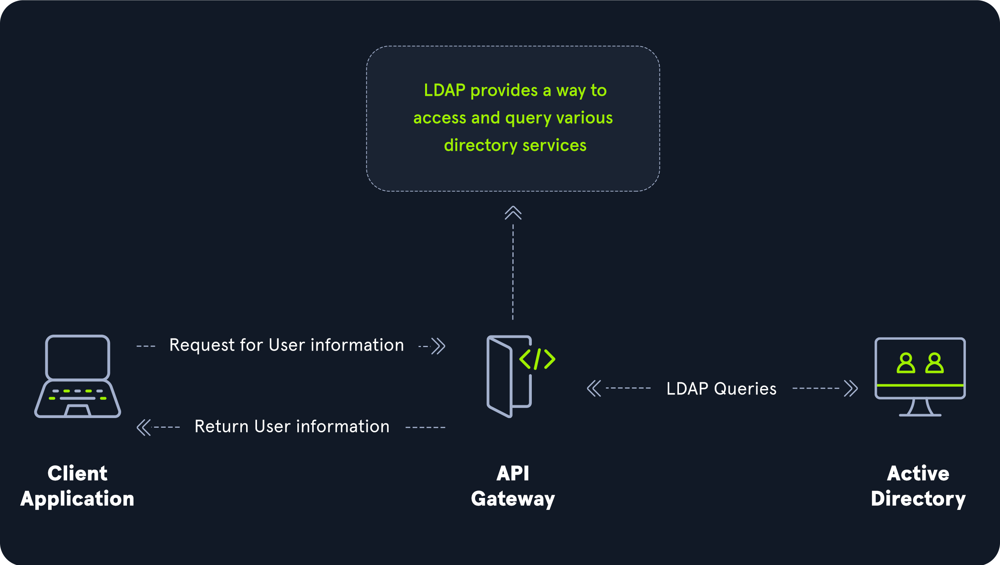

[`Lightweight Directory Access Protocol`(`LDAP`)](https://en.wikipedia.org/wiki/Lightweight_Directory_Access_Protocol) es parte integral de Active Directory (AD). La última especificación LDAP es la versión 3, que se publica como [RFC 4511](https://tools.ietf.org/html/rfc4511). Una comprensión firme de cómo funciona LDAP en un entorno AD es crucial tanto para los atacantes como para los defensores.

`LDAP` es un protocolo de código abierto y multiplataforma utilizado para autenticación contra diversos servicios de directorio (como AD). 

AD almacena información de cuenta de usuario e información de seguridad, como contraseñas y facilita el intercambio de esta información con otros dispositivos de la red. `LDAP` es el idioma que utilizan las aplicaciones para comunicarse con otros servidores que también proporcionan servicios de directorio. En otras palabras, `LDAP` es una forma en que los sistemas en el entorno de la red pueden "hablar" con AD.

`LDAP` comienza por conectarse primero a un servidor `LDAP`, también conocido como `Directory System Agent`. El controlador de dominio en AD escucha activamente solicitudes `LDAP`, como solicitudes de autenticación de seguridad.

## Autenticación AD LDAP

`LDAP`se establece para autenticar las credenciales contra AD utilizando una operación "BIND" para establecer el estado de autenticación para un `LDAP`sesión. Hay dos tipos de `LDAP`autenticación.

1. **Autenticación simple:** Esto incluye autenticación anónima, autenticación no autenticada y autenticación de nombre de usuario/contraseña. La autenticación simple significa que un nombre de usuario y una contraseña crean una solicitud BIND para autenticarse al servidor LDAP.
    
2. **SASL Autenticación:** El marco [de la capa de autenticación y seguridad (SASL)](https://en.wikipedia.org/wiki/Simple_Authentication_and_Security_Layer) utiliza otros servicios de autenticación, como Kerberos, para unirse al servidor `LDAP` y luego utiliza este servicio de autenticación (Kerberos en este ejemplo) para autenticar a `LDAP`. El servidor `LDAP` utiliza el protocolo `LDAP` de envío de un mensaje al servicio de autorización que inicia una serie de mensajes de impugnación/respuesta que dan lugar a una autenticación exitosa o infructuosa. El SASL puede proporcionar más seguridad debido a la separación de los métodos de autenticación de los protocolos de aplicación.
    

Los mensajes de autenticación `LDAP` se envían en texto claro por defecto para que cualquiera pueda olfatear los mensajes LDAP en la red interna. Se recomienda utilizar cifrado TLS o similar para salvaguardar esta información en tránsito.

