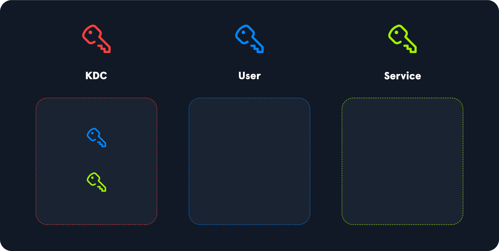
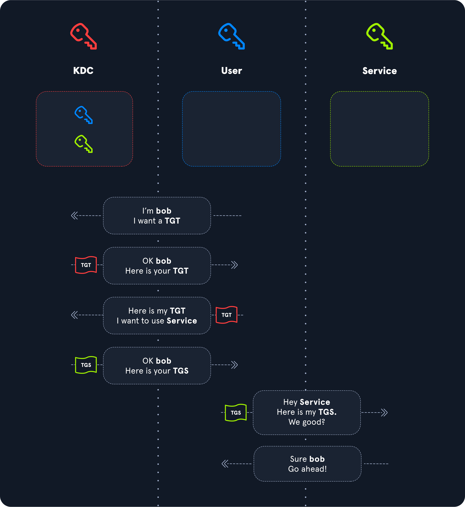
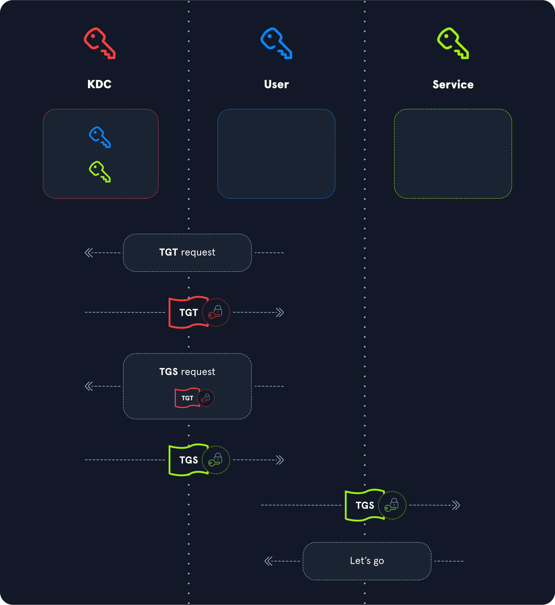
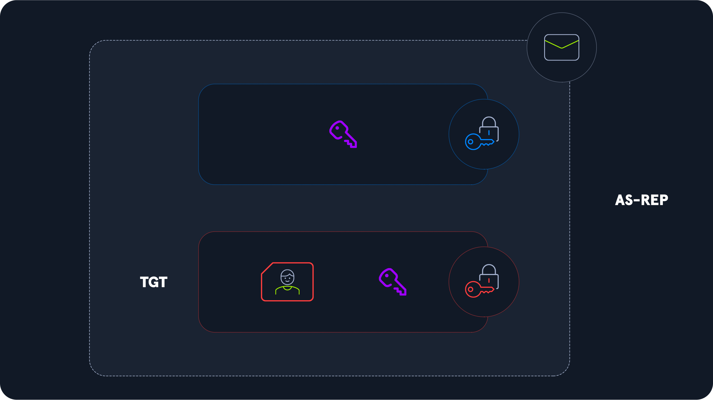
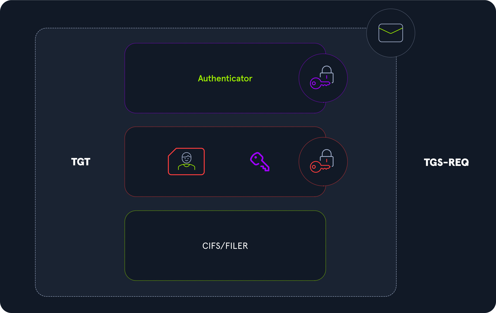
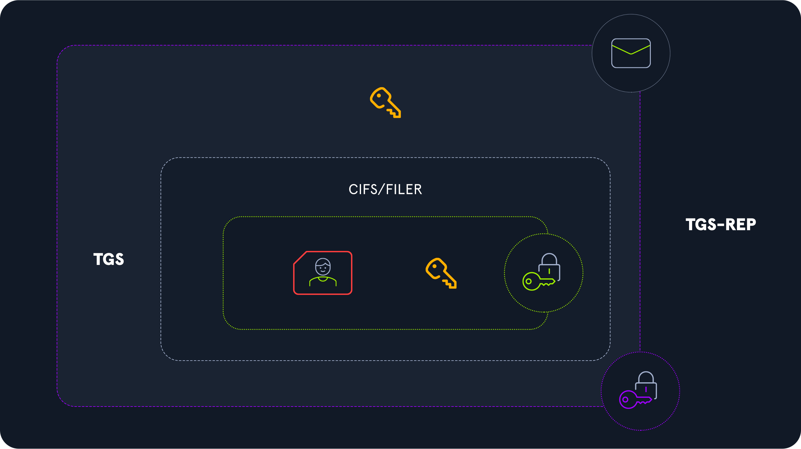
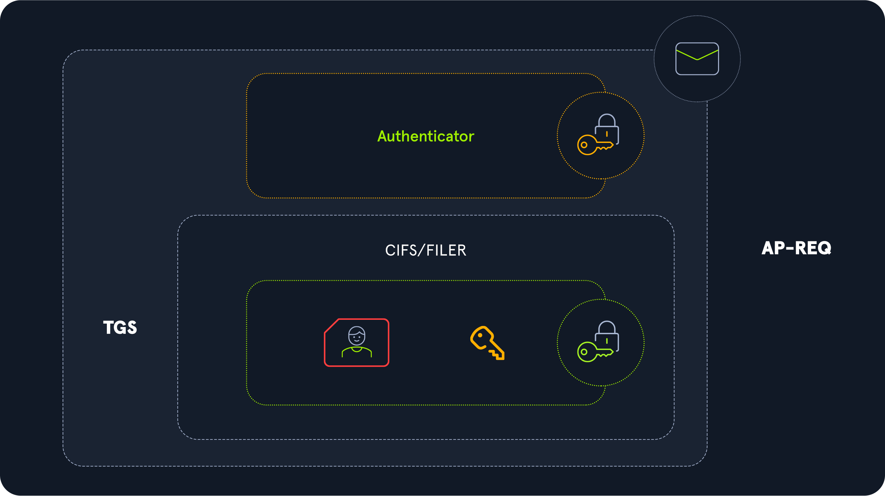

[Kerberos](https://docs.microsoft.com/en-us/windows/win32/secauthn/microsoft-kerberos) es un protocolo que permite a los usuarios autenticar en la red y acceder a los servicios una vez autenticados. Kerberos utiliza el puerto 88 por defecto y ha sido el protocolo de autenticación por defecto para cuentas de dominio desde Windows 2000. Cuando un usuario inicia sesión en su PC, Kerberos se utiliza para autenticarlos. Se utiliza siempre que un usuario quiere acceder a un servicio en la red. Gracias a Kerberos, un usuario no necesita escribir su contraseña constantemente, y el servidor no necesitará conocer la contraseña de cada usuario. Este es un ejemplo de autenticación centralizada.

Kerberos es un protocolo de autenticación apátrida basado en entradas. De hecho desvincula las credenciales de un usuario de sus solicitudes a los recursos consumibles, asegurando que su contraseña no se transmite a través de la red. Es un protocolo [de prueba de conocimiento Cero](https://en.wikipedia.org/wiki/Zero-knowledge_proof). El [Kerberos Key Distribution Center (KDC)](https://docs.microsoft.com/en-us/windows/win32/secauthn/key-distribution-center) no registra transacciones previas; en cambio, los Kerberos `Ticket Granting Service`(`TGS`) se basa en una `Ticket Granting Ticket`(`TGT`). Supone que si un usuario tiene una TGT válida, debe haber probado su identidad.

A un nivel muy alto, cuando un usuario quiere interactuar con los recursos disponibles en la red, se produce lo siguiente:

- Primero pedirán a un servidor centralizado una "tarjeta de identidad".
- A continuación, el usuario tendrá que demostrar quién es, y a cambio, recibirá su "tarjeta de identidad", o [Ticket de Tickets (TGT](https://docs.microsoft.com/en-us/windows/win32/secauthn/ticket-granting-tickets)).
- Esto `TGT`se presentará cuando quiera acceder a un servicio. Así, cada vez que quieran acceder a un servicio, presentarán este DNI, y si es válido, el servidor central proporcionará un boleto temporal para presentar al recurso solicitado.
- Este billete temporal contiene toda la información del usuario, como su nombre, membresía en grupo, etc.
- El recurso recibirá entonces este billete y podrá acceder a sus servicios si el usuario tiene derecho a hacerlo.

Este proceso se lleva a cabo en dos etapas. Primero, a través de una solicitud de entrada para identificar la `TGT`, y luego una solicitud de acceso a los servicios utilizando un `Ticket Granting Service`(`TGS`) billete o `Service Ticket`(`ST`).

> [!NOTE] NOTA
> `Ticket Granting Service (TGS)`es un componente del Centro de Distribución Clave (KDC), que se encarga de la emisión de billetes de servicio.

# Beneficios de Kerberos

Con toda la charla sobre los ataques de Kerberos y los peligros del ataque de las entradas doradas, es fácil pensar que es un protocolo de autenticación inferior. Antes de Kerberos, la autenticación ocurrió `SMB`/`NTLM`, y el hash del usuario se almacenó dentro de la memoria en la autenticación. Si una máquina de destino se comprometiera y el hachís NTLM fuera robado, el atacante podría acceder `anything`que la cuenta de usuario tenía acceso a través de un `Pass-The-Hash`ataque. Como se mencionó anteriormente, los boletos de Kerberos no contienen la contraseña de un usuario y especificarán la máquina a la que accede el ticket.

Es por eso que el [Problema Doble Hop](https://posts.specterops.io/offensive-lateral-movement-1744ae62b14f?gi=f925425e7a42) existe al acceder a las máquinas de forma remota a través de `WinRM`. Cuando se utiliza un protocolo no Kerberos para acceder a una máquina de forma remota, es posible utilizar esa conexión para acceder a otras máquinas como ese usuario sin volver a prepararse para la autenticación porque el hash `NTLM` de contraseña está ligado a esa sesión. Con la autenticación de Kerberos, las credenciales deben ser específicas para cada máquina a la que quieran acceder porque no hay contraseña. Para más información sobre este tema, consultar la sección [de problemas de Kerberos "Double Hop"](https://academy.hackthebox.com/module/143/section/1573) deL módulo `Active Directory Enumeration & Attacks`.

Supongamos que una máquina comprometida con sesiones activas se autentica a través de Kerberos. En ese caso, realizando un ataque `Pass-The-Ticket` es posible, que se explicará y demostrará más adelante en este módulo. Sin embargo, a diferencia de `Pass-The-Hash` atacante se limitará a los recursos contra los que la víctima autenticó. Además, estos tickets tienen toda la vida, lo que significa que el atacante tiene una ventana de tiempo limitada para acceder a los recursos y tratar de establecer la persistencia.

# Proceso de Autenticación

En el contexto de Kerberos, hay 3 entidades en las que un usuario quiere acceder a un servicio: `User`, `Service` y servidor de autenticación, conocido como `KDC` (Key Distribution Center).

Desde una perspectiva de alto nivel, así es como un usuario puede acceder a un servicio.

1. Para empezar, el usuario solicitará el primer ticket al servidor clave (el KDC), demostrando que es quien dice ser. Aquí es cuando el cliente se autentica en el `KDC`. Este ticket, llamado `TGT`(Ticket Granting Ticket), es la tarjeta de identidad del usuario. Contiene toda la información sobre el usuario, como nombre, fecha de creación de cuenta, información de seguridad sobre el usuario, los grupos a los que pertenece el usuario, etc. Esta tarjeta de identidad, se limita a unas pocas horas por defecto. Este ticket se presenta para todas las demás solicitudes en el KDC.
2. Una vez obtenido este TGT, el usuario lo presentará al KDC cada vez que necesite acceder a un servicio. El KDC verificará entonces que el TGT presentado es válido y que el usuario no lo falsificó, y en caso afirmativo, devolverá al usuario un ticket `TGS` (Ticket Granting Service) o `ST`(Service Ticket). Una copia de la información del usuario en la TGT está incluida en el ticket TGS.
3. Ahora que el usuario tiene un ticket TGS para un servicio particular, presentará este ticket TGS al servicio para usarlo. A continuación, el servicio comprobará la validez de este ticket, y si todo está bien, leerá el contenido de la información del usuario para determinar si el usuario tiene derecho a utilizar el servicio solicitado. Por lo tanto, es el servicio que verifica los permisos de acceso del usuario.

Esta información proporcionada por la KDC debe ser protegida. El usuario no debe ser capaz de forjarlo. Aquí es donde entran en juego las claves de cifrado.

Cada cuenta tiene una contraseña o secreto, que actúa como una clave de cifrado y descifrado. La KDC conoce las claves de todos los usuarios. Para proteger los billetes, aquí está cómo se utilizan estas llaves.

1. El ticket `TGT` enviado por la KDC al usuario está cifrado utilizando el secret-key del KDC, que sólo el KDC conoce. Por lo tanto, el usuario no puede leer o modificar la información sobre sí mismo. El propio KDC lo protege.
2. El ticket `TGS`enviado por la KDC al usuario está cifrado utilizando el secret-key del servicio . De la misma manera, como el usuario no conoce la clave del servicio, no puede modificar la información en el ticket `TGS`. Por otro lado, cuando envían el `TGS` al servicio, este último puede descifrar el contenido del ticket y leer la información del usuario.

## Detalles técnicos

Ahora entraremos en detalles para entender cómo el proceso de autenticación encaja todos juntos y los mecanismos de protección que utiliza contra numerosos ataques. Hemos visto que el acceso a un servicio se lleva a cabo en tres fases. Estas fases se nombran de la siguiente manera:

1. Solicitud TGT: Servicio de Autenticación (AS)
2. TGS Solicitud: Servicio de Gestión de Entradas (TGS)
3. Solicitud de servicio: Solicitud de Solicitud (AP)

El cliente envía una solicitud en cada fase, y el servidor responde. Vamos a describir cómo funcionan estos tres intercambios, cómo se protegen las entradas, y con qué clave.

---

# Servicio de autenticación (AS)

## Solicitud (AS-REQ)

Primero, el usuario realiza una solicitud de TGT (o tarjeta de identidad). Esta petición se llama `AS-REQ`. Pero para recibir la TGT, deben ser capaces de probar su identidad. Esta solicitud se hace al KDC (que es el controlador de dominio en un entorno de Directorio activo). La KDC tiene todas las claves de usuario.

Para demostrar su identidad, el usuario enviará un `authenticator`. Es la marca de tiempo actual que el usuario cifrará con su clave. El nombre de usuario también se envía en texto claro para que el KDC pueda saber con quién está tratando.

Al recibir esta solicitud, la KDC recuperará el nombre de usuario, buscará la clave asociada en su directorio e intentará descifrar el autentilador. Si tiene éxito, significa que el usuario ha utilizado la misma clave que la registrada en su base de datos, por lo que está autenticado. De lo contrario, la autenticación falla.

Este paso, llamado `pre-authentication`, no es obligatorio, pero todas las cuentas deben hacerlo `by default`. Sin embargo, hay que señalar que un administrador puede desactivar la preautenticación. En este caso, el cliente ya no necesita enviar un autenticador. La KDC enviará la TGT pase lo que pase. Hablaremos de esto en otra sección.

## Respuesta (AS-REP)

La KDC, por lo tanto, recibió la solicitud del cliente de un TGT. Si la KDC descifra con éxito el autenticador (o si la preautnticación está deshabilitada para el cliente), envía una respuesta llamada `AS-REP`al usuario.

Para proteger el resto de los intercambios, la KDC generará una `temporary session key`antes de responder al usuario. El cliente utilizará esta clave para más intercambios. La KDC evita cifrar toda la información con la clave del usuario. Antes declaramos que Kerberos es un protocolo sin estado, por lo que el KDC no almacenará la clave de esta sesión en ninguna parte.

Hay dos elementos que encontraremos en la respuesta AS-REP:

1. Primero, estamos esperando la `TGT`que el usuario solicitó. Contiene toda la información del usuario y está protegido con la clave del KDC, por lo que el usuario no puede manipularla. También contiene un `copy`de la `generated session key`.
2. Segundo es el `session key`Pero esta vez `protected`con el `user's key`.

# Servicio de Gestión de Entradas (TGS)

El Servicio de Gestión de Entradas es un componente del Centro de Distribución Clave (KDC) que se encarga de emitir boletos de servicio.

Típicamente hospedado en un controlador de dominio Active Directory. Cuando un usuario o computadora solicita un ticket de servicio, la solicitud se envía al componente TGS de la KDC, que verifica la identidad del usuario o del ordenador y comprueba su autorización para acceder al recurso solicitado antes de emitir un ticket de servicio que pueda ser utilizado para acceder al recurso.

## Solicitud (TGS-REQ)

El cliente tiene ahora una respuesta del servidor a su solicitud TGT. Esta respuesta contiene la TGT, protegida por la clave de la KDC, y una clave de sesión, protegida por la clave del cliente/usuario. A continuación, puede descifrar esta información para extraer esta clave de sesión temporal.

El siguiente paso para el usuario es solicitar un ticket de servicio `ST`o o `TGS ticket`con un `TGS-REQ`mensaje. Para ello, transmitirán tres cosas a la KDC:

1. El nombre del servicio al que desean acceder (SERVICE/HOST, que es la representación de Nombre Principal de Servicio (SPN))
2. La TGT que previamente recibieron, que contenía su información y una copia de la clave de la sesión
3. Un autenticador, que será cifrado usando la clave de la sesión en este momento

## Respuesta (TGS-REP)

La KDC recibe esta petición TGS, pero Kerberos es un protocolo apátrida. Por lo tanto, la KDC no tiene idea de la información que se ha intercambiado antes. Aún debe verificar que la solicitud de TGS es válida. Debe verificar que el autenticador ha sido cifrado con la clave de sesión correcta para hacerlo. Y cómo sabe la KDC si la clave de sesión utilizada es correcta? Recuerde que hubo una copia de la clave de la sesión en la TGT. La KDC descifrará la TGT (comprobando su autenticidad a lo largo del camino) y extraerá la clave de la sesión. Con esta clave de sesión, podrá verificar la validez del autenticador.

Si todo esto se hace correctamente, el KDC sólo tiene que leer el servicio solicitado y responder al usuario con un `TGS-REP`mensaje. Antes vimos que se había generado una clave de sesión para los intercambios entre el usuario y la KDC. Bueno, aquí es lo mismo. Se genera una nueva clave de sesión para futuros intercambios entre el usuario y el servicio. Y como antes, esta clave de sesión estará presente en dos lugares en la respuesta enviada por la KDC al usuario. Aquí están todos los elementos enviados por la KDC:

Un billete de servicio o un billete TGS que contiene tres elementos:

1. El nombre del servicio solicitado (su SPN)
2. Una copia de la información del usuario que estuvo presente en la TGT. El servicio leerá esta información para determinar si el usuario tiene o no el derecho de usarla.
3. Una copia de la clave de la sesión

Toda esta información está cifrada con la clave de sesión de usuario/KDC. Dentro de esta respuesta cifrada, la información del usuario y la copia de la clave de sesión de usuario/servicio también se cifran con la clave del servicio. Un diagrama ayudará a aclarar esto.

# Solicitud de solicitud (AP)

## Solicitud (AP-REQ)

El usuario ahora puede descifrar esta respuesta para extraer la clave de sesión de usuario/servicio y el ticket TGS, pero el ticket TGS está protegido con la clave del servicio. El usuario no puede modificar este ticket TGS, por lo que no puede modificar sus derechos, al igual que con la TGT.

El usuario sólo transmitirá este ticket TGS al servicio, y al igual que con la solicitud TGS, se le añade un autenticador. Con qué el usuario cifrará este autenticador? Lo adivinaste, con la clave de sesión de usuario/servicio que acaba de extraer. El proceso es muy similar a la petición anterior de TGS.

## Respuesta (AP-REP)

El servicio finalmente recibe el ticket TGS y un autenizador cifrado con la clave de sesión de usuario/servicio generada por la KDC. Este billete TGS está protegido con la clave del servicio para que pueda descifrarla. Recuerde que una copia de la clave de sesión de usuario/servicio está incrustada dentro del ticket TGS, por lo que puede extraerlo y comprobar la validez del autenticador con esta clave de sesión.

Si todo va correctamente, el servicio finalmente puede leer la información sobre el usuario, incluidos los grupos a los que pertenecen, y de acuerdo con sus normas de acceso, conceder o denegarles el acceso al servicio. Si la autenticación tiene éxito, el servicio responde al cliente con un `AP-REP`mensaje al cifrar la marca de tiempo con la clave de sesión extraída. El cliente puede verificar que este mensaje viene del servicio y puede comenzar a emitir solicitudes de servicio.

# Kerberos Attacks Overview

---

Now that we've covered the basic principles of Kerberos, we'll dive into the exploitation and dissection of specific weaknesses or opportunities offered by this protocol.

For example, we will highlight attacks related to ticket requests, ticket forging, and delegation. We will also see that performing user reconnaissance using this protocol and even password spraying to find some accounts' passwords is possible.

---

# Ticket Request Attacks

Hay dos maneras de solicitar un ticket:

- TGT request, o `AS-REQ`, a lo que el KDC responde con un `AS-REP`
- TGS Solicitud, o `TGS-REQ`, a la que la KDC responde con una `TGS-REP`

## AS-REQ Roasting

Al solicitar un TGT (AS-REQ), vimos que `by default`, un usuario debe autenticarse a través de un `authenticator`encriptados con su secreto. Sin embargo, si un usuario tiene discapacidad de preautend, podríamos solicitar datos de autenticación para ese usuario, y la KDC devolvería un mensaje AS-REP. Dado que parte de ese mensaje (la clave de sesión temporal compartida) está cifrada usando la contraseña del usuario, es posible realizar un ataque de fuerza bruta fuera de línea para tratar de recuperar la contraseña del usuario.

## Kerberoasting

Del mismo modo, cuando un usuario tiene una TGT, puede solicitar un billete de servicio para cualquier servicio existente. La respuesta de KDC (TGS-REP) contiene información cifrada con el secreto de la `service account`. Si la cuenta de servicio tiene una contraseña débil, es posible realizar el mismo ataque fuera de línea para recuperar la contraseña de esa cuenta.

---

# Kerberos Delegation Attacks

[La Delegación Kerberos](https://blog.netwrix.com/2021/11/30/what-is-kerberos-delegation-an-overview-of-kerberos-delegation) permite un servicio para hacerse pasar por un usuario para acceder a otro recurso. La autenticación se delega, y el recurso final responde al servicio como si tuviera los derechos del primer usuario. Hay diferentes tipos de delegación, cada uno con debilidades que pueden permitir a un atacante hacerse pasar por usuarios (a veces arbitrarios) para aprovechar otros servicios. Cubriremos los siguientes ataques que abusan de Kerberos: `unconstrained delegation`, `constrained delegation`, y `resource-based constrained delegation`.

---

# Ticket Forging Attacks

Las entradas están protegidas con secretos para evitar la falsificación de billetes arbitrarios (el TGT está protegido con la clave KDC, y el billete TGS está protegido con la clave de la cuenta de servicio). Si un atacante se apodera de una de estas llaves, puede falsificar entradas arbitrarias para acceder a servicios con derechos arbitrarios. Las siguientes secciones describen estos dos ataques: Billete de Plata para la forja TGS y Boleto de Oro para la forja TGT.

---

# Recon and Password Spraying

Por último, es posible enumerar usuarios y probar contraseñas usando el protocolo Kerberos. Si pedimos un TGT para un usuario específico, el servidor responderá de manera diferente dependiendo de la existencia del usuario en su base de datos. De la misma manera, al cifrar el autenticador con diferentes contraseñas, es posible comprobar si la contraseña es válida para el usuario elegido.

---