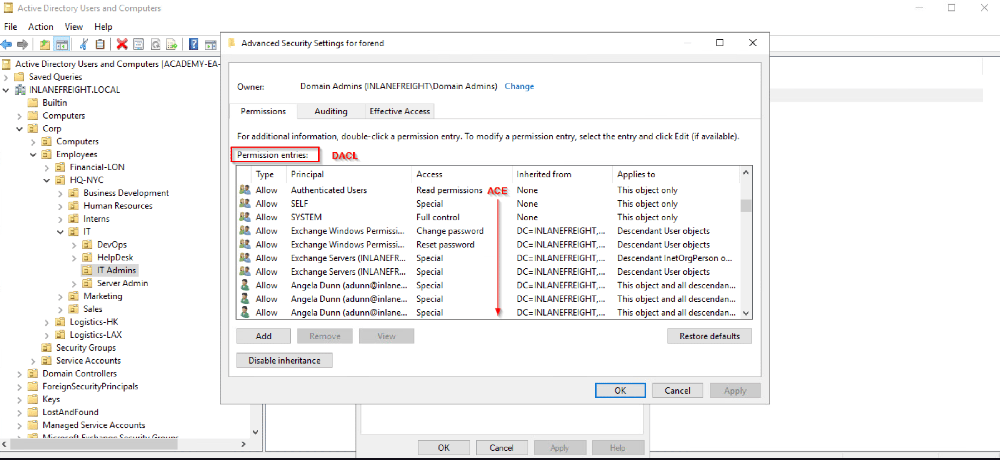

Dentro del ecosistema de seguridad de Windows, `tokens`y `security descriptors` son las dos variables principales de la ecuación de seguridad. Mientras que `tokens` identifica el contexto de seguridad de un proceso o un hilo, `security descriptors` contiene la información de seguridad asociada a un objeto. Para lograr la confidencialidad de la triada `CIA`, muchos sistemas operativos y servicios de directorios utilizan `access control lists`(`ACLs`), "un mecanismo que implementa el control de acceso para un recurso de sistema enumerando las entidades del sistema que están autorizadas a acceder al recurso y declarando, implícita o explícitamente, los modos de acceso concedidos a cada entidad", según [RFC4949](https://datatracker.ietf.org/doc/html/rfc4949).

Las políticas de control de acceso dictan qué tipos de acceso están permitidos, en qué circunstancias y por quién. Las cuatro categorías generales de políticas de control del acceso son `Discretionary access control`(`DAC`), `Mandatory access control`(`MAC`), `Role-based access control`(`RBAC`), y `Attribute-based access control`(`ABAC`).

`DAC`, el método tradicional de aplicación del control de acceso, controla el acceso basado en la identidad del solicitante y las normas de acceso que indiquen lo que se permiten (o no) hacer. Es discrecional porque una entidad podría tener derechos de acceso que le permitan, por voluntad propia, permitir que otra entidad pueda acceder a algún recurso; esto contrasta con `MAC`, en el que la entidad que tenga acceso a un recurso no podrá, sólo por voluntad propia, permitir a otra entidad acceder a ese recurso. Windows es un ejemplo de un `DAC`sistema operativo que utiliza `Discretionary access control lists`(`DACLs`).

La imagen de abajo muestra el `DACL`/ `ACL` para la cuenta de usuario `forend` en `Active Directory Users and Computers`(`ADUC`). Cada artículo en la partida `Permission entries` lo hace. `DACL` para la cuenta de usuario. En contraste, las entradas individuales (como `Full Control`o o `Change Password`) son `Access Control Entries`(`ACEs`) mostrar los derechos de acceso concedidos sobre este usuario se oponen a diversos usuarios y grupos.

## Descriptores de seguridad

En Windows, cada objeto (también conocido como [objetos securables](https://learn.microsoft.com/en-us/windows/win32/secauthz/securable-objects)) tiene un `security descriptor`estructura de datos que especifica quién puede realizar qué acciones en el objeto. El `security descriptor`es una estructura binaria de datos que, aunque puede variar en longitud y contenido exacto, puede contener seis campos principales:

- `Revision Number`: El `SRM`(`Security Reference Monitor`) versión del modelo de seguridad utilizado para crear el descriptor.
- `Control Flags`: Modificadores opcionales que definen el comportamiento/característica del descriptor de seguridad.
- `Owner SID`: El propietario del objeto `SID`.
- `Group SID`: El grupo principal del objeto `SID`. Sólo el subsistema [Windows POSIX](https://en.wikipedia.org/wiki/Microsoft_POSIX_subsystem) utilizó este miembro (antes de ser [discontinuado](https://social.technet.microsoft.com/wiki/contents/articles/10224.posix-and-unix-support-in-windows.aspx)), y la mayoría de los entornos AD ahora lo ignoran.
- `Discretionary access control list`(`DACL`): Especifica quién tiene el acceso al objeto - a lo largo de la `DACL Attacks`, nuestro enfoque principal será abusar y atacarlos.
- `System access control list`(`SACL`): Especifica qué operaciones por las que los usuarios deben registrarse en el registro de auditoría de seguridad y el nivel de integridad explícita de un objeto.

Internamente, Windows representa un `security descriptor`a través de la [estructura de SEGURIDAD-DESCRIPTOR:](https://learn.microsoft.com/en-us/windows/win32/api/winnt/ns-winnt-security_descriptor)

