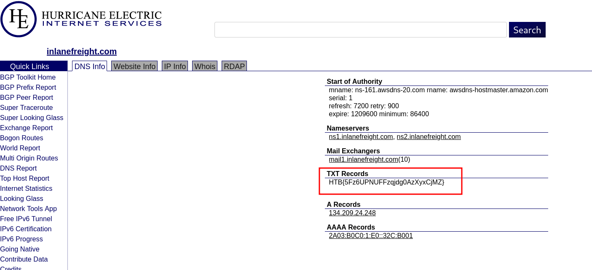
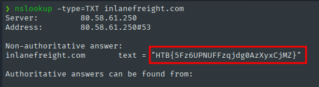
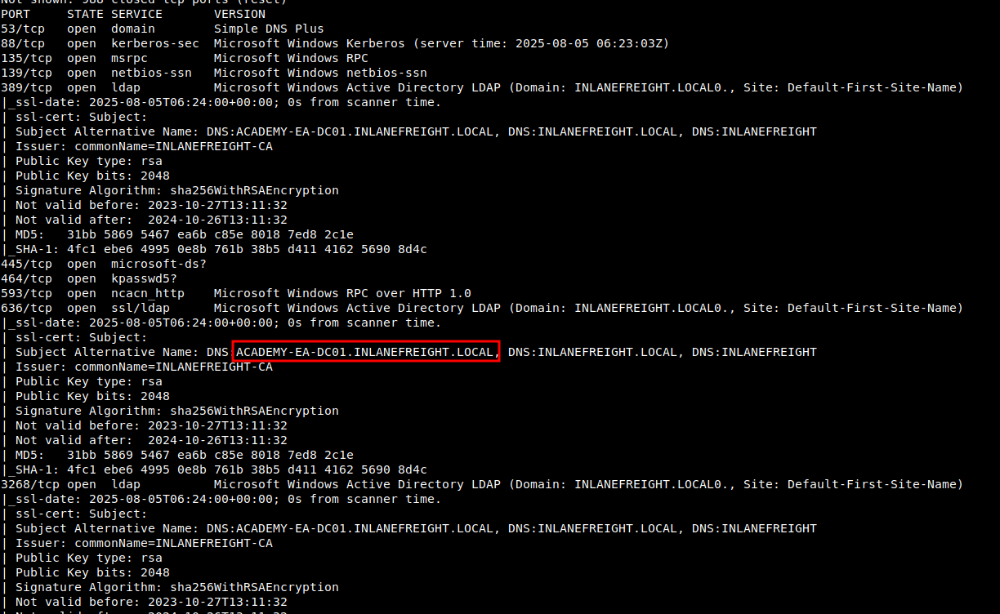
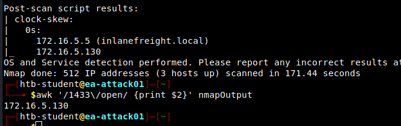

# External Recon and Enumeration Principles

### "While looking at Inlanefreight's public records; A flag can be seen. Find the flag and submit it. (format == HTB{******} )"

Existen diversas formas para encontrar la flag:

1. Podemos hacer uso de [Hurricane Electric](https://bgp.he.net/).



2. Utilizar `nslookup` especificando `TXT` como tipo de dato:


```shell
nslookup -type=TXT inlanefreight.com
```



3. Utilizar `dig` especificando `TXT` como tipo de dato:


Respuesta: `HTB{5Fz6UPNUFFzqjdg0AzXyxCjMZ}`

# Initial Enumeration of the Domain

### "From your scans, what is the "commonName" of host 172.16.5.5 ?"

Nos conectamos por `SSH` a la `IP` dada por htb utilizando las credenciales que nos dicen, y utilizamos esa conexión segura como máquina de salto para poder encontrar la respuesta.

Realizamos un `nmap` sobre el host `172.16.5.5`. Donde encontraremos que `ssl-cert` posee el `fully cualified name`.


```shell
sudo nmap -A -Pn 172.16.5.5
```



Respuesta: `ACADEMY-EA-DC01.INLANEFREIGHT.LOCAL`

### "What host is running "Microsoft SQL Server 2019 15.00.2000.00"? (IP address, not Resolved name)"


Utilizando la misma conexión por `SSH` establecida anteriormente, escaneamos servicios con `nmap` sobre `172.16.5.0/23` guardando la salida en formato grepeable "`-oG`".

```shell
sudo nmap -A -Pn -T5 -oG nmapOutput 172.16.5.0/23
```

Al tener la respuesta del escaneo en formato grepeble, podemos filtrar la salida de forma que podamos obtener solo el host con el servicio MSSQL habilitado:

```shell
awk '/1433\/open/ {print $2}' nmapOutput
```



Answer: `172.16.5.130`