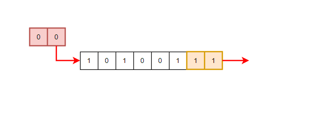
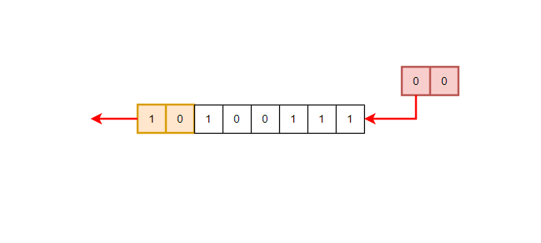
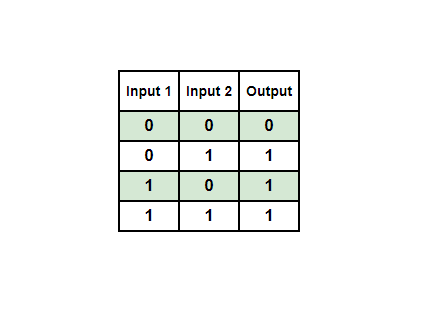
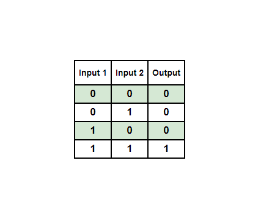
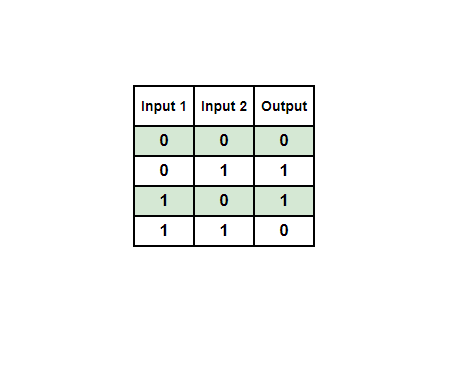
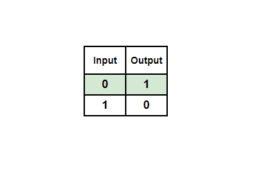

### Estructuras

Las estructuras o Structs son tipos de datos definidos por el usuario que permiten al programador agrupar los datos de diferentes tipos de datos en una sola unidad. Los structs se pueden utilizar para almacenar datos relacionados con un objeto en particular. Los structs ayudan a organizar grandes cantidades de datos relacionados de una manera que se puede acceder y manipular fácilmente. Cada artículo dentro de una estructura se llama "miembro" o "elemento", estos términos se utilizan indistintamente dentro del curso.

Una ocurrencia común que se verá cuando se trabaja con la API de Windows es que algunas API requieren una estructura poblada como entrada, mientras que otras tomarán una estructura declarada y la poblen. A continuación un ejemplo de la `THREADENTRY32`struct, no es necesario entender para qué se utilizan los miembros en este punto.

```c
typedef struct tagTHREADENTRY32 {
  DWORD dwSize; // Member 1
  DWORD cntUsage; // Member 2
  DWORD th32ThreadID;
  DWORD th32OwnerProcessID;
  LONG  tpBasePri;
  LONG  tpDeltaPri;
  DWORD dwFlags;
} THREADENTRY32; 
```

#### Declarar una estructura

Las estructuras utilizadas en este curso generalmente se declaran con el uso de `typedef`palabra clave para dar a una estructura un alias. Por ejemplo, la estructura de abajo se crea con el nombre `_STRUCTURE_NAME`pero, `typedef`añade otros dos nombres, `STRUCTURE_NAME`y `*PSTRUCTURE_NAME`.

```c
typedef struct _STRUCTURE_NAME {

  // structure elements

} STRUCTURE_NAME, *PSTRUCTURE_NAME;
```

El `STRUCTURE_NAME`alias se refiere al nombre de la estructura, mientras que `PSTRUCTURE_NAME`representa un puntero a esa estructura. Microsoft generalmente utiliza el `P`prefijo para indicar un tipo de puntero.

#### Inicialización de una estructura

La inicialización de una estructura variará dependiendo de si uno está inicializando el tipo de estructura real o un puntero a la estructura. Continuando con el ejemplo anterior, inicializar una estructura es el mismo cuando se utiliza `_STRUCTURE_NAME`o o `STRUCTURE_NAME`, como se muestra a continuación.

```c
STRUCTURE_NAME    struct1 = { 0 };  // The '{ 0 }' part, is used to initialize all the elements of struct1 to zero
// OR
struct _STRUCTURE_NAME   struct2 = { 0 };  // The '{ 0 }' part, is used to initialize all the elements of struct2 to zero
```

Esto es diferente al inicializar el puntero de la estructura, `PSTRUCTURE_NAME`.

```c
PSTRUCTURE_NAME structpointer = NULL;
```

#### Inicialización y acceso a las estructuras Miembros

Los miembros de una estructura pueden ser inicializados directamente a través de la estructura o indirectamente a través de un puntero a la estructura. En el ejemplo siguiente, la estructura `struct1`tiene dos miembros, `ID`y `Age`, inicializado directamente a través del operador de puntos (`.`).

```c
typedef struct _STRUCTURE_NAME {
  int ID;
  int Age;
} STRUCTURE_NAME, *PSTRUCTURE_NAME;

STRUCTURE_NAME struct1 = { 0 }; // initialize all elements of struct1 to zero
struct1.ID   = 1470;   // initialize the ID element
struct1.Age  = 34;     // initialize the Age element
```

Otra forma de inicializar a los miembros es el uso _de la sintaxis inicializado designada_ donde se puede especificar qué miembros de la estructura inicializar.

```c
typedef struct _STRUCTURE_NAME {
  int ID;
  int Age;
} STRUCTURE_NAME, *PSTRUCTURE_NAME;

STRUCTURE_NAME struct1 = { .ID   = 1470,  .Age  = 34}; // initialize both the ID and the Age elements
```

Por otro lado, el acceso y la inicialización de una estructura a través de su puntero se realiza a través del operador de flecha (`->`).

```c
typedef struct _STRUCTURE_NAME {
  int ID;
  int Age;
} STRUCTURE_NAME, *PSTRUCTURE_NAME;

STRUCTURE_NAME struct1 = { .ID   = 1470,  .Age  = 34};

PSTRUCTURE_NAME structpointer = &struct1; // structpointer is a pointer to the 'struct1' structure

// Updating the ID member
structpointer->ID = 8765;
printf("The structure's ID member is now : %d \n", structpointer->ID);
```

El operador de flecha se puede convertir en formato punto. Por ejemplo, `structpointer->ID`es equivalente a `(*structpointer).ID`. Es decir, `structurepointer`es despreferenciado y luego se accede directamente.

### Enumeración

El tipo de datos de enum o enumeración se utiliza para definir un conjunto de constantes nombradas. Para crear una enumeración, la `enum`Se utiliza la palabra clave, seguida del nombre de la enumeración y una lista de identificadores, cada uno de los cuales representa una constante nombrada. El compilador asigna automáticamente los valores a las constantes, comenzando con 0 y aumentando por 1 para cada constante posterior. En este curso, enums se puede ver representando el estado de datos específicos, códigos de error o valores de devolución.

Un ejemplo de un enum es la lista de "Cielos de la Semana Santa" que contiene 7 constantes. En el ejemplo siguiente, el lunes tiene un valor de 0, el martes tiene un valor de 1, y así sucesivamente. Es importante tener en cuenta que las listas de Enum no se pueden modificar o acceder a ella usando el operador de punto (.). En su lugar, se accede a cada elemento directamente utilizando su valor constante.

```c
enum Weekdays {
  Monday,         // 0
  Tuesday,        // 1
  Wednesday,      // 2
  Thursday,       // 3
  Friday,         // 4
  Saturday,       // 5
  Sunday          // 6
};

// Defining a "Weekdays" enum variable 
enum Weekdays EnumName = Friday;       // 4

// Check the value of "EnumName"
switch (EnumName){
    case Monday:
      printf("Today Is Monday !\n");
      break;
    case Tuesday:
      printf("Today Is Tuesday !\n");
      break;
    case Wednesday:
      printf("Today Is Wednesday !\n");
      break;
    case Thursday:
      printf("Today Is Thursday !\n");
      break;
    case Friday:
      printf("Today Is Friday !\n");
      break;
    case Saturday:
      printf("Today Is Saturday !\n");
      break;
    case Sunday:
      printf("Today Is Sunday !\n");
      break;
    default:
      break;
}
```

### Unión

En el lenguaje de programación C, una [Unión](https://learn.microsoft.com/en-us/cpp/cpp/unions?view=msvc-170) es un tipo de datos que permite el almacenamiento de varios tipos de datos en la misma ubicación de memoria. Los sindicatos proporcionan una manera eficiente de utilizar una sola ubicación de memoria para múltiples propósitos. Los sindicatos no se utilizan comúnmente, pero se pueden ver en estructuras definidas por Windows. El siguiente código ilustra cómo definir una unión en C:

```c
union ExampleUnion {
   int    IntegerVar;
   char   CharVar;
   float  FloatVar;
};
```

`ExampleUnion`puede almacenar `char`, `int`y `float`Tipos de datos en la misma ubicación de memoria. Para acceder a los miembros de un sindicato en C, se puede utilizar el operador de puntos, similar al utilizado para las estructuras.

Es importante tener en cuenta que en un sindicato, asignar un nuevo valor a cualquier miembro, cambiará el valor de todos los demás miembros también porque comparten la misma ubicación de memoria para almacenar sus datos. Además, la memoria asignada a un sindicato es igual al tamaño de su miembro más grande.

### Operadores Bitwise

Los operadores de bitwise son operadores que manipulan los bits individuales de un valor binario, realizando operaciones en cada posición de bit correspondiente. A continuación se muestran los operadores a bitt:

- Cambio de derecha (`>>`)
    
- Cambio de izquierda (`<<`)
    
- A poco de quirófano (`|`)
    
- Apetez y (`&`)
    
- Bitwise XOR (`^`)
    
- Apetecáis NO (`~`)
    

#### Cambio de derecha e izquierda

El cambio derecho (`>>`) y cambio a la izquierda (`<<`) los operadores se utilizan para desplazar los bits de un número binario a la derecha y a la izquierda por un número especificado de posiciones, respectivamente.

Cambiar los descartes derecho del mayor número de bits por el valor especificado y se insertan bits de la misma cantidad en la izquierda. Por ejemplo, la imagen de abajo muestra `10100111`cambiado por `2`, para convertirse `00101001`.



Por otro lado, el desplazamiento de los descartes izquierdos los bits más izquierdos y el mismo número de bits cero se insertan desde el lado derecho. Por ejemplo, la imagen de abajo muestra `10100111`cambiados dejados por `2`, para convertirse `10011100`.



#### Bitwise OR

La operación de OR bitwise es una operación lógica que implica dos valores binarios a nivel de bits. Evalúa cada pedacito del primer operando contra la parte correspondiente del segundo operando, generando un nuevo valor binario. El nuevo valor binario contiene un 1 en cualquier posición en la que uno o ambos de los bits correspondientes en los valores originales son 1.

La siguiente tabla representa la salida de OR bitwise con todos los bits de entrada posibles.


#### Bitwise AND

La operación bitwise AND es una operación lógica que implica dos valores binarios a nivel de bit. Esta operación fija los bits del nuevo valor binario a 1 sólo en el caso de que los bits correspondientes de ambos operandos de entrada sean 1.

La siguiente tabla representa la salida y salida con todos los bits de entrada posibles.



#### Bitwise XOR

La operación XOR bitwise (también conocida como OR exclusiva) es una operación lógica que implica dos valores binarios a nivel de bits. Si sólo uno de los bits es 1, el resultado en cada posición es 1. Por el contrario, si ambos bits son 0 o 1, la salida es de 0.

La siguiente tabla representa la salida XOR bitwise con todos los posibles bits de entrada.



#### Bitwise NOT

La operación de NO bitwise toma un número binario y gira todas sus partes. En otras palabras, cambia todos los 0s a 1s y todos los 1s a 0s. La siguiente tabla representa la salida de NO bitse con todos los bits de entrada posibles.



### Pasando por valor

Pasar por valor es un método de pasar argumentos a una función donde el argumento es una copia del valor del objeto. Esto significa que cuando un argumento se pasa por valor, el valor del objeto se copia y la función sólo puede modificar su copia local del valor del objeto, no el objeto original en sí.

```c
int add(int a, int b)
{
   int result = a + b;
   return result;
}

int main()
{
   int x = 5;
   int y = 10;
   int sum = add(x, y); // x and y are passed by value

   return 0;
}
```

### Pasando por referencia

Pasar por referencia es un método de pasar argumentos a una función donde el argumento es un puntero al objeto, en lugar de una copia del valor del objeto. Esto significa que cuando un argumento se pasa por referencia, la dirección de memoria del objeto se pasa en lugar del valor del objeto. La función puede entonces acceder y modificar el objeto directamente, sin crear una copia local del objeto.

```c
void add(int *a, int *b, int *result)
{
  
  int A = *a; // A is now the same value of a passed in from the main function
  int B = *b; // B is now the same value of b passed in from the main function
  
  *result = B + A;
}

int main()
{
   int x = 5;
   int y = 10;
   int sum = 0;

   add(&x, &y, &sum);
  
   // 'sum' now is 15
   
   return 0;
}
```