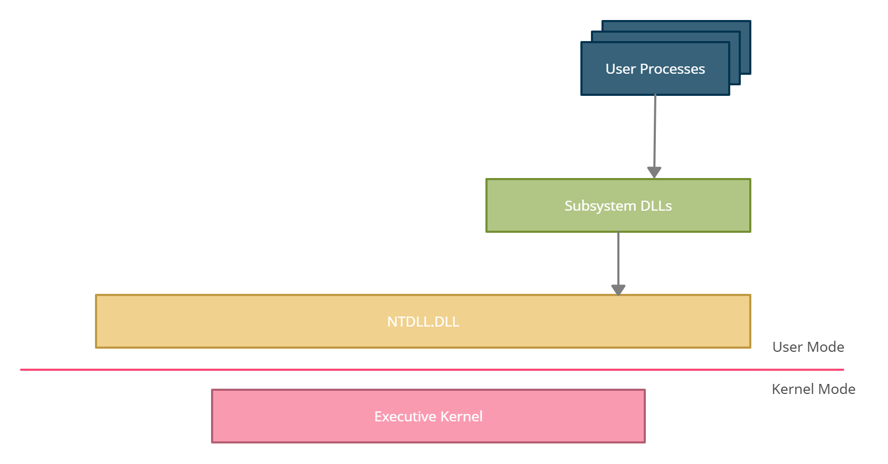
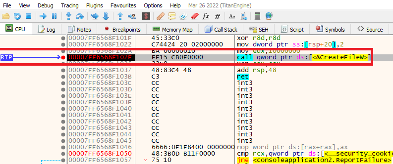
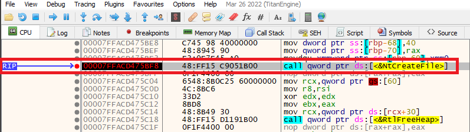
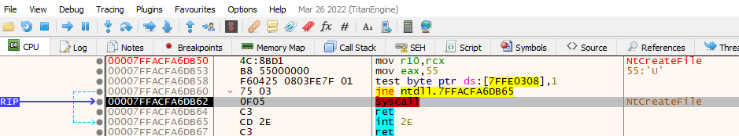

Un procesador dentro de una máquina que ejecuta el sistema operativo Windows puede operar bajo dos modos diferentes: Modo de usuario y modo de kernel. Las aplicaciones se ejecutan en modo de usuario, y los componentes del sistema operativo se ejecutan en modo núcleo. Cuando una aplicación quiere llevar a cabo una tarea, como la creación de un archivo, no puede hacerlo por sí sola. La única entidad que puede completar la tarea es el núcleo, por lo que en su lugar las aplicaciones deben seguir un flujo de llamada de función específica. El diagrama de abajo muestra un alto nivel de este flujo.

1. **Procesos de usuario** - Un programa/aplicación ejecutado por el usuario, como Notepad, Google Chrome o Microsoft Word.
    
2. **DLLs de subsistemas** - DLLs que contienen funciones de API que son llamadas por los procesos del usuario. Un ejemplo de esto sería `kernel32.dll`exportar la función [CreateFile](https://learn.microsoft.com/en-us/windows/win32/api/fileapi/nf-fileapi-createfilea) Windows API (WinAPI), otros subsistemas comunes DLLs son `ntdll.dll`, `advapi32.dll`, y `user32.dll`.
    
3. **Ntdll.dll** - DLL de ancho de sistema que es la capa más baja disponible en el modo de usuario. Este es un DLL especial que crea la transición del modo de usuario al modo kernel. Esto se conoce a menudo como la API nativa o NTAPI.
    
4. **Executive Kernel** - Esto es lo que se conoce como el kernel de Windows y llama a otros conductores y módulos disponibles dentro del modo del núcleo para completar tareas. El kernel de Windows se almacena parcialmente en un archivo llamado `ntoskrnl.exe`bajo "C:Windows-System32".

### Function Call Flow

La imagen de abajo muestra un ejemplo de una aplicación que crea un archivo. Comienza con la aplicación del usuario llamando a la `CreateFile`Función WinAPI que está disponible en `kernel32.dll`. `Kernel32.dll`es un DLL crítico que expone aplicaciones a la WinAPI y por lo tanto se puede ver cargada por la mayoría de las aplicaciones. A continuación, `CreateFile`llama a su función equivalente NTAPI, `NtCreateFile`, que se proporciona a través de `ntdll.dll`. `Ntdll.dll`entonces ejecuta una asamblea `sysenter`x86) o `syscall`(x64) instrucción, que transfiere la ejecución al modo del núcleo. El kernel `NtCreateFile`entonces se utiliza la función que llama a los controladores y módulos del kernel para realizar la tarea solicitada.

### Function Call Flow Example

Este ejemplo muestra el flujo de llamada de función que sucede a través de un depurador. Esto se hace fijando a un depurador a un binario que crea un archivo a través de la `CreateFileW`API de Windows.

La aplicación del usuario llama a la `CreateFileW` WinAPI.

A continuación, `CreateFileW`llama a su función equivalente NTAPI, `NtCreateFile`.

Finalmente, el `NtCreateFile`función utiliza un `syscall`instrucción de montaje para la transición del modo de usuario al modo kernel. El kernel será entonces el que crea el archivo.

### Directly Invoking The Native API (NTAPI)

Es importante tener en cuenta que las aplicaciones pueden invocar syscalls (es decir. Funciones de NTDLL) directamente sin tener que pasar por la API de Windows. La API de Windows simplemente actúa como una envoltura para la API nativa. Dicho esto, la API nativa es más difícil de usar porque no está oficialmente documentada por Microsoft. Además, Microsoft aconseja no utilizar las funciones de la API nativa porque se pueden cambiar en cualquier momento sin previo aviso.