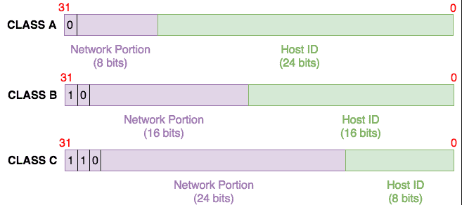

| Lol de bits of host | Longitud de prefijo equivalente | Máscara de subred | Número de direcciones IP utilizables |  |
| ---- | ---- | ---- | ---- | ---- |
| 1 | /31 | 255.255.255.254 | 0 = 2^(32-31) - 2 |  |
| 2 | /30 | 255.255.255.252 | 2 = 2^(32-30) - 2 |  |
| 3 | /29 | 255.255.255.248 | 6 = 2^(32-29) - 2 |  |
| 4 | /28 | 255.255.255.240 | 14 = 2^(32-28) - 2 |  |
| 5 | /27 | 255.255.255.224 | 30 = 2^(32-27) - 2 |  |
| 6 | /26 | 255.255.255.192 | 62 = 2^(32-26) - 2 |  |
| 7 | /25 | 255.255.255.128 | 126 = 2^(32-25) - 2 |  |
| 8 | /24 | 255.255.255.0 | 254 = 2^(32-24) - 2 |  |
| 9 | /23 | 255.255.254.0 | 510 = 2^(32-23) - 2 |  |
| 10 | /22 | 255.255.252.0 | 1022 = 2^(32-22) - 2 |  |
| 11 | /21 | 255.255.248.0 | 2046 = 2^(32-21) - 2 |  |
| 12 | /20 | 255.255.240.0 | 4094 = 2^(32-20) - 2 |  |
| 13 | /19 | 255.255.224.0 | 8190 = 2^(32-19) - 2 |  |
| 14 | /18 | 255.255.192.0 | 16378 = 2^(32-18) - 2 |  |
| 15 | /17 | 255.255.128.0 | 32766 = 2^(32-17) - 2 |  |
| 16 | /16 | 255.255.0.0 | 65534 = 2^(32-16) - 2 |  |
| 17 | /15 | 255.254.0.0 | 131070 = 2^(32-15) - 2 |  |
| 18 | /14 | 255.252.0.0 | 262142 = 2^(32-14) - 2 |  |
| 19 | /13 | 255.248.0.0 | 524286 = 2^(32-13) - 2 |  |
| 20 | /12 | 255.240.0.0 | 1048574 = 2^(32-12) - 2 |  |
| 21 | /11 | 255.224.0.0 | 2097150 = 2^(32-11) - 2 |  |
| 22 | /10 | 255.192.0.0 | 4194302 = 2^(32-10) - 2 |  |
| 23 | /9 | 255.128.0.0 | 8388606 = 2^(32-9) - 2 |  |
| 24 | /8 | 255.0.0.0 | 16777214 = 2^(32-8) - 2 |  |
| 25 | /7 | 254.0.0.0 | 33554430 = 2^(32-7) - 2 |  |
| 26 | /6 | 252.0.0.0 | 67075458 = 2^(32-6) - 2 |  |
| 27 | /5 | 248.0.0.0 | 134217726 = 2^(32-5) - 2 |  |
| 28 | /4 | 240.0.0.0 | 268435454 = 2^(32-4) - 2 |  |
| 29 | /3 | 224.0.0.0 | 536870910 = 2^(32-3) - 2 |  |
| 30 | /2 | 192.0.0.0 | 1073741822 = 2^(32-2) - 2 |  |
| 31 | /1 | 128.0.0.0 | 2147483646 = 2^(32-1) - 2 |  |
| 32 | /0 | 0.0.0.0 | 4294967294 = 2^(32-0) - 2 |  |

Una dirección IPv4 de unidifusión como 192.168.1.250 se puede dividir en dos partes: **parte de red** e **ID de host**. Entonces, ¿qué significa esto? Bueno, las direcciones IPv4 se [diseñaron originalmente](https://tools.ietf.org/html/rfc791) en función de las clases: Clase A a Clase E. Las direcciones de multidifusión se asignan desde el rango de Clase D, mientras que la Clase E se reserva para uso experimental, dejándonos con la Clase A a la C:

- **Clase A**: Utiliza los primeros 8 bits para la parte de red, dejando 24 bits para los ID de host. El bit situado más a la izquierda se establece en "0".
- **Clase B**: utiliza los primeros 16 bits para la parte de red, dejando 16 bits para los ID de host. Los dos bits situados más a la izquierda se establecen en "10".
- **Clase C**: utiliza los primeros 24 bits para la parte de red, dejando 8 bits para los ID de host. Los tres bits situados más a la izquierda se establecen en "110".

