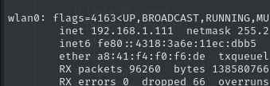

Tarjeta de red reconocida: WLAN0



Inicializar modo monitor: 
```
airmon-ng start wlan0
```


*El nombre de la red puede variar y no llamarse wlan0 e incluso cambiar una vez activo el modo
monitor.*

Matar procesos conflictivos: 
```
airmon-ng check kill 
```
o 
```
killall dhclient wpa_supplicant
```