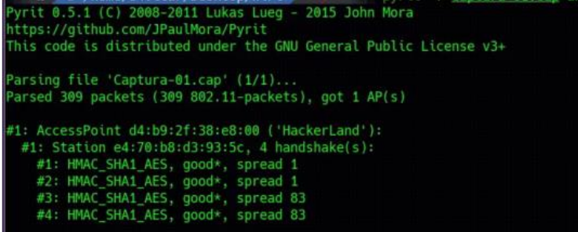
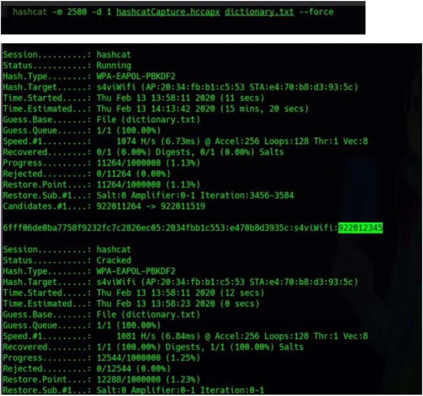
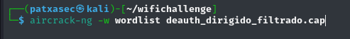
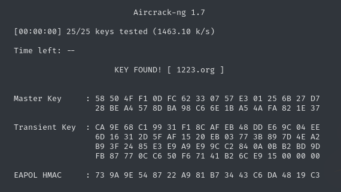

---

# Pyrit

***VERSIONES ANTIGUAS DE KALI Y PARROT***

*UTILIZADO PARA VERIFICAR EL ESTADO DE UNA CAPTURA EN LA QUE HAY UN HANDSHAKE Y VER SI EL HANDSHAKE ES VALIDO.*

```
pyrit -r <.cap> analyze
```



---

# Tratamiento y filtro de capturas


PARA PODER SEGUIR ADELANTE Y VER EL HANDSHAKE ES NECESARIO FILTRAR LA CAPTURA ADQUIRIDA DE LA SIGUIENTE MANERA PARA QUE EN AIRCRACK FUNCIONE:

```
Tshark -r <captura> -R "wlan.addr==<MAC> && (wlan.fc.type_subtype==0x08 || wlan.fc.type_subtype==0x05 || eapol)" -2 -w <nombre captura filtrada> -F pcap 2>/dev/null
```

![[tratamiento_captura.png]]

*verificar handshake*
`aircrack-ng <captura>`

# extracción del hash

Para extraer el hash y crackearlo, es necesario convertir la captura a HCCAP.

```
aircrack-ng -J <archivo salida .hccap> <captura>
```

![[create_hccap.png]]

```
hccap2john <.hccap> > <hash>
```

![[hash_final.png]]


## john

![[john_cracked.png]]

## hashcat



## aircrack-ng



