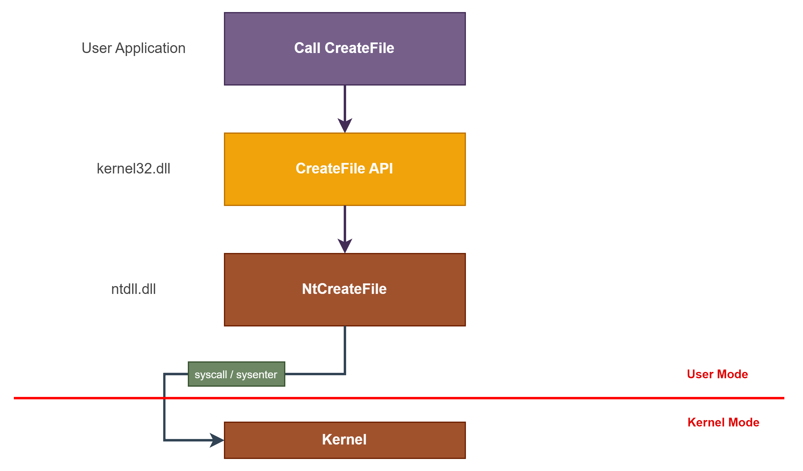

## 1. Introducción

- Explica cómo funciona Windows “por dentro” en términos de procesos y aplicaciones.
    
- Se centra en cómo las aplicaciones interactúan con el núcleo del sistema para completar tareas.
    

---

## 2. Modos de operación

Windows funciona en **dos modos principales**:

|Modo|Qué ejecuta|
|---|---|
|**User Mode**|Aplicaciones de usuario (Notepad, Chrome, Word, etc.)|
|**Kernel Mode**|Componentes del sistema operativo (drivers, kernel)|

- Las aplicaciones **no pueden ejecutar tareas críticas directamente** (como crear archivos). Deben pedir al kernel que las realice.
    

---

## 3. Componentes clave

|Componente|Descripción|
|---|---|
|**User Processes**|Programas ejecutados por el usuario.|
|**Subsystem DLLs**|DLLs que contienen funciones API llamadas por las aplicaciones. Ej.: `kernel32.dll` (CreateFile), `user32.dll`, `advapi32.dll`.|
|**Ntdll.dll**|DLL del sistema que forma la transición entre user mode y kernel mode. También se conoce como **Native API (NTAPI)**.|
|**Executive Kernel**|El núcleo de Windows (`ntoskrnl.exe`) que ejecuta tareas en kernel mode llamando a drivers y otros módulos.|

---

## 4. Flujo de llamada de funciones (Function Call Flow)

Ejemplo: crear un archivo desde una aplicación.

1. **Aplicación de usuario** llama a `CreateFile` de **kernel32.dll**.
    
2. `CreateFile` llama a `NtCreateFile` en **ntdll.dll**.
    
3. `NtCreateFile` ejecuta una instrucción de **syscall** (x64) o **sysenter** (x86) para pasar al **kernel mode**.
    
4. El **kernel** ejecuta la función, llama a drivers/módulos y crea el archivo.
    

> La Windows API (WinAPI) actúa como **wrapper** del Native API.

---

## 5. Llamadas directas al Native API (NTAPI)

- Las aplicaciones **pueden invocar NTDLL y syscalls directamente**, sin pasar por la WinAPI.
    
- **Precauciones:**
    
    - NTAPI no está oficialmente documentada.
        
    - Microsoft no recomienda su uso porque puede cambiar sin aviso.
        
- Ventaja: permite un control más bajo nivel y potencial optimización.
    

---

### 🔑 Conceptos clave

- **WinAPI**: Interfaz pública para aplicaciones.
    
- **NTAPI**: API nativa de Windows, más directa pero menos estable.
    
- **User Mode ↔ Kernel Mode**: Separación de privilegios y seguridad.
    
- **Flujo de llamadas**: App → WinAPI → NTAPI → Syscall → Kernel → Drivers.
    

---
