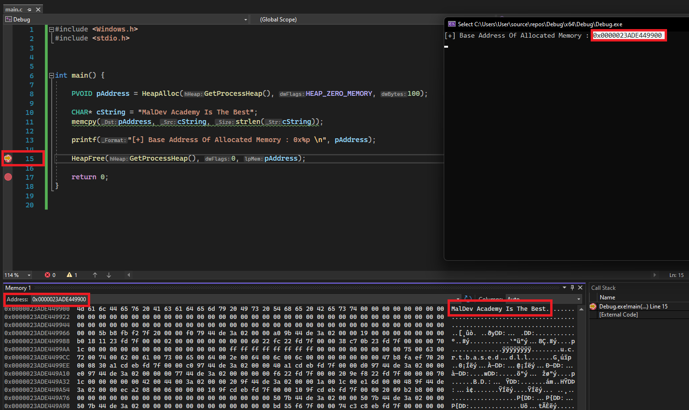
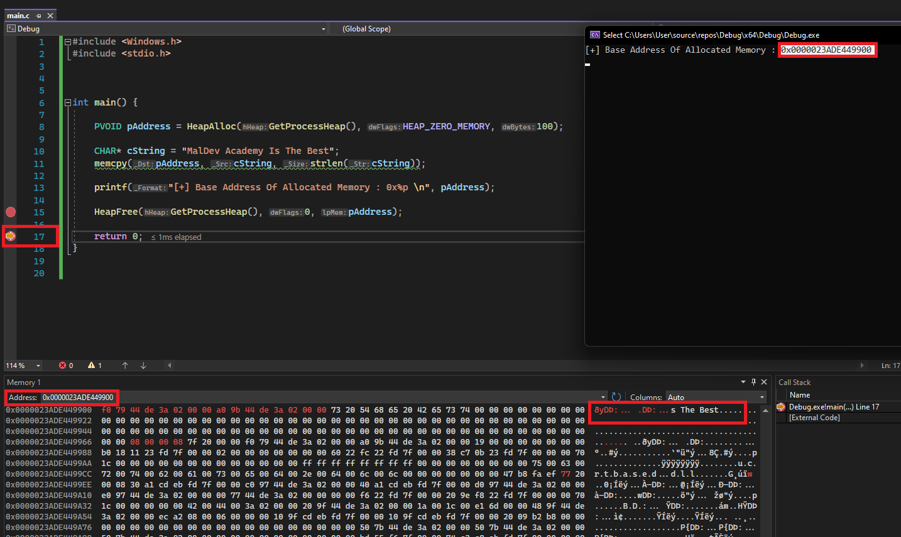

## 1. Introducción

- Explica cómo Windows maneja la memoria.
    
- Es esencial para comprender el desarrollo avanzado, optimización de procesos y análisis de malware.
    

---

## 2. Memoria Virtual y Paging

- Los procesos no acceden directamente a la RAM, sino a **direcciones de memoria virtual**.
    
- La memoria virtual puede mapearse a RAM o almacenarse en disco.
    
- Permite que varios procesos compartan la misma memoria física usando direcciones virtuales distintas.
    
- **Paging:** Memoria dividida en bloques de 4 KB llamados _pages_.
    

---

## 3. Estado de las páginas

|Estado|Descripción|
|---|---|
|**Free**|Página libre, no accesible, no reservada ni comprometida. Intentar acceder genera _access violation_.|
|**Reserved**|Página reservada para uso futuro, no accesible, sin almacenamiento físico asociado. Puede ser comprometida luego.|
|**Committed**|Página comprometida, memoria física o en disco asignada, accesible según protección. Inicializada al primer acceso.|

---

## 4. Opciones de protección de páginas

|Protección|Descripción|
|---|---|
|**PAGE_NOACCESS**|Sin acceso. Leer/escribir/ejecutar genera _access violation_.|
|**PAGE_EXECUTE_READWRITE**|Lectura, escritura y ejecución. Poco común, puede indicar malware.|
|**PAGE_READONLY**|Solo lectura, escribir genera _access violation_.|

---

## 5. Protección de memoria moderna

- **Data Execution Prevention (DEP):** Evita ejecución de código en regiones no ejecutables.
    
- **Address Space Layout Randomization (ASLR):** Desordena aleatoriamente la memoria para proteger contra vulnerabilidades.
    

---

## 6. Espacio de memoria x86 vs x64

|Tipo de proceso|Tamaño de memoria|
|---|---|
|**x86**|4 GB (0xFFFFFFFF)|
|**x64**|128 TB (0xFFFFFFFFFFFFFFFF)|

---

## 7. Ejemplo: Asignación de memoria

```c
// Asignando 100 bytes de memoria

// Método 1 - malloc()
PVOID pAddress = malloc(100);

// Método 2 - HeapAlloc()
PVOID pAddress = HeapAlloc(GetProcessHeap(), 0, 100);

// Método 3 - LocalAlloc()
PVOID pAddress = LocalAlloc(LPTR, 100);
```

- `pAddress` apunta al inicio del bloque de memoria.
    
- La protección asignada determina si se puede leer, escribir o ejecutar.
    

---

## 8. Ejemplo: Escritura en memoria

```c
PVOID pAddress = HeapAlloc(GetProcessHeap(), HEAP_ZERO_MEMORY, 100);
CHAR* cString = "MalDev Academy Is The Best";
memcpy(pAddress, cString, strlen(cString));
```

- `HEAP_ZERO_MEMORY` inicializa la memoria a cero.
    
- `memcpy` copia los datos al buffer asignado.
    

---

## 9. Liberación de memoria

- Es fundamental para **evitar memory leaks**.  

| Asignación | Liberación correspondiente |     |
| ---------- | -------------------------- | --- |
| malloc     | free                       |     |
| HeapAlloc  | HeapFree                   |     |
| LocalAlloc | LocalFree                  |     |
  
Las imágenes de abajo muestran `HeapFree` en acción, liberando la memoria asignada en la dirección `0000023ADE449900`. Aviso de la dirección `0000023ADE449900` todavía existe dentro del proceso, pero su contenido original fue sobrescrito con datos aleatorios. Estos nuevos datos se deben probablemente a una nueva asignación realizada por el sistema operativo dentro del proceso.





