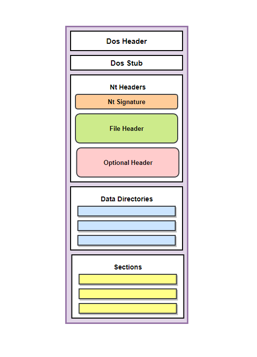

El **Portable Executable (PE)** es el formato de archivo para ejecutables en Windows, incluyendo `.exe`, `.dll`, `.sys` y `.scr`. Conocer su estructura es clave para crear software o analizar/reverse-engineer malware. Los ejecutables también se llaman “Images” en algunos contextos.

---

### **Estructura general de un PE**

Un archivo PE está compuesto por varios **headers** y **secciones**:

1. **DOS Header (IMAGE_DOS_HEADER)**
    
    - Primer header del archivo.
        
    - Comienza con la firma `MZ` (0x4D5A).
        
    - Contiene `e_lfanew`, un offset que apunta al inicio del **NT Header**.
        
    - Permite confirmar que un archivo es PE.

```c
typedef struct _IMAGE_DOS_HEADER { 
    WORD e_magic;     // "MZ"
    WORD e_cblp;      
    WORD e_cp;        
    WORD e_crlc;      
    WORD e_cparhdr;   
    WORD e_minalloc;  
    WORD e_maxalloc;  
    WORD e_ss;        
    WORD e_sp;        
    WORD e_csum;      
    WORD e_ip;        
    WORD e_cs;        
    WORD e_lfarlc;    
    WORD e_ovno;      
    WORD e_res[4];    
    WORD e_oemid;     
    WORD e_oeminfo;   
    WORD e_res2[10];  
    LONG e_lfanew;    // Offset al NT Header
} IMAGE_DOS_HEADER;
```
        
2. **DOS Stub**
    
    - Mensaje de error que se muestra si el programa se ejecuta en DOS: “This program cannot be run in DOS mode”.
        
    - No es un header, pero útil conocerlo.
        
3. **NT Header (IMAGE_NT_HEADERS)**
    
    - Contiene los subheaders:
        
        - **FileHeader**: información básica sobre el archivo.
            
        - **OptionalHeader**: información esencial para la ejecución.
            
    - Incluye la firma `PE` (0x50450000).
        
    - Existen versiones de 32 y 64 bits, principalmente diferidas por el `OptionalHeader`.
```c
typedef struct _IMAGE_NT_HEADERS {
  DWORD Signature;  
  IMAGE_FILE_HEADER FileHeader;
  IMAGE_OPTIONAL_HEADER32 OptionalHeader;
} IMAGE_NT_HEADERS32;
```
        



---

### **File Header (IMAGE_FILE_HEADER)**

- Información sobre el archivo:
    
    - `NumberOfSections`: número de secciones PE.
        
    - `Characteristics`: flags que indican tipo de archivo (DLL, EXE, consola, etc.).
        
    - `SizeOfOptionalHeader`: tamaño del siguiente header opcional.
        
```c
typedef struct _IMAGE_FILE_HEADER {
  WORD  Machine;
  WORD  NumberOfSections;
  DWORD TimeDateStamp;
  DWORD PointerToSymbolTable;
  DWORD NumberOfSymbols;
  WORD  SizeOfOptionalHeader;
  WORD  Characteristics;
} IMAGE_FILE_HEADER;
```

---

### **Optional Header (IMAGE_OPTIONAL_HEADER)**

- Esencial para la ejecución (a pesar del nombre “opcional”).
    
- Versiones 32 y 64 bits.
    
- Datos importantes:
    
    - `Magic`: indica si es 32 o 64 bits.
        
    - `AddressOfEntryPoint`: dirección de la función principal.
        
    - `ImageBase`: dirección base preferida en memoria.
        
    - `SizeOfImage`: tamaño total del archivo en bytes.
        
    - `DataDirectory`: array de 16 elementos con directorios de datos importantes (Export, Import, Recursos, Relocaciones, etc.).
        
**32-bit Version:**

```c
typedef struct _IMAGE_OPTIONAL_HEADER {
  WORD                 Magic;
  BYTE                 MajorLinkerVersion;
  BYTE                 MinorLinkerVersion;
  DWORD                SizeOfCode;
  DWORD                SizeOfInitializedData;
  DWORD                SizeOfUninitializedData;
  DWORD                AddressOfEntryPoint;
  DWORD                BaseOfCode;
  DWORD                BaseOfData;
  DWORD                ImageBase;
  DWORD                SectionAlignment;
  DWORD                FileAlignment;
  WORD                 MajorOperatingSystemVersion;
  WORD                 MinorOperatingSystemVersion;
  WORD                 MajorImageVersion;
  WORD                 MinorImageVersion;
  WORD                 MajorSubsystemVersion;
  WORD                 MinorSubsystemVersion;
  DWORD                Win32VersionValue;
  DWORD                SizeOfImage;
  DWORD                SizeOfHeaders;
  DWORD                CheckSum;
  WORD                 Subsystem;
  WORD                 DllCharacteristics;
  DWORD                SizeOfStackReserve;
  DWORD                SizeOfStackCommit;
  DWORD                SizeOfHeapReserve;
  DWORD                SizeOfHeapCommit;
  DWORD                LoaderFlags;
  DWORD                NumberOfRvaAndSizes;
  IMAGE_DATA_DIRECTORY DataDirectory[IMAGE_NUMBEROF_DIRECTORY_ENTRIES];
} IMAGE_OPTIONAL_HEADER32, *PIMAGE_OPTIONAL_HEADER32;
```

**64-bit Version:**

```c
typedef struct _IMAGE_OPTIONAL_HEADER64 {
  WORD                 Magic;
  BYTE                 MajorLinkerVersion;
  BYTE                 MinorLinkerVersion;
  DWORD                SizeOfCode;
  DWORD                SizeOfInitializedData;
  DWORD                SizeOfUninitializedData;
  DWORD                AddressOfEntryPoint;
  DWORD                BaseOfCode;
  ULONGLONG            ImageBase;
  DWORD                SectionAlignment;
  DWORD                FileAlignment;
  WORD                 MajorOperatingSystemVersion;
  WORD                 MinorOperatingSystemVersion;
  WORD                 MajorImageVersion;
  WORD                 MinorImageVersion;
  WORD                 MajorSubsystemVersion;
  WORD                 MinorSubsystemVersion;
  DWORD                Win32VersionValue;
  DWORD                SizeOfImage;
  DWORD                SizeOfHeaders;
  DWORD                CheckSum;
  WORD                 Subsystem;
  WORD                 DllCharacteristics;
  ULONGLONG            SizeOfStackReserve;
  ULONGLONG            SizeOfStackCommit;
  ULONGLONG            SizeOfHeapReserve;
  ULONGLONG            SizeOfHeapCommit;
  DWORD                LoaderFlags;
  DWORD                NumberOfRvaAndSizes;
  IMAGE_DATA_DIRECTORY DataDirectory[IMAGE_NUMBEROF_DIRECTORY_ENTRIES];
} IMAGE_OPTIONAL_HEADER64, *PIMAGE_OPTIONAL_HEADER64;
```

---

### **Data Directory**

- Cada elemento es un `IMAGE_DATA_DIRECTORY` con:
    
    - `VirtualAddress`: dirección virtual en memoria.
        
    - `Size`: tamaño del directorio.
        
- Algunos directorios clave:
    
    - Export Directory: funciones y variables exportadas por el PE (común en DLLs).
        
    - Import Address Table (IAT): funciones importadas de otros ejecutables.
        
```c
typedef struct _IMAGE_DATA_DIRECTORY {
    DWORD   VirtualAddress;
    DWORD   Size;
} IMAGE_DATA_DIRECTORY, *PIMAGE_DATA_DIRECTORY;

```

```c
#define IMAGE_DIRECTORY_ENTRY_EXPORT          0   // Export Directory
#define IMAGE_DIRECTORY_ENTRY_IMPORT          1   // Import Directory
#define IMAGE_DIRECTORY_ENTRY_RESOURCE        2   // Resource Directory
#define IMAGE_DIRECTORY_ENTRY_EXCEPTION       3   // Exception Directory
#define IMAGE_DIRECTORY_ENTRY_SECURITY        4   // Security Directory
#define IMAGE_DIRECTORY_ENTRY_BASERELOC       5   // Base Relocation Table
#define IMAGE_DIRECTORY_ENTRY_DEBUG           6   // Debug Directory
#define IMAGE_DIRECTORY_ENTRY_ARCHITECTURE    7   // Architecture Specific Data
#define IMAGE_DIRECTORY_ENTRY_GLOBALPTR       8   // RVA of GP
#define IMAGE_DIRECTORY_ENTRY_TLS             9   // TLS Directory
#define IMAGE_DIRECTORY_ENTRY_LOAD_CONFIG    10   // Load Configuration Directory
#define IMAGE_DIRECTORY_ENTRY_BOUND_IMPORT   11   // Bound Import Directory in headers
#define IMAGE_DIRECTORY_ENTRY_IAT            12   // Import Address Table
#define IMAGE_DIRECTORY_ENTRY_DELAY_IMPORT   13   // Delay Load Import Descriptors
#define IMAGE_DIRECTORY_ENTRY_COM_DESCRIPTOR 14   // COM Runtime descriptor
```

---

### **Secciones PE**

- Contienen código y datos del programa.
    
- Cada sección tiene un `IMAGE_SECTION_HEADER`.
    
- Secciones comunes:
    
    - `.text`: código ejecutable.
        
    - `.data`: datos inicializados.
        
    - `.rdata`: datos de solo lectura.
        
    - `.idata`: tablas de importación.
        
    - `.reloc`: información de relocación de memoria.
        
    - `.rsrc`: recursos como iconos y bitmaps.
        

**IMAGE_SECTION_HEADER** incluye información como:

- `Name`: nombre de la sección.
    
- `VirtualAddress`: offset en memoria.
    
- `VirtualSize`/`PhysicalAddress`: tamaño de la sección.
    
```c
typedef struct _IMAGE_SECTION_HEADER {
  BYTE  Name[IMAGE_SIZEOF_SHORT_NAME];
  union {
    DWORD PhysicalAddress;
    DWORD VirtualSize;
  } Misc;
  DWORD VirtualAddress;
  DWORD SizeOfRawData;
  DWORD PointerToRawData;
  DWORD PointerToRelocations;
  DWORD PointerToLinenumbers;
  WORD  NumberOfRelocations;
  WORD  NumberOfLinenumbers;
  DWORD Characteristics;
} IMAGE_SECTION_HEADER, *PIMAGE_SECTION_HEADER;
```

---

### **Conclusión**

- Entender los headers PE es complejo al inicio.
    
- No es obligatorio para aprender conceptos básicos.
    
- Para técnicas avanzadas de malware, se requiere parsear headers y secciones.
    

### Referencias adicionales

En caso de que se requiera una mayor clarificación en ciertas secciones, las siguientes [entradas](https://0xrick.github.io/) de blog en [el Blog de 0xRick](https://0xrick.github.io/) son muy recomendables.

- PE Overview - [https://0xrick.github.io/win-internals/pe2/](https://0xrick.github.io/win-internals/pe2/)
    
- DOS Header, DOS Stub y Rich Header - [https://0xrick.github.io/win-internals/pe3/](https://0xrick.github.io/win-internals/pe3/)
    
- NT Headers - [https://0xrick.github.io/win-internals/pe4/](https://0xrick.github.io/win-internals/pe4/)
    
- Directorios de datos, directores de sección y secciones - [https://0xrick.github.io/win-internals/pe5/](https://0xrick.github.io/win-internals/pe5/)
    
- PE Imports (Import Directory Table, ILT, IAT) - [https://0xrick.github.io/win-internals/pe6/](https://0xrick.github.io/win-internals/pe6/)

