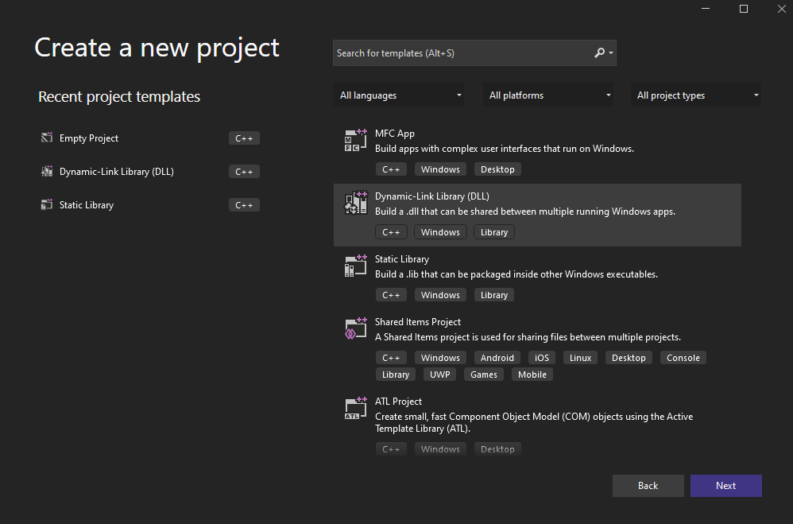
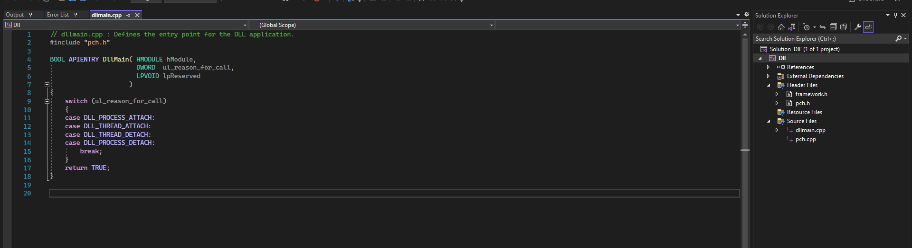

Los archivos `.exe` y `.dll` son **formatos ejecutables portátiles**, pero con diferencias clave:
   - `.exe` se puede ejecutar directamente con doble clic. 
   - `.dll` **no puede ejecutarse por sí misma**, necesita ser invocada por un programa.

---

### **¿Qué es una DLL?**

- Son **bibliotecas compartidas** de funciones o datos ejecutables.
    
- Pueden ser usadas **simultáneamente por múltiples aplicaciones**.
    
- Ejemplo: `CreateFileW` se exporta desde `kernel32.dll`; para usarla, el proceso debe cargar primero `kernel32.dll`.
    
- Algunas DLLs se cargan automáticamente en todos los procesos, como `ntdll.dll`, `kernel32.dll` y `kernelbase.dll`.
    
- Windows puede usar **direcciones base de DLLs comunes** para optimizar memoria y rendimiento.
    

---

### **Ventajas de usar DLLs**

1. **Modularización del código:** Divide el código en bibliotecas independientes para facilitar desarrollo y depuración.
    
2. **Reutilización de código:** Varias aplicaciones pueden usar la misma DLL.
    
3. **Eficiencia en memoria:** Varias aplicaciones comparten la misma DLL en memoria.
    

---

### **Creación de una DLL en Visual Studio**

1. Crear un nuevo proyecto y seleccionar **Dynamic-Link Library (DLL)**.
    
2. Se genera un archivo `dllmain.cpp` con código base.
    
3. **Punto de entrada de la DLL (DllMain):**
    
    - `DLL_PROCESS_ATTACH` → al cargar la DLL en un proceso.
        
    - `DLL_THREAD_ATTACH` → al crear un nuevo hilo.
        
    - `DLL_THREAD_DETACH` → al finalizar un hilo.
        
    - `DLL_PROCESS_DETACH` → al descargar la DLL.
        

---

### **Exportación de funciones**

- Para que una función sea accesible desde otra aplicación:
    
    ```c
   ////// sampleDLL.dll //////

#include <Windows.h>

// Exported function
extern __declspec(dllexport) void HelloWorld(){
    MessageBoxA(NULL, "Hello, World!", "DLL Message", MB_ICONINFORMATION);
}

// Entry point for the DLL
BOOL APIENTRY DllMain(HMODULE hModule, DWORD  ul_reason_for_call, LPVOID lpReserved) {
    switch (ul_reason_for_call) {
        case DLL_PROCESS_ATTACH:
        case DLL_THREAD_ATTACH:
        case DLL_THREAD_DETACH:
        case DLL_PROCESS_DETACH:
            break;
    }
    return TRUE;
}


    ```
    
- Una vez exportada, puede invocarse desde otra aplicación cargando la DLL en memoria.
    

---

### **Linkeo dinámico**

- Se pueden importar funciones de una DLL en **tiempo de ejecución** usando:
    
    - `LoadLibrary`
        
    - `GetModuleHandle`
        
    - `GetProcAddress`
        
- Ventaja: permite cargar y enlazar DLLs **solo cuando se necesitan**, en lugar de hacerlo en compilación.
    

**Pasos para invocar una función de DLL desde un EXE:**

1. **Cargar DLL**: `LoadLibrary("sampleDLL.dll")`
```c
#include <windows.h>

int main() {
    // Load the DLL
    HMODULE hModule = LoadLibraryA("sampleDLL.dll"); // hModule now contain sampleDLL.dll's handle

}
```
2. **Obtener handle**: `GetModuleHandle("sampleDLL.dll")` si ya está cargada.
```c
#include <windows.h>

int main() {
    // Attempt to get the handle of the DLL that's already in memory
    HMODULE hModule = GetModuleHandleA("sampleDLL.dll");

    if (hModule == NULL) {
        // If the DLL is not loaded in memory, use LoadLibrary to load it
        hModule = LoadLibraryA("sampleDLL.dll");
    }
}
```
3. **Obtener dirección de función**: `GetProcAddress(handle, "HelloWorld")`
```c
#include <windows.h>

int main() {
    // Attempt to get the handle of the DLL
    HMODULE hModule = GetModuleHandleA("sampleDLL.dll");

    if (hModule == NULL) {
        // If the DLL is not loaded in memory, use LoadLibrary to load it
        hModule = LoadLibraryA("sampleDLL.dll");
    }

    PVOID pHelloWorld = GetProcAddress(hModule, "HelloWorld"); /// pHelloWorld stores HelloWorld's function address
}
```
3. **Typecast** a puntero de función y **ejecutar** la función.
```c
#include <windows.h>

// Constructing a new data type that represents HelloWorld's function pointer 
typedef void (WINAPI* HelloWorldFunctionPointer)();

int main() {
    // Attempt to get the handle of the DLL
    HMODULE hModule = GetModuleHandleA("sampleDLL.dll");

    if (hModule == NULL) {
        // If the DLL is not loaded in memory, use LoadLibrary to load it
        hModule = LoadLibraryA("sampleDLL.dll");
    }

    PVOID pHelloWorld = GetProcAddress(hModule, "HelloWorld"); /// pHelloWorld stores HelloWorld's function address

    HelloWorldFunctionPointer HelloWorld = (HelloWorldFunctionPointer)pHelloWorld;
    
    return 0;
}
```

---

### **Ejemplo: MessageBoxA**

- Se puede llamar a funciones de DLLs estándar, como `MessageBoxA` desde `user32.dll`, usando punteros de función y `GetProcAddress`.
```c
typedef int (WINAPI* MessageBoxAFunctionPointer)( // Constructing a new data type, that will represent MessageBoxA's function pointer 
  HWND          hWnd,
  LPCSTR        lpText,
  LPCSTR        lpCaption,
  UINT          uType
);

void call(){
    // Retrieving MessageBox's address, and saving it to 'pMessageBoxA' (MessageBoxA's function pointer)
    MessageBoxAFunctionPointer pMessageBoxA = (MessageBoxAFunctionPointer)GetProcAddress(LoadLibraryA("user32.dll"), "MessageBoxA");
    if (pMessageBoxA != NULL){
        // Calling MessageBox via its function pointer if not null    
        pMessageBoxA(NULL, "MessageBox's Text", "MessageBox's Caption", MB_OK); 
    }
}
```

---

### **Convenciones de punteros de función**

- Se usan nombres prefijados con `fn`, por ejemplo:
    
    ```cpp
    typedef int (WINAPI* fnMessageBoxA)(HWND, LPCSTR, LPCSTR, UINT);
    ```
    

---

### **Ejecución sin código**

- Se puede ejecutar una función exportada directamente con **rundll32.exe**:
    
    ```cmd
    rundll32.exe <dllname>,<function>
    ```
    
- Ejemplo: `rundll32.exe user32.dll,LockWorkStation` para bloquear la PC.
    

---

### **Eliminación de encabezados precompilados**

- Visual Studio genera archivos `pch.h`, `pch.cpp` y `framework.h` que aceleran compilación, pero pueden eliminarse:
    
    1. Borrar los archivos del proyecto.
        
    2. Reemplazar `#include "pch.h"` por `#include <Windows.h>`.
        
    3. Cambiar la configuración de compilación a **“No usar encabezados precompilados”**.
        
    4. Renombrar `dllmain.cpp` a `dllmain.c` si se usa C puro.
        
