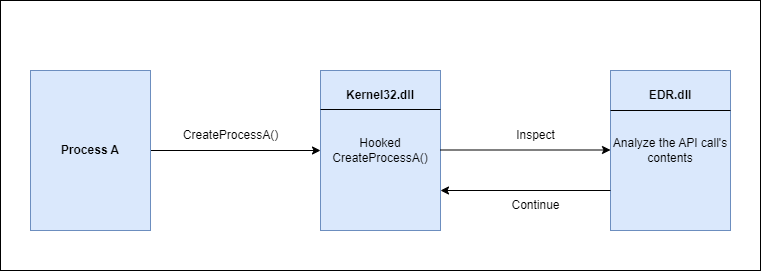
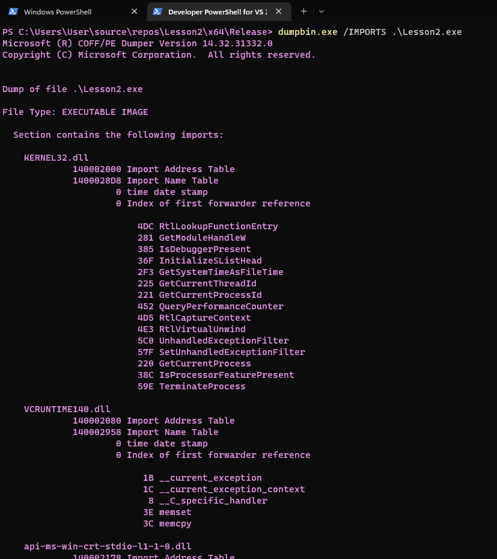

### **Detección de Malware: Principales Técnicas**

1. **Detección estática / por firma (Signature Detection)**
    
    - Se basa en identificar secuencias de bytes, cadenas o funciones que son únicas de un malware.
        
    - Herramientas como **YARA** permiten crear reglas de detección.
        
    - Fácil de evadir modificando el malware para que cambie estas características.
        
2. **Detección por hash (Hashing Detection)**
    
    - Se comparan los hashes (MD5, SHA256) de archivos conocidos con los archivos a analizar.
        
    - Muy rápida y simple, pero evadible modificando aunque sea un byte del archivo.
        
3. **Detección heurística (Heuristic Detection)**
    
    - Diseñada para detectar malware nuevo o modificado.
        
    - **Estática:** Analiza el código sin ejecutarlo, comparando fragmentos con malware conocido.
        
    - **Dinámica:** Ejecuta el archivo en un sandbox y observa comportamientos sospechosos.
        
4. **Análisis dinámico en sandbox (Dynamic Heuristic / Sandbox Detection)**
    
    - Ejecuta el malware en un entorno controlado y analiza su comportamiento.
        
    - Malware puede incluir técnicas anti-sandbox para simular comportamiento benigno y evitar ser detectado.
        
5. **Detección basada en comportamiento (Behavior-based Detection)**
    
    - Observa la actividad del malware mientras se ejecuta: uso de DLLs, llamadas a APIs, conexiones a internet, etc.
        
    - Acciones altamente sospechosas pueden causar terminación inmediata del proceso.
        
    - Se puede evadir comportándose como un proceso benigno o usando cifrado en memoria.
        
6. **API Hooking**
    
    - Soluciones como **EDRs** interceptan llamadas a APIs y analizan sus parámetros en tiempo real.
        
    - Combina detección en tiempo real y basada en comportamiento.
        
    - Técnicas de evasión incluyen **DLL unhooking** y **syscalls directos**.
        
1. **IAT Checking (Import Address Table)**
    
    - La IAT contiene los nombres de funciones y DLLs usadas por un ejecutable.
        
    - Permite detectar comportamientos sospechosos, como ransomware que usa funciones de cifrado y archivos.
        
    - Se puede evadir usando **API hashing**.
        
1. **Análisis manual**
    
    - Analistas de malware pueden identificar malware incluso si evade detección automática.
        
    - Técnicas anti-reversing pueden dificultar este análisis, incluyendo detección de depuradores o entornos virtualizados.
        
