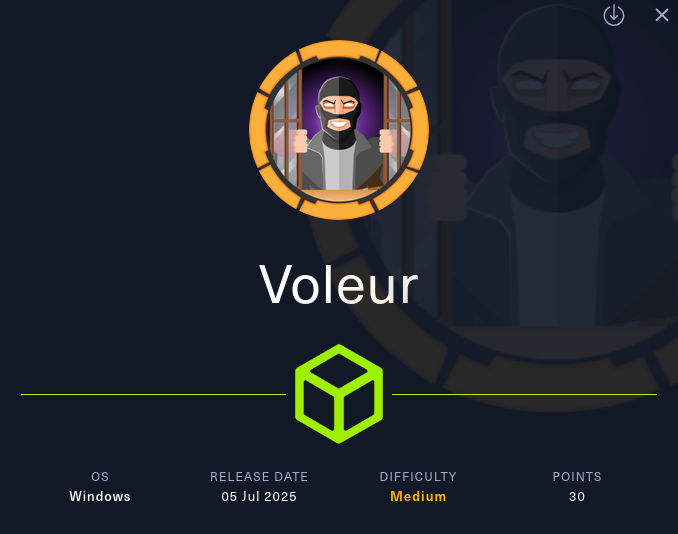

---

As is common in real life Windows pentests, you will start the Voleur box with credentials for the following account: `ryan.naylor` / `HollowOct31Nyt`

---

# Enumeración Inicial

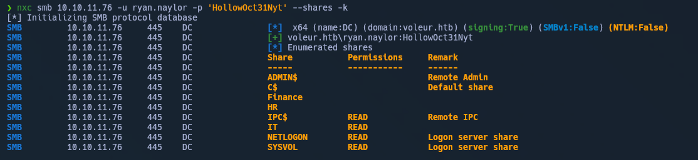


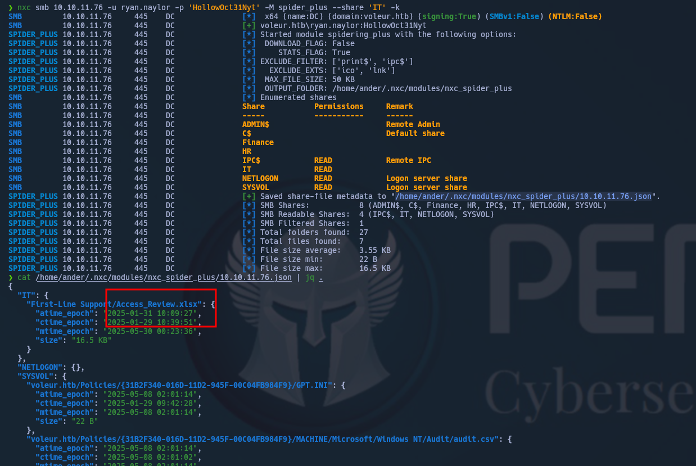


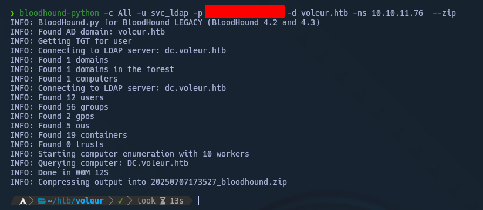


# Acceso

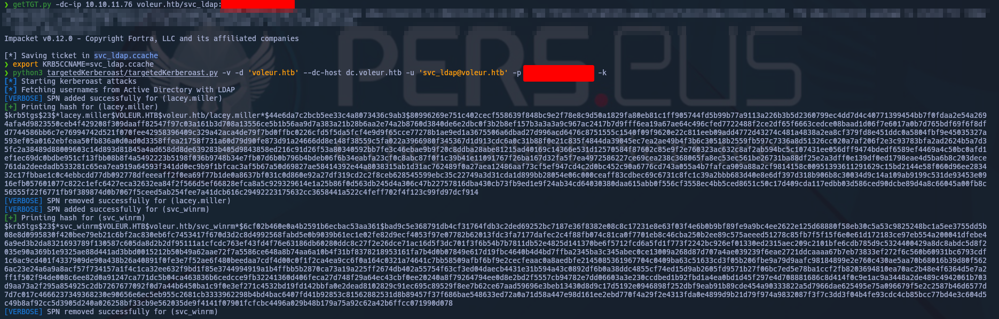

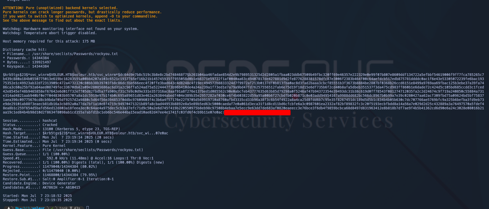


# Movimiento lateral y Escalada


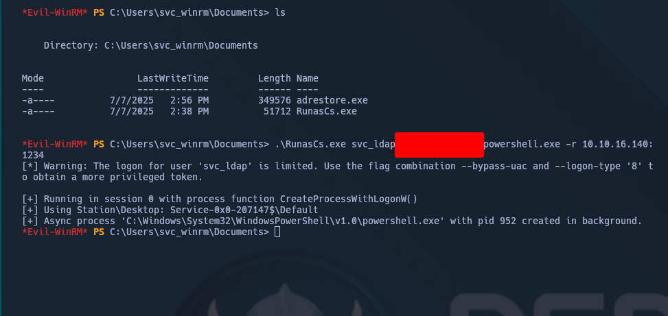


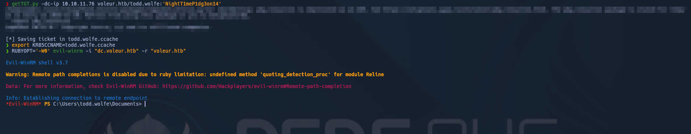

```bash
nxc smb dc.voleur.htb -u 'Todd.Wolfe' -p 'NightT1meP1dg3on14' -k --module spider_plus -o DOWNLOAD_FLAG=True SHARE=IT MAX_FILE_SIZE=0 EXCLUDE_EXT="['ico','lnk','db-journal','LOCK','LOG']"
```

por smbclient 

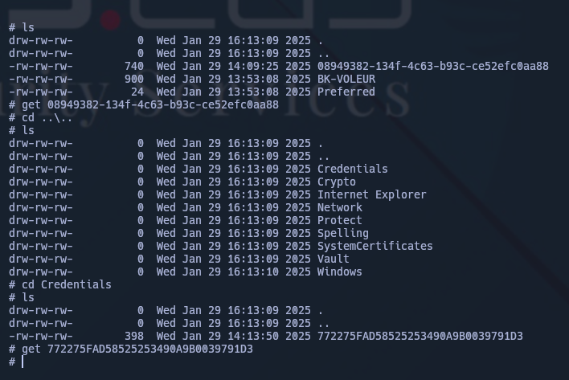


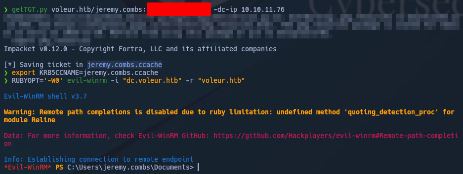

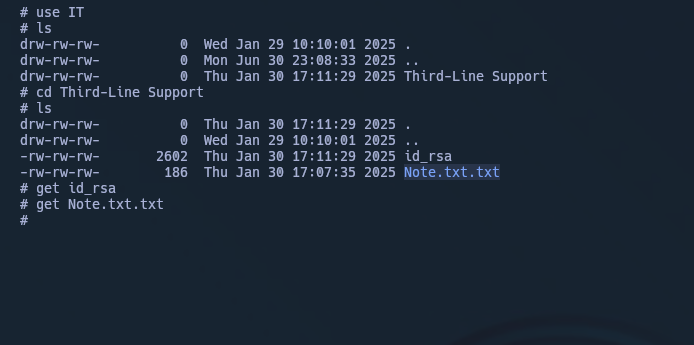
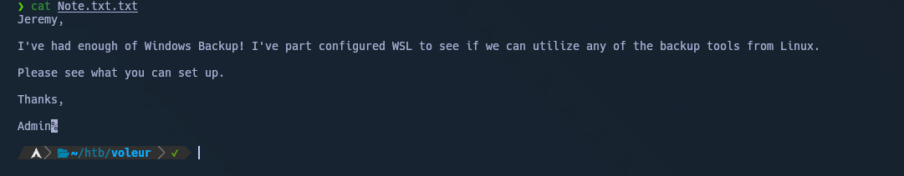

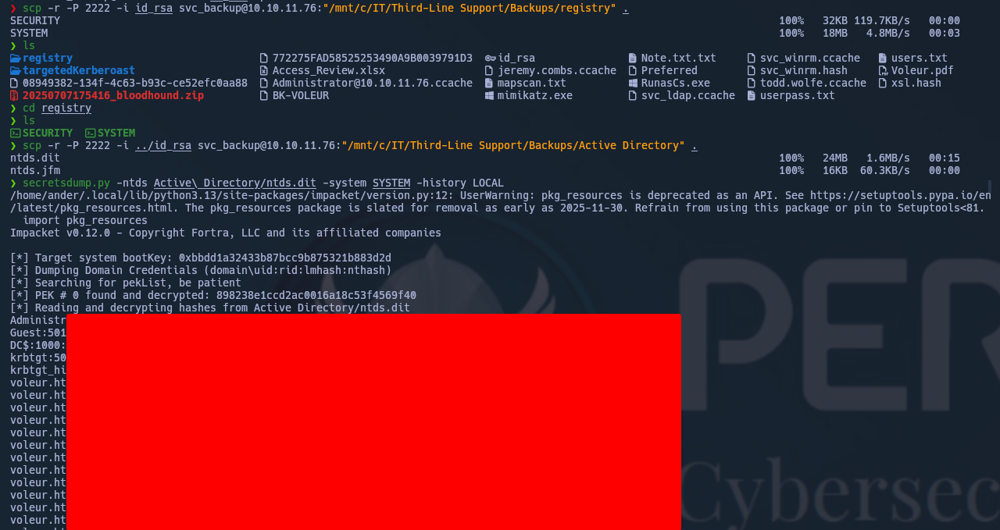


